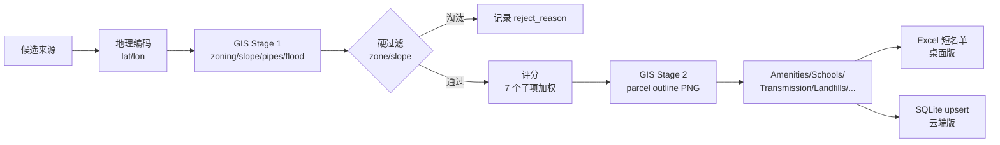

# 01 · 项目概述

> Auckland Property Shortlist（下称 **APS**）是一个面向奥克兰"拿地 / 旧房改造 / 开发选址"的"**候选 → 离线 GIS 富化 → 硬过滤 → 评分 → 短名单**"流水线工具。

---

## 1. 业务定位

现实场景中，投资或开发团队要从上千条 Trade Me listing 里挑出几十个值得去现场看的候选。痛点：

- **候选来源分散**：Trade Me / Excel / 经纪人邮件
- **GIS 约束强**：zoning、坡度、洪水、管线可达性直接决定"能不能做、成本多少"
- **信息噪音巨大**：listing 字段缺失 / 格式不统一
- **沟通成本高**：老板要的是 "Top N + 可解释理由"，不是一堆原始数据

APS 把"**人工初筛**"变成"**可复用的自动化流程**"：

1. 统一候选入口（Trade Me 抓取 / `Candidates.xlsx` 离线地址列表）
2. 对每个候选做离线 GIS 富化（zoning / pipes / flood / slope / amenities / schools / 管线 …）
3. 硬过滤（zone 不在允许表 / 坡度 > 1/3.73 直接淘汰）
4. 可解释评分（7 个子项 × 权重，详见 `03_desktop_pipeline.md` §4）
5. 输出 Excel 短名单或 Web 展示

---

## 2. 两种交付形态（核心理解）

APS 同一份核心代码支撑两种截然不同的交付形态。**这是理解整个 codebase 最关键的一点。**

| 维度 | 桌面版（Desktop） | 云端平台（Web） |
|---|---|---|
| 入口 | `aps_bootstrap.py` → `main.py:run()` | `run_web.py` → `web.app:create_app` |
| 打包 | PyInstaller onedir `.exe` | systemd service + uvicorn |
| 触发 | 用户双击手动运行 | cron 定时 + 用户手动触发 |
| 授权 | Ed25519 离线授权 + 机器绑定 + DPAPI | JWT cookie + bcrypt + RBAC |
| 数据库 | 无（直接写 Excel） | SQLite（WAL 模式） |
| 输出 | `property_shortlist_<start>_to_<end>.xlsx` | Web UI（Tabulator）+ SSE 推送 + Excel 导出 |
| 候选入口 | Trade Me 抓取 **+** `input/Candidates.xlsx` | Trade Me 抓取 **+** 用户手动输入地址 |
| 部署目标 | Windows 桌面 + 25 GB 本地 GIS 数据 | Oracle Cloud VM（Ubuntu）+ 17 GB GIS 数据 |
| 多用户 | 否（单机单用户） | 是（admin / premium / viewer 三种角色） |
| 典型用户 | 投资经理本地离线用 | 团队协作 + 客户访问 |

> **共享什么**：`enrichers/`（离线 GIS 富化）、`providers/trademe.py`（Trade Me 抓取）、`scoring.py`（评分）、`schema.py`（字段定义）。两种形态只是把同样的富化/评分流水线分别接到 Excel 和 SQLite + FastAPI 两种"下游"。

### 2.1 决策为什么要有桌面版

- 首批交付就是"**朋友/小圈子用户**"，没有云端基础设施
- 离线 GIS 数据量大（25 GB），传云端要先解决带宽和成本
- 客户电脑没有 Python 环境，PyInstaller 打包是最低交付门槛
- 配合 Ed25519 授权系统防止"转发整个 release 目录就能用"

### 2.2 决策为什么又要做云端版

- 团队协作（candidates 互相看、导出审计、admin 后台）
- cron 定时跑 Pipeline（用户不在电脑前也能攒数据）
- 手动输入单个地址立即富化（Worker 后台异步处理）
- 后续扩展（HTTPS / listing lifecycle tracking / WeChat 集成）需要服务端

---

## 3. 高层流水线（两种形态通用）



- **Stage 1** 是"便宜、能决定去留"的 GIS 指标 → 早退出省时间
- **Stage 2** 是"只对通过硬过滤的 shortlist 做"的昂贵步骤（parcel outline PNG 渲染、CV 查询、周边设施等）

---

## 4. 代码结构速览

```
akl_property_shortlist/
├── aps_bootstrap.py        桌面版 PyInstaller 入口（license gate → main.run()）
├── main.py                 核心业务流水线（~2090 行，run() 是桌面版主函数）
├── config.py               全局 SETTINGS 单例（读 config.json + 环境变量）
├── config.json             客户可编辑配置（output / top_n / zone_allowlist / 搜索参数）
├── scoring.py              7 子项加权评分
├── schema.py               Excel 输出列顺序
├── providers/
│   └── trademe.py          Trade Me 搜索 API + CV 查询（~1644 行）
├── enrichers/              11 个离线 GIS 富化器（~7600 行）
│   ├── gis.py              编排（frontage/zone/pipes/slope/flood/overland）
│   ├── gis_parcels.py      parcel 匹配 + frontage 分析
│   ├── gis_dem.py          DEM raster 坡度计算
│   ├── gis_overlays.py     zoning/flood/overland 叠加
│   ├── gis_render.py       parcel_outline PNG 渲染
│   ├── flood_hazards.py    三种洪水图层
│   ├── amenities.py        公交/公园/学校/医院就近
│   ├── schools.py          学区匹配
│   ├── transmission_lines.py  高压线距离
│   ├── state_houses.py     公屋密度
│   ├── watercare_capacity.py  供水管网容量分区
│   ├── closed_landfills.py 封场垃圾填埋场
│   └── rent.py             租金 baseline（占位实现）
├── aps_license/            Ed25519 离线授权（仅桌面版）
│   ├── runtime.py          enforce_license_or_exit
│   ├── machine_id.py       MachineGuid + SMBIOS UUID → SHA-256
│   ├── license_codec.py    Ed25519 签名验证
│   ├── dpapi.py            Windows DPAPI ctypes 包装
│   └── storage.py          ProgramData/AklPropertyShortlist/*.bin
├── web/                    云端平台（FastAPI + SQLite + Jinja2 + Tabulator）
│   ├── app.py              FastAPI create_app 工厂
│   ├── settings.py         pydantic-settings（读 .env）
│   ├── worker.py           独立 Enrichment worker 进程（systemd）
│   ├── notify.py           内存信号（SSE 推送用）
│   ├── column_map.py       row dict ↔ DB column 映射（中英文）
│   ├── auth/               JWT + bcrypt + RBAC
│   ├── db/                 SQLAlchemy + WAL + 6 张表
│   ├── routers/            8 个 router（shortlist/candidates/admin/...）
│   ├── services/           pipeline + reenrich + enrichment + export
│   ├── templates/          Jinja2 HTML（login/shortlist/candidates/admin）
│   └── static/             Tabulator + filter popover JS/CSS
├── alembic/                DB migrations（3 个 revision）
├── deploy/                 systemd units + cron + init-vm.sh + backup.sh
├── .github/workflows/      CI（pytest）+ PROD 手动部署
└── tests/web/              21 个 pytest 测试文件（云端平台）
```

---

## 5. 这份文档怎么读

| 目标 | 推荐路径 |
|---|---|
| 我是产品经理，想理解 APS 能干嘛 | 本文（01） → `03_desktop_pipeline.md` → `07_web_platform.md` |
| 我是工程师，要改 GIS 富化 | `02_architecture.md` → `04_gis_enrichers.md` → 相关 enricher |
| 我是运维，要部署/排障 | `09_deploy_cicd.md` → `10_config_dependencies.md` |
| 我是客户技术顾问 | 本文 → `02_architecture.md` → `11_roadmap.md` |

---

## 6. 关键外部数据资产

APS 严重依赖"**离线 GIS 数据**"，这些数据**不在 git repo 里**（太大），交付/部署时要单独上传：

| 数据集 | 大小 | 用途 |
|---|---|---|
| `dem_m_cog.tif` | 12 GB | DEM 高程 / 坡度计算 |
| `Overland_Flow_Paths_*.gpkg` | 1.7 GB | 地表径流路径 |
| `Flood_Hazard_Areas.gpkg` | 959 MB | 洪水灾害区域 |
| `Flood_Plains_*.gpkg` | 699 MB | 洪泛平原 |
| `nz-parcels.gpkg` | 479 MB | 地块 polygon 匹配 |
| `nz-addresses.gpkg` | 248 MB | LINZ 地址地理编码（Candidates 和 Web worker 必需） |
| `Wastewater_Pipe_2193.gpkg` | 183 MB | 污水管距离 |
| `Unitary_Plan_Base_Zone_2193.gpkg` | 157 MB | zoning 分区 |
| `Stormwater_Pipe_*.gpkg` | 105 MB | 雨水管距离 |
| `Transmission_Line_Spans_AKL_*.gpkg` | 11 MB | 高压线距离 |
| `school_enrolment_zones.gpkg` | 28 MB | 学区匹配 |
| 其余 ~12 份 | < 50 MB | 公园 / 医院 / 公交 / 公屋 / 封场 / Watercare / GTFS |

- **桌面版**：数据放在 `%APP_DIR%/data/`，打包时用户自己从 LINZ / Auckland Council 下载
- **云端版**：数据放在 `/opt/aps/data/`，首次 `init-vm.sh` 之后用 `rsync` 上传（详见 `09_deploy_cicd.md`）

---

## 7. 参考

- 源码根：`c:/Users/yumia/Downloads/akl_property_shortlist/`
- 原始 README：`README.md`（~500 行，面向最终用户，含完整使用指南）
- 部署 README：`deploy/README.md`（含分步 checklist）
- 交付介绍：`Akl Property Shortlist - Delivery Introduction.md`
