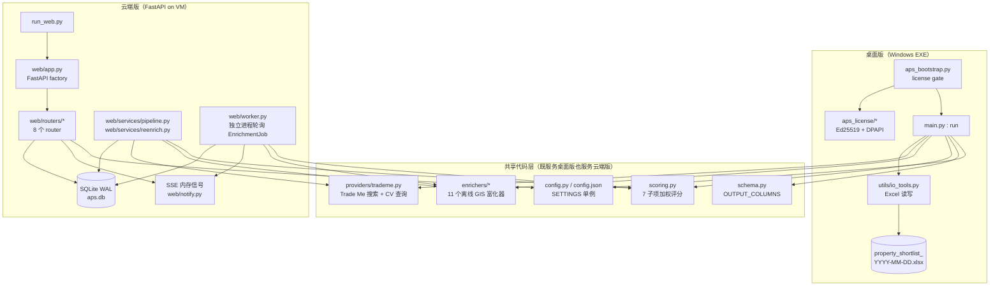
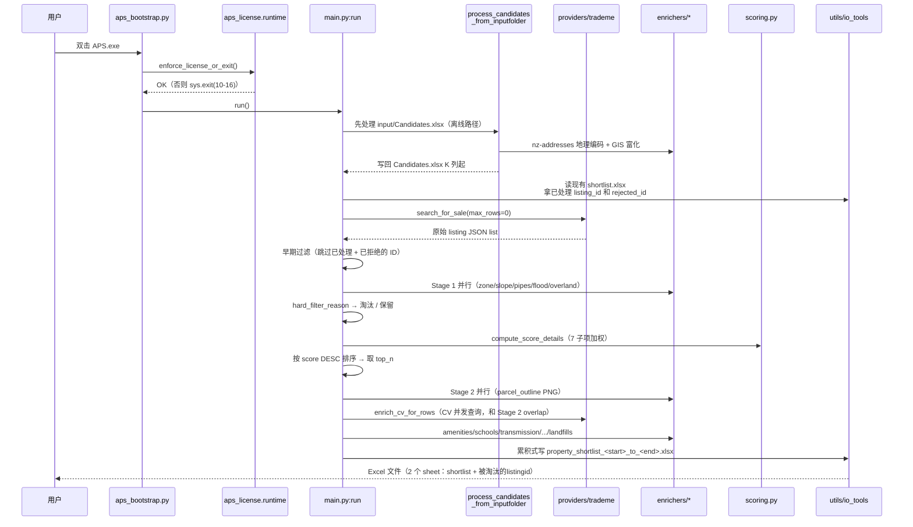
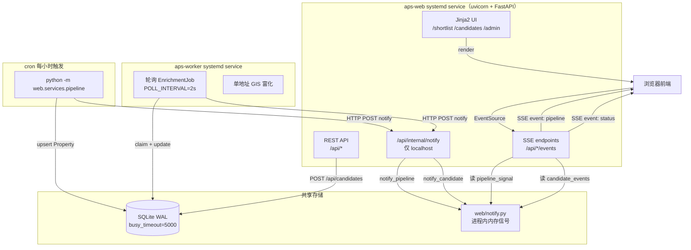

# 02 · 双形态架构对比

> 这一章回答两个问题：**桌面版和云端版的数据流分别长什么样？它们共享了哪些代码、在哪里分叉？**

---

## 1. 两种形态的边界（一图说清）



**关键观察**：
- `enrichers/` 是两个形态的公共 geospatial 内核
- `providers/trademe.py` 抓取层也是公用的
- 桌面版把结果写到 Excel；云端版把结果 upsert 到 SQLite
- **两条路径的前半段（raw → enrich → filter → score）本质上同构**，只是"下游存储"不同

---

## 2. 桌面版数据流（`aps_bootstrap.py` → `main.run()`）



- 入口约束：bootstrap 必须"先验证 license，再 import 重型 GIS 模块"，否则 license 检查本身加载慢会让用户不满（`aps_bootstrap.py:29-33`）
- 累积模式：每次运行只新增 listing_id，旧数据保留（`main.py:1954-2068`）
- Rejected 缓存：`被淘汰的listingid` sheet 让下次运行快速跳过已淘汰 ID（`main.py:1496-1530`）

---

## 3. 云端版数据流（三条并行线）

云端版是三个进程协作的系统，不再是"用户点一下跑完"：



关键设计决策：

### 3.1 为什么有独立 Worker

- Trade Me pipeline 是**批量**跑（每小时一次，几十到几百条）
- 用户通过 `/candidates` 输入的**单个地址**要立刻反馈（不能等下一轮 cron）
- Worker 进程独立：Web 服务重启时不影响正在跑的富化
- Worker 开启时先 `prewarm_gis()`（`web/worker.py:134-139`），首次查询从 30s 降到 1-2s

### 3.2 为什么用 HTTP 回调 + 内存信号做跨进程通信

- 最直接的方案本来是"DB 里放一个 watermark 让 SSE 轮询"，但会一直写 DB 造成 WAL 膨胀
- APS 选了"**Pipeline/Worker → HTTP POST `/api/internal/notify` → Web 进程里写 `pipeline_signal` / `candidate_signals` 内存字典 → SSE 从内存读**"
- `/api/internal/notify` 只允许 `127.0.0.1 / ::1 / localhost / testclient` 访问（`web/routers/internal.py:11-23`）
- 见 `web/notify.py:11-38`：`pipeline_signal`（全局）+ `candidate_signals`（按 user_id 分桶）+ `candidate_events`（asyncio.Event 映射）

### 3.3 为什么 SQLite 够用

- 单 VM 部署，并发只有几个团队内部用户
- WAL 模式 + `busy_timeout=5000` 处理并发写（`web/db/session.py:8-11`）
- 数据量小（properties 预估几千到几万行，不碰 SQLite 性能边界）
- 每日 `sqlite3 .backup` 冷备份 + WAL 热备份（`deploy/backup.sh`）

---

## 4. "公共流水线"如何在两个入口复用

这是 APS 最精妙的地方：**`main.py` 和 `web/services/pipeline.py` 都把 "enricher + 硬过滤 + 评分" 调用成同一个子流程，只是把结果落到不同地方**。

看 `web/services/pipeline.py:49-170` `_enrich_and_store()`：

```python
def _enrich_and_store(session, rows, pipeline_run_id, ...):
    from main import (
        compute_oldness, compute_listing_age_days, hard_filter_reason,
        _build_google_map_url, _format_overland_flow_display, _frontage_type_from_row,
    )
    # ... 直接从 main.py 导入桌面版实现的函数来复用
```

复用的函数清单：
- `compute_oldness` / `compute_listing_age_days` — 基础派生字段
- `hard_filter_reason` — 硬过滤规则（zone / slope）
- `_build_google_map_url` / `_format_overland_flow_display` / `_frontage_type_from_row` — 展示层派生

**这意味着**：改 `main.py` 里的硬过滤或派生逻辑，云端 Pipeline 自动跟进。这是"桌面版先做、云端版后加"的演化路径留下的痕迹，目前工作良好。

### 4.1 差异点（不要只看共性）

| 阶段 | 桌面版 | 云端版 |
|---|---|---|
| 候选来源 | Trade Me + `input/Candidates.xlsx` | Trade Me（pipeline）+ 用户 UI 输入（worker） |
| 去重依据 | 读 Excel `listing_id` 列 + `rejected` sheet | DB 查询 `Property.listing_id` + `reject_reason` 分组 |
| 并行策略 | `ProcessPoolExecutor`（CV 和 stage 2 overlap） | `APS_GIS_WORKERS=1` 默认串行（VM 资源紧张） |
| 结果落地 | 原子替换 tmp xlsx → 最终 xlsx | SQLite `on_conflict_do_update` upsert |
| 重跑 | 累积，新 listing_id 追加 | `web/services/reenrich.py` CLI，可选 redraw thumbnails / refresh CV |

---

## 5. 技术栈概览

| 层 | 桌面版 | 云端版 |
|---|---|---|
| 语言 | Python 3.11 | Python 3.11 |
| 打包 / 部署 | PyInstaller onedir | uvicorn + systemd + cron |
| 数据库 | — | SQLite 3 (WAL) + SQLAlchemy 2.0 + Alembic |
| Web 框架 | — | FastAPI 0.115 + Pydantic v2 + Pydantic Settings |
| 模板 | — | Jinja2 |
| 前端 | — | 纯 HTML + Tabulator（表格）+ 自研 filter-popover.js + EventSource（SSE） |
| 鉴权 | Ed25519 license + DPAPI + bcrypt（issuer 端） | JWT (PyJWT HS256) + bcrypt + cookie (httponly, SameSite=Lax) |
| GIS | geopandas + shapely + pyproj + rtree + rasterio | 同左 |
| Trade Me 抓取 | requests + 可选 Playwright fallback | 同左 |
| 图像 | matplotlib（parcel outline PNG）+ Pillow（DEM hillshade） | 同左 |
| CI/CD | — | GitHub Actions（`ci.yml` pytest + `deploy-prod.yml` 手动） |
| 云 | — | Oracle Cloud VM.Standard.A1.Flex 2 OCPU / 8 GB（ARM） |

---

## 6. 下一步建议阅读

- 想深入桌面 Pipeline 细节 → `03_desktop_pipeline.md`
- 想理解 GIS enricher 细节 → `04_gis_enrichers.md`
- 想理解授权系统 → `06_licensing.md`
- 想理解 Web 路由和 SSE → `07_web_platform.md`
- 想理解 DB schema 和字段映射 → `08_database.md`
