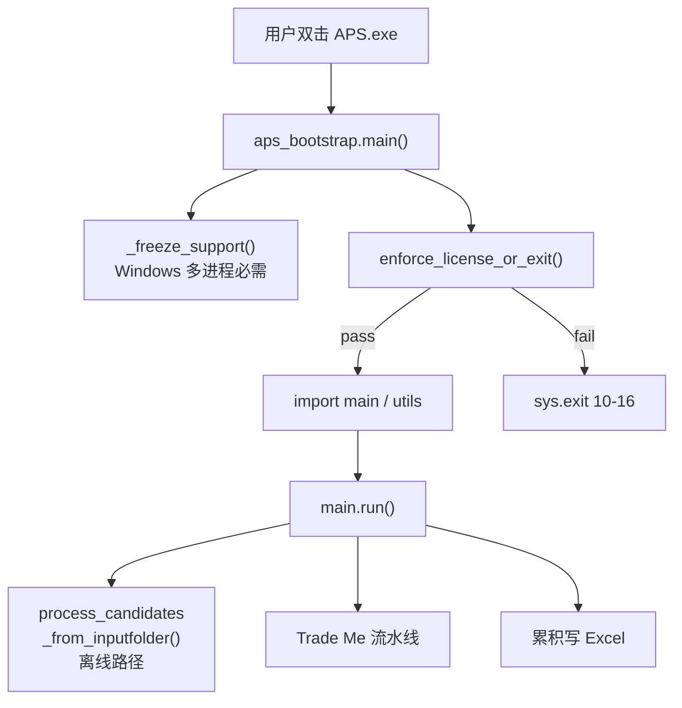
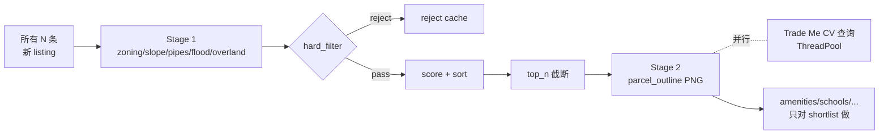

# 03 · 桌面版业务流水线（main.py）

> 对应文件：`main.py`（~2090 行）、`aps_bootstrap.py`、`scoring.py`、`schema.py`。本章讲"桌面版从候选到 Excel 这条主线"，不含授权（见 `06_licensing.md`）和 GIS 细节（见 `04_gis_enrichers.md`）。

---

## 1. 入口与调用栈



- `aps_bootstrap.py:26-73` — 入口 `main()`：先 freeze_support，再 license gate，再 import heavy stack
- `main.py:1435-2070` — `run()` 主业务函数（600+ 行单个函数）
- `main.py:73-1030` — `process_candidates_from_inputfolder()`（候选离线路径，~957 行）

> **注意**：`main.py` 是单文件长函数风格（`run()` ~600 行、`process_candidates` ~957 行）。这不是教科书风格，但符合 APS 作为"可打包的单体桌面工具"的定位。重构成多文件反而会让 PyInstaller 打包复杂化（frozen 模式的 `__file__` / `sys.executable` 解析更麻烦）。

---

## 2. 两条候选来源

### 2.1 Trade Me 在线搜索

`providers/trademe.py:708` `search_for_sale(max_rows=0)`：

- 调用 `https://api.trademe.co.nz/v1/search/property/residential.json`（同 Trade Me 官网同源的公开 JSON API）
- **不打开**每个 listing 详情页（速度第一）
- 分页抓取，直到达到 `listed_within_days` 窗口或 `max_pages`
- `max_rows=0` 表示"无限"，只受时间窗口和页数限制
- Fallback：如果 v1 API 被 403/429（很少见），代码里留了 Playwright 渲染入口，但默认不启用

### 2.2 离线 Candidates.xlsx

`main.py:73-1030` `process_candidates_from_inputfolder()`：

- 读 `./input/Candidates.xlsx` 第一张表 A 列（完整地址字符串）
- 用 `utils/nz_address_geocoder.NzAddressesGeocoder` 匹配 LINZ `nz-addresses.gpkg` → 拿到 lat/lon
- 对每个地址走同一套 GIS 富化（`enrichers/gis.py` + amenities/schools/...）
- 从工作簿**K 列**开始写结果（保留 A-J 列用户已有内容）
- L 列（地址）有值 → 视为已处理、跳过
- 地址匹配不到 → L 列写 `N/A`
- 对 `listing_id`/`listing_time` 这种 Trade Me 专属字段，在这条路径下留空

> **为什么从 K 列起**：用户已有的 Excel 模板通常 A-J 列记录自己的业务字段（初筛备注、优先级、预算等），APS 只在右侧追加 GIS 列，不破坏已有内容。

---

## 3. 去重与早退（性能关键）

`main.py:1455-1530`：

```python
existing_ids: set[str] = ...        # 从现有 xlsx 的 shortlist sheet listing_id 列读
rejected_ids: Dict[str, dict] = ... # 从现有 xlsx 的"被淘汰的listingid" sheet 读
```

对 `search_for_sale` 返回的每条 raw listing：

1. 取 `ListingId`（Trade Me 搜索层字段）
2. 如果 `s_lid in rejected_ids`（上次已淘汰）→ **skip**（不 enrich、不 score）
3. 如果 `s_lid in existing_ids`（已处理）→ **skip**
4. 否则 `kept.append(it)`

**效果**：每次运行只处理"新 listing"，老数据保留在 Excel 里。如果 `len(kept) == 0`，直接 `return`，**不 prewarm GIS、不查 CV**，整个运行可以在几秒内结束（`main.py:1525-1527`）。

---

## 4. 评分模型（`scoring.py:6-57`）

> **先看直觉**：把 7 个指标各归一化到 `[0, 1]`，加权求和就是 score。这是经典"MCDM 多属性决策"模型，不是 ML。

```python
f_frontage = norm_linear(row["frontage_m"], 8, 25)       # 越大越好
f_sewer    = norm_linear_inverted(row["sewer_distance_m"], 0, 30)   # 越小越好
f_storm    = norm_linear_inverted(row["stormwater_distance_m"], 0, 30)
f_rent3    = norm_linear(row["rent_avg_3br_pw"], 500, 1200)
f_slope    = norm_linear_inverted(row["slope_deg"], 0, 15)
f_land     = norm_linear(row["land_area_sqm"], 500, 1500)
f_old      = norm_linear(row["oldness_years"], 0, 80)

score = 0.20*f_frontage + 0.20*f_sewer + 0.10*f_storm
      + 0.15*f_rent3 + 0.10*f_slope + 0.20*f_land + 0.05*f_old
```

### 4.1 权重与归一化边界

全部在 `config.py:286-316` 的 `Settings` 类上，都可以用**环境变量**覆盖（不是 config.json 里，**客户端不开放**）：

| 子项 | 权重 | Norm 区间 | 方向 |
|---|---|---|---|
| frontage | 0.20 | 8 m ~ 25 m | 越大越好 |
| sewer | 0.20 | 0 m ~ 30 m | 越小越好（越近越好） |
| stormwater | 0.10 | 0 m ~ 30 m | 越小越好 |
| rent_3br_pw | 0.15 | $500 ~ $1200/周 | 越大越好 |
| slope | 0.10 | 0° ~ 15° | 越小越好 |
| land_area | 0.20 | 500 m² ~ 1500 m² | 越大越好 |
| oldness_years | 0.05 | 0 年 ~ 80 年 | 越大越好（老房拆建更划算） |

### 4.2 Missing 处理

- 缺失值归 `MISSING_NEUTRAL = 0.5`（中性，不加分也不减分）
- `MISSING_PENALTY = 0.0`（默认不额外扣分）
- 想要"惩罚缺失"就把 `MISSING_PENALTY` 调成 > 0

### 4.3 子分数也输出（可解释性）

`compute_score_details()` 返回 `(score, parts)`，其中 `parts` 字典含 `score_frontage / score_sewer / ... / score_zone`（`scoring.py:45-56`）。Excel 里每行都能看到**每个子项的归一化分**，方便调参和向客户解释。

> **注意**：`score_zone` 目前是 `None` 占位（`scoring.py:54`），因为 zoning 已经在 hard filter 阶段淘汰了不允许的 zone，通过的候选 zoning 对分数不再有区分度。

---

## 5. 硬过滤（`main.py:1377-1403` `hard_filter_reason`）

返回一个 reject_reason 字符串就淘汰，`None` 就保留：

| Reason | 条件 |
|---|---|
| `ZONE_MISSING` | `zone_code` 为空 |
| `ZONE_INVALID` | `zone_code` 不能转成 int |
| `ZONE_NOT_ALLOWED:<code>` | zone 不在 `config.json -> zone_allowlist` |
| `SLOPE_OVER_15_DEG` | `slope == ">1/3.73"` 桶（即 > 15°） |

默认 zone allowlist（`config.json`）：`18/60/8`（Mixed Housing Suburban / Urban / THAB）。可以加 `19`（Single House），但通常被注释掉因为 SH 密度太低不划算。

淘汰的 listing 会**写入 Excel 的缓存 sheet**（`被淘汰的listingid`），下次跳过（`main.py:2009-2043`）。

---

## 6. 两阶段 GIS（性能核心）



**Stage 1** 对全部 N 条做，但**不渲染 parcel outline**（那是昂贵步骤）。  
**Stage 2** 只对 Top N 做，且 **parcel outline 渲染和 CV 查询并发执行**（`main.py:1784-1835`）：
- outline 是 CPU-bound（matplotlib 渲染 + DEM hillshade）→ ProcessPoolExecutor
- CV 查询是 Network-bound（Trade Me listing JSON API）→ ThreadPoolExecutor
- 两者在同一个 wall-clock 窗口里 overlap，典型 shortlist（几十条）这步从 30s 降到 15s 左右

### 6.1 并行度自动决策（`main.py:1226-1298` `_parallel_cfg`）

| 行数 | CPU ≥ 4 | CPU < 4 |
|---|---|---|
| ≤ 1 | workers=1 | workers=1 |
| 2-3 | workers=1 | workers=1 |
| 4-19 | workers=min(4, N) | workers=min(4, N) |
| ≥ 20 | workers=min(6, N, CPU-1) | workers=min(4, N) |

优先级：`env var` → `SETTINGS.GIS_WORKERS` → auto。环境变量清单：
- `APS_GIS_WORKERS` / `APS_GIS_CHUNK_SIZE`（Stage 1）
- `APS_OUTLINE_WORKERS` / `APS_OUTLINE_CHUNK_SIZE`（Stage 2）
- `APS_CV_THREADS`（CV 并发线程数）

---

## 7. CV 查询细节（`providers/trademe.py:1321-1460`）

CV（Capital Value，官方估价）不在搜索层返回，需要请求单个 listing 详情：

- `fetch_cv_nzd(listing_id)` 先查本地 HTTP 缓存
- Miss 则 HTTP GET listing JSON API
- 用 `_deep_find_cv_in_json` 在嵌套 JSON 里深度递归找 CV-like 字段（`_is_cv_label` 匹配"Capital value / CV / RV / Rateable value"）
- 如果 JSON 里没有，再 fallback 到 HTML 解析（`_parse_cv_from_html`）
- 所有查询结果（包括 miss）都进缓存，避免重复请求

> **Delisted 保护**：已下架的 listing 永远 miss。这是 `web/services/reenrich.py` 默认 `skip_cv=True` 的原因——重跑时对 DB 里已有 CV 的 row 再查一次纯浪费（见 `07_web_platform.md`）。

---

## 8. Excel 输出（`utils/io_tools.py` 和 `schema.py`）

### 8.1 字段顺序（`schema.py:22-86` `OUTPUT_COLUMNS`）

约 50 列，分三段：
1. **主列**（listing_time / rank / address / zone / parcel_outline PNG / frontage / slope / flood / pipes / listing_url / lat-lon ...）
2. **Amenity 列**（public_transport / park / school / hospital / transmission / state_house / watercare / landfill）
3. **Score 列**（score 总分 + 7 个子分）

### 8.2 累积模式（`main.py:1945-2068`）

- 找现有 workbook → 读已有 rows → 合并新 rows（去重 listing_id 交由早期 skip 处理）→ 按 `listing_time DESC` 排序
- 从实际数据范围重算文件名（`property_shortlist_<min_date>_to_<max_date>.xlsx`）
- 写到临时文件 → `os.replace` 原子替换
- 旧文件如果名字不同则 unlink
- **被 Excel 占用**（`PermissionError`）→ 抛 `ExcelFileLockedError`（`utils/io_tools.py`）并 friendly 提示

### 8.3 特殊列

- `parcel_outline` — **嵌入 PNG 到单元格**（openpyxl XLImage，`main.py:process_candidates` 里的 xl_img = XLImage(io.BytesIO(...))）
- `google_map_url` — `_build_google_map_url(r)` 生成带 lat/lon pin 的 Google Maps URL；旧 `/maps/place/...` 格式自动升级（`main.py:1858-1861`）
- `overland_flow` — 从 `overland_flow_path` 结构化字段派生一个"人话版"文本（`_format_overland_flow_display`）
- `frontage_type` — 从 `frontage_segments_m` 和 parcel 形状推断（corner / flag lot / 普通）

---

## 9. 日志与可观测性

- `setup_logging()`（`utils/logging_tools.py`）— 同时写 file（`log/shortlist_YYYY-MM-DD.log`）和 console
- `log_console / log_summary` — 高价值的简短摘要（而不是 debug 级别的海量输出）
- `APS_LOG_LEVEL` 环境变量控制（默认 INFO；调试用 DEBUG；安静用 WARNING）
- `APS_GIS_TIMING=1` / `APS_GIS_SLOPE_TIMING=1` — 输出每阶段 ms 耗时（见 `main.py:1675-1695` `log_timing_summary`）

典型日志片段：

```
Existing workbook: output/property_shortlist_2026-04-15_to_2026-04-22.xlsx
Existing listing_id count=342
Rejected listing_id cache count=156 (sheet=被淘汰的listingid)
Shortlist: start (within_days=1 max_pages=2000 top_n=100000)
Fetched 1247 candidate items (after web fetch)
Early skip: skipped_rejected=78 skipped_existing=342 new_candidates=827
Shortlist GIS/CV: 827 new listing(s) to enrich
GIS stage1 config: workers=6 chunksize=4 rows=827
Shortlist GIS stage1 finished: rows=827
Hard-filter drop summary: ZONE_NOT_ALLOWED:19=215, SLOPE_OVER_15_DEG=31
Shortlist GIS stage2: rows=581 workers=6
CV config: workers=3 rows=581
Updated workbook: output/property_shortlist_2026-04-14_to_2026-04-22.xlsx
  (existing=342 new_added=581 total=923)
```

---

## 10. 常见调优方向

| 场景 | 建议 |
|---|---|
| 小机器跑卡（i5 4 核以下） | `APS_GIS_WORKERS=2 APS_OUTLINE_WORKERS=2 APS_CV_THREADS=1` |
| 大批量一次跑（1000+ listing） | 默认 auto 即可；确认 `data/` 在 SSD 上 |
| 只要看新的 listing | 保留现有 xlsx 就行，早期 skip 自动生效 |
| Excel 被锁报错 | 关掉 Excel 里打开的 xlsx；脚本自带 `assert_excel_closed` 检测 |
| 某条 listing 没算坐标 | 检查 Trade Me 那条 listing 的 `Latitude/Longitude`；`providers/trademe.py:283-336` `_extract_lat_lon_any` 尝试多个字段 |
| 评分权重不满意 | 设 env var：`WEIGHT_LAND_AREA=0.30 WEIGHT_FRONTAGE=0.10` 等 |

---

## 11. 已知局限

1. **`rent.py` 是占位实现**（`enrichers/rent.py:4-9`）—— `rent_avg_3br_pw` 永远 None，所以 `score_rent` 走 MISSING_NEUTRAL=0.5。真要 Trade Me rentals API 补齐需要单独开发
2. **单机单用户**：没有并发控制（多个人同时运行会覆盖彼此的 xlsx）
3. **Windows only**：DPAPI / PyInstaller onedir / wmic 取 UUID 都是 Windows-only 的（`aps_license/machine_id.py:119-123`）
4. **Trade Me 反爬风险**：`TRADEME_DELAY_SECONDS=0.35` 已经很礼貌，但 Trade Me 随时可能加验证码，到时要 fallback 到 Playwright
