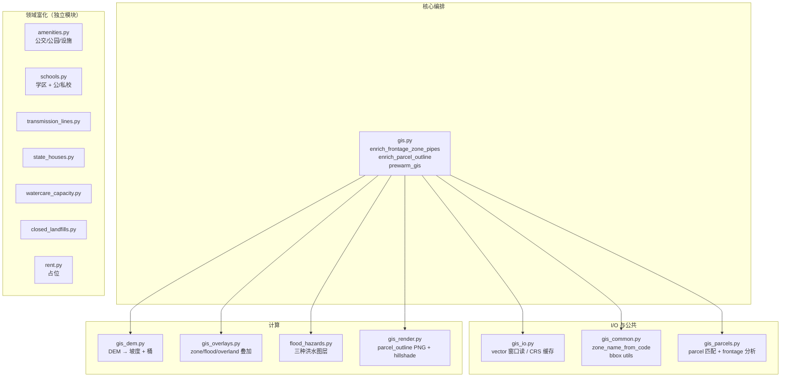

# 04 · 离线 GIS 富化模块（enrichers/）

> 这是 APS 的**核心技术壁垒**。`enrichers/` 下 ~7600 行代码覆盖"把一个 lat/lon 点变成可决策的 GIS 指标"的完整链路。本章只讲架构和接口，具体算法细节见源码注释。

---

## 1. 模块地图



**调用约定**：每个模块暴露两个接口
- `prewarm_*()` — 提前加载数据到进程内缓存（可选；失败不致命）
- `enrich_*_row(row)` / `enrich_*_rows(rows)` — 就地 mutate row dict，写入字段

这种接口让 `main.py` 和 `web/services/pipeline.py` 用同一份调用代码。

---

## 2. 公共设施

### 2.1 CRS 统一到 EPSG:2193

NZTM 2000（`EPSG:2193`）是新西兰官方平面坐标，单位是米。APS 所有距离/面积计算都在 2193 下做：

- `amenities.py:113-129` `_get_transformer()` 缓存 WGS84 → 2193 的 pyproj Transformer
- `gis_io.py:378-391` `_transform_bbox()` 负责跨 CRS 把 bbox 投到目标图层的 CRS
- 读取每个 gpkg 时用 `_get_dataset_crs` 缓存其原生 CRS

### 2.2 窗口读（性能核心）

所有 gpkg 都**不整文件读**。以坐标点为中心做 bbox window read：

- `gis_io.py:393-425` `_read_vector_window(path, layer, bbox_2193, columns)` — 只读 bbox 内 feature，且只读需要的列
- `gis_common.py:202-204` `_bbox_around_point(x, y, buffer_m)`
- 默认 buffer：`SETTINGS.GIS_BBOX_BUFFER_M = 600`（m）
- Parcel 匹配从 `GIS_PARCEL_SEARCH_START_M=150m` 起，最大 `GIS_PARCEL_SEARCH_MAX_M=1200m`（如果小窗口没命中就扩大）

### 2.3 进程内缓存

每个 enricher 用模块级变量缓存"预热后的 GeoDataFrame"。PyInstaller frozen 模式下 `prewarm_*()` 只在主进程生效，**ProcessPoolExecutor** 场景里每个 worker 进程第一次用的时候重新 prewarm（见 `main.py:1576-1581`）。

---

## 3. `gis.py`（核心编排）

### 3.1 `enrich_frontage_zone_pipes(row, render_outline=False, early_exit_on_hard_filter=True)`

`enrichers/gis.py:275-928`（~653 行）。对一条 row 做 Stage 1 全部：

1. **Parcel 匹配**（`gis_parcels.py:78-220`） — 从 `nz-parcels.gpkg` 找到 lat/lon 对应的 parcel polygon
   - 策略：从小窗口开始 contains 判断；没命中就扩大 buffer
   - 匹配到后把 `ParcelMatch(geom_2193, area_sqm, attrs)` 缓存到 row（`_cache_parcel_geometry_on_row`）
2. **Zoning**（`gis_overlays.py:244-310`） — 读 `Unitary_Plan_Base_Zone_2193.gpkg` 的 parcel 邻域；计算 parcel 与各 zone polygon 的相交面积；取面积最大者
   - 写 `zone_code`（int）、`zone_name`（Residential - Mixed Housing Urban 等）
3. **Slope**（`gis_dem.py:19-363`） — 从 `dem_m_cog.tif`（COG 格式）读 parcel bbox 小窗；`rasterio.mask` 裁到 parcel；对高程做 gradient + plane fit
   - 输出 `slope_deg`（mean）、`slope`（桶：`<1/10 / 1/10~1/7.14 / 1/7.14~1/5 / 1/5~1/3.73 / >1/3.73`）、`overall_slope`（整体 plane fit 方向）
4. **Pipes**（`gis_parcels.py:390-514`） — parcel polygon 到最近 pipe line 的距离，单位米
   - Wastewater / Stormwater 分别处理；搜索半径 `GIS_PIPE_SEARCH_RADIUS_M=100m`
5. **Flood**（`flood_hazards.py:541-545`） — 三个图层：Flood Plains / Flood Prone / Flood Hazard
   - 每个都算与 parcel 的 overlap 面积和比例；生成"覆盖区间"桶和详情文本
6. **Overland flow**（`gis_overlays.py:310-780`） — 地表径流路径是否穿过 parcel；`overland_flow_path` 字段存结构化数据，`_format_overland_flow_display` 派生人话版
7. **Frontage**（`gis_parcels.py:605-975`） — parcel 与道路 parcel 的相邻边；识别单边 / 双边 / corner lot
   - 输出 `frontage_m`（最大段的米数）或 `frontage_segments_m`（多段时用逗号拼）

### 3.2 Early exit（`SETTINGS.GIS_EARLY_EXIT_ON_HARD_FILTER=1`）

`enrich_frontage_zone_pipes` 里做 zoning+slope 之后立刻判断 hard_filter 条件：**zone 不允许** 或 **slope > 1/3.73** → 直接 return，**跳过后续 pipes/flood/overland/frontage**。
- 能省 40-60% 的 Stage 1 时间，因为 pipe/flood/overland 是贵的部分
- 可以用 env var `APS_GIS_EARLY_EXIT=0` 关掉（调试时想看完整数据）

### 3.3 `enrich_parcel_outline(row, fill_land_area=False)`

`enrichers/gis.py:1052-1330`（~278 行）。Stage 2 专用：渲染 parcel outline PNG（220px × 220px）用于 Excel 缩略图 / Web Tabulator 图标列。

调用 `gis_render._parcel_site_map_png()`：
- 画 parcel 轮廓（含"接入腿" access_leg 去除的区分，如 flag lot）
- 每条边的长度标注（米，`_plot_parcel_edge_lengths`）
- DEM hillshade 背景（`_dem_hillshade_uint8`）
- 叠加 Flood Plains / Flood Prone 多边形（不同颜色）
- 叠加 pipe 线和 overland flow path
- 纯 matplotlib 绘图；输出 bytes

---

## 4. Flood 模块（`flood_hazards.py:1-592`）

三个独立图层，每个都有独立的"resolve → window → compute → summary"链路：

| 图层 | 字段前缀 | 数据来源文件 |
|---|---|---|
| Flood Plains（洪泛平原）| `flood_plains_*` | `Flood_Plains_*.gpkg` |
| Flood Prone（易发洪水区）| `flood_prone_*` | `Flood_Prone_Areas_*.gpkg` |
| Flood Hazard（灾害等级） | 合并到前两者的 `_detail` 列 | `Flood_Hazard_Areas.gpkg` |

输出字段：
- `<prefix>_range` — 覆盖区间桶（`无` / `部分` / `全部` / 以及百分比带）
- `<prefix>_ratio` — 精确 overlap 比例（0-1）
- `<prefix>_detail` — 人话版文本（带 climate-adjusted 说明、hazard label）

### 4.1 Hazard label 排名（`_hazard_rank` / `_highest_hazard_label_for_geom`）

Hazard 图层里一个 parcel 可能被多种等级覆盖（Low / Medium / High / Very High）。取排名最高的作为 label，放到 flood_prone/plains 的 `_detail` 尾部。

---

## 5. 领域富化模块（domain enrichers）

这些是相对独立的"查一下"型富化，每个模块一个 gpkg/csv 数据源：

### 5.1 Amenities（`amenities.py:441-470`）

输出：
- `public_transport_nearest_m` — 最近公交站（GTFS `stops.txt`）
- `park_nearest_m` — 最近公园（`Park_Extents_*.gpkg`）
- `school_nearest_m` / `school_nearest_name` — 最近学校（`nz-facilities.gpkg`）
- `hospital_nearest_m` — 最近医院（`nz-facilities.gpkg`，用 `_fac_kind` 过滤 use="hospital"）

实现细节：`_GeomIndex` dataclass（`amenities.py:28-50`）包装了 shapely 几何列表 + rtree index + 属性字典，用 `_nearest_index` 做 O(log n) 最近查询。

### 5.2 Schools（`schools.py:592-619`）

输出：
- `public_school_zone_matches` — 当前位置落入哪些"著名公立学校"的 enrolment zone（多校合并）
- `private_school_nearest` — 最近著名私立学校距离（`<school_name> (2.3 km)` 格式）

数据：`school_enrolment_zones.gpkg` + `schools_directory.csv` + 两个 watchlist csv（`public_zone_watchlist.csv` / `private_distance_watchlist.csv`）。

### 5.3 Transmission Lines（`transmission_lines.py:307-325`）

输出 `transmission_line_nearest_m`。  
数据：`Transmission_Line_Spans_AKL_2193.gpkg`（Transpower 高压线段）。

### 5.4 State Houses（`state_houses.py:365-395`）

输出：
- `state_houses_200m` — 半径 200m 内公屋点数
- `state_house_nearest_m` — 最近公屋距离

数据：`housing_auckland_z16_points_2193.gpkg`（Kainga Ora 数据简化）。

### 5.5 Watercare Capacity（`watercare_capacity.py:201-226`）

输出 `watercare_capacity_area` — 所在供水管网容量分区（"High Capacity / Medium / Low / Constrained" 等文本，来自 Watercare 官方规划）。

### 5.6 Closed Landfills（`closed_landfills.py:201-229`）

输出：
- `closed_landfill_site_management_priority` — 封场管理优先级（High/Medium/Low）
- `closed_landfill_gas_generation_potential` — 填埋气产生潜势（影响建设成本/健康评估）

数据：`akl_dev_constraints.gpkg` 里的 closed_landfills 图层。

### 5.7 Rent（`rent.py`）

**占位实现**。永远返回 `rent_avg_{2,3,4}br_pw = None`。`scoring.py:18` 用到 `rent_avg_3br_pw`，缺失时走 `MISSING_NEUTRAL=0.5`。

要真正实现需要调用 Trade Me rentals API 按 suburb 分组拉 median weekly rent（`enrichers/rent.py:4-9` 注释里有 TODO）。

---

## 6. 数据文件名解析

每个 enricher 都有一个 `_resolve_data_dir()` / `_pick_dataset()` 模式，去在 `SETTINGS.DATA_DIR`（默认 `./data`，环境变量 `APS_DATA_DIR` 覆盖）下找对应文件：

- 先找"首选命名"
- Fallback 到 glob 模式（比如 `Flood_Plains_*.gpkg`）
- 找不到 → 该 enricher 功能 degrade（输出 None），但**不阻塞主流水线**

**典型文件名解析**（从 `deploy/README.md` 截的文件清单）：

| 数据集 | 用途 | 来源 |
|---|---|---|
| `nz-parcels.gpkg` | 地块 polygon | LINZ |
| `nz-addresses.gpkg` | 地址 geocoding | LINZ |
| `nz-roads-addressing.gpkg` / `nz-primary-road-parcels.gpkg` | 道路 + 临街判定 | LINZ |
| `Unitary_Plan_Base_Zone_2193.gpkg` | zoning | Auckland Council |
| `Wastewater_Pipe_2193.gpkg` / `Stormwater_Pipe_*.gpkg` | 管线 | Watercare |
| `Flood_*.gpkg` | 洪水 | Auckland Council |
| `Overland_Flow_Paths_*.gpkg` | 径流 | Auckland Council |
| `dem_m_cog.tif` | 坡度 | LINZ 8m DEM（COG 格式） |
| `Park_Extents_*.gpkg` | 公园 | Auckland Council |
| `school_enrolment_zones.gpkg` | 学区 | Ministry of Education |
| `housing_auckland_z16_points_2193.gpkg` | 公屋 | Kainga Ora 简化 |
| `watercare_network_capacity_areas_*.gpkg` | 管网容量 | Watercare |
| `akl_dev_constraints.gpkg` | 封场 | Auckland Council |
| `nz-facilities.gpkg` | 公共设施 | LINZ |
| `Transmission_Line_Spans_AKL_2193.gpkg` | 高压线 | Transpower |
| `stops.txt` | 公交站 | AT GTFS |
| `schools_directory.csv` | 学校目录 | MOE |

---

## 7. 并行和性能

### 7.1 Stage 1 并行（`utils/gis_parallel.enrich_rows_gis_parallel`）

- 输入：`rows` list + `workers + chunksize + prewarm`
- 内部用 `ProcessPoolExecutor`（Linux 用 fork，Windows 用 spawn 重新 import 模块）
- **Windows 一个大坑**：Python 子进程首次 import 时会重新加载整个 gis stack；解决办法就是每个子进程先 `prewarm_gis()`（`utils/gis_parallel.py` 里有 initializer）

### 7.2 Stage 2 并行（`enrich_parcel_outlines_parallel`）

同上，但渲染 PNG 是 **CPU-bound**。典型 shortlist 几十条，6 worker 下 wall-clock ~10s。

### 7.3 Timing 日志（`utils/perf_tools.log_timing_summary`）

每行 row 里会填一个 `_gis_timing` 字典，Stage 1 结束时做 min/avg/max 汇总（`main.py:1677-1695`）。示例：

```
GIS timing summary (ms) n=581:
  parcel_match_ms      min=3  avg=12   max=58
  zoning_read_ms       min=2  avg=8    max=31
  zoning_compute_ms    min=0  avg=2    max=15
  slope_total_ms       min=8  avg=22   max=140
  wastewater_read_ms   min=1  avg=6    max=24
  wastewater_dist_ms   min=0  avg=1    max=9
  ...
```

这对"哪些 listing 慢"一目了然。

---

## 8. 数据缺失与 warning

每个 row 可能带一个 `data_warnings` 字段（分号拼接的 warning code）：

```
data_warnings = "PARCEL_NOT_FOUND;OVERLAND_LAYER_MISSING"
```

`main.py:1621-1628` 会做汇总 log：

```
GIS warning summary: PARCEL_NOT_FOUND=12, OVERLAND_LAYER_MISSING=581
```

说明：
- `PARCEL_NOT_FOUND` — parcel 匹配失败（地址在海里 / 新填海 / 数据没覆盖），后续 GIS 全部 degrade
- `OVERLAND_LAYER_MISSING` — 该数据文件没放 `./data/` 下（不致命，但该字段空）
- 还有其他 code 见 `gis_common.py:96-102` `_append_warning`

这种 degrade 而非崩溃的设计让系统更鲁棒——**数据不全也能跑，只是那几列空**。

---

## 9. 工具脚本

`build_transmission_lines_gpkg.py` / `gpkg_schema_probe.py` / `tools/prepare_fast_vectors.py` / `utils/nz_address_geocoder.py` 等 —— 这些是**数据准备阶段**用的一次性脚本（从原始数据做 CRS 转换 / 裁剪到 AKL 区域 / 生成 spatial index），**不在运行时调用**。文档简要：

| 脚本 | 作用 |
|---|---|
| `gpkg_schema_probe.py` | 探查 gpkg 文件的 layer + columns + CRS（调试用） |
| `build_transmission_lines_gpkg.py` | 从 Transpower 原始 shp 裁到 AKL + 投影 2193 |
| `tools/prepare_fast_vectors.py` | 预生成 rtree spatial index（加速首次查询） |
| `utils/nz_address_geocoder.py` | LINZ nz-addresses.gpkg geocoding 封装（Candidates 离线路径 + Web worker 都用） |

---

## 10. 改 enricher 的 checklist

如果你要加一个新 enricher（比如"地震风险")：

1. 在 `enrichers/` 下新建 `earthquake_hazards.py`
2. 提供两个函数：`prewarm_earthquake_hazards()` 和 `enrich_earthquake_rows(rows)`
3. 在 `schema.py:OUTPUT_COLUMNS` 里加你的字段名
4. 在 `main.py:run()` 找到 amenity 块（~1879 行开始），加一段 `try/except` 调 `prewarm` + `enrich_rows`
5. 在 `web/services/pipeline.py:_enrich_and_store` 最后一段（`# Step 8: Amenity enrichments`）加同样一行
6. 在 `web/db/models.py:Property` 和 `Candidate` 加列 + alembic revision
7. 在 `web/column_map.py` 加 row key → db col + display 名
8. 如果要在 shortlist 页展示 → `web/templates/shortlist.html` 里加 Tabulator column

加列不用改 `scoring.py`，因为 score 是"选出来的 7 项"固定列表。除非你想把新指标也加到 score 里，那要同时改 `scoring.py` 和 `config.py` 的 weights/norm。

---

## 11. 参考

- Shapely / GeoPandas 文档：`geopandas.read_file` 的 `bbox` 参数支持窗口读
- Rasterio：COG（Cloud Optimized GeoTIFF）格式让 `dem_m_cog.tif` 12 GB 大文件也能做 bbox 读
- NZ 坐标系：EPSG:2193（NZTM 2000）是国内标准平面坐标，EPSG:4326（WGS 84）是全球经纬度
