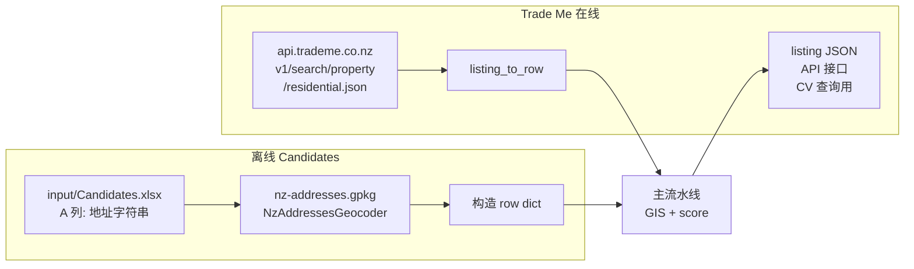

# 05 · 数据源抓取（providers/trademe.py 与离线候选）

> APS 的候选来源只有两个：**Trade Me 搜索 API** 和 **`input/Candidates.xlsx`**。本章讲两条链路的实现与约束。

---

## 1. 两条链路总览



---

## 2. Trade Me 搜索（`providers/trademe.py`，~1644 行）

### 2.1 入口 `search_for_sale(max_rows=50)`（`providers/trademe.py:708-854`）

工作流：
1. 从 `SETTINGS.TRADEME_SEARCH`（即 `config.json -> providers.trademe.search`）加载搜索参数
2. 计算 cutoff 日期：`as_of - listed_within_days + 1`（NZ 时区）
3. 对每页调 `_fetch_search_page_v1`（见下）
4. 解析每页的 `List` 数组，每条 item 走 `_node_to_api_like` 标准化
5. 按 `listed_date < cutoff` 早退（API 默认 `sort_order=expirydesc`，但 listed_date 通常同序）
6. 按 `ListingId` 去重
7. 达到 `max_pages` 或 `max_rows` 就停
8. 返回 list of dict（API-like 字段名，例如 `ListingId` / `Title` / `Price` / `Latitude` / `Longitude` / `LandArea` / `Bedrooms`）

### 2.2 同源 API 设计

`providers/trademe.py:46-48`：

```python
BASE_DOMAIN = "https://www.trademe.co.nz"
DEFAULT_SEARCH_BASE_URL = "https://www.trademe.co.nz/a/property/residential/sale/auckland/search"
SEARCH_API_ENDPOINT = "https://api.trademe.co.nz/v1/search/property/residential.json"
```

关键点：
- **不是官方开发者 API**（那个要申请 key）。是 Trade Me 官网自己 SPA 用的公开 JSON endpoint
- 附带 `Referer` header（指向网页 URL）降低被 bot 识别的概率
- 默认 User-Agent 是 Chrome 122（`providers/trademe.py:615-618`）
- `TRADEME_DELAY_SECONDS=0.35` + 0.25s 随机抖动（`_sleep`）

### 2.3 配置参数（`config.json` → `SearchConfig`）

`providers/trademe.py:552-634` 用 dataclass：

```python
@dataclass
class SearchConfig:
    base_url: str                    # 默认 Auckland 搜索页
    params: Dict[str, Any]           # price_max, land_area_min/max, property_type=house, sort_order=expirydesc
    listed_within_days: int          # 从 config.json 的 providers.trademe.search.listed_within_days
    max_pages: int                   # 从 config.json 的 providers.trademe.search.max_pages
    delay_seconds: float
    timeout_seconds: float
    user_agent: str
    page_param: str                  # "page"
    rows: int                        # 每页 rows 数（默认 50）
```

`config.json` 典型例子：
```json
{
  "providers": {
    "trademe": {
      "search": {
        "params": {
          "price_max": 50000000,
          "land_area_min": 0.02,
          "land_area_max": 10
        },
        "startdate": "",
        "listed_within_days": 1,
        "max_pages": 2000
      }
    }
  }
}
```

- `startdate` — 锚定日期（空 → 今天 NZ 时区；可显式设置一个历史日期用来**复现历史运行**）
- `listed_within_days` — 最近 N 天窗口；0/负数 = 不限
- `max_pages` — 硬性上限

### 2.4 `_build_api_params`（`providers/trademe.py:644-670`）

自动注入的 return flags：
- `return_canonical=true` — 让 API 返回与网页一致的 canonical fields
- `return_metadata=true` / `return_ads=true` / `return_variants=true`
- `canonical_path` — 从 base_url 派生（如 `/a/property/residential/sale/auckland/search`）
- `snap_parameters=false`

### 2.5 `_node_to_api_like`（`providers/trademe.py:357-504`）

API 返回的原始 node schema 随版本变化。这个函数把嵌套 JSON 投影到**稳定的扁平 key**，输出键名参考：

```
ListingId / Title / Body / PriceDisplay
Latitude / Longitude / Address / Suburb / District
LandArea / FloorArea / Bedrooms / Bathrooms / Parking
StartDate / ListedDate
MemberId / IsFeatured / Photos
```

### 2.6 `listing_to_row`（`providers/trademe.py:856-1052`）

把 API-like dict 标准化成**内部 row schema**：
- lat/lon（`_extract_lat_lon_any`，尝试 Latitude / GeographicLocation / Lat / Lon 多种字段）
- `listing_time`（NZ 本地、naive datetime；`_parse_any_listed_datetime` 支持 NGRX `__date__:...` / `/Date(ms)/` / ISO）
- `price_display` / `price_low` / `price_high`（`_parse_price_amounts`）
- `sale_method`（Auction / Negotiation / By Negotiation / Asking Price / ...）
- `land_area_sqm` / `floor_area_sqm`（hectare → m² 换算）
- `bedrooms / bathrooms / carparks_total`
- `address / suburb / district`
- `listing_url`（拼接 `BASE_DOMAIN + /property/...`）

**所有后续 enricher 都只用这个 row schema**，与 Trade Me 原始字段解耦。

---

## 3. CV 查询（`providers/trademe.py:1321-1460`）

CV（Capital Value，政府评估价）不在搜索层返回，要单独查每条 listing 的详情 JSON：

### 3.1 `fetch_cv_nzd(listing_id)`

```python
def fetch_cv_nzd(listing_id, ttl_days=7, ...) -> Optional[int]:
```

1. 本地缓存命中 → 返回（含 "miss" 也缓存，避免重复请求 delisted listing）
2. GET `https://www.trademe.co.nz/a/property/residential/listing/<listing_id>` + `?format=json` 参数
3. 优先 `_parse_cv_from_listing_json`（结构化 JSON 深度递归）
4. Fallback 到 `_parse_cv_from_html`（正则 + 标签搜索）

### 3.2 关键辅助函数

- `_is_cv_label`（`providers/trademe.py:1116-1145`）— 匹配 "capital value / CV / RV / rateable value / government valuation"
- `_deep_find_cv_in_json`（`providers/trademe.py:1179-1224`）— 递归找"label 在附近、value 是钱数"的节点
- `_money_to_int_nzd`（`providers/trademe.py:1054-1091`）— 正则吃 `$1,234,567` / `$1.2M` / `1200000 NZD` 等格式
- `_extract_cv_from_attributes_list`（`providers/trademe.py:1146-1178`）— 专门处理 Trade Me `Attributes` 数组里的 label/value 对

### 3.3 `enrich_cv_for_rows(rows, row_lock=None)`

批量版本。**桌面版里和 Stage 2 parcel outline 并行跑**（见 `03_desktop_pipeline.md` §6），云端版 pipeline 里也会跑（`web/services/pipeline.py:137-142`）。

`row_lock` 是可选的 threading.Lock，因为多个线程可能同时 update 同一批 rows 的不同字段。

---

## 4. Playwright Fallback（保留但不启用）

`config.py:247-248`：

```python
TRADEME_USE_JS_RENDER = True
TRADEME_RENDER_WAIT_SELECTOR = 'a[href*="/listing/"]'
```

`providers/trademe.py` 里保留 Playwright 相关 fallback 代码（解析网页嵌入的 `frend-state` NGRX store），但**默认不走**。设计假设：
- API 路径通常可靠
- Playwright 启动成本高（几秒 + chromium 依赖）
- 如果 Trade Me 给 API 上严格反爬（403/429），再手动切换到 Playwright

这是故意留的后手。PyInstaller 打包不带 Playwright（避免体积爆炸），但依赖 playwright 的 `.superpowers/` 相关资源在 repo 里（`playwright-mcp` 等）。

---

## 5. 离线 Candidates（`main.py:73-1030`）

### 5.1 工作方式

1. 用户在 `./input/Candidates.xlsx` 第一张表的 A 列填完整地址：
   ```
   123 Queen Street, Auckland Central
   45 Dominion Road, Mt Eden, Auckland
   ...
   ```
2. APS 启动时 `process_candidates_from_inputfolder()` 自动跑（在 Trade Me 流水线**之前**）
3. 对每行 A 列：
   - 如果 L 列（地址）已有值 → skip（视为处理过）
   - 用 `NzAddressesGeocoder` 查 `nz-addresses.gpkg`
   - 命中：拿到 lat / lon / full_address / suburb_locality / town_city
   - 没命中：L 列写 `N/A`
4. 对命中的行：走一套**完整 GIS 富化**（和 Trade Me 路径同一套 enricher）
5. 从 **K 列**开始写结果（`utils.io_tools.SHORTLIST_COL_ORDER` 依次写入）
6. `parcel_outline` PNG 嵌入对应单元格

### 5.2 为什么设计成 Excel in / Excel out

- 客户的候选清单本来就是 Excel（经纪人邮件 / 内部 CRM 导出）
- 客户不愿离开 Excel 去别的 UI
- 保留 A-J 列让用户写自己的初筛字段（优先级、预算、备注 etc）
- K 列起写 GIS 结果，"这是机器算的、别人算也这样"

### 5.3 `NzAddressesGeocoder`（`utils/nz_address_geocoder.py`）

- 基于 `nz-addresses.gpkg`（LINZ 地址权威数据）
- 对输入做规范化（大小写、逗号、缩写 St→Street 等）
- 多种策略匹配：完整匹配 → 街号+街名+suburb → 近似匹配
- 返回 `AddressMatch` 含 lat / lon / full_address / suburb_locality / town_city

- **Web worker 也用这个**（`web/worker.py:69-79`）：用户在 `/candidates` 输入地址 → worker 先 geocode → 再 GIS 富化

---

## 6. 错误处理

Trade Me API 可能出的故障：

| 症状 | 表现 | 原因 & 对策 |
|---|---|---|
| 403 / 429 | `RuntimeError: Trade Me search API HTTP 403` | 短期反爬；等一会再试；可切换 User-Agent；长期需要 Playwright fallback |
| 空结果 | `Fetched 0 candidate items` | 时间窗口太窄 + 无新 listing；或 Trade Me 改了 schema |
| JSON 解析失败 | `returned non-JSON response` | CDN 返回 HTML 错误页 |
| CV 永远 miss | CV_NZD 都是 None | listing 下架了（delisted）—— **这是正常的**，代码会缓存 miss |
| lat/lon 缺失 | row 进不了 GIS 富化 | 抓取层没拿到；`_extract_lat_lon_any` 已尝试多 key 路径，仍然 miss 就是 Trade Me 没放 |

---

## 7. 测试覆盖

`tests/web/test_pipeline.py` 和 `test_pipeline_service.py` 测的是 **web/services/pipeline.py** 对 providers 的封装；没有单独 mock Trade Me HTTP 的测试（因为 providers 本质在做网络 I/O，很难 offline test）。

本地要测 providers 最直接的办法：
```bash
python -c "from providers.trademe import search_for_sale; import json; print(json.dumps(search_for_sale(max_rows=3)[0], indent=2, default=str))"
```

---

## 8. 未来工作

见 `11_roadmap.md`：
- **Trade Me Rentals API 接入** → 真正实现 `rent_avg_3br_pw`，让 score_rent 不再是 MISSING_NEUTRAL
- **Trade Me Private Message API** — 客户需求之一（直接在 APS UI 里联系卖家）
- **WeChat 联动** — 微信外链/分享（非 Trade Me 本身）

---

## 9. 参考文件

- `providers/trademe.py`（~1644 行，整个抓取层）
- `utils/nz_address_geocoder.py`
- `main.py:73-1030` `process_candidates_from_inputfolder`
- `config.json` → `providers.trademe.search`
- `config.py:131-167` `TRADEME_*` 字段
