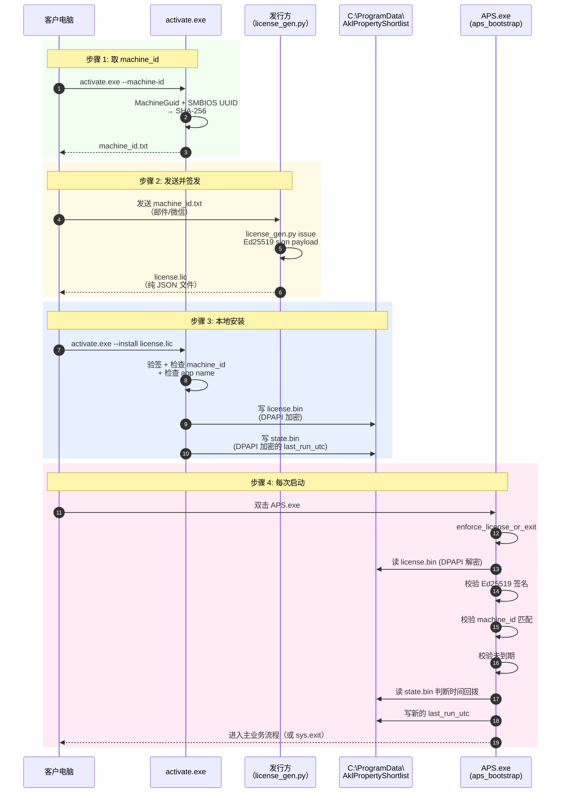

# 06 · 授权系统（aps_license/）

> 这是 APS **桌面版独有**的机制。云端版不用这套 —— Web 版的鉴权是 JWT + bcrypt + RBAC，见 `07_web_platform.md`。

---

## 1. 问题背景

客户要求：
- 把 APS 发给朋友 / 小圈子用户
- **防止用户把整个 release 目录转发给第三方**就能用
- 可以设有效期（试用期 / 续费）
- 客户电脑可能不联网，所以要**离线授权**
- 防止用户"把系统时间调回去"绕过到期

APS 的答案：**Ed25519 离线签名 + 机器指纹绑定 + DPAPI 加密存储 + 时间回拨检测**。

---

## 2. 整体流程



---

## 3. 四种防护的职责分工

| 机制 | 防什么 | 实现 |
|---|---|---|
| **Ed25519 签名** | 篡改 license 内容（比如把到期日改到 2099） | `license_codec.verify_license_obj` + 嵌入公钥 |
| **Machine ID 绑定** | 把 license 转发给其他电脑 | `machine_id.get_machine_id` 组合 MachineGuid + SMBIOS UUID |
| **DPAPI 加密** | 把 license.bin 整个文件抄到另一台电脑 | 本机 DPAPI 密钥无法跨机复用 |
| **时间回拨检测** | 把系统时间调回到到期之前 | `state.bin` 存 `last_run_utc`，比对单调性 |

**任何一层被绕过都不行**。比如：
- 破解 Ed25519 需要私钥 → 私钥不在客户电脑上
- 偷 license.bin 到另一台电脑 → DPAPI 解密失败（机器绑定的 DPAPI 密钥不一样）+ machine_id 对不上
- 改系统时间 → last_run_utc 对比 +5 分钟 tolerance 后仍然检出回拨

---

## 4. 关键文件

| 文件 | 作用 |
|---|---|
| `aps_bootstrap.py` | PyInstaller 入口：先 license gate，再 import heavy stack |
| `aps_license/runtime.py` | `enforce_license_or_exit()` 主入口（183 行） |
| `aps_license/license_codec.py` | License 文件格式 + Ed25519 验签（152 行） |
| `aps_license/machine_id.py` | Machine ID 生成（164 行；Windows 专属） |
| `aps_license/dpapi.py` | Windows DPAPI ctypes 封装（125 行） |
| `aps_license/storage.py` | ProgramData 路径处理（51 行） |
| `aps_license/public_key.py` | 嵌入的 Ed25519 公钥（base64 + 9 行） |
| `aps_license/embed_public_key.py` | 构建时把 PEM 公钥注入 `public_key.py` 的脚本 |
| `aps_license/ui.py` | MessageBoxW 错误弹窗（25 行） |
| `activate.py` → `activate.exe` | 用户端激活工具（单独打包） |
| `license_gen.py` | 发行方签发工具（仅 issuer 端） |

---

## 5. Machine ID 算法（`aps_license/machine_id.py`）

```python
parts = {
    "machine_guid": read from HKEY_LOCAL_MACHINE\SOFTWARE\Microsoft\Cryptography\MachineGuid,
    "csproduct_uuid": wmic csproduct get uuid (or PowerShell Get-CimInstance),
}
tokens = [upper(v) for v in parts.values() if v]
machine_id = sha256("|".join(tokens))  # 64 hex chars
```

### 5.1 为什么用这两个字段

- **MachineGuid** — Windows 安装时生成的 GUID，存在注册表。**重装系统会变**（这是 feature，不是 bug：重装被视为换机）
- **csproduct UUID** — SMBIOS 固件里的主板 UUID。**换硬盘、换 USB 不变**，但换主板会变

组合后的 stability：
- 重启 / 换硬盘 / 插 U 盘 / 驱动更新 → 不变
- 重装 Windows 或换主板 → 变（需要 reissue）

### 5.2 Fallback

`machine_id.py:150-159`：如果两个源都拿不到（罕见），fallback 到 `sys.platform + COMPUTERNAME + PROCESSOR_IDENTIFIER`。弱一些但不至于硬报错。

### 5.3 非 Windows

`machine_id.py:131-136`：虽然 APS 桌面版是 Windows-only，但代码在非 Windows 也能出一个 machine_id（基于 hostname + sys.platform），用于开发机运行测试。

---

## 6. License 文件格式（`aps_license/license_codec.py`）

`license.lic` 是 JSON：

```json
{
  "alg": "Ed25519",
  "payload": {
    "schema_version": 1,
    "app": "AklPropertyShortlist",
    "license_id": "xxx-uuid-xxx",
    "issued_to": "张三 / 公司名",
    "issued_at": "2026-04-22T10:00:00+00:00",
    "expires_at": "2027-04-22T10:00:00+00:00",
    "machine_id": "abc123...64 hex chars..."
  },
  "signature": "<base64-encoded Ed25519 signature of canonical payload>"
}
```

**Canonical payload bytes**（`license_codec.py:35-36`）：
```python
json.dumps(payload, sort_keys=True, separators=(",", ":")).encode("utf-8")
```
sort_keys + 紧凑分隔符，保证 signer 和 verifier 字节序一致。

**验签流程**（`license_codec.py:87-147` `verify_license_obj`）：
1. alg == "Ed25519"
2. schema_version == 1
3. app == expected_app ("AklPropertyShortlist")
4. 用嵌入的 Ed25519 公钥 verify signature
5. 解析时间字段为 UTC aware datetime
6. 返回 `LicensePayload` dataclass

---

## 7. DPAPI 加密存储（`aps_license/dpapi.py`）

### 7.1 为什么用 DPAPI

- Windows 自带 `CryptProtectData` / `CryptUnprotectData`（Crypt32.dll）
- 加密密钥由 Windows 管理，**绑定到当前机器**（flag `CRYPTPROTECT_LOCAL_MACHINE`）
- 纯 ctypes 实现，**不依赖 pywin32**，PyInstaller 打包干净
- Entropy 参数让不同用途的加密互不解密（防止滥用 dump）

### 7.2 文件

`%PROGRAMDATA%\AklPropertyShortlist\`（`storage.py`）：
- `license.bin` — DPAPI(license JSON, entropy=`b"AklPropertyShortlist|license|v1"`)
- `state.bin` — DPAPI(`{"last_run_utc": "..."}`, entropy=`b"AklPropertyShortlist|state|v1"`)

**换机器时**：拷贝 `license.bin` 无效，因为 DPAPI 密钥不一样；加上 `machine_id` 字段也对不上，双保险。

### 7.3 Entropy 分离

不同文件用不同 entropy（`runtime.py:22-23`），防止攻击者拿 `state.bin` 的 blob 去塞到 `license.bin` 的位置（虽然两者 schema 不同也很难成功，但多一层保险）。

---

## 8. 运行时校验（`aps_license/runtime.py:100-121`）

`validate_runtime_constraints(lic, now_utc)`：

```python
# 1. Machine binding
if lic.machine_id != get_machine_id():
    raise LicenseMismatch

# 2. Expiry
if now_utc > lic.expires_at:
    raise LicenseExpired

# 3. Time rollback detection
last = _load_last_run()  # 读 state.bin
if last is not None:
    tolerance = 5 minutes
    if now_utc + tolerance < last:
        raise TimeRollbackDetected

# 4. Persist last_run_utc (fail closed if we can't write)
_save_last_run(now_utc)
```

### 8.1 5 分钟 tolerance

日常小时钟漂移（NTP 同步、夏令时处理）可能让 `now_utc` 比上次 run 少几秒到几分钟，这都不算恶意回拨。超过 5 分钟就判定为回拨。

### 8.2 Fail closed

`_save_last_run` 写 `state.bin` 失败 → 抛异常 → `enforce_license_or_exit` 捕获 → 显示错误 → exit(16)。这是"**不能写就不让用**"的策略，防止"某种方式让 state.bin 始终写不进去"来绕过回拨检测。

---

## 9. 失败路径与退出码

`runtime.py:124-184` `enforce_license_or_exit` 统一处理：

| Exit Code | 原因 | 提示 |
|---|---|---|
| 10 | `LicenseNotInstalled`（没 license.bin） | 显示 machine_id，引导 `activate.exe --install` |
| 11 | `LicenseExpired` | 联系发行方续期 |
| 12 | `TimeRollbackDetected` | 校正系统时间（提及 CMOS 电池） |
| 13 | `LicenseMismatch` | 把 machine_id 发给发行方重新签发 |
| 14 | `LicenseSignatureError` | 授权文件被篡改 |
| 15 | 其他 `LicenseError` | 授权检查失败 |
| 16 | 其他 `Exception` | 未知错误 |

所有错误都**同时**：
- 弹 Windows MessageBox（`ui.show_error` → user32.MessageBoxW）
- 打印到 console（`print(msg)`）
- sys.exit

---

## 10. 签发流程（`license_gen.py`，仅发行方）

### 10.1 生成密钥对（一次性）

```bash
python license_gen.py gen-keys --out-dir keys/ --passphrase "<strong-passphrase>"
```
- 输出 `license_private.pem` + `license_public.pem`
- 公钥在 `embed_public_key.py` 里注入到 `public_key.py`（打包前操作）
- 私钥**只在发行方电脑**保管，**永远不进 git**

### 10.2 签发一张 license

```bash
python license_gen.py issue \
    --private-key keys/license_private.pem \
    --passphrase "<passphrase>" \
    --machine-id <客户给的 machine_id> \
    --issued-to "张三" \
    --days 365 \
    --out license.lic \
    --app AklPropertyShortlist
```
- 构造 payload
- Ed25519 sign canonical bytes
- 输出 `license.lic`

### 10.3 批处理

`issue_license.bat`（repo 里有）对上面命令做了 Windows 包装，发行方双击 + 回答几个问题就能出 license。

---

## 11. 用户激活流程（`activate.py`）

用户收到 APS release 目录（含 `APS.exe` + `activate.exe` + 一堆 dll + 数据）。第一次用：

```bash
# 1. 取 machine_id
activate.exe --machine-id
# → 打印 machine_id + 写 machine_id.txt

# 2. 把 machine_id.txt 发给发行方（邮件/微信）

# 3. 收到 license.lic 后，本地安装
activate.exe --install license.lic
# → 验签 → DPAPI 加密 → 写 %PROGRAMDATA%\AklPropertyShortlist\license.bin

# 4. 以后每次双击 APS.exe 都会自动验证
APS.exe
```

`activate.py:62-76` `cmd_machine_id` / `:79-...` `cmd_install` 里实现。

### 11.1 `--debug` 开关

`activate.exe --machine-id --debug` 会打印每个 machine_id part（MachineGuid / csproduct UUID），方便排查"为什么 machine_id 变了"的问题。

---

## 12. Bootstrap Gate（`aps_bootstrap.py`）

```python
def main():
    _freeze_support()                  # Windows 多进程必需
    enforce_license_or_exit(...)       # license 检查（失败 sys.exit）
    from main import run               # 授权通过才 import 重型 stack
    from utils.io_tools import ExcelFileLockedError
    try:
        run()
    except ExcelFileLockedError as e:
        # 用户友好提示（通常是 xlsx 正在被 Excel 打开）
        sys.exit(1)
```

**为什么 license gate 必须在 import main 之前**：
- `main.py` + enrichers 加载耗时 1-3 秒（GIS stack 很重）
- license 检查只需要毫秒级
- 先 license 再 load：失败时用户马上看到弹窗，而不是等 2 秒后才看到

---

## 13. 威胁模型里没有防的东西

这套设计**不防**：
- 把程序在虚拟机里跑，每次换 machine_id 都重新申请 license（可行，但代价高且 social engineering 能察觉）
- 用 debugger 绕过 `enforce_license_or_exit` 调用（需要反汇编 PyInstaller 打包的 .exe；对付普通盗版足够）
- 发行方自己的私钥泄露（用 passphrase 保护；私钥机器 offline）
- 客户故意违约发给第三方（合同层约束，不是技术层）

设计哲学：**防普通用户的"顺手转发"，不防专业逆向**。对于小范围发放的桌面工具，这个级别够用。

---

## 14. 云端版的替代方案

云端版不用这套（`07_web_platform.md`）：
- 用户是 server 账户（bcrypt 密码），不装任何本地文件
- 没有 machine_id（浏览器访问）
- 禁用账户 = 在 DB 里把 `users.is_active=False`
- 有效期 = JWT 过期时间（`JWT_EXPIRE_MINUTES=1440`，默认 24h）
- 收费 = 外部账单系统控制 admin 创建/禁用账户

**两套系统各自完整、互不依赖**。
