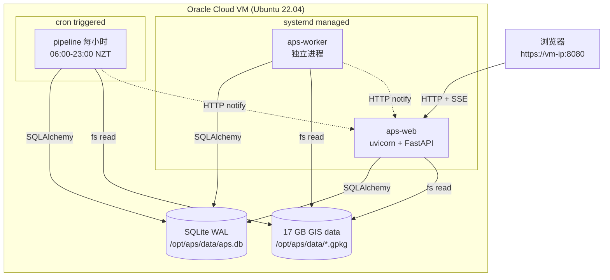

# 07 · 云端 Web 平台（web/）

> 对应目录：`web/`（~3200 行 Python + 4600 行 HTML/JS/CSS）。这是 APS 从单机工具到云端平台的扩展。

---

## 1. 运行形态（三进程协作）



三进程共享 SQLite + GIS 数据目录。Pipeline 和 Worker 都会在**完成工作后 HTTP POST `/api/internal/notify`** 告知 Web 进程，Web 进程把结果推给浏览器 SSE。

---

## 2. 入口与应用工厂

### 2.1 `run_web.py`

- 读 settings（`web.settings.get_settings`）
- 如果 `PIPELINE_INTERVAL_MINUTES > 0` → 起一个 daemon thread 在进程内跑 pipeline（**开发模式**）
- PROD 默认 `PIPELINE_INTERVAL_MINUTES=0`，由系统 cron 驱动
- 启动 uvicorn：`uvicorn.run("web.app:create_app", factory=True, host, port)`

### 2.2 `web/app.py:create_app()`

FastAPI 工厂模式：
- 挂载 `/static` 静态资源
- `/favicon.ico` 返回 204
- 根路由 `/`：检查 `access_token` cookie，通过就 redirect 到 `/shortlist`，否则 redirect 到 `/login`
- 全局异常 handler：把未捕获异常 log + 返回 500 JSON `{"detail": "Internal server error"}`
- 顺序注册 8 个 router：
  1. `health` — `/health`
  2. `auth_routes` — 登录 / 登出 / 改密
  3. `shortlist` — `/shortlist` + 列表 API + SSE
  4. `export` — Excel 导出
  5. `admin` — Admin 面板
  6. `geocode` — 地址 geocoding（给候选输入框用）
  7. `candidates` — `/candidates` + 列表 API + SSE
  8. `internal` — `/api/internal/notify`（仅 localhost）

---

## 3. 鉴权（`web/auth/`）

### 3.1 JWT cookie（`web/auth/auth.py`）

- **算法**：HS256（对称密钥，`JWT_SECRET_KEY` 从 `.env` 读，init-vm.sh 初始化时生成 64 字节 urlsafe token）
- **过期**：`JWT_EXPIRE_MINUTES=1440`（24 h）
- **Payload**：`{"sub": "<user_id>", "role": "<role>", "iat": ..., "exp": ...}`
- **存储位置**：HTTP-only cookie `access_token`（`SameSite=Lax`）
- **登出**：删 cookie（`/auth/logout` GET/POST 都支持）

### 3.2 依赖函数（`web/auth/deps.py`）

```python
def get_current_user(request, db) -> User:
    token = request.cookies.get("access_token")
    if not token: raise 401
    payload = decode_jwt(token, settings.jwt_secret_key)
    user = db.query(User).filter_by(id=payload["sub"], is_active=True).first()
    if not user: raise 401
    return user

def require_role(allowed_roles: list[str]):
    def checker(user = Depends(get_current_user)):
        if user.role not in allowed_roles: raise 403
        return user
    return checker
```

### 3.3 RBAC（role-based access control）三种角色

| Role | 能做什么 |
|---|---|
| `admin` | 全部功能 + 管理用户 + 看所有 candidates + 触发 pipeline |
| `premium` | 浏览 + 保存候选 + Excel 导出 |
| `viewer` | 只能浏览 shortlist 和自己的 candidates，不能导出 |

代码里的典型用法：
- `export.py:63`：`user = Depends(require_role(["admin", "premium"]))`
- `admin.py:36`：`user = Depends(require_role(["admin"]))`

### 3.4 用户管理

`web/routers/admin.py`（528 行）有完整用户 CRUD：
- 创建 / 更新 / 软删除（`is_active=False`）
- 改密 / 改角色
- **最后一个 active admin 不能降级 / 禁用**（`admin.py:172-180` 保护）
- **最多 3 个 active admin**（`admin.py:141-145` 上限）
- 审计日志：所有变更写 `user_audit_logs` 表

---

## 4. 数据库会话（`web/db/`）

### 4.1 `session.py`

```python
@lru_cache(maxsize=1)
def get_engine():
    engine = create_engine(
        settings.database_url,  # sqlite:////opt/aps/data/aps.db
        connect_args={"check_same_thread": False},
    )
    if settings.database_url.startswith("sqlite"):
        event.listen(engine, "connect", _set_sqlite_pragmas)
    return engine

def _set_sqlite_pragmas(conn, _):
    cursor.execute("PRAGMA journal_mode=WAL")
    cursor.execute("PRAGMA busy_timeout=5000")  # 5 秒
```

- **WAL 模式**：读写并发（多个 session 同时查 OK；有写入时其他读不阻塞）
- **busy_timeout=5000ms**：SQLite 内置锁争用时最长等 5 秒
- FastAPI dependency `get_db()` 每次请求 yield 一个 session

### 4.2 ORM base（`web/db/base.py`）

- `Base = DeclarativeBase`
- `TimestampMixin` 给每个表加 `id / created_at / updated_at`

---

## 5. Router 清单

| Router | 路径 | 功能 |
|---|---|---|
| `health.py` | `GET /health` | `{app_name, app_env, status, db_ok}` |
| `auth_routes.py` | `/login /auth/login /auth/logout /auth/me /auth/password` | 登录 + 改个人信息 |
| `shortlist.py` | `/shortlist /api/shortlist /api/shortlist/events ...` | 主列表页 + SSE |
| `candidates.py` | `/candidates /api/candidates /api/candidates/events ...` | 候选页 + SSE |
| `admin.py` | `/admin /api/admin/*` | Admin 面板（5 个 tab） |
| `export.py` | `/api/export/shortlist /api/export/candidates /api/export/admin-candidates` | Excel 导出 |
| `geocode.py` | `/api/geocode` | 用户输入地址时的 typeahead |
| `internal.py` | `/api/internal/notify` | 内部回调（localhost only） |
| `_filters.py` | （非 router） | 公共 filter/sort/column-value 逻辑 |

---

## 6. 统一 filter/sort 层（`web/routers/_filters.py`）

避免 shortlist 和 candidates 各写一份。支持：

### 6.1 Query 参数格式

```
?filter[col_name]=<value>&sort=col&sort_dir=desc&page=1&page_size=50
```

### 6.2 Filter 语义

| Value 格式 | 生成 SQL |
|---|---|
| `>=100` / `<=50` / `>0` / `<5` | `col >= 100` 等（仅 FLOAT/INTEGER） |
| `500-1000` | `col >= 500 AND col <= 1000` |
| `__blank__` | `col IS NULL OR col = ''` |
| `a,b,c` | `col IN ('a', 'b', 'c')` |
| `a,__blank__` | `col IN ('a') OR col IS NULL OR col = ''` |
| `true` / `false` / `1` / `0` | Boolean 列专用 |
| 单一值（默认） | `col ILIKE '%value%'` |

### 6.3 Column-values API（for filter popover）

前端点击列头 → GET `/api/shortlist/column-values?col=<name>&<其他 filter 保持>` → 返回该列去重值 + 每个值的 count。前端渲染复选框列表。

这比"后端返 top 20 加搜索"更实用，数据量小的时候直接全列。

---

## 7. 列表 API 详解（`shortlist.py` 为例）

```python
@router.get("/api/shortlist")
def shortlist_api(request, page, page_size, sort, sort_dir, user, db):
    query = db.query(Property).filter(Property.reject_reason.is_(None))
    query = apply_column_filters(query, Property, request)
    total = query.count()
    sort_col = getattr(Property, sort, None) or Property.listing_time
    query = query.order_by(desc(sort_col) if sort_dir == "desc" else asc(sort_col))
    rows = query.offset((page - 1) * page_size).limit(page_size).all()
    last_run = db.query(PipelineRun.completed_at).filter(
        PipelineRun.status == "success"
    ).order_by(desc(PipelineRun.id)).first()
    return {
        "data": [model_to_dict(r, _API_COLUMNS) for r in rows],
        "total": total,
        ...
        "last_pipeline_at": last_run[0].isoformat() if last_run else None,
    }
```

特点：
- **只返回 `reject_reason IS NULL` 的 Property**（被硬过滤淘汰的不给用户看）
- `_API_COLUMNS` 排除 `parcel_outline_png`（binary，太大；单独 endpoint 按需获取）
- 返回 `last_pipeline_at` 让前端显示"最后一次数据更新于 ... 前"

### 7.1 缩略图单独 endpoint

```python
@router.get("/api/thumbnail/{listing_id}")
def thumbnail(listing_id, user, db):
    prop = db.query(Property).filter_by(listing_id=listing_id).first()
    if not prop or not prop.parcel_outline_png:
        return Response(status_code=204)
    return Response(content=prop.parcel_outline_png, media_type="image/png")
```

Tabulator 的 cell formatter 只要 ``，浏览器按需请求。

---

## 8. SSE 实时推送（`shortlist.py:93-119` + `candidates.py:153-186`）

### 8.1 Pipeline 完成推送

```python
@router.get("/api/shortlist/events")
async def shortlist_events(request, user):
    async def event_stream():
        known_version = pipeline_signal["version"]
        yield ": connected\n\n"
        tick = 0
        while True:
            if await request.is_disconnected(): break
            if pipeline_signal["version"] > known_version:
                known_version = pipeline_signal["version"]
                data = json.dumps({"added": pipeline_signal["added"]})
                yield f"event: pipeline\ndata: {data}\n\n"
            tick += 1
            if tick % 30 == 0:
                yield ": keepalive\n\n"
            await asyncio.sleep(1)
    return StreamingResponse(event_stream(), media_type="text/event-stream")
```

- 每秒检查 `pipeline_signal["version"]`（在 `web/notify.py` 里的**全局 dict**）
- Pipeline 完成后 HTTP POST `/api/internal/notify` → `notify_pipeline(added)` → `pipeline_signal["version"] += 1`
- 所有连接的 SSE client 都会被通知，前端弹个 toast "16 条新房源可查看"

### 8.2 Candidate 完成推送（更复杂）

```python
async def event_stream():
    evt = asyncio.Event()
    _candidate_events_map[user_id] = evt
    try:
        yield ": connected\n\n"
        while True:
            if await request.is_disconnected(): break
            try:
                await asyncio.wait_for(evt.wait(), timeout=15)
            except asyncio.TimeoutError:
                yield ": keepalive\n\n"
                continue
            evt.clear()
            items = consume_candidate_events(user_id)
            for data in items:
                yield f"event: status\ndata: {json.dumps(data)}\n\n"
    finally:
        _candidate_events_map.pop(user_id, None)
```

- 每个用户有自己的 `asyncio.Event`（`web/notify.py:candidate_events`）
- Worker 完成 enrichment → HTTP POST `/api/internal/notify` → `notify_candidate(user_id, data)` → 把 data append 到 `candidate_signals[user_id]` + `evt.set()`
- 对应用户的 SSE connection 唤醒 → 读走所有 pending 的 data → 推 SSE

### 8.3 为什么不直接用 Redis Pub/Sub

- 单 VM 部署，进程之间内存共享（通过 HTTP 回调）就够
- 不引入 Redis 依赖（简化部署）
- SQLite 轮询方案被排除（每秒查 DB 浪费）

---

## 9. Candidates 工作流（`candidates.py`，452 行）

### 9.1 三种来源

```python
class CreateCandidateRequest(BaseModel):
    source: str                            # "shortlist_save" | "manual_address" | "candidate_save"
    listing_id: Optional[str] = None       # shortlist_save
    address: Optional[str] = None          # manual_address
    candidate_id: Optional[int] = None     # candidate_save
```

- **shortlist_save** — 用户在 `/shortlist` 看到一个喜欢的，点"保存到 My Candidates"：**直接从 Property 表拷贝 enrichment 列**到 Candidate，status = `complete`
- **manual_address** — 用户在 `/candidates` 手动输入地址：新建 Candidate(status=`pending`) + EnrichmentJob(status=`queued`) → Worker 异步处理
- **candidate_save** — 用户从**别人**（admin 面板）公开的 candidate 里拷贝一份到自己账户（"这个地址看着不错，我也要")

### 9.2 Worker 流程（`web/worker.py`）

```python
while True:
    job = session.query(EnrichmentJob).filter_by(status="queued").order_by(queued_at).first()
    if not job: sleep(POLL_INTERVAL=2s); continue
    job.status = "running"
    candidate = lookup(job.candidate_id)
    try:
        result = NzAddressesGeocoder.geocode(candidate.address_input)
        candidate.address/suburb/district/lat/lon = result
        enriched = enrich_single_address(lat, lon)  # services/enrichment.py
        db_dict = row_to_db_dict(enriched)
        for col, value in db_dict.items():
            setattr(candidate, col, value)
        candidate.status = "complete"
        job.status = "complete"
    except Exception:
        candidate.status = "failed"
        job.status = "failed"
        job.error_message = str(e)[:500]
    session.commit()
    _notify("candidate_enriched", {"user_id": ..., "status": ...})
```

单 worker、串行处理、`POLL_INTERVAL=2s`。用户典型体验：输入地址 → 2-5 秒看到结果（GIS 已 prewarm）。

### 9.3 Progress stage（人肉业务流程）

`candidates.py:73-77`：

```python
PROGRESS_CHOICES = [
    "new", "watching", "research", "negotiating",
    "offered", "offer_failed", "offer_cancelled",
    "contracted", "settled", "dropped",
]
```

这是 deal pipeline 的状态机（但代码里目前没强制流转规则，自由切换）。

---

## 10. Excel 导出（`web/services/export_xlsx.py` + `web/routers/export.py`）

### 10.1 三个 endpoint

- `/api/export/shortlist` — 全部 active properties（admin + premium）
- `/api/export/candidates` — 当前用户的 complete candidates（admin + premium）
- `/api/export/admin-candidates` — 所有人的 complete candidates（admin only）

### 10.2 支持的过滤方式

- `listing_ids: [...]` — 明确指定要导哪几条（从前端选中的行）
- `filters: {col: value, ...}` — 复用列表的 filter 逻辑
- `sort / sort_dir / lang` — 列排序和中英文列头切换

### 10.3 审计日志

每次导出写 `export_logs` 表：`user_id / source / row_count / filters_applied`。Admin 面板里能查"谁在什么时候导出了多少行"。

---

## 11. Admin 面板（`admin.py` + `admin.html`）

5 个 tab：
1. **Dashboard** — KPIs（properties / users / candidates / 最新 pipeline 状态）
2. **Users** — CRUD + 改密 / 改角色
3. **All Candidates** — 所有用户的 candidates 汇总（含 virtual columns：`user_email / user_notes / user_is_active`）
4. **Popular Properties** — 被 ≥ 2 个用户保存的 listing（带保存者列表）
5. **Pipeline Status** — 最近 10 次 pipeline run + Export logs + User audit logs

**触发 pipeline**：`POST /api/admin/pipeline/trigger` → `subprocess.Popen([python, "-m", "web.services.pipeline", "--once"])`。非阻塞，admin 点完就返回。

---

## 12. 前端（`web/templates/` + `web/static/`）

### 12.1 架构

- **Jinja2** 渲染基础页面（login / shortlist / candidates / admin）
- **Tabulator 5.x** — 表格组件（CDN 加载）
- **filter-popover.js**（530 行）—— 自研列头过滤弹窗（复选框清单 + 数值区间 + 文本）
- **aps-common.js**（126 行）—— 公用的 fetch / toast / confirm 封装
- **app.js**（37 行）—— 最小入口

### 12.2 SSE 客户端典型代码（templates 里的 inline script）

```javascript
const es = new EventSource("/api/shortlist/events");
es.addEventListener("pipeline", (e) => {
  const data = JSON.parse(e.data);
  showToast(`${data.added} 条新房源可查看`, "刷新", () => location.reload());
});
es.addEventListener("error", () => { /* auto-reconnect */ });
```

### 12.3 没用 SPA 框架（React/Vue）

决策：
- Jinja2 + Tabulator 已覆盖主要需求（列表 + 过滤 + 导出 + 缩略图）
- 交互不复杂（不是聊天 / 编辑器 / 画板）
- 少一份构建步骤、少一份依赖、PyInstaller 思路相反
- 服务器端渲染 SEO-ready（虽然 APS 不需要）

如果将来要做复杂 UI（比如 listing lifecycle 看板），可能再加 Vue/React 的某一页。

---

## 13. 运行模式：Thread vs Cron

`web/settings.py:20-22`：

```python
pipeline_interval_minutes: int = 0  # 0 = disabled (PROD uses cron); set 60 locally
pipeline_start_hour: int = 6
pipeline_end_hour: int = 24
```

- **本地开发**：`PIPELINE_INTERVAL_MINUTES=60` → `run_web.py` 起 daemon thread 定时跑
- **PROD**：`PIPELINE_INTERVAL_MINUTES=0` → cron 触发（`deploy/cron/aps-pipeline.cron`）

这个切换让开发环境不依赖 cron 就能自动测 pipeline。

---

## 14. Re-enrich CLI（`web/services/reenrich.py`，251 行）

### 14.1 用途

改了 enricher 代码或 scoring 权重后，**不重新抓 Trade Me**，直接把 DB 里现有 Property 全部重跑：

```bash
# 快速模式（默认 skip CV + 不重渲染 thumbnail）
python -m web.services.reenrich

# 完整模式（重渲染 thumbnail）
python -m web.services.reenrich --redraw-thumbnails

# 真正慢（还重新查 CV）
python -m web.services.reenrich --redraw-thumbnails --refresh-cv
```

### 14.2 生命周期管理

脚本执行 → 自动：
1. `sudo -n systemctl stop aps-web aps-worker`（避免并发写 DB）
2. 改 crontab 把 pipeline 行注释掉（`_disable_cron`）
3. 跑 `_enrich_and_store`（reuse `services/pipeline.py` 的核心函数）
4. `finally:` 恢复 cron + 重启服务

`/etc/sudoers.d/aps-reenrich` 给 deploy 用户**只对这 4 条命令**开 NOPASSWD（`deploy/init-vm.sh:276-293`）：

```
deploy ALL=(ALL) NOPASSWD: /bin/systemctl stop aps-web, /bin/systemctl stop aps-worker,
                           /bin/systemctl start aps-web, /bin/systemctl start aps-worker
```

### 14.3 幂等性

所有 upsert 用 `on_conflict_do_update` on `listing_id`（`pipeline.py:35-46`）。重复运行不会出重复行，只更新 enrichment 结果。

---

## 15. 测试（`tests/web/`，21 个测试文件）

- 每个 router 一份：`test_auth_routes.py / test_shortlist_api.py / test_candidates_api.py / test_admin_api.py / test_export.py / ...`
- `conftest.py` 建了 in-memory SQLite + 用户种子
- `test_models.py` 测 ORM 约束
- `test_worker.py` + `test_pipeline.py` + `test_pipeline_service.py` 测后台流程
- `test_column_map.py` 测 DB ↔ row dict 转换
- `test_reenrich.py` 测 reenrich CLI 的幂等性
- `test_internal_notify.py` 测 localhost-only guard

CI 跑 `pytest tests/web/ -x -q`（`.github/workflows/ci.yml`）。

---

## 16. 参考文件

| 文件 | 行数 | 内容 |
|---|---|---|
| `web/app.py` | 74 | create_app 工厂 |
| `web/settings.py` | 27 | pydantic-settings 配置 |
| `web/db/models.py` | 421 | 6 张表 ORM |
| `web/db/session.py` | 40 | engine + session + WAL pragma |
| `web/column_map.py` | 227 | row key ↔ db col（含中英文） |
| `web/worker.py` | 158 | 独立 worker 进程 |
| `web/notify.py` | 38 | 内存信号 hub |
| `web/routers/shortlist.py` | 143 | shortlist API + SSE |
| `web/routers/candidates.py` | 452 | candidates 完整 CRUD + SSE |
| `web/routers/admin.py` | 528 | admin 5 个 tab + RBAC |
| `web/routers/export.py` | 185 | Excel 导出 + audit |
| `web/routers/_filters.py` | 168 | 统一过滤/排序层 |
| `web/services/pipeline.py` | 342 | cron-driven Pipeline |
| `web/services/reenrich.py` | 251 | Re-enrich CLI + 生命周期管理 |
| `web/services/enrichment.py` | 57 | 单地址富化（worker 用） |
| `web/services/export_xlsx.py` | 211 | openpyxl 导出逻辑 |
| `web/auth/auth.py` | 30 | JWT + bcrypt |
| `web/auth/deps.py` | 29 | get_current_user + require_role |
