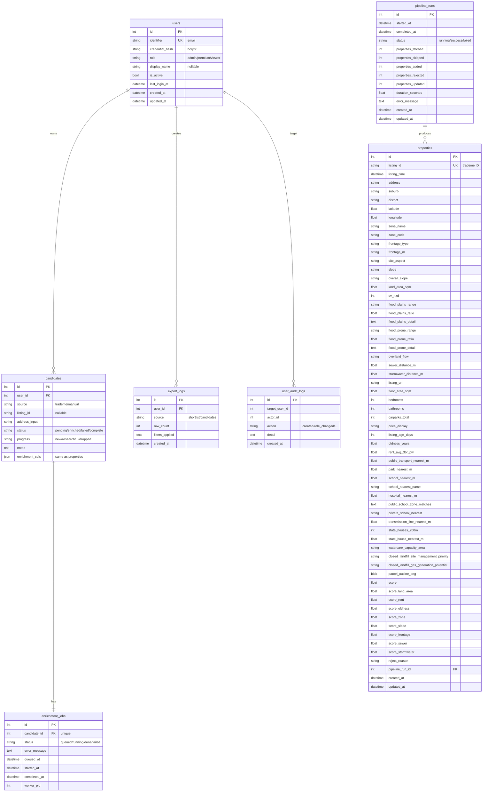

# 08 · 数据库（SQLite + 6 张表）

> 对应文件：`web/db/models.py`、`web/db/session.py`、`web/db/init_db.py`、`alembic/versions/*`、`web/column_map.py`。本章只讲云端版的 SQLite schema；桌面版不用数据库（直接写 Excel）。

---

## 1. 数据库选型

**SQLite 3**（单文件 `/opt/aps/data/aps.db`），配合 SQLAlchemy 2.0 ORM + Alembic 迁移。

为什么够用：
- 单 VM 部署，没有读写跨机需求
- 团队内部使用，并发用户 < 20
- 数据量 properties ~几万行 / candidates ~几千行
- WAL 模式让"读不阻塞、并发写排队"工作良好
- 单文件 → `sqlite3 .backup` 秒级冷备份

WAL 配置在 `web/db/session.py:8-11`：

```python
def _set_sqlite_pragmas(conn, _):
    cursor.execute("PRAGMA journal_mode=WAL")
    cursor.execute("PRAGMA busy_timeout=5000")
```

---

## 2. 六张表 ER 图



---

## 3. 表详解

### 3.1 `users`（`models.py:46-71`）

| 列 | 类型 | 备注 |
|---|---|---|
| id | int PK | |
| identifier | string UK | email 地址（将来可能支持 username） |
| credential_hash | string | bcrypt 哈希（`bcrypt.hashpw`） |
| role | string | `admin` / `premium` / `viewer` 三选一 |
| display_name | string nullable | 可选昵称（admin 面板里叫 "notes"） |
| is_active | bool | 软删除标记：`False` = 账户禁用 |
| last_login_at | datetime | 登录时更新 |
| created_at / updated_at | — | 来自 TimestampMixin |

**硬约束**：
- Max 3 active admin（`admin.py:141-145`）
- 不能降掉/禁用最后一个 active admin（`admin.py:172-180` / `:229-234`）
- 所有变更（创建 / 改角色 / 改密 / 改 notes / 禁用）写 `user_audit_logs`

### 3.2 `properties`（`models.py:78-180`）

核心业务表。每条 Trade Me listing 一行。

**Indexes**：
- `listing_id`（unique + index）— 业务主键
- `score`（index）— 排序常用

**约 50 列**，分组：
- **Identity**: listing_id / listing_time
- **Location**: address / suburb / district / latitude / longitude / google_map_url
- **Zoning**: zone_name / zone_code
- **Site**: frontage_type / frontage_m / site_aspect / slope / overall_slope / land_area_sqm / cv_nzd
- **Flood**: flood_plains_* / flood_prone_* / overland_flow
- **Infra**: sewer_distance_m / stormwater_distance_m
- **Listing**: listing_url / floor_area_sqm / bedrooms / bathrooms / carparks_total / price_display / listing_age_days / oldness_years / rent_avg_3br_pw
- **Amenities**: public_transport / park / school / hospital / public_school_zone_matches / private_school_nearest
- **Risk/Special**: transmission_line / state_houses / watercare / closed_landfill
- **Thumbnail**: parcel_outline_png (LargeBinary)
- **Scores**: score + 8 个子分
- **Provenance**: reject_reason / pipeline_run_id FK

**`reject_reason is NULL`** = 通过硬过滤（能在 shortlist 显示）  
**`reject_reason` 有值** = 被淘汰（只在 admin 面板 / 审计看得见）

### 3.3 `candidates`（`models.py:187-297`）

和 `properties` **enrichment 列完全一致**（便于 shortlist_save 直接拷贝），但额外有：

- `user_id` FK — 归属
- `source` — `shortlist_save` / `manual_address` / `candidate_save`
- `address_input` — 用户手输的原始地址（geocoder 没化过的）
- `status` — `pending` → (worker 处理) → `enriched` / `failed` / `complete`
- `progress` — deal pipeline 阶段（new / research / negotiating / offered / contracted / settled / dropped 等）
- `notes` — 用户自己的备注

**Unique constraint**：`(user_id, listing_id)` — 同一用户同一 listing 只能保存一次（防止在 shortlist 重复点 save）

> 注：`candidates.parcel_outline_png` 单独存了一份（不是引用 properties 的），因为 manual_address 模式下根本没有对应的 Property 行。

### 3.4 `enrichment_jobs`（`models.py:304-332`）

Worker 的 job queue 表。

| 列 | 用途 |
|---|---|
| candidate_id FK **unique** | 一个 candidate 只能有一个 job |
| status | `queued` → `running` → `complete` / `failed` |
| error_message | 失败时的 str(e)[:500] |
| queued_at / started_at / completed_at | 生命周期时间戳 |
| worker_pid | 调试用（哪个 worker 接了） |

**Worker 取 job 逻辑**（`web/worker.py:41-64`）：

```python
job = session.query(EnrichmentJob)
          .filter_by(status="queued")
          .order_by(EnrichmentJob.queued_at)
          .first()
job.status = "running"
job.started_at = utc_now
session.commit()
```

单 worker 所以没有 row-level lock。如果未来要多 worker，需要加 `SELECT FOR UPDATE SKIP LOCKED`（SQLite 不支持，得换 Postgres）。

### 3.5 `pipeline_runs`（`models.py:339-361`）

每次 Pipeline 执行的审计记录。

- `status: running / success / failed`
- 统计指标：fetched（原始抓多少）/ skipped（早期去重跳过）/ added / rejected / updated
- `duration_seconds` — wall-clock 耗时

Shortlist API 会查最新的 success 来展示"最后一次更新于"。

### 3.6 `export_logs`（`models.py:368-390`）

每次 Excel 导出的审计：`user_id / source / row_count / filters_applied`（JSON 字符串）。

### 3.7 `user_audit_logs`（`models.py:397-421`）

Admin 操作其他用户的记录：

| action | 含义 |
|---|---|
| `created` | 新建用户 |
| `role_changed` | 改角色，detail 是 `viewer → admin` 这种 |
| `password_changed` | 改密 |
| `activated` | 启用 |
| `deactivated` | 禁用 |
| `notes_changed` | 改 display_name |

---

## 4. Row dict ↔ DB 映射（`web/column_map.py`）

Pipeline 传的 row dict key 和 DB column 名**不完全一致**，需要翻译层：

### 4.1 `ROW_KEY_TO_DB_COL`（`column_map.py:11-74`）

大部分是 identity mapping（`listing_id → listing_id`）。特殊映射：

```python
"Flood Plains覆盖区间": "flood_plains_range",   # 中文 key → 英文 col
"Flood Plains覆盖比例": "flood_plains_ratio",
"Flood Plains详情":    "flood_plains_detail",
"Flood Prone覆盖区间": "flood_prone_range",
"Flood Prone覆盖比例": "flood_prone_ratio",
"Flood Prone详情":    "flood_prone_detail",
"parcel_outline":     "parcel_outline_png",      # bytes 字段改名
```

**为什么有中文 key**：`flood_hazards.py` 生成的 row dict 沿用了**桌面版 Excel 列名**（中文），web 这边只是适配层。没 breaking change，桌面版保持不变。

### 4.2 `DB_COL_TO_DISPLAY_ZH` / `DB_COL_TO_DISPLAY_EN`（`column_map.py:77-194`）

给前端表格显示列名用：
- `listing_time` → 中文 `上架时间` / 英文 `Listed`
- `zone_name` → 中文 `规划分区` / 英文 `Zone`
- `transmission_line_nearest_m` → 中文 `最近高压输电线` / 英文 `Transmission Line`

用户选择界面语言就用对应字典。Excel 导出也用这份字典做 sheet header。

### 4.3 反向映射 `db_dict_to_row_dict`

`web/services/reenrich.py:29-42` 要把 DB Property 对象 feed 回 enricher。需要反向翻译：
```python
db_dict = {c.name: getattr(prop, c.name) for c in Property.__table__.columns}
row_dict = db_dict_to_row_dict(db_dict)   # flood_plains_range → "Flood Plains覆盖区间"
```

---

## 5. Upsert 模式（`web/services/pipeline.py:35-46`）

SQLite 特有的 `ON CONFLICT DO UPDATE`：

```python
from sqlalchemy.dialects.sqlite import insert as sqlite_insert

stmt = sqlite_insert(Property).values(**db_dict)
update_cols = {k: v for k, v in db_dict.items() if k != "listing_id"}
if update_cols:
    stmt = stmt.on_conflict_do_update(
        index_elements=["listing_id"],
        set_=update_cols,
    )
session.execute(stmt)
```

**效果**：
- 新 listing_id → INSERT
- 已存在 → UPDATE 所有列（保留 listing_id 不变）

**幂等性保证**：`web/services/reenrich.py` 的安全运行基础。重复跑 reenrich 只会更新现有 row，不会创建重复。

---

## 6. Alembic 迁移

### 6.1 版本链

```
(base) → 4a9d870faa42 baseline
       → d11059d40927 add listing_time to candidates
       → 5b31931b8fe3 add user_audit_logs table
```

### 6.2 当前生产策略

- `init-vm.sh` 走的不是 `alembic upgrade head`，而是 `python -m web.db.init_db`（`init_db.py:28-31`）
- `init_db.py` 用 `Base.metadata.create_all(engine)` 把所有模型一次性建好
- 外加 `_migrate_add_columns` 做快速 "DDL if column missing" 检查（`init_db.py:11-25`），只处理 `pipeline_runs.properties_fetched / _skipped` 这种增量

**为什么不用 alembic**：
- Schema 稳定、变动少（几个月一次）
- SQLite 的 alter table 能力有限（不能改列类型、drop column 要 rebuild table）—— alembic batch ops 能做但代价高
- 初期 iteration 快，手动 `ALTER TABLE ADD COLUMN` 足够
- Alembic 文件保留，留给未来真正需要版本化时用

### 6.3 加新列的标准路线

1. 在 `models.py:Property / Candidate` 添加 `Mapped[Optional[...]]`
2. 在 `web/column_map.py:ROW_KEY_TO_DB_COL` 加映射
3. 在 `DB_COL_TO_DISPLAY_ZH/EN` 加显示名
4. 在 `init_db.py:_migrate_add_columns` migrations 列表加一行：
   ```python
   ("properties", "my_new_col", "TEXT"),
   ```
5. 部署后自动生效（服务启动会跑 `_migrate_add_columns`）
6. 前端模板如果要显示，到 `shortlist.html / candidates.html` 加 Tabulator column

---

## 7. 备份策略（`deploy/backup.sh`）

```bash
sqlite3 /opt/aps/data/aps.db ".backup '/opt/aps/backup/aps_daily_YYYYMMDD_HHMMSS.db'"
```

- WAL 模式下 `.backup` 命令**安全**（不用停 DB）
- 每天 03:00 cron 跑
- Daily 保留最近 7 份
- Monthly（每月 1 号）保留最近 3 份

---

## 8. 性能观察

- 单 worker + 每小时 pipeline，DB 写入瓶颈几乎不存在
- WAL 文件（`aps.db-wal`）周期性 checkpoint；`busy_timeout=5000` 吸收短暂锁争用
- Query 复杂度控制在 **offset-based pagination**（`page_size ≤ 200`，由 `Query(ge=1, le=200)` 限制）
- 缩略图 PNG（~20-60 KB each）存 BLOB 列 —— 几万行也就几 GB，SQLite 能承受

---

## 9. 参考文件

- `web/db/models.py`（421 行）
- `web/db/session.py`（40 行）
- `web/db/init_db.py`（62 行）
- `web/column_map.py`（227 行）
- `alembic/env.py` + `alembic/versions/*.py`（3 个 revision）
