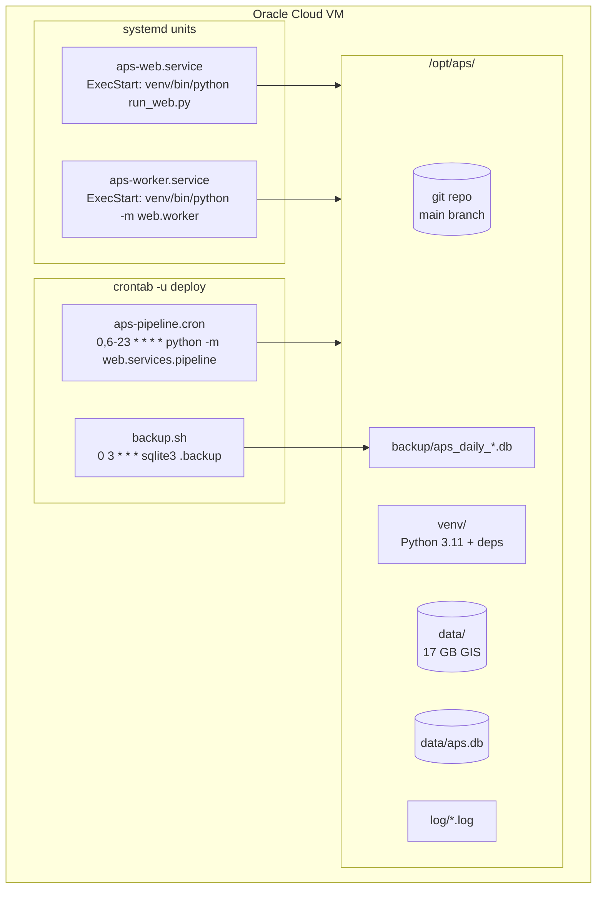
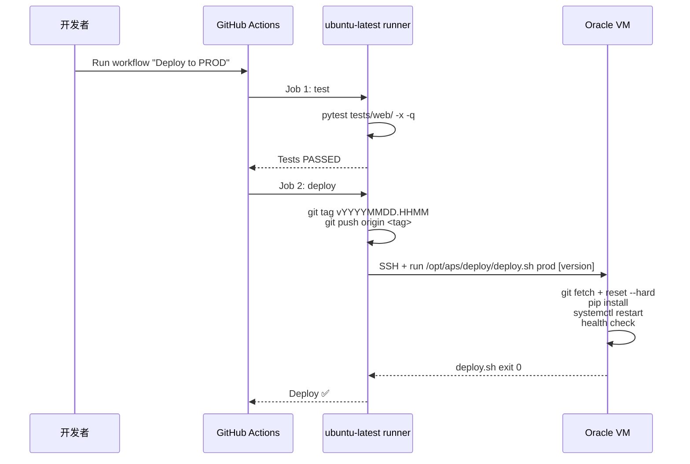
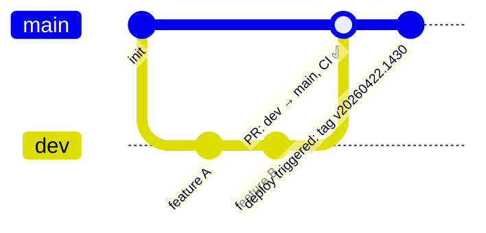

# 09 · 部署与 CI/CD

> 对应目录：`deploy/`（脚本 + systemd unit + cron + logrotate）、`.github/workflows/`（2 个 GitHub Actions workflow）。本章只讲**云端版**部署；桌面版发布用 `build_release.bat` + PyInstaller，见 `10_config_dependencies.md`。

---

## 1. 部署目标

- **平台**：Oracle Cloud Always Free Tier
- **形态**：VM.Standard.A1.Flex 2 OCPU / 8 GB RAM (ARM, Ampere)
- **OS**：Ubuntu 22.04 LTS
- **应用路径**：`/opt/aps/`
- **应用用户**：`deploy`
- **Public Port**：8080（Uvicorn）

备选：如果 A1.Flex "Out of capacity"，退化到 E2.1.Micro（1 GB RAM x86），但会严重依赖 swap。

---

## 2. 部署拓扑



**关键点**：
- `aps-web` 和 `aps-worker` 是**独立进程**，同时运行
- Pipeline 走 cron（不是 systemd timer），`CRON_TZ=Pacific/Auckland` 本地时间语义
- 日志追加到 `/opt/aps/log/*.log`，logrotate 每天轮转

---

## 3. 一次性初始化：`deploy/init-vm.sh`

**作用**：新 VM 从零到能用。单次运行。

运行命令：

```bash
sudo APS_REPO_URL=https://github.com/<org>/akl_property_shortlist.git \
     APS_BRANCH=dev \
     APS_ADMIN_EMAIL=admin@aps.local \
     APS_ADMIN_PASS=<your-secure-password> \
     bash /tmp/aps-setup/deploy/init-vm.sh
```

### 3.1 12 个步骤

| Step | 函数 | 动作 |
|---|---|---|
| 1 | `step_system_packages` | apt install python3, git, libgdal-dev, ufw, logrotate 等 |
| 2 | `step_create_user` | 创建 system user `deploy` |
| 3 | `step_setup_swap` | 创建 2 GB swapfile，swappiness=10 |
| 4 | `step_create_dirs` | `/opt/aps/{data,log,backup}` + chmod 750 |
| 5 | `step_clone_and_install` | clone repo + 创建 venv + pip install |
| 6 | `step_create_env` | 从 `.env.example` 生成 `.env`，**自动生成 64 字节 JWT_SECRET_KEY** |
| 7 | `step_init_db` | `python -m web.db.init_db --seed-admin <email> <pass>` |
| 8 | `step_install_systemd` | 复制 unit 到 `/etc/systemd/system/` + daemon-reload + enable |
| 9 | `step_install_cron` | 合并 `aps-pipeline.cron` 到 deploy 用户 crontab（去重） |
| 10 | `step_install_backup_cron` | 每天 03:00 跑 backup.sh |
| 10b | `step_install_logrotate` | 把 `deploy/logrotate/aps` 复制到 `/etc/logrotate.d/aps` |
| 10c | `step_configure_sudoers` | `/etc/sudoers.d/aps-reenrich`：给 deploy 用户 NOPASSWD 4 个 systemctl 命令（只给 reenrich 用） |
| 11 | `step_configure_firewall` | UFW reset + allow 22/8080 |
| 12 | `step_start_services` | `systemctl start aps-web aps-worker` |

### 3.2 为什么 17 GB GIS 数据不在 init 里

- 数据太大，git 放不下（也不应该）
- 网速不同上传时间从 1 小时到 10 小时不等
- `init-vm.sh` 假设数据**稍后**用 rsync 上传（见 `deploy/README.md` C1-C5）

### 3.3 .env 默认值

`init-vm.sh:step_create_env` 自动注入：
```bash
APP_ENV=production
DATABASE_URL=sqlite:////opt/aps/data/aps.db
JWT_SECRET_KEY=<secrets.token_urlsafe(64)>
```

其余从 `.env.example` 默认（`API_HOST=0.0.0.0`, `API_PORT=8080`, `LOG_LEVEL=INFO`, `PIPELINE_INTERVAL_MINUTES=0`）。

---

## 4. systemd units

### 4.1 `deploy/systemd/aps-web.service`

```ini
[Unit]
Description=APS Web Server (FastAPI + Uvicorn)
After=network.target

[Service]
Type=simple
User=deploy
Group=deploy
WorkingDirectory=/opt/aps
EnvironmentFile=/opt/aps/.env
ExecStart=/opt/aps/venv/bin/python run_web.py
Restart=always
RestartSec=5
StandardOutput=append:/opt/aps/log/web.log
StandardError=append:/opt/aps/log/web.log

[Install]
WantedBy=multi-user.target
```

- `Restart=always` — 进程崩了自动重启
- `RestartSec=5` — 防止 crash loop
- 日志 append 到单文件，logrotate 每天切

### 4.2 `deploy/systemd/aps-worker.service`

和 web 相似，差别：
- `ExecStart=/opt/aps/venv/bin/python -m web.worker`
- `RestartSec=10`（worker 首次启动要 prewarm GIS，启动慢一点）

---

## 5. Cron（`deploy/cron/aps-pipeline.cron`）

```
CRON_TZ=Pacific/Auckland
0 0,6-23 * * * cd /opt/aps && /opt/aps/venv/bin/python -m web.services.pipeline >> /opt/aps/log/pipeline.log 2>&1
```

- `CRON_TZ=Pacific/Auckland` — **必须**用这个（不是 `TZ=`）。`CRON_TZ` 控制 cron 调度器解释时间；`TZ` 只影响命令执行环境
- 每小时 0 分触发：00, 06-23 共 19 次/天
- 6:00 AM 前不跑，因为 NZ 本地夜里 Trade Me 新 listing 很少
- Pipeline 自己带 **file lock**（`/tmp/aps-pipeline.lock`，`pipeline.py:287-296`）防止重叠

### 5.1 Backup cron（`init-vm.sh:step_install_backup_cron`）

```
0 3 * * * /opt/aps/deploy/backup.sh >> /opt/aps/log/backup.log 2>&1
```

每天 03:00 NZ 时间跑备份（详见 `08_database.md` §7）。

---

## 6. GitHub Actions CI/CD（`.github/workflows/`）

### 6.1 `ci.yml` — PR 自动跑测试

```yaml
on:
  pull_request:
    branches: [main, dev]

jobs:
  test:
    runs-on: ubuntu-latest
    steps:
      - uses: actions/checkout@v4
      - uses: actions/setup-python@v5
        with: { python-version: '3.11' }
      - run: pip install -r requirements.txt
      - run: python -m pytest tests/web/ -x -q
```

- 任何 PR 提到 main 或 dev 都触发
- 只跑 `tests/web/`（21 个 test 文件）
- CI fail 就无法 merge（如果 branch protection 打开）

### 6.2 `deploy-prod.yml` — 手动部署到 PROD

```yaml
on:
  workflow_dispatch:
    inputs:
      version:
        description: '部署版本（commit hash 或 tag，留空则部署最新）'
        required: false
```

流程：



### 6.3 Secrets 需要

- `APS_VM_IP` — VM 公网 IP
- `APS_SSH_KEY` — SSH 私钥（Ed25519 PEM）

这两个在 GitHub repo `Settings → Environments → production` 里配置。

---

## 7. `deploy/deploy.sh` —— VM 上真正的部署脚本

**由 GitHub Actions 通过 SSH 触发**，不是开发者手动跑。

```bash
#!/usr/bin/env bash
set -euo pipefail

APP_DIR=/opt/aps
APP_USER=deploy

ENV="${1:-prod}"         # "prod" / "dev"
VERSION="${2:-}"         # 可选 commit/tag，默认部署 branch 最新

if [ "$ENV" = "prod" ]; then BRANCH="${APS_BRANCH:-main}"
else                           BRANCH="${APS_BRANCH:-dev}"
fi

# 1. Pull latest code (force-reset)
sudo -u "$APP_USER" git -C "$APP_DIR" fetch origin --tags --prune
sudo -u "$APP_USER" git -C "$APP_DIR" reset --hard HEAD 2>/dev/null || true
if [ -n "$VERSION" ]; then
    sudo -u "$APP_USER" git -C "$APP_DIR" checkout -B "$BRANCH" "origin/$BRANCH"
    sudo -u "$APP_USER" git -C "$APP_DIR" reset --hard "$VERSION"
else
    sudo -u "$APP_USER" git -C "$APP_DIR" checkout -B "$BRANCH" "origin/$BRANCH"
    sudo -u "$APP_USER" git -C "$APP_DIR" reset --hard "origin/$BRANCH"
fi
sudo -u "$APP_USER" git -C "$APP_DIR" clean -fd   # AFTER checkout (用新的 .gitignore)

# 2. Update deps
sudo -u "$APP_USER" "$APP_DIR/venv/bin/pip" install -r "$APP_DIR/requirements.txt" -q

# 3. Restart services
sudo systemctl restart aps-web
sudo systemctl restart aps-worker

# 4. Health check
sleep 3
HTTP_CODE=$(curl -s -o /dev/null -w "%{http_code}" http://localhost:8080/health)
[ "$HTTP_CODE" = "200" ] || die "Health check failed"
```

### 7.1 几个关键设计决策

- **`git clean -fd` 在 checkout 之后**（`deploy.sh:47-51`）：否则会用旧 `.gitignore` 删掉新 commit 里已忽略的目录（历史教训）
- **`git reset --hard` 覆盖 VM 上的漂移**：防止手动热修过一次之后再用 CI/CD 时 merge 冲突
- **顺序**：code → deps → restart → health check。deps 先更新，service 再重启，让新代码用新依赖
- **Health check 失败抛错**：GitHub Actions 会收到失败，notification 触发

---

## 8. 分支策略



- **dev** — 开发分支，所有 feature 提到 dev
- **main** — 受保护分支，只接受 PR 合入
- **PR dev → main** — CI 自动跑 pytest（`ci.yml`）
- **部署只从 main**：`deploy-prod.yml` 手动触发，自动 tag 并部署

**紧急热修**（仅 CI/CD 不可用时）：
```bash
ssh ubuntu@<vm-ip>
cd /opt/aps
sudo -u deploy git pull origin main
sudo -u deploy /opt/aps/venv/bin/pip install -r requirements.txt -q
sudo systemctl restart aps-web aps-worker
```
**热修后必须把同样改动提交到 git 并触发正式部署**，否则下次正式部署会覆盖热修。

---

## 9. 日志管理

### 9.1 日志文件

| File | 内容 |
|---|---|
| `/opt/aps/log/web.log` | aps-web service（FastAPI 请求 + 错误） |
| `/opt/aps/log/worker.log` | aps-worker 进程（单地址 enrichment） |
| `/opt/aps/log/pipeline.log` | cron Pipeline 输出 |
| `/opt/aps/log/reenrich-*.log` | 每次 reenrich 单独文件 |
| `/opt/aps/log/backup.log` | backup.sh 输出 |

### 9.2 logrotate（`deploy/logrotate/aps`）

每天轮转，保留最近 N 天。具体策略在 logrotate config 里定义（这个文件 init-vm.sh 会复制过去）。

### 9.3 journalctl（systemd）

systemd unit 里同时 append 到文件和 journal。查最近日志：
```bash
sudo journalctl -u aps-web -n 100
sudo journalctl -u aps-worker -n 100 -f    # follow
```

---

## 10. 防火墙（两层）

Oracle Cloud 有两层防火墙都要开：

### 10.1 Security List（VCN level）

Oracle Console → Networking → VCN → Subnet → Security List → Ingress Rules：
- TCP 22 from `0.0.0.0/0`（SSH；生产建议限制源 IP）
- TCP 8080 from `0.0.0.0/0`（APS Web）

### 10.2 UFW（VM level）

`init-vm.sh:step_configure_firewall`：
```bash
ufw default deny incoming
ufw default allow outgoing
ufw allow 22/tcp comment "SSH"
ufw allow 8080/tcp comment "APS Web"
ufw --force enable
```

**两层都要 allow** 端口才能通。少一层 → connection refused / timeout。

---

## 11. 文件权限

| 路径 | owner | mode |
|---|---|---|
| `/opt/aps/` | deploy:deploy | 750 |
| `/opt/aps/.env` | deploy:deploy | 600 |
| `/etc/sudoers.d/aps-reenrich` | root:root | 440 |
| `/opt/aps/deploy/backup.sh` | — | +x |

### 11.1 `.env` 为什么 600

`.env` 包含 JWT_SECRET_KEY（能伪造任意用户 token）和 DATABASE_URL。只 deploy 用户可读。

### 11.2 `/etc/sudoers.d/aps-reenrich`

```
deploy ALL=(ALL) NOPASSWD: /bin/systemctl stop aps-web, /bin/systemctl stop aps-worker,
                           /bin/systemctl start aps-web, /bin/systemctl start aps-worker
```

精确到这 4 个命令。deploy 用户**不能**sudo 其他任何东西（安全边界）。

---

## 12. 健康检查

### 12.1 `/health` endpoint（`web/routers/health.py:8-22`）

```json
{
  "app_name": "aps",
  "app_env": "production",
  "status": "ok",        // 或 "degraded"
  "db_ok": true
}
```

- `db_ok` 通过尝试 `SELECT 1` 判断
- `deploy.sh` 部署后用 `curl /health` 判断成功
- 监控工具可以每分钟拉一下

### 12.2 外部监控建议

- UptimeRobot / Better Stack 免费 tier 拉 `http://<vm-ip>:8080/health`
- 失败告警通过邮件/Slack

---

## 13. 常见运维命令

```bash
# 服务控制
sudo systemctl start|stop|restart aps-web
sudo systemctl status aps-web aps-worker

# 日志
sudo journalctl -u aps-web -n 50
tail -f /opt/aps/log/web.log
tail -f /opt/aps/log/pipeline.log

# 磁盘
df -h /opt/aps
du -sh /opt/aps/data/     # ~17 GB (GIS)
du -sh /opt/aps/backup/   # SQLite backups
du -sh /opt/aps/log/

# Pipeline 手动触发
sudo -u deploy bash -c 'cd /opt/aps && source venv/bin/activate && python -m web.services.pipeline'

# 查看 crontab
sudo -u deploy crontab -l

# Re-enrich
ssh -i ~/.ssh/oracle-aps.key ubuntu@<vm-ip>
sudo -u deploy bash -c 'cd /opt/aps && nohup /opt/aps/venv/bin/python -m web.services.reenrich > /opt/aps/log/reenrich-$(date +%Y%m%d_%H%M).log 2>&1 < /dev/null &'

# 升级
# → 走 GitHub Actions "Deploy to PROD" 即可
```

---

## 14. 故障排查矩阵

| 症状 | 查 | 常见原因 |
|---|---|---|
| `curl /health` connection refused | `systemctl status aps-web` | service 没起 / 绑定端口冲突 |
| Web 能开 login 页面但登录失败 | `journalctl -u aps-web -n 50` | JWT_SECRET_KEY 没生成；DB 里没 admin |
| 登录成功但 shortlist 空 | `tail -f /opt/aps/log/pipeline.log` | Pipeline 还没跑过；GIS 数据没上传 |
| 候选一直 pending | `systemctl status aps-worker` | worker 挂了（journalctl 看 traceback） |
| OOM kill | `dmesg \| grep -i oom` | Swap 不够 / parallel workers 开太多 |
| DB locked | `web/db/session.py busy_timeout` | 并发写撞了，5 秒内应自动解决 |
| Pipeline 跑一半失败 | `pipeline_runs.error_message` 列 | Trade Me 403 / GIS 文件 missing / 权限错误 |
| Deploy 后 health check fail | GitHub Actions log | pip install 失败 / 某依赖 ARM 不兼容 |
| pip install fails on ARM | `apt-get install build-essential libgdal-dev` | 某 C 扩展需要编译 |

---

## 15. 备份恢复

**冷恢复**：

```bash
sudo systemctl stop aps-web aps-worker
sudo cp /opt/aps/backup/aps_daily_20260422_030000.db /opt/aps/data/aps.db
sudo rm /opt/aps/data/aps.db-wal /opt/aps/data/aps.db-shm  # 清理 WAL
sudo chown deploy:deploy /opt/aps/data/aps.db
sudo systemctl start aps-web aps-worker
curl http://localhost:8080/health
```

RPO：上次 03:00 备份之后到故障时间点的数据丢失（最多 24 h 但通常 < 1 h 因为 WAL 本身能支撑增量）。

RTO：~5 min（拷文件 + 启动服务）。

---

## 16. 参考文件

- `deploy/deploy.sh`（79 行，GitHub Actions 调用）
- `deploy/init-vm.sh`（376 行，一次性初始化）
- `deploy/backup.sh`（97 行）
- `deploy/systemd/aps-web.service`（19 行）
- `deploy/systemd/aps-worker.service`（19 行）
- `deploy/cron/aps-pipeline.cron`（9 行）
- `deploy/logrotate/aps`（logrotate config）
- `deploy/README.md`（548 行；含完整分步 checklist）
- `.github/workflows/ci.yml`（22 行）
- `.github/workflows/deploy-prod.yml`（63 行）
