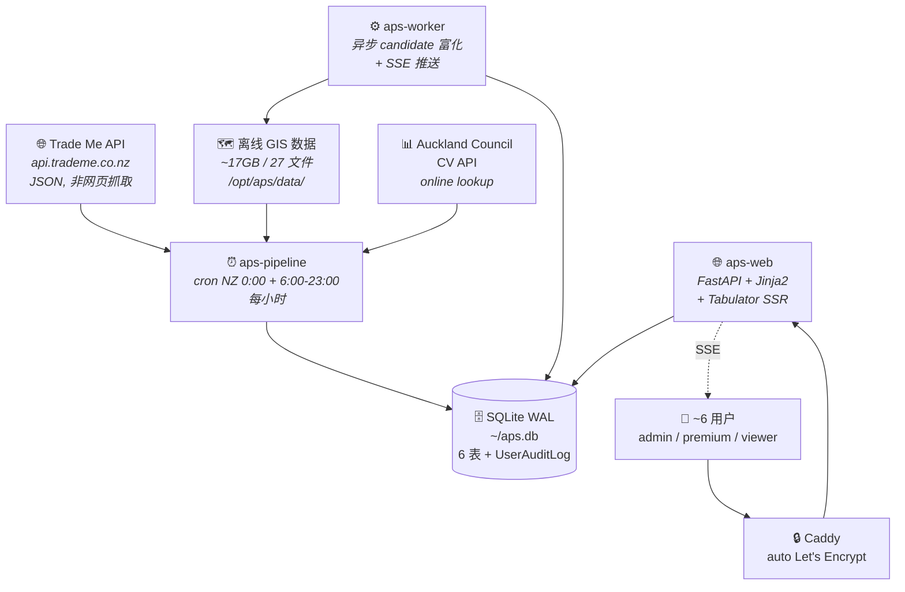
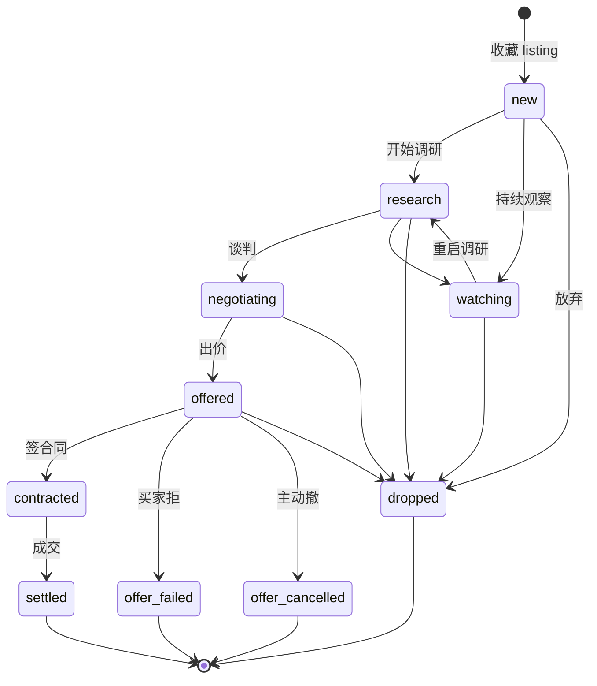
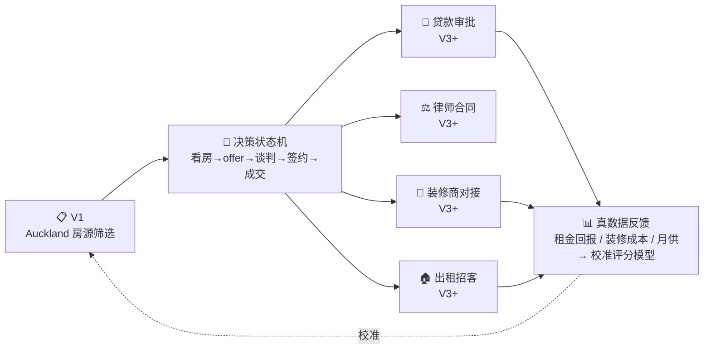

# ⭐ APS 北极星 — V1 目标 + 最终远景 + 决策门禁

!!! warning "决策门禁"
    任何 spec / plan / brainstorming / "是否在 scope" 决策前必先回查此文档,
    用 [§3 "5 问 cross-check"](#h-num3-decision-5-questions) 过一遍。任一问答 否 → 停下重 brainstorm。

    决策结果在用户可见回应里显式说一句"此决策与北极星目标关系: X"。

> 时间锚: **2026-05-17 北极星首版 ship** (跟 options-ai-trader 北极星对齐格式, APS 精简版)
>
> 关联文档:
>
> - [项目概述](../01_overview.md) — 业务定位 / 两种交付形态 / 高层流水线
> - [双形态架构对比](../02_architecture.md) — 桌面版 vs 云端版数据流
> - [云端 Web 平台](../07_web_platform.md) — FastAPI + Worker + Pipeline + JWT
> - [路线图](../11_roadmap.md) — Backlog / 技术债 / 开放问题

---

## 1. V1 目标 (M1 = candidates 决策闭环 ship)

**核心**: Trade Me 每小时抓 Auckland 新房源 → 离线 GIS 富化 (zoning / slope / flood / pipes / amenities / schools / 评分) → shortlist Web 展示 → 用户收藏成 candidate → **进入决策状态机 (new → research → offered → negotiating → contracted → settled)** → admin 看小群体加总报表。

### 1.1 主用户 / 主入口 / 生产市场

| 项 | 内容 |
|---|---|
| 主用户 | friends-and-family beta (~6 人 admin/premium/viewer 混合), **未来向付费 premium 开放** (SaaS 预留) |
| 主入口 | Web `https://property.yuanshan1900.com` (Caddy + auto HTTPS), 中文 UI (双语 toggle) |
| 生产市场 | **Auckland 拿地 / 旧房改造选址**, 不跨城市 (Wellington/Christchurch 是 V2+ 子能力, 不主线) |

### 1.2 系统真实只有 3 类东西

| 类别 | 内容 |
|---|---|
| **Pipeline cron** | NZ 0:00 + 6:00-23:00 每小时, host 直装 + crontab + Pacific/Auckland 系统 TZ; Trade Me API → GIS 富化 → DB UPSERT → 评分 |
| **Web (FastAPI + Jinja2 SSR + Tabulator) + Worker** | 异步 candidate 富化; 业务请求 + SSE 实时推送状态 |
| **SQLite WAL (`~/aps.db`, 单机)** | 6 张表 `users / properties / candidates / enrichment_jobs / pipeline_runs / export_logs` + `UserAuditLog`. SQLAlchemy ORM 必走, **禁裸 SQL** |

### 1.3 3 角色 (`User.role`)

| 角色 | 谁 | 权限 |
|---|---|---|
| **admin** | 我 + 选定 user | 全局视图 + 多用户加总报表 + 用户 CRUD |
| **premium** | 付费 / 内圈 | 看 shortlist + candidates + **Excel 导出** (含缩略图) |
| **viewer** | 基础 | 看 shortlist + candidates, **不能** Excel 导出 |

### 1.4 Candidate 决策状态机

`Candidate.progress` 已有 enum **10 值** (code: `web/routers/candidates.py::PROGRESS_CHOICES`), **V1 必做完整闭环**:

!!! note "model docstring stale"
    `web/db/models.py:214` 注释只列了 8 值, 实际 10 值. 跟随首个 progress UI spec 实施同 commit 修.

**V1 缺口**: progress UI inline edit 已有 (基础) 但缺 audit trail (谁/何时/from→to/notes) + timeline; admin 跨用户 aggregate 报表 0 实现; 用户 onboarding 0 自助 (全靠 admin SSH).

### 1.5 3 类数据源

| 数据源 | 内容 | 备注 |
|---|---|---|
| **Trade Me API** | `api.trademe.co.nz` JSON, 房源 listing + 价格 + 图片 | 非网页抓取; Oracle Cloud Melbourne IP 已确认能正常访问 API endpoint |
| **离线 GIS 数据** | ~17GB, 27 文件 `/opt/aps/data/`; Auckland 全套 gpkg/tif | parcels / zoning / DEM (slope) / flood / overland flow / pipes / parks / schools / amenities / transmission lines / state houses / watercare / landfills |
| **Auckland Council CV API** | 房源 CV 估值, online lookup | 可选刷新 (reenrich `--refresh-cv` flag) |

### 1.6 数据生命周期

| 阶段 | 行为 |
|---|---|
| 新 listing | UPSERT (按 `listing_id` 去重) |
| 180 天 (`ARCHIVE_AFTER_DAYS`) | pipeline 自动 `archived_at=now` 标归档 |
| shortlist API / admin KPI | 默认 `WHERE archived_at IS NULL`, 总房源 KPI 仍展示历史总数 |
| 同 listing_id 复活 (Trade Me 再上架) | UPSERT 清 `archived_at` 回 NULL |
| Candidate | **不删**, 跨用户/跨 session 60s debounce (**非 UniqueConstraint**) 允许同一 listing 多次收藏成不同 candidate |

### 1.7 关键评分维度

`scoring.py` 加权可调, 客户配置:

`land_area` / `rent` / `oldness` / `zone` / `slope` / `frontage` / `sewer` / `stormwater` — **7 维加权 → score (0-100)**

### 1.8 部署

内部项目, host 直装 + systemd, **不上 Docker / 不上 PG / 不上 Nginx**:

| 项 | 值 |
|---|---|
| VM | Oracle Cloud A1.Flex ARM (2 OCPU / 8GB), 系统 TZ = Pacific/Auckland |
| Services | `aps-web` + `aps-worker` (systemd), `aps-pipeline` (cron) |
| 反向代理 | Caddy (auto Let's Encrypt cert) |
| CI/CD | GitHub Actions, dev → PR → main → "Deploy to PROD" 手动 trigger |

!!! danger "禁止 SSH 改代码"
    部署必走 GitHub Actions Workflow。允许 SSH 仅: 查日志 / 诊断 / **一次性运维** (密码重置 / 数据迁移 / iptables)。

### 1.9 V1 完成态判定 (Definition of Done)

| # | 项 | 状态 |
|---|---|---|
| 1 | Web 平台 + cron pipeline + Caddy HTTPS + 180 天归档 + Candidates 富化 + SSE | ✅ 已 ship 2026-04 ~ 05 |
| 2 | Candidate progress UI 编辑 (state-machine UI) | ❌ **V1 必做** |
| 3 | Admin 多用户 aggregate 报表 (跨 6 user 决策状态 rollup) | ❌ **V1 必做** |
| 4 | 用户 onboarding 自助流程 (signup / 邮箱验证 / 密码自助重置, 减少 admin 干预) | ❌ **V1 必做** |

---

## 2. 最终远景 (Phase V3+, 不限时间)

!!! tip "远景核心理念"
    从"帮用户筛选 Auckland 房源"演进到"完整的买/卖/装修/出租闭环"。

    **shortlist 是入口, 决策闭环是骨架, 跨领域扩展是远景**。

### 2.1 远景核心: 房产跨领域闭环

### 2.2 远景子能力 (按重要性, 不分版本顺序)

| # | 模块 | 阶段 | 说明 |
|---|---|---|---|
| 1 | **Candidate 决策闭环完整化** | V1 起步, V2 加深 | Progress 多阶段 UI + 时间轴 + 文件附件 (合同 PDF / 看房照片 / 邮件) + 提醒邮件 (出价过期 / 合同 deadline) + 多 user 协作 |
| 2 | **跨城市扩展** | V2 | Wellington / Christchurch / Hamilton / Tauranga; 数据源同 Trade Me API; GIS 数据集每城独立 (~17GB/城); 评分维度按城市本地化 (e.g. Christchurch 地震分区) |
| 3 | **贷款 (loan) 模块** | V3+ | 主流银行 (ANZ / ASB / BNZ / Kiwibank / Westpac) API 接入或代理; 一键 pre-approval 模拟; 浮动 vs 固定利率比对; 跟 candidate progress 联动 |
| 4 | **合同 (contract) 模块** | V3+ | NZ 标准合同模板 (REINZ / ADLS S&P Agreement); 律师对接 (e-sign / 邮件分发); 关键条款 builder (cooling-off / due diligence / settlement date / chattels) |
| 5 | **装修 (renovation) 模块** | V3+ | 装修商 marketplace; 报价 RFQ 流程 (图 + 需求 → 多家报价); 进度跟踪 (foundation / framing / cladding / interior / handover); 成本数据库 (per sqm 单价基线) |
| 6 | **出租 (rental) 模块** | V3+ | Trade Me Rentals / OneRoof Rent API; 租客 screening (背调 / 信用); 租约管理 (NZ RTA 标准条款); 维护工单; 月度收益报表 → **反馈到 V1 评分模型** 校准 `score_rent` |
| 7 | **商业化能力位** | V1 起预留 forward compat, V2 真实施 | Billing (订阅制, premium tier 解锁 Excel 导出 + 多 candidate 协作 + 邮件通知); 多租户隔离 (data 仍共享 GIS+评分, candidates 私有); Onboarding 自助; Stripe / PayPal 接入 (轻量, 不上完整 ERP) |
| 8 | **分隔计算器** (subdivision feasibility calculator) | V2 重点 (跟决策闭环紧密绑) | 输入: 地块边界 + Unitary Plan zone + Council overlay; 输出: 可分块数 / 单块最小面积 / max FAR (容积率) / 建筑高度上限 / 后退距离 / 阳光通道. 数据源: Auckland Council Unitary Plan rules + 已有 17GB GIS. **Trade Me 不做**, 经纪/律师收费咨询, APS 自助算 → 决定 offer. 联动: 加 `subdivision_yield` 维度入 V1 `score` |
| 9 | **选租房 (rental discovery, 租客侧)** | V3+ 远景, 跟 V1 选房 (业主/投资侧) 平行 | 新用户角色 `renter`; 数据源 Trade Me Rentals / OneRoof Rent (跟 V1 不同 endpoint); 富化维度: 通勤时间 (工作地 → 上班分钟数) / 邻居社区 / 学校学区 / 周边设施 (权重不同); 决策状态机轻量: shortlist → 看房 → 签 tenancy agreement → settled |
| 10 | **综合工具定位** | 框架性 — 贯穿所有版本 | APS 远景不是单点工具, 是 **NZ 房地产领域综合且功能强大的工具集**. **业主侧**: V1 选房 + V2 分隔计算器 + V3+ 贷款/合同/装修/招租. **租客侧**: V3+ 选租房 + 租约管理 / 维护工单. **投资侧**: V1 评分模型 + V3+ rental 月度收益反馈. 多 persona → 多种价值 → 多种付费层 (商业化天然分层) |

### 2.3 远景反偏离 — 永久不做

!!! danger "永久不做"
    - **跨国扩展** (澳洲 / 中国 / 其他英语国家) — 法律合规 / 数据源 / 评分维度差异太大, 不在范围
    - **二手房成交价数据销售 / 数据 API 对外** — 我们是消费者侧工具, 不做 B2B 数据平台
    - **房产经纪 (agent / agency) 替代品** — 不做撮合 / 不做经纪服务, 用户仍跟现有经纪走交易
    - **房产估值 AI / AVM (Automated Valuation Model)** — Auckland Council CV + Trade Me 估值已够用, 不重造轮子
    - **加密资产 / Web3 / NFT 房产** — 不在范围

### 2.4 一句话总结

!!! success "APS 远景 = NZ 房地产领域综合且功能强大的工具集" 
    多 persona: **业主侧 + 租客侧 + 投资侧**

**节奏**:

- **V1** = Auckland 选房 → candidates 决策闭环 + GIS 富化评分 (Trade Me 没做的护城河)
- **V2** = 多用户协作 + **分隔计算器** + 商业化能力位 (Billing / 多租户)
- **V3+** = 跨贷款 / 合同 / 装修 / 招租 (业主侧) + **选租房 / 租约管理** (租客侧) 完整 NZ 房地产工具集
- **始终聚焦 NZ** (V1 Auckland 主战场, V2+ 才看 NZ 其他主流城市), **永远不跨国 / 不做经纪替代 / 不做 B2B 数据平台**

---

## 3. 决策 5 问 cross-check (每次 spec / plan / brainstorm 必过) {#h-num3-decision-5-questions}

!!! info "答题规则"
    所有 5 问 **是 = 守住北极星**, **否 = 偏离**. 任一问答否 → 停下重 brainstorm.

| # | 问题 (是 = 守住) | 偏离信号 (出现这些 → 是答了"否") |
|---|---|---|
| 1 | **这件事是否服务 Auckland 选房决策闭环?** (shortlist → candidate → 决策状态机 → 远景 跨贷款/合同/装修/招租) | 做 generic real estate 工具 / 做城市无关展示 / 做内容平台 (博客/论坛/教程) / 做 agent 撮合 |
| 2 | **是否预留商业化能力位?** (多角色 admin/premium/viewer / 多租户 candidates 私有 / billing hook) | 写死 `user_id=1` / 全局 admin 可见所有 candidate / Pipeline 共享数据没考虑 premium-only / billing hook 完全没留 |
| 3 | **是否预留远景"跨领域"扩展?** (Candidate 状态机能加 loan/contract/renovation/rental; Property 模型能挂额外维度) | `Candidate.progress` 用 if-elif 写死 8 值 / Property schema 硬编码"只为选房" / 数据模型没留 jsonb / metadata 扩展位 |
| 4 | **是否避免依赖人工 admin 手工操作?** (用户管理 / 密码重置 / 数据更新 / 告警 都走 UI/API, 不靠 SSH) | admin 必须每天 SSH 跑命令 / 密码重置必走 SSH / 数据回填必须人工触发 / 用户 onboarding 必须 admin 手动建账号 |
| 5 | **是否专注我们的护城河, 不重做 Trade Me 已有功能?** APS 价值 = **GIS 富化 + 评分 + 决策状态机** (Trade Me 没做的); 不重做 Trade Me 已做的 = 搜索 / 地图浏览 / 价格走势 / 房源详情抓取 | 抓房源详情数据 (Trade Me API 已给完整) / 做地图浏览页面 / 做房产搜索页 (Trade Me 就是搜索引擎) / 做房产价格走势图 (我们没历史数据) |

!!! tip "5 问内涵速记"
    - **Q1 = 守闭环** (Auckland 选房, 不偏 generic)
    - **Q2 = 守商业化** (多角色 + billing 能力位)
    - **Q3 = 守远景** (跨领域扩展 hook)
    - **Q4 = 守自动化** (不靠 SSH 手工)
    - **Q5 = 守差异化** (做 Trade Me 没做的 GIS+评分+决策, 不重做 Trade Me 已做的)

!!! success "Q5 一句话"
    Trade Me = "**找**房子的地方"; APS = "**判断**这房子值不值得开发/改造 + **跟踪**看完到成交全过程的工具".

!!! warning "任一问答 否 → 停下重 brainstorm"

---

## 4. 中间路径 (按依赖顺序, 每条对应一个独立 spec)

> 状态枚举: **SHIPPED-COMMIT-XXX** (已落地带 commit sha) / **SPEC-DRAFTED** (spec 写完未实施) / **IDEA** (待 spec)

| # | Spec | 状态 | 对应 §2 |
|---|---|---|---|
| 0 | Web 平台 MVP (Phase 1-7: auth + shortlist + candidates + admin + cron + worker) | **SHIPPED 2026-04-15** | 基础 |
| 1 | SSE 实时推送 (替换 setInterval 轮询) | **SHIPPED 2026-04-?** | 基础 |
| 2 | Caddy + property.yuanshan1900.com + auto HTTPS | **SHIPPED 2026-04~05** (落地时间无记录, 2026-05-17 才回写文档) | 基础 |
| 3 | 6 个月归档 + Candidates 解放重复 (`archived_at` 列 + drop `uq_user_listing`) | **SHIPPED-COMMIT-e5273a0 2026-04-23 (PR #13)** | 基础 (数据规模可控) |
| 4 | Cron TZ 系统级修复 (timedatectl Pacific/Auckland) | **SHIPPED-COMMIT-bed6660 2026-04-23 (PR #13)** | 基础 |
| 5 | **Candidate 决策状态机 UI** (audit trail + 状态时间轴 + transition notes) | **SHIPPED-COMMIT-16d57b9 2026-05-17** ([spec](2026-05-17-candidate-state-machine-ui-design.md)) | (1) 决策闭环 |
| 6 | **Admin 多用户 aggregate 报表** (跨 user × progress matrix + drill-down) | **SHIPPED-COMMIT-16d57b9 2026-05-17** ([spec](2026-05-17-admin-aggregate-report-design.md), 无 schema 变更) | (1) 决策闭环 |
| 7 | **用户管理 方案 X** (admin UI 一键生成临时密码 + 强制改密页面, **无 email infra**) | **SHIPPED-COMMIT-16d57b9 2026-05-17** ([spec](2026-05-17-user-onboarding-self-service-design.md), V2 商业化升级完全 self-service) | (4) 反"依赖人工 admin" |
| 8 | 邮件通知基础 (candidate 状态变更 / daily digest / 出价过期提醒) | IDEA — V2 | (1) 决策闭环 |
| 9 | 文件附件 (合同 PDF / 看房照片 attach 到 candidate) | IDEA — V2 | (1) 决策闭环 |
| 10 | Billing / 订阅基础设施 (Stripe 接入, premium tier 解锁 Excel 导出 + 邮件通知) | IDEA — V2 | (2) 商业化能力位 |
| 11 | 多 candidate 协作 (家庭成员共看同一 candidate 留 notes) | IDEA — V2 | (1) 决策闭环 |
| 12 | 跨城市扩展 (Wellington / Christchurch / Hamilton) | IDEA — V2+ | (3) 跨城市远景 |
| 13 | Loan 模块 (银行 API 接入 + pre-approval 模拟) | IDEA — V3+ 远景 | (4) 跨领域 |
| 14 | Contract 模块 (NZ 标准 S&P 模板 + e-sign) | IDEA — V3+ 远景 | (5) 跨领域 |
| 15 | Renovation 模块 (装修商 marketplace + 报价 RFQ) | IDEA — V3+ 远景 | (6) 跨领域 |
| 16 | Rental 模块 — 业主侧 (招租 + 租约 + 维护工单 + 月度报表 → 反馈评分模型) | IDEA — V3+ 远景 | (6) 业主侧 rental |
| 17 | **分隔计算器** (subdivision feasibility — 输入地块 → 估算可分块数 / 容积率 / 高度上限, 基于 Unitary Plan zone overlay) | IDEA — V2 重点 | (8) 分隔计算器 |
| 18 | 选租房模块 — 租客侧 (新 `renter` 角色 + Trade Me Rentals 数据源 + 通勤时间富化 + 轻量决策状态机) | IDEA — V3+ 远景 | (9) 租客侧流 |

---

## 5. 已嵌入当前架构的 forward compat hooks (不能改坏)

每个 hook 对应北极星 5 问中的一条防偏离机制:

| Hook 位置 | 防的偏离 | 状态 |
|---|---|---|
| `User.role` enum (`admin` / `premium` / `viewer`) | 防硬编码 "all 用户同权限"; 商业化时 premium-only 功能查 role | 已嵌入 |
| `Candidate.progress` enum (8 值 new/research/offered/.../settled/watching/dropped) | 防状态机用 boolean 拼接; 加新状态只改 enum + UI | 已嵌入 |
| `Property.archived_at` nullable (而非物理删) | 防数据 lifecycle 不可逆; 同 listing_id 复活通过 UPSERT 清字段 | 已嵌入 (2026-04-23 PR #13) |
| `column_map.py` single source of truth (pipeline row dict ↔ DB 列名) | 防 pipeline 跟 DB schema 强耦合; 加新列只改一处 | 已嵌入 |
| `enrichers/*` 跟 web 解耦 (`web/services/pipeline.py` 调 enrichers, 不嵌入业务) | 防 future data source 替换或重写 enricher 时动 web 代码 | 已嵌入 |
| `web/auth/` 独立模块 (`auth/auth.py` + `deps.py` 注入, 不嵌入 router) | 防 future SSO/OAuth/Magic Link 升级要重写 router | 已嵌入 |
| SQLAlchemy ORM 必走 (禁裸 SQL 在业务代码) | 防 SQLite → PG 升级要全文搜替换 SQL; ORM dialect 屏蔽差异 | 已嵌入 |
| Pipeline = cron + run-once (非 daemon) | 防失败重启难; cron 天然每小时重试 + 简单 | 已嵌入 |
| Pipeline `UPSERT` (按 listing_id) 而非 INSERT-only | 防同 listing 再上架时重复插入或丢失 enrichment 历史 | 已嵌入 |
| Candidate 60s debounce (非 `UniqueConstraint(user_id, listing_id)`) | 防 archive 后用户重新收藏同 listing 时被 DB 阻塞 | 已嵌入 (2026-04-23 PR #13) |
| `web/templates/login.html` `<input type="text">` (非 `type="email"`) | 防 username 不带 @ 时浏览器拦; 商业化 SSO 用户名可能是 phone/UUID | 已嵌入 (2026-05-17 PR #14) |
| `Candidate` schema 跟 `Property` schema 平行 (重复字段) | 防 candidate 必须 join properties 才能富化; 用户输入 address candidate 独立富化 | 已嵌入 |
| GitHub Secret `APS_VM_IP` + `APS_SSH_KEY` (非代码硬编码) | 防 VM IP 漂移要改代码; secret 跟 memory 同 commit sync (2026-05-17 教训) | 已嵌入 |
| Caddy auto Let's Encrypt cert (非手工 nginx + certbot) | 防 cert 90 天到期手工续; Caddy 自动处理 | 已嵌入 |

!!! warning "Hook 改动门禁"
    这些 hook 任何 PR 不能踩坏。改动涉及任一 hook 时**必须显式说**"此改动如何保留 forward compat"。

---

## 6. 历史决策回放 (记录 why 不消失) {#h-num6-decision-history}

| 时间 | 决策 | 原因 |
|---|---|---|
| 2026-04-07 | FastAPI + Jinja2 SSR + Tabulator (非 React/Next.js) | 0 构建工具, Tabulator MIT free 内置 filter/sort/pagination, 单语言 Python 维护 |
| 2026-04-07 | SQLite WAL + SQLAlchemy ORM (非 PostgreSQL) | 最低成本 + 单机够用; ORM 抽象为未来 PG 留门 |
| 2026-04-07 | host 直装 + systemd + cron (非 Docker) | Oracle Cloud Always Free 配额够; Docker overhead 没必要 |
| 2026-04-15 | Oracle Cloud A1.Flex ARM (非 Azure B1s) | Always Free 2 OCPU/8GB 远超 Azure B1s 1GB; 期权助手已在 Oracle 共享管理 |
| 2026-04-15 | 上云 + Trade Me API 真测 | `api.trademe.co.nz` 从 Oracle Melbourne IP 正常 (网页抓取 403, JSON API OK) |
| 2026-04-17 | dev→PR→main→Deploy to PROD Actions 流程, **禁止 SSH 改代码** | CI 强制 + 减少人工失误; 例外允许 SSH 仅 一次性运维 (密码重置 / 数据迁移) |
| 2026-04-18→23 | Cron TZ 三轮修复, 终极方案 `timedatectl set-timezone Pacific/Auckland` | vixie-cron user crontab 不识别 `CRON_TZ=`; 系统 TZ 切 NZ 一劳永逸 + DST 自动 |
| 2026-04-19 | reenrich 默认跳 CV 重抓 (`--refresh-cv` 保留覆盖能力) | 下架 listing 全 miss 浪费 8-15 min; 单 OCPU ARM 性能瓶颈 |
| 2026-04-23 (PR #13) | 6 个月归档 + Candidates drop `uq_user_listing` | 数据规模可控 + listing 可复活 + 跨 session 重复收藏合法 |
| 2026-04-? (落地时间无记录) | Caddy + property.yuanshan1900.com + auto HTTPS | 自定义域名 + 自动 cert; **2026-05-17 才回写文档** (之前 docs 还说"暂不配 HTTPS") |
| 2026-05-17 (PR #14) | admin 简化为 `admin` / `changeme` + login form `type=email→text` | 用户忘原密码 + 浏览器 type=email 拦 username; 商业化未来 SSO username 可能不带 @ (forward compat) |
| 2026-05-17 | GitHub Secret `APS_VM_IP` 同 commit sync 强制 (跟 memory/docs 同步) | `92d2aa8` 漏改 Secret 导致 deploy `i/o timeout`; 教训进 memory + 进 §5 hook 记录 |
| 2026-05-17 | **北极星 memory + wiki 首版 ship** | 用户喊"项目规范化"; 跟 options-ai-trader 格式对齐 (§1-§7); APS 比 options 简单 (无 real money/agent/LLM/market hours) 精简到 ~350 行 |
| 2026-05-17 | **5 问 phrasing 统一为 "是 = 守住"** | 首版 Q1-3 是正向, Q4-5 是反向 (是 = 偏离), 用户 review 时混淆答 Q4 是; 改为全 5 问统一 "是 = 守住, 否 = 偏离" + 加 Q5 一句话 (Trade Me = 找, APS = 判断 + 跟踪) |
| 2026-05-17 | **远景 §2 扩 — 加分隔计算器 + 选租房 + 综合工具定位** | 用户补充: "有很多 trademe 没有的功能, 未来还要做分隔计算器等等; 这个网站会变成选房选租房等等综合且功能强大的工具". 加 §2 #8 分隔计算器 (V2 重点, 跟决策闭环紧密绑) + #9 选租房 (V3+ 租客侧 persona) + #10 综合工具定位 (业主侧 + 租客侧 + 投资侧多 persona); §4 加 spec #17/#18; 一句话总结从"V1+V2+V3+ 单一闭环"改为"NZ 房地产综合工具集" |
| 2026-05-17 | **V1 必做 3 spec 一批 ship** (#5 Candidate UI / #6 Admin 报表 / #7 用户 onboarding) | 用户 "全部 spec" 触发; 3 subagent 并行 (~6 min wallclock vs 串行 ~25 min), 同时写项目 repo + docs-hub wiki (内容一致). 总 ~1195 行 spec. **配套修 stale**: SA1 抓到北极星 §1 progress "8 值" 实际是 10 值 (`new/watching/research/negotiating/offered/offer_failed/offer_cancelled/contracted/settled/dropped`, code `web/routers/candidates.py:80`), 同 commit 修. 3 个 BIG open question 待用户决. 北极星 §4 #5/#6/#7 状态 IDEA → SPEC-DRAFTED-2026-05-17 |
| 2026-05-17 | **3 BIG open question 用户决** (#5 progress 倒退 / #5 notes cap / #7 email infra) | (a) **#5 progress 允许倒退 = A. 允许任意转** — friends-and-family beta 信任用户, settled→research 都行; 商业化加约束 hook 不破坏 forward compat. (b) **#5 transition_notes 设 2000 char 上限** — 前端 textarea maxlength + 后端 pydantic Field(max_length=2000) 双校验. (c) **#7 选方案 X (无 email + admin UI)** — 用户质疑 "为什么用 email"; friends-and-family 6 人都是 admin 拉的, 不需要陌生人公开 signup. spec 重写 544→497 行: admin UI "新建用户"/"重置密码" 按钮生成临时密码 admin 截图发 WeChat → user login 后 force_password_change flag 强制改密. 5 问 Q4 答 "部分" (解 SSH 痛点, 不到完全 self-service, V2 商业化时升级). V2 加 email 时 forward compat hook 留 (`web/services/email.py` stub + `User.created_via='self_signup'` enum 值保留位). spec #5 Q1/Q2 标 "用户决" 段; spec #7 完全重写 v2 |
| 2026-05-17 | **V1 必做 3 spec 全部 SHIPPED (commit 16d57b9 → main → Deploy to PROD)** | 用户喊 "直接 C 能并行尽量并行 提速". 3 wave 执行: **Wave 0** (main 单线 10 min) schema 准备 (commit `777e81c` — `candidate_progress_history` CREATE TABLE + `User` 3 列 ADD COLUMN with DEFAULT, additive 只加不删, 跟 PR #13 同 pattern; PROD pre-deploy snapshot `/opt/aps/backups/pre_v1_3specs_1779006606.db` 307MB). **Wave 1** (3 SA 并行 ~20 min) 每个 SA 精确指定文件分区避免冲突: SA1=#5 / SA2=#6 / SA3=#7. **Wave 2** (15 min) pytest 189 PASS, commit `16d57b9` push, PR #15, CI 2m11s pass, merge to main, Deploy to PROD 14s, **SSH 手动跑 init_db** (deploy.sh 不自动跑 migration — 真 bug, 同 commit 修了 deploy.sh 加 step 2b), 重启 aps-web/worker, end-to-end verify (login admin/changeme → 303 + JWT `fpc:false`, schema inspect 全到位). 9 commit 跨 3 repo. 北极星 §4 #5/#6/#7 IDEA → SPEC-DRAFTED → **SHIPPED-COMMIT-16d57b9** |

---

## 7. 反偏离常见警示

如果你 (Claude / 任何 contributor) 在做下面这些事, **先停下回看本文档**:

!!! danger "Stop signs"
    - 想在 V1 实现远景 §2 的"贷款/合同/装修/招租"模块 — V3+ 远景, V1 不碰
    - 想跨城市/跨国家 — Auckland 主战场, V2+ 才看 NZ 其他城市, **永远不跨国**
    - 想重做 Trade Me 已有的搜索 / 地图浏览 / 价格走势 / 房源详情抓取 — 我们价值在 **GIS 富化 + 评分 + 决策状态机**, 不重复 Trade Me
    - 想做 agent / agency 撮合 — 永远不做经纪服务, 用户跟现有经纪走交易
    - 想做 AVM (房产估值 AI) — Auckland Council CV 已够用, 不重造轮子
    - 想做对外 B2B 数据 API / 销售房产数据 — 我们是消费者侧工具
    - 想把 admin 操作做成 "必须 SSH" — 都要走 UI / API; 例外仅 一次性运维
    - 想硬编码 `user_id=1` 或 "只 admin 看到" — 维持多角色 (admin/premium/viewer) + 商业化能力位
    - 想引入付费第三方 (Mapbox / Twilio / OpenAI 等) — Oracle Always Free + 现有依赖即可; 用户预算反对付费组件
    - 想给 `Candidate.progress` 加 `if-elif` 写死 8 值业务逻辑 — 用 enum + state machine 通用化 (V3+ loan/contract/renovation 加新阶段时不要改逻辑)
    - 想把 `Pipeline` 改成 daemon (持续运行) — cron + run-once 简单 + 失败重启天然; 不要造成 in-memory state 跨 run 依赖
    - 想给 `Candidate` 加 `UniqueConstraint(user_id, listing_id)` — 已 drop 是有意的 (允许 archive 后重新收藏); 重新加约束就废了 §5 hook
    - 想绕过 SQLAlchemy ORM 写 raw SQL — 只允许在 migration (`web/db/init_db.py::_migrate_*`); 业务代码必走 ORM
    - 想在 `web/` 下改 `enrichers/providers/scoring/schema/utils` 业务逻辑 — web 是消费者, 业务模块跟它解耦, 不要反向依赖
    - 想用 React / Next.js / 任何 npm 工具链替换 Jinja2 + Tabulator — 偏离 "0 构建工具" 决策; 真的需要 SPA 时重 brainstorm

这些都违反 5 问中至少 1 条 / 或踩坏 §5 forward compat hook。

---

## 维护规则

- 每次 ship 一个 spec → 在 §6 历史决策回放加一行
- 每次新建 forward compat hook → 在 §5 表格加一行
- 每次 spec/plan/brainstorm 决策 → 在 §4 中间路径更新对应状态 (IDEA → SPEC-DRAFTED → SHIPPED-COMMIT-XXX)
- 每次大调整 (V1/V2/V3 范围变化, 远景子能力增删) → 更新 §1/§2 对应段 + 同步项目 memory `project_vision_and_north_star.md` frontmatter `last_reviewed`
- 60 天未 review 触发 hook 提醒 (`review_due` 字段)

---

## 镜像说明 (技术层)

本目录是项目 private repo `docs/superpowers/specs/` 的**公开镜像**。脱敏前过全局 CLAUDE.md §18 红线 — API key / 账户号 / 客户姓名 / 具体金额 / VM IP / 实盘参数具体值 都不进 public。

源头真相在项目 memory `~/.claude/projects/c--Users-yumia-Downloads-akl-property-shortlist/memory/project_vision_and_north_star.md` (项目内 private)。

相关:

- [决策记录 (客户友好提炼)](../decisions/README.md)
- [客户看板 (实时运营)](../dashboard/index.md)

---

**END OF APS NORTH STAR**
