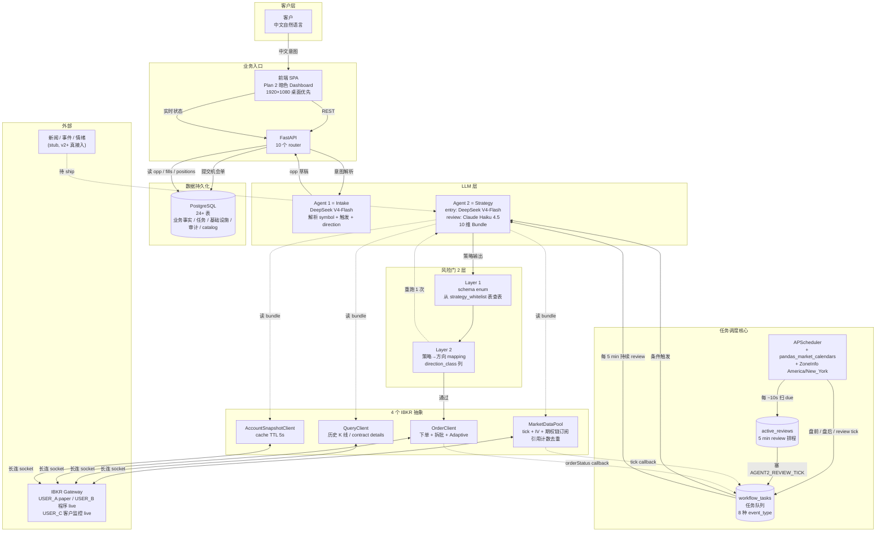

<!-- PAGE_ID: options_01_overview -->
<details>
<summary>📚 Relevant source files</summary>

The following files were used as context for generating this wiki page:

- [CLAUDE.md:1-220](https://github.com/ChunmiaoYu/options_ai_trader/blob/6b3d159/CLAUDE.md#L1-L220)
- [README.md:1-210](https://github.com/ChunmiaoYu/options_ai_trader/blob/6b3d159/README.md#L1-L210)
- [pyproject.toml:1-69](https://github.com/ChunmiaoYu/options_ai_trader/blob/6b3d159/pyproject.toml#L1-L69)
- [src/options_event_trader/api/app.py:1-82](https://github.com/ChunmiaoYu/options_ai_trader/blob/6b3d159/src/options_event_trader/api/app.py#L1-L82)
- [src/options_event_trader/agents/strategy_agent.py:1-129](https://github.com/ChunmiaoYu/options_ai_trader/blob/6b3d159/src/options_event_trader/agents/strategy_agent.py#L1-L129)
- [src/options_event_trader/worker/loop.py:1-364](https://github.com/ChunmiaoYu/options_ai_trader/blob/6b3d159/src/options_event_trader/worker/loop.py#L1-L364)
- [alembic/versions/20260507_0024_add_active_reviews.py](https://github.com/ChunmiaoYu/options_ai_trader/blob/6b3d159/alembic/versions/20260507_0024_add_active_reviews.py)
- [alembic/versions/20260507_0025_add_market_data_subscriptions.py](https://github.com/ChunmiaoYu/options_ai_trader/blob/6b3d159/alembic/versions/20260507_0025_add_market_data_subscriptions.py)
- [alembic/versions/20260507_0026_add_pool_health_log.py](https://github.com/ChunmiaoYu/options_ai_trader/blob/6b3d159/alembic/versions/20260507_0026_add_pool_health_log.py)
- [alembic/versions/20260507_0027_add_event_calendar.py](https://github.com/ChunmiaoYu/options_ai_trader/blob/6b3d159/alembic/versions/20260507_0027_add_event_calendar.py)
- [alembic/versions/20260507_0028_add_strategy_whitelist_seed.py](https://github.com/ChunmiaoYu/options_ai_trader/blob/6b3d159/alembic/versions/20260507_0028_add_strategy_whitelist_seed.py)
- [alembic/versions/20260507_0029_brokerorder_algo_split_batch_and_workflow_check.py](https://github.com/ChunmiaoYu/options_ai_trader/blob/6b3d159/alembic/versions/20260507_0029_brokerorder_algo_split_batch_and_workflow_check.py)
- [specs/architecture-walkthrough.md](specs/architecture-walkthrough.md)

</details>

# 项目概述

> **Related Pages**: [[系统架构|02_architecture.md]], [[Agent1：Intake 解析器|03_intake.md]], [[Agent2：策略决策器|04_strategy.md]], [[执行层：下单与市场数据|05_execution.md]], [[数据库与持久化|06_database.md]], [[API 接口与前端|07_api_frontend.md]], [[依赖项与配置|08_dependencies.md]], [[未来方向与设计决策|09_roadmap.md]]
>
> **配套深度阅读**: [⭐ 架构通俗讲解 — AAPL 突破 280 完整场景](specs/architecture-walkthrough.md)

---

<!-- BEGIN:AUTOGEN options_01_overview_what_it_is -->
## 这是什么系统

Options Event Trader 是一个面向**中国客户**的**美股期权 AI 自动交易系统**。客户用**自然语言中文**描述交易意图（例如"AAPL 突破 280 时买 100 手 call"或"特斯拉财报前来个跨式"），系统自动完成从解析、监控、决策、下单、持仓管理到平仓归档的全流程，全程可审计。

### 主用户 / 主入口 / 生产市场

| 维度 | 内容 |
|---|---|
| **主用户** | 客户本人（中文交互；~$2M RMB 量级美股期权实盘账户） |
| **主入口** | 客户通过前端输入框 / API 用自然语言中文提交交易意图 |
| **生产市场** | 美股期权（NYSE / NASDAQ / ARCA / OPRA） |
| **开发测试市场** | ASX 期权（**仅** CI / 本地测试用，不进 PROD 路径） |
| **永久不做的市场** | 港股市场（HK） — 跟美股市场结构差别太大；**裸卖空所有策略** — 亏损无底线 |

客户不需要：
- 自己选行权价 / 到期日 / 具体手数（Agent 2 触发时实化）
- 自己设止损价位（**客户期权不强制止损**，Agent 2 持续 review 综合决定平仓时机）
- 自己确认每一步（系统自动决策，客户监督；偶尔人工介入审批留 v2）

客户**只需要**说清楚：
- 标的（symbol，可中文公司名 LLM 自动映射 e.g. 特斯拉→TSLA）
- 触发条件（立即 / 时间 / 价格条件 / 时间+条件，4 种）
- 方向（**可选**：BULLISH / BEARISH / VOLATILITY / null；null 时 Agent 2 完全自由）

剩下的细节（具体策略、腿数、TP/SL、quantity）全部由 Agent 2 看客户**完整原话**(`raw_input_text`) 自决。Agent 1 不解析这些字段；客户口语越自然 Agent 2 越能体会语境。

Sources: [project_vision_and_north_star §1](specs/architecture-walkthrough.md), [CLAUDE.md:7-15](https://github.com/ChunmiaoYu/options_ai_trader/blob/6b3d159/CLAUDE.md#L7-L15), invariant 5 (v3 极致瘦身 2026-05-03), invariant 12 (前端中文)
<!-- END:AUTOGEN options_01_overview_what_it_is -->

---

<!-- BEGIN:AUTOGEN options_01_overview_business_layers -->
## 业务实体六层模型

业务概念上系统分为六层，从上到下：

| 层级 | 概念 | 含义 |
|---|---|---|
| 1 | **Opportunity（机会单）** | 客户的一条交易意图，是整个生命周期的根 |
| 2 | **Trigger Rule（触发规则）** | 何时启动 Agent 2 入场决策的条件（立即 / 时间 / PRICE_BREACH / MA_CROSSOVER / 时间+条件） |
| 3 | **Strategy Run（策略运行）** | 一次 Agent 2 决策（输入 10 维 Bundle，输出 StrategyDecision + 风险门验证） |
| 4 | **Execution Run（执行运行）** | 一次下单执行（拆批 / Adaptive 算法 / IBKR 提交） |
| 5 | **Fact Layer（事实层）** | 不可变事实：orders / fills / positions / agent2_decisions / agent1_traces |
| 6 | **Task Queue（任务队列）** | `workflow_tasks` 表驱动的 8 种 event_type 任务调度 |

> **关键认知**：业务实体六层**不变**，但底层基础设施 (2026-05-06 范式升级后) 已不是"3 进程 actor"。"时间工人 / 条件工人 / 信息工人" 这些词指的是 handler 函数的**逻辑分组**，**不是独立进程**。详见 [[系统架构|02_architecture.md]]。

### 1 个 Opportunity 全程会有 N 个 Order

这点很重要：

```
opp #5 (AAPL 突破 280 买 100 手 call)
  ├─ order #42 (entry, 拆 10 批 × 10 手 LMT)
  ├─ order #67 (PARTIAL_CLOSE, 卖 50 手)
  ├─ order #89 (FULL_CLOSE, 卖剩 50 手)
  └─ ...
```

所以任务队列里所有 payload 用 `opp_id` 不用 `order_id`；前端按 opp_id 聚合展示订单列表 + Timeline。

Sources: [CLAUDE.md:18-26](https://github.com/ChunmiaoYu/options_ai_trader/blob/6b3d159/CLAUDE.md#L18-L26), [architecture-walkthrough.md §4 Step 4](specs/architecture-walkthrough.md), invariant 13 (修改 = 取消原单 + 复制单)
<!-- END:AUTOGEN options_01_overview_business_layers -->

---

<!-- BEGIN:AUTOGEN options_01_overview_four_components -->
## 系统真实只有 4 大组成部分

直觉上你可能以为系统里跑着「时间工人 / 条件工人 / 信息工人」三个独立的进程在并行做事——**不是**。系统真实只有 **4 大组成部分**：

| # | 组成部分 | 实际身份 | 触发方式 |
|---|---|---|---|
| 1 | **APScheduler**（排程器） | 时间排程，**唯一**会主动产生任务的代码路径 | 09:00 ET 盘前 / 16:00 ET 盘后 / 每 ~10s 扫 active_reviews |
| 2 | **8 个 event_type handler 函数** | 取任务 → 处理 → 可能塞新任务进队列 | 各 handler 取自己 event_type 的任务 |
| 3 | **4 个 Pool/Client 抽象** | 屏蔽 IBKR API 细节；业务代码**禁止**直接调 IBKR | MarketDataPool / QueryClient / OrderClient / AccountSnapshotClient |
| 4 | **任务队列**（`workflow_tasks` 表） | 持久化挂单板，串起 1/2/3，崩溃恢复用 | PostgreSQL 表 |

### 8 种 event_type 一览（任务总分类）

| # | event_type | 谁触发 | 谁消费 |
|---|---|---|---|
| 1 | `SYSTEM_WAKE_UP` | APScheduler (09:00 ET 盘前 30 min) | 全局 (4 个 Pool/Client connect + 重订阅) |
| 2 | `SYSTEM_SLEEP` | APScheduler (16:00 ET 盘后) | 全局 (停 active_reviews) |
| 3 | `CONDITION_MET(opp_id)` | MarketDataPool tick callback | 业务逻辑 → Agent 2 入场决策 |
| 4 | `AGENT2_REVIEW_TICK(opp_id)` | APScheduler (5 min 周期 / 事件窗口连续 / newsTicker 加塞) | 信息工人逻辑 → Agent 2 review LLM |
| 5 | `EXECUTE_DECISION(decision)` | CONDITION_MET / AGENT2_REVIEW_TICK handler | OrderClient |
| 6 | `ENTRY_FILLED(opp_id, order_id)` | OrderClient orderStatus callback | 业务逻辑 → 写持仓 + 启动 review |
| 7 | `EXIT_FILLED(opp_id, order_id)` | OrderClient orderStatus callback | 业务逻辑 → 减持仓 / 全平归档 |
| 8 | `EXPIRE_OPPORTUNITY(opp_id)` | APScheduler (effective_until 到点) | 业务逻辑 → 标 FAILED |

### 4 个 Pool/Client 一览（IBKR 接入抽象）

| Pool/Client | client_id | 职责 | 模式 |
|---|---|---|---|
| **MarketDataPool** | 10-19 | 持续订阅市场数据 (实时 tick / 期权报价 / IV)；引用计数去重；持仓阶段保留订阅 | Push (IBKR 推 tick → on_tick callback) + Pull (`get_latest()` 拉 cache) |
| **QueryClient** | 20 | 一次性 query (历史 K 线 / 期权链 / contract details) | Pull (问一次答一次) |
| **OrderClient** | 30 | 下单 / 撤单 / 修改；独占防订单状态混乱 | Push (IBKR 推 orderStatus / openOrder / execDetails) + Pull (业务调 placeOrder) |
| **AccountSnapshotClient** | 40 | 账户余额 / 持仓 / 订单状态；cache TTL 5 秒 | Pull (按需拉，cache 去重) |

业务代码**永远不直接调** `ibkr.reqMktData / reqPositions / placeOrder / reqAccountSummary`，全部走这 4 个抽象之一。深度展开见 [[系统架构|02_architecture.md]]。

Sources: [02_architecture.md §架构总览](02_architecture.md), [architecture-walkthrough.md §2, §3, §8](specs/architecture-walkthrough.md), [project_vision_and_north_star §1 系统真实只有 3 类东西](specs/architecture-walkthrough.md)
<!-- END:AUTOGEN options_01_overview_four_components -->

---

<!-- BEGIN:AUTOGEN options_01_overview_system_diagram -->
## 系统全貌图（高度抽象）



**全图三个核心动线**：
1. **客户 → API → Agent 1 → opp 草稿 → 提交进 PG**（同步 / parse 不等于 submit）
2. **APScheduler → 任务队列 → handler → Agent 2 + Pool/Client → IBKR**（异步 / 持久化挂单板 / 崩溃恢复）
3. **风险门 2 层**（Layer 1 LLM schema enum + Layer 2 mapping 表查表）锁住"不可能输出禁止策略"和"策略方向必须匹配 opp.direction"

Sources: [02_architecture.md mermaid](02_architecture.md), [project_vision_and_north_star §1](specs/architecture-walkthrough.md)
<!-- END:AUTOGEN options_01_overview_system_diagram -->

---

<!-- BEGIN:AUTOGEN options_01_overview_philosophy -->
## 核心哲学（六条不可妥协）

### (a) AI 定性 + 代码定量 — 职责分离

LLM 擅长**定性判断**（"这个客户在表达看涨情绪"、"行情突变需要降仓"、"流动性不足应该降级 SPREAD"）。代码擅长**定量计算**（行权价 = ATM ± N、批次 = ceil(qty/10)、滑点 = (ask-mid)/mid）。

| 工作 | 谁做 | 例子 |
|---|---|---|
| **定性判断** | LLM | 选哪种策略 / 该 HOLD 还是平仓 / 流动性够不够 |
| **定量计算** | 确定性代码 | 风险门验证 / 拆批数量 / cache TTL / 重连退避 |

LLM 输出**结构化 JSON**（Structured Outputs / schema enum 限制只能输出白名单内的策略），代码消费 JSON 计算具体数字。**LLM 不直接写 IBKR API 调用**，**代码不替 LLM 做语义判断**。

### (b) 业务代码不直碰 IBKR — 走 4 个 Pool/Client 抽象

> 反例（**禁止**）：
>
> ```python
> # 业务 service 层直接调
> ibkr.reqMktData(contract, ...)  # ❌ 散落 IBKR 调用
> ibkr.placeOrder(order)            # ❌ 没经过 OrderClient
> ```
>
> 正确：
>
> ```python
> market_data_pool.subscribe(symbol="AAPL", subscriber=opp_5, on_tick=check_fn)  # ✓
> order_client.place_split_order(contract, qty=100, batch_size=10)              # ✓
> ```

为什么这条是**红线**：
- **引用计数去重** — 5 个 opp 监控 AAPL 只占 1 个 IBKR stream 配额；散落调直接打爆 100 stream 限制
- **cache TTL 失效** — `AccountSnapshotClient.invalidate_cache()` 持仓变更时统一刷；散落调每个地方自己 cache 永远不一致
- **重连屏蔽** — Pool 内部状态机 retry + resubscribe；散落调每处自己 try/except 散乱不可维护
- **client_id 冲突防御** — 同 client_id 互踢导致整个 worker 全断；段位 (10/20/30/40) 强制不冲突

### (c) 客户期权不强制止损 — LLM 综合决定

期权买方天然亏损上限 = 权利金（最坏赔光）；价差策略亏损上限 = 价差宽度 - 净收益。客户**接受最大亏损**，不需要机械止损线兜底。

平仓由 Agent 2 持续 review 综合判断（行情走势 / IV 变化 / 距 expiry 时间 / MTM 盈亏 / 上次 summary 上下文）。**不让客户定死止损价位**。

### (d) 信任 LLM — Hard Gate 仅锁底线，其他全是 Soft Hint

| 类别 | 类型 | 例子 | 失误后果 |
|---|---|---|---|
| **Hard Gate**（代码硬阻） | 出错=无限亏损 | 裸卖空策略永禁 / 风险门 2 层（Layer 1 schema + Layer 2 mapping）| 账户爆仓 |
| **Soft Hint**（prompt 给指引）| 出错=滑点 5-10% | 4 腿策略流动性约束 / 时间表达解读 / direction null 时策略推荐 | 单笔损失有限 |

**4 腿流动性约束 (IRON_CONDOR / IRON_BUTTERFLY 在 100+ 手量级)** 一开始想做 hard gate (限制只能 SPY/QQQ/IWM) 后来反转为 soft hint，**Agent 2 看 dim 4 期权链 + dim 8 OI/volume 自决降级**。理由：流动性不够 = 滑点 5-10% 不是无限亏损，跟"裸卖空永禁"等级不同；信任 LLM 看充分信息自决跟"不强制止损"同哲学。

### (e) parse ≠ submit — DRAFT/SUBMIT 分离

Agent 1 解析后产出 **DRAFT**（草稿），客户看 IntentTranslationCard 确认**整段原话** OK 后再点 SUBMIT 转 ACTIVE_MONITORING。

| 状态 | 谁产生 | 客户能改吗 |
|---|---|---|
| DRAFT | Agent 1 解析后立即 | 可以；改 `raw_input_text` 重新 parse |
| ACTIVE_MONITORING | 客户 SUBMIT 后 | **不能**；要改必走"取消原单 + 复制单"嵌套编号机制 |

**前端 IntentTranslationCard readonly**（invariant 13 / 2026-05-03 加强）— 客户**不允许点字段直接改**，必须回输入框改 `raw_input_text` 重新解析。理由：raw_input_text 整段是 Agent 2 的真相来源，散点字段改会破坏语义一致性。

### (f) 修改 = 取消原单 + 创建复制单（嵌套编号）

只在 **Agent 1 机会单阶段**适用（即 DRAFT 阶段或 ACTIVE_MONITORING 未触发前）。客户改主意了：

```
opp #5 (原意图)
  → 客户改主意 → 取消 #5 + 创建 #5.1 (修订意图)
    → 又改 → 取消 #5.1 + 创建 #5.1.1
```

**不是直接 mutate** opp #5 — 保留完整决策审计链。

**Agent 2 阶段不进修改链**（PARTIAL_CLOSE / ADJUST_STOP / FULL_CLOSE 都是 `execution_run` 事实记录，不重新挂新 opp）。

Sources: [CLAUDE.md §5 invariants 1-23](https://github.com/ChunmiaoYu/options_ai_trader/blob/6b3d159/CLAUDE.md), [project_vision_and_north_star §1, §7 反偏离警示](specs/architecture-walkthrough.md), [feedback_hard_gate_vs_soft_hint memory], [feedback_agent1_role_dispatch_not_validate memory]
<!-- END:AUTOGEN options_01_overview_philosophy -->

---

<!-- BEGIN:AUTOGEN options_01_overview_strategy_whitelist -->
## 策略白名单（12 种，无裸卖空）

风险门 Layer 1 schema enum **从 `strategy_whitelist` 表查表生成**，LLM 物理无法输出表外策略。当前 12 种：

| 方向类别 | 策略 | 腿数 | 净 debit/credit | 亏损上限 |
|---|---|---|---|---|
| **BULLISH** | LONG_CALL | 1 | debit | 权利金 |
| BULLISH | BULL_CALL_SPREAD | 2 | debit | 净 debit |
| BULLISH | BULL_PUT_SPREAD | 2 | credit | 价差宽 - 净收 |
| **BEARISH** | LONG_PUT | 1 | debit | 权利金 |
| BEARISH | BEAR_PUT_SPREAD | 2 | debit | 净 debit |
| BEARISH | BEAR_CALL_SPREAD | 2 | credit | 价差宽 - 净收 |
| **VOLATILITY** | LONG_STRADDLE | 2 | debit | 双腿权利金 |
| VOLATILITY | LONG_STRANGLE | 2 | debit | 双腿权利金 |
| VOLATILITY | IRON_CONDOR | 4 | credit | 价差宽 - 净收 |
| VOLATILITY | IRON_BUTTERFLY | 4 | credit | 价差宽 - 净收 |
| VOLATILITY | CALENDAR_SPREAD | 2 | debit | 净 debit |
| VOLATILITY | DIAGONAL_SPREAD | 2 | debit | 净 debit |

> **永久禁止**：SHORT_CALL / SHORT_PUT / SHORT_STRADDLE / SHORT_STRANGLE — 亏损无底线。

风险门 Layer 2（"策略 → 方向"mapping）合并到 `strategy_whitelist.direction_class` 列，BULL_PUT_SPREAD（看涨）/ BEAR_CALL_SPREAD（看跌）这种**反直觉策略**用 mapping 表显式锁定，不留 LLM 推断。新增策略只改表 + alembic 0028 seed，不改代码。

Sources: [project_vision_and_north_star §1 策略白名单](specs/architecture-walkthrough.md), [alembic 0028 add_strategy_whitelist_seed](https://github.com/ChunmiaoYu/options_ai_trader/blob/6b3d159/alembic/versions/20260507_0028_add_strategy_whitelist_seed.py)
<!-- END:AUTOGEN options_01_overview_strategy_whitelist -->

---

<!-- BEGIN:AUTOGEN options_01_overview_two_agents -->
## 两个 AI Agent（不多也不少）

整个系统**只有两个 LLM Agent**，全部走 DeepSeek V4-Flash（Anthropic-compat 端点；模型选型详见 [[依赖项与配置|08_dependencies.md]]）。Risk Gate **不是 AI**，是确定性查表代码。

### Agent 1 = Intake（解析器）

**角色定位（2026-05-04 用户 Tier 1 纠正）**：Agent 1 是**给 worker 派活**的，不是防 LLM 改原话的。客户**完整原话** `raw_input_text` 整段保存，Agent 2 入场决策时它自己看原话；Agent 1 不做 substring check / 时间表达保真验证。

**3 个解析输出**（必填仅 symbol，其他可缺失或 null）：

| 字段 | 取值 | 缺失时 |
|---|---|---|
| `symbol` | LLM 中文公司名映射代码 (e.g. 特斯拉→TSLA) | **唯一阻塞字段** — 真无法解析才阻塞 |
| `trigger_rule` | 立即 / 时间 / PRICE_BREACH / MA_CROSSOVER / 时间+条件 | 不在范围 → validation_errors_zh 阻塞 |
| `direction` | BULLISH / BEARISH / VOLATILITY / null | null 合法（Agent 2 完全自由） |

**Agent 1 第二作用 = validate**：symbol 无法解析 / 触发条件不在范围 / 仓位 % 与金额 $ 同时表达 → 阻塞为草稿，**阻塞原因显式展示给客户**。

**v3 极致瘦身（2026-05-03）废止 14+ 字段**：position_spec / take_profit_spec / stop_loss_spec / max_position_pct / target_quantity / preferred_strategies / disallowed_strategies / instrument_scope / risk_style / suitability_gate / user_thesis_zh / partial_fill_policy / intent_type / max_legs — 全部 Agent 2 看原话自决。

### Agent 2 = Strategy（策略决策器 + 持仓管理）

**两个工作点 + 两套模型**：

| 工作点 | 触发 | LLM 模型 | 输入 | 输出 |
|---|---|---|---|---|
| **(A) 入场决策** | `CONDITION_MET` event | DeepSeek V4-Flash | 10 维 Bundle (entry 时维度 5 持仓盈亏 + 维度 10 上次 summary 为 null) | 策略 + 行权价 + 到期 + 手数 + legs |
| **(B) 持续 review** | `AGENT2_REVIEW_TICK` event | Claude Haiku 4.5 (固定不升 Sonnet 省成本) | 10 维 Bundle (齐全) | HOLD / PARTIAL_CLOSE / FULL_CLOSE + ≤600 字 summary |

**Review 节奏（默认 5 min，4 触发条件缩到 1-2 min）**：
1. 1-min bar 移动 ≥ 1.5% 或 IV 跳 ≥ 10%
2. MTM 距 SL ≤ 20%
3. MTM 距 TP ≥ 80%
4. 距 expiry ≤ 1 trading day

**事件熔断窗口**（earnings / CPI / FOMC ±15 min）：review 改连续 loop（前次完成→立即下一次，间隔由 LLM 决策延迟决定 ~15-30s/轮），单次 timeout = 25s，窗口持续上限 60 min；事件公布瞬间（newsTicker 收到）立即塞一次 review 任务。

Sources: [strategy_agent.py:1-129](https://github.com/ChunmiaoYu/options_ai_trader/blob/6b3d159/src/options_event_trader/agents/strategy_agent.py#L1-L129), invariant 5 (v3), invariant 10, invariant 20, [feedback_agent1_role_dispatch_not_validate memory], [project_vision_and_north_star §1](specs/architecture-walkthrough.md)
<!-- END:AUTOGEN options_01_overview_two_agents -->

---

<!-- BEGIN:AUTOGEN options_01_overview_concurrency_limits -->
## 并发上限（资金是真瓶颈）

3 个独立维度，**取最小值**就是真实并发上限：

| 维度 | 上限 | 估算 |
|---|---|---|
| **资金限制（真瓶颈）** | **3-5 个并发持仓** | ~$2M RMB（~$280k USD）账户，按 LONG_CALL 100 手 ~$50k / IRON_CONDOR ~$40k 估算，保留 30% buffer 防 margin call |
| **机会单总数（监控+持仓）** | **20-30 个** | 监控中未触发的不吃资金，只吃订阅 stream 配额 |
| **IBKR stream 配额（Pro 默认 100）** | 30+ 机会单 | MarketDataPool ref_count 去重，多 opp 共享同 underlying |
| **IBKR client_id 配额（默认 32）** | 完全用不完 | 我们只用 5 个长连（4 基础设施 + 1 临时段位） |

**重要区分**：
- **持仓数量 = 3-5 个**（已下单未平仓，吃资金）
- **机会单总数 = 20-30 个**（持仓 + 监控中未触发的草稿，只吃订阅 stream）

监控中的机会单只占订阅配额，**不占资金**。条件触发后如果资金不够，风险门拒绝入场或要求等其他仓位平掉。

Sources: [architecture-walkthrough.md §10](specs/architecture-walkthrough.md), project memory `project_production_position_size`
<!-- END:AUTOGEN options_01_overview_concurrency_limits -->

---

<!-- BEGIN:AUTOGEN options_01_overview_implementation_status -->
## 当前实施状态（in-flight，2026-05-08 时间锚）

设计目标 vs 当前代码现状不完全重合。诚实区分以下三档：

### ✅ 已 ship 本地（Phase B 落地）

| 项 | 状态 | 证据 |
|---|---|---|
| **alembic 0024-0029** 7 张新表 schema 落地 | ✅ | active_reviews / market_data_subscriptions / pool_health_log / event_calendar / strategy_whitelist (含 12 策略 + direction_class seed) / brokerorder_algo_split_batch_and_workflow_check |
| **DeepSeek V4-Flash 切换**（Agent 1 + Agent 2 entry） | ✅ | [strategy_agent.py](https://github.com/ChunmiaoYu/options_ai_trader/blob/6b3d159/src/options_event_trader/agents/strategy_agent.py) `_call_deepseek()`；worker log 实证 `deepseek-v4-flash` |
| **Agent 2 review cycle wire 进 worker** | ✅ | [`run_agent2_review_cycle()`](https://github.com/ChunmiaoYu/options_ai_trader/blob/6b3d159/src/options_event_trader/worker/loop.py#L202-L204) |
| **UI v2 暗色 Dashboard**（Plan 1 + Plan 2） | ✅ | 客户协作 Dashboard（中国客户面向）+ 详细测试结果页面 |
| **Worker visualization 状态机 v2** | ✅ schema 层 | alembic 0023 ship；4 状态收敛 + 5 失败原因 |
| **Per-symbol exchange routing**（invariant 23） | ✅ | `services/exchange_routing.py` + `config/symbol_routes.yml` 4 字段锁 |
| **WorkflowEventType enum + EVENT_HANDLERS dispatch** | ✅ | Phase B `ffd04e3` ship 8 新 + 3 legacy event_type |
| **`strategy_whitelist` 三方真相硬锁** | ✅ | DB seed ↔ EXPECTED_NORTH_STAR_STRATEGIES sync gate test (`b2ba6dc`) |

### ⏳ 三环境部署 pending（等周日维护窗口 + 用户 SSH）

| 项 | 状态 | finding |
|---|---|---|
| Phase B `alembic upgrade head` 在 cloud-dev / UAT / PROD | ⏳ 等周日 IBKR 维护窗口 | `F-2026-05-07-PHASE-B-DEPLOY-PENDING` |
| Paper 完整生命场景 e2e | ⏳ 需美股开盘 + Docker | `F-2026-05-07-PHASE-B-PAPER-E2E-PENDING` |
| IBKR 订阅 propagate（NASDAQ Network C / NYSE Network A/B / CBOE Streaming Indexes）| ⏳ 已订阅，等 5-15 min propagate | `F-2026-05-08-IBKR-SUBSCRIPTIONS-TWS-ONLY-NOT-API` |

### 🔧 真实施 pending（P0 主线）

| P0 主线 | 工作量估 | 说明 |
|---|---|---|
| **8 个 event_type handler 真实施**（`F-2026-05-07-WORKER-HANDLER-IMPLEMENTATION`） | ~1-2 天 | 当前 worker 仍是单进程 `while True` 4 步循环（[loop.py:132-234](https://github.com/ChunmiaoYu/options_ai_trader/blob/6b3d159/src/options_event_trader/worker/loop.py#L132-L234)），未升级为 8 handler 取任务驱动模型 |
| **Phase C split_order_dispatcher**（spec `2026-05-06-split-order-adaptive-design.md`） | ~4-5 hr | 拆批下单 + Adaptive 接入 broker_adapter |
| **MarketDataPool 真集成**（订阅去重 + ref_count + reconnect resubscribe） | 含在 P0 主线内 | 当前直接通过 `IBKRClient.subscribe_pnl_single()` 每持仓订阅 |
| **AccountSnapshotClient cache TTL 5s 真实施** | 含在 P0 主线内 | 当前 Dashboard 每秒刷直接打 IBKR |

### ❄️ 长尾（v2+）

| 项 | 说明 |
|---|---|
| **Discovery Agent**（AI 自主从多源信息抓机会，跟客户提交走同一 schema） | 闭环 AI 自主交易愿景的核心；依赖 NewsCollector / EventCalendar / SentimentCollector 真接入 |
| **多账户 / 多 LLM 并行** | env 切，schema 加 `user_id` / `account_id` 维度 |
| **Level 2 / 深度行情** | NASDAQ TotalView 等多档挂单簿 |
| **触发条件无穷扩展** | IV 条件 / 成交量 / 双 MA / and-or 组合 / 跨标的相对强度 / 跨资产 / 期权希腊字母异动 |

> **下次大架构改动同步规则**：改 8 event_type / 4 Pool/Client / DB schema / APScheduler 调度逻辑时，**回到本文档 + [02_architecture.md](02_architecture.md) + [架构通俗讲解](specs/architecture-walkthrough.md) + 项目内北极星 memory** 四处同步更新。

Sources: 项目内 `task_plan.md` / `findings.md`（剩余任务清单）, [loop.py:132-364](https://github.com/ChunmiaoYu/options_ai_trader/blob/6b3d159/src/options_event_trader/worker/loop.py#L132-L364), [project_vision_and_north_star §6 历史决策回放 2026-05-07 Phase B Implementation ship](specs/architecture-walkthrough.md), [02_architecture.md §实施状态](02_architecture.md)
<!-- END:AUTOGEN options_01_overview_implementation_status -->

---

<!-- BEGIN:AUTOGEN options_01_overview_ui_dashboard -->
## 客户体验（UI）

### Plan 2 暗色 Dashboard（已 ship）

设计语言：暗色专业（金融终端风），高密度信息展示。**面向中国客户全部中文**（invariant 12）。

| 维度 | 决策 |
|---|---|
| **目标视口** | 1920×1080 桌面优先 |
| **手机适配** | P1 待做（响应式适配 v2，不是当前主线） |
| **数据密度** | 不用窄 max-width 居中（数据密集型 UI 不搞博客式 max-width 800px）；`max-width: 1920px; padding: 0 40px` |
| **入口** | Dashboard 主页 → 卡片入口分流 7 个模块 |
| **7 个核心模块** | 队列 / 详情 / 仓位 / 订单 / Agent 1 trace / Agent 2 review / 系统健康 |

### 客户能看到什么

| 视图 | 信息 |
|---|---|
| **机会单队列** | 大状态（草稿 / 机会单监控中 / 持仓中 / 已平仓 + 失败终态） + symbol + 触发条件 + direction + effective_until |
| **opp 详情页** | IntentTranslationCard（readonly）+ Timeline 业务事件 + Strategy Tab + Execution Tab |
| **Strategy Tab** | Agent 2 入场决策 + 每次 review 决策（HOLD/PARTIAL_CLOSE/FULL_CLOSE）+ summary（≤600 字 rolling）+ 模型 / latency |
| **Execution Tab** | 订单明细 + 拆批进度 + fills 列表 + 修改来源链接（嵌套编号 #5→#5.1）|
| **系统健康 banner** | Pool 状态（READY / DEGRADED）+ 心跳挂时显式 banner 通知（invariant 18 用户可见性 hard gate）|

### 客户不能干什么

- **不能点字段直接改 opp**（必须回输入框改 `raw_input_text` 重新解析；invariant 13）
- **不能手动平仓覆盖 Agent 2**（Agent 2 LLM 综合判断，止损升级链 LMT → 追价 → MKT 必须走到底；invariant 16）
- **不能跳过 DRAFT 直接 SUBMIT**（parse ≠ submit；invariant 2）

Sources: invariant 12 / 13 / 16 / 18, [project_client_dashboard memory], [project_ui_redesign_v2 memory]
<!-- END:AUTOGEN options_01_overview_ui_dashboard -->

---

<!-- BEGIN:AUTOGEN options_01_overview_three_users -->
## 3 个 IBKR username 架构

paper / live 切换是**切 username**，不是单 username 内切模式（同 username 同时连 paper + live 必互踢）。

| Username 角色 | 账户类型 | 用途 | 跑在哪 |
|---|---|---|---|
| **USER_A**（paper 账户） | paper | 开发 / 测试 / CI | 本地 dev + cloud-dev + UAT |
| **USER_B**（live 账户 程序 user） | live | PROD IB Gateway 独占；跑 4 个 Pool/Client + 8 handler + 下单 | PROD VM |
| **USER_C**（live 账户 客户监控 user） | live | 客户用 TWS / 手机 app 自己看仓位 / 订单（**不下单**） | 客户本人设备 |

USER_B 和 USER_C 共享同一 live 账户的资金 / 持仓（IBKR 多 username 机制），不互踢。

**周日维护窗口**（IBKR 强制重启）：ET 周六 23:45-周日 23:45。云端 Gateway 需 watchdog 或 auto-login 配合（详见 memory `project_ibkr_ops`）。USER_B（oatworker）daily 05:30-06:00 ET auto-restart 是否需要 2FA **待 1-2 周实测**（finding `project_ibkr_2fa_frequency_unverified`）。

Sources: [project_vision_and_north_star §1 3 IBKR username 架构](specs/architecture-walkthrough.md), [project_ibkr_ops memory], [CLAUDE.md §4 IBKR 运维 checklist](https://github.com/ChunmiaoYu/options_ai_trader/blob/6b3d159/CLAUDE.md#L48-L80)
<!-- END:AUTOGEN options_01_overview_three_users -->

---

<!-- BEGIN:AUTOGEN options_01_overview_three_environments -->
## 三环境（Dev / UAT / PROD）

**一套代码，三套环境，靠 `.env.{env}` 切换，不混用同一个数据库**（README §环境归属建议）。

| 环境 | 部署位置 | 数据库 | IBKR 账户 | LLM key |
|---|---|---|---|---|
| **Dev** | 本地（用户 PC） | 本地 PostgreSQL（docker-compose）| Paper（USER_A） | Dev DeepSeek key |
| **cloud-dev** | Oracle Cloud VM | cloud-dev PostgreSQL | Paper（USER_A） | Dev DeepSeek key |
| **UAT** | Oracle Cloud VM（独立实例） | UAT PostgreSQL | Paper（USER_A）受限测试资金 | UAT DeepSeek key |
| **PROD** | Oracle Cloud VM（独立实例） | PROD PostgreSQL | Live（USER_B） | PROD DeepSeek key |

具体云厂商 / VM IP / SSH key 路径 / DB 凭证见 memory `project_oracle_cloud`（项目 repo 内，private）。

Sources: [README.md:51-68](https://github.com/ChunmiaoYu/options_ai_trader/blob/6b3d159/README.md#L51-L68), [project_oracle_cloud memory]
<!-- END:AUTOGEN options_01_overview_three_environments -->

---

<!-- BEGIN:AUTOGEN options_01_overview_north_star_summary -->
## 北极星：从"辅助决策"到"AI 自主"

> 完整北极星见项目内 memory `project_vision_and_north_star.md`（决策门禁，任何 spec / plan / brainstorm 决策前必读）。

### 第一版目标（M3 UAT live）

客户中文意图 → Agent 1 派活 → 任务队列驱动 → Agent 2 决策 → IBKR 下单 → 5 min/次仓位管理（事件窗口连续 loop）→ 平仓。

### 最终远景（v2+）

```
[多源信息] (新闻 / 社交 / 公告 / 事件 / 情绪 / 跨资产)
       ↓
[Discovery Agent — LLM 抓事件 → 生成候选交易意图]
       ↓
[Agent 1 schema validation — 跟用户提交走同一 schema 同一基础设施]
       ↓
[机会单 — origin_type 区分来源]
       ↓
[3 类基础设施协作 + Agent 2 决策 + 持续 review × N + 平仓]
       ↓
[闭环: 平仓后释放风险预算 → Discovery 继续抓事件]
```

**核心理念演进**：从"辅助客户决策"演进到"AI 自主从多源信息触发交易，客户监督"。**客户输入是触发交易的来源之一，不是唯一**。

### 永久不做的事（反偏离）

- **HK 市场支持** — 跟美股市场结构差别太大
- **ADJUST_STOP / 机械止损** — 期权买方天然亏损上限 = 权利金，客户接受最大亏损；平仓由 Agent 2 LLM 综合判断
- **裸卖空** — SHORT_CALL / SHORT_PUT / SHORT_STRADDLE / SHORT_STRANGLE，亏损无底线

Sources: [project_vision_and_north_star §1, §2, §7](specs/architecture-walkthrough.md), [09_roadmap.md](09_roadmap.md)
<!-- END:AUTOGEN options_01_overview_north_star_summary -->

---

<!-- BEGIN:AUTOGEN options_01_overview_navigation -->
## 文档导航

| 文档 | 内容 |
|---|---|
| [[系统架构\|02_architecture.md]] | 4 大组成部分深度展开：APScheduler / 8 event_type handler / 4 Pool/Client / 任务队列；端到端数据流时序图；并发与崩溃恢复 |
| [[Agent1：Intake 解析器\|03_intake.md]] | LangGraph 节点 / Pydantic schema / DeepSeek prompt / validation 阻塞机制 / 中文公司名映射 |
| [[Agent2：策略决策器\|04_strategy.md]] | 10 维 Bundle 构建 / entry vs review 双工作点 / 风险门 2 层 / Adaptive review interval / 事件熔断窗口 |
| [[执行层：下单与市场数据\|05_execution.md]] | OrderClient 拆批下单 / IBKR Adaptive Algorithm / mid-based 限价 4 档 / MarketDataPool 引用计数 / 平仓升级链 |
| [[数据库与持久化\|06_database.md]] | 24+ 表 schema (业务事实 / 任务队列 / 基础设施状态 / 审计 / catalog) / alembic 迁移链 / 持久化恢复 |
| [[API 接口与前端\|07_api_frontend.md]] | FastAPI 10 router / Plan 2 暗色 Dashboard / 7 模块卡片 / IntentTranslationCard / Timeline / 系统健康 banner |
| [[依赖项与配置\|08_dependencies.md]] | Python ≥3.11 / FastAPI / SQLAlchemy / Alembic / Anthropic SDK + DeepSeek base_url / pandas-market-calendars / `.env.{env}` 三环境 |
| [[未来方向与设计决策\|09_roadmap.md]] | 北极星 5 问 cross-check / Discovery Agent / 多账户多 LLM / 触发条件无穷扩展 / 历史决策回放 |
| [⭐ 架构通俗讲解](specs/architecture-walkthrough.md) | AAPL 突破 280 完整场景 Step 0-9 跑通系统（不懂软件架构的客户 / 业务方读） |

Sources: 全 9 文档目录
<!-- END:AUTOGEN options_01_overview_navigation -->

---
