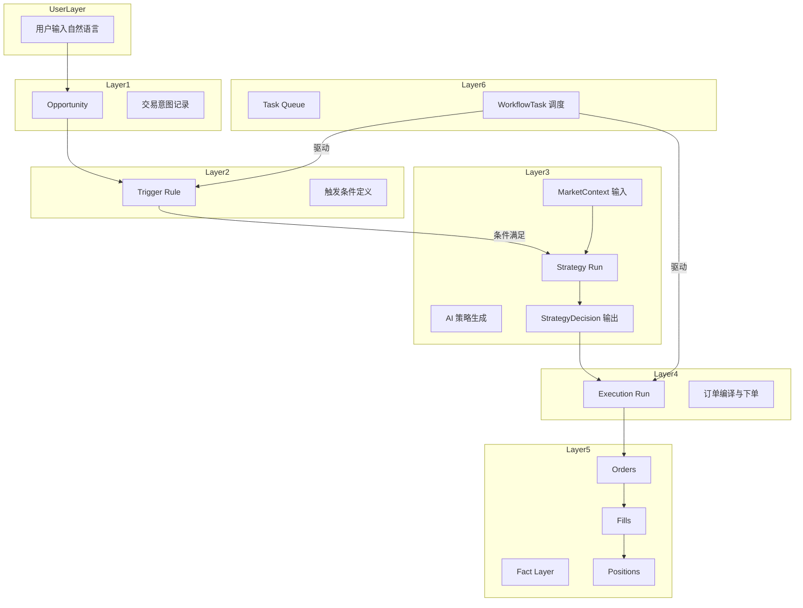

<!-- PAGE_ID: options_01_overview -->

📚 Relevant source files

The following files were used as context for generating this wiki page:

- [CLAUDE.md:1-104](https://github.com/ChunmiaoYu/options_ai_trader/blob/f5f3ac84e9c5d963fc1450f12306ea264183dfad/CLAUDE.md#L1-L104)
- [README.md:1-194](https://github.com/ChunmiaoYu/options_ai_trader/blob/f5f3ac84e9c5d963fc1450f12306ea264183dfad/README.md#L1-L194)
- [pyproject.toml:1-45](https://github.com/ChunmiaoYu/options_ai_trader/blob/f5f3ac84e9c5d963fc1450f12306ea264183dfad/pyproject.toml#L1-L45)
- [task_plan.md:1-183](https://github.com/ChunmiaoYu/options_ai_trader/blob/f5f3ac84e9c5d963fc1450f12306ea264183dfad/task_plan.md#L1-L183)

# 项目概述

> **Related Pages**: [[系统架构|02_architecture.md]]

---

<!-- BEGIN:AUTOGEN options_01_overview_introduction -->
## 项目简介

Options Event Trader 是一个基于 AI Agent 链的期权交易系统，核心目标是让用户用**自然语言（中文）**描述期权交易意图，由系统自动完成从解析到下单的全流程，并保证全程可审计 ([CLAUDE.md:9](https://github.com/ChunmiaoYu/options_ai_trader/blob/f5f3ac84e9c5d963fc1450f12306ea264183dfad/CLAUDE.md#L9))。

系统的端到端工作流程为：

1. **自然语言输入** -- 用户用中文描述交易意图（如"苹果财报前做一个看涨价差"）
2. **AI 解析（Agent1）** -- Intake 编译器将自然语言解析为结构化的交易意图（ParsedIntentLLMOutput，22 个字段）([task_plan.md:10](https://github.com/ChunmiaoYu/options_ai_trader/blob/f5f3ac84e9c5d963fc1450f12306ea264183dfad/task_plan.md#L10))
3. **AI 策略生成（Agent2）** -- 根据实时市场数据生成具体的期权策略方案 ([CLAUDE.md:93](https://github.com/ChunmiaoYu/options_ai_trader/blob/f5f3ac84e9c5d963fc1450f12306ea264183dfad/CLAUDE.md#L93))
4. **确定性编译** -- 将 AI 方案编译为可执行订单（选到期日、选行权价、算手数、风控检查）
5. **自动下单** -- 通过 IBKR TWS API 向交互式经纪商提交订单 ([CLAUDE.md:94](https://github.com/ChunmiaoYu/options_ai_trader/blob/f5f3ac84e9c5d963fc1450f12306ea264183dfad/CLAUDE.md#L94))

项目采用 **B-plus 方案变体**，保留 PostgreSQL 作为持久化层，不退回 SQLite ([CLAUDE.md:12](https://github.com/ChunmiaoYu/options_ai_trader/blob/f5f3ac84e9c5d963fc1450f12306ea264183dfad/CLAUDE.md#L12))。当前处于**本地研发优先**阶段，未来可平滑迁移到云端 ([README.md:8](https://github.com/ChunmiaoYu/options_ai_trader/blob/f5f3ac84e9c5d963fc1450f12306ea264183dfad/README.md#L8))。

### 设计原则

项目遵循以下核心设计原则 ([README.md:107-113](https://github.com/ChunmiaoYu/options_ai_trader/blob/f5f3ac84e9c5d963fc1450f12306ea264183dfad/README.md#L107-L113))：

- **真实栈作为主线路** -- 不使用 mock 作为默认运行方式，测试替身只存在于测试层
- **所有外部能力都走 adapter** -- 不把 API 细节写进 service
- **数据库存"结构化字段 + 原始 payload"** -- 兼顾查询效率和审计需求
- **parse 不等于 submit** -- 解析不创建 trigger/task，必须 DRAFT/SUBMIT 分离 ([CLAUDE.md:59](https://github.com/ChunmiaoYu/options_ai_trader/blob/f5f3ac84e9c5d963fc1450f12306ea264183dfad/CLAUDE.md#L59))
- **只保留两个 AI Agent** -- Agent1=Intake，Agent2=Strategy；Risk Gate 是确定性代码，不用 AI ([CLAUDE.md:67](https://github.com/ChunmiaoYu/options_ai_trader/blob/f5f3ac84e9c5d963fc1450f12306ea264183dfad/CLAUDE.md#L67))

Sources: [CLAUDE.md:7-12](https://github.com/ChunmiaoYu/options_ai_trader/blob/f5f3ac84e9c5d963fc1450f12306ea264183dfad/CLAUDE.md#L7-L12), [README.md:1-9](https://github.com/ChunmiaoYu/options_ai_trader/blob/f5f3ac84e9c5d963fc1450f12306ea264183dfad/README.md#L1-L9), [README.md:107-113](https://github.com/ChunmiaoYu/options_ai_trader/blob/f5f3ac84e9c5d963fc1450f12306ea264183dfad/README.md#L107-L113)
<!-- END:AUTOGEN options_01_overview_introduction -->

---

<!-- BEGIN:AUTOGEN options_01_overview_tech-stack -->
## 技术栈

项目的主技术栈由五大组件构成 ([CLAUDE.md:11](https://github.com/ChunmiaoYu/options_ai_trader/blob/f5f3ac84e9c5d963fc1450f12306ea264183dfad/CLAUDE.md#L11))：

| 类别 | 技术 | 用途 | 版本约束 |
|------|------|------|----------|
| Web 框架 | FastAPI | REST API 服务 | `>=0.115.0` ([pyproject.toml:12](https://github.com/ChunmiaoYu/options_ai_trader/blob/f5f3ac84e9c5d963fc1450f12306ea264183dfad/pyproject.toml#L12)) |
| ASGI 服务器 | Uvicorn | HTTP 服务器 | `>=0.30.0` ([pyproject.toml:13](https://github.com/ChunmiaoYu/options_ai_trader/blob/f5f3ac84e9c5d963fc1450f12306ea264183dfad/pyproject.toml#L13)) |
| ORM | SQLAlchemy | 数据库模型与查询 | `>=2.0.30` ([pyproject.toml:14](https://github.com/ChunmiaoYu/options_ai_trader/blob/f5f3ac84e9c5d963fc1450f12306ea264183dfad/pyproject.toml#L14)) |
| 数据库 | PostgreSQL (psycopg) | 持久化存储 | `>=3.2.0` ([pyproject.toml:15](https://github.com/ChunmiaoYu/options_ai_trader/blob/f5f3ac84e9c5d963fc1450f12306ea264183dfad/pyproject.toml#L15)) |
| 数据库迁移 | Alembic | Schema 版本管理 | `>=1.13.2` ([pyproject.toml:16](https://github.com/ChunmiaoYu/options_ai_trader/blob/f5f3ac84e9c5d963fc1450f12306ea264183dfad/pyproject.toml#L16)) |
| 数据校验 | Pydantic | Schema 定义与验证 | `>=2.7.0` ([pyproject.toml:17](https://github.com/ChunmiaoYu/options_ai_trader/blob/f5f3ac84e9c5d963fc1450f12306ea264183dfad/pyproject.toml#L17)) |
| AI/LLM | OpenAI | 结构化输出（Structured Outputs） | `>=1.40.0` ([pyproject.toml:19](https://github.com/ChunmiaoYu/options_ai_trader/blob/f5f3ac84e9c5d963fc1450f12306ea264183dfad/pyproject.toml#L19)) |
| Agent 编排 | LangGraph + LangChain Core | AI 工作流图 | `>=0.4.0` / `>=0.3.0` ([pyproject.toml:24-25](https://github.com/ChunmiaoYu/options_ai_trader/blob/f5f3ac84e9c5d963fc1450f12306ea264183dfad/pyproject.toml#L24-L25)) |
| 券商 API | IBKR TWS API | 期权交易与市场数据 | 外部依赖 ([README.md:27](https://github.com/ChunmiaoYu/options_ai_trader/blob/f5f3ac84e9c5d963fc1450f12306ea264183dfad/README.md#L27)) |
| 重试机制 | Tenacity | API 调用容错 | `>=8.4.0` ([pyproject.toml:23](https://github.com/ChunmiaoYu/options_ai_trader/blob/f5f3ac84e9c5d963fc1450f12306ea264183dfad/pyproject.toml#L23)) |
| HTTP 客户端 | httpx | 异步 HTTP 请求 | `>=0.27.0` ([pyproject.toml:21](https://github.com/ChunmiaoYu/options_ai_trader/blob/f5f3ac84e9c5d963fc1450f12306ea264183dfad/pyproject.toml#L21)) |
| JSON 序列化 | orjson | 高性能 JSON 处理 | `>=3.10.0` ([pyproject.toml:22](https://github.com/ChunmiaoYu/options_ai_trader/blob/f5f3ac84e9c5d963fc1450f12306ea264183dfad/pyproject.toml#L22)) |
| 配置文件 | PyYAML | YAML 配置解析 | `>=6.0.2` ([pyproject.toml:26](https://github.com/ChunmiaoYu/options_ai_trader/blob/f5f3ac84e9c5d963fc1450f12306ea264183dfad/pyproject.toml#L26)) |

### 运行时架构

系统由三个独立进程组成 ([README.md:31-32](https://github.com/ChunmiaoYu/options_ai_trader/blob/f5f3ac84e9c5d963fc1450f12306ea264183dfad/README.md#L31-L32))：

- **API Server** -- FastAPI 应用，处理用户请求和前端页面服务
- **Background Worker** -- 独立 worker 进程，负责到期机会轮询、持仓监控、止盈止损、保证金维护
- **PostgreSQL** -- 数据库服务

外部依赖包括 IB Gateway（券商连接）和 OpenAI API（AI 策略生成）。

### Python 版本

项目要求 Python `>=3.11` ([pyproject.toml:10](https://github.com/ChunmiaoYu/options_ai_trader/blob/f5f3ac84e9c5d963fc1450f12306ea264183dfad/pyproject.toml#L10))。

Sources: [pyproject.toml:1-27](https://github.com/ChunmiaoYu/options_ai_trader/blob/f5f3ac84e9c5d963fc1450f12306ea264183dfad/pyproject.toml#L1-L27), [README.md:26-33](https://github.com/ChunmiaoYu/options_ai_trader/blob/f5f3ac84e9c5d963fc1450f12306ea264183dfad/README.md#L26-L33)
<!-- END:AUTOGEN options_01_overview_tech-stack -->

---

<!-- BEGIN:AUTOGEN options_01_overview_system-layers -->
## 系统六层架构

系统采用六层分层设计，从用户意图到后台调度形成完整的业务链路 ([CLAUDE.md:18-25](https://github.com/ChunmiaoYu/options_ai_trader/blob/f5f3ac84e9c5d963fc1450f12306ea264183dfad/CLAUDE.md#L18-L25))：

| 层级 | 概念 | 说明 |
|------|------|------|
| 第 1 层 | **Opportunity（交易机会）** | 用户的一条交易意图，是整个系统的起点 |
| 第 2 层 | **Trigger Rule（触发规则）** | 触发策略生成的条件，定义何时启动 AI 分析 |
| 第 3 层 | **Strategy Run（策略运行）** | 一次 AI 策略生成过程，输入 MarketContext，输出 StrategyDecision |
| 第 4 层 | **Execution Run（执行运行）** | 一次下单执行过程，将策略转化为实际订单 |
| 第 5 层 | **Fact Layer（事实层）** | 不可变事实记录：Orders、Fills、Positions、Snapshots |
| 第 6 层 | **Task Queue（任务队列）** | WorkflowTask 表驱动的后台任务调度 |

### 分层流转图

### 层级之间的关系

- **第 1-2 层（意图层）**：用户通过自然语言创建 Opportunity，系统解析后生成 Trigger Rule。这两层由 Agent1（Intake 编译器）负责处理。
- **第 3 层（策略层）**：当 Trigger Rule 的条件满足时，Agent2 采集实时市场数据构建 MarketContext，调用 OpenAI 生成策略方案，再由确定性代码编译为可执行订单。
- **第 4 层（执行层）**：通过 IBKR TWS API 提交订单，支持单腿（OPT）和多腿（BAG 组合）两种下单模式。
- **第 5 层（事实层）**：记录所有不可变的交易事实，包括订单、成交、持仓和市场快照，用于审计和回溯。
- **第 6 层（调度层）**：WorkflowTask 表驱动的后台任务队列，负责触发策略生成和执行运行的编排。

Sources: [CLAUDE.md:16-26](https://github.com/ChunmiaoYu/options_ai_trader/blob/f5f3ac84e9c5d963fc1450f12306ea264183dfad/CLAUDE.md#L16-L26)
<!-- END:AUTOGEN options_01_overview_system-layers -->

---

<!-- BEGIN:AUTOGEN options_01_overview_progress -->
## 迭代进度

截至 2026-04-14，项目已完成 Phase 1 到 Phase 8 共 11 个主要迭代阶段，全量 171+ 测试通过 ([CLAUDE.md:33](https://github.com/ChunmiaoYu/options_ai_trader/blob/f5f3ac84e9c5d963fc1450f12306ea264183dfad/CLAUDE.md#L33))。

### 已完成阶段

| 阶段 | 名称 | 关键成果 | 测试数 |
|------|------|----------|--------|
| Phase 1 | Intake 编译器（Agent1） | OpenAI 结构化解析、7 节点 LangGraph 工作流、17 张表 DB 模型、Worker 骨架 ([task_plan.md:8-18](https://github.com/ChunmiaoYu/options_ai_trader/blob/f5f3ac84e9c5d963fc1450f12306ea264183dfad/task_plan.md#L8-L18)) | -- |
| Phase 2 | Intake Hardening | 歧义规则化、submit_blockers contract、时间表达检测、4 个真实 OpenAI E2E 验证 ([task_plan.md:20-33](https://github.com/ChunmiaoYu/options_ai_trader/blob/f5f3ac84e9c5d963fc1450f12306ea264183dfad/task_plan.md#L20-L33)) | 29 |
| Phase 3 | Sprint-0A 执行层验证 | IBKR 连接验证、市场数据采集、Paper 下单生命周期、streaming 模式修复 ([task_plan.md:35-48](https://github.com/ChunmiaoYu/options_ai_trader/blob/f5f3ac84e9c5d963fc1450f12306ea264183dfad/task_plan.md#L35-L48)) | 23 |
| Phase 4 | Sprint-0B 安全护栏 | dry_run/mock 开关、MockIBKRClient、BrokerOrderRepository、KillSwitch CLI ([task_plan.md:50-56](https://github.com/ChunmiaoYu/options_ai_trader/blob/f5f3ac84e9c5d963fc1450f12306ea264183dfad/task_plan.md#L50-L56)) | 71 |
| Phase 5 | DRAFT/SUBMIT API + 前端 | Opportunity 生命周期字段、DRAFT/SUBMIT 分离、专业金融风格前端、队列筛选排序 ([task_plan.md:58-73](https://github.com/ChunmiaoYu/options_ai_trader/blob/f5f3ac84e9c5d963fc1450f12306ea264183dfad/task_plan.md#L58-L73)) | -- |
| Phase 6 | Agent2 策略生成器 | 策略领域模型、策略编译器、风控门、OpenAI 策略 Agent、编排器 ([task_plan.md:75-114](https://github.com/ChunmiaoYu/options_ai_trader/blob/f5f3ac84e9c5d963fc1450f12306ea264183dfad/task_plan.md#L75-L114)) | 125 |
| Phase 7 | Market Data + Broker Adapter | 市场数据采集、逐腿下单、6 步流水线编排、Worker 集成 ([task_plan.md:116-127](https://github.com/ChunmiaoYu/options_ai_trader/blob/f5f3ac84e9c5d963fc1450f12306ea264183dfad/task_plan.md#L116-L127)) | 163 |
| Phase 7.5 | Pipeline DB 持久化 | StrategyRun JSONB 字段、Pipeline DB helpers、每步 DB 写入、状态联动 ([task_plan.md:129-137](https://github.com/ChunmiaoYu/options_ai_trader/blob/f5f3ac84e9c5d963fc1450f12306ea264183dfad/task_plan.md#L129-L137)) | 170 |
| Phase 7.6 | 盘中验证 + 前端 Strategy Tab | 单腿/多腿 paper 下单验证、BAG 组合订单、Strategy Tab + Timeline ([task_plan.md:139-162](https://github.com/ChunmiaoYu/options_ai_trader/blob/f5f3ac84e9c5d963fc1450f12306ea264183dfad/task_plan.md#L139-L162)) | 171 |
| Phase 8 | 前端 Execution Tab | 执行状态概览、订单明细、修改来源链接、执行时间线、历史运行记录 ([task_plan.md:164-171](https://github.com/ChunmiaoYu/options_ai_trader/blob/f5f3ac84e9c5d963fc1450f12306ea264183dfad/task_plan.md#L164-L171)) | 158 (pytest) |

### 待完成事项

以下功能尚未启动，列在 Phase 9 ([task_plan.md:173-183](https://github.com/ChunmiaoYu/options_ai_trader/blob/f5f3ac84e9c5d963fc1450f12306ea264183dfad/task_plan.md#L173-L183), [CLAUDE.md:37-43](https://github.com/ChunmiaoYu/options_ai_trader/blob/f5f3ac84e9c5d963fc1450f12306ea264183dfad/CLAUDE.md#L37-L43))：

| 功能 | 说明 |
|------|------|
| 止盈/止损执行联动 | IBKR 委托单自动联动 |
| 手动平仓同步 | Worker 轮询 IBKR 持仓变化 |
| Option chain 监控与重放 | 全量期权链落库 |
| 复杂部分成交重试/重新定价 | 部分成交场景处理 |
| 请求限流 | IBKR API 约 50 msg/s 限制 |
| iv_percentile_30d | 需本地 IV 历史缓存 |
| 外部数据源 | 财报日期、VIX、新闻（下一期项目） |
| 云端部署 | Azure VM + systemd |

### 已知问题

当前系统存在以下已知限制 ([CLAUDE.md:78-80](https://github.com/ChunmiaoYu/options_ai_trader/blob/f5f3ac84e9c5d963fc1450f12306ea264183dfad/CLAUDE.md#L78-L80))：

1. **LLM 输出不稳定** -- planner 层需持续兜底处理
2. **business_lexicon 覆盖不足** -- 仅 4 条词条
3. **时间理解局限** -- runtime_planner 对时间是字符串匹配，不做 NLU

Sources: [CLAUDE.md:29-43](https://github.com/ChunmiaoYu/options_ai_trader/blob/f5f3ac84e9c5d963fc1450f12306ea264183dfad/CLAUDE.md#L29-L43), [CLAUDE.md:76-80](https://github.com/ChunmiaoYu/options_ai_trader/blob/f5f3ac84e9c5d963fc1450f12306ea264183dfad/CLAUDE.md#L76-L80), [task_plan.md:1-183](https://github.com/ChunmiaoYu/options_ai_trader/blob/f5f3ac84e9c5d963fc1450f12306ea264183dfad/task_plan.md#L1-L183)
<!-- END:AUTOGEN options_01_overview_progress -->

---
