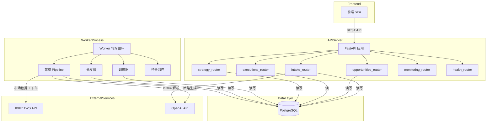
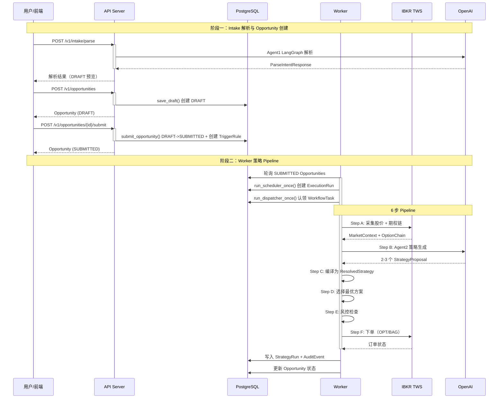

<!-- PAGE_ID: options_02_architecture -->
<details>
<summary>📚 Relevant source files</summary>

The following files were used as context for generating this wiki page:

- [app.py:1-57](https://github.com/ChunmiaoYu/options_ai_trader/blob/f5f3ac84e9c5d963fc1450f12306ea264183dfad/src/options_event_trader/api/app.py#L1-L57)
- [loop.py:1-66](https://github.com/ChunmiaoYu/options_ai_trader/blob/f5f3ac84e9c5d963fc1450f12306ea264183dfad/src/options_event_trader/worker/loop.py#L1-L66)
- [settings.py:1-60](https://github.com/ChunmiaoYu/options_ai_trader/blob/f5f3ac84e9c5d963fc1450f12306ea264183dfad/src/options_event_trader/settings.py#L1-L60)
- [broker_adapter.py:1-328](https://github.com/ChunmiaoYu/options_ai_trader/blob/f5f3ac84e9c5d963fc1450f12306ea264183dfad/src/options_event_trader/services/broker_adapter.py#L1-L328)
- [order_placer.py:1-341](https://github.com/ChunmiaoYu/options_ai_trader/blob/f5f3ac84e9c5d963fc1450f12306ea264183dfad/src/options_event_trader/services/order_placer.py#L1-L341)
- [market_data_collector.py:1-470](https://github.com/ChunmiaoYu/options_ai_trader/blob/f5f3ac84e9c5d963fc1450f12306ea264183dfad/src/options_event_trader/services/market_data_collector.py#L1-L470)
- [strategy_agent.py:1-55](https://github.com/ChunmiaoYu/options_ai_trader/blob/f5f3ac84e9c5d963fc1450f12306ea264183dfad/src/options_event_trader/agents/strategy_agent.py#L1-L55)
- [strategy_resolver.py:1-234](https://github.com/ChunmiaoYu/options_ai_trader/blob/f5f3ac84e9c5d963fc1450f12306ea264183dfad/src/options_event_trader/services/strategy_resolver.py#L1-L234)
- [risk_gate.py:1-48](https://github.com/ChunmiaoYu/options_ai_trader/blob/f5f3ac84e9c5d963fc1450f12306ea264183dfad/src/options_event_trader/services/risk_gate.py#L1-L48)
- [intake_service.py:1-97](https://github.com/ChunmiaoYu/options_ai_trader/blob/f5f3ac84e9c5d963fc1450f12306ea264183dfad/src/options_event_trader/services/intake_service.py#L1-L97)
- [opportunity_service.py:1-200](https://github.com/ChunmiaoYu/options_ai_trader/blob/f5f3ac84e9c5d963fc1450f12306ea264183dfad/src/options_event_trader/services/opportunity_service.py#L1-L200)
- [session.py:1-43](https://github.com/ChunmiaoYu/options_ai_trader/blob/f5f3ac84e9c5d963fc1450f12306ea264183dfad/src/options_event_trader/db/session.py#L1-L43)
- [jobs.py:1-128](https://github.com/ChunmiaoYu/options_ai_trader/blob/f5f3ac84e9c5d963fc1450f12306ea264183dfad/src/options_event_trader/worker/jobs.py#L1-L128)
- [scheduler_service.py:1-116](https://github.com/ChunmiaoYu/options_ai_trader/blob/f5f3ac84e9c5d963fc1450f12306ea264183dfad/src/options_event_trader/services/scheduler_service.py#L1-L116)
- [pipeline_db.py:1-79](https://github.com/ChunmiaoYu/options_ai_trader/blob/f5f3ac84e9c5d963fc1450f12306ea264183dfad/src/options_event_trader/services/pipeline_db.py#L1-L79)

</details>

# 系统架构

> **Related Pages**: [[项目概述|01_overview.md]], [[Agent1：Intake 解析器|03_intake.md]]

---

<!-- BEGIN:AUTOGEN options_02_architecture_overview -->
## 架构总览

Options Event Trader 采用**三进程 + 单数据库**的架构模式。API Server 负责接收前端请求和管理交易意图的生命周期；Worker 进程在后台轮询执行策略生成和下单；前端是一个纯静态的单页应用，由 API Server 通过 StaticFiles 中间件直接托管。三个组件通过 PostgreSQL 数据库进行间接通信——API Server 写入 Opportunity 和 TriggerRule 记录，Worker 轮询这些记录来驱动后续的策略 Pipeline。

### 三进程架构

| 进程 | 入口 | 职责 |
|------|------|------|
| **API Server** | `create_app()` 工厂函数 ([app.py:20-56](https://github.com/ChunmiaoYu/options_ai_trader/blob/f5f3ac84e9c5d963fc1450f12306ea264183dfad/src/options_event_trader/api/app.py#L20-L56)) | FastAPI 应用，注册 6 个 Router，托管前端静态文件 |
| **Worker** | `run_worker_forever()` ([loop.py:44-65](https://github.com/ChunmiaoYu/options_ai_trader/blob/f5f3ac84e9c5d963fc1450f12306ea264183dfad/src/options_event_trader/worker/loop.py#L44-L65)) | 无限循环：调度器 → 分发器 → 策略 Pipeline → 持仓监控 |
| **Frontend** | `frontend/index.html` | React 18 单页应用，通过 REST API 与后端交互 |

### API Server 路由注册

API Server 在 `create_app()` 中依次注册以下 6 个路由器 ([app.py:42-47](https://github.com/ChunmiaoYu/options_ai_trader/blob/f5f3ac84e9c5d963fc1450f12306ea264183dfad/src/options_event_trader/api/app.py#L42-L47)):

| 路由器 | 职责 |
|--------|------|
| `health_router` | 健康检查 |
| `intake_router` | Agent1 自然语言解析 |
| `opportunities_router` | 交易意图的 CRUD 和生命周期管理 |
| `executions_router` | 执行记录查询 |
| `strategy_router` | 策略生成与查询 |
| `monitoring_router` | 持仓监控配置 |

前端静态文件在路由器注册之后挂载到根路径 `/`，确保 API 路由优先级高于前端文件 ([app.py:49-51](https://github.com/ChunmiaoYu/options_ai_trader/blob/f5f3ac84e9c5d963fc1450f12306ea264183dfad/src/options_event_trader/api/app.py#L49-L51))。

### Worker 轮询循环

Worker 进程启动时首先连接 IBKR 客户端（真实或 Mock），然后进入一个 `while True` 循环，每轮按固定顺序执行四个步骤 ([loop.py:52-62](https://github.com/ChunmiaoYu/options_ai_trader/blob/f5f3ac84e9c5d963fc1450f12306ea264183dfad/src/options_event_trader/worker/loop.py#L52-L62)):

1. **调度器**（`run_scheduler_once`）：扫描到期的 TriggerRule，创建 ExecutionRun 和 WorkflowTask
2. **分发器**（`run_dispatcher_once`）：认领 PENDING 状态的 WorkflowTask 并标记为 DONE
3. **策略 Pipeline**（`run_strategy_pipeline`）：对 SUBMITTED 状态且无活跃 StrategyRun 的 Opportunity 执行 6 步流水线
4. **持仓监控**（`monitor_open_positions_once`）：评估止盈/止损/保证金规则

轮询间隔由 `settings.worker_poll_seconds` 控制，默认 15 秒 ([settings.py:38](https://github.com/ChunmiaoYu/options_ai_trader/blob/f5f3ac84e9c5d963fc1450f12306ea264183dfad/src/options_event_trader/settings.py#L38))。IBKR 断连时自动重试最多 3 次，重试间隔 5 秒 ([loop.py:18-19](https://github.com/ChunmiaoYu/options_ai_trader/blob/f5f3ac84e9c5d963fc1450f12306ea264183dfad/src/options_event_trader/worker/loop.py#L18-L19))。



Sources: [app.py:20-56](https://github.com/ChunmiaoYu/options_ai_trader/blob/f5f3ac84e9c5d963fc1450f12306ea264183dfad/src/options_event_trader/api/app.py#L20-L56), [loop.py:44-65](https://github.com/ChunmiaoYu/options_ai_trader/blob/f5f3ac84e9c5d963fc1450f12306ea264183dfad/src/options_event_trader/worker/loop.py#L44-L65), [settings.py:9-41](https://github.com/ChunmiaoYu/options_ai_trader/blob/f5f3ac84e9c5d963fc1450f12306ea264183dfad/src/options_event_trader/settings.py#L9-L41)
<!-- END:AUTOGEN options_02_architecture_overview -->

---

<!-- BEGIN:AUTOGEN options_02_architecture_data-flow -->
## 端到端数据流

系统的完整数据流覆盖从用户输入到订单执行的全生命周期。分为两个主要阶段：**Intake 阶段**（同步，在 API Server 内完成）和 **Strategy Pipeline 阶段**（异步，由 Worker 驱动）。

### 阶段一：Intake 解析与 Opportunity 创建

用户在前端输入自然语言交易意图后，请求经过以下路径：

1. **前端** POST 到 `/v1/intake/parse`，由 `IntakeService` 调用 Agent1（LangGraph 7 节点工作流）解析 ([intake_service.py:21-44](https://github.com/ChunmiaoYu/options_ai_trader/blob/f5f3ac84e9c5d963fc1450f12306ea264183dfad/src/options_event_trader/services/intake_service.py#L21-L44))
2. **前端** 展示解析结果，用户确认后 POST 到 `/v1/opportunities`，调用 `save_draft()` 创建 DRAFT 状态的 Opportunity ([opportunity_service.py:72-94](https://github.com/ChunmiaoYu/options_ai_trader/blob/f5f3ac84e9c5d963fc1450f12306ea264183dfad/src/options_event_trader/services/opportunity_service.py#L72-L94))
3. **前端** POST 到 `/v1/opportunities/{id}/submit`，调用 `submit_opportunity()` 将 DRAFT 转为 SUBMITTED，同时创建 TriggerRule ([opportunity_service.py:97-149](https://github.com/ChunmiaoYu/options_ai_trader/blob/f5f3ac84e9c5d963fc1450f12306ea264183dfad/src/options_event_trader/services/opportunity_service.py#L97-L149))

### 阶段二：策略 Pipeline（6 步流水线）

Worker 轮询发现 SUBMITTED 的 Opportunity 后，执行 `execute_opportunity_pipeline()` 的 6 个步骤 ([broker_adapter.py:69-308](https://github.com/ChunmiaoYu/options_ai_trader/blob/f5f3ac84e9c5d963fc1450f12306ea264183dfad/src/options_event_trader/services/broker_adapter.py#L69-L308)):

| 步骤 | 名称 | 实现模块 | 说明 |
|------|------|----------|------|
| A | 采集市场数据 | `market_data_collector` | 通过 IBKR 获取股价、历史K线、期权链、Greeks |
| B | AI 策略生成 | `strategy_agent` | 调用 OpenAI 生成 2-3 个排序策略方案 |
| C | 策略编译 | `strategy_resolver` | 将 AI 定性方案编译为可执行订单（选到期日、选行权价、计算数量） |
| D | 自动选择 | `broker_adapter.auto_select_strategy()` | 按 rank 排序，选择第一个非 LOW 置信度的方案 |
| E | 风控检查 | `risk_gate` | 确定性规则检查：最大亏损、仓位占比、禁止策略、腿数限制 |
| F | 下单执行 | `order_placer` | 单腿 OPT 订单或多腿 BAG 组合订单 |

每个步骤都有独立的异常捕获，失败时返回对应的 `PipelineResult` 状态码（如 `COLLECT_FAILED`、`AI_FAILED`、`RISK_BLOCKED` 等），并写入 AuditEvent 用于时间线追踪 ([broker_adapter.py:46](https://github.com/ChunmiaoYu/options_ai_trader/blob/f5f3ac84e9c5d963fc1450f12306ea264183dfad/src/options_event_trader/services/broker_adapter.py#L46))。



### Pipeline 状态机

策略 Pipeline 的 `PipelineResult.status` 决定 Opportunity 的最终生命周期状态 ([jobs.py:66-73](https://github.com/ChunmiaoYu/options_ai_trader/blob/f5f3ac84e9c5d963fc1450f12306ea264183dfad/src/options_event_trader/worker/jobs.py#L66-L73)):

| Pipeline 结果 | Opportunity 生命周期 | 说明 |
|---------------|---------------------|------|
| `COMPLETED` / `FILLED` | `COMPLETED` | 订单已成交 |
| `ORDER_SUBMITTED` | 保持 `SUBMITTED` | 限价单已提交，等待成交 |
| `NO_VIABLE_STRATEGY` / `RISK_BLOCKED` | `NO_TRADE` | 无可用策略或风控拦截 |
| `ORDER_FAILED` | `FAILED` | 下单失败 |
| `COLLECT_FAILED` / `AI_FAILED` / `DRY_RUN_COMPLETE` | 保持 `SUBMITTED` | 可重试 |

Sources: [broker_adapter.py:69-308](https://github.com/ChunmiaoYu/options_ai_trader/blob/f5f3ac84e9c5d963fc1450f12306ea264183dfad/src/options_event_trader/services/broker_adapter.py#L69-L308), [jobs.py:60-127](https://github.com/ChunmiaoYu/options_ai_trader/blob/f5f3ac84e9c5d963fc1450f12306ea264183dfad/src/options_event_trader/worker/jobs.py#L60-L127), [intake_service.py:21-44](https://github.com/ChunmiaoYu/options_ai_trader/blob/f5f3ac84e9c5d963fc1450f12306ea264183dfad/src/options_event_trader/services/intake_service.py#L21-L44), [opportunity_service.py:72-149](https://github.com/ChunmiaoYu/options_ai_trader/blob/f5f3ac84e9c5d963fc1450f12306ea264183dfad/src/options_event_trader/services/opportunity_service.py#L72-L149)
<!-- END:AUTOGEN options_02_architecture_data-flow -->

---

<!-- BEGIN:AUTOGEN options_02_architecture_module-deps -->
## 模块依赖关系

系统代码按功能分为以下几层：**API 层**（路由和请求处理）、**服务层**（业务逻辑编排）、**Agent 层**（AI 调用）、**集成层**（外部系统对接）、**领域层**（数据模型）和**持久化层**（数据库访问）。

### 服务层核心模块

服务层是系统的业务逻辑枢纽，各模块职责如下：

| 模块 | 职责 | 核心函数 |
|------|------|----------|
| `intake_service` | 封装 Agent1 LangGraph 工作流 ([intake_service.py:16-19](https://github.com/ChunmiaoYu/options_ai_trader/blob/f5f3ac84e9c5d963fc1450f12306ea264183dfad/src/options_event_trader/services/intake_service.py#L16-L19)) | `parse_request()` |
| `opportunity_service` | Opportunity 的 DRAFT/SUBMIT 生命周期 ([opportunity_service.py:72-149](https://github.com/ChunmiaoYu/options_ai_trader/blob/f5f3ac84e9c5d963fc1450f12306ea264183dfad/src/options_event_trader/services/opportunity_service.py#L72-L149)) | `save_draft()`, `submit_opportunity()` |
| `scheduler_service` | 扫描到期 TriggerRule，创建 ExecutionRun + WorkflowTask ([scheduler_service.py:22-91](https://github.com/ChunmiaoYu/options_ai_trader/blob/f5f3ac84e9c5d963fc1450f12306ea264183dfad/src/options_event_trader/services/scheduler_service.py#L22-L91)) | `enqueue_due_entry_windows()` |
| `broker_adapter` | 6 步策略 Pipeline 的顶层编排器 ([broker_adapter.py:1-12](https://github.com/ChunmiaoYu/options_ai_trader/blob/f5f3ac84e9c5d963fc1450f12306ea264183dfad/src/options_event_trader/services/broker_adapter.py#L1-L12)) | `execute_opportunity_pipeline()` |
| `market_data_collector` | IBKR 市场数据采集与 MarketContext 组装 ([market_data_collector.py:1-6](https://github.com/ChunmiaoYu/options_ai_trader/blob/f5f3ac84e9c5d963fc1450f12306ea264183dfad/src/options_event_trader/services/market_data_collector.py#L1-L6)) | `collect_market_context()` |
| `strategy_resolver` | 将 AI 定性方案编译为可执行订单（纯确定性代码） ([strategy_resolver.py:1-5](https://github.com/ChunmiaoYu/options_ai_trader/blob/f5f3ac84e9c5d963fc1450f12306ea264183dfad/src/options_event_trader/services/strategy_resolver.py#L1-L5)) | `resolve_proposal()` |
| `risk_gate` | 确定性风控规则检查 ([risk_gate.py:1-4](https://github.com/ChunmiaoYu/options_ai_trader/blob/f5f3ac84e9c5d963fc1450f12306ea264183dfad/src/options_event_trader/services/risk_gate.py#L1-L4)) | `check_risk_gate()` |
| `order_placer` | 单腿/多腿订单执行 ([order_placer.py:1-9](https://github.com/ChunmiaoYu/options_ai_trader/blob/f5f3ac84e9c5d963fc1450f12306ea264183dfad/src/options_event_trader/services/order_placer.py#L1-L9)) | `place_strategy_orders()` |
| `pipeline_db` | Pipeline 过程中的 StrategyRun + AuditEvent 持久化 ([pipeline_db.py:1-6](https://github.com/ChunmiaoYu/options_ai_trader/blob/f5f3ac84e9c5d963fc1450f12306ea264183dfad/src/options_event_trader/services/pipeline_db.py#L1-L6)) | `create_strategy_run()`, `write_pipeline_event()` |
| `monitoring_service` | 持仓监控配置管理 ([monitoring_service.py:1-22](https://github.com/ChunmiaoYu/options_ai_trader/blob/f5f3ac84e9c5d963fc1450f12306ea264183dfad/src/options_event_trader/services/monitoring_service.py#L1-L22)) | `get_monitor_config()` |

### Agent 层

系统只保留两个 AI Agent，各自职责清晰：

| Agent | 模块 | 调用时机 | 输入/输出 |
|-------|------|----------|-----------|
| **Agent1（Intake）** | `intake_graph.py` + `openai_intake_client.py` | 用户提交自然语言时，API Server 同步调用 | 自然语言 -> `ParseIntentResponse` |
| **Agent2（Strategy）** | `strategy_agent.py` ([strategy_agent.py:20-55](https://github.com/ChunmiaoYu/options_ai_trader/blob/f5f3ac84e9c5d963fc1450f12306ea264183dfad/src/options_event_trader/agents/strategy_agent.py#L20-L55)) | Worker Pipeline Step B | `MarketContext` -> `StrategyProposalResponse` |

两个 Agent 都使用 OpenAI Structured Outputs，保证返回结果严格符合 Pydantic schema ([strategy_agent.py:43-48](https://github.com/ChunmiaoYu/options_ai_trader/blob/f5f3ac84e9c5d963fc1450f12306ea264183dfad/src/options_event_trader/agents/strategy_agent.py#L43-L48))。Risk Gate 是纯确定性代码，不是 AI Agent ([risk_gate.py:1-4](https://github.com/ChunmiaoYu/options_ai_trader/blob/f5f3ac84e9c5d963fc1450f12306ea264183dfad/src/options_event_trader/services/risk_gate.py#L1-L4))。

### 模块调用关系图

```mermaid
classDiagram
    class BrokerAdapter {
        +execute_opportunity_pipeline()
        +auto_select_strategy()
    }

    class MarketDataCollector {
        +collect_market_context()
        +extract_stock_price_from_ticks()
        +extract_option_data_from_ticks()
    }

    class StrategyAgent {
        -settings: Settings
        +generate(context) StrategyProposalResponse
    }

    class StrategyResolver {
        +resolve_proposal()
        +select_expiry()
        +select_strike_by_delta()
        +calculate_quantity()
        +calculate_risk_metrics()
    }

    class RiskGate {
        +check_risk_gate() RiskGateResult
    }

    class OrderPlacer {
        +place_strategy_orders()
    }

    class IntakeService {
        -parser: OpenAIIntentParserAdapter
        -graph: StateGraph
        +parse_request()
    }

    class OpportunityService {
        +save_draft()
        +submit_opportunity()
        +list_queue()
    }

    class SchedulerService {
        +enqueue_due_entry_windows()
        +dispatch_one_workflow_task()
    }

    class PipelineDB {
        +create_strategy_run()
        +update_strategy_run_status()
        +write_pipeline_event()
    }

    class WorkerJobs {
        +run_scheduler_once()
        +run_dispatcher_once()
        +run_strategy_pipeline()
        +monitor_open_positions_once()
    }

    class IBKRClient {
        +connect_and_start()
        +request_market_data_snapshot()
        +request_historical_data()
        +request_option_secdef()
        +placeOrder()
    }

    class Settings {
        +ibkr_dry_run: bool
        +ibkr_mock: bool
        +openai_model: str
        +worker_poll_seconds: int
    }

    BrokerAdapter --> MarketDataCollector : Step A
    BrokerAdapter --> StrategyAgent : Step B
    BrokerAdapter --> StrategyResolver : Step C
    BrokerAdapter --> RiskGate : Step E
    BrokerAdapter --> OrderPlacer : Step F
    BrokerAdapter --> PipelineDB : 持久化

    WorkerJobs --> SchedulerService : 调度
    WorkerJobs --> BrokerAdapter : 策略 Pipeline

    MarketDataCollector --> IBKRClient : 市场数据
    OrderPlacer --> IBKRClient : 下单

    IntakeService --> StrategyAgent : ;
    OpportunityService --> SchedulerService : ;

    BrokerAdapter --> Settings : 配置
    StrategyAgent --> Settings : 配置
    OrderPlacer --> Settings : 配置
```

### 配置管理

`Settings` 类基于 `pydantic-settings`，从 `.env` 文件和环境变量中加载配置，使用 `@lru_cache` 确保全局单例 ([settings.py:9-59](https://github.com/ChunmiaoYu/options_ai_trader/blob/f5f3ac84e9c5d963fc1450f12306ea264183dfad/src/options_event_trader/settings.py#L9-L59))。关键配置分为以下几组：

| 配置组 | 关键字段 | 默认值 |
|--------|----------|--------|
| **应用** | `app_env`, `api_port`, `log_level` | `dev`, `8080`, `INFO` ([settings.py:13-16](https://github.com/ChunmiaoYu/options_ai_trader/blob/f5f3ac84e9c5d963fc1450f12306ea264183dfad/src/options_event_trader/settings.py#L13-L16)) |
| **数据库** | `postgres_host`, `postgres_port`, `postgres_db` | `localhost`, `5432`, `options_event_trader` ([settings.py:18-23](https://github.com/ChunmiaoYu/options_ai_trader/blob/f5f3ac84e9c5d963fc1450f12306ea264183dfad/src/options_event_trader/settings.py#L18-L23)) |
| **OpenAI** | `openai_api_key`, `openai_model` | `None`, `gpt-5` ([settings.py:25-26](https://github.com/ChunmiaoYu/options_ai_trader/blob/f5f3ac84e9c5d963fc1450f12306ea264183dfad/src/options_event_trader/settings.py#L25-L26)) |
| **IBKR** | `ibkr_port`, `ibkr_dry_run`, `ibkr_mock` | `7497`, `False`, `False` ([settings.py:28-36](https://github.com/ChunmiaoYu/options_ai_trader/blob/f5f3ac84e9c5d963fc1450f12306ea264183dfad/src/options_event_trader/settings.py#L28-L36)) |
| **Worker** | `worker_poll_seconds`, `monitor_poll_seconds` | `15`, `10` ([settings.py:38-39](https://github.com/ChunmiaoYu/options_ai_trader/blob/f5f3ac84e9c5d963fc1450f12306ea264183dfad/src/options_event_trader/settings.py#L38-L39)) |

数据库连接 URL 通过 `resolved_database_url` 计算属性自动组装，优先使用 `database_url` 环境变量，否则从各 `postgres_*` 字段拼接 ([settings.py:42-50](https://github.com/ChunmiaoYu/options_ai_trader/blob/f5f3ac84e9c5d963fc1450f12306ea264183dfad/src/options_event_trader/settings.py#L42-L50))。

### 数据库会话管理

数据库会话通过两种模式提供 ([session.py:20-42](https://github.com/ChunmiaoYu/options_ai_trader/blob/f5f3ac84e9c5d963fc1450f12306ea264183dfad/src/options_event_trader/db/session.py#L20-L42)):

- **`session_scope()`** — Worker 使用的上下文管理器，自动 commit/rollback/close
- **`get_db()`** — API Server 使用的 FastAPI 依赖注入生成器

两者都配置了 `autoflush=False`、`autocommit=False`、`expire_on_commit=False`，确保 ORM 对象在 session 关闭后仍可访问 ([session.py:17](https://github.com/ChunmiaoYu/options_ai_trader/blob/f5f3ac84e9c5d963fc1450f12306ea264183dfad/src/options_event_trader/db/session.py#L17))。

### 设计要点

1. **API Server 与 Worker 通过数据库解耦**：API Server 写入 Opportunity 和 TriggerRule 后即返回，Worker 独立轮询执行，两个进程没有直接通信
2. **Pipeline 步骤隔离**：6 步中每步都有独立的 try/catch，任何一步失败不影响其他 Opportunity 的处理
3. **AI 与确定性代码分离**：Agent2 只负责生成定性方案，编译（Step C）和风控（Step E）是纯确定性代码
4. **三种执行模式**：通过 `ibkr_mock` 和 `ibkr_dry_run` 配置，支持 Mock 测试、Dry-run 验证和真实下单 ([settings.py:35-36](https://github.com/ChunmiaoYu/options_ai_trader/blob/f5f3ac84e9c5d963fc1450f12306ea264183dfad/src/options_event_trader/settings.py#L35-L36))

Sources: [broker_adapter.py:1-40](https://github.com/ChunmiaoYu/options_ai_trader/blob/f5f3ac84e9c5d963fc1450f12306ea264183dfad/src/options_event_trader/services/broker_adapter.py#L1-L40), [strategy_agent.py:20-55](https://github.com/ChunmiaoYu/options_ai_trader/blob/f5f3ac84e9c5d963fc1450f12306ea264183dfad/src/options_event_trader/agents/strategy_agent.py#L20-L55), [risk_gate.py:1-48](https://github.com/ChunmiaoYu/options_ai_trader/blob/f5f3ac84e9c5d963fc1450f12306ea264183dfad/src/options_event_trader/services/risk_gate.py#L1-L48), [settings.py:1-60](https://github.com/ChunmiaoYu/options_ai_trader/blob/f5f3ac84e9c5d963fc1450f12306ea264183dfad/src/options_event_trader/settings.py#L1-L60), [session.py:1-43](https://github.com/ChunmiaoYu/options_ai_trader/blob/f5f3ac84e9c5d963fc1450f12306ea264183dfad/src/options_event_trader/db/session.py#L1-L43)
<!-- END:AUTOGEN options_02_architecture_module-deps -->

---
