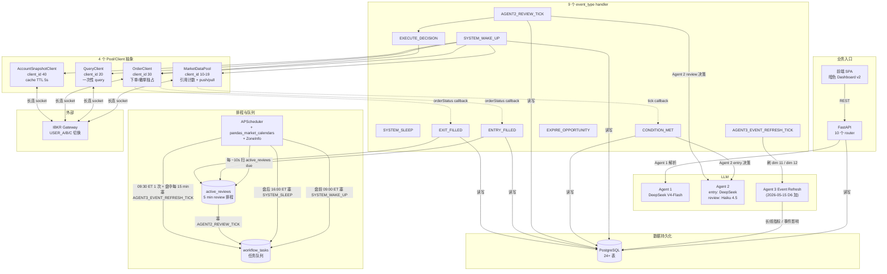
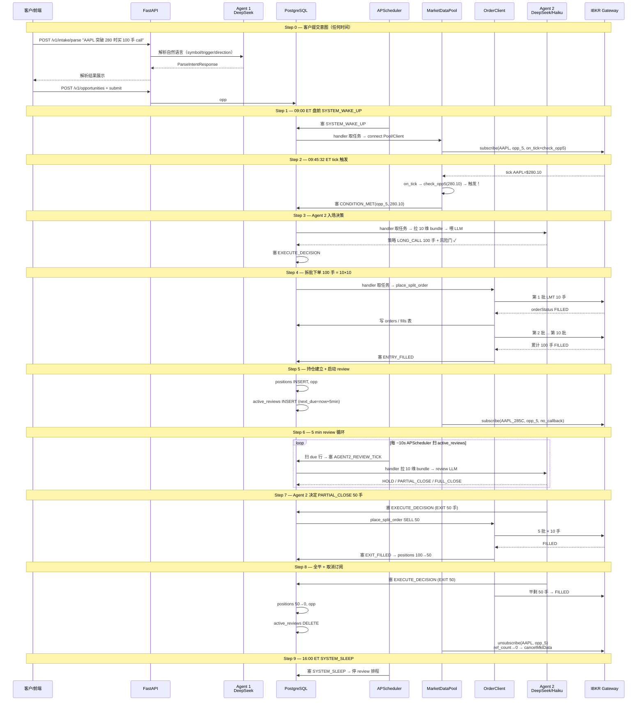

<!-- PAGE_ID: options_02_architecture -->
<details>
<summary>📚 Relevant source files</summary>

The following files were used as context for generating this wiki page:

- [app.py:1-82](https://github.com/ChunmiaoYu/options_ai_trader/blob/6b3d159/src/options_event_trader/api/app.py#L1-L82)
- [loop.py:1-364](https://github.com/ChunmiaoYu/options_ai_trader/blob/6b3d159/src/options_event_trader/worker/loop.py#L1-L364)
- [models.py:1-623](https://github.com/ChunmiaoYu/options_ai_trader/blob/6b3d159/src/options_event_trader/db/models.py#L1-L623)
- [strategy_agent.py:1-129](https://github.com/ChunmiaoYu/options_ai_trader/blob/6b3d159/src/options_event_trader/agents/strategy_agent.py#L1-L129)
- [20260507_0024_add_active_reviews.py](https://github.com/ChunmiaoYu/options_ai_trader/blob/6b3d159/alembic/versions/20260507_0024_add_active_reviews.py)
- [20260507_0025_add_market_data_subscriptions.py](https://github.com/ChunmiaoYu/options_ai_trader/blob/6b3d159/alembic/versions/20260507_0025_add_market_data_subscriptions.py)
- [20260507_0026_add_pool_health_log.py](https://github.com/ChunmiaoYu/options_ai_trader/blob/6b3d159/alembic/versions/20260507_0026_add_pool_health_log.py)
- [20260507_0027_add_event_calendar.py](https://github.com/ChunmiaoYu/options_ai_trader/blob/6b3d159/alembic/versions/20260507_0027_add_event_calendar.py)
- [20260507_0028_add_strategy_whitelist_seed.py](https://github.com/ChunmiaoYu/options_ai_trader/blob/6b3d159/alembic/versions/20260507_0028_add_strategy_whitelist_seed.py)
- [20260507_0029_brokerorder_algo_split_batch_and_workflow_check.py](https://github.com/ChunmiaoYu/options_ai_trader/blob/6b3d159/alembic/versions/20260507_0029_brokerorder_algo_split_batch_and_workflow_check.py)
- [specs/architecture-walkthrough.md](specs/architecture-walkthrough.md)

</details>

# 系统架构

> **Related Pages**: [[项目概述|01_overview.md]], [[Agent1：Intake 解析器|03_intake.md]], [[数据库与持久化|06_database.md]]
>
> **配套深度阅读**: [⭐ 架构通俗讲解 — AAPL 突破 280 完整场景](specs/architecture-walkthrough.md) — 不懂软件架构的客户/业务方/不熟代码的工程师，从一个真实场景跑通整个系统。

---

<!-- BEGIN:AUTOGEN options_02_architecture_overview -->
## 架构总览

Options Event Trader **不是** "三进程 actor" 系统。直觉上你可能以为系统里跑着「时间工人 / 条件工人 / 信息工人」三个独立的进程在并行做事——**不是**。

系统真实只有 **4 大组成部分**（2026-05-15 round 4 sync：handler 从 8 → 9）：

| # | 组成部分 | 实际身份 |
|---|---|---|
| 1 | **APScheduler**（排程器） | 时间排程，**唯一**会主动产生任务的代码路径 |
| 2 | **9 个 event_type handler 函数** | 取任务 → 处理 → 可能塞新任务进队列（2026-05-15 D6 加 `agent3_event_refresh_handler`） |
| 3 | **4 个 Pool/Client 抽象** | 屏蔽 IBKR API 细节；业务代码**禁止**直接调 IBKR |
| 4 | **任务队列**（`workflow_tasks` 表） | 持久化挂单板，串起 1/2/3，崩溃恢复用 |

"时间工人 / 条件工人 / 信息工人" 这些词指的是 **handler 函数的逻辑分组**，不是独立进程。

### 3 Agent 体系（2026-05-15 D6 round 4 sync）

LLM 层从 2 Agent 升级到 **3 Agent**：

| Agent | 职责 | 模型 |
|---|---|---|
| **Agent 1 — Intake** | 自然语言 → 声明式 JSON（symbol / trigger / direction） | DeepSeek V4-Flash |
| **Agent 2 — Strategy** | 首次入场决策 + 入场后持续 review（HOLD / PARTIAL_CLOSE / FULL_CLOSE / ADJUST_STOP） | entry: DeepSeek V4-Flash；review: Claude Haiku 4.5 |
| **Agent 3 — Event Refresh**（新） | 长线指标 / 事件影响（dim 11 / dim 12）的离线刷新，供 Agent 2 review 鲜度 5 min 内拉取 | 待 spec ship 时锁定 |

**Agent 3 刷新触发**：开盘瞬间 09:30 ET 1 次 + 盘中每 15 min + 入场前阻塞刷（鲜度 5 min）+ 收盘后停。



API Server 由 [`create_app()`](https://github.com/ChunmiaoYu/options_ai_trader/blob/6b3d159/src/options_event_trader/api/app.py#L41-L78) 工厂函数创建，注册 10 个 router（`health` / `intake` / `opportunities` / `executions` / `strategy` / `monitoring` / `account` / `dashboard` / `workers` / `system`），并通过 [`NoCacheStaticFiles`](https://github.com/ChunmiaoYu/options_ai_trader/blob/6b3d159/src/options_event_trader/api/app.py#L12-L25) 在根路径挂载前端静态资源（含 `Cache-Control: no-cache` 头，避免 babel-standalone 浏览器缓存导致 deploy 后看老 UI）。

Worker 进程由 [`run_worker_forever()`](https://github.com/ChunmiaoYu/options_ai_trader/blob/6b3d159/src/options_event_trader/worker/loop.py#L132-L234) 驱动；当前实施 (2026-05-08) 仍是 **单进程 `while True` 主循环**，每 `worker_poll_seconds`（默认 15s）跑一轮：drain_exit_queue → time_stops → scheduler → dispatcher → strategy_pipeline → reconcile → Agent 2 review。**这是过渡形态**——Phase B alembic 0024-0029 已 ship 7 张表（`active_reviews` / `market_data_subscriptions` / `pool_health_log` / `event_calendar` / `strategy_whitelist_seed` 等），为 P0 主线 `F-2026-05-07-WORKER-HANDLER-IMPLEMENTATION` 真实施 8 个 event_type handler 提供 schema 支撑。

Sources: [app.py:1-82](https://github.com/ChunmiaoYu/options_ai_trader/blob/6b3d159/src/options_event_trader/api/app.py#L1-L82), [loop.py:132-234](https://github.com/ChunmiaoYu/options_ai_trader/blob/6b3d159/src/options_event_trader/worker/loop.py#L132-L234), [architecture-walkthrough.md §2](specs/architecture-walkthrough.md)
<!-- END:AUTOGEN options_02_architecture_overview -->

---

<!-- BEGIN:AUTOGEN options_02_architecture_pool_client -->
## 4 个 Pool/Client 抽象

业务代码**永远不直接调** IBKR API。所有 IBKR 操作必走以下 4 个抽象之一，每个抽象一个长连 TCP socket，不同 `client_id` 段位避免冲突：

| Pool/Client | client_id | 职责 | 模式 |
|---|---|---|---|
| **MarketDataPool** | 10-19 | 持续订阅市场数据（实时 tick / 期权报价 / IV）；引用计数去重；持仓阶段保留订阅 | Push（IBKR 推 tick → on_tick callback） + Pull（`get_latest()` 拉 cache） |
| **QueryClient** | 20 | 一次性 query（历史 K 线 / 期权链 / contract details） | Pull（问一次答一次） |
| **OrderClient** | 30 | 下单 / 撤单 / 修改；独占防订单状态混乱 | Push（IBKR 推 orderStatus / openOrder / execDetails） + Pull（业务调 placeOrder） |
| **AccountSnapshotClient** | 40 | 账户余额 / 持仓 / 订单状态；cache TTL 5 秒 | Pull（按需拉，cache 去重） |

`client_id` 段位 90+ 留临时 ad-hoc 脚本（probe / 一次性数据采集）使用，不进生产路径。

### 为什么必须是长连接

不是因为"持续推流"——**IBKR API 协议本身要求长连**。EWrapper/EClient 是异步双向消息模型：

- 调 `OrderClient.placeOrder(...)` 只是把请求**写到 socket**（异步，无返回）
- IBKR 处理后通过**同一个 socket 反向推**响应回来（`orderStatus` / `openOrder` / `execDetails`）
- 客户端 EWrapper 监听 socket → 收响应 → 调对应 callback

**短连每次都要重做 ibapi handshake**（auth + version negotiation, ~1-2 秒）；短连关闭瞬间如果有响应在路上直接丢；订单状态/账户变化/错误码推送全部收不到。所以 4 个 Pool/Client = **4 个独立长连 socket**，互不阻塞（OrderClient 等下单响应不影响 MarketDataPool 收 tick）。

### 引用计数去重（MarketDataPool 关键设计）

多个机会单可能监控同一标的（例如 5 个 opp 都监控 AAPL）。`MarketDataPool.subscribe(symbol, subscriber_id)` 用 ref_count 去重：

```
opp #5 调 subscribe(AAPL, opp_5)  → ref_count[AAPL] = 1, IBKR reqMktData(AAPL)
opp #6 调 subscribe(AAPL, opp_6)  → ref_count[AAPL] = 2, IBKR 不重复请求
opp #5 平仓调 unsubscribe(AAPL, opp_5)  → ref_count[AAPL] = 1, IBKR 仍订阅
opp #6 平仓调 unsubscribe(AAPL, opp_6)  → ref_count[AAPL] = 0, IBKR cancelMktData(AAPL)
```

ref_count 状态持久化到 [`market_data_subscriptions`](https://github.com/ChunmiaoYu/options_ai_trader/blob/6b3d159/alembic/versions/20260507_0025_add_market_data_subscriptions.py) 表（alembic 0025），重启后从表恢复。

### Pool 健康状态对业务层屏蔽

Pool 内部状态机：`CONNECTED → DISCONNECTED → 自动 retry（指数退避 30s/1min/2min/5min）→ 重连成功 → 遍历 ref_count > 0 的 symbol 全部 resubscribe → CONNECTED`。

业务层只看到两个状态：`Pool ready` / `Pool degraded`。`pool_health_log` 表（alembic 0026）记录所有状态变化历史，前端 banner 显示"心跳挂"时读这张表。

Sources: [architecture-walkthrough.md §3, §6, §7](specs/architecture-walkthrough.md), [alembic 0025-0026](https://github.com/ChunmiaoYu/options_ai_trader/blob/6b3d159/alembic/versions/), [project_vision_and_north_star §1](https://chunmiaoyu.github.io/Projects-Wiki/options-trader/specs/north-star-v1-target/)
<!-- END:AUTOGEN options_02_architecture_pool_client -->

---

<!-- BEGIN:AUTOGEN options_02_architecture_event_types -->
## 9 种 event_type 任务（2026-05-15 round 4 sync：8 → 9）

任务队列 `workflow_tasks` 表里所有任务都属于以下 9 种 event_type 之一。每种 event_type 对应一个 handler 函数，handler 处理完后可能塞新任务接力。

| # | event_type | 谁触发 | handler 干什么 | 作用域 |
|---|---|---|---|---|
| 1 | `SYSTEM_WAKE_UP` | APScheduler 09:00 ET 盘前 30 min（`pandas_market_calendars` 排除节假日） | 4 个 Pool/Client connect + 扫 ACTIVE_MONITORING opp 全部 resubscribe | 全局 |
| 2 | `SYSTEM_SLEEP` | APScheduler 16:00 ET 盘后 | 停 active_reviews 排程 + 停 Agent 3 刷新排程；保留 ref_count 业务订阅意图 | 全局 |
| 3 | `CONDITION_MET(opp_id)` | MarketDataPool tick callback（不是任务，是回调函数；callback 内部塞此任务） | 拉 BundleV2（12 维）→ entry phase review loop → Agent 2 entry 决策 → 风险门 → 塞 EXECUTE_DECISION | 单 opp |
| 4 | `AGENT2_REVIEW_TICK(opp_id)` | APScheduler 每 ~10s 扫 `active_reviews` due 行 / 事件熔断窗口连续 / newsTicker 加塞 | 拉 BundleV2（12 维）→ Agent 2 review LLM → HOLD / PARTIAL_CLOSE / FULL_CLOSE / ADJUST_STOP → 可能塞 EXECUTE_DECISION | 单 opp |
| 5 | `EXECUTE_DECISION(decision)` | CONDITION_MET / AGENT2_REVIEW_TICK handler（Agent 2 输出+风险门通过后） | OrderClient.place_split_order 拆批下单 | 单决策 |
| 6 | `ENTRY_FILLED(opp_id, order_id)` | OrderClient orderStatus callback（累计 FILLED） | 写 positions 表 → 切换 MarketDataPool 订阅模式 → INSERT active_reviews（含 `review_phase=HOLDING`） | 单 opp |
| 7 | `EXIT_FILLED(opp_id, order_id)` | OrderClient orderStatus callback（同上） | 减持仓 / 全平归档 / 取消订阅 / DELETE active_reviews | 单 opp |
| 8 | `EXPIRE_OPPORTUNITY(opp_id)` | APScheduler 扫 `effective_until` 到点的 opp | 标 opp status = FAILED + 取消订阅 | 单 opp |
| 9 | `AGENT3_EVENT_REFRESH_TICK(symbol)` **（2026-05-15 D6 加）** | APScheduler：09:30 ET 1 次 + 盘中每 15 min（收盘后停）| `agent3_event_refresh_handler` 刷 dim 11 长线指标 21 项 + dim 12 事件影响，写入持仓表的 cache 字段供 Agent 2 review 鲜度 5 min 内拉取 | 单 symbol |

### 任务持久化与崩溃恢复

`workflow_tasks` 表持久化所有任务，handler 必须 **idempotent**（重做不出错）。Worker 崩溃后扫 `WHERE status = RUNNING AND picked_at < now() - 60s`，重置为 PENDING 重做。

```
task_id | event_type      | status   | picked_at  | done_at
100     | EXECUTE_DECISION | RUNNING  | 11:30:15   | NULL    ← 卡住, handler 没标 DONE
                                                       ↓ 重启后扫到
                                                     重置 status=PENDING 重做
```

例如下单 handler 必须先查 `orders.client_order_id` 是否已存在，存在则跳过；否则重做会重复下单。

### Tick callback / news ticker callback ≠ 任务

IBKR 推 tick 来时，MarketDataPool 内部的 `on_tick(...)` 函数会被自动触发——这是**事件回调**，不是任务。**Callback 内部如果发现要做后续大动作（例如条件触发要走 Agent 2 决策），才塞任务到队列**。

| 类型 | 谁推 | 走任务队列吗 |
|---|---|---|
| MarketDataPool `on_tick` | IBKR | 否（只是 callback；条件触发后 callback 内部塞 `CONDITION_MET`） |
| MarketDataPool `on_news` (newsTicker) | IBKR | 否（callback 内部塞 `AGENT2_REVIEW_TICK` 加塞） |
| OrderClient `orderStatus` | IBKR | 否（callback 内部累计 FILLED 后塞 `ENTRY_FILLED` / `EXIT_FILLED`） |

被推来 vs 主动写到挂单板，是两个独立机制。

Sources: [architecture-walkthrough.md §2, §4, §8](specs/architecture-walkthrough.md), [project_vision_and_north_star §1](https://chunmiaoyu.github.io/Projects-Wiki/options-trader/specs/north-star-v1-target/)
<!-- END:AUTOGEN options_02_architecture_event_types -->

---

<!-- BEGIN:AUTOGEN options_02_architecture_apscheduler -->
## APScheduler 调度逻辑

APScheduler 是**唯一**会主动产生任务的代码路径。三个时间锚：

| 时间锚 | 动作 | 频率 |
|---|---|---|
| **09:00 ET**（盘前 30 min，`pandas_market_calendars` 排除节假日 + 早收市日适配） | 塞 `SYSTEM_WAKE_UP` | 每个交易日 1 次 |
| **每 ~10 秒** | 扫 `active_reviews` 表 `WHERE next_review_due_at <= now()`，对每行 opp 塞 `AGENT2_REVIEW_TICK`，立即 UPDATE `next_review_due_at = now() + review_interval_sec` | 持续 |
| **16:00 ET**（盘后） | 塞 `SYSTEM_SLEEP` | 每个交易日 1 次 |

时区用 `ZoneInfo("America/New_York")` 确保 DST 正确转换。

### `active_reviews` 表持久化 review 节奏

[alembic 0024](https://github.com/ChunmiaoYu/options_ai_trader/blob/6b3d159/alembic/versions/20260507_0024_add_active_reviews.py) 加的表，结构（**2026-05-15 D2 round 4 sync：加 `review_phase` ENUM 列**）：

| 字段 | 类型 | 说明 |
|---|---|---|
| `opp_id` | UUID PK | 持仓机会单 |
| `next_review_due_at` | TIMESTAMP TZ | 下次 review 时刻 |
| `review_interval_sec` | INTEGER | review 间隔（默认 300，事件熔断窗口缩到 30） |
| `review_phase` | ENUM(`ENTRY` / `HOLDING`) **（2026-05-15 D2 加）** | 区分入场前 entry review loop vs 入场后 holding review。`ENTRY` 用 60s timeout 连续 loop 直到风险门通过 / TEMPORARY rejection 重试 / PERMANENT rejection 立即 FAILED / 窗口过期 FAILED |

### Entry phase review loop（2026-05-15 D2 round 4 sync）

入场前 Agent 2 entry 决策被风险门 / 数据问题 reject 时，按 **rejection_type** 走不同分支：

| rejection_type | 行为 |
|---|---|
| `TEMPORARY` | 留 active_reviews 行 `review_phase=ENTRY`，连续 loop 重试（沿用事件熔断 pattern；entry phase timeout = 60s/轮） |
| `PERMANENT` | 立即标 opp status = FAILED + DELETE active_reviews 行 |
| 窗口过期（`effective_until` 到点未通过） | `EXPIRE_OPPORTUNITY` handler 标 FAILED + DELETE |

入场后（ENTRY_FILLED）`review_phase` 切到 `HOLDING`，回到 5 min 默认节奏（4 触发条件命中缩到 1-2 min）。

| 写入时机 | 改 | 触发 |
|---|---|---|
| `ENTRY_FILLED` handler | INSERT 一行 | 持仓刚建立 |
| `EXIT_FILLED` handler（全平） | DELETE | 不再 review |
| 事件熔断窗口 / newsTicker 加塞 | UPDATE `review_interval_sec=30` | 进熔断 |
| 事件窗口结束 | UPDATE `review_interval_sec=300` | 出熔断 |

### Adaptive review interval

`review_scheduler.compute_review_interval(position, market)` 决定下次 review 间隔。默认 5 min，**4 触发条件命中**缩到 1-2 min（[`PositionMaintenanceWorker.review_once()`](https://github.com/ChunmiaoYu/options_ai_trader/blob/6b3d159/src/options_event_trader/worker/loop.py#L320-L354) 已 wire）：

| # | 触发条件 | 缩短 review 频率的理由 |
|---|---|---|
| 1 | 1-min bar 移动 ≥ 1.5% 或 IV 跳 ≥ 10% | 行情突变需快速反应 |
| 2 | MTM 距 SL ≤ 20% | 接近止损线 |
| 3 | MTM 距 TP ≥ 80% | 接近止盈线 |
| 4 | 距 expiry ≤ 1 trading day | 临近到期需密切观察 Theta |

### 事件熔断窗口（连续 loop）

财报 / CPI / FOMC ±15 min 内，review 改**连续 loop**（前次完成 → 立即下一次，间隔由 LLM 决策延迟决定 ~15-30s/轮）：

- 单次 review 全管道 timeout = 25s，超时跳过该轮
- 窗口持续上限 60 min，到点强制退出连续模式回 5 min 节奏
- 事件公布瞬间（newsTicker 收到）立即塞一次 review 任务（跳过等待）

`event_calendar` 表（alembic 0027）记录事件时间窗口，APScheduler 扫表决定哪些 opp 进熔断。

Sources: [loop.py:320-354](https://github.com/ChunmiaoYu/options_ai_trader/blob/6b3d159/src/options_event_trader/worker/loop.py#L320-L354), [alembic 0024 / 0027](https://github.com/ChunmiaoYu/options_ai_trader/blob/6b3d159/alembic/versions/), [architecture-walkthrough.md §6](specs/architecture-walkthrough.md), invariant 20
<!-- END:AUTOGEN options_02_architecture_apscheduler -->

---

<!-- BEGIN:AUTOGEN options_02_architecture_data_flow -->
## 端到端数据流（AAPL 突破 280 实例）

下面用一个真实场景跑通：客户提交"AAPL 突破 280 时买 100 手 call" → 系统监控 → 触发 → 入场 → review → 平仓。深度版见 [架构通俗讲解](specs/architecture-walkthrough.md)。



**关键不变量**：
- 1 个 opp 全程会有 N 个 order（entry / 部分平 / 全平 / 取消重挂），所以任务 payload 用 `opp_id` 不用 `order_id`
- 任务队列 + active_reviews 都持久化，进程崩溃后从 DB 恢复，不丢任务
- 3 类掉线异常应对见 [架构通俗讲解 §7](specs/architecture-walkthrough.md)

Sources: [architecture-walkthrough.md §4](specs/architecture-walkthrough.md), [project_vision_and_north_star](https://chunmiaoyu.github.io/Projects-Wiki/options-trader/specs/north-star-v1-target/)
<!-- END:AUTOGEN options_02_architecture_data_flow -->

---

<!-- BEGIN:AUTOGEN options_02_architecture_concurrency -->
## 并发上限

3 个独立维度，**取最小值**就是真实并发上限：

| 维度 | 上限 | 说明 |
|---|---|---|
| **资金限制**（真瓶颈） | 3-5 个并发持仓 | ~$2M RMB 账户，按 LONG_CALL 100 手 ~$50k / IRON_CONDOR ~$40k 估算，保留 30% buffer 防 margin call |
| **机会单总数**（监控+持仓） | 20-30 个 | 监控中未触发的不吃资金，只吃订阅 stream 配额 |
| **IBKR stream 配额**（Pro 默认 100） | 30+ 机会单 | MarketDataPool ref_count 去重，多 opp 共享同 underlying |
| **IBKR client_id 配额**（默认 32） | 完全用不完 | 我们只用 5 个长连（4 基础设施 + 1 临时段位） |

**重要区分**：
- **持仓数量 = 3-5 个**（已下单未平仓，吃资金）
- **机会单总数 = 20-30 个**（持仓 + 监控中未触发的草稿，只吃订阅 stream）

监控中的机会单只占订阅配额，不占资金；条件触发后如果资金不够，风险门拒绝入场或要求等其他仓位平掉。

Sources: [architecture-walkthrough.md §10](specs/architecture-walkthrough.md), [project_production_position_size](https://github.com/ChunmiaoYu/options_ai_trader)（项目内 memory）
<!-- END:AUTOGEN options_02_architecture_concurrency -->

---

<!-- BEGIN:AUTOGEN options_02_architecture_failure_matrix -->
## 16 类故障矩阵（2026-05-15 D4 round 4 sync）

无人值守 24h 运行的可靠性 hard gate。每类故障必有：**检测信号** + **自动应对** + **告警**（3 类邮件 passive 通知，不阻塞）+ **月度 drill 验证**。

| # | 故障类 | 检测 | 自动应对 | 告警 |
|---|---|---|---|---|
| 1 | IBKR socket 断 | EWrapper `connectionClosed` callback | Pool 指数退避重连 30s/1min/2min/5min → resubscribe ref_count > 0 全部 symbol | 重连失败 ≥ 5 min |
| 2 | IB Gateway 进程崩 | systemd unit Active=failed | systemd `Restart=always` + IBC 自动登录 | 重启 ≥ 3 次/小时 |
| 3 | Network 中断（VM ↔ IBKR） | socket EHOSTUNREACH / ETIMEDOUT | 同 #1 重连 | 持续 ≥ 5 min |
| 4 | IBC 2FA push timeout | IBC log `Login failed` / `2FA timeout` | IBC 重试 + 切 USER_B/C（3-username 架构） | 切换后仍失败 |
| 5 | VM 重启 | systemd boot → API/Worker auto-start | 启动后 `SYSTEM_WAKE_UP` resubscribe + reconcile loop 对账 | VM 启动后 reconcile 异常 |
| 6 | Worker OOM | systemd `OOMScoreAdjust` + Restart=always | 重启 + reconcile loop | OOM 在 1 小时内 ≥ 2 次 |
| 7 | DB 不可用 | SQLAlchemy `OperationalError` | retry 3 次指数退避；持久失败 worker 进入 degraded（不取新任务，已 picked 标记 NULL） | DB 失联 ≥ 1 min |
| 8 | LLM API 失败 | provider HTTP 5xx / timeout | **LLM fallback chain**：DeepSeek → Claude Haiku → OpenAI gpt-5 → 标决策 FAILED 走保守 HOLD | 链上全失败 |
| 9 | Market data 订阅丢失 | tick stale > 30s（最后一笔 tick 时间） | resubscribe；持续 stale 标 Pool degraded | stale > 5 min |
| 10 | orderStatus callback 丢失 | reconcile loop 比对本地 orders 表 vs IBKR `reqOpenOrders` | 自动补 orderStatus 写 fills；执行同步 | 状态不一致连续 ≥ 3 轮 |
| 11 | active_reviews stale | APScheduler 扫到 `next_review_due_at < now() - 5 min` | 强制塞 AGENT2_REVIEW_TICK + UPDATE next_due | stale 行数 > 0 |
| 12 | Disk full | systemd / cron 监控 `df` | 滚动清旧日志 / archive 已 COMPLETED opp | 剩余 < 10% |
| 13 | LLM quota 耗尽 | provider HTTP 429 | LLM fallback chain（同 #8） | quota exhausted |
| 14 | NTP drift（系统时间漂移） | cron 检查 `chronyc tracking` 偏差 | chronyd 自动校正 | 漂移 > 1s |
| 15 | IBKR 100 stream 配额超限 | reqMktData 返回 error 102 | MarketDataPool ref_count LRU 释放最久未用 symbol；持仓中 symbol 永不释放 | 配额满 + 持仓中 symbol 被挤 |
| 16 | Position adoption（VM 启动时发现 IBKR 有持仓但 DB 没有） | reconcile loop 比对 IBKR `reqPositions` vs `positions` 表 | 进入 reconcile mode：补 positions 行 + INSERT active_reviews `review_phase=HOLDING` + 标 opp `status=ADOPTED` 等用户确认 | adoption 数 > 0 |

### Chaos test（月度 drill）

每月固定窗口（周末闭市）跑一次 chaos drill 验证 16 类故障应对：

- kill -9 worker / API 进程
- iptables block IBKR IP
- 强制 IB Gateway 重启
- PostgreSQL 临时停服
- LLM API key 失效

drill 结果写 `chaos_drill_log` 表（待 spec ship 时 alembic 加）；任一故障类的 MTTR 超 SLA → 标 finding 进 task_plan。

### Reconcile loop

`SYSTEM_WAKE_UP` handler + 每 15 min 后台任务跑 reconcile：

1. `reqOpenOrders` vs `orders` 表 → 补 orderStatus 丢失
2. `reqPositions` vs `positions` 表 → 触发 #16 position adoption
3. `active_reviews` 全表扫 stale 行 → 补任务

Sources: north-star §11（16 类故障矩阵单一真相）+ D4 客户开会决议（2026-05-15）
<!-- END:AUTOGEN options_02_architecture_failure_matrix -->

---

<!-- BEGIN:AUTOGEN options_02_architecture_implementation_status -->
## 实施状态（in-flight 架构）

设计目标 vs 当前代码现状不完全重合。诚实区分以下三档：

### 已 ship（2026-05-08 验证）

| 组件 | 状态 | 证据 |
|---|---|---|
| **Phase B alembic 0024-0029** 7 张新表 | ✅ 已 ship 本地 | active_reviews / market_data_subscriptions / pool_health_log / event_calendar / strategy_whitelist_seed / brokerorder_algo_split_batch_and_workflow_check |
| **Agent 2 review cycle wire** | ✅ 已 ship | [`run_agent2_review_cycle()`](https://github.com/ChunmiaoYu/options_ai_trader/blob/6b3d159/src/options_event_trader/worker/loop.py#L202-L204) wire 进 worker 主循环 |
| **DeepSeek V4-Flash 切换** | ✅ Agent 1 + Agent 2 entry 都已切 | [`StrategyAgent._call_deepseek()`](https://github.com/ChunmiaoYu/options_ai_trader/blob/6b3d159/src/options_event_trader/agents/strategy_agent.py#L69-L128)；worker log 实证 `deepseek-v4-flash` |
| **UI v2 Dashboard 暗色** | ✅ Plan 1 + Plan 2 已 ship | 见 [客户协作 Dashboard](dashboard/) |
| **Worker visualization 状态机 v2** | ✅ alembic 0023 已 ship；4 个 placeholder 测试待真实施 | [`SharedTimeWorker`](https://github.com/ChunmiaoYu/options_ai_trader/blob/6b3d159/src/options_event_trader/worker/loop.py#L248-L294) / [`ConditionWorker`](https://github.com/ChunmiaoYu/options_ai_trader/blob/6b3d159/src/options_event_trader/worker/loop.py#L297-L317) / [`PositionMaintenanceWorker`](https://github.com/ChunmiaoYu/options_ai_trader/blob/6b3d159/src/options_event_trader/worker/loop.py#L320-L354) class 结构已建立 |

### 三环境部署 pending

| 项 | 状态 |
|---|---|
| Phase B alembic upgrade head 三环境 (cloud-dev / UAT / PROD) | ⏳ 等周日 IBKR 维护窗口 + 用户 SSH（finding `F-2026-05-07-PHASE-B-DEPLOY-PENDING`） |
| Paper 完整生命场景 e2e | ⏳ 需美股开盘 + Docker（finding `F-2026-05-07-PHASE-B-PAPER-E2E-PENDING`） |
| IBKR 订阅 propagate (NASDAQ Network C / NYSE Network A/B / CBOE Streaming Indexes) | ⏳ 已订，等 5-15 min propagate（finding `F-2026-05-08-IBKR-SUBSCRIPTIONS-TWS-ONLY-NOT-API`） |

### 真实施 pending

| P0 主线 | 工作量估 | 说明 |
|---|---|---|
| **9 个 event_type handler 真实施**（`F-2026-05-07-WORKER-HANDLER-IMPLEMENTATION`） | ~1-2 天 | 当前 worker 仍是单进程 `while True` 4 步循环，未升级为 9 handler 取任务驱动模型（2026-05-15 D6 加 `agent3_event_refresh_handler`，从 8 → 9） |
| **Phase C split_order_dispatcher**（spec `2026-05-06-split-order-adaptive-design.md`） | ~4-5 hr | 拆批下单 + Adaptive 接入 broker_adapter |
| **MarketDataPool 真集成**（订阅去重 + ref_count + reconnect resubscribe） | 含在 P0 主线内 | 当前直接通过 `IBKRClient.subscribe_pnl_single()` 每持仓订阅 |
| **D2 Entry phase review loop**（2026-05-15 round 4）| 待 spec | active_reviews 加 `review_phase` ENUM + rejection_type TEMPORARY/PERMANENT 分支 + 60s entry timeout |
| **D5 BundleV1 → BundleV2** | 待 spec | 10 维 → 12 维（加 dim 11 长线指标 21 项 + dim 12 事件影响）|
| **D6 Agent 3 Event Refresh**（2026-05-15 round 4）| 待 spec | 新 handler `agent3_event_refresh_handler` + event_type `AGENT3_EVENT_REFRESH_TICK(symbol)` + APScheduler 09:30 ET + 每 15 min 排程 |
| **D4 16 类故障矩阵 + chaos drill + reconcile loop**（2026-05-15 round 4）| 待 spec | 见上节"16 类故障矩阵"。新加表 `chaos_drill_log`；告警 3 类邮件 passive；月度 drill |

> **下次大架构改动同步规则**：改 8 event_type / 4 Pool/Client / DB schema / APScheduler 调度逻辑时，**回到本文档 + [架构通俗讲解](specs/architecture-walkthrough.md) + [⭐ 北极星 §1](https://chunmiaoyu.github.io/Projects-Wiki/options-trader/specs/north-star-v1-target/)** 三处同步更新。

Sources: [task_plan.md (项目内剩余任务清单)], [findings.md (项目内)], [loop.py:132-364](https://github.com/ChunmiaoYu/options_ai_trader/blob/6b3d159/src/options_event_trader/worker/loop.py#L132-L364)
<!-- END:AUTOGEN options_02_architecture_implementation_status -->

---
