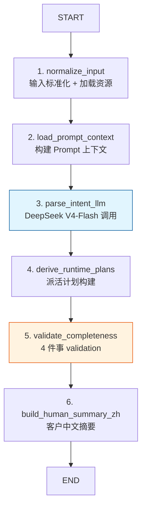
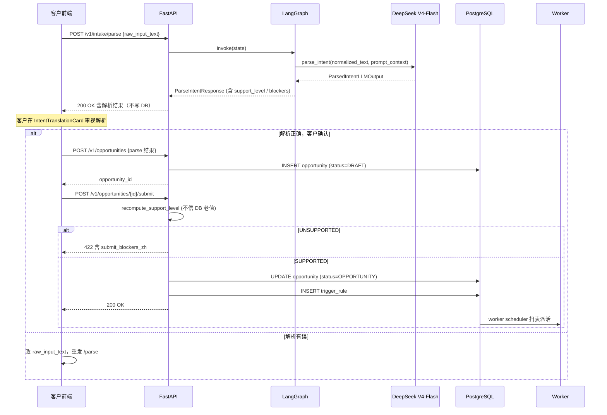
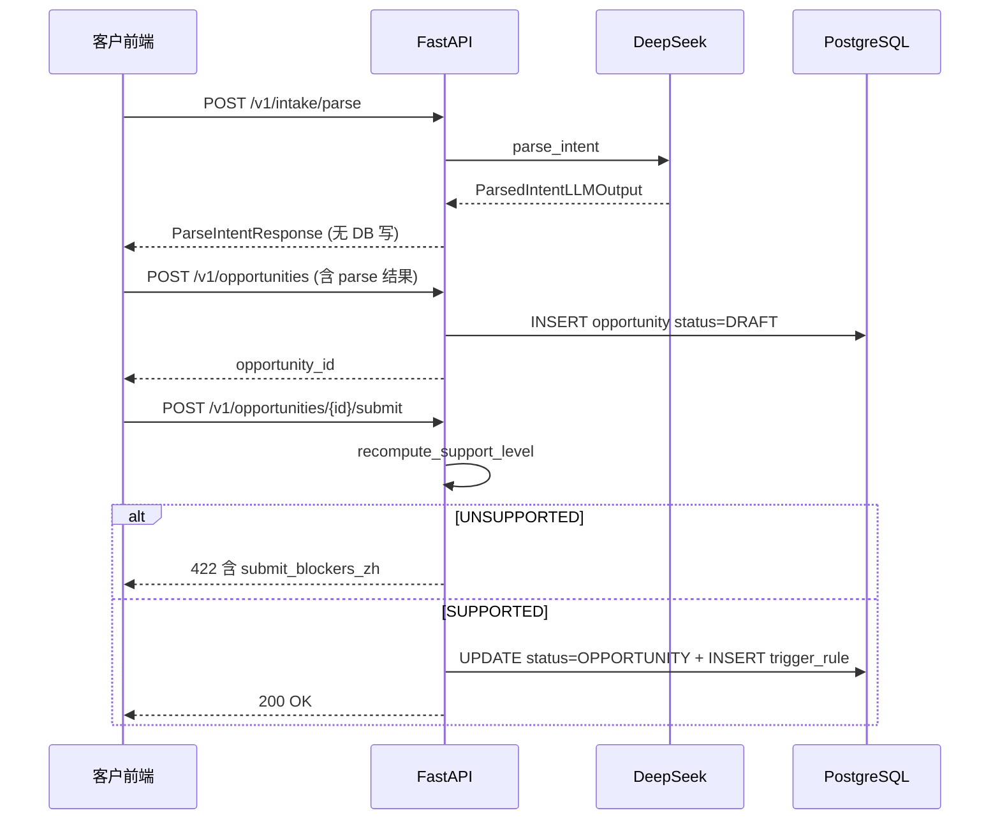

<!-- PAGE_ID: options_03_intake -->
<details>
<summary>📚 Relevant source files</summary>

The following files were used as context for generating this wiki page (commit `6b3d159`):

- [src/options_event_trader/graphs/intake_graph.py#L1-L172](https://github.com/ChunmiaoYu/options_ai_trader/blob/6b3d159/src/options_event_trader/graphs/intake_graph.py#L1-L172)
- [src/options_event_trader/domain/intake_models.py#L1-L227](https://github.com/ChunmiaoYu/options_ai_trader/blob/6b3d159/src/options_event_trader/domain/intake_models.py#L1-L227)
- [src/options_event_trader/integrations/openai_intake_client.py#L1-L303](https://github.com/ChunmiaoYu/options_ai_trader/blob/6b3d159/src/options_event_trader/integrations/openai_intake_client.py#L1-L303)
- [src/options_event_trader/prompts/intake_parser_system_prompt.md#L1-L135](https://github.com/ChunmiaoYu/options_ai_trader/blob/6b3d159/src/options_event_trader/prompts/intake_parser_system_prompt.md#L1-L135)
- [src/options_event_trader/intake/runtime_planner.py#L1-L596](https://github.com/ChunmiaoYu/options_ai_trader/blob/6b3d159/src/options_event_trader/intake/runtime_planner.py#L1-L596)
- [src/options_event_trader/intake/support_level.py#L1-L74](https://github.com/ChunmiaoYu/options_ai_trader/blob/6b3d159/src/options_event_trader/intake/support_level.py#L1-L74)
- [src/options_event_trader/services/intake_service.py#L1-L94](https://github.com/ChunmiaoYu/options_ai_trader/blob/6b3d159/src/options_event_trader/services/intake_service.py#L1-L94)
- [src/options_event_trader/api/routers/intake.py#L1-L22](https://github.com/ChunmiaoYu/options_ai_trader/blob/6b3d159/src/options_event_trader/api/routers/intake.py#L1-L22)
- [src/options_event_trader/api/routers/opportunities.py#L1-L102](https://github.com/ChunmiaoYu/options_ai_trader/blob/6b3d159/src/options_event_trader/api/routers/opportunities.py#L1-L102)
- [src/options_event_trader/config/trigger_catalog.yml#L1-L108](https://github.com/ChunmiaoYu/options_ai_trader/blob/6b3d159/src/options_event_trader/config/trigger_catalog.yml#L1-L108)
- [src/options_event_trader/config/default_policies.yml#L1-L15](https://github.com/ChunmiaoYu/options_ai_trader/blob/6b3d159/src/options_event_trader/config/default_policies.yml#L1-L15)
- [src/options_event_trader/core/enums.py#L1-L39](https://github.com/ChunmiaoYu/options_ai_trader/blob/6b3d159/src/options_event_trader/core/enums.py#L1-L39)

</details>

# Agent1：Intake 解析器

> **Related Pages**: [[系统架构|02_architecture.md]], [[Agent2：策略决策器|04_strategy.md]]

Agent 1（Intake 解析器）是系统的入口环节，负责把客户的中文自然语言意图，提取成一份**派活清单**：标的（symbol）+ 触发条件（trigger_family + 必需 sub-fields）。客户原话以 `raw_input_text` 形式整段保留并向下游透传，仓位、方向、止盈止损、策略类型等所有运营层决策由 Agent 2 看着原话自决。

本页对 Agent 1 的职责边界、6 节点 LangGraph 工作流、DeepSeek V4-Flash 模型调用、客户端展示语义、生命周期（DRAFT → SUBMITTED）做体系化说明。

---

<!-- BEGIN:AUTOGEN options_03_intake_role -->
## 1. Agent 1 角色 — 给 worker 派活，**不是** validate

Agent 1 在整条流水线里只做两件事：

| 职责 | 内容 |
|---|---|
| 1. **给 worker 派活** | 把中文自然语言意图提取成 `trigger_family` + 该 family 的必需 sub-fields（触发价 / 时间 / 均线周期），写入 `trigger_rules` 表给 worker scheduler 扫表派活 |
| 2. **极小集 validation** | 只阻断 4 类硬性问题：(a) symbol 无法解析；(b) 触发条件不在本期支持范围；(c) 仓位 % 与开仓金额 $ 矛盾；(d) trigger 类型基础设施未就绪 |

> **2026-05-04 用户 Tier 1 纠正**：旧版本 Agent 1 一度被设计成"防 LLM 静默改写客户原话"的安全闸，加入了 `entry_at_zh` substring check 等防御逻辑。这套防御 2026-05-04 整体废止——客户原话 `raw_input_text` 已经整段传给 Agent 2，Agent 2 入场决策时自己看原话不依赖中文摘要的字面准确性。**重复防御反而误阻断**，旧 invariant 7 已在项目 `CLAUDE.md` 标 deprecated。

### 1.1 不属于 Agent 1 的职责

下列项目**显式不在** Agent 1 职责内，凡是 spec / prompt / 代码里出现，按 stale bug 处理：

- ❌ **不防 LLM 改原话**：raw_input_text 整段传 Agent 2，是唯一真相
- ❌ **不前置策略决策**：方向 / 手数 / TP / SL 全部 Agent 2 自决
- ❌ **不做 AI 风格预审**：旧 `suitability_gate` 字段已删除
- ❌ **不做时区转换**：原文带"北京时间下午 2 点"就保留原话，server compile 阶段按 symbol 主交易所时区翻译（见 §1.4）
- ❌ **不做 REQUIRE_CLARIFICATION 词典追问**：词典追问 + 反馈学习系统 2026-04-29 整体删除

### 1.2 Validation 4 件事（白名单）

| 编号 | 阻断条件 | 实现位置 | 客户可见提示 |
|---|---|---|---|
| (a) | `draft.symbol` 为空 | `runtime_planner.validate_runtime_plan` | "暂未识别出交易标的，请补充 Symbol。" |
| (b1) | `trigger_family` 为空 | 同上 | "暂未识别出触发条件，请补充触发时间或条件。" |
| (b2) | `trigger_family` 已识别但 `auto_execute_supported=false`（infra 未就绪） | `support_level.compute_support_level` | "触发类型 X 暂不支持自动下单：…" |
| (b3) | 含「第 N 次 / 再次 / 反复 / 重复触发」语义 | `runtime_planner` 正则硬阻断 | "暂不支持「第 N 次 / 重复触发」类条件，请简化为单次触发条件。…" |
| (c) | 同时表达开仓金额 + 仓位百分比 | LLM 在 prompt 阶段识别 → `validation_errors_zh` 输出 | "金额和账户百分比不能同时指定，请只保留一种" |
| (d) | trigger_family 必需 sub-fields 缺失（如 MA_CROSSOVER 缺 `slow_period`） | `runtime_planner.validate_runtime_plan` | "「20 日金叉」未明确长期均线周期，请补充 10 日 / 20 日 / 30 日 等。" |

所有阻断原因都通过 `submit_blockers_zh: list[str]` 字段以中文短句呈现，客户在前端 IntentTranslationCard 直接看见。

### 1.3 本期支持的 trigger_family（4 类）

按项目 `CLAUDE.md` invariant 19，本版本只接 4 类触发，含事件日历的全部跳过：

| trigger_family | 触发场景 | 必填 sub-fields | runtime_type |
|---|---|---|---|
| `ENTRY_TIME` | 立即 / 现在 / 立刻；或没说时间（默认） | `entry_at_zh` | SCHEDULED_TIME |
| `ENTRY_WINDOW` | 时间窗 / 截止时间 / 财报前一天 | `window_start_zh` + `window_end_zh` | MARKET_SESSION_WINDOW |
| `PRICE_BREACH` | 突破 / 跌破 / 上穿 X 价位 | `price_level` + `breach_direction` (ABOVE/BELOW) + `bar_interval` | CONDITION_MONITOR |
| `MA_CROSSOVER` | 均线交叉（限**单 MA** + **常数 price level**） | `fast_period` + `slow_period` + `bar_interval` + `crossover_direction` (CROSS_UP/CROSS_DOWN) | CONDITION_MONITOR |

**条件类只支持 PRICE_BREACH（常数）+ MA_CROSSOVER（单 MA）**。"突破布林带 / KDJ 金叉 / RSI 超卖"这类多指标组合在本期 schema 内**不被解析**——LLM 默默忽略时由 (b1) 阻断或在 v3 中由 trigger_family 缺失阻断。

### 1.4 时区默认按 symbol 主交易所（invariant 15）

时间表达原则上**保留客户原文**，不在 intake 层主动转换。下游处理：

1. **Agent 1**：`entry_at_zh` 等字段保留原话，例如客户说"明天下午 2 点"就填"明天下午 2 点"
2. **server compile 阶段**：按 `symbol → primaryExchange → timezone` 翻译成 `entry_at_utc`
   - NYSE / NASDAQ → `America/New_York`
   - ASX → `Australia/Sydney`
   - SEHK → `Asia/Hong_Kong`
3. **客户显式指定时区**：原文出现"北京时间 / 新西兰时间 / 香港时间"等词时，原文中保留时区词，server compile 用客户指定的时区覆盖默认

> **关键**：Agent 1 LLM **不做**时区数学，也**不假设**默认时区。"中午 12 点"在 NVDA（NYSE）opp 上自动按 ET 解析；客户要 BJ 时间必须自己说出来。

Sources: [src/options_event_trader/intake/runtime_planner.py#L464-L563](https://github.com/ChunmiaoYu/options_ai_trader/blob/6b3d159/src/options_event_trader/intake/runtime_planner.py#L464-L563), [src/options_event_trader/intake/support_level.py#L32-L73](https://github.com/ChunmiaoYu/options_ai_trader/blob/6b3d159/src/options_event_trader/intake/support_level.py#L32-L73), [src/options_event_trader/config/trigger_catalog.yml#L1-L108](https://github.com/ChunmiaoYu/options_ai_trader/blob/6b3d159/src/options_event_trader/config/trigger_catalog.yml#L1-L108), [src/options_event_trader/prompts/intake_parser_system_prompt.md#L56-L62](https://github.com/ChunmiaoYu/options_ai_trader/blob/6b3d159/src/options_event_trader/prompts/intake_parser_system_prompt.md#L56-L62)
<!-- END:AUTOGEN options_03_intake_role -->

---

<!-- BEGIN:AUTOGEN options_03_intake_required_fields -->
## 2. 必填字段只有 `symbol`（invariant 5 v3，2026-05-03 起）

### 2.1 业务硬必填清单

机会单的必填字段**只有一个**：`symbol`（标的代码，如 `NVDA` / `AAPL` / `TSLA`，大写美股代码）。

外加 `trigger_family` 的基础设施已就绪（即 `auto_execute_supported=true`），就够 Agent 1 把任务派给 worker。其余所有"看起来重要"的字段，全部**不必填**。

### 2.2 已废弃字段清单（2026-05-03 v3 极致瘦身 + 2026-05-04 max_legs 补）

下列 14 个字段在 LLM schema、Pydantic 模型、prompt 中**已全部删除或不再要求**。LLM 即使输出也会被 `_strip_empty_and_deprecated` 过滤掉（见 [openai_intake_client.py#L29-L45](https://github.com/ChunmiaoYu/options_ai_trader/blob/6b3d159/src/options_event_trader/integrations/openai_intake_client.py#L29-L45)）：

| 废弃字段 | 改为 |
|---|---|
| `position_spec` / `target_quantity` / `max_position_pct` | Agent 2 默认 1 手；客户原话有"5 万本金 / 3 成仓 / 8 手"等表达由 Agent 2 看 raw_input_text 自决 |
| `take_profit_spec` / `stop_loss_spec` | Agent 2 据策略类型 + IV regime + 客户原话决定 TP / SL（与 invariant 16 "止盈止损全自动" 一致） |
| `direction` | invariant 4 已规定 null 合法；Agent 2 自决（详见 §9） |
| `preferred_strategies` / `disallowed_strategies` | Agent 2 看原话自决具体策略（CALL / PUT / VERTICAL / IRON_CONDOR 等） |
| `instrument_scope` / `risk_style` | Agent 2 自决 |
| `suitability_gate` | 整条 AI 风格预审已删；不再卡客户"如果适合的话"等口语 |
| `user_thesis_zh` | raw_input_text 整段传 Agent 2，无需另存"客户论点摘要" |
| `partial_fill_policy` / `intent_type` | broker_adapter 兜底处理 |
| `max_legs` | 旧 invariant 17 "策略最多 2 腿" 已废止；Agent 2 自决，IRON_CONDOR 4 腿合法 |

### 2.3 矛盾检测仍在 Agent 1（唯一保留的语义校验）

虽然字段已极致瘦身，**金额（DOLLAR_AMOUNT 语义）↔ 账户%（ACCOUNT_PCT 语义）**两者**不能同时表达**。LLM 在 prompt 阶段识别后写入 `validation_errors_zh: list[str]`，runtime_planner 透传到 `submit_blockers_zh` 阻止提交。

| 客户表达 | 分类 | 是否矛盾 |
|---|---|---|
| "投 5 万本金" / "用 4000 美元买" / "5k 入场" | DOLLAR_AMOUNT | 与 ACCOUNT_PCT 矛盾 |
| "用账户 5%" / "3 成仓" / "20% 仓位" | ACCOUNT_PCT | 与 DOLLAR_AMOUNT 矛盾 |
| "最多亏 2 万 / 风险控制在 X / 亏不超过 Y" | `max_risk_dollars` | **不算矛盾**（风控边界与开仓金额无关） |
| "5 手 / 8 张" | CONTRACTS | **不算矛盾**（手数依赖单价异步获取，与金额 / % 不联动） |
| "赚 X 万 / 涨到 X" | TP 表达 | **不算矛盾**（与开仓金额无关） |

prompt 中举例：

```
✓ 不矛盾："最多亏 2 万 + 仓位 30%"   → max_risk + ACCOUNT_PCT
✓ 不矛盾："5 手 + 最多亏 2 万"        → 手数 + max_risk
✗ 矛盾  ："投 5 万 + 仓位 30%"        → DOLLAR_AMOUNT + ACCOUNT_PCT 同时给
```

### 2.4 Why — Agent 2 看原话比 Agent 1 schema 化更准

旧版本（极致瘦身前）Agent 1 把客户每个意图都拆成结构化 enum / spec / pct 字段，看似严谨，实测**理解准确率反而低于让 Agent 2 直接看原话**。原因：

- Agent 1 拆字段时必须做"中→结构"的语义压缩，损失上下文（例：客户说"等回调一点再接，最多接 5 万"，旧 schema 会把"等回调"丢掉只填 `target_amount=50000`）
- Agent 2 看 10 维 market context bundle + 完整 raw_input_text，对"该不该多买几手 / 该选 IRON_CONDOR 还是 STRADDLE / TP 该 +30% 还是 +50%"的判断更贴近真实交易决策
- schema 强制结构化反而成了"假装权威"——LLM 字段填错了客户也看不出来，比 raw_input_text 整段保留更危险

> **应用建议**：写代码 / brainstorm / 解释"什么时候 SUPPORTED" 时，必填清单**只列 symbol**，不列任何其他字段。如果代码 / 文档 / 测试断言"TP 必填"或"position_spec 必填"，那是 stale bug，需修而非顺从。

Sources: [src/options_event_trader/domain/intake_models.py#L41-L101](https://github.com/ChunmiaoYu/options_ai_trader/blob/6b3d159/src/options_event_trader/domain/intake_models.py#L41-L101), [src/options_event_trader/integrations/openai_intake_client.py#L29-L45](https://github.com/ChunmiaoYu/options_ai_trader/blob/6b3d159/src/options_event_trader/integrations/openai_intake_client.py#L29-L45), [src/options_event_trader/prompts/intake_parser_system_prompt.md#L36-L52](https://github.com/ChunmiaoYu/options_ai_trader/blob/6b3d159/src/options_event_trader/prompts/intake_parser_system_prompt.md#L36-L52)
<!-- END:AUTOGEN options_03_intake_required_fields -->

---

<!-- BEGIN:AUTOGEN options_03_intake_workflow -->
## 3. LangGraph 6 节点工作流

Intake 工作流通过 `build_intake_graph(parser)` 构建，接收一个实现 `IntentParser` 协议的解析器实例（当前为 `OpenAIIntentParserAdapter`），返回编译后的 LangGraph 状态图。当前规模 **6 节点**，按项目 [LangGraph 使用决策](https://github.com/ChunmiaoYu/options_ai_trader)（memory `project_langgraph_decision.md`）**限定不扩展**——Agent 2 / risk gate / broker_adapter 都不引入 LangGraph，用纯 Python 顺序流即可。

### 3.1 流程图



### 3.2 各节点详解

#### 节点 1：`normalize_input` — 输入标准化 + 资源加载

根据 `input_mode`（TEXT 或 VOICE）从 `IntakeState` 选择候选文本，执行 `.strip()`：

| 输入模式 | 候选优先级 |
|---|---|
| `TEXT` | `raw_input_text` → `transcript_text` |
| `VOICE` | `transcript_text` → `raw_input_text` |

如果两者都为空抛 `ValueError("输入内容不能为空。")`。同时调用 `load_runtime_resources()` 一次性加载 `trigger_catalog.yml` + `default_policies.yml`（带 `@lru_cache` 避免重复读盘）。

**输入**：`raw_input_text` / `transcript_text` / `input_mode`
**输出**：`normalized_text: str`，`runtime_resources: IntakeRuntimeResources`

#### 节点 2：`load_prompt_context` — 构建 Prompt 上下文

把 `trigger_catalog`（4 类 trigger_family + 必填字段）+ `default_policies`（缺省 bar_interval / once_only 等）拼成纯文本 prompt 上下文，注入到 LLM 调用。上下文结构：

- **Trigger Catalog**：列出 4 类 trigger_family + 各自必填字段
- **默认规则**：`do_not_guess_missing_fields=true` 等

**输入**：`runtime_resources`
**输出**：`prompt_context: str`

#### 节点 3：`parse_intent_llm` — LLM 语义解析（唯一 LLM 节点）

调用 `parser.parse_intent(normalized_text, prompt_context)`，返回 `ParsedIntentDraft`。当前 `parser` = `OpenAIIntentParserAdapter`，按 `settings.llm_provider` 分流到 OpenAI gpt-5（legacy）或 **DeepSeek V4-Flash**（默认）路径。

**输入**：`normalized_text` + `prompt_context`
**输出**：`parsed_draft: ParsedIntentDraft`

DeepSeek 调用细节见 §4。

#### 节点 4：`derive_runtime_plans` — 派活计划构建

把 LLM 输出加工成 worker scheduler 能消费的派活清单：

- `enrich_draft(draft, normalized_text, policies)`：补缺省值（如 MA_CROSSOVER 没填 `bar_interval` 用 default `1d`，`once_only` 永远强制 `True`），symbol 大写归一
- `build_trigger_plan(draft, trigger_catalog)` → `TriggerPlanPreview`（含 `trigger_family` / `runtime_type` / `needs_continuous_monitoring` 等元数据）
- `build_activation_plan(...)` → `ActivationPlanPreview`（激活时机：是否立即开始 / 是否需 scheduler / timezone_source）
- `build_subscription_plan(...)` → `list[SubscriptionPlanItem]`（PRICE_BREACH 类需 BARS 订阅）
- `build_compute_plan(...)` → `list[ComputePlanItem]`（MA_CROSSOVER 需 SMA + CROSSOVER compute）
- `build_query_plan(trigger_plan, catalog)` → `QueryPlanPreview`（on_activation / on_trigger / pre_order / post_fill 数据查询时序）
- `build_risk_constraints(draft)` → `RiskConstraintsPreview`（`max_risk_dollars` 透传）
- `build_strategy_preferences()` → `StrategyPreferencesPreview`（已是空 stub，invariant 5 v3 删后保留 schema 兼容）

**输入**：`parsed_draft` + `runtime_resources`
**输出**：上述 7 个 plan 字段全部写入 state

> **2026-05-03 删除**：旧 `fill_defaulted_specs` / `normalize_specs`（PositionSpec / TPSpec / SLSpec 字段全删后失去用途）

#### 节点 5：`validate_completeness` — 4 件事 validation

调 `validate_runtime_plan(draft, trigger_plan, catalog, normalized_text)`，做 §1.2 列出的 4 类阻断检查，并返回：

```python
{
    "support_level": SupportLevel,           # SUPPORTED / UNSUPPORTED
    "can_submit_as_is": bool,                # 无 errors 无 blockers → True
    "can_submit_after_adjustment": bool,     # trigger_family 至少识别到了
    "missing_fields": list[str],             # ["symbol", "fast_period", ...]
    "validation_errors_zh": list[str],       # 客户可见错误
    "submit_blockers_zh": list[str],         # 硬阻断原因（invariant 3）
}
```

`compute_support_level` 内部按两条 invariant 判定：
- **I1**：`draft.symbol` 必须存在
- **I2**：`trigger_family` 必须存在 + 对应 `auto_execute_supported=true` + 无 `validation_errors_zh`

任一失败 → `SUPPORTED → UNSUPPORTED`，同时附带中文 `reasons`。

> **关键**：`UNSUPPORTED` 时 `query_plan` 会做特殊处理——把 `pre_order` 合并进 `on_activation`，并清空 `pre_order` / `post_fill`（保持向前兼容，避免下游消费方读到不完整的 plan 报错）。

**输入**：所有上一节点的 plan
**输出**：上述 6 个字段写入 state

#### 节点 6：`build_human_summary_zh` — 客户中文摘要

`build_human_summary_zh(draft, trigger_plan)` 返回客户友好的中文摘要，**严格控制内容**：

```python
return f"针对 {symbol}，{trigger_summary}{suffix}"
# suffix 仅在有 event_window_*_zh 时附加事件背景说明
```

> **2026-05-02 重写**：删除"用户请求模式 / 当前有效模式 / 仅建议 / 按时间调度 / 立即启动持续监控 / 激活时查询 X"等 invariant 12 客户禁词（工程师内部行话）。摘要里**只保留客户真要看的**：标的 + 触发条件 +（如有）事件背景。

**输入**：`parsed_draft` + `trigger_plan`
**输出**：`human_summary_zh: str`

### 3.3 IntakeState TypedDict

LangGraph 节点之间通过共享 state 传递数据，state schema 定义在 `intake_graph.py`：

```python
class IntakeState(TypedDict, total=False):
    input_mode: InputMode
    raw_input_text: str | None
    transcript_text: str | None
    normalized_text: str
    runtime_resources: IntakeRuntimeResources
    prompt_context: str
    parsed_draft: ParsedIntentDraft
    parsed_intent: ParsedIntentCore
    trigger_plan: TriggerPlanPreview
    activation_plan: ActivationPlanPreview
    subscription_plan: list[SubscriptionPlanItem]
    compute_plan: list[ComputePlanItem]
    query_plan: QueryPlanPreview
    risk_constraints: RiskConstraintsPreview
    strategy_preferences: StrategyPreferencesPreview
    requested_mode: str
    support_level: str
    can_submit_as_is: bool
    can_submit_after_adjustment: bool
    missing_fields: list[str]
    validation_errors_zh: list[str]
    submit_blockers_zh: list[str]
    human_summary_zh: str
```

### 3.4 为什么限 6 节点不扩展（决策回顾）

按 memory `project_langgraph_decision.md`（2026-04-30 决策）：

> 项目最早期 commit `f5683f5` Step 1 引入 LangGraph，但 Phase 11 后续大量新代码（Agent 2 + collectors + risk gate + broker_adapter）写人按"哪个最快"选了纯 Python 顺序流，没继续接。LangGraph 5 大卖点（多步状态机 / 条件分支 / 检查点持久化 / HITL 中断 / Multi-agent）项目实际只用上**多步状态机** 1 项，其他全否定。净结论：只用 5%，LangChain 升级税 > 收益。

应用规则：

- Agent 1 现状保留 6 节点不动（删它纯回滚成本）
- 新增 Agent 2 / risk gate / broker_adapter / 任何 services 代码**不引入** LangGraph
- 重新评估触发线：Agent 2 review 决策需 ≥ 2 处动态分支时，或加 HITL 中断节点时

Sources: [src/options_event_trader/graphs/intake_graph.py#L1-L172](https://github.com/ChunmiaoYu/options_ai_trader/blob/6b3d159/src/options_event_trader/graphs/intake_graph.py#L1-L172), [src/options_event_trader/intake/runtime_planner.py#L1-L596](https://github.com/ChunmiaoYu/options_ai_trader/blob/6b3d159/src/options_event_trader/intake/runtime_planner.py#L1-L596), [src/options_event_trader/intake/support_level.py#L32-L73](https://github.com/ChunmiaoYu/options_ai_trader/blob/6b3d159/src/options_event_trader/intake/support_level.py#L32-L73)
<!-- END:AUTOGEN options_03_intake_workflow -->

---

<!-- BEGIN:AUTOGEN options_03_intake_deepseek -->
## 4. DeepSeek V4-Flash 调用（默认 LLM）

### 4.1 模型与定价

- **模型**：`deepseek-v4-flash`
- **定价**：$0.14 / $0.28 per 1M token（input / output）—— 比 OpenAI gpt-5 便宜约一个数量级
- **端点协议**：OpenAI-compat（`/v1/chat/completions`），代码沿用 `from openai import OpenAI`，仅切 `base_url` + `api_key` + `model`，不改业务逻辑
- **同时支持**：Anthropic-compat（`/anthropic`）端点——切 Claude 客户端只改 `base_url + api_key + model`，调用代码不变

### 4.2 Provider 路由（OpenAI 与 DeepSeek 双路径）

`OpenAIIntentParserAdapter.__init__` 按 `settings.llm_provider` 分流：

```python
if self.provider == "deepseek":
    self.client = OpenAI(
        api_key=settings.deepseek_api_key,
        base_url=settings.deepseek_base_url,   # https://api.deepseek.com
    )
    self.model = settings.deepseek_model        # deepseek-v4-flash
else:
    # legacy OpenAI gpt-5 path
    self.client = OpenAI(api_key=settings.openai_api_key)
    self.model = settings.openai_model
```

| 路径 | API 方法 | Schema 强制 | Retry 策略 |
|---|---|---|---|
| OpenAI gpt-5 | `client.responses.parse(text_format=ParsedIntentLLMOutput, ...)` | 服务端 strict mode | 无（gpt-5 strict 出错即抛） |
| **DeepSeek V4-Flash** | `client.chat.completions.create(response_format={"type": "json_object"}, ...)` | 客户端 Pydantic `model_validate` 兜底 | 失败重试 1 次（共 2 次） |

### 4.3 DeepSeek 路径详解（`_parse_via_chat_json`）

DeepSeek 没有 OpenAI 的 strict 服务端 schema 强制，因此走"json_object 模式 + 客户端 Pydantic validate + 1 次重试"组合：

```python
response = self.client.chat.completions.create(
    model=self.model,
    messages=[
        {"role": "system", "content": full_instructions},
        {"role": "user", "content": dumps_json({"user_request": raw_text})},
    ],
    response_format={"type": "json_object"},
    temperature=0.0,
)
content = response.choices[0].message.content
raw_json = json.loads(content)
raw_json = _strip_empty_and_deprecated(raw_json)   # 防 LLM muscle memory 输出旧字段
structured = ParsedIntentLLMOutput.model_validate(raw_json)
```

**两层防御**：

1. **`_strip_empty_and_deprecated()`**：递归剔除值为 `None / [] / ""` 的键 + 14 个**已废弃字段**（`direction` / `intent_type` / `target_quantity` / `partial_fill_policy` / `preferred_strategies` / `disallowed_strategies` / `instrument_scope` / `risk_style` / `suitability_gate` / `max_position_pct` / `user_thesis_zh` / `take_profit_spec` / `stop_loss_spec` / `position_spec`）。这一层防"LLM muscle memory"——即使 LLM 仍输出旧字段也会被静默丢弃，不进 Pydantic validate。

2. **Pydantic `model_validate`**：`ParsedIntentLLMOutput` 配置 `extra='forbid'`，schema 之外的字段会触发 `ValidationError` 进入重试。

**重试逻辑**：

```python
for attempt in (1, 2):
    response = self.client.chat.completions.create(...)
    try:
        # ... validate
        return structured.to_draft()
    except (json.JSONDecodeError, ValidationError) as exc:
        last_err = exc
        continue   # 进入 attempt 2

# 2 次都失败
raise IntakeServiceError(
    status_code=502,
    error_code="DEEPSEEK_SCHEMA_VALIDATION_FAILED",
    message_zh="DeepSeek 返回的数据 2 次均未通过 schema 校验, 请重新输入或稍后重试.",
)
```

### 4.4 错误映射（中文友好）

DeepSeek 路径的所有 OpenAI SDK 异常都映射成中文 `IntakeServiceError`：

| SDK 异常 | error_code | message_zh | HTTP |
|---|---|---|---|
| `AuthenticationError` | `DEEPSEEK_AUTH_FAILED` | DeepSeek 鉴权失败, 请检查 API Key. | 503 |
| `RateLimitError` | `DEEPSEEK_RATE_LIMITED` | DeepSeek 请求过于频繁, 请稍后再试. | 429 |
| `APITimeoutError` | `DEEPSEEK_TIMEOUT` | DeepSeek 解析超时, 请稍后重试. | 504 |
| `APIConnectionError` | `DEEPSEEK_CONNECTION_ERROR` | 无法连接到 DeepSeek, 请检查网络. | 503 |
| `APIError`（其他） | `DEEPSEEK_UPSTREAM_ERROR` | DeepSeek 返回上游错误, 请稍后重试. | 502 |
| 2 次 schema validate fail | `DEEPSEEK_SCHEMA_VALIDATION_FAILED` | DeepSeek 返回的数据 2 次均未通过 schema 校验... | 502 |
| 2 次 JSONDecodeError | 同上 | 同上 | 502 |
| `DEEPSEEK_API_KEY` 未配置 | `DEEPSEEK_NOT_CONFIGURED` | DEEPSEEK_API_KEY 未配置, 无法解析输入。 | 503 |

OpenAI 路径同理（错误代码前缀 `OPENAI_*`）。

### 4.5 Token 优化与监控

prompt 末尾强约束：

> 严禁输出 null / 空数组 / 空字符串。字段没值就**整个键去掉**。每多输出一个 null/空字段消耗你 50-100ms 响应时间。

实测每次解析按 `intake.timing` 日志结构化记录：

```json
{
  "provider": "deepseek",
  "model": "deepseek-v4-flash",
  "input_tok": 2840,
  "output_tok": 145,
  "api_ms": 27214.3,
  "total_ms": 27290.1,
  "retry_attempts": 1,
  "raw_text_preview": "NVDA 突破 920 买, 最多亏 2 万"
}
```

> **性能基线（2026-05-07 实测）**：DeepSeek V4-Flash 单次解析 ~27s（API 内部 ~67 tok/s 输出）。瓶颈是模型吞吐而非网络/后处理（见 memory `feedback_measure_before_explain_perf.md`）。

### 4.6 切换到 Anthropic / 其他 OpenAI-compat 模型

DeepSeek 同时提供 Anthropic-compat 端点 `/anthropic`，所以"切 Claude / OpenAI"只改 3 个配置项（`base_url` + `api_key` + `model`），调用代码完全不变：

```bash
# .env 切到 DeepSeek 的 Claude Sonnet 兼容路由
DEEPSEEK_BASE_URL=https://api.deepseek.com/anthropic
DEEPSEEK_MODEL=deepseek-anthropic-claude-sonnet-4

# 切回 OpenAI gpt-5
LLM_PROVIDER=openai
OPENAI_MODEL=gpt-5
```

应用代码不需要 import anthropic SDK，OpenAI SDK 同时吃两边路由（详见 memory `reference_deepseek_compat_endpoints.md`）。

Sources: [src/options_event_trader/integrations/openai_intake_client.py#L48-L303](https://github.com/ChunmiaoYu/options_ai_trader/blob/6b3d159/src/options_event_trader/integrations/openai_intake_client.py#L48-L303), [src/options_event_trader/prompts/intake_parser_system_prompt.md#L62-L72](https://github.com/ChunmiaoYu/options_ai_trader/blob/6b3d159/src/options_event_trader/prompts/intake_parser_system_prompt.md#L62-L72)
<!-- END:AUTOGEN options_03_intake_deepseek -->

---

<!-- BEGIN:AUTOGEN options_03_intake_pydantic_schema -->
## 5. Pydantic Schema：`ParsedIntentLLMOutput` / `ParseIntentResponse`

### 5.1 `ParsedIntentLLMOutput`（LLM 直出 schema，21 字段）

LLM 严格按下表输出 JSON。`model_config = ConfigDict(extra="forbid")` 强制 schema 之外字段直接报错（防 LLM 加塞）：

| 字段 | 类型 | 用途 |
|---|---|---|
| `title` | `str \| None` | 客户友好的中文标题（如 "NVDA 突破 920 入场"） |
| `symbol` | `str \| None` | **唯一硬必填**——大写美股代码 |
| `trigger_family` | `str \| None` | ENTRY_TIME / ENTRY_WINDOW / PRICE_BREACH / MA_CROSSOVER 4 选 1 |
| `entry_at_zh` | `str \| None` | ENTRY_TIME 必填，保留客户原话 |
| `window_start_zh` / `window_end_zh` | `str \| None` | ENTRY_WINDOW 必填 |
| `monitor_window_start_zh` / `monitor_window_end_zh` | `str \| None` | 条件类的监控窗口（可选） |
| `fast_period` / `slow_period` | `int \| None` | MA_CROSSOVER 必填 |
| `bar_interval` | `str \| None` | MA_CROSSOVER / PRICE_BREACH 必填，默认 "1m" |
| `price_field` | `str \| None` | "close" / "open" 等 |
| `crossover_direction` | `str \| None` | CROSS_UP / CROSS_DOWN |
| `once_only` | `bool \| None` | 触发一次性，**永远强制 True**（enrich_draft 阶段覆盖） |
| `max_risk_dollars` | `float \| None` | "最多亏 X 万" 的硬美元上限（不是开仓金额） |
| `event_window_start_zh` / `event_window_end_zh` | `str \| None` | 事件背景窗口（财报日 / 公告日），**不是触发条件**，是 Agent 2 参考信息 |
| `price_level` | `float \| None` | PRICE_BREACH 必填 |
| `breach_direction` | `str \| None` | ABOVE / BELOW |
| `validation_errors_zh` | `list[str]` | LLM 识别到金额↔% 矛盾时填入 |

> **2026-05-03 删除清单**（B 方案 radical simplify）：从 `ParsedIntentLLMOutput` 移除 14 个字段：`direction` / `intent_type` / `target_quantity` / `partial_fill_policy` / `preferred_strategies` / `disallowed_strategies` / `instrument_scope` / `risk_style` / `suitability_gate` / `max_position_pct` / `user_thesis_zh` / `take_profit_spec` / `stop_loss_spec` / `position_spec`。

### 5.2 `to_draft()` — LLMOutput → Draft

`ParsedIntentLLMOutput.to_draft()` 返回 `ParsedIntentDraft`，几乎是一一映射，加 `validation_errors_zh: list[str] = list(self.validation_errors_zh)` 透传，让 runtime_planner 后续推到 `submit_blockers_zh`。

### 5.3 `ParseIntentResponse`（API 响应外形）

完整响应给前端的字段：

```python
class ParseIntentResponse(BaseModel):
    input_mode: InputMode
    normalized_text: str
    schema_version: str = "intake_v2"
    requested_mode: OpportunityMode               # ADVICE_ONLY / AUTO_EXECUTE (legacy 不再写新值)
    support_level: SupportLevel                   # SUPPORTED / UNSUPPORTED
    can_submit_as_is: bool
    can_submit_after_adjustment: bool
    parsed_intent: ParsedIntentCore
    trigger_plan: TriggerPlanPreview
    activation_plan: ActivationPlanPreview
    subscription_plan: list[SubscriptionPlanItem]
    compute_plan: list[ComputePlanItem]
    query_plan: QueryPlanPreview
    risk_constraints: RiskConstraintsPreview
    strategy_preferences: StrategyPreferencesPreview
    missing_fields: list[str]
    validation_errors_zh: list[str]
    submit_blockers_zh: list[str]                 # invariant 3：can_submit_as_is=False 时必不空
    human_summary_zh: str
    intent_overrides: dict[str, Any]              # 用户手动改字段时前端 PATCH 写入
    source_trace: dict[str, dict[str, Any]]       # 字段来源审计（Agent 1 不再生产，仅前端 PATCH 写入）
```

### 5.4 `ParsedIntentCore`（精简版给前端展示）

```python
class ParsedIntentCore(BaseModel):
    title: str
    symbol: str | None = None
    requested_mode: OpportunityMode
    event_window_start_zh: str | None = None
    event_window_end_zh: str | None = None
```

只保留客户能看的标的 / 标题 / 事件背景；trigger 详情在 `trigger_plan` 里单独走。

Sources: [src/options_event_trader/domain/intake_models.py#L41-L227](https://github.com/ChunmiaoYu/options_ai_trader/blob/6b3d159/src/options_event_trader/domain/intake_models.py#L41-L227)
<!-- END:AUTOGEN options_03_intake_pydantic_schema -->

---

<!-- BEGIN:AUTOGEN options_03_intake_translation_card -->
## 6. 解析结果展示：IntentTranslationCard（readonly）

### 6.1 invariant 13 v3：客户回输入框改原话重新解析

按项目 `CLAUDE.md` invariant 13（2026-05-03 IntentTranslationCard readonly 加固）：

> 修改 = 取消原单 + 创建复制单（**仅 Agent 1 机会单阶段适用**），嵌套编号（#5 → #5.1 → #5.1.1）。**前端解析卡 IntentTranslationCard 也对齐 readonly**：客户回输入框改 `raw_input_text` 重新解析, 不允许点字段直接改; 跟 invariant 5 detail tab readonly 一致。

简言之：**前端展示的解析字段（symbol / trigger_family / entry_at_zh / 等）全部禁止点编辑**。客户对解析结果不满意时，唯一改法是：

1. 回到顶部输入框
2. 改 `raw_input_text` 原话
3. 点"重新解析"——走完整 6 节点 LangGraph 重跑

**为什么禁字段直改**：

- 客户原话 `raw_input_text` 是唯一真相（与 invariant 13 一致）；如果允许点字段改 `entry_at_zh="明天 14:00"`，会让 raw_input_text（"明天下午 2 点"）和字段（"明天 14:00"）出现差异，Agent 2 看到 raw_input_text 时会忽略字段，造成"前端改了不生效"的误解
- 前端字段是给客户**审视 LLM 解析对不对**用的；不对就重写原话，不是手动 patch 字段
- 与 invariant 5 detail tab readonly 对齐——开仓后机会单详情页所有字段也不可改，只能取消重发

### 6.2 IntentTranslationCard 显示哪些字段

按客户视角分两层：

**主要字段**（一眼看到）：

- `parsed_intent.title` — 中文标题
- `parsed_intent.symbol` — 标的
- `trigger_plan.trigger_summary_zh` — 触发条件中文摘要（如"价格突破 920 时入场"）
- `human_summary_zh` — "针对 NVDA，价格突破 920 时入场。" 的整段摘要
- `support_level` — SUPPORTED / UNSUPPORTED 状态徽章

**详细字段**（折叠展开）：

- `parsed_intent.event_window_*_zh` — 事件背景（如有）
- `risk_constraints.max_risk_dollars` — 客户硬美元亏损上限（如有）
- `submit_blockers_zh` — UNSUPPORTED 时的中文阻断原因清单（红色高亮）
- `validation_errors_zh` — 字段级问题清单

**不显示**：activation_plan / subscription_plan / compute_plan / query_plan 等内部派活计划（工程师看的，不给客户）

### 6.3 PATCH `intent_overrides` 与 source_trace（备用机制）

前端 schema 仍保留 `intent_overrides: dict[str, Any]` 和 `source_trace: dict[str, dict[str, Any]]` 两个字段，预留给"未来某天再开放点字段直改"的可能性。**当前版本**这两个字段：

- `intent_overrides`：始终为空 `{}`（IntakeService 不写）
- `source_trace`：始终为空 `{}`（Agent 1 不再生产）

如果未来重开"点字段直改"，前端 PATCH `intent_overrides` 写入字段名→新值映射，后端 merge 到 draft 后重算 support_level；`source_trace` 记录每个字段的来源（LLM / USER_OVERRIDE）。这部分**不在本期 scope**。

Sources: [src/options_event_trader/domain/intake_models.py#L199-L222](https://github.com/ChunmiaoYu/options_ai_trader/blob/6b3d159/src/options_event_trader/domain/intake_models.py#L199-L222), [src/options_event_trader/services/intake_service.py#L65-L71](https://github.com/ChunmiaoYu/options_ai_trader/blob/6b3d159/src/options_event_trader/services/intake_service.py#L65-L71)
<!-- END:AUTOGEN options_03_intake_translation_card -->

---

<!-- BEGIN:AUTOGEN options_03_intake_lifecycle -->
## 7. 生命周期：DRAFT → SUBMITTED（invariant 2：parse ≠ submit）

按项目 `CLAUDE.md` invariant 2：

> **parse ≠ submit**：解析不创建 trigger/task，必须 DRAFT/SUBMIT 分离。

### 7.1 三步流程

```
[1] POST /v1/intake/parse           → 纯 LLM + 派活计划，不写 DB
                                    ↓
[2] POST /v1/opportunities          → save_draft：写 opportunity 表，status="DRAFT"
                                    ↓
[3] POST /v1/opportunities/{id}/submit → submit_opportunity：创建 trigger_rules，status="OPPORTUNITY"
```

### 7.2 流程图



### 7.3 各阶段语义

| 阶段 | DB 写入 | 客户可见状态 | worker 是否派活 |
|---|---|---|---|
| `/v1/intake/parse` | **无** | 临时解析卡 | 否 |
| `POST /v1/opportunities` | `opportunities` 表 INSERT，`status="DRAFT"` | 草稿 | 否 |
| `POST /{id}/submit` | `opportunities.status="OPPORTUNITY"` + `trigger_rules` INSERT | 机会单 | **是**（worker 扫 trigger_rules 派活） |

### 7.4 Submit 时再次 recompute support_level

按 [opportunities.py#L83-L93](https://github.com/ChunmiaoYu/options_ai_trader/blob/6b3d159/src/options_event_trader/api/routers/opportunities.py#L83-L93)：

```python
recomputed = recompute_support_level(opp_for_check)
if recomputed.support_level == SupportLevel.UNSUPPORTED:
    raise HTTPException(
        status_code=422,
        detail={
            "error_code": "OPPORTUNITY_UNSUPPORTED",
            "message_zh": "当前机会单暂不可执行，请按提示补充或改为保存草稿",
            "submit_blockers_zh": recomputed.submit_blockers_zh,
        },
    )
```

> **关键**：submit 阶段**不信任 DB 里 save_draft 时算出的 `support_level`**，重新跑 `recompute_support_level`。原因：DRAFT → SUBMIT 之间客户可能改过 `intent_overrides`（虽本期前端禁直改，但 schema 仍开口），需重算。

### 7.5 DRAFT 与 OPPORTUNITY 的物理表

按 `STATUS_MAP`：

```python
STATUS_MAP = {
    "DRAFT": "DRAFT",
    "OPPORTUNITY": "OPPORTUNITY",
    "IN_POSITION": "IN_POSITION",
    "CLOSED": "CLOSED",
    "FAILED": "FAILED",
}
```

按 invariant 11（2026-05-04 P0-B Worker 显化补丁后）：大状态收敛 4 状态（草稿 / 机会单 / 持仓中 / 已平仓）+ 失败终态。中间态 EXECUTING / SCHEDULED / IN_PROGRESS / NO_TRADE / CANCELLED 物理删除。

Sources: [src/options_event_trader/api/routers/opportunities.py#L42-L101](https://github.com/ChunmiaoYu/options_ai_trader/blob/6b3d159/src/options_event_trader/api/routers/opportunities.py#L42-L101), [src/options_event_trader/services/intake_service.py#L21-L94](https://github.com/ChunmiaoYu/options_ai_trader/blob/6b3d159/src/options_event_trader/services/intake_service.py#L21-L94)
<!-- END:AUTOGEN options_03_intake_lifecycle -->

---

<!-- BEGIN:AUTOGEN options_03_intake_revision_chain -->
## 8. 修改链：取消原单 + 复制单（嵌套编号 #5 → #5.1 → #5.1.1）

按项目 `CLAUDE.md` invariant 13：

> **修改 = 取消原单 + 创建复制单**（**仅 Agent 1 机会单阶段适用**），嵌套编号（#5 → #5.1 → #5.1.1）。Agent 2 的 PARTIAL_CLOSE / ADJUST_STOP 不进修改链，作为 execution_run 事实记录。

### 8.1 适用范围与不适用范围

| 场景 | 是否进修改链 |
|---|---|
| 客户在 DRAFT / OPPORTUNITY 阶段改主意，重新解析 + 重新提交 | **是** |
| 客户在 DRAFT / OPPORTUNITY 阶段补充字段（max_risk_dollars / 时间窗等） | **是** |
| Agent 2 自主 PARTIAL_CLOSE（部分平仓） | 否（execution_run 事实记录） |
| Agent 2 自主 ADJUST_STOP（移动止损） | 否（execution_run 事实记录） |
| 持仓中改主意（取消整单） | 走单独的 cancel 流程，不算修改链 |

### 8.2 嵌套编号规则

`save_draft(payload, parent_opportunity_id=...)` 创建分支 draft 时，`compute_next_revision_path(db, parent_opp)` 计算 `revision_path`：

| parent.revision_path | parent 已有 N 个 child | 新 child.revision_path |
|---|---|---|
| `None`（root #5） | 0 | "1"（#5.1） |
| `None`（root #5） | 1（#5.1 已存在） | "2"（#5.2） |
| "2"（#5.2） | 0 | "2.1"（#5.2.1） |
| "2"（#5.2） | 1（#5.2.1 已存在） | "2.2"（#5.2.2） |

时间戳沿用 lineage root 的 `created_at`（整条链共享），title 格式：

```
{触发类型} - {symbol} · ({yyyyMMdd HHmm}).{revision_path}
```

例如：`PRICE_BREACH - NVDA · (20260507 1430).2.1`。

### 8.3 Submit 复制单时自动取消原单

`POST /v1/opportunities` 带 `parent_opportunity_id` query param 时：

1. 创建新 draft（嵌套 revision_path 自动计算）
2. **该 draft 提交 `/submit` 时会自动 cancel parent 单的 trigger_rule**（原 worker 派活停掉，避免重复下单）

### 8.4 `intent_overrides` 与修改链的关系

`intent_overrides` 字段（前端 PATCH 改字段时写入）**不进修改链**——它在同一个 opportunity 内 in-place 改，不创建新 draft。但本期前端 IntentTranslationCard readonly（§6.1），所以 `intent_overrides` 实际上始终为空。

Sources: [src/options_event_trader/services/opportunity_service.py#L47-L100](https://github.com/ChunmiaoYu/options_ai_trader/blob/6b3d159/src/options_event_trader/services/opportunity_service.py#L47-L100)
<!-- END:AUTOGEN options_03_intake_revision_chain -->

---

<!-- BEGIN:AUTOGEN options_03_intake_blockers -->
## 9. `submit_blockers_zh` 硬阻断（invariant 3）

按项目 `CLAUDE.md` invariant 3：

> **submit_blockers_zh 是硬阻断**：`can_submit_as_is=False` 时 `submit_blockers_zh` 必不为空。

### 9.1 阻断来源

`submit_blockers_zh: list[str]` 在 `validate_completeness` 节点统一组装，来源 4 类：

| 来源 | 触发条件 | 示例 |
|---|---|---|
| LLM 矛盾检测透传 | `draft.validation_errors_zh` 非空（金额+%同时表达） | "金额和账户百分比不能同时指定，请只保留一种" |
| `compute_support_level.reasons` | symbol 缺失 / trigger_family 缺失 / infra 未就绪 | "缺少交易标的。" / "触发条件不完整或未识别。" / "触发类型 X 暂不支持自动下单：…" |
| 「第 N 次」类硬阻断 | 正则匹配 `第\s*[一二三四五六七八九十百千万\d]+\s*[次度]` / "再次" / "反复" / "重复触发" | "暂不支持「第 N 次 / 重复触发」类条件…" |
| `missing_trigger_fields` 翻译 | trigger_family 必填 sub-fields 缺失 | "「20 日金叉」未明确长期均线周期，请补充 10 日 / 20 日 / 30 日 等。" |

### 9.2 LLM-vs-代码 阻断分工

| 阻断类型 | 实现层 | Why |
|---|---|---|
| 金额↔% 矛盾 | LLM（prompt） | 语义判断，需理解"5 万本金"≈"开仓金额"，"3 成仓"≈"账户%"——纯正则做不到 |
| 「第 N 次 / 重复触发」 | Python 正则 | LLM 加 submit_blockers_zh 字段会破坏 DeepSeek schema validation；正则 100% 命中 |
| symbol / trigger_family 缺失 | 代码（runtime_planner） | LLM 输出后字段级判定，确定性逻辑 |
| trigger sub-fields 缺失 | 代码（trigger_catalog 驱动） | trigger_catalog.yml 声明的 required_fields 校验 |

### 9.3 客户视角

`submit_blockers_zh` 在 IntentTranslationCard 红色高亮显示，并在 `POST /{id}/submit` 时返回 422 状态码 + 完整阻断清单。客户行为：

1. 看到红色阻断 → 改 raw_input_text 重新 `/parse`
2. 解析无阻断 → 状态变 SUPPORTED → submit 成功

> **关键**：阻断**永远是客户可读的中文短句**，不暴露任何工程师术语（如 enum 值、字段名）。这一点跟 invariant 12 "前端面向中国客户" 一致。

### 9.4 `can_submit_as_is` vs `can_submit_after_adjustment`

| 字段 | 语义 | 例子 |
|---|---|---|
| `can_submit_as_is` | 当前解析结果**直接可提交**（无 errors 无 blockers） | "NVDA 立刻做多 5 手" → True |
| `can_submit_after_adjustment` | 解析有问题但 trigger_family 至少识别到了，调整后可提交 | "AAPL 上穿 X 价位" 但 X 没填 → False blockers，True can_after_adjust |

- `can_submit_after_adjustment=False` 当且仅当 trigger_family 完全没识别（4 类外的复杂条件，例如"突破布林带"）

Sources: [src/options_event_trader/intake/runtime_planner.py#L470-L563](https://github.com/ChunmiaoYu/options_ai_trader/blob/6b3d159/src/options_event_trader/intake/runtime_planner.py#L470-L563), [src/options_event_trader/intake/support_level.py#L32-L73](https://github.com/ChunmiaoYu/options_ai_trader/blob/6b3d159/src/options_event_trader/intake/support_level.py#L32-L73)
<!-- END:AUTOGEN options_03_intake_blockers -->

---

<!-- BEGIN:AUTOGEN options_03_intake_direction_null -->
## 10. `direction = null` 合法（invariant 4，2026-04-19 起）

按项目 `CLAUDE.md` invariant 4：

> **direction 允许 BULLISH/BEARISH/null**（2026-04-19 起 null 合法）。用户表达波动率/跨式时允许留 null，Agent 2 据 user_thesis 推荐中性策略。

更进一步，2026-05-03 v3 极致瘦身后：

> `direction` 字段**已从 ParsedIntentLLMOutput / ParsedIntentDraft 中删除**（见 §2.2）。Agent 2 据 raw_input_text 自决方向。

### 10.1 客户表达 → Agent 2 决策方向（不在 Agent 1 内）

| 客户原话 | 隐含方向 | Agent 2 推荐策略 |
|---|---|---|
| "NVDA 看涨 / 做多 / 买入" | BULLISH | LONG_CALL / VERTICAL_BULL_CALL_SPREAD |
| "TSLA 看跌 / 做空 / 卖出" | BEARISH | LONG_PUT / VERTICAL_BEAR_PUT_SPREAD |
| "AAPL 财报会暴动 / 大波动 / 跨式 / 双买" | VOLATILITY（中性） | LONG_STRADDLE / LONG_STRANGLE |
| "META 财报后回归区间 / 双卖 / 时间价值" | NEUTRAL（区间） | IRON_CONDOR / SHORT_STRADDLE |
| "GOOGL 突破 X 买" | 没说看涨看跌 | Agent 2 据 PRICE_BREACH `breach_direction` 推断 |

> **Agent 1 不做这些判定**——它只把 raw_input_text 整段保留传 Agent 2，让 Agent 2 看着原话 + 10 维 market context bundle 自决。

### 10.2 与 `crossover_direction` / `breach_direction` 的区别

| 字段 | 是否方向相关 | 是否被 Agent 1 提取 |
|---|---|---|
| `crossover_direction` | 是（CROSS_UP / CROSS_DOWN） | **是**——MA_CROSSOVER 触发条件必填 sub-field |
| `breach_direction` | 是（ABOVE / BELOW） | **是**——PRICE_BREACH 触发条件必填 sub-field |
| 老 `direction`（BULLISH/BEARISH） | 是 | **否**（已删除，Agent 2 自决） |

`crossover_direction` 和 `breach_direction` 是**触发条件**的方向（决定何时开仓），不是**仓位**的方向（决定 long call 还是 long put）。两者可以不一致，例如：

```
"AAPL 跌破 150 我做多看反弹" → breach_direction=BELOW + LONG_CALL
```

这里触发是"跌破 150"，但开仓方向是看涨——Agent 2 看 raw_input_text 自决，Agent 1 不冲突。

Sources: [src/options_event_trader/domain/intake_models.py#L41-L101](https://github.com/ChunmiaoYu/options_ai_trader/blob/6b3d159/src/options_event_trader/domain/intake_models.py#L41-L101), [src/options_event_trader/prompts/intake_parser_system_prompt.md#L16-L34](https://github.com/ChunmiaoYu/options_ai_trader/blob/6b3d159/src/options_event_trader/prompts/intake_parser_system_prompt.md#L16-L34)
<!-- END:AUTOGEN options_03_intake_direction_null -->

---

<!-- BEGIN:AUTOGEN options_03_intake_examples -->
## 11. 端到端示例

### 示例 1：立即开多（最简）

**输入**：`"AAPL 立刻做多, 8 手, 翻倍走"`

**LLM 输出**：

```json
{
  "title": "AAPL 立即做多",
  "symbol": "AAPL",
  "trigger_family": "ENTRY_TIME",
  "entry_at_zh": "立刻"
}
```

**关键观察**：

- `direction` / `target_quantity` / `take_profit_spec` 全部不输出（已废弃字段）
- "8 手"和"翻倍走"留在 raw_input_text 给 Agent 2，Agent 1 不解析
- `trigger_family=ENTRY_TIME, entry_at_zh="立刻"` 保留客户原话

**Validation 结果**：

```json
{
  "support_level": "SUPPORTED",
  "can_submit_as_is": true,
  "submit_blockers_zh": []
}
```

### 示例 2：价格条件触发（含 max_risk_dollars）

**输入**：`"NVDA 突破 920 买, 最多亏 2 万"`

**LLM 输出**：

```json
{
  "title": "NVDA 突破 920 入场",
  "symbol": "NVDA",
  "trigger_family": "PRICE_BREACH",
  "price_level": 920,
  "breach_direction": "ABOVE",
  "bar_interval": "1m",
  "max_risk_dollars": 20000
}
```

**关键观察**：

- "最多亏 2 万" → `max_risk_dollars=20000`（"万" ×10000）
- "最多亏" 不算开仓金额，与仓位 % 兼容（与示例 3 区别）
- `bar_interval` LLM 没填时由 `enrich_draft` 注入默认 "1m"

### 示例 3：金额↔% 矛盾（硬阻断）

**输入**：`"TSLA 投 5 万本金, 用账户 5%"`

**LLM 输出**：

```json
{
  "title": "TSLA 入场",
  "symbol": "TSLA",
  "trigger_family": "ENTRY_TIME",
  "entry_at_zh": "现在",
  "validation_errors_zh": ["金额和账户百分比不能同时指定，请只保留一种"]
}
```

**Validation 结果**：

```json
{
  "support_level": "UNSUPPORTED",
  "can_submit_as_is": false,
  "submit_blockers_zh": ["金额和账户百分比不能同时指定，请只保留一种"]
}
```

**客户行为**：在 IntentTranslationCard 看到红色阻断 → 改 raw_input_text 为"TSLA 投 5 万本金"或"TSLA 用账户 5%"重新 `/parse`。

### 示例 4：均线交叉（MA_CROSSOVER）

**输入**：`"AAPL 5 日均线上穿 20 日均线时买入"`

**LLM 输出**：

```json
{
  "title": "AAPL 5/20 金叉入场",
  "symbol": "AAPL",
  "trigger_family": "MA_CROSSOVER",
  "fast_period": 5,
  "slow_period": 20,
  "bar_interval": "1d",
  "crossover_direction": "CROSS_UP"
}
```

**关键观察**：

- `bar_interval` 没填时 `enrich_draft` 用 default_policies.yml 的 "1d"
- `crossover_direction` LLM 直接输出 CROSS_UP（"上穿"）
- `once_only` 在 `enrich_draft` 阶段**永远强制 True**（防多触发疯狂下单）

### 示例 5：「第 N 次」语义硬阻断

**输入**：`"NVDA 第三次上穿 920 时买"`

**LLM 输出**：

```json
{
  "title": "NVDA 第三次上穿 920 入场",
  "symbol": "NVDA",
  "trigger_family": "PRICE_BREACH",
  "price_level": 920,
  "breach_direction": "ABOVE",
  "bar_interval": "1m"
}
```

**Validation 结果**（runtime_planner 正则硬阻断）：

```json
{
  "support_level": "UNSUPPORTED",
  "can_submit_as_is": false,
  "submit_blockers_zh": [
    "暂不支持「第 N 次 / 重复触发」类条件（如「第三次上穿」、「再次突破」），请简化为单次触发条件。开仓后系统会自动监控持仓，触发止盈止损时自动平仓；如需重新开新仓，请等当前仓位完全平仓后再下新单。"
  ]
}
```

**Why 硬阻断**：「第 N 次」语义当前 schema 不支持，LLM 默默忽略会导致系统在第 1 次触发就开仓（与客户原意"等到第 N 次"完全相反，是危险的安全 hole）。Python 正则做硬阻断，不靠 LLM（让 LLM 自己加 `submit_blockers_zh` 字段会破坏 DeepSeek schema validation）。

### 示例 6：复杂语义（不在 4 类支持范围）

**输入**：`"特斯拉突破布林带上轨且 RSI > 70 时买"`

**LLM 输出**（LLM 无法 schema 化布林带 + RSI 组合，只能猜一个）：

```json
{
  "title": "TSLA 复杂条件入场",
  "symbol": "TSLA",
  "trigger_family": "PRICE_BREACH",
  "bar_interval": "1m"
}
```

**Validation 结果**：

```json
{
  "support_level": "UNSUPPORTED",
  "can_submit_as_is": false,
  "submit_blockers_zh": ["触发条件缺少必要字段：price_level。", "触发条件缺少必要字段：breach_direction。"]
}
```

**关键观察**：本期 trigger_family 限 4 类，布林带 / RSI / KDJ 等多指标组合不被解析。客户必须改写为支持的条件（"TSLA 突破 350 时买"等）。

Sources: [src/options_event_trader/prompts/intake_parser_system_prompt.md#L100-L135](https://github.com/ChunmiaoYu/options_ai_trader/blob/6b3d159/src/options_event_trader/prompts/intake_parser_system_prompt.md#L100-L135), [src/options_event_trader/intake/runtime_planner.py#L498-L546](https://github.com/ChunmiaoYu/options_ai_trader/blob/6b3d159/src/options_event_trader/intake/runtime_planner.py#L498-L546)
<!-- END:AUTOGEN options_03_intake_examples -->

---

<!-- BEGIN:AUTOGEN options_03_intake_api_endpoints -->
## 12. API 端点

### 12.1 `POST /v1/intake/parse`

| 项 | 值 |
|---|---|
| 路由 | `src/options_event_trader/api/routers/intake.py` |
| 处理 | `IntakeService.parse_request(payload)` |
| 写 DB | **否** |

**请求**：

```json
{
  "input_mode": "TEXT",
  "raw_input_text": "NVDA 突破 920 买, 最多亏 2 万",
  "transcript_text": null
}
```

**响应**：见 §5.3 `ParseIntentResponse`。

**错误码**（按 `responses` 声明）：

| HTTP | error_code | 触发 |
|---|---|---|
| 429 | `DEEPSEEK_RATE_LIMITED` / `OPENAI_RATE_LIMITED` | LLM 限流 |
| 500 | `INTAKE_PARSE_INTERNAL_ERROR` | 未捕获异常 |
| 502 | `DEEPSEEK_SCHEMA_VALIDATION_FAILED` / `OPENAI_BAD_REQUEST` 等 | LLM 上游错误 |
| 503 | `DEEPSEEK_NOT_CONFIGURED` / `DEEPSEEK_AUTH_FAILED` | 配置 / 鉴权 |
| 504 | `DEEPSEEK_TIMEOUT` / `OPENAI_TIMEOUT` | LLM 超时 |

### 12.2 `POST /v1/opportunities` (DRAFT 创建)

| 项 | 值 |
|---|---|
| 路由 | `src/options_event_trader/api/routers/opportunities.py:save_draft_route` |
| 处理 | `save_draft(db, payload, parent_opportunity_id=...)` |
| 写 DB | `opportunities` 表 INSERT，`status="DRAFT"` |
| query param | `parent_opportunity_id: UUID \| None`（修改链分支用） |

### 12.3 `POST /v1/opportunities/{id}/submit`

| 项 | 值 |
|---|---|
| 路由 | `src/options_event_trader/api/routers/opportunities.py:submit_route` |
| 处理 | `recompute_support_level` + `submit_opportunity(db, opportunity_id)` |
| 写 DB | `opportunities.status="OPPORTUNITY"` + `trigger_rules` INSERT |
| 失败 | 422 `OPPORTUNITY_UNSUPPORTED` 含 `submit_blockers_zh` |

### 12.4 全链路时序



Sources: [src/options_event_trader/api/routers/intake.py#L1-L22](https://github.com/ChunmiaoYu/options_ai_trader/blob/6b3d159/src/options_event_trader/api/routers/intake.py#L1-L22), [src/options_event_trader/api/routers/opportunities.py#L42-L101](https://github.com/ChunmiaoYu/options_ai_trader/blob/6b3d159/src/options_event_trader/api/routers/opportunities.py#L42-L101), [src/options_event_trader/services/intake_service.py#L21-L94](https://github.com/ChunmiaoYu/options_ai_trader/blob/6b3d159/src/options_event_trader/services/intake_service.py#L21-L94)
<!-- END:AUTOGEN options_03_intake_api_endpoints -->

---

<!-- BEGIN:AUTOGEN options_03_intake_invariants_summary -->
## 13. 相关 invariant 速查

| invariant | 内容 | 本页 § |
|---|---|---|
| 1 | Agent1 输出是声明式可编译 JSON | §3 / §5 |
| 2 | parse ≠ submit，DRAFT/SUBMIT 分离 | §7 |
| 3 | submit_blockers_zh 是硬阻断 | §9 |
| 4 | direction 允许 null（已删除字段，Agent 2 自决） | §10 |
| 5 | 必填字段只有 symbol（v3, 2026-05-03） | §2 |
| ~~6~~ | ~~suitability_gate~~（已废止 2026-05-03） | §1.1 |
| ~~7~~ | ~~时间表达不可静默改写~~（已废止 2026-05-04） | §1 |
| ~~8~~ | ~~REQUIRE_CLARIFICATION 词典优先于 LLM~~（已废止 2026-04-29） | §1.1 |
| 9 | event_window ≠ entry_window | §5.1 |
| 10 | 只保留两个 AI Agent | §1 |
| 12 | 前端面向中国客户 | §6 / §9 |
| 13 | 修改 = 取消原单 + 复制单（嵌套编号） | §8 |
| 15 | 时间默认按 symbol 主交易所 | §1.4 |
| ~~17~~ | ~~策略最多 2 腿~~（已废止 2026-04-30） | §2.2 |
| 19 | 触发类型本版本限 4 种 | §1.3 |

Sources: [CLAUDE.md §5](https://github.com/ChunmiaoYu/options_ai_trader/blob/6b3d159/CLAUDE.md)
<!-- END:AUTOGEN options_03_intake_invariants_summary -->

---

> **本页对应 commit**: `6b3d159`
> **下一页**: [[Agent2：策略决策器|04_strategy.md]] — Agent 2 如何看 raw_input_text + 10 维 market context bundle 自决方向 / 策略 / 手数 / TP / SL，以及入场后持续决策（HOLD / PARTIAL_CLOSE / FULL_CLOSE / ADJUST_STOP）。
