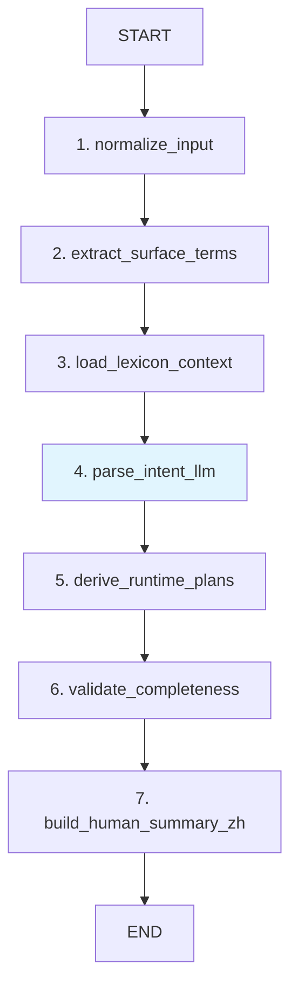
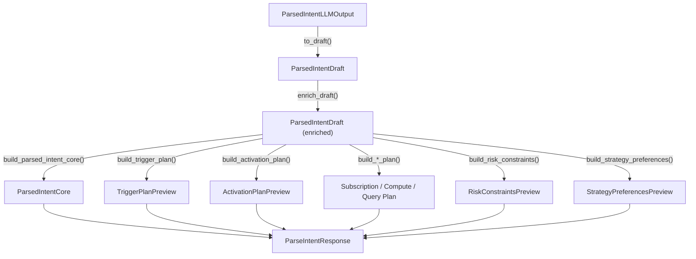

<!-- PAGE_ID: options_03_intake -->
<details>
<summary>Relevant source files</summary>

The following files were used as context for generating this wiki page:

- [intake_graph.py:1-185](https://github.com/ChunmiaoYu/options_ai_trader/blob/f5f3ac84e9c5d963fc1450f12306ea264183dfad/src/options_event_trader/graphs/intake_graph.py#L1-L185)
- [intake_models.py:1-245](https://github.com/ChunmiaoYu/options_ai_trader/blob/f5f3ac84e9c5d963fc1450f12306ea264183dfad/src/options_event_trader/domain/intake_models.py#L1-L245)
- [runtime_planner.py:1-607](https://github.com/ChunmiaoYu/options_ai_trader/blob/f5f3ac84e9c5d963fc1450f12306ea264183dfad/src/options_event_trader/intake/runtime_planner.py#L1-L607)
- [config_loader.py:1-143](https://github.com/ChunmiaoYu/options_ai_trader/blob/f5f3ac84e9c5d963fc1450f12306ea264183dfad/src/options_event_trader/intake/config_loader.py#L1-L143)
- [openai_intake_client.py:1-125](https://github.com/ChunmiaoYu/options_ai_trader/blob/f5f3ac84e9c5d963fc1450f12306ea264183dfad/src/options_event_trader/integrations/openai_intake_client.py#L1-L125)
- [intake_parser_system_prompt.md:1-36](https://github.com/ChunmiaoYu/options_ai_trader/blob/f5f3ac84e9c5d963fc1450f12306ea264183dfad/src/options_event_trader/prompts/intake_parser_system_prompt.md#L1-L36)
- [business_lexicon.yml:1-37](https://github.com/ChunmiaoYu/options_ai_trader/blob/f5f3ac84e9c5d963fc1450f12306ea264183dfad/src/options_event_trader/config/business_lexicon.yml#L1-L37)
- [trigger_catalog.yml:1-77](https://github.com/ChunmiaoYu/options_ai_trader/blob/f5f3ac84e9c5d963fc1450f12306ea264183dfad/src/options_event_trader/config/trigger_catalog.yml#L1-L77)
- [default_policies.yml:1-15](https://github.com/ChunmiaoYu/options_ai_trader/blob/f5f3ac84e9c5d963fc1450f12306ea264183dfad/src/options_event_trader/config/default_policies.yml#L1-L15)
- [enums.py:1-20](https://github.com/ChunmiaoYu/options_ai_trader/blob/f5f3ac84e9c5d963fc1450f12306ea264183dfad/src/options_event_trader/core/enums.py#L1-L20)

</details>

# Agent1：Intake 解析器

> **Related Pages**: [[系统架构|02_architecture.md]], [[Agent2：策略生成器|04_strategy.md]]

Intake 解析器（Agent1）是系统的入口环节，负责将用户的中文自然语言交易意图解析为结构化的声明式数据。它基于 LangGraph 构建了一条 7 节点的有向无环图工作流，将 LLM 语义理解与确定性后处理逻辑分离，确保输出可编译、可审计。

---

<!-- BEGIN:AUTOGEN options_03_intake_workflow -->
## 7 节点 LangGraph 工作流

Intake 工作流通过 `build_intake_graph()` 函数构建，接受一个实现了 `IntentParser` 协议的解析器实例（通常是 `OpenAIIntentParserAdapter`），返回编译后的 LangGraph 状态图 ([intake_graph.py:74-184](https://github.com/ChunmiaoYu/options_ai_trader/blob/f5f3ac84e9c5d963fc1450f12306ea264183dfad/src/options_event_trader/graphs/intake_graph.py#L74-L184))。

### 工作流流程图



### 各节点详解

#### 1. normalize_input - 输入标准化

根据 `input_mode`（TEXT 或 VOICE）选择候选文本，执行 `.strip()` 去除首尾空白。如果输入为空则抛出 `ValueError` ([intake_graph.py:75-84](https://github.com/ChunmiaoYu/options_ai_trader/blob/f5f3ac84e9c5d963fc1450f12306ea264183dfad/src/options_event_trader/graphs/intake_graph.py#L75-L84))。同时调用 `load_runtime_resources()` 加载三份 YAML 配置文件（business_lexicon、trigger_catalog、default_policies），并通过 `@lru_cache` 缓存以避免重复读取 ([config_loader.py:74-80](https://github.com/ChunmiaoYu/options_ai_trader/blob/f5f3ac84e9c5d963fc1450f12306ea264183dfad/src/options_event_trader/intake/config_loader.py#L74-L80))。

| 输入模式 | 候选优先级 |
|----------|-----------|
| TEXT | `raw_input_text` > `transcript_text` |
| VOICE | `transcript_text` > `raw_input_text` |

#### 2. extract_surface_terms - 词典匹配

对标准化后的文本进行商业词典（business_lexicon）的子字符串匹配。匹配逻辑遍历词典中每个词条的 `key` 及其 `aliases`，在小写化后的文本中查找命中项，每个词条最多命中一次 ([config_loader.py:83-108](https://github.com/ChunmiaoYu/options_ai_trader/blob/f5f3ac84e9c5d963fc1450f12306ea264183dfad/src/options_event_trader/intake/config_loader.py#L83-L108))。

命中结果携带 `trigger_family`、`required_fields`、`default_policy`、`trigger_defaults` 等元数据，用于后续节点的默认值注入和缺失字段检查。

#### 3. load_lexicon_context - 构建 Prompt 上下文

将匹配到的词典项、触发器目录（trigger_catalog）和默认策略（default_policies）组装成纯文本的 prompt 上下文，注入到 LLM 调用中 ([config_loader.py:111-142](https://github.com/ChunmiaoYu/options_ai_trader/blob/f5f3ac84e9c5d963fc1450f12306ea264183dfad/src/options_event_trader/intake/config_loader.py#L111-L142))。上下文包含三个部分：

- **支持的 Trigger Catalog**：列出所有触发器类型及其 auto_execute 支持情况和必填字段
- **默认规则**：缺失字段保留 null，不要猜测
- **命中的商业词典**：当前输入匹配到的词条及其默认值

#### 4. parse_intent_llm - LLM 语义解析

调用 OpenAI Structured Outputs API，将用户输入解析为 `ParsedIntentLLMOutput` 结构 ([openai_intake_client.py:38-124](https://github.com/ChunmiaoYu/options_ai_trader/blob/f5f3ac84e9c5d963fc1450f12306ea264183dfad/src/options_event_trader/integrations/openai_intake_client.py#L38-L124))。这是工作流中唯一的 LLM 节点。

调用使用 `responses.parse()` 方法，传入系统提示词（21 条规则）和上一步构建的 prompt 上下文。解析成功后通过 `to_draft()` 方法转换为 `ParsedIntentDraft` ([intake_models.py:75-105](https://github.com/ChunmiaoYu/options_ai_trader/blob/f5f3ac84e9c5d963fc1450f12306ea264183dfad/src/options_event_trader/domain/intake_models.py#L75-L105))。

该节点包含完善的错误处理，针对不同的 OpenAI API 错误类型返回不同的中文错误消息和 HTTP 状态码。

#### 5. derive_runtime_plans - 运行时计划推导

这是工作流中最复杂的确定性处理节点，依次执行以下操作 ([intake_graph.py:104-132](https://github.com/ChunmiaoYu/options_ai_trader/blob/f5f3ac84e9c5d963fc1450f12306ea264183dfad/src/options_event_trader/graphs/intake_graph.py#L104-L132))：

1. **enrich_draft**：标准化 direction、symbol、trigger_family 等字段，注入词典默认值 ([runtime_planner.py:105-181](https://github.com/ChunmiaoYu/options_ai_trader/blob/f5f3ac84e9c5d963fc1450f12306ea264183dfad/src/options_event_trader/intake/runtime_planner.py#L105-L181))
2. **build_trigger_plan**：根据 trigger_family 从 catalog 构建触发计划 ([runtime_planner.py:202-263](https://github.com/ChunmiaoYu/options_ai_trader/blob/f5f3ac84e9c5d963fc1450f12306ea264183dfad/src/options_event_trader/intake/runtime_planner.py#L202-L263))
3. **build_activation_plan**：构建激活/调度计划 ([runtime_planner.py:293-333](https://github.com/ChunmiaoYu/options_ai_trader/blob/f5f3ac84e9c5d963fc1450f12306ea264183dfad/src/options_event_trader/intake/runtime_planner.py#L293-L333))
4. **build_subscription_plan**：构建持续数据订阅计划（用于 MA_CROSSOVER 等） ([runtime_planner.py:336-359](https://github.com/ChunmiaoYu/options_ai_trader/blob/f5f3ac84e9c5d963fc1450f12306ea264183dfad/src/options_event_trader/intake/runtime_planner.py#L336-L359))
5. **build_compute_plan**：构建持续计算计划（均线计算、交叉检测等） ([runtime_planner.py:362-386](https://github.com/ChunmiaoYu/options_ai_trader/blob/f5f3ac84e9c5d963fc1450f12306ea264183dfad/src/options_event_trader/intake/runtime_planner.py#L362-L386))
6. **build_query_plan**：构建分阶段数据查询计划 ([runtime_planner.py:400-428](https://github.com/ChunmiaoYu/options_ai_trader/blob/f5f3ac84e9c5d963fc1450f12306ea264183dfad/src/options_event_trader/intake/runtime_planner.py#L400-L428))
7. **build_risk_constraints** / **build_strategy_preferences**：提取风控约束和策略偏好 ([runtime_planner.py:431-448](https://github.com/ChunmiaoYu/options_ai_trader/blob/f5f3ac84e9c5d963fc1450f12306ea264183dfad/src/options_event_trader/intake/runtime_planner.py#L431-L448))
8. **build_parsed_intent_core**：提取核心意图字段 ([runtime_planner.py:451-462](https://github.com/ChunmiaoYu/options_ai_trader/blob/f5f3ac84e9c5d963fc1450f12306ea264183dfad/src/options_event_trader/intake/runtime_planner.py#L451-L462))

#### 6. validate_completeness - 完整性校验

检查解析结果是否满足提交要求，生成 `missing_fields`、`validation_errors_zh`、`submit_blockers_zh` 三个校验结果列表 ([runtime_planner.py:465-554](https://github.com/ChunmiaoYu/options_ai_trader/blob/f5f3ac84e9c5d963fc1450f12306ea264183dfad/src/options_event_trader/intake/runtime_planner.py#L465-L554))。同时判定 `effective_mode`、`support_level` 和 `can_submit_as_is` 状态。

特殊处理：当 `effective_mode` 为 `ADVICE_ONLY` 时，将 `query_plan.pre_order` 的查询项合并到 `on_activation` 中，因为咨询模式不需要下单前查询阶段 ([intake_graph.py:143-154](https://github.com/ChunmiaoYu/options_ai_trader/blob/f5f3ac84e9c5d963fc1450f12306ea264183dfad/src/options_event_trader/graphs/intake_graph.py#L143-L154))。

#### 7. build_human_summary_zh - 生成人类可读摘要

将所有结构化结果拼装为一段中文摘要，包含标的、触发条件、用户请求模式、有效模式、运行方式、数据查询计划等信息 ([runtime_planner.py:557-606](https://github.com/ChunmiaoYu/options_ai_trader/blob/f5f3ac84e9c5d963fc1450f12306ea264183dfad/src/options_event_trader/intake/runtime_planner.py#L557-L606))。

### 状态容器 IntakeState

工作流使用 `IntakeState`（TypedDict）作为跨节点的状态容器，包含 22 个字段 ([intake_graph.py:46-71](https://github.com/ChunmiaoYu/options_ai_trader/blob/f5f3ac84e9c5d963fc1450f12306ea264183dfad/src/options_event_trader/graphs/intake_graph.py#L46-L71))：

| 字段 | 类型 | 说明 |
|------|------|------|
| `input_mode` | `InputMode` | TEXT 或 VOICE |
| `raw_input_text` | `str \| None` | 原始文本输入 |
| `transcript_text` | `str \| None` | 语音转文字结果 |
| `normalized_text` | `str` | 标准化后的文本 |
| `runtime_resources` | `IntakeRuntimeResources` | 运行时配置资源 |
| `matched_terms` | `list[LexiconMatch]` | 词典匹配结果 |
| `prompt_context` | `str` | 注入 LLM 的上下文 |
| `parsed_draft` | `ParsedIntentDraft` | LLM 解析草稿（经 enrich 后） |
| `parsed_intent` | `ParsedIntentCore` | 核心意图字段 |
| `trigger_plan` | `TriggerPlanPreview` | 触发计划 |
| `activation_plan` | `ActivationPlanPreview` | 激活/调度计划 |
| `subscription_plan` | `list[SubscriptionPlanItem]` | 数据订阅计划 |
| `compute_plan` | `list[ComputePlanItem]` | 持续计算计划 |
| `query_plan` | `QueryPlanPreview` | 分阶段查询计划 |
| `risk_constraints` | `RiskConstraintsPreview` | 风控约束 |
| `strategy_preferences` | `StrategyPreferencesPreview` | 策略偏好 |
| `effective_mode` | `str` | 最终有效模式 |
| `can_submit_as_is` | `bool` | 是否可直接提交 |
| `submit_blockers_zh` | `list[str]` | 提交阻断原因 |
| `human_summary_zh` | `str` | 中文摘要 |

Sources: [intake_graph.py:46-184](https://github.com/ChunmiaoYu/options_ai_trader/blob/f5f3ac84e9c5d963fc1450f12306ea264183dfad/src/options_event_trader/graphs/intake_graph.py#L46-L184), [config_loader.py:60-142](https://github.com/ChunmiaoYu/options_ai_trader/blob/f5f3ac84e9c5d963fc1450f12306ea264183dfad/src/options_event_trader/intake/config_loader.py#L60-L142), [runtime_planner.py:1-606](https://github.com/ChunmiaoYu/options_ai_trader/blob/f5f3ac84e9c5d963fc1450f12306ea264183dfad/src/options_event_trader/intake/runtime_planner.py#L1-L606)
<!-- END:AUTOGEN options_03_intake_workflow -->

---

<!-- BEGIN:AUTOGEN options_03_intake_schema -->
## ParsedIntentLLMOutput（26 字段）

`ParsedIntentLLMOutput` 是 OpenAI Structured Outputs 的目标 schema，定义了 LLM 必须返回的所有字段。模型配置为 `extra="forbid"`，禁止返回 schema 之外的字段 ([intake_models.py:37-105](https://github.com/ChunmiaoYu/options_ai_trader/blob/f5f3ac84e9c5d963fc1450f12306ea264183dfad/src/options_event_trader/domain/intake_models.py#L37-L105))。

### Schema 字段清单

| 字段名 | 类型 | 可空 | 说明 |
|--------|------|------|------|
| `title` | `str` | 否 | 机会单标题 |
| `symbol` | `str` | 是 | 交易标的代码（如 NVDA、TSLA） |
| `requested_mode` | `OpportunityMode` | 否 | ADVICE_ONLY 或 AUTO_EXECUTE |
| `direction` | `str` | 是 | 只允许 BULLISH 或 BEARISH |
| `intent_type` | `str` | 否 | 固定为 TRADE_OPPORTUNITY |
| `trigger_family` | `str` | 是 | 触发器类型：ENTRY_TIME / ENTRY_WINDOW / MA_CROSSOVER |
| `entry_at_zh` | `str` | 是 | 时间点表达（如"明天两点"） |
| `window_start_zh` | `str` | 是 | 时间窗口开始 |
| `window_end_zh` | `str` | 是 | 时间窗口结束 |
| `fast_period` | `int` | 是 | 短周期均线周期 |
| `slow_period` | `int` | 是 | 长周期均线周期 |
| `bar_interval` | `str` | 是 | K 线周期（如"1d"） |
| `price_field` | `str` | 是 | 价格字段（如"close"） |
| `crossover_direction` | `str` | 是 | 交叉方向（CROSS_UP / CROSS_DOWN） |
| `once_only` | `bool` | 是 | 是否仅触发一次 |
| `max_risk_dollars` | `float` | 是 | 最大风险金额（美元） |
| `target_quantity` | `int` | 是 | 目标合约数量 |
| `partial_fill_policy` | `str` | 是 | 部分成交策略 |
| `preferred_strategies` | `list[str]` | 否 | 偏好的策略列表 |
| `disallowed_strategies` | `list[str]` | 否 | 排除的策略列表 |
| `instrument_scope` | `str` | 是 | OPTION_STRATEGY / STOCK_TRADE / UNSPECIFIED |
| `risk_style` | `str` | 是 | CONSERVATIVE / BALANCED / AGGRESSIVE |
| `suitability_gate` | `bool` | 是 | 是否有适合性前提条件 |
| `event_window_start_zh` | `str` | 是 | 事件窗口开始（背景信息，非触发条件） |
| `event_window_end_zh` | `str` | 是 | 事件窗口结束 |
| `max_position_pct` | `float` | 是 | 最大仓位占比百分比 |
| `user_thesis_zh` | `str` | 是 | 用户预判/论点原文 |
| `take_profit_rule_zh` | `str` | 是 | 止盈条件原文 |

### Schema 转换链

LLM 输出经过以下转换链到达最终的响应结构：



### ParsedIntentDraft vs ParsedIntentCore

- **ParsedIntentDraft**：包含所有 26+ 个字段的完整草稿，用于运行时计划推导的内部工作对象 ([intake_models.py:108-136](https://github.com/ChunmiaoYu/options_ai_trader/blob/f5f3ac84e9c5d963fc1450f12306ea264183dfad/src/options_event_trader/domain/intake_models.py#L108-L136))
- **ParsedIntentCore**：仅包含 9 个核心字段的精简视图，用于对外输出和存储 ([intake_models.py:139-149](https://github.com/ChunmiaoYu/options_ai_trader/blob/f5f3ac84e9c5d963fc1450f12306ea264183dfad/src/options_event_trader/domain/intake_models.py#L139-L149))

### 运行时计划输出模型

| 模型 | 用途 | 关键字段 |
|------|------|----------|
| `TriggerPlanPreview` | 触发条件编译结果 | trigger_family, runtime_type, normalization_status, trigger_spec ([intake_models.py:151-159](https://github.com/ChunmiaoYu/options_ai_trader/blob/f5f3ac84e9c5d963fc1450f12306ea264183dfad/src/options_event_trader/domain/intake_models.py#L151-L159)) |
| `ActivationPlanPreview` | 激活/调度计划 | activation_type, needs_scheduler, session_anchor ([intake_models.py:162-176](https://github.com/ChunmiaoYu/options_ai_trader/blob/f5f3ac84e9c5d963fc1450f12306ea264183dfad/src/options_event_trader/domain/intake_models.py#L162-L176)) |
| `SubscriptionPlanItem` | 持续数据订阅 | subscription_type, interval, start_policy ([intake_models.py:178-185](https://github.com/ChunmiaoYu/options_ai_trader/blob/f5f3ac84e9c5d963fc1450f12306ea264183dfad/src/options_event_trader/domain/intake_models.py#L178-L185)) |
| `ComputePlanItem` | 持续计算任务 | compute_type, source, period, direction ([intake_models.py:187-196](https://github.com/ChunmiaoYu/options_ai_trader/blob/f5f3ac84e9c5d963fc1450f12306ea264183dfad/src/options_event_trader/domain/intake_models.py#L187-L196)) |
| `QueryPlanPreview` | 分阶段查询 | on_activation, on_trigger, pre_order, post_fill ([intake_models.py:198-203](https://github.com/ChunmiaoYu/options_ai_trader/blob/f5f3ac84e9c5d963fc1450f12306ea264183dfad/src/options_event_trader/domain/intake_models.py#L198-L203)) |
| `RiskConstraintsPreview` | 风控约束 | max_risk_dollars, max_position_pct, take_profit_rule_zh ([intake_models.py:205-210](https://github.com/ChunmiaoYu/options_ai_trader/blob/f5f3ac84e9c5d963fc1450f12306ea264183dfad/src/options_event_trader/domain/intake_models.py#L205-L210)) |
| `StrategyPreferencesPreview` | 策略偏好 | preferred_strategies, risk_style, suitability_gate ([intake_models.py:212-218](https://github.com/ChunmiaoYu/options_ai_trader/blob/f5f3ac84e9c5d963fc1450f12306ea264183dfad/src/options_event_trader/domain/intake_models.py#L212-L218)) |

Sources: [intake_models.py:37-245](https://github.com/ChunmiaoYu/options_ai_trader/blob/f5f3ac84e9c5d963fc1450f12306ea264183dfad/src/options_event_trader/domain/intake_models.py#L37-L245), [runtime_planner.py:431-462](https://github.com/ChunmiaoYu/options_ai_trader/blob/f5f3ac84e9c5d963fc1450f12306ea264183dfad/src/options_event_trader/intake/runtime_planner.py#L431-L462)
<!-- END:AUTOGEN options_03_intake_schema -->

---

<!-- BEGIN:AUTOGEN options_03_intake_business-rules -->
## 业务规则与兜底逻辑

Intake 解析器通过多层兜底机制来应对 LLM 输出的不稳定性。核心思路是：LLM 只负责语义理解与字段提取，所有标准化、校验、默认值注入都由确定性代码完成。

### enrich_draft：标准化与默认值注入

`enrich_draft()` 是后处理的核心函数，对 LLM 输出进行以下标准化操作 ([runtime_planner.py:105-181](https://github.com/ChunmiaoYu/options_ai_trader/blob/f5f3ac84e9c5d963fc1450f12306ea264183dfad/src/options_event_trader/intake/runtime_planner.py#L105-L181))：

**字段标准化**：
- `symbol`：大写化并去除空白 ([runtime_planner.py:62-67](https://github.com/ChunmiaoYu/options_ai_trader/blob/f5f3ac84e9c5d963fc1450f12306ea264183dfad/src/options_event_trader/intake/runtime_planner.py#L62-L67))
- `direction`：将 CALL/PUT/看涨/看跌/做多/做空 统一映射为 BULLISH/BEARISH ([runtime_planner.py:21-32](https://github.com/ChunmiaoYu/options_ai_trader/blob/f5f3ac84e9c5d963fc1450f12306ea264183dfad/src/options_event_trader/intake/runtime_planner.py#L21-L32))
- `trigger_family`、`instrument_scope`、`risk_style`：大写化
- `preferred_strategies` / `disallowed_strategies`：去重去空

**词典默认值注入**：遍历 `matched_terms`，按照 `default_policy` 策略注入默认值 ([runtime_planner.py:121-160](https://github.com/ChunmiaoYu/options_ai_trader/blob/f5f3ac84e9c5d963fc1450f12306ea264183dfad/src/options_event_trader/intake/runtime_planner.py#L121-L160))：

| 策略 | 行为 |
|------|------|
| `USE_TRIGGER_DEFAULTS` | 仅在字段为空时注入默认值 |
| `REQUIRE_CLARIFICATION` | 强制覆盖默认值，并清空 LLM 混淆填充的值 |

**MA_CROSSOVER 特殊处理**：当 trigger_family 为 MA_CROSSOVER 时，从 default_policies.yml 补充 `bar_interval`（默认 "1d"）、`price_field`（默认 "close"）、`crossover_direction`（根据 direction 选择 CROSS_UP 或 CROSS_DOWN）、`once_only`（默认 true） ([runtime_planner.py:161-173](https://github.com/ChunmiaoYu/options_ai_trader/blob/f5f3ac84e9c5d963fc1450f12306ea264183dfad/src/options_event_trader/intake/runtime_planner.py#L161-L173))。

**ENTRY_WINDOW 特殊处理**：当有 `window_end_zh` 但无 `window_start_zh` 时，自动补充 `window_start_zh = "现在"` ([runtime_planner.py:177-178](https://github.com/ChunmiaoYu/options_ai_trader/blob/f5f3ac84e9c5d963fc1450f12306ea264183dfad/src/options_event_trader/intake/runtime_planner.py#L177-L178))。

**标题兜底**：如果 LLM 输出的 title 为空或是 schema 类名（如 "ParsedIntentLLMOutput"），则自动生成标题 ([runtime_planner.py:95-103](https://github.com/ChunmiaoYu/options_ai_trader/blob/f5f3ac84e9c5d963fc1450f12306ea264183dfad/src/options_event_trader/intake/runtime_planner.py#L95-L103))。

### suitability_gate 判定规则

`suitability_gate` 只有在用户原文中包含特定的前提条件短语时才为 true ([runtime_planner.py:83-93](https://github.com/ChunmiaoYu/options_ai_trader/blob/f5f3ac84e9c5d963fc1450f12306ea264183dfad/src/options_event_trader/intake/runtime_planner.py#L83-L93))：

```python
_SUITABILITY_PHRASES = (
    "如果适合", "适合的话", "条件合适",
    "如果行情合适", "如果条件允许", "要是划算", "条件允许的话"
)
```

关键逻辑：如果 LLM 将 `suitability_gate` 设为 true，但用户原文中没有上述短语，则确定性代码会将其重置为 false。这防止了 LLM 将风格偏好（如"偏保守"）误判为前提条件。

### validate_runtime_plan：完整性校验

校验函数检查以下条件，生成三种类型的校验结果 ([runtime_planner.py:465-554](https://github.com/ChunmiaoYu/options_ai_trader/blob/f5f3ac84e9c5d963fc1450f12306ea264183dfad/src/options_event_trader/intake/runtime_planner.py#L465-L554))：

**缺失字段检查**：
- `symbol` 缺失 → 添加到 missing_fields 和 validation_errors_zh
- `trigger_family` 缺失 → 检测文本中是否有时间相关关键词（"之前"、"开盘"、"明天"等），给出更精确的提示
- 触发器必填字段缺失（如 MA_CROSSOVER 的 slow_period）→ 生成具体的中文错误提示

**submit_blockers_zh（硬阻断）**：

| 阻断条件 | 触发时机 |
|----------|----------|
| 时间表达改写检测 | ENTRY_TIME 类型时，LLM 输出的 `entry_at_zh` 不是用户原文的子字符串 ([runtime_planner.py:511-515](https://github.com/ChunmiaoYu/options_ai_trader/blob/f5f3ac84e9c5d963fc1450f12306ea264183dfad/src/options_event_trader/intake/runtime_planner.py#L511-L515)) |
| 适合性前提条件 | `suitability_gate` 为 true 时，要求用户补充具体标准 ([runtime_planner.py:517-520](https://github.com/ChunmiaoYu/options_ai_trader/blob/f5f3ac84e9c5d963fc1450f12306ea264183dfad/src/options_event_trader/intake/runtime_planner.py#L517-L520)) |

**support_level 判定**：

| 条件 | support_level |
|------|---------------|
| 有 validation_errors | UNSUPPORTED |
| AUTO_EXECUTE 且支持 | SUPPORTED_AUTO |
| 其他情况 | SUPPORTED_ADVICE_ONLY |

**can_submit_as_is 逻辑**：当且仅当 `validation_errors_zh` 和 `submit_blockers_zh` 都为空时才为 true ([runtime_planner.py:529](https://github.com/ChunmiaoYu/options_ai_trader/blob/f5f3ac84e9c5d963fc1450f12306ea264183dfad/src/options_event_trader/intake/runtime_planner.py#L529))。这是一个关键不变量：`can_submit_as_is=False` 时 `submit_blockers_zh` 必不为空。

**AUTO_EXECUTE 降级策略**：当触发类型不支持 auto_execute 时（如 MA_CROSSOVER），不降级 `effective_mode`，而是添加 warning 提示用户"功能就绪时自动启用" ([runtime_planner.py:507-509](https://github.com/ChunmiaoYu/options_ai_trader/blob/f5f3ac84e9c5d963fc1450f12306ea264183dfad/src/options_event_trader/intake/runtime_planner.py#L507-L509))。

### 触发器类型与运行时映射

系统当前支持三种触发器类型，每种对应不同的运行时行为 ([trigger_catalog.yml:1-77](https://github.com/ChunmiaoYu/options_ai_trader/blob/f5f3ac84e9c5d963fc1450f12306ea264183dfad/src/options_event_trader/config/trigger_catalog.yml#L1-L77))：

| 触发器 | 运行时类型 | 支持自动执行 | 激活方式 | 必填字段 |
|--------|-----------|-------------|----------|----------|
| ENTRY_TIME | SCHEDULED_TIME | 是 | 按时间调度（一次性） | entry_at_zh |
| ENTRY_WINDOW | MARKET_SESSION_WINDOW | 是 | 按市场时间窗口调度 | window_end_zh |
| MA_CROSSOVER | CONDITION_MONITOR | 否 | 立即启动持续监控 | fast_period, slow_period, bar_interval, direction |

### 商业词典（business_lexicon.yml）

当前词典包含 4 个词条 ([business_lexicon.yml:1-37](https://github.com/ChunmiaoYu/options_ai_trader/blob/f5f3ac84e9c5d963fc1450f12306ea264183dfad/src/options_event_trader/config/business_lexicon.yml#L1-L37))：

| 词条 | 别名 | 触发器 | 策略 | 默认值 |
|------|------|--------|------|--------|
| 5日金叉 | 五日金叉、MA5金叉 | MA_CROSSOVER | REQUIRE_CLARIFICATION | fast_period=5 |
| 金叉 | - | MA_CROSSOVER | REQUIRE_CLARIFICATION | 无（要求补充 fast/slow_period） |
| 5上穿20 | 5日线上穿20日线、MA5上穿MA20 等 | MA_CROSSOVER | USE_TRIGGER_DEFAULTS | fast=5, slow=20, interval=1d, field=close, dir=CROSS_UP |
| 开盘后半小时 | 开盘30分钟内、开盘半小时内 | ENTRY_WINDOW | USE_TRIGGER_DEFAULTS | session_anchor=MARKET_OPEN, start=0, end=30min |

### LLM 系统提示词核心规则

系统提示词包含 21 条严格规则，用于约束 LLM 输出行为 ([intake_parser_system_prompt.md:1-36](https://github.com/ChunmiaoYu/options_ai_trader/blob/f5f3ac84e9c5d963fc1450f12306ea264183dfad/src/options_event_trader/prompts/intake_parser_system_prompt.md#L1-L36))。以下是核心约束：

1. **只负责语义理解与字段提取**，不输出 API 指令或编排 workflow
2. **缺少关键字段时保留 null**，不要猜测
3. **direction 只允许 BULLISH 或 BEARISH**，不允许 CALL/PUT/看涨/看跌
4. **不要改写用户的时间表达**，保留原文由后续校验处理
5. **event_window 不等于 entry_window**，事件窗口是背景信息，不是触发条件
6. **时间默认美东（ET）**，除非用户明确指定其他时区

Sources: [runtime_planner.py:21-181](https://github.com/ChunmiaoYu/options_ai_trader/blob/f5f3ac84e9c5d963fc1450f12306ea264183dfad/src/options_event_trader/intake/runtime_planner.py#L21-L181), [runtime_planner.py:465-554](https://github.com/ChunmiaoYu/options_ai_trader/blob/f5f3ac84e9c5d963fc1450f12306ea264183dfad/src/options_event_trader/intake/runtime_planner.py#L465-L554), [intake_parser_system_prompt.md:1-36](https://github.com/ChunmiaoYu/options_ai_trader/blob/f5f3ac84e9c5d963fc1450f12306ea264183dfad/src/options_event_trader/prompts/intake_parser_system_prompt.md#L1-L36), [business_lexicon.yml:1-37](https://github.com/ChunmiaoYu/options_ai_trader/blob/f5f3ac84e9c5d963fc1450f12306ea264183dfad/src/options_event_trader/config/business_lexicon.yml#L1-L37), [trigger_catalog.yml:1-77](https://github.com/ChunmiaoYu/options_ai_trader/blob/f5f3ac84e9c5d963fc1450f12306ea264183dfad/src/options_event_trader/config/trigger_catalog.yml#L1-L77)
<!-- END:AUTOGEN options_03_intake_business-rules -->

---
