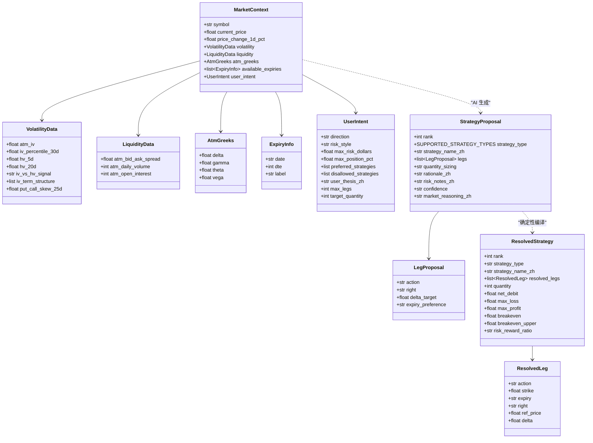
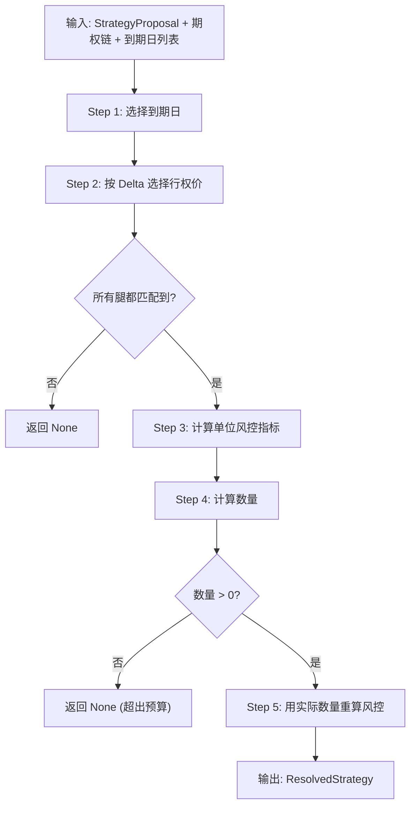

<!-- PAGE_ID: options_04_strategy -->
<details>
<summary>📚 Relevant source files</summary>

The following files were used as context for generating this wiki page:

- [strategy_models.py:1-137](https://github.com/ChunmiaoYu/options_ai_trader/blob/f5f3ac84e9c5d963fc1450f12306ea264183dfad/src/options_event_trader/domain/strategy_models.py#L1-L137)
- [strategy_agent.py:1-55](https://github.com/ChunmiaoYu/options_ai_trader/blob/f5f3ac84e9c5d963fc1450f12306ea264183dfad/src/options_event_trader/agents/strategy_agent.py#L1-L55)
- [strategy_resolver.py:1-234](https://github.com/ChunmiaoYu/options_ai_trader/blob/f5f3ac84e9c5d963fc1450f12306ea264183dfad/src/options_event_trader/services/strategy_resolver.py#L1-L234)
- [risk_gate.py:1-48](https://github.com/ChunmiaoYu/options_ai_trader/blob/f5f3ac84e9c5d963fc1450f12306ea264183dfad/src/options_event_trader/services/risk_gate.py#L1-L48)
- [strategy_generator_system_prompt.md:1-46](https://github.com/ChunmiaoYu/options_ai_trader/blob/f5f3ac84e9c5d963fc1450f12306ea264183dfad/src/options_event_trader/prompts/strategy_generator_system_prompt.md#L1-L46)

</details>

# Agent2：策略生成器

> **Related Pages**: [[Agent1：Intake 解析器|03_intake.md]], [[执行层：下单与市场数据|05_execution.md]]

Agent2 是系统的第二个 AI 代理节点，负责根据市场数据和用户交易意图生成可执行的期权策略。其设计遵循 **"AI 定性 + 代码定量"** 的职责分离原则：AI（OpenAI）输出定性的策略方案（不含具体行权价和数量），确定性代码将方案编译为带精确行权价、数量和风控指标的可执行订单。

---

<!-- BEGIN:AUTOGEN options_04_strategy_models -->
## 策略领域模型

策略领域模型分为三个层级，体现了从 AI 输入到可执行输出的递进关系 ([strategy_models.py:1-7](https://github.com/ChunmiaoYu/options_ai_trader/blob/f5f3ac84e9c5d963fc1450f12306ea264183dfad/src/options_event_trader/domain/strategy_models.py#L1-L7))：

1. **输入层 (MarketContext)**：AI 看到的市场快照
2. **AI 输出层 (StrategyProposal)**：定性方案，不含行权价/数量
3. **编译输出层 (ResolvedStrategy)**：可执行策略，含行权价/数量/风控数学



### 支持的策略类型

系统支持 10 种期权策略，通过 `SUPPORTED_STRATEGY_TYPES` 类型约束定义 ([strategy_models.py:14-18](https://github.com/ChunmiaoYu/options_ai_trader/blob/f5f3ac84e9c5d963fc1450f12306ea264183dfad/src/options_event_trader/domain/strategy_models.py#L14-L18))：

| 类别 | 策略类型 | 说明 |
|------|---------|------|
| 单腿 | `LONG_CALL` | 买入看涨期权 |
| 单腿 | `LONG_PUT` | 买入看跌期权 |
| 牛市价差 | `BULL_CALL_SPREAD` | 牛市看涨价差 |
| 熊市价差 | `BEAR_PUT_SPREAD` | 熊市看跌价差 |
| 牛市信用价差 | `BULL_PUT_SPREAD` | 牛市看跌信用价差 |
| 熊市信用价差 | `BEAR_CALL_SPREAD` | 熊市看涨信用价差 |
| 波动率策略 | `LONG_STRADDLE` | 买入跨式 |
| 波动率策略 | `LONG_STRANGLE` | 买入宽跨式 |
| 区间策略 | `IRON_CONDOR` | 铁鹰组合 |
| 区间策略 | `BUTTERFLY` | 蝶式组合 |

### MarketContext 输入结构

`MarketContext` 是 Agent2 的输入，包含五大类数据 ([strategy_models.py:66-77](https://github.com/ChunmiaoYu/options_ai_trader/blob/f5f3ac84e9c5d963fc1450f12306ea264183dfad/src/options_event_trader/domain/strategy_models.py#L66-L77))：

| 数据分类 | 子模型 | 关键字段 |
|---------|--------|---------|
| 波动率环境 | `VolatilityData` | ATM IV、IV 分位数、历史波动率、IV 期限结构、偏斜度 ([strategy_models.py:24-31](https://github.com/ChunmiaoYu/options_ai_trader/blob/f5f3ac84e9c5d963fc1450f12306ea264183dfad/src/options_event_trader/domain/strategy_models.py#L24-L31)) |
| 流动性 | `LiquidityData` | bid-ask spread、日成交量、未平仓合约数 ([strategy_models.py:34-37](https://github.com/ChunmiaoYu/options_ai_trader/blob/f5f3ac84e9c5d963fc1450f12306ea264183dfad/src/options_event_trader/domain/strategy_models.py#L34-L37)) |
| ATM Greeks | `AtmGreeks` | delta、gamma、theta、vega ([strategy_models.py:40-44](https://github.com/ChunmiaoYu/options_ai_trader/blob/f5f3ac84e9c5d963fc1450f12306ea264183dfad/src/options_event_trader/domain/strategy_models.py#L40-L44)) |
| 到期日 | `ExpiryInfo` | 日期、DTE（到期天数）、标签 ([strategy_models.py:47-50](https://github.com/ChunmiaoYu/options_ai_trader/blob/f5f3ac84e9c5d963fc1450f12306ea264183dfad/src/options_event_trader/domain/strategy_models.py#L47-L50)) |
| 用户意图 | `UserIntent` | 方向、风格、最大亏损、禁止策略、事件窗口 ([strategy_models.py:53-63](https://github.com/ChunmiaoYu/options_ai_trader/blob/f5f3ac84e9c5d963fc1450f12306ea264183dfad/src/options_event_trader/domain/strategy_models.py#L53-L63)) |

### AI 输出 vs 编译输出

这是 Agent2 设计的核心原则 —— **AI 不决定精确参数**：

| 字段 | AI 输出 (StrategyProposal) | 编译输出 (ResolvedStrategy) |
|------|---------------------------|---------------------------|
| 行权价 | `delta_target`（如 0.3） | `strike`（如 540.0） |
| 到期日 | `expiry_preference`（如 `dte_7_to_15`） | `expiry`（如 `2026-04-25`） |
| 数量 | `quantity_sizing`（MAX_RISK / FIXED） | `quantity`（如 3） |
| 价格 | 无 | `ref_price`（实时 bid/ask） |
| 风控指标 | 无 | `max_loss`、`max_profit`、`breakeven` |

`LegProposal` 和 `ResolvedLeg` 的区别体现了这个原则：`LegProposal` 使用 `delta_target` 和 `expiry_preference` 描述定性意图 ([strategy_models.py:83-88](https://github.com/ChunmiaoYu/options_ai_trader/blob/f5f3ac84e9c5d963fc1450f12306ea264183dfad/src/options_event_trader/domain/strategy_models.py#L83-L88))，`ResolvedLeg` 则包含精确的 `strike`、`expiry`、`ref_price` 和 `delta` ([strategy_models.py:113-119](https://github.com/ChunmiaoYu/options_ai_trader/blob/f5f3ac84e9c5d963fc1450f12306ea264183dfad/src/options_event_trader/domain/strategy_models.py#L113-L119))。

Sources: [strategy_models.py:1-137](https://github.com/ChunmiaoYu/options_ai_trader/blob/f5f3ac84e9c5d963fc1450f12306ea264183dfad/src/options_event_trader/domain/strategy_models.py#L1-L137)
<!-- END:AUTOGEN options_04_strategy_models -->

---

<!-- BEGIN:AUTOGEN options_04_strategy_agent -->
## StrategyAgent（OpenAI 调用）

`StrategyAgent` 是对 OpenAI API 的封装，负责将 `MarketContext` 发送给 LLM 并返回结构化的 `StrategyProposalResponse` ([strategy_agent.py:20-54](https://github.com/ChunmiaoYu/options_ai_trader/blob/f5f3ac84e9c5d963fc1450f12306ea264183dfad/src/options_event_trader/agents/strategy_agent.py#L20-L54))。

### 调用流程

1. **加载系统 prompt**：从 `prompts/strategy_generator_system_prompt.md` 懒加载，首次调用后缓存 ([strategy_agent.py:25-28](https://github.com/ChunmiaoYu/options_ai_trader/blob/f5f3ac84e9c5d963fc1450f12306ea264183dfad/src/options_event_trader/agents/strategy_agent.py#L25-L28))
2. **序列化输入**：将 `MarketContext` 转为 JSON 字符串作为 `input` 参数 ([strategy_agent.py:40](https://github.com/ChunmiaoYu/options_ai_trader/blob/f5f3ac84e9c5d963fc1450f12306ea264183dfad/src/options_event_trader/agents/strategy_agent.py#L40))
3. **调用 OpenAI Responses API**：使用 `client.responses.parse()` 并通过 `text_format=StrategyProposalResponse` 保证输出符合 Pydantic schema ([strategy_agent.py:43-49](https://github.com/ChunmiaoYu/options_ai_trader/blob/f5f3ac84e9c5d963fc1450f12306ea264183dfad/src/options_event_trader/agents/strategy_agent.py#L43-L49))
4. **返回解析结果**：包含 2-3 个按推荐度排序的 `StrategyProposal`

### 系统 Prompt 设计

系统 prompt 定义了 Agent2 的行为边界 ([strategy_generator_system_prompt.md:1-46](https://github.com/ChunmiaoYu/options_ai_trader/blob/f5f3ac84e9c5d963fc1450f12306ea264183dfad/src/options_event_trader/prompts/strategy_generator_system_prompt.md#L1-L46))：

**AI 必须输出的内容**：
- `strategy_type`：从 10 种策略中选择
- `strategy_name_zh`：中文名称
- `legs`：每条腿的 action、right、delta_target、expiry_preference
- `rationale_zh`：推荐理由（结合市场数据）
- `risk_notes_zh`：风险提示
- `confidence`：HIGH / MEDIUM / LOW
- `market_reasoning_zh`：市场环境分析

**AI 明确不输出的内容**：
- 不输出具体行权价（由服务器按 delta_target 选择）
- 不输出具体数量（由服务器按 max_risk 计算）
- 不输出具体限价（由服务器用实时 bid/ask 计算）

### 关键规则

Prompt 中定义了 9 条规则来约束 AI 的行为 ([strategy_generator_system_prompt.md:36-46](https://github.com/ChunmiaoYu/options_ai_trader/blob/f5f3ac84e9c5d963fc1450f12306ea264183dfad/src/options_event_trader/prompts/strategy_generator_system_prompt.md#L36-L46))：

| 规则 | 说明 |
|------|------|
| 排序 | `rank=1` 是最推荐的方案 |
| 禁止策略 | 用户指定 `disallowed_strategies` 后不可推荐 |
| 保守风格 | `risk_style=CONSERVATIVE` 时优先有限风险策略（价差 > 裸买） |
| 激进风格 | `risk_style=AGGRESSIVE` 时可推荐高杠杆策略 |
| 高 IV 环境 | `iv_percentile > 70` 时提示买方成本高，考虑卖方或价差 |
| 低 IV 环境 | `iv_percentile < 30` 时买方策略性价比更高 |
| 到期日偏好 | 使用 `dte_3_to_7`、`dte_7_to_15`、`dte_15_plus`、`same_as_leg_1` |
| Delta 约定 | `delta_target` 表示绝对值，put 的 0.3 表示实际 -0.3 |
| 语言 | 所有面向用户的文字使用中文 |

### Structured Outputs 保障

使用 OpenAI Structured Outputs 功能，通过 `text_format=StrategyProposalResponse` 参数，保证 AI 返回的 JSON **100% 符合** Pydantic schema ([strategy_agent.py:48](https://github.com/ChunmiaoYu/options_ai_trader/blob/f5f3ac84e9c5d963fc1450f12306ea264183dfad/src/options_event_trader/agents/strategy_agent.py#L48))。`StrategyProposalResponse` 和其嵌套的 `StrategyProposal`、`LegProposal` 均设置了 `extra="forbid"` ([strategy_models.py:84](https://github.com/ChunmiaoYu/options_ai_trader/blob/f5f3ac84e9c5d963fc1450f12306ea264183dfad/src/options_event_trader/domain/strategy_models.py#L84))，确保不会出现意外字段。`store=False` 表示不将对话存储到 OpenAI 后台 ([strategy_agent.py:49](https://github.com/ChunmiaoYu/options_ai_trader/blob/f5f3ac84e9c5d963fc1450f12306ea264183dfad/src/options_event_trader/agents/strategy_agent.py#L49))。

Sources: [strategy_agent.py:1-55](https://github.com/ChunmiaoYu/options_ai_trader/blob/f5f3ac84e9c5d963fc1450f12306ea264183dfad/src/options_event_trader/agents/strategy_agent.py#L1-L55), [strategy_generator_system_prompt.md:1-46](https://github.com/ChunmiaoYu/options_ai_trader/blob/f5f3ac84e9c5d963fc1450f12306ea264183dfad/src/options_event_trader/prompts/strategy_generator_system_prompt.md#L1-L46)
<!-- END:AUTOGEN options_04_strategy_agent -->

---

<!-- BEGIN:AUTOGEN options_04_strategy_resolver -->
## 策略编译器（确定性代码）

策略编译器 (`strategy_resolver.py`) 是纯确定性代码，**不调用任何 AI/LLM**。它将 AI 生成的定性方案编译为可直接下单的精确策略 ([strategy_resolver.py:1-5](https://github.com/ChunmiaoYu/options_ai_trader/blob/f5f3ac84e9c5d963fc1450f12306ea264183dfad/src/options_event_trader/services/strategy_resolver.py#L1-L5))。

### 编译流程



### Step 1：选择到期日 (select_expiry)

根据 AI 的 `expiry_preference` 在可用到期日中选择最佳匹配 ([strategy_resolver.py:14-32](https://github.com/ChunmiaoYu/options_ai_trader/blob/f5f3ac84e9c5d963fc1450f12306ea264183dfad/src/options_event_trader/services/strategy_resolver.py#L14-L32))：

| 偏好标识 | DTE 范围 | 选择逻辑 |
|---------|---------|---------|
| `dte_3_to_7` | 3-7 天 | 范围内最近的 |
| `dte_7_to_15` | 7-15 天 | 范围内最近的 |
| `dte_15_plus` | 15+ 天 | 范围内最近的 |
| `same_as_leg_1` | — | 复用第一条腿的到期日 |

当目标范围内无可用到期日时，**回退逻辑**选择距离目标范围中点最近的到期日 ([strategy_resolver.py:31-32](https://github.com/ChunmiaoYu/options_ai_trader/blob/f5f3ac84e9c5d963fc1450f12306ea264183dfad/src/options_event_trader/services/strategy_resolver.py#L31-L32))。

### Step 2：按 Delta 选择行权价 (select_strike_by_delta)

在期权链中查找 delta 绝对值最接近 `delta_target` 的合约 ([strategy_resolver.py:35-42](https://github.com/ChunmiaoYu/options_ai_trader/blob/f5f3ac84e9c5d963fc1450f12306ea264183dfad/src/options_event_trader/services/strategy_resolver.py#L35-L42))。筛选条件为 `right`（C/P）和 `expiry` 匹配。

当指定到期日无匹配合约时，会遍历期权链中所有到期日作为回退 ([strategy_resolver.py:186-192](https://github.com/ChunmiaoYu/options_ai_trader/blob/f5f3ac84e9c5d963fc1450f12306ea264183dfad/src/options_event_trader/services/strategy_resolver.py#L186-L192))。参考价格的选择依据方向确定：`BUY` 使用 `ask`，`SELL` 使用 `bid` ([strategy_resolver.py:195](https://github.com/ChunmiaoYu/options_ai_trader/blob/f5f3ac84e9c5d963fc1450f12306ea264183dfad/src/options_event_trader/services/strategy_resolver.py#L195))。

### Step 3：计算风控指标 (calculate_risk_metrics)

先以 `quantity=1` 计算单位风控指标 ([strategy_resolver.py:201-207](https://github.com/ChunmiaoYu/options_ai_trader/blob/f5f3ac84e9c5d963fc1450f12306ea264183dfad/src/options_event_trader/services/strategy_resolver.py#L201-L207))，各策略类型的计算逻辑如下 ([strategy_resolver.py:63-161](https://github.com/ChunmiaoYu/options_ai_trader/blob/f5f3ac84e9c5d963fc1450f12306ea264183dfad/src/options_event_trader/services/strategy_resolver.py#L63-L161))：

| 策略类型 | max_loss 计算 | max_profit 计算 | breakeven |
|---------|-------------|----------------|-----------|
| `LONG_CALL` / `LONG_PUT` | net_debit x 100 x qty | 无限 | strike +/- net_debit |
| `BULL_CALL_SPREAD` / `BEAR_PUT_SPREAD` | net_debit x 100 x qty | (spread_width - net_debit) x 100 x qty | buy_strike +/- net_debit |
| `BULL_PUT_SPREAD` / `BEAR_CALL_SPREAD` | (spread_width - net_credit) x 100 x qty | net_credit x 100 x qty | sell_strike +/- net_credit |
| `LONG_STRADDLE` / `LONG_STRANGLE` | net_debit x 100 x qty | 无限 | 下方 / 上方各一个 |
| `IRON_CONDOR` | (wing_width - net_credit) x 100 x qty | net_credit x 100 x qty | 下方 / 上方各一个 |
| `BUTTERFLY` | net_debit x 100 x qty | (wing_width - net_debit) x 100 x qty | 下方 / 上方各一个 |

注：乘数固定为 100（标准美股期权合约）。无限利润在返回值中用 `-1` 表示 ([strategy_resolver.py:157](https://github.com/ChunmiaoYu/options_ai_trader/blob/f5f3ac84e9c5d963fc1450f12306ea264183dfad/src/options_event_trader/services/strategy_resolver.py#L157))。

### Step 4：计算数量 (calculate_quantity)

根据 AI 指定的 `quantity_sizing` 模式计算合约数量 ([strategy_resolver.py:49-60](https://github.com/ChunmiaoYu/options_ai_trader/blob/f5f3ac84e9c5d963fc1450f12306ea264183dfad/src/options_event_trader/services/strategy_resolver.py#L49-L60))：

| 模式 | 计算公式 | 说明 |
|------|---------|------|
| `FIXED` | 直接使用 `target_quantity` | 用户指定固定数量 |
| `MAX_RISK` | `floor(max_risk / max_loss_per_unit)` | 按风险预算反算最大数量 |

安全上限为 `MAX_QUANTITY_CAP = 9999`，防止当 max_risk 无穷大时整数溢出 ([strategy_resolver.py:46](https://github.com/ChunmiaoYu/options_ai_trader/blob/f5f3ac84e9c5d963fc1450f12306ea264183dfad/src/options_event_trader/services/strategy_resolver.py#L46))。

### Step 5：用实际数量重算

确定最终数量后，以实际数量重新调用 `calculate_risk_metrics` 得到最终的风控指标 ([strategy_resolver.py:215](https://github.com/ChunmiaoYu/options_ai_trader/blob/f5f3ac84e9c5d963fc1450f12306ea264183dfad/src/options_event_trader/services/strategy_resolver.py#L215))，并构建 `ResolvedStrategy` 返回 ([strategy_resolver.py:217-233](https://github.com/ChunmiaoYu/options_ai_trader/blob/f5f3ac84e9c5d963fc1450f12306ea264183dfad/src/options_event_trader/services/strategy_resolver.py#L217-L233))。

### 编译失败场景

`resolve_proposal` 返回 `None` 的两种情况：
1. **行权价匹配失败**：期权链中找不到符合条件的合约（遍历所有到期日后仍无匹配）([strategy_resolver.py:193-194](https://github.com/ChunmiaoYu/options_ai_trader/blob/f5f3ac84e9c5d963fc1450f12306ea264183dfad/src/options_event_trader/services/strategy_resolver.py#L193-L194))
2. **数量为零**：按风险预算计算的数量不足 1 手，策略成本超出预算 ([strategy_resolver.py:211-212](https://github.com/ChunmiaoYu/options_ai_trader/blob/f5f3ac84e9c5d963fc1450f12306ea264183dfad/src/options_event_trader/services/strategy_resolver.py#L211-L212))

Sources: [strategy_resolver.py:1-234](https://github.com/ChunmiaoYu/options_ai_trader/blob/f5f3ac84e9c5d963fc1450f12306ea264183dfad/src/options_event_trader/services/strategy_resolver.py#L1-L234)
<!-- END:AUTOGEN options_04_strategy_resolver -->

---

<!-- BEGIN:AUTOGEN options_04_strategy_risk-gate -->
## 风控门（Risk Gate）

风控门是下单前的最后一道关卡，是**纯确定性规则代码**，不涉及任何 AI 判断 ([risk_gate.py:1-3](https://github.com/ChunmiaoYu/options_ai_trader/blob/f5f3ac84e9c5d963fc1450f12306ea264183dfad/src/options_event_trader/services/risk_gate.py#L1-L3))。通过 `check_risk_gate()` 函数对已编译的 `ResolvedStrategy` 执行硬性阻断检查，返回 `RiskGateResult`（通过/拒绝 + 中文原因列表）([risk_gate.py:17-47](https://github.com/ChunmiaoYu/options_ai_trader/blob/f5f3ac84e9c5d963fc1450f12306ea264183dfad/src/options_event_trader/services/risk_gate.py#L17-L47))。

### 四项检查规则

| 规则 | 检查内容 | 阻断条件 | 中文提示示例 |
|------|---------|---------|-------------|
| Rule 1: 最大亏损 | `strategy.max_loss` vs `max_risk_dollars` | 最大亏损超过风险限额 | "最大亏损 $5000 超过风险限额 $2000" ([risk_gate.py:29-30](https://github.com/ChunmiaoYu/options_ai_trader/blob/f5f3ac84e9c5d963fc1450f12306ea264183dfad/src/options_event_trader/services/risk_gate.py#L29-L30)) |
| Rule 2: 仓位比例 | 持仓占账户总值的百分比 | 仓位占比超过 `max_position_pct` | "仓位占比 15.3% 超过限制 10%" ([risk_gate.py:33-37](https://github.com/ChunmiaoYu/options_ai_trader/blob/f5f3ac84e9c5d963fc1450f12306ea264183dfad/src/options_event_trader/services/risk_gate.py#L33-L37)) |
| Rule 3: 禁止策略 | `strategy.strategy_type` in `disallowed` | 策略在用户禁止列表中 | "策略类型 买入看涨 在禁止列表中" ([risk_gate.py:40-41](https://github.com/ChunmiaoYu/options_ai_trader/blob/f5f3ac84e9c5d963fc1450f12306ea264183dfad/src/options_event_trader/services/risk_gate.py#L40-L41)) |
| Rule 4: 腿数限制 | `len(resolved_legs)` vs `max_legs` | 策略腿数超过限制 | "腿数 4 超过限制 2" ([risk_gate.py:44-45](https://github.com/ChunmiaoYu/options_ai_trader/blob/f5f3ac84e9c5d963fc1450f12306ea264183dfad/src/options_event_trader/services/risk_gate.py#L44-L45)) |

### RiskGateResult 结构

```python
@dataclass
class RiskGateResult:
    passed: bool                          # True = 通过, False = 阻断
    blocked_reasons: list[str] = []       # 中文阻断原因列表
```

([risk_gate.py:8-14](https://github.com/ChunmiaoYu/options_ai_trader/blob/f5f3ac84e9c5d963fc1450f12306ea264183dfad/src/options_event_trader/services/risk_gate.py#L8-L14))

### 仓位比例计算

仓位比例的计算公式为 ([risk_gate.py:34-36](https://github.com/ChunmiaoYu/options_ai_trader/blob/f5f3ac84e9c5d963fc1450f12306ea264183dfad/src/options_event_trader/services/risk_gate.py#L34-L36))：

```
position_value = |net_debit| x 100 x quantity
position_pct = (position_value / account_value) x 100%
```

仅在 `max_position_pct`、`account_value` 均有值且 `account_value > 0` 时才执行此检查。

### 设计要点

- **所有检查规则独立**：不会因为某条规则通过而跳过其他规则，所有失败原因都会收集到 `blocked_reasons` 列表中
- **通过条件**：`passed = (len(reasons) == 0)`，即所有规则都必须通过 ([risk_gate.py:47](https://github.com/ChunmiaoYu/options_ai_trader/blob/f5f3ac84e9c5d963fc1450f12306ea264183dfad/src/options_event_trader/services/risk_gate.py#L47))
- **可选参数**：`max_position_pct`、`account_value`、`disallowed`、`max_legs` 均为可选参数，未提供时对应的检查自动跳过
- **中文输出**：所有阻断原因使用中文，直接展示给最终用户

Sources: [risk_gate.py:1-48](https://github.com/ChunmiaoYu/options_ai_trader/blob/f5f3ac84e9c5d963fc1450f12306ea264183dfad/src/options_event_trader/services/risk_gate.py#L1-L48)
<!-- END:AUTOGEN options_04_strategy_risk-gate -->

---
