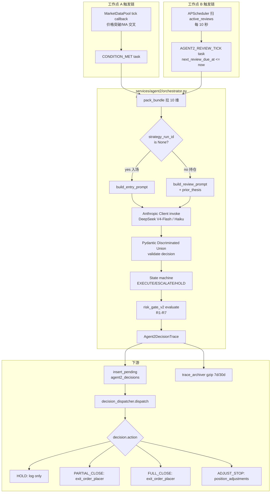
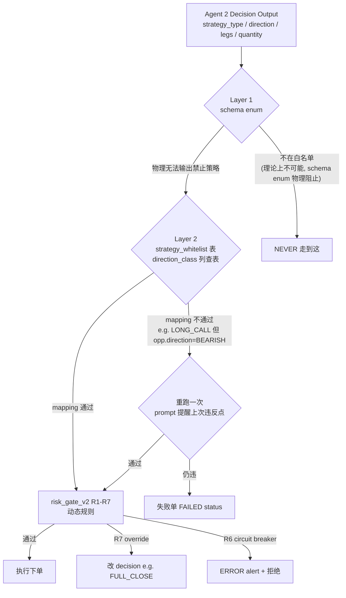
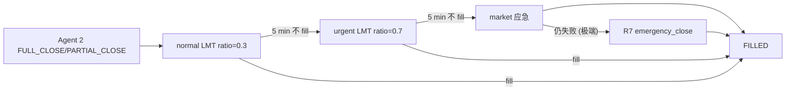
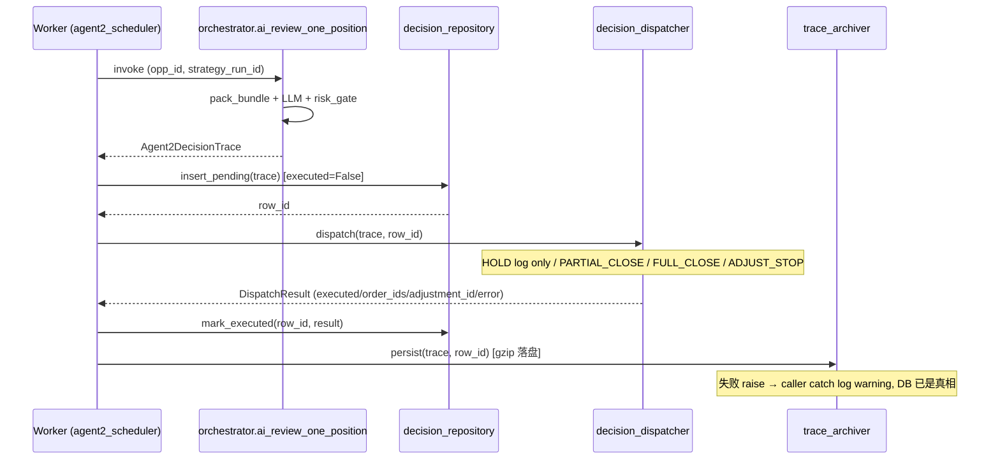
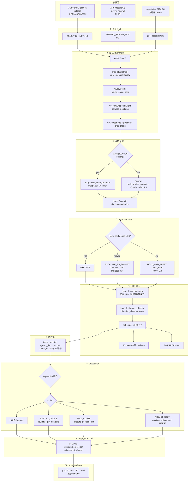

<!-- PAGE_ID: options_04_strategy -->
<details>
<summary>📚 Relevant source files</summary>

The following files were used as context for generating this wiki page (commit `6b3d159`):

- [services/agent2/orchestrator.py](https://github.com/ChunmiaoYu/options_ai_trader/blob/6b3d159/src/options_event_trader/services/agent2/orchestrator.py)
- [services/agent2/decision_dispatcher.py](https://github.com/ChunmiaoYu/options_ai_trader/blob/6b3d159/src/options_event_trader/services/agent2/decision_dispatcher.py)
- [services/agent2/decision_repository.py](https://github.com/ChunmiaoYu/options_ai_trader/blob/6b3d159/src/options_event_trader/services/agent2/decision_repository.py)
- [services/agent2/trace_archiver.py](https://github.com/ChunmiaoYu/options_ai_trader/blob/6b3d159/src/options_event_trader/services/agent2/trace_archiver.py)
- [services/agent2/state_machine.py](https://github.com/ChunmiaoYu/options_ai_trader/blob/6b3d159/src/options_event_trader/services/agent2/state_machine.py)
- [services/agent2/prompt_builder.py](https://github.com/ChunmiaoYu/options_ai_trader/blob/6b3d159/src/options_event_trader/services/agent2/prompt_builder.py)
- [services/review_scheduler.py](https://github.com/ChunmiaoYu/options_ai_trader/blob/6b3d159/src/options_event_trader/services/review_scheduler.py)
- [services/risk_gate.py](https://github.com/ChunmiaoYu/options_ai_trader/blob/6b3d159/src/options_event_trader/services/risk_gate.py)
- [domain/agent2_decisions.py](https://github.com/ChunmiaoYu/options_ai_trader/blob/6b3d159/src/options_event_trader/domain/agent2_decisions.py)
- [domain/agent2_bundle.py](https://github.com/ChunmiaoYu/options_ai_trader/blob/6b3d159/src/options_event_trader/domain/agent2_bundle.py)
- [domain/strategy_models.py](https://github.com/ChunmiaoYu/options_ai_trader/blob/6b3d159/src/options_event_trader/domain/strategy_models.py)
- [agents/strategy_agent.py](https://github.com/ChunmiaoYu/options_ai_trader/blob/6b3d159/src/options_event_trader/agents/strategy_agent.py)
- [prompts/agent2_shared/risk_guidelines.md](https://github.com/ChunmiaoYu/options_ai_trader/blob/6b3d159/src/options_event_trader/prompts/agent2_shared/risk_guidelines.md)
- [prompts/agent2_shared/quantity_sizing.md](https://github.com/ChunmiaoYu/options_ai_trader/blob/6b3d159/src/options_event_trader/prompts/agent2_shared/quantity_sizing.md)

</details>

# Agent2：策略决策器

> **Related Pages**: [[Agent1：Intake 解析器|03_intake.md]], [[执行层：下单与市场数据|05_execution.md]]

Agent 2 是系统的核心 AI 大脑。它**不是一次性策略推荐器** — 它是一个**双工作点的持续决策者**，从客户机会单的入场触发瞬间一路守护到全部平仓。

本文档对应 **invariant 10 + 16 + 20 + 21**（项目 `CLAUDE.md §5`）+ 北极星 §1 §2，描述 Agent 2 在新架构（2026-04-21+ 模型锁补丁、2026-04-30 LLM 选型、2026-05-04 / 2026-05-06 / 2026-05-07 系列范式调整）下的真实工作方式。

> **重要范式区别**: 旧版 wiki（2026-04 之前）描述 Agent 2 为"一次生成 2-3 排序方案给用户确认 + OpenAI gpt-5"。**该范式已废止**。当前 Agent 2 = **首次入场决策（DeepSeek V4-Flash）+ 入场后每 bar 持续自主决策（Claude Haiku 4.5）**，**不再让用户决定每步**。详见下方 §1 双工作点。

---

<!-- BEGIN:AUTOGEN options_04_strategy_dual_workpoints -->
## 1. Agent 2 双工作点（invariant 20）

### 1.1 范式总览

Agent 2 在系统里有**两个完全独立但共享 prompt 片段**的工作点。两者用同一份 10 维 Bundle 输入、同一套风险门校验、同一张 `agent2_decisions` 表，但**触发源、运行节奏、模型选型、输出 schema** 全部不一样：

| 维度 | 工作点 A — 首次入场决策 | 工作点 B — 入场后持续决策 |
|---|---|---|
| **何时触发** | `CONDITION_MET(opp_id)` 任务（机会单触发条件成真） | `AGENT2_REVIEW_TICK(opp_id)` 任务（持仓 review 周期到点） |
| **触发源** | MarketDataPool tick callback 检测到价格突破 / MA 交叉 / 立即触发 / 时间窗口到点 | APScheduler 每 ~10 秒扫 `active_reviews` 表，`next_review_due_at <= now()` 时塞任务 |
| **触发频率** | 每个 opp 一生只会触发一次（条件成真即消耗） | 每持仓 5 min/次（默认）；事件熔断窗口 → 连续 loop；Adaptive 触发条件命中 → 1-2 min |
| **输入 Bundle** | 10 维 Bundle，但 dim 1 持仓盈亏 + dim 8 上次 thesis_summary 必为 null（还没建仓）| 10 维 Bundle 完整，含持仓盈亏 + 上次 thesis_summary（rolling ≤600 字）|
| **输出 schema** | 4 字段决策：策略类型 + legs 描述（delta_target / expiry_preference）+ quantity + 退出计划（TP/SL/time_stop）| 4 选 1 决策：HOLD / PARTIAL_CLOSE(quantity_pct) / FULL_CLOSE / ADJUST_STOP（XOR 绝对% 或 trailing%）|
| **下游路径** | 风险门 2 层 → server-compile resolved_strategy → OrderClient 入场单 → ENTRY_FILLED handler 写持仓 + 启动 review 循环 | 风险门 → decision_dispatcher → HOLD（log only）/ PARTIAL_CLOSE / FULL_CLOSE 走 exit_order_placer 升级链 / ADJUST_STOP 写 position_adjustments |
| **默认 LLM 模型** | DeepSeek V4-Flash（北极星 §6 LLM 选型决策 2026-04-30 + 2026-05-07 entry 也已切，worker log 实证） | Claude Haiku 4.5（固定不升 Sonnet 省成本，2026-05-04 模型锁补丁；状态机仍保留 ESCALATE_TO_SONNET 路径作为 escape valve） |
| **prompt 文件** | `prompts/agent2_entry_system.md` + 共享片段 | `prompts/agent2_review_system.md` + 共享片段 |
| **共享片段位置** | `prompts/agent2_shared/{risk_guidelines.md, quantity_sizing.md, ...}` | 同左 |
| **持久化表** | `agent2_decisions`（同表，靠 `position_id IS NULL` 区分 entry vs review） | 同左 |

**为什么是双工作点而不是一个 monolithic agent**：

1. **入场是一次性策略选型 + 编译可执行参数**，需要 4 字段输出（strategy_type / legs / quantity / risk_plan），LLM 思考量大、token 消耗大、对一致性要求高 → 用 DeepSeek V4-Flash（成本低 4000x，能力对入场场景足够）
2. **review 是状态评估 + 4 选 1 调整**，结构高度规范（Pydantic discriminated union 强约束），需要稳定低延迟（5 min/次 × 持仓时段 N 小时） → 用 Claude Haiku 4.5（latency 稳定、prompt cache 复用率高、成本可控）
3. **prompt 复用**：风险指引、流动性约束、quantity sizing 规则两个工作点都要看 → 抽到 `prompts/agent2_shared/`，改一处两个工作点同步生效

### 1.2 双工作点流程图



### 1.3 跟旧范式（"一次生成给用户确认"）的根本差别

| 行为 | 旧范式 2026-04 之前 | 新范式 2026-04-21+ |
|---|---|---|
| 入场决策 | LLM 生成 2-3 排序方案 → 前端展示 → **用户必须点确认** → 才执行 | LLM 生成 1 个 4 字段决策 → 风险门 → 自动执行（无用户确认环节）|
| 持仓管理 | 没有持仓自主决策；用户事先填好 TP/SL，由代码机械止盈止损 | 每 5 min Agent 2 自主 4 选 1（HOLD/PARTIAL/FULL/ADJUST_STOP），不让用户定死止损价位 |
| 平仓决定权 | 用户挂的 TP/SL 触及就硬触发 | LLM 综合判断，**期权买方亏损上限 = 权利金，客户接受亏光**；LLM 不强制止损（北极星 §1 + invariant 16）|
| LLM 选型 | OpenAI gpt-5（响应慢、成本高） | entry: DeepSeek V4-Flash；review: Claude Haiku 4.5（成本降 ~4000x，验证 4/4 PASS）|
| 用户介入边界 | 每个机会单都要用户点确认 | 用户只在草稿编辑阶段介入；提交后 Agent 1 派活 → Agent 2 全程自主 |
| confidence 低时 | 直接 abort 让用户重提 | 保守 HOLD + ALERT（绝不降级"让用户决定"，invariant 16）|

**这个范式转换的根本驱动**: invariant 10（"只保留 2 个 AI Agent + Agent 2 入场后每 bar 持续自主决策"）+ invariant 16（"止盈止损全自动不甩给用户"）+ 北极星 §2 永久反偏离 #2"ADJUST_STOP / 机械止损不做"。

Sources: [services/agent2/orchestrator.py L290-L469](https://github.com/ChunmiaoYu/options_ai_trader/blob/6b3d159/src/options_event_trader/services/agent2/orchestrator.py#L290-L469), [services/agent2/prompt_builder.py L38-L72](https://github.com/ChunmiaoYu/options_ai_trader/blob/6b3d159/src/options_event_trader/services/agent2/prompt_builder.py#L38-L72), CLAUDE.md §5 invariant 10/16/20

<!-- END:AUTOGEN options_04_strategy_dual_workpoints -->

---

<!-- BEGIN:AUTOGEN options_04_strategy_models -->
## 2. 模型选型 — 双工作点 LLM 分工

### 2.1 北极星决策回放

| 时间 | 决策 | 影响 |
|---|---|---|
| 2026-04-21 | invariant 20 模型锁补丁：entry 路径 OpenAI gpt-5 + review 路径 Claude Haiku 4.5 | 双工作点首次明确 |
| 2026-04-30 | LLM 选型 OpenAI → DeepSeek V4-Flash（北极星 §6 历史决策回放 2026-04-30）| 成本降 ~4000x，验证 4/4 PASS |
| 2026-05-04 | review 路径锁 Claude Haiku 4.5，**不升 Sonnet 省成本** | state_machine 仍保留 ESCALATE_TO_SONNET 路径作为 escape valve（confidence 0.4-0.7 走第二次调用），但默认配置不开（成本权衡）|
| 2026-05-07 | entry 路径也已切 DeepSeek V4-Flash（worker log 实证：`agents/strategy_agent.py | Agent2: calling DeepSeek model=deepseek-v4-flash`）| invariant 20 + 北极星 §6 同步更新 |

### 2.2 当前实际配置

```
工作点 A — 首次入场决策
  默认: DeepSeek V4-Flash (deepseek-v4-flash, $0.14 / $0.28 per M tokens)
  端点: Anthropic-compat 端点 (`/anthropic`) 或 OpenAI-compat 都行
  代码: from anthropic import Anthropic 不变, env 切 ANTHROPIC_BASE_URL + ANTHROPIC_API_KEY + model 名
  特殊路径: settings.llm_provider == "openai" 时回退 OpenAI gpt-5 (rollback 路径)

工作点 B — 入场后持续决策
  默认: Claude Haiku 4.5 (固定不升 Sonnet)
  端点: Anthropic 官方 (北极星 §6 决策保 Claude, 不切 DeepSeek 因为 review 决策更复杂)
  状态机: state_machine.py
    HAIKU_HIGH = 0.7  → EXECUTE
    HAIKU_LOW = 0.4   → ESCALATE_TO_SONNET (escape valve, 默认配置不开启省成本)
    < 0.4             → HOLD_AND_ALERT (降级保守)
    SONNET_HIGH = 0.6 → EXECUTE
    < 0.6             → HOLD_AND_ALERT (最高 tier 也低 confidence, 不再升)
```

### 2.3 LLM 切换不动代码（forward compat hook）

北极星 §5 hook 之一："**LLM 通过 env 切**（`ANTHROPIC_BASE_URL` + `ANTHROPIC_API_KEY` + model 名），代码 `from anthropic import Anthropic` 不变。"

切回 Anthropic Haiku 只改 env，**代码不动**：

```bash
# 用 DeepSeek V4-Flash
ANTHROPIC_BASE_URL=https://api.deepseek.com/anthropic
ANTHROPIC_API_KEY=sk-deepseek-xxx
ANTHROPIC_MODEL=deepseek-v4-flash

# 切回原生 Anthropic Haiku 4.5
ANTHROPIC_BASE_URL=https://api.anthropic.com
ANTHROPIC_API_KEY=sk-ant-xxx
ANTHROPIC_MODEL=claude-haiku-4-5
```

防偏离: 任何"hardcode LLM 厂商" / "hardcode model 名" 的代码改动 = 踩坏 forward compat hook，必须同 commit 修。

### 2.4 prompt 文件结构

```
src/options_event_trader/prompts/
├── agent2_entry_system.md       (工作点 A system prompt)
├── agent2_review_system.md      (工作点 B system prompt)
├── strategy_generator_system_prompt.md  (legacy, StrategyAgent compat wrapper 用)
├── intake_parser_system_prompt.md       (Agent 1 用)
└── agent2_shared/               (双工作点共享片段)
    ├── risk_guidelines.md       (流动性 / 滑点 / 4 腿降级路径)
    └── quantity_sizing.md       (客户原话 → quantity / TP / SL 识别规则)
```

`prompt_builder.py` 用 `{{include:agent2_shared/risk_guidelines.md}}` 模板指令递归拼接。改共享片段一处生效两个工作点。

Sources: [services/agent2/prompt_builder.py L20-L72](https://github.com/ChunmiaoYu/options_ai_trader/blob/6b3d159/src/options_event_trader/services/agent2/prompt_builder.py#L20-L72), [services/agent2/state_machine.py L11-L38](https://github.com/ChunmiaoYu/options_ai_trader/blob/6b3d159/src/options_event_trader/services/agent2/state_machine.py#L11-L38), [agents/strategy_agent.py L40-L46](https://github.com/ChunmiaoYu/options_ai_trader/blob/6b3d159/src/options_event_trader/agents/strategy_agent.py#L40-L46)

<!-- END:AUTOGEN options_04_strategy_models -->

---

<!-- BEGIN:AUTOGEN options_04_strategy_bundle -->
## 3. 10 维 Bundle 输入 — 永远 10 维

Agent 2 两个工作点的输入永远是同一个 `Agent2DataBundle` Pydantic 模型，永远 10 维。entry 时 dim 1 持仓 + dim 8 news 为 null（无持仓 + 无新闻 collector），review 时维度齐全（除了 news 仍由 NullNewsCollector 返 None，留 Phase 12+ 真接入）。

### 3.1 10 维清单

源代码: `src/options_event_trader/domain/agent2_bundle.py`。

| # | 维度 | Pydantic Model | 关键字段 | entry 时是否齐 |
|---|---|---|---|---|
| 1 | **持仓 PositionState** | `position: PositionState \| None` | `position_id`, `strategy_type`, `legs[LegPosition]`（含 `con_id` / `quantity` / `avg_cost` / `is_short` / `days_to_expiry`）, `entry_cost`, `unrealized_pnl`, `unrealized_pnl_pct`, `realized_pnl`, `opened_at`, `time_stop_at` | **null（还没建仓）** |
| 2 | **标的 UnderlyingQuote** | `underlying: UnderlyingQuote` | `symbol`, `last`, `bid`, `ask`, `day_change_pct`, `day_volume`, `next_earnings_date`, `has_earnings_within_dte`, computed `spread_pct` | 齐 |
| 3 | **希腊 OptionGreeks** | `greeks: OptionGreeks \| None` | `con_id`, `delta`, `gamma`, `theta`, `vega`, `implied_vol`, `implied_vol_rank`（盘后可能全 None） | entry 时拉的是该 strategy 候选合约的 greeks（按 ATM 默认）；review 时拉持仓 leg 的 |
| 4 | **K 线 BarsMultiframe** | `bars: BarsMultiframe` | `bars_5m: list[Bar]`（5 分钟 K 线），`bars_1h: list[Bar]`（1 小时），`bars_1d: list[Bar]`（日线）；`Bar` 字段 `t/o/h/l/c/v`，`t` 用 `IbkrAwareDatetime` 接受 IBKR `YYYYMMDD  HH:MM:SS` 双空格格式（F-2026-05-07-COLLECTOR-FIXES-WAVE bug 1 已修） | 齐 |
| 5 | **技术指标 TechnicalIndicators** | `indicators: TechnicalIndicators` | `rsi_14`, `macd_signal`（bullish_crossover / bearish_crossover / neutral）, `bollinger_position`（upper_band / lower_band / middle）, `sma_20`, `sma_50`, `atr_14`, `volume_ratio_20d`（今日 vol / 20 日均） | 齐 |
| 6 | **期权流动性 OptionLiquidity** | `liquidity: OptionLiquidity \| None` | `con_id`, `bid_size`, `ask_size`, `open_interest`, `day_volume`, `spread_pct` | entry 时拉候选合约；review 时拉持仓 leg |
| 7 | **大盘环境 MarketContext** | `market_context: MarketContext` | `spy_change_pct`, `vix`, `vix_change_pct`（相对昨日）, `sector_etf_change_pct`（标的所在行业 ETF） | 齐（VIX 当前用 VIXY ETF 代理，真 CBOE Index 留 §4 北极星 #5 远景）|
| 8 | **新闻 NewsSnapshot** | `news: NewsSnapshot \| None` | `headlines: list[NewsHeadline]`, `sentiment_score`, `ages_sec`, `source` | **null（NullNewsCollector 当前返 None，Phase 12+ 真接入 IBKR reqNewsHeadlines / 第三方）** |
| 9 | **异常活动 UnusualActivity** | `unusual_activity: UnusualActivity` | `nearby_strikes_volume_spike`（持仓 strike ±3 档任一成交量 > 5 日均 × 3）, `put_call_ratio` | 齐（review 时按持仓 strike；entry 时按 ATM ±3）|
| 10 | **用户意图 UserIntentSnapshot** | `user_intent: UserIntentSnapshot` | `raw_input_text`（**客户完整原话**，invariant 5 v3 极致瘦身后 Agent 2 据此自决一切）, `symbol`, `max_risk_dollars` | 齐（从 DB opportunity 读）|

**额外字段** `Agent2DataBundle.ages_sec: dict[str, float]` — 每维数据采集到 LLM 调用之间的 stale 时长（秒），review 时给 LLM 看清哪些维度可能 stale。

### 3.2 entry vs review 的差异

```
entry 路径 (strategy_run_id is None):
  - position = None        (尚未建仓)
  - greeks = ATM 候选合约的希腊 (拉 ATM ±3 strike)
  - liquidity = 候选合约 (按 strategy candidate)
  - prior_thesis_summary = None (review prompt 不会包含)
  - news = None (NullNewsCollector)

review 路径 (strategy_run_id is not None):
  - position = 完整 PositionState (含 legs / unrealized_pnl)
  - greeks = 持仓 leg 的希腊
  - liquidity = 持仓 leg 的流动性
  - prior_thesis = db_reader.get_last_thesis_summary() 拉上次 review 的 thesis_summary_zh (≤600 字 rolling)
  - news = None (同上)
```

`prior_thesis` 是 review 路径的特殊机制 — Agent 2 每次 review 输出 `thesis_summary_zh` 字段（必填，spec 2026-05-02 §4.1），下次 review 时塞回 user message 的 `=== PRIOR THESIS (T-5min) === ... === END PRIOR THESIS ===` 块，让 LLM 知道"上次自己怎么想的"，形成 thesis chain propagation。

### 3.3 数据采集 — `pack_bundle` 单一入口

```python
from options_event_trader.services.data_collection.bundle_packager import pack_bundle

bundle: Agent2DataBundle = pack_bundle(
    opportunity_id=opportunity_id,
    strategy_run_id=strategy_run_id,
    db_reader=db_reader,
    ibkr_client=ibkr_client,            # 走 4 个 Pool/Client (北极星 §5)
    subscription_manager=subscription_manager,
    news=news_snapshot,                  # async fetch 后传, 失败降级 None
)
```

`pack_bundle` **不直接调 IBKR API** — 走 4 个 Pool/Client 抽象（MarketDataPool / QueryClient / OrderClient / AccountSnapshotClient）。这是北极星 §5 forward compat hook："业务代码必走 4 个 Pool/Client 抽象，禁止直接调 `ibkr.reqMktData / reqPositions / reqAccountSummary / placeOrder`。"

Sources: [domain/agent2_bundle.py L18-L225](https://github.com/ChunmiaoYu/options_ai_trader/blob/6b3d159/src/options_event_trader/domain/agent2_bundle.py#L18-L225), [services/agent2/orchestrator.py L335-L361](https://github.com/ChunmiaoYu/options_ai_trader/blob/6b3d159/src/options_event_trader/services/agent2/orchestrator.py#L335-L361)

<!-- END:AUTOGEN options_04_strategy_bundle -->

---

<!-- BEGIN:AUTOGEN options_04_strategy_review_scheduler -->
## 4. Adaptive review interval — 5 min 默认 + 4 触发条件缩到 1-2 min

### 4.1 算法（`services/review_scheduler.py`）

```python
def compute_review_interval(position: PositionSnapshot, market: MarketSnapshot) -> int:
    """计算 review 间隔秒数.

    默认 300s (5 min). 命中下列任一 → 120s; ≥2 触发 → 60s.

    1. 标的 1-min bar 移动 ≥ 1.5% (ATR-relative) 或 IV 跳 ≥ 10%
    2. position MTM 距 SL 阈值 ≤ 20%
    3. position MTM 距 TP ≥ 80%
    4. 持仓 option 距 expiry ≤ 1 trading day
    """
    triggers = []
    if abs(market.atr_relative_move) >= 0.015 or market.iv_jump_pct >= 0.10:
        triggers.append("price_move")
    if position.mtm_to_sl_pct <= 0.20:
        triggers.append("near_sl")
    if position.mtm_to_tp_pct >= 0.80:
        triggers.append("near_tp")
    if position.days_to_expiry <= 1:
        triggers.append("near_expiry")
    if len(triggers) >= 2:
        return 60
    if triggers:
        return 120
    return 300
```

### 4.2 4 触发条件详解

| # | 触发条件 | 数据来源 | 默认间隔 | 缩到 |
|---|---|---|---|---|
| 1 | 标的 1-min bar 移动 ≥ 1.5%（ATR-relative）**或** IV 跳 ≥ 10% | dim 4 bars_1m + dim 5 indicators.atr_14 / dim 3 greeks.implied_vol vs 上次 | 300s | 命中 → 120s |
| 2 | position MTM 距 SL 阈值 ≤ 20%（即"差 20% 就要触发止损"）| dim 1 position.unrealized_pnl_pct vs user_intent 的 SL（或 LLM 上次 ADJUST_STOP 的 new_stop_pct）| 300s | 命中 → 120s |
| 3 | position MTM 距 TP ≥ 80%（即"已涨到目标 80%"）| dim 1 position.unrealized_pnl_pct vs LLM 上次决策的 take_profit_pct | 300s | 命中 → 120s |
| 4 | 持仓 option 距 expiry ≤ 1 trading day | dim 1 position.legs[].days_to_expiry | 300s | 命中 → 120s |

**叠加 ≥ 2 触发** → 60s（最频繁）。

例：AAPL 285C 持仓，IV 跳 15%（触发 1）+ MTM 已 +90%（触发 3）→ 间隔缩到 60s。LLM 每 1 分钟决策一次直到平仓或市场缓和。

### 4.3 事件熔断窗口 — 独立机制（不走 4 触发条件）

**事件窗口** = 财报 / CPI / FOMC ±15 min。北极星 §1 锁定行为：

```
事件窗口熔断:
  - review_interval_sec 字段语义 = "handler 完成后下次 review 至少等多少秒 (floor)"
  - 事件熔断 = floor=1, 实际间隔由 LLM 延迟主导 (~15-30s/轮)
  - 单次 review 全管道 timeout = 25s 超时跳过该轮
  - 窗口持续上限 60 min (防 LLM 错误状态拖垮成本)
  - 事件公布瞬间 (newsTicker 收到) 立即塞一次 review 任务 (跳过等待)
```

**为什么是连续 loop 不写死 30s 间隔**：北极星 §7 反偏离 — "想给事件熔断窗口写死时间间隔（e.g. 30s）而非'连续 loop 直到决策完成立即下一次' — 偏离 §1；LLM 决策延迟 ~15-30s，写死 30s 间隔等于上一轮没出结果下一轮又开始，重叠堆栈反而不稳。"

### 4.4 持久化 — `active_reviews` 表

```sql
-- alembic 0024 (Phase B 2026-05-07 ship)
active_reviews
  opp_id UUID PRIMARY KEY
  next_review_due_at TIMESTAMPTZ NOT NULL
  review_interval_sec INTEGER NOT NULL DEFAULT 300
  -- 事件窗口期 UPDATE review_interval_sec 300 → 30 走表
```

APScheduler 每 ~10 秒扫一次 `active_reviews where next_review_due_at <= now()`，对每行 opp 塞 `AGENT2_REVIEW_TICK` 任务 + 立即 `UPDATE next_review_due_at = now() + review_interval_sec`（handler 完成后再实际执行下一次，中间 handler 失败也能往前推）。

`ENTRY_FILLED` handler INSERT；`EXIT_FILLED` 全平 DELETE；事件窗口 UPDATE interval。

Sources: [services/review_scheduler.py L1-L53](https://github.com/ChunmiaoYu/options_ai_trader/blob/6b3d159/src/options_event_trader/services/review_scheduler.py#L1-L53), 北极星 §1（事件熔断窗口）, specs/architecture-walkthrough §6（5 min review 循环）

<!-- END:AUTOGEN options_04_strategy_review_scheduler -->

---

<!-- BEGIN:AUTOGEN options_04_strategy_risk_gate -->
## 5. 风险门 2 层 — invariant 21

### 5.1 双层结构



### 5.2 Layer 1 — LLM Structured Outputs schema enum

**目的**: LLM **物理无法**输出禁止策略，从 `strategy_whitelist` 表查表生成 enum。

```python
# Pseudo-code, 真实路径在 services/agent2/prompt_builder.py + Anthropic Tool Use schema
SUPPORTED_STRATEGY_TYPES = Literal[
    # BULLISH 3
    "LONG_CALL", "BULL_CALL_SPREAD", "BULL_PUT_SPREAD",
    # BEARISH 3
    "LONG_PUT", "BEAR_PUT_SPREAD", "BEAR_CALL_SPREAD",
    # VOLATILITY 6 (北极星 §1 2026-05-06 加 CALENDAR / DIAGONAL)
    "LONG_STRADDLE", "LONG_STRANGLE",
    "IRON_CONDOR", "IRON_BUTTERFLY",
    "CALENDAR_SPREAD", "DIAGONAL_SPREAD",
]
```

LLM 输出 JSON 必须 schema validate 才能进 Pydantic `StrategyProposal`，Pydantic `Literal[...]` 强约束 → LLM 写 `SHORT_CALL` 这种禁止策略直接 ValidationError reject。

**alembic 0028 ship `strategy_whitelist` 表 seed 是真相**：12 行（北极星 §1）+ Sync gate test `b2ba6dc` DB seed ↔ EXPECTED_NORTH_STAR_STRATEGIES 三方真相硬锁，新加策略漏改任一处 → CI fail。

### 5.3 Layer 2 — strategy → direction mapping

**目的**: 防"LONG_CALL 但 opp.direction=BEARISH"这种逻辑矛盾。`strategy_whitelist` 表的 `direction_class` 列做 mapping：

```sql
-- alembic 0028 seed (Phase B 2026-05-07 ship)
INSERT INTO strategy_whitelist (strategy_name, legs_count, direction_class, ...) VALUES
  ('LONG_CALL',           1, 'BULLISH',    ...),
  ('BULL_CALL_SPREAD',    2, 'BULLISH',    ...),
  ('BULL_PUT_SPREAD',     2, 'BULLISH',    ...),  -- 反直觉但确实是 BULLISH (净 credit, 标的不破 short put strike 即赚)
  ('LONG_PUT',            1, 'BEARISH',    ...),
  ('BEAR_PUT_SPREAD',     2, 'BEARISH',    ...),
  ('BEAR_CALL_SPREAD',    2, 'BEARISH',    ...),  -- 反直觉
  ('LONG_STRADDLE',       2, 'VOLATILITY', ...),
  ('LONG_STRANGLE',       2, 'VOLATILITY', ...),
  ('IRON_CONDOR',         4, 'VOLATILITY', ...),
  ('IRON_BUTTERFLY',      4, 'VOLATILITY', ...),
  ('CALENDAR_SPREAD',     2, 'VOLATILITY', ...),
  ('DIAGONAL_SPREAD',     2, 'VOLATILITY', ...);
```

**北极星 §1 锁定**: "BULL_PUT_SPREAD/BEAR_CALL_SPREAD 等反直觉策略由 mapping 表显式锁定不留 LLM 推断。"

**校验流程**:
1. Agent 2 输出 `strategy_type=LONG_CALL`
2. 查表得 `direction_class=BULLISH`
3. 对照 `opp.direction`:
   - opp.direction=BULLISH → 通过
   - opp.direction=BEARISH → **mismatch**，重跑一次（prompt 提醒上次违反点：`"上次你输出 LONG_CALL 但 opp.direction=BEARISH 矛盾, 这次必须输出 BEARISH/VOLATILITY 策略"`）
   - opp.direction=null → 通过（用户没指定方向，Agent 2 自由选）
   - opp.direction=VOLATILITY → mapping VOLATILITY 类策略才通过
4. 第二次仍 mismatch → **失败单 FAILED**（不再继续重试浪费 token）

**北极星 §1 引用**: "direction = BULLISH/BEARISH/VOLATILITY/null 4 值，**非 null 时 Agent 2 强约束遵守**"。

### 5.4 risk_gate_v2 R1-R7 动态规则

Layer 2 通过后还要走 `services/risk_gate_v2.evaluate()` 7 条动态规则（不是 hardcode 而是 `config/risk_gate_v2.yml` 查表）：

| Rule | 检查项 | 数据来源 | 失败动作 |
|---|---|---|---|
| **R1** | 仓位规模 ≤ 5 日 avg volume × 30%（你的单子不能比当天该合约总成交量 30% 还大）| `account_state.position_notional_usd` + `bundle.bars.bars_1d` 5 日 avg volume | reject |
| **R2** | account 现金占用率检查（防 margin call） | IBKR `get_account_values()` `NetLiquidation` / `AvailableFunds` / `GrossPositionValue` | reject |
| **R4** | entry LMT 价 vs market mid 偏离 ≤ 阈值（防 fat finger）| OrderClient 下单时 `lmt_price` vs MarketDataPool `mid` | reject |
| **R5** | adjustments_last_hour ≤ 阈值（防 LLM 自洽失败反复改）+ pre-open 30 min gate | `db_reader.count_adjustments_last_hour()` + `services.market_calendar.is_pre_open_30min_et()` | reject |
| **R6** | last_two_decisions_all_loss → circuit breaker（连续两次 review 后都浮亏要警觉）| `db_reader.last_two_decisions_all_loss()` | **ERROR alert** + reject |
| **R7** | assignment_avoidance: short leg + DTE ≤ 阈值 + ITM → 强制 FULL_CLOSE 避免被指派 | `_compute_assignment_risk_short_legs()` 走 IBKR `get_contract_details()` | **override decision → FULL_CLOSE**（不 reject 而是改决策）|

**R7 是特殊 override 路径**：风险门不只能 reject，还能改写 decision。例如 short BULL_PUT_SPREAD 的 short put leg DTE=1 + ITM → 风险门把 LLM 输出的 HOLD 改成 FULL_CLOSE 紧急平仓避免被分配股票。

### 5.5 旧版 `risk_gate.py`（legacy compat wrapper）

仓库还保留 `services/risk_gate.py` 单文件版（Step E 之前用）：

```python
def check_risk_gate(strategy, max_risk_dollars, disallowed=None, max_legs=None, max_quantity=100):
    # Rule 0: quantity hard cap
    if strategy.quantity > max_quantity:
        reasons.append(f"数量 {strategy.quantity} 超过上限 {max_quantity}")
    # Rule 1: max_loss <= max_risk_dollars
    if strategy.max_loss > max_risk_dollars:
        reasons.append(...)
    # Rule 3: disallowed strategies
    # Rule 4: max legs (soft hint, invariant 17 废止后保留 wrapper compat)
    return RiskGateResult(passed=len(reasons) == 0, blocked_reasons=reasons)
```

**当前产品路径走 `risk_gate_v2.evaluate()`**, `risk_gate.check_risk_gate` 仅在 `enable_agent2_autonomous=False`（rollback 路径）时还活着。30 天 cleanup 后删除（finding `F-2026-04-21-STRATEGY-AGENT-COMPAT-WRAPPER`）。

Sources: [services/risk_gate.py L1-L48](https://github.com/ChunmiaoYu/options_ai_trader/blob/6b3d159/src/options_event_trader/services/risk_gate.py#L1-L48), [services/agent2/orchestrator.py L175-L287](https://github.com/ChunmiaoYu/options_ai_trader/blob/6b3d159/src/options_event_trader/services/agent2/orchestrator.py#L175-L287), 北极星 §1（风险门 2 层）+ §5 forward compat hook（策略白名单查表 + 风险门 mapping 查表）

<!-- END:AUTOGEN options_04_strategy_risk_gate -->

---

<!-- BEGIN:AUTOGEN options_04_strategy_whitelist -->
## 6. 12 种策略白名单

### 6.1 北极星 §1 锁定的 12 种

| 类别 | 策略 | 腿数 | direction_class | 备注 |
|---|---|---|---|---|
| **BULLISH 3** | LONG_CALL | 1 | BULLISH | 经典看涨买方，权利金有限 |
| | BULL_CALL_SPREAD | 2 | BULLISH | net debit，最大亏损 = net debit |
| | BULL_PUT_SPREAD | 2 | BULLISH | **反直觉**：net credit，赌标的不破 short put strike（mapping 表显式锁 BULLISH）|
| **BEARISH 3** | LONG_PUT | 1 | BEARISH | 经典看跌买方 |
| | BEAR_PUT_SPREAD | 2 | BEARISH | net debit |
| | BEAR_CALL_SPREAD | 2 | BEARISH | **反直觉**：net credit，赌标的不破 short call strike |
| **VOLATILITY 6** | LONG_STRADDLE | 2 | VOLATILITY | ATM call + put 同 strike，赌 IV 涨或大方向 |
| | LONG_STRANGLE | 2 | VOLATILITY | OTM call + put，便宜版 straddle |
| | IRON_CONDOR | 4 | VOLATILITY | net credit，赌震荡（最大亏损 = spread - net credit）|
| | IRON_BUTTERFLY | 4 | VOLATILITY | net credit ATM，赌精确震荡 |
| | **CALENDAR_SPREAD** | 2 | VOLATILITY | 2026-05-06 加。net debit，赚时间价值（同 strike 不同 expiry）|
| | **DIAGONAL_SPREAD** | 2 | VOLATILITY | 2026-05-06 加。earnings play 不押方向（不同 strike + 不同 expiry）|

**为什么是 12 不是 10**：2026-05-06 北极星范式级架构梳理时加 CALENDAR_SPREAD + DIAGONAL_SPREAD，因为中文客户讲"赚时间价值" / "earnings play 不押方向"用，且都是 net debit 有限亏（非裸卖空）。

### 6.2 alembic 0028 + EXPECTED_NORTH_STAR_STRATEGIES 三方真相

```
真相 1: 北极星 §1 文档 (人类可读)
真相 2: src/options_event_trader/data/EXPECTED_NORTH_STAR_STRATEGIES (Python 常量)
真相 3: alembic 0028 strategy_whitelist 表 seed (DB 真相)

Sync gate test b2ba6dc (Phase B 2026-05-07 ship):
  CI 检查 真相 2 == 真相 3, 任一漏加 -> 测试 fail
  真相 1 是人类视角不在 CI 链上, 但 invariant 5 v3 + invariant 21 + 北极星 §6 显式声明改任一必同步
```

新加策略要走的最小修改链：
1. 北极星 §1 12 → 13 表格加一行
2. 北极星 §6 历史决策回放写一行 why
3. 改 alembic 0028 seed（`scripts/seed_strategy_whitelist.py` 或新 alembic `0030_add_xxx_strategy.py`）
4. 改 `EXPECTED_NORTH_STAR_STRATEGIES` 常量
5. `SUPPORTED_STRATEGY_TYPES` Literal 加一项
6. prompt 文件 `agent2_entry_system.md` "你必须输出的内容" 列表加一项 + 中文说明
7. `services/strategy_resolver.py`（如新策略 leg 结构特殊需要新 resolver 函数）
8. CI sync gate test 自动验证 #3 == #4

<!-- END:AUTOGEN options_04_strategy_whitelist -->

---

<!-- BEGIN:AUTOGEN options_04_strategy_naked_short -->
## 7. 裸卖空永久禁止 — hard gate

### 7.1 永禁清单

```
SHORT_CALL          # naked short call
SHORT_PUT           # naked short put
SHORT_STRADDLE      # short call + short put 同 strike
SHORT_STRANGLE      # OTM short call + OTM short put
```

### 7.2 为什么是 hard gate（不是 soft hint）

按 memory `feedback_hard_gate_vs_soft_hint.md` 的 3 题决策树：

1. **出错最差代价?** **无限亏损**（理论上股票上涨无上限 → naked short call 亏损无底线）→ hard gate
2. **LLM 看 10 维 bundle 能判断吗?** 不能；裸卖空的"市场极端波动" 在 bundle 里看不出，bundle 里的 IV / 流动性 / OI 都跟"账户能不能扛得住极端事件"无关
3. **是策略方向决策还是基础设施故障?** 策略方向决策（LLM 想用裸卖空赌方向 → 必须代码层物理拦死）

→ 三题答案都指向 **hard gate**。

### 7.3 实现机制

| 层 | 防护 | 物理保证 |
|---|---|---|
| **Layer 1 schema enum** | `SUPPORTED_STRATEGY_TYPES Literal[...]` 不含 `SHORT_*` | LLM 物理无法输出（Pydantic ValidationError reject） |
| **Layer 2 mapping** | `strategy_whitelist` 表 12 行无 `SHORT_*` | DB seed 真相 → mapping 查不到 → reject |
| **alembic seed test** | `tests/test_strategy_whitelist_invariant.py` 显式断言无 `SHORT_*` | CI fail 阻止 PR merge |
| **prompt 显式声明** | `agent2_entry_system.md` 写 "禁止策略：SHORT_CALL / SHORT_PUT / SHORT_STRADDLE / SHORT_STRANGLE（亏损无底线）" | LLM 即使 jailbreak 也 schema validate fail |

### 7.4 北极星 §2 永久反偏离

> "裸卖空（SHORT_CALL / SHORT_PUT / SHORT_STRADDLE / SHORT_STRANGLE）— 亏损无底线，永久禁止。"

**这是永久不做清单的一项**，与 HK 市场支持、ADJUST_STOP / 机械止损并列。任何 PR / spec / brainstorming 想加裸卖空 = 立即偏离北极星 §2，必须停下重新讨论。

Sources: 北极星 §1 / §2 / §6 历史决策回放, memory `feedback_hard_gate_vs_soft_hint.md`

<!-- END:AUTOGEN options_04_strategy_naked_short -->

---

<!-- BEGIN:AUTOGEN options_04_strategy_4leg_liquidity -->
## 8. 4 腿流动性 — soft hint（2026-05-06 反转）

### 8.1 历史反转

| 时间 | 状态 | 原因 |
|---|---|---|
| 2026-05-06 上午 | 设计为 hard gate（schema 加 `liquidity_constraint_symbols` / `min_oi_per_leg` 字段限 SPY/QQQ/IWM） | 4 腿大单滑点担忧 |
| 2026-05-06 下午（同 session） | **反转为 soft hint**（删 schema 字段，改 prompt 文件指引） | 用户 Q1 反思触发：流动性不够 = 滑点 5-10% **不是无限亏损**，跟 hard gate 等级不同 |

### 8.2 为什么是 soft hint

按 hard gate vs soft hint 区分原则：

| 题 | 答 |
|---|---|
| 出错最差代价? | **滑点 5-10%**（不是无限亏）→ soft hint |
| LLM 看 10 维 bundle 能判断吗? | **能**（dim 6 OptionLiquidity 含 OI / day_volume / spread_pct，dim 9 UnusualActivity）→ soft hint |
| 是策略方向决策还是基础设施故障? | 策略选型 / 流动性评估（不是基础设施故障）→ 信任 LLM |

→ 信任 LLM 看 dim 6 + dim 9 自决降级或拒绝，跟"客户期权不强制止损"同哲学。

### 8.3 prompt 指引（`prompts/agent2_shared/risk_guidelines.md`）

100+ 手 4 腿场景的指引（**不在 schema 写硬约束**）：

```
4 腿策略流动性硬要求 (考虑 IRON_CONDOR / IRON_BUTTERFLY 时, 必先看 dim 6 数据每条腿单独验证):

| 指标               | 阈值              | 数据来源        |
|--------------------|-------------------|-----------------|
| 单腿 open interest | ≥ 1000            | dim 6 liquidity |
| 单腿当日 volume    | ≥ 100             | dim 6 liquidity |
| 单腿 bid-ask spread| ≤ 5% × mid_price  | dim 6 liquidity |

4 条腿任一不达标 → 主动降级:
- 改为 2 腿 SPREAD (BULL_CALL_SPREAD / BEAR_PUT_SPREAD / 等), 直接抹掉远端 OTM 的两条腿
- 或拒绝 (返 NO_TRADE 决策 + reason_zh "4 腿流动性不够, 滑点会吃掉收益")
```

### 8.4 大手数 100+ 手特殊指引

```
100+ 手单仓位走任何策略都需额外注意:
- 单腿 LONG_CALL/PUT 100+ 手 → 走 IBKR Adaptive Algorithm (北极星 §1 锁), 不主动拆腿
- 2 腿 SPREAD 100+ 手 → 同样 Adaptive (BAG combo 整单走)
- 4 腿组合 100+ 手 → 必须所有 4 腿满足上面流动性硬要求, 否则强制降级 SPREAD; 4 腿 100+ 手在低流动性等于"自杀"
- 总 quantity > 当日 volume × 30% → 直接拒绝 (你的单子比当天该合约总成交量还大, 这是 R1 风险门 hard gate)
```

### 8.5 高流动性 symbol 白名单（参考）

```
高流动性 symbol (4 腿安全余量大):
- SPY / QQQ / IWM (ETF) — 几乎所有近月 strike 都满足 OI ≥ 1000
- AAPL / NVDA / TSLA / MSFT / AMZN (流动性极高的 mega cap) — 月内 ATM ±10% strike 满足

非白名单 symbol 走 4 腿前必须逐腿检查 dim 6.
```

**不在白名单不等于 reject** — 只是"逐腿严格检查 dim 6"。LLM 看到 OI / volume / spread 都达标可以照走 4 腿。

### 8.6 改阈值不需 alembic / 不需重启

soft hint 在 prompt 文件 — 改阈值（e.g. OI ≥ 1000 → 1500）只改 `prompts/agent2_shared/risk_guidelines.md` 即可，**不需 alembic migration / 不需重启 worker**（LLM 每次 review 都重新读 prompt 文件）。

这跟 hard gate（DB 表 + schema enum + 代码常量 + alembic migration）的修改成本差别巨大 — 是设计哲学的体现。

### 8.7 时间衰减跟流动性互动

prompt 还指引 expiry 邻近的特殊情况：

```
近月期权 < 7 DTE 时:
- 即使 OI 满足阈值, intraday volume 可能因 gamma 暴涨变得不稳定
- bid-ask spread 在 expiry 前最后 1-2 hr 通常翻倍
- DTE < 1 trading day 的 4 腿组合 → 默认拒绝, 除非所有腿 spread < 3% × mid
```

### 8.8 降级路径决策树（prompt）

```
发现流动性不够时, 优先级:

1. 降腿数: 4 腿 → 2 腿 SPREAD (保留方向 thesis)
2. 降手数: 100 手 → 50 手 (保留策略形状, 减小绝对滑点 $)
3. 改 symbol: 客户原话提了"高流动性的某 ETF"之类时, 改成 SPY/QQQ
4. 拒绝: 上面 3 条都不可行, 返 NO_TRADE + 中文 reason
```

Sources: [prompts/agent2_shared/risk_guidelines.md L1-L65](https://github.com/ChunmiaoYu/options_ai_trader/blob/6b3d159/src/options_event_trader/prompts/agent2_shared/risk_guidelines.md), 北极星 §1（4 腿流动性指引 hard→soft 反转 2026-05-06）, memory `feedback_hard_gate_vs_soft_hint.md`

<!-- END:AUTOGEN options_04_strategy_4leg_liquidity -->

---

<!-- BEGIN:AUTOGEN options_04_strategy_pricing -->
## 9. 限价单定价 — mid-based（invariant 21）

### 9.1 公式

```
limit = mid + ratio × (ask - mid)
```

其中 `mid = (bid + ask) / 2`，`ratio` 决定 fill 急迫程度。

### 9.2 4 档 spread_ratio

| 档位 | ratio | 含义 | fill 概率 |
|---|---|---|---|
| **patient** | 0.2 | 偏 mid 一点点出价（buy 时低于 mid+20% spread）| 低（耐心等做市商主动调）|
| **normal** | 0.3 | 略偏 ask | 中 |
| **urgent** | 0.7 | 接近 ask | 高 |
| **market** | — | 直接发市价单 | 几乎必 fill |

### 9.3 严格限制

invariant 21 锁定的边界（不能偏离）：

1. **绝不裸市价单** — `market` 档**需风控层额外许可**（不是默认就能用）。entry 路径默认 `patient` → 失败升级 `normal` → `urgent`，最终一档才走 `market` 应急
2. **BAG combo 不走 MKT 档** — combo 类策略（BULL_CALL_SPREAD / IRON_CONDOR 等多腿）**始终 LMT + 逐腿拆单**，不走市价
3. **Adaptive Algorithm（IBKR `algoStrategy="Adaptive"`）** 是单腿 100+ 手大单的优选 — 让 IBKR 算法接管定价（不走 4 档 ratio）。BAG combo 不能用 Adaptive（IBKR 不支持 combo）

### 9.4 entry vs review 的 ratio 选择

```
entry 路径 (CONDITION_MET handler 出价):
  - 默认 patient (ratio=0.2): 触发条件刚成真, 不急, 等做市商
  - 升级链: patient → normal → urgent → (单腿) market 应急

review 路径平仓 (decision_dispatcher 出价):
  - 默认 normal (ratio=0.3): 平仓比入场急一点
  - 升级链: normal → urgent → (单腿) market 应急
  - PARTIAL_CLOSE 量小时直接 urgent

紧急路径 (R7 emergency_close):
  - 直接 urgent (ratio=0.7), single leg 走 market 兜底
```

### 9.5 invariant 16 联动 — 平仓全自动不甩给用户

invariant 16 锁定：

> "**止盈止损全自动不甩给用户**：平仓升级链 LMT → 追价 → MKT 必须走到底，**不允许"挂单失败 → 通知用户手动处理"的降级分支**。Agent 2 决策不确定（confidence < 阈值）时保守 HOLD + 告警，**绝不降级为"让用户决定"**。"

平仓升级链：



**红线**: 升级链每一档失败都自动进下一档，**不打 user notification 等用户点按钮**。这是 invariant 16 的硬约束 — "止损核心价值是'不在场也能控损'，人工介入破坏该契约"。

### 9.6 Agent 2 confidence 低时不甩给用户

invariant 16 后半段：

> "Agent 2 决策不确定（confidence < 阈值）时保守 HOLD + 告警，绝不降级为'让用户决定'。"

state_machine 路径：
- Haiku confidence < 0.4 → HOLD_AND_ALERT（**不**变成 NEEDS_USER_DECISION）
- Sonnet confidence < 0.6 → HOLD_AND_ALERT（**不**变成 NEEDS_USER_DECISION）

`HoldDecision` 模型显式不带 user-facing prompt 字段；alert_sink 走 `ConsoleAlertSink` / 远程告警通道，**不**触发前端 modal 等用户响应。

Sources: CLAUDE.md §5 invariant 21, [services/exit_order_placer.py](https://github.com/ChunmiaoYu/options_ai_trader/blob/6b3d159/src/options_event_trader/services/exit_order_placer.py)（升级链实现）, [services/agent2/orchestrator.py L403-L468](https://github.com/ChunmiaoYu/options_ai_trader/blob/6b3d159/src/options_event_trader/services/agent2/orchestrator.py#L403-L468)（HOLD_AND_ALERT downgrade）

<!-- END:AUTOGEN options_04_strategy_pricing -->

---

<!-- BEGIN:AUTOGEN options_04_strategy_decision_persistence -->
## 10. agent2_decisions 表持久化

### 10.1 一表两用：entry + review 决策

`agent2_decisions` 表是 Agent 2 全部决策的**唯一真相**，entry 决策（`position_id IS NULL`）+ review 决策（`position_id` 非空）共表，靠 `position_id` 列区分。

```sql
-- alembic 0008 (初版) + 0012 (execution fields) + 0014 (updated_at) + 0021 (thesis_summary)
agent2_decisions
  id                       UUID PRIMARY KEY DEFAULT gen_random_uuid()
  bundle_id                TEXT NOT NULL UNIQUE   -- 幂等 key (worker restart / IBKR 重连不重复)
  opportunity_id           UUID NOT NULL REFERENCES opportunities(id)
  position_id              UUID REFERENCES positions(id)  -- NULL = entry 决策
  bundle_json              JSONB NOT NULL          -- 10 维 bundle 完整 dump
  model_name               VARCHAR(64) NOT NULL    -- "haiku" / "sonnet" / "cache" / model id
  temperature              DOUBLE PRECISION DEFAULT 0.0
  input_tokens             INTEGER NOT NULL
  cached_input_tokens      INTEGER NOT NULL
  output_tokens            INTEGER NOT NULL
  cost_usd                 NUMERIC(10, 6) NOT NULL
  raw_response_json        JSONB NOT NULL          -- LLM raw response (审计)
  parsed_decision_json     JSONB NOT NULL          -- Pydantic decision dump
  action                   VARCHAR(32) NOT NULL    -- HOLD / PARTIAL_CLOSE / FULL_CLOSE / ADJUST_STOP
  confidence               DOUBLE PRECISION NOT NULL
  thesis_summary_zh        TEXT                    -- ≤600 字 rolling, alembic 0021 加
  risk_gate_result         VARCHAR(64) NOT NULL    -- PASS / R1_REJECT / ... / R7_OVERRIDE
  executed                 BOOLEAN NOT NULL DEFAULT FALSE
  executed_at_utc          TIMESTAMPTZ
  order_ids                UUID[]                  -- entry: [入场单]; review: [平仓单]
  adjustment_id            UUID                    -- ADJUST_STOP 时指向 position_adjustments
  error                    TEXT
  trace_path               TEXT NOT NULL           -- gzip 文件路径 (trace_archiver A1.9 写)
  tier_used                VARCHAR(16)             -- haiku / sonnet / cache
  created_at_utc           TIMESTAMPTZ NOT NULL DEFAULT now()
  updated_at_utc           TIMESTAMPTZ NOT NULL DEFAULT now()  -- alembic 0014 加
```

### 10.2 双段落写入流程（spec §4.2）



### 10.3 幂等性保证

`bundle_id` UNIQUE 约束 + `decision_repository.insert_pending` 短路逻辑：

```python
# decision_repository.py L39-L48
existing = db.query(Agent2DecisionRow).filter_by(bundle_id=trace.bundle_id).first()
if existing is not None:
    LOGGER.info("insert_pending: bundle_id=%s 已存在 (row.id=%s), 幂等短路", ...)
    return existing.id
```

**为什么需要幂等**:
1. Worker SIGKILL 后重启扫 `workflow_tasks where status=RUNNING AND picked_at < now() - 60s` 重做该任务
2. IBKR 网络断重连后，重新拉 bundle 又跑了一次 LLM
3. 同一 review 周期内手动重启服务

`bundle_id` 由 `pack_bundle` 生成（含 timestamp + opp_id + strategy_run_id 哈希），同一时间窗口同一 bundle 不会变 → 重做时 `insert_pending` 短路返已有 row，避免双写。

### 10.4 thesis_summary_zh 链式传递

```python
# orchestrator.py L353-L361
prior_thesis = db_reader.get_last_thesis_summary(
    opportunity_id=opportunity_id,
    position_id=bundle.position_id,
)
system_prompt, user_message = build_review_prompt(bundle, prior_thesis=prior_thesis)
```

`get_last_thesis_summary` 查 `agent2_decisions WHERE opportunity_id=? AND position_id=? ORDER BY created_at_utc DESC LIMIT 1`，拉最近一次 review 的 thesis_summary_zh（≤600 字 rolling）塞回 review prompt 的 user message：

```
=== PRIOR THESIS (T-5min) ===
入场 $5.20 现 $5.80 浮盈 11.5%, AAPL 上行势头未变,
RSI 65 仍在合理区间, IV 31% 较入场时 35% 略降, 时间价值损失轻微.
继续持有等待 $290 阻力位测试; 若 IV 跳升 > 40% 可能 PARTIAL_CLOSE 50% 锁定收益.
=== END PRIOR THESIS ===
```

LLM 看到自己上次的思考（"我说要等 $290 阻力测试"），这次 review 时连贯延续（"现在 $287，已接近阻力，可能 PARTIAL_CLOSE"）。

### 10.5 trace_archiver 冷存（spec §4.3）

`agent2_decisions` 表存关系数据 + 摘要；**完整 LLM raw response + bundle 完整 dump** 走 `trace_archiver.persist()` gzip 落盘到 `{trace_dir}/YYYY-MM-DD/{symbol}/{bundle_id}.json.gz`。

```python
# trace_archiver.py L43-L52
payload = {
    "bundle_id": trace.bundle_id,
    "decision_row_id": str(decision_row_id),
    "collected_at_utc": ...,
    "decision": trace.decision.model_dump(),
    "tier_used": trace.tier_used,
    "bundle_dict": bundle_dict,
    "cache_hit": getattr(trace, "cache_hit", False),
    "alerted": getattr(trace, "alerted", False),
    # + risk_gate_result + emergency_close_directive (如有)
}
```

**原子 rename**: 先写 `.json.gz.tmp` → `os.replace()` 到 `.json.gz`（SIGKILL 场景留 `.tmp` 不留半截 `.json.gz`，worker 启动时 `cleanup_stale_tmp` 扫描 + 删除 + alert_sink WARNING）。

**保留期**: 本地 7 天 rotate，云端 30 天（独立 systemd.timer 跑 `trace_cleanup`，不在 archiver 模块里）。

### 10.6 replay_cache —— 重放幂等

```python
# orchestrator.py L362-L378
if replay_cache is not None:
    cache_key = compute_cache_key(bundle_dict, system_prompt)
    cached = replay_cache.get(cache_key)
    if cached is not None:
        decision = _DECISION_ADAPTER.validate_python(cached)
        return await _finalize_trace(
            {"bundle_id": ..., "decision": decision, "tier_used": "cache",
             "cache_hit": True, "bundle_dict": bundle_dict},
            ...,
        )
```

**用途**: 回归测试 / 录像重放。生产环境 `replay_cache=None` 跳过该路径。

**缓存命中仍走风险门** — `_finalize_trace` 永远跑 risk_gate（cached LLM output 仍是 LLM output，账户状态可能变）。

Sources: [services/agent2/decision_repository.py L29-L97](https://github.com/ChunmiaoYu/options_ai_trader/blob/6b3d159/src/options_event_trader/services/agent2/decision_repository.py#L29-L97), [services/agent2/trace_archiver.py L24-L62](https://github.com/ChunmiaoYu/options_ai_trader/blob/6b3d159/src/options_event_trader/services/agent2/trace_archiver.py#L24-L62), [services/agent2/orchestrator.py L362-L378](https://github.com/ChunmiaoYu/options_ai_trader/blob/6b3d159/src/options_event_trader/services/agent2/orchestrator.py#L362-L378)

<!-- END:AUTOGEN options_04_strategy_decision_persistence -->

---

<!-- BEGIN:AUTOGEN options_04_strategy_decision_dispatcher -->
## 11. decision_dispatcher — 4 选 1 路由

### 11.1 4 选 1 discriminated union

```python
# domain/agent2_decisions.py
class HoldDecision(_BaseDecision):
    action: Literal["HOLD"]

class PartialCloseDecision(_BaseDecision):
    action: Literal["PARTIAL_CLOSE"]
    quantity_pct: float = Field(ge=0.1, le=0.9)  # 严格 10%-90%

class FullCloseDecision(_BaseDecision):
    action: Literal["FULL_CLOSE"]

class AdjustStopDecision(_BaseDecision):
    action: Literal["ADJUST_STOP"]
    new_stop_pct_vs_entry: float | None = None
    trailing_stop_pct: float | None = None
    # XOR 校验: 必填且只能填一个

Agent2Decision = Annotated[
    HoldDecision | PartialCloseDecision | FullCloseDecision | AdjustStopDecision,
    Field(discriminator="action"),
]
```

`_BaseDecision` 共有字段（4 选 1 都必须填）:
- `reasoning: str`（决策理由中文）
- `confidence: float ge=0.0 le=1.0`
- `next_check_minutes: int`（LLM 建议下次 review 间隔，**当前 Worker 固定 5 min audit only**，实际间隔由 review_scheduler 算）
- `thesis_summary_zh: str`（必填，rolling chain propagation）

### 11.2 路由实现（`services/agent2/decision_dispatcher.py`）

```mermaid
flowchart TD
    A[trace.decision]
    A --> Pre1{settings.app_env=='prod'<br/>+ position 缺 paper_smoke_passed_at?}
    Pre1 -- 是 --> B1[CRITICAL alert + DispatchBlocked raise]
    Pre1 -- 否 --> Pre2{settings.enable_agent2_dispatch?}
    Pre2 -- False --> B2[skipped: flag_off]
    Pre2 -- True --> R{action}

    R -- HOLD --> H[log only<br/>executed=False<br/>skipped_reason=HOLD]
    R -- PARTIAL_CLOSE --> P1{quantity_override<br/>= floor(pos.qty × pct)<br/>< 1?}
    P1 -- 是 --> P2[退化 FULL_CLOSE<br/>execute_position_exit]
    P1 -- 否 --> P3{liquidity gate<br/>spread_pct ≤ 8%<br/>+ bid_size ≥ qty}
    P3 -- 失败 --> P4[skipped: liquidity gate]
    P3 -- 通过 --> P5{pin_risk gate<br/>short leg DTE ≤ 2<br/>+ gamma > 0.1}
    P5 -- 命中 --> P6[skipped: pin_risk]
    P5 -- 通过 --> P7[execute_position_exit<br/>quantity_override=qty]

    R -- FULL_CLOSE --> F[execute_position_exit<br/>整单平仓]

    R -- ADJUST_STOP --> AD1[查 prior PositionAdjustment<br/>同 type + superseded_at IS NULL]
    AD1 --> AD2[prior 标 superseded_at=now]
    AD2 --> AD3[INSERT PositionAdjustment<br/>STOP_LOSS_PCT 或 TRAILING_STOP_PCT]
```

### 11.3 双重 Paper/Live 硬门

```python
# decision_dispatcher.py L120-L153
# 1. settings.app_env == "prod" 时, 目标 position paper_smoke_passed_at 未打戳 → CRITICAL alert + DispatchBlocked
# 2. settings.enable_agent2_dispatch == False → skipped: flag_off (默认 False, 部署校验完毕翻 True)
```

**为什么是双门**: Task A1.11 设计原则 — 即使调用方错误传 `enable_agent2_dispatch=True`，硬门（paper_smoke_passed_at）仍能拦住 unsmoked live position 在生产真执行。

### 11.4 PARTIAL_CLOSE 特殊逻辑

```python
# decision_dispatcher.py L168-L246
raw_qty = (position.quantity or 0) * decision.quantity_pct
qty_override = math.floor(raw_qty)

# < 1 张退化 FULL_CLOSE
if qty_override < 1:
    # e.g. 持仓 2 张 + LLM 输出 PARTIAL_CLOSE quantity_pct=0.4 → floor(0.8)=0 → degrade FULL_CLOSE
    return _dispatch_exit(position=position, ...)
```

**Liquidity gate 阈值**:
- `LIQUIDITY_SPREAD_PCT_MAX = 8.0` — bid-ask spread > 8% mid 跳过 PARTIAL_CLOSE（避免大滑点）
- `bid_size < qty_override` — 当前 bid_size 不够 fill 这么多张 → 跳过

**Pin risk gate**:
- `PIN_RISK_DTE_THRESHOLD = 2`（DTE ≤ 2 trading day）+ `PIN_RISK_GAMMA_THRESHOLD = 0.1`（short gamma > 0.1） → 跳过 PARTIAL_CLOSE
- **理由**: pin risk 时 partial 平更危险（剩余 leg 暴露更高 gamma 风险），让 R7 / Agent 2 下次 review 重新评估走 FULL_CLOSE

**BAG combo PARTIAL**:
```python
# Task A1.6 v1 简化: 统一走 execute_position_exit
# BAG combo: IBKR BAG 订单天然同步两腿, quantity_override 直接指定 combo lot 数.
# 不对称 partial fill 见 finding F-2026-04-25-BAG-PARTIAL-CLOSE-SYMMETRIC-ONLY
```

### 11.5 ADJUST_STOP 双链路

```python
# decision_dispatcher.py L268-L324
# 1. XOR validate: new_stop_pct_vs_entry XOR trailing_stop_pct
# 2. 查前一条同 adjustment_type + superseded_at IS NULL 的 PositionAdjustment
# 3. prior.superseded_at = now() (历史链不删)
# 4. INSERT 新 PositionAdjustment row (id=uuid4, position_id, agent2_decision_id, adjustment_type, old_value, new_value, effective_from, reasoning≤500 字)
# 5. db.flush() 拿 adj.id
# 6. return DispatchResult(executed=True, adjustment_id=adj.id)
```

`adjustment_type` 枚举:
- `STOP_LOSS_PCT` — `new_stop_pct_vs_entry` 模式（绝对 % vs entry，e.g. -50% = 亏到入场价 50% 时止损）
- `TRAILING_STOP_PCT` — `trailing_stop_pct` 模式（相对最高点 %，e.g. 30% trailing = 从最高点回撤 30% 触发）

**注意**: ADJUST_STOP 是 Agent 2 调整止损参数（写 PositionAdjustment 表），**不是真挂止损单**。真平仓还是要等下次 review 时 LLM 决定 PARTIAL_CLOSE / FULL_CLOSE，或者 emergency_close R7 强制触发。

> **invariant 17 / north star §2 永久反偏离 提醒**: ADJUST_STOP 在 Pydantic schema 还在，但**北极星 §2 已声明"ADJUST_STOP / 机械止损永久不做"**。当前实现保留 ADJUST_STOP 路径主要给 LLM 表达"要更紧/更松止损"的能力作为下次 review 的输入参考，**不会触发自动机械平仓**。北极星永久反偏离主导：止损时机由 LLM 综合判断，不由 ADJUST_STOP 表里的 % 自动触发。

Sources: [services/agent2/decision_dispatcher.py L1-L331](https://github.com/ChunmiaoYu/options_ai_trader/blob/6b3d159/src/options_event_trader/services/agent2/decision_dispatcher.py), [domain/agent2_decisions.py L23-L65](https://github.com/ChunmiaoYu/options_ai_trader/blob/6b3d159/src/options_event_trader/domain/agent2_decisions.py)

<!-- END:AUTOGEN options_04_strategy_decision_dispatcher -->

---

<!-- BEGIN:AUTOGEN options_04_strategy_no_user_decision -->
## 12. 不再让用户决定每步 — invariant 16

### 12.1 三个绝不

invariant 16 锁定的边界（不允许任何代码路径突破）：

> 1. **平仓升级链 LMT → 追价 → MKT 必须走到底**，不允许"挂单失败 → 通知用户手动处理"的降级分支
> 2. **Agent 2 决策不确定（confidence < 阈值）时保守 HOLD + 告警**，绝不降级为"让用户决定"
> 3. **止损核心价值是"不在场也能控损"**，人工介入破坏该契约

### 12.2 各路径检查

| 路径 | invariant 16 红线 | 当前实现 |
|---|---|---|
| 平仓升级链失败 | 绝不弹用户 modal | `services/exit_order_placer.py` 升级链每档失败自动进下一档；最终 R7 兜底；alert_sink 走运维通道而非用户 UI |
| Agent 2 confidence 低 | 绝不返"用户请决定" | `state_machine.py` HOLD_AND_ALERT 路径：confidence 低 → `HoldDecision(action="HOLD", ...)` + alert_sink，无任何 `NEEDS_USER_DECISION` 状态 |
| 止损时机 | 绝不让用户定死止损价位 | LLM 综合 dim 1-10 决定 PARTIAL/FULL_CLOSE / ADJUST_STOP，不读用户 UI 上的 stop_loss 输入框（前端的 SL 字段 v3 后已删，invariant 5 v3）|
| ADJUST_STOP | 绝不自动机械触发平仓 | PositionAdjustment 表只是 LLM 自记的参考，真平仓仍走下次 review 的 LLM 综合判断 |

### 12.3 Frontend 联动

- `IntentTranslationCard` (intake) - **readonly**：客户回输入框改 `raw_input_text` 重新解析，不允许点字段直接改 → 客户在意图层只能改原话不能精修字段（invariant 5 v3 + invariant 13）
- 持仓详情卡片 - **不展示 ADJUST_STOP 表 + 不展示 LLM 上次 stop_loss_pct 数值给用户编辑入口** → 用户**只能看不能改**（确保不会误以为能干预）
- 决策时间线（agent2_decisions row） - 用户可看每次 LLM 决策的 `thesis_summary_zh` 中文理由 + action + confidence，但**没有"反对" / "覆盖"按钮**

### 12.4 紧急人工介入 escape valve

invariant 18 锁定: "紧急停机走 feature flag `enable_agent2_autonomous=false` 降级，不 systemctl stop。"

```bash
# .env.{env}
ENABLE_AGENT2_AUTONOMOUS=true     # 默认: Agent 2 自主决策 + 持仓 review 全开
ENABLE_AGENT2_DISPATCH=true       # 默认: dispatcher 真下单 (paper smoke 后翻 True)

# 紧急人工介入降级路径:
ENABLE_AGENT2_AUTONOMOUS=false    # 退回 StrategyAgent legacy compat wrapper, 一次生成 2-3 提案 (rollback 路径)
ENABLE_AGENT2_DISPATCH=false      # dispatcher 跳过, executed=False skipped_reason="flag_off"
```

`enable_agent2_autonomous=false` 是 30 天 cleanup 路径（finding `F-2026-04-21-STRATEGY-AGENT-COMPAT-WRAPPER`），生产环境**只在 P0 灾难时翻 false**，常规运维不动这个 flag。

Sources: CLAUDE.md §5 invariant 16, [agents/strategy_agent.py L23-L33](https://github.com/ChunmiaoYu/options_ai_trader/blob/6b3d159/src/options_event_trader/agents/strategy_agent.py#L23-L33), 北极星 §2 永久反偏离 #2

<!-- END:AUTOGEN options_04_strategy_no_user_decision -->

---

<!-- BEGIN:AUTOGEN options_04_strategy_implementation_status -->
## 13. 当前实施状态（2026-05-08 in-flight）

### 13.1 Step F — Agent 2 执行接入（已 ship）

| 模块 | 状态 | 文件 | 备注 |
|---|---|---|---|
| orchestrator | ✅ ship | `services/agent2/orchestrator.py` | 主入口，pack_bundle → LLM → state machine → risk_gate_v2 → trace |
| dispatcher | ✅ ship | `services/agent2/decision_dispatcher.py` | 4 选 1 路由 + paper/live 硬门 + liquidity gate + pin_risk gate |
| repository | ✅ ship | `services/agent2/decision_repository.py` | insert_pending / mark_executed + bundle_id UNIQUE 幂等 |
| archiver | ✅ ship | `services/agent2/trace_archiver.py` | gzip 7d/30d 原子 rename |
| state_machine | ✅ ship | `services/agent2/state_machine.py` | Haiku/Sonnet confidence 阈值 |
| prompt_builder | ✅ ship | `services/agent2/prompt_builder.py` | entry/review prompt + `{{include:...}}` |
| review_scheduler | ✅ ship | `services/review_scheduler.py` | 4 触发 Adaptive interval |
| risk_gate_v2 | ✅ ship | `services/risk_gate_v2.py` | R1-R7 + config/risk_gate_v2.yml |

### 13.2 entry 路径模型已切（worker log 实证）

2026-05-07 worker 启动 log 抓取实证：

```
agents/strategy_agent.py | Agent2: calling DeepSeek model=deepseek-v4-flash
```

→ entry 路径已从 OpenAI gpt-5 切到 DeepSeek V4-Flash（北极星 §6 决策 2026-04-30 + 2026-05-07 entry 同步实际）。

### 13.3 review 周期已 wire 进 worker loop

invariant 20 锁定: "review 周期已 wire 进 worker loop"。当前路径:
- worker 从 `active_reviews` 表扫 due opps
- 调 `services.agent2.orchestrator.ai_review_one_position`
- 走 dispatcher → exit_order_placer / position_adjustments

### 13.4 Phase B 基础设施已 ship（2026-05-07 22 commits）

```
alembic 0024-0029 (5 新表 + BrokerOrder 加 3 列 + workflow_tasks task_type CHECK):
  0024: active_reviews
  0025: market_data_subscriptions
  0026: pool_health_log
  0027: event_calendar
  0028: strategy_whitelist (12 策略 seed + direction_class 列)
  0029: workflow_tasks task_type CHECK + BrokerOrder 加 algo_strategy / split_order_batch_id / batch_intent_json

5 ORM models + WorkflowEventType enum + EVENT_HANDLERS dispatch (8 新 event_type + 3 legacy)
44 tests PASS, Subagent 10 calls 全 APPROVED
```

### 13.5 Out-of-scope（in-flight, 待后续 ship）

| 任务 | 状态 | 标注 |
|---|---|---|
| **P0 worker handler 真实施 — 8 event_type** | IDEA | `[盘中]` `[等用户 oatworker 激活]` |
| **三环境部署 alembic upgrade head** | IDEA | `[周日维护窗口]` `[等用户 SSH]` |
| **paper e2e 真单批次式校准** | IDEA | `[盘中]` `[等用户 oatworker 激活]` |
| **split_order Adaptive (Phase C) 接入 Agent 2 决策** | SPEC-DRAFTED 2026-05-06 | `[离线]` (代码可写) + `[盘中]` (paper 校验) |
| **Discovery Agent (北极星 §4 #9)** | IDEA | `[离线]` (依赖 #1-#8) |
| **News Collector 真接入** | IDEA | `[离线]` (finding F-2026-04-25-NEWS-COLLECTOR-INTEGRATION) |
| **EventCalendarCollector 财报/CPI/FOMC** | IDEA | `[离线]` (驱动事件熔断窗口 §1) |
| **真 VIX (CBOE Index) 替代 VIXY ETF 代理** | IDEA | `[离线]` (北极星 §4 #5) |

P0 主线 worker handler 真实施时（8 event_type），review 路径切到 task-driven（取代当前 worker loop 模式），review_scheduler 由 APScheduler 驱动 INSERT `AGENT2_REVIEW_TICK` 任务到 `workflow_tasks` 表。

### 13.6 prompt agent2_shared/ 目录已建立

```
src/options_event_trader/prompts/agent2_shared/
  ├── risk_guidelines.md    # 4 腿流动性 soft hint + 大手数滑点 + 高流动性 symbol 白名单 + 降级路径
  └── quantity_sizing.md    # 客户原话 → quantity / TP / SL 识别规则 + 安全网
```

未来加新 shared 片段（e.g. `event_window_handling.md`, `confidence_calibration.md`）只需新建 markdown + 在 `agent2_entry_system.md` / `agent2_review_system.md` 用 `{{include:agent2_shared/X.md}}` 引用，prompt_builder 自动递归解析。

### 13.7 strategy_whitelist DB seed 已 alembic 0028 ship

```
alembic 0028 strategy_whitelist seed:
  - 12 行 (4 BULLISH + 4 BEARISH 错, 修正后 3+3+6 = 12)
  - direction_class 列 (BULLISH / BEARISH / VOLATILITY)
  - Sync gate test b2ba6dc: DB seed ↔ EXPECTED_NORTH_STAR_STRATEGIES Python 常量三方真相硬锁
  - 北极星 §5 forward compat hook "策略白名单查表" + "风险门 Layer 2 mapping 查表" 都已嵌入
```

### 13.8 risk_gate.py 已 ship + risk_gate_v2.py R1-R7 已 ship

旧版 `risk_gate.py` 单文件 4 rules（quantity / max_loss / disallowed / max_legs）+ 新版 `risk_gate_v2.py` 7 rules（R1-R7 含 R7 override）。当前产品路径走 v2，旧版作 30 天 cleanup 待删（finding `F-2026-04-21-STRATEGY-AGENT-COMPAT-WRAPPER`）。

Sources: CLAUDE.md §5 invariant 20 / 21 + 北极星 §6 历史决策回放 (2026-05-07 Phase B Implementation ship), memory `project_agent2_execution.md`

<!-- END:AUTOGEN options_04_strategy_implementation_status -->

---

<!-- BEGIN:AUTOGEN options_04_strategy_data_flow -->
## 14. 数据流总图

把 §1-§13 串起来，看一次完整的 Agent 2 双工作点流程：



Sources: 全文 §1-§13 综合

<!-- END:AUTOGEN options_04_strategy_data_flow -->

---

<!-- BEGIN:AUTOGEN options_04_strategy_legacy_compat -->
## 15. 旧 StrategyAgent compat wrapper

### 15.1 当前状态

`src/options_event_trader/agents/strategy_agent.py` 仍存在，**但仅在 `enable_agent2_autonomous=False`（rollback 路径）时活着**：

```python
# strategy_agent.py L20-L31
class StrategyAgent:
    def __init__(self, settings: Settings):
        # Phase 11: 新 Agent 2 orchestrator 取代本类. 本类在 enable_agent2_autonomous=True 时
        # 仍可构造 (回滚路径), 但产品路径应调 services.agent2.orchestrator.ai_review_one_position.
        # 参见 finding F-2026-04-21-STRATEGY-AGENT-COMPAT-WRAPPER (30 天 cleanup 条件).
        from options_event_trader.settings import get_settings as _get_settings
        if _get_settings().enable_agent2_autonomous:
            LOGGER.warning(
                "StrategyAgent is deprecated in Phase 11 (enable_agent2_autonomous=True). "
                "Use services.agent2.orchestrator.ai_review_one_position instead. "
                "This class is retained only for rollback (F-2026-04-21-STRATEGY-AGENT-COMPAT-WRAPPER)."
            )
```

### 15.2 旧路径行为（仅 rollback 时）

```python
def generate(self, context: MarketContext) -> StrategyProposalResponse:
    """Generate 2-3 ranked strategy proposals. 2026-04-30: routes by settings.llm_provider."""
    provider = (getattr(self.settings, "llm_provider", "openai") or "openai").lower()
    if provider == "deepseek":
        return self._call_deepseek(context)  # DeepSeek json_object + Pydantic validate (2 retry)
    return self._call_openai(context)  # OpenAI gpt-5 Structured Outputs strict
```

→ 输出 `StrategyProposalResponse(proposals: list[StrategyProposal])`，2-3 个排序方案，每个含 `rank` / `strategy_type` / `legs` / `quantity` / `risk_plan` / `confidence`。

**关键差别**：旧路径输出**多个候选**让用户选；新路径（orchestrator）输出**1 个决策**直接执行。

### 15.3 cleanup 条件

finding `F-2026-04-21-STRATEGY-AGENT-COMPAT-WRAPPER` 锁定 30 天 cleanup：
- 条件: invariant 20 双工作点稳定运行 30 天 + paper smoke + live smoke 都通过
- 动作: 删 `agents/strategy_agent.py` + 旧 `services/risk_gate.py` + 老 `prompts/strategy_generator_system_prompt.md`
- 当前 [离线] 工作不阻塞，等 paper/live 校准窗口（NZ time live 真单批次式 [盘中] [等用户 oatworker 激活]）

Sources: [agents/strategy_agent.py L1-L129](https://github.com/ChunmiaoYu/options_ai_trader/blob/6b3d159/src/options_event_trader/agents/strategy_agent.py), finding `F-2026-04-21-STRATEGY-AGENT-COMPAT-WRAPPER`

<!-- END:AUTOGEN options_04_strategy_legacy_compat -->

---

<!-- BEGIN:AUTOGEN options_04_strategy_summary -->
## 16. 一句话总结

**Agent 2 不是一次性策略推荐器，是 24 小时美股开盘时段持续工作的 AI 大脑：**

- **首次入场（工作点 A）** — DeepSeek V4-Flash 看 10 维 Bundle 选策略 + 决定 quantity/TP/SL，风险门 2 层校验通过自动入场
- **入场后持续（工作点 B）** — Claude Haiku 4.5 每 5 min（事件窗口 1-2 min / Adaptive 缩到 60s）4 选 1：HOLD / PARTIAL_CLOSE / FULL_CLOSE / ADJUST_STOP
- **绝不让用户决定每步** — confidence 低 → 保守 HOLD + 告警；平仓升级链 LMT → 追价 → MKT 走到底；止损时机 LLM 综合判断
- **12 策略白名单 + 裸卖空永禁** hard gate；4 腿流动性 soft hint LLM 自决；BULL_PUT_SPREAD 等反直觉策略 mapping 表显式锁
- **agent2_decisions 表 + trace_archiver gzip** 是审计真相；bundle_id UNIQUE 幂等；thesis_summary_zh ≤600 字 rolling chain propagation
- **prompt 双工作点共享 `agent2_shared/`** soft hint 改 prompt 即生效不需 alembic 不需重启

**这套范式对应 invariant 10 + 16 + 20 + 21 + 北极星 §1 §2，是项目北极星视野下"不让客户每步盯盘 + 信任 LLM 综合判断 + 严格 hard gate 防灾难"的核心实现。**

<!-- END:AUTOGEN options_04_strategy_summary -->

---

## 维护规则

- 改 invariant 10 / 16 / 20 / 21 → 同步本文档 §1 / §12 / §1.1 / §9
- 改 `services/agent2/*.py` 新增模块 / 改 prompt 文件 → 同步本文档对应章节
- 加新策略到白名单 → §6.2 修改链所有步骤 + 本文档 §6.1 表格加行
- 改 review 4 触发条件 / 阈值 → §4.2 表 + `services/review_scheduler.py` 同步
- 改 risk_gate_v2 R1-R7 → §5.4 表
- LLM 厂商 / 模型切换 → §2.1 历史决策回放加行 + §2.2 当前实际配置同步
- 旧 `strategy_agent.py` cleanup 完成 → 删 §15

---

**END OF AGENT 2 — STRATEGY DECIDER**
