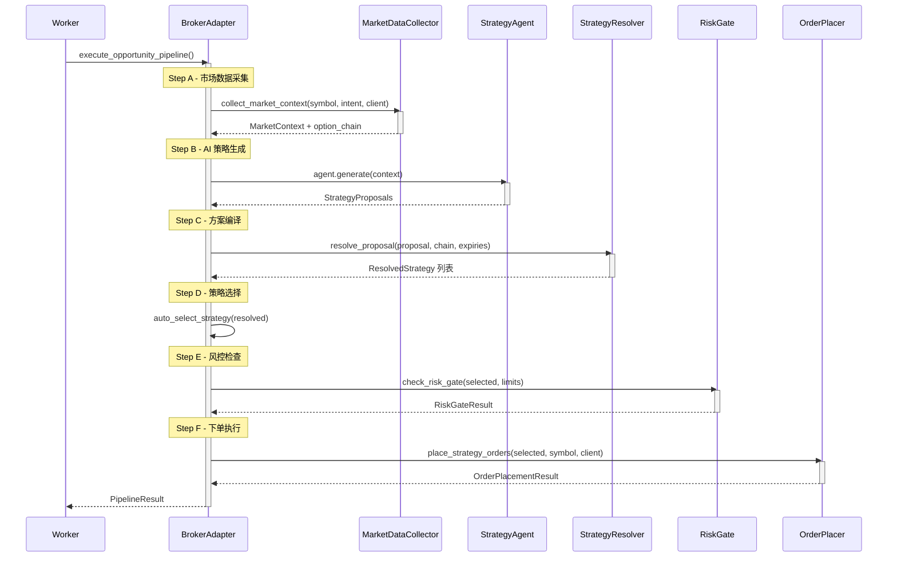
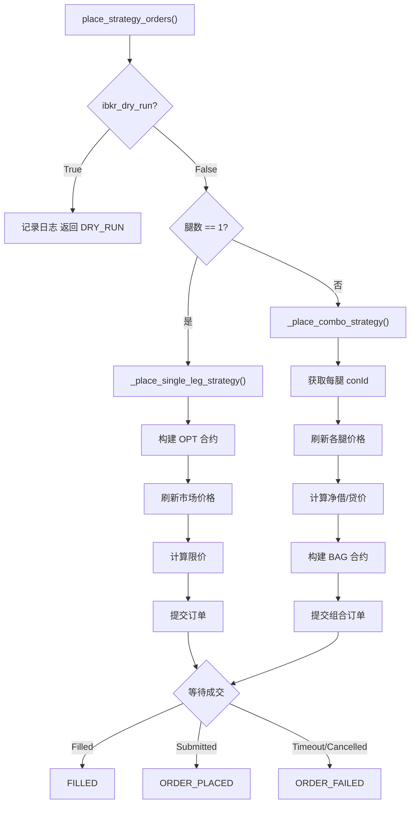

<!-- PAGE_ID: options_05_execution -->
<details>
<summary>📚 Relevant source files</summary>

The following files were used as context for generating this wiki page:

- [broker_adapter.py:1-328](https://github.com/ChunmiaoYu/options_ai_trader/blob/f5f3ac84e9c5d963fc1450f12306ea264183dfad/src/options_event_trader/services/broker_adapter.py#L1-L328)
- [order_placer.py:1-343](https://github.com/ChunmiaoYu/options_ai_trader/blob/f5f3ac84e9c5d963fc1450f12306ea264183dfad/src/options_event_trader/services/order_placer.py#L1-L343)
- [market_data_collector.py:1-470](https://github.com/ChunmiaoYu/options_ai_trader/blob/f5f3ac84e9c5d963fc1450f12306ea264183dfad/src/options_event_trader/services/market_data_collector.py#L1-L470)
- [native_client.py:1-522](https://github.com/ChunmiaoYu/options_ai_trader/blob/f5f3ac84e9c5d963fc1450f12306ea264183dfad/src/options_event_trader/integrations/ibkr/native_client.py#L1-L522)
- [contracts.py:1-93](https://github.com/ChunmiaoYu/options_ai_trader/blob/f5f3ac84e9c5d963fc1450f12306ea264183dfad/src/options_event_trader/integrations/ibkr/contracts.py#L1-L93)
- [risk_gate.py:1-48](https://github.com/ChunmiaoYu/options_ai_trader/blob/f5f3ac84e9c5d963fc1450f12306ea264183dfad/src/options_event_trader/services/risk_gate.py#L1-L48)
- [pipeline_db.py:1-79](https://github.com/ChunmiaoYu/options_ai_trader/blob/f5f3ac84e9c5d963fc1450f12306ea264183dfad/src/options_event_trader/services/pipeline_db.py#L1-L79)

</details>

# 执行层：下单与市场数据

> **Related Pages**: [[Agent2：策略生成器|04_strategy.md]], [[数据库与持久化|06_database.md]]

执行层是系统从"策略意图"到"真实订单"的核心桥梁。它以 6 步同步 Pipeline 为骨架，依次完成市场数据采集、AI 策略生成、确定性编译、策略选择、风控检查和订单执行。底层通过 IBKR TWS API 与 Interactive Brokers 交互，支持 dry-run、mock、paper 和 live 四种运行模式。

---

<!-- BEGIN:AUTOGEN options_05_execution_pipeline -->
## 6 步 Pipeline 编排

执行层的核心入口是 `execute_opportunity_pipeline()` 函数，它接收一个 Opportunity 的上下文信息，按严格的顺序执行 6 个步骤，每步独立捕获异常并返回带状态码的 `PipelineResult` ([broker_adapter.py:69-308](https://github.com/ChunmiaoYu/options_ai_trader/blob/f5f3ac84e9c5d963fc1450f12306ea264183dfad/src/options_event_trader/services/broker_adapter.py#L69-L308))。

### Pipeline 步骤总览

| 步骤 | 名称 | 输入 | 输出 | 失败状态 |
|------|------|------|------|----------|
| A | 市场数据采集 | symbol + UserIntent + IBKRClient | MarketContext + option_chain | `COLLECT_FAILED` |
| B | AI 策略生成 | MarketContext | StrategyProposals（排名方案列表） | `AI_FAILED` |
| C | 方案编译 | proposals + option_chain + expiries | ResolvedStrategy 列表 | `NO_VIABLE_STRATEGY` |
| D | 策略选择 | resolved strategies | 单个最佳 ResolvedStrategy | `NO_VIABLE_STRATEGY` |
| E | 风控门 | selected strategy + 风险参数 | RiskGateResult（pass/fail） | `RISK_BLOCKED` |
| F | 下单执行 | selected strategy + IBKRClient | OrderPlacementResult | `ORDER_FAILED` |

每个步骤完成后，系统通过 `update_strategy_run_status()` 更新数据库中的 StrategyRun 状态，并通过 `write_pipeline_event()` 写入 AuditEvent 审计记录 ([pipeline_db.py:32-60](https://github.com/ChunmiaoYu/options_ai_trader/blob/f5f3ac84e9c5d963fc1450f12306ea264183dfad/src/options_event_trader/services/pipeline_db.py#L32-L60))。

### Pipeline 时序图



### PipelineResult 状态码

Pipeline 执行的最终结果封装在 `PipelineResult` 数据类中 ([broker_adapter.py:45-53](https://github.com/ChunmiaoYu/options_ai_trader/blob/f5f3ac84e9c5d963fc1450f12306ea264183dfad/src/options_event_trader/services/broker_adapter.py#L45-L53))：

| 状态码 | 含义 | 触发条件 |
|--------|------|----------|
| `COMPLETED` | 订单已成交 | 所有腿 Filled |
| `ORDER_SUBMITTED` | 限价单已提交，等待成交 | 状态为 Submitted/PreSubmitted |
| `DRY_RUN_COMPLETE` | 模拟下单完成 | `settings.ibkr_dry_run=True` |
| `NO_VIABLE_STRATEGY` | 无可用策略 | 编译失败或所有方案置信度为 LOW |
| `RISK_BLOCKED` | 风控拦截 | `check_risk_gate` 返回 `passed=False` |
| `ORDER_FAILED` | 下单失败 | IBKR 返回非成功状态 |
| `COLLECT_FAILED` | 数据采集失败 | 无法获取股价或期权链 |
| `AI_FAILED` | AI 生成失败 | OpenAI 调用异常 |

### 策略自动选择逻辑

`auto_select_strategy()` 按 rank 升序排列，选择第一个置信度不为 LOW 的方案。若所有方案均为 LOW，则返回 `None`，Pipeline 终止于 `NO_VIABLE_STRATEGY` ([broker_adapter.py:55-66](https://github.com/ChunmiaoYu/options_ai_trader/blob/f5f3ac84e9c5d963fc1450f12306ea264183dfad/src/options_event_trader/services/broker_adapter.py#L55-L66))。

### 期权链数据清洗

在 Step C 编译之前，`_sanitize_chain()` 对原始期权链进行清洗：将 `None` 值替换为 `0.0`，过滤掉 delta、bid、ask 全为零的无效条目 ([broker_adapter.py:311-327](https://github.com/ChunmiaoYu/options_ai_trader/blob/f5f3ac84e9c5d963fc1450f12306ea264183dfad/src/options_event_trader/services/broker_adapter.py#L311-L327))。

Sources: [broker_adapter.py:1-328](https://github.com/ChunmiaoYu/options_ai_trader/blob/f5f3ac84e9c5d963fc1450f12306ea264183dfad/src/options_event_trader/services/broker_adapter.py#L1-L328), [pipeline_db.py:1-60](https://github.com/ChunmiaoYu/options_ai_trader/blob/f5f3ac84e9c5d963fc1450f12306ea264183dfad/src/options_event_trader/services/pipeline_db.py#L1-L60)
<!-- END:AUTOGEN options_05_execution_pipeline -->

---

<!-- BEGIN:AUTOGEN options_05_execution_market-data -->
## 市场数据采集

`collect_market_context()` 是市场数据的统一采集入口，负责从 IBKR 收集标的价格、历史 K 线、期权链元数据和期权快照，最终组装成 `MarketContext` 供 Agent2 策略生成器使用 ([market_data_collector.py:265-434](https://github.com/ChunmiaoYu/options_ai_trader/blob/f5f3ac84e9c5d963fc1450f12306ea264183dfad/src/options_event_trader/services/market_data_collector.py#L265-L434))。

### 采集流程

数据采集分为 6 个子步骤，其中前 3 步顺序执行（单次请求，毫秒级），第 4 步使用批量并行流式请求以优化性能：

| 子步骤 | 操作 | IBKR 调用 | 耗时 |
|--------|------|-----------|------|
| 1 | 获取历史 K 线（1 个月日线） | `request_historical_data()` | ~1s |
| 2 | 获取标的当前价格 | `request_market_data_snapshot()` | ~1s |
| 3 | 获取期权链元数据 + 选择行权价/到期日 | `request_option_secdef()` + `select_atm_strikes()` | ~1s |
| 4 | 批量并行采集所有期权合约快照 | `request_market_data_batch()` | ~3-8s |
| 5 | 构建可用到期日列表 | 内存计算 | <1ms |
| 6 | 组装 MarketContext | 内存计算 | <1ms |

### 到期日选择策略

`_select_target_expiries()` 从期权链中智能选择最多 3 个到期日，覆盖三个时间区间 ([market_data_collector.py:220-262](https://github.com/ChunmiaoYu/options_ai_trader/blob/f5f3ac84e9c5d963fc1450f12306ea264183dfad/src/options_event_trader/services/market_data_collector.py#L220-L262))：

| 区间 | DTE 范围 | 目标 |
|------|----------|------|
| 近期周度 | 2-6 天 | 短期事件交易 |
| 中期 | 7-15 天 | 标准期权策略 |
| 远期 | 16-45 天 | 长周期策略 |

最小 DTE 过滤阈值为 2 天（`min_dte=2`），避免即将到期的合约。若三个区间均无合约，则回退选择最近的可用到期日。

### 行权价选择

系统使用 `select_atm_strikes()` 选择 ATM 附近 7 个行权价（`num_strikes=7`），覆盖平值上下各 3 档 ([market_data_collector.py:318-319](https://github.com/ChunmiaoYu/options_ai_trader/blob/f5f3ac84e9c5d963fc1450f12306ea264183dfad/src/options_event_trader/services/market_data_collector.py#L318-L319))。每个到期日的每个行权价同时采集看涨（C）和看跌（P）两个方向，总合约数 = 到期日数 x 行权价数 x 2。

### 批量并行数据采集

当 IBKR 客户端支持 `request_market_data_batch()` 时，所有期权合约的行情请求同时发出，统一等待 8 秒后批量取消，显著优于逐个请求的串行模式 ([market_data_collector.py:340-355](https://github.com/ChunmiaoYu/options_ai_trader/blob/f5f3ac84e9c5d963fc1450f12306ea264183dfad/src/options_event_trader/services/market_data_collector.py#L340-L355))。

### Tick 数据解析

#### 股价提取

`extract_stock_price_from_ticks()` 按优先级提取股票价格 ([market_data_collector.py:130-148](https://github.com/ChunmiaoYu/options_ai_trader/blob/f5f3ac84e9c5d963fc1450f12306ea264183dfad/src/options_event_trader/services/market_data_collector.py#L130-L148))：

1. `LAST`（tick_type=4）—— 实时最新价
2. `DELAYED_LAST`（tick_type=68）—— 延迟最新价
3. `CLOSE`（tick_type=9）—— 收盘价
4. `DELAYED_CLOSE`（tick_type=75）—— 延迟收盘价

值为 `-1` 的 tick 被视为 IBKR"不可用"标记，自动跳过。

#### 期权数据提取

`extract_option_data_from_ticks()` 从 tick 数据中提取 9 个字段 ([market_data_collector.py:151-214](https://github.com/ChunmiaoYu/options_ai_trader/blob/f5f3ac84e9c5d963fc1450f12306ea264183dfad/src/options_event_trader/services/market_data_collector.py#L151-L214))：

| 字段 | 来源 | 说明 |
|------|------|------|
| `bid` | tick_type 1 / 66 | 买价（优先实时） |
| `ask` | tick_type 2 / 67 | 卖价（优先实时） |
| `delta` | optionComputation | Delta 希腊值 |
| `gamma` | optionComputation | Gamma 希腊值 |
| `theta` | optionComputation | Theta 希腊值 |
| `vega` | optionComputation | Vega 希腊值 |
| `iv` | optionComputation | 隐含波动率 |
| `volume` | tick_type 8 | 日成交量 |
| `open_interest` | tick_type 27 | 未平仓合约数 |

Greeks 数据通过 `tickOptionComputation` 回调获取，值为 `-2.0` 或 `-1.0` 的 IBKR 哨兵值被过滤。

### 波动率与价格变动计算

系统从历史 K 线计算两类衍生指标：

**价格变动** (`calculate_price_changes()`)：计算 1 日、5 日、20 日的百分比变动 ([market_data_collector.py:50-86](https://github.com/ChunmiaoYu/options_ai_trader/blob/f5f3ac84e9c5d963fc1450f12306ea264183dfad/src/options_event_trader/services/market_data_collector.py#L50-L86))。

**历史波动率** (`calculate_historical_volatility()`)：使用收盘价的对数收益率标准差，年化系数为 sqrt(252)，分别计算 5 日和 20 日 HV ([market_data_collector.py:89-124](https://github.com/ChunmiaoYu/options_ai_trader/blob/f5f3ac84e9c5d963fc1450f12306ea264183dfad/src/options_event_trader/services/market_data_collector.py#L89-L124))。

**IV vs HV 信号**：ATM 隐含波动率与 20 日历史波动率的比值超过 1.15 为 `IV_PREMIUM`，低于 0.85 为 `IV_DISCOUNT`，介于之间为 `NEUTRAL` ([market_data_collector.py:440-449](https://github.com/ChunmiaoYu/options_ai_trader/blob/f5f3ac84e9c5d963fc1450f12306ea264183dfad/src/options_event_trader/services/market_data_collector.py#L440-L449))。

Sources: [market_data_collector.py:1-470](https://github.com/ChunmiaoYu/options_ai_trader/blob/f5f3ac84e9c5d963fc1450f12306ea264183dfad/src/options_event_trader/services/market_data_collector.py#L1-L470)
<!-- END:AUTOGEN options_05_execution_market-data -->

---

<!-- BEGIN:AUTOGEN options_05_execution_order-placer -->
## 订单执行

`place_strategy_orders()` 是订单执行的统一入口，根据策略腿数自动选择单腿 OPT 订单或多腿 BAG 组合订单 ([order_placer.py:44-75](https://github.com/ChunmiaoYu/options_ai_trader/blob/f5f3ac84e9c5d963fc1450f12306ea264183dfad/src/options_event_trader/services/order_placer.py#L44-L75))。

### 运行模式

系统支持三种下单模式，由 `settings.ibkr_dry_run` 和 `settings.ibkr_mock` 控制 ([settings.py:35-36](https://github.com/ChunmiaoYu/options_ai_trader/blob/f5f3ac84e9c5d963fc1450f12306ea264183dfad/src/options_event_trader/settings.py#L35-L36))：

| 模式 | 配置 | 行为 |
|------|------|------|
| Dry-run | `ibkr_dry_run=True` | 仅记录日志，不连接 IBKR，返回 `DRY_RUN` |
| Mock | `ibkr_mock=True` | 使用 MockIBKRClient，模拟成交 |
| Live/Paper | 两者均 `False` | 连接真实 TWS，提交到交易所 |

### 订单分流逻辑



### 单腿订单（OPT）

单腿策略通过 `_place_single_leg()` 执行 ([order_placer.py:291-340](https://github.com/ChunmiaoYu/options_ai_trader/blob/f5f3ac84e9c5d963fc1450f12306ea264183dfad/src/options_event_trader/services/order_placer.py#L291-L340))，流程如下：

1. **刷新价格**：通过 `_refresh_leg_price()` 请求实时快照，BUY 取 ask，SELL 取 bid ([order_placer.py:230-255](https://github.com/ChunmiaoYu/options_ai_trader/blob/f5f3ac84e9c5d963fc1450f12306ea264183dfad/src/options_event_trader/services/order_placer.py#L230-L255))
2. **计算限价**：BUY 在 ask 上加 $0.02 缓冲，SELL 在 bid 上减 $0.02 缓冲，最低 $0.01 ([order_placer.py:258-263](https://github.com/ChunmiaoYu/options_ai_trader/blob/f5f3ac84e9c5d963fc1450f12306ea264183dfad/src/options_event_trader/services/order_placer.py#L258-L263))
3. **消费 Order ID**：从 IBKR 的 `nextValidId` 序列获取唯一 ID
4. **构建合约**：使用 `option_contract()` 创建 OPT 类型合约 ([contracts.py:43-55](https://github.com/ChunmiaoYu/options_ai_trader/blob/f5f3ac84e9c5d963fc1450f12306ea264183dfad/src/options_event_trader/integrations/ibkr/contracts.py#L43-L55))
5. **构建订单**：LMT 限价单，DAY 有效期，`eTradeOnly=False`，`firmQuoteOnly=False`
6. **提交并等待**：通过 `placeOrder()` 提交，`_wait_for_fill()` 轮询状态

### 多腿订单（BAG 组合）

多腿策略通过 `_place_combo_strategy()` 作为单个 BAG 组合订单提交，让 IBKR 按组合保证金计算（而非将每腿视为裸头寸） ([order_placer.py:120-224](https://github.com/ChunmiaoYu/options_ai_trader/blob/f5f3ac84e9c5d963fc1450f12306ea264183dfad/src/options_event_trader/services/order_placer.py#L120-L224))。流程分 5 步：

**Step 1 — 获取 conId**：对每条腿调用 `request_contract_details_raw()` 获取 IBKR 合约 ID。任何一腿获取失败，整个订单中止。

**Step 2 — 刷新价格并计算净价**：逐腿刷新实时价格，BUY 腿取 `ask + $0.02`，SELL 腿取 `bid - $0.02`。累加得到净价：正值为净借方（debit），负值为净贷方（credit） ([order_placer.py:159-177](https://github.com/ChunmiaoYu/options_ai_trader/blob/f5f3ac84e9c5d963fc1450f12306ea264183dfad/src/options_event_trader/services/order_placer.py#L159-L177))。

**Step 3 — 构建 BAG 合约**：使用 `combo_contract()` 将所有 `ComboLegSpec`（含 conId、action、ratio）打包成一个 `secType="BAG"` 的组合合约 ([contracts.py:67-93](https://github.com/ChunmiaoYu/options_ai_trader/blob/f5f3ac84e9c5d963fc1450f12306ea264183dfad/src/options_event_trader/integrations/ibkr/contracts.py#L67-L93))。

**Step 4 — 构建订单**：组合方向根据净价自动判断——净借方用 `BUY`，净贷方用 `SELL`（IBKR 要求 lmtPrice 为正数）([order_placer.py:170-176](https://github.com/ChunmiaoYu/options_ai_trader/blob/f5f3ac84e9c5d963fc1450f12306ea264183dfad/src/options_event_trader/services/order_placer.py#L170-L176))。

**Step 5 — 提交并等待**：与单腿相同的轮询等待逻辑。

### 价格缓冲与限价策略

系统使用 `_PRICE_BUFFER = 0.02` 美元的价格缓冲来提高成交概率 ([order_placer.py:29](https://github.com/ChunmiaoYu/options_ai_trader/blob/f5f3ac84e9c5d963fc1450f12306ea264183dfad/src/options_event_trader/services/order_placer.py#L29))：

- **BUY 方向**：限价 = ask + $0.02（愿意多付一点以确保成交）
- **SELL 方向**：限价 = bid - $0.02（愿意少收一点以确保成交）
- **最低价格**：$0.01（`_MIN_PRICE`），防止零价格订单

当实时价格不可用时，回退使用 `leg.ref_price`（策略编译阶段保存的参考价格）([order_placer.py:247-254](https://github.com/ChunmiaoYu/options_ai_trader/blob/f5f3ac84e9c5d963fc1450f12306ea264183dfad/src/options_event_trader/services/order_placer.py#L247-L254))。

### 订单状态轮询

`_wait_for_fill()` 以 250ms 间隔轮询 `order_updates` 字典，等待 IBKR 回调返回终态 ([order_placer.py:266-288](https://github.com/ChunmiaoYu/options_ai_trader/blob/f5f3ac84e9c5d963fc1450f12306ea264183dfad/src/options_event_trader/services/order_placer.py#L266-L288))。终态集合为：

```
Filled, Submitted, PreSubmitted, Inactive, Cancelled, ApiCancelled
```

超时（默认 15 秒，由 `settings.ibkr_request_timeout_sec` 配置）后返回 `"Timeout"` 状态。

### 合约类型

系统使用三种 IBKR 合约类型 ([contracts.py:1-93](https://github.com/ChunmiaoYu/options_ai_trader/blob/f5f3ac84e9c5d963fc1450f12306ea264183dfad/src/options_event_trader/integrations/ibkr/contracts.py#L1-L93))：

| 合约类型 | secType | 构造函数 | 用途 |
|----------|---------|----------|------|
| 股票 | `STK` | `stock_contract(StockRequest)` | 获取标的价格和期权链 |
| 期权 | `OPT` | `option_contract(OptionRequest)` | 单腿订单和行情快照 |
| 组合 | `BAG` | `combo_contract(symbol, legs)` | 多腿价差/组合策略 |

Sources: [order_placer.py:1-343](https://github.com/ChunmiaoYu/options_ai_trader/blob/f5f3ac84e9c5d963fc1450f12306ea264183dfad/src/options_event_trader/services/order_placer.py#L1-L343), [contracts.py:1-93](https://github.com/ChunmiaoYu/options_ai_trader/blob/f5f3ac84e9c5d963fc1450f12306ea264183dfad/src/options_event_trader/integrations/ibkr/contracts.py#L1-L93)
<!-- END:AUTOGEN options_05_execution_order-placer -->

---

<!-- BEGIN:AUTOGEN options_05_execution_ibkr-client -->
## IBKR TWS 客户端

`IBKRClient` 继承自 `ibapi` 的 `EWrapper` 和 `EClient`，是系统与 IBKR TWS/Gateway 的唯一通信层 ([native_client.py:43-49](https://github.com/ChunmiaoYu/options_ai_trader/blob/f5f3ac84e9c5d963fc1450f12306ea264183dfad/src/options_event_trader/integrations/ibkr/native_client.py#L43-L49))。

### 连接管理

客户端通过 `connect_and_start()` 建立连接 ([native_client.py:89-102](https://github.com/ChunmiaoYu/options_ai_trader/blob/f5f3ac84e9c5d963fc1450f12306ea264183dfad/src/options_event_trader/integrations/ibkr/native_client.py#L89-L102))：

1. 调用 `EClient.connect(host, port, client_id)` 建立 TCP 连接
2. 启动后台守护线程 `ibkr-api-loop` 运行 `self.run()` 事件循环
3. 等待 `_connected` 事件（由 `nextValidId` 回调触发），超时由 `ibkr_connect_timeout_sec` 控制（默认 10 秒）

关键连接参数 ([settings.py:28-36](https://github.com/ChunmiaoYu/options_ai_trader/blob/f5f3ac84e9c5d963fc1450f12306ea264183dfad/src/options_event_trader/settings.py#L28-L36))：

| 参数 | 默认值 | 说明 |
|------|--------|------|
| `ibkr_host` | `127.0.0.1` | TWS/Gateway 主机地址 |
| `ibkr_port` | `7497` | Paper 端口（Live 用 7496） |
| `ibkr_client_id` | `27` | 客户端唯一标识 |
| `ibkr_connect_timeout_sec` | `10` | 连接握手超时 |
| `ibkr_request_timeout_sec` | `15` | 单次请求超时 |
| `ibkr_market_data_type` | `3` | 市场数据类型（3=延迟） |

### 线程模型

IBKR API 采用单线程事件循环 + 回调模式：

- **事件循环线程**（`ibkr-api-loop`）：守护线程，运行 `EClient.run()`，负责读取 TCP socket 并分发回调
- **主线程**：发出请求（`reqMktData`、`placeOrder` 等），通过 `threading.Event` 阻塞等待回调完成
- **线程安全**：`_lock`（`RLock`）保护 `next_order_id` 的原子读写 ([native_client.py:81-87](https://github.com/ChunmiaoYu/options_ai_trader/blob/f5f3ac84e9c5d963fc1450f12306ea264183dfad/src/options_event_trader/integrations/ibkr/native_client.py#L81-L87))

### 请求-响应模式

所有 IBKR 请求使用统一的"请求 ID + Event 等待"模式：

1. 生成递增的 `req_id`（起始值 1000）([native_client.py:78-79](https://github.com/ChunmiaoYu/options_ai_trader/blob/f5f3ac84e9c5d963fc1450f12306ea264183dfad/src/options_event_trader/integrations/ibkr/native_client.py#L78-L79))
2. 创建 `threading.Event` 存入对应字典
3. 发出 IBKR 请求
4. `Event.wait(timeout)` 阻塞等待
5. 回调方法触发 `Event.set()` 唤醒主线程

### 支持的 API 请求

| 方法 | IBKR 调用 | 用途 |
|------|-----------|------|
| `request_managed_accounts()` | `reqManagedAccts()` | 获取账户列表 |
| `request_account_summary()` | `reqAccountSummary()` | 获取账户资金数据 |
| `request_contract_details()` | `reqContractDetails()` | 获取合约详情（含 conId） |
| `request_contract_details_raw()` | `reqContractDetails()` | 通用合约详情查询 |
| `request_option_secdef()` | `reqSecDefOptParams()` | 获取期权链元数据 |
| `request_market_data_snapshot()` | `reqMktData(snapshot=True)` | 单次行情快照 |
| `request_market_data_streaming()` | `reqMktData(snapshot=False)` | 流式行情（采集 N 秒） |
| `request_market_data_batch()` | 多个 `reqMktData()` 并行 | 批量行情采集 |
| `request_historical_data()` | `reqHistoricalData()` | 历史 K 线数据 |
| `place_what_if_option_order()` | `placeOrder(whatIf=True)` | 模拟下单查询保证金 |

### 批量行情采集

`request_market_data_batch()` 是性能优化的关键方法 ([native_client.py:246-275](https://github.com/ChunmiaoYu/options_ai_trader/blob/f5f3ac84e9c5d963fc1450f12306ea264183dfad/src/options_event_trader/integrations/ibkr/native_client.py#L246-L275))。它一次性发出所有 `reqMktData` 请求（streaming 模式），统一等待 `collect_sec` 秒后批量取消。这种方式比逐个请求+等待的串行模式快数倍，特别适合需要同时采集数十个期权合约数据的场景。

### 回调处理

客户端实现了以下核心回调方法：

| 回调 | 触发时机 | 存储位置 |
|------|----------|----------|
| `nextValidId` | 连接握手完成 | `self.next_order_id` |
| `contractDetails` / `contractDetailsEnd` | 合约详情响应 | `contract_details_by_req` |
| `securityDefinitionOptionParameter` | 期权链元数据 | `option_secdefs_by_req` |
| `tickPrice` / `tickSize` / `tickGeneric` / `tickString` | 行情 tick 数据 | `market_data_ticks` |
| `tickOptionComputation` | 期权 Greeks 和 IV | `market_data_ticks` |
| `tickSnapshotEnd` | 快照数据完成 | 触发 `Event.set()` |
| `openOrder` / `orderStatus` | 订单状态变更 | `order_updates` |
| `execDetails` | 成交明细 | `order_updates` |
| `commissionReport` | 佣金报告 | `order_updates`（归入最近的 orderId） |
| `historicalData` / `historicalDataEnd` | 历史 K 线 | `_historical_data` |
| `error` | 错误通知 | `self.errors`（`ErrorEvent` 列表） |

### 依赖隔离

`ibapi` 库通过 `try/except ImportError` 做条件导入 ([native_client.py:15-28](https://github.com/ChunmiaoYu/options_ai_trader/blob/f5f3ac84e9c5d963fc1450f12306ea264183dfad/src/options_event_trader/integrations/ibkr/native_client.py#L15-L28))，未安装时回退为 `object`，保证测试和 dry-run 场景无需安装 IBKR 官方 SDK。实际创建 `IBKRClient` 实例时若 `ibapi` 不可用，抛出 `IBKRAvailabilityError`。

Sources: [native_client.py:1-522](https://github.com/ChunmiaoYu/options_ai_trader/blob/f5f3ac84e9c5d963fc1450f12306ea264183dfad/src/options_event_trader/integrations/ibkr/native_client.py#L1-L522), [settings.py:28-36](https://github.com/ChunmiaoYu/options_ai_trader/blob/f5f3ac84e9c5d963fc1450f12306ea264183dfad/src/options_event_trader/settings.py#L28-L36)
<!-- END:AUTOGEN options_05_execution_ibkr-client -->

---
