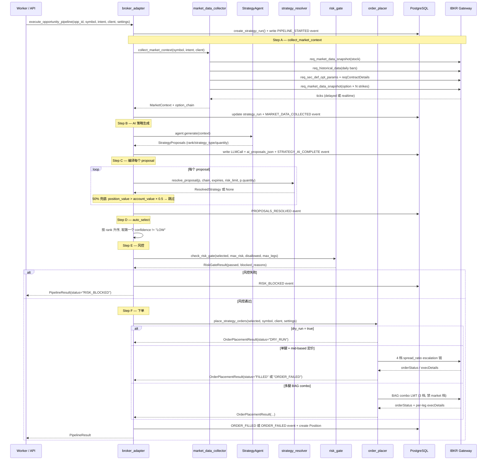
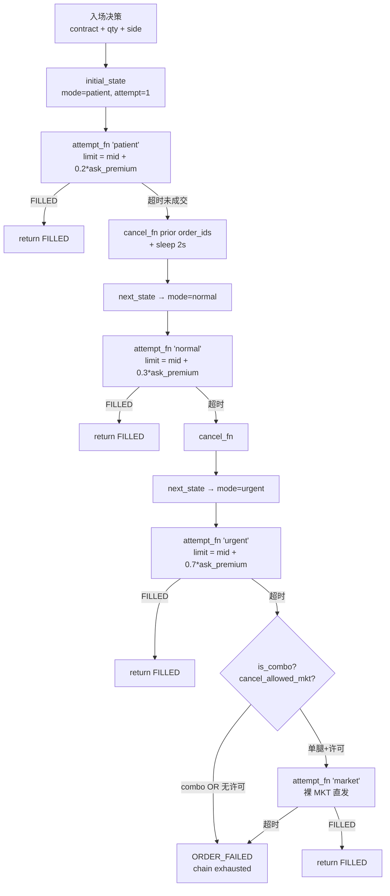
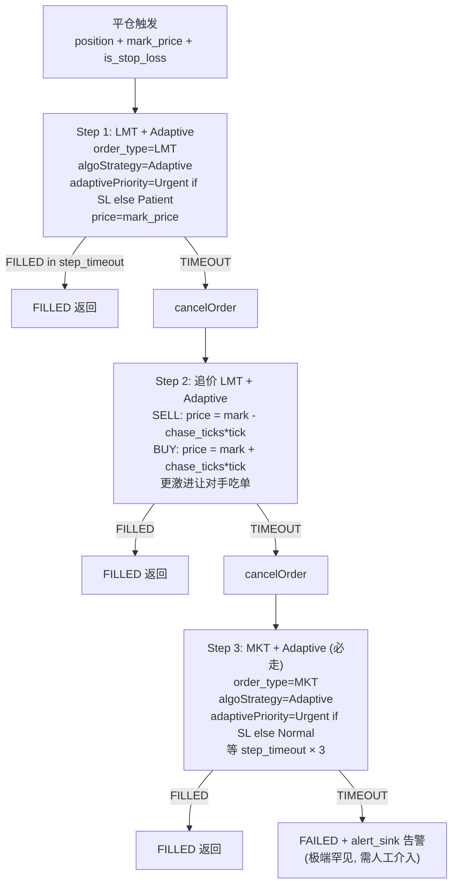

<!-- PAGE_ID: options_05_execution -->
<details>
<summary>📚 Relevant source files</summary>

The following files were used as context for generating this wiki page (commit `6b3d159`):

- [broker_adapter.py](https://github.com/ChunmiaoYu/options_ai_trader/blob/6b3d159/src/options_event_trader/services/broker_adapter.py)
- [order_placer.py](https://github.com/ChunmiaoYu/options_ai_trader/blob/6b3d159/src/options_event_trader/services/order_placer.py)
- [exit_order_placer.py](https://github.com/ChunmiaoYu/options_ai_trader/blob/6b3d159/src/options_event_trader/services/exit_order_placer.py)
- [entry_escalation.py](https://github.com/ChunmiaoYu/options_ai_trader/blob/6b3d159/src/options_event_trader/services/entry_escalation.py)
- [upgrade_chain.py](https://github.com/ChunmiaoYu/options_ai_trader/blob/6b3d159/src/options_event_trader/services/upgrade_chain.py)
- [pricing.py](https://github.com/ChunmiaoYu/options_ai_trader/blob/6b3d159/src/options_event_trader/services/pricing.py)
- [market_data_collector.py](https://github.com/ChunmiaoYu/options_ai_trader/blob/6b3d159/src/options_event_trader/services/market_data_collector.py)
- [strategy_resolver.py](https://github.com/ChunmiaoYu/options_ai_trader/blob/6b3d159/src/options_event_trader/services/strategy_resolver.py)
- [position_monitor.py](https://github.com/ChunmiaoYu/options_ai_trader/blob/6b3d159/src/options_event_trader/services/position_monitor.py)
- [worker/loop.py](https://github.com/ChunmiaoYu/options_ai_trader/blob/6b3d159/src/options_event_trader/worker/loop.py)
- [integrations/ibkr/native_client.py](https://github.com/ChunmiaoYu/options_ai_trader/blob/6b3d159/src/options_event_trader/integrations/ibkr/native_client.py)
- [docs/superpowers/specs/2026-05-06-split-order-adaptive-design.md](https://github.com/ChunmiaoYu/options_ai_trader/blob/6b3d159/docs/superpowers/specs/2026-05-06-split-order-adaptive-design.md)

</details>

# 执行层：下单与市场数据

> **Related Pages**: [[Agent2：策略决策器|04_strategy.md]], [[数据库与持久化|06_database.md]]

执行层是系统从"AI 决策"到"真实订单"的最后一公里。本文档把执行层从两个维度同时讲清：**当前代码到底怎么跑**（commit `6b3d159` 状态下，broker_adapter 6 步同步 pipeline 仍在 worker `while True` 主循环里跑）+ **北极星目标怎么对齐**（4 个 Pool/Client 抽象 + OrderClient 独占 + 8 event_type handler 任务驱动）。两条线之间有 in-flight 的 gap，本文档每节都显式标"已实施 / 待实施"避免误导。

执行层涉及的代码骨干：
- `services/broker_adapter.py` 编排 6 步 pipeline（Step A 数据 → Step F 下单）
- `services/order_placer.py` 单腿 OPT 与 BAG combo 入场下单
- `services/exit_order_placer.py` 平仓升级链 LMT → 追价 → MKT 必须走到底
- `services/entry_escalation.py` + `services/upgrade_chain.py` 入场 4 档 spread_ratio
- `services/pricing.py` 限价单 mid-based 定价（invariant 21 规则的纯函数实现）
- `services/market_data_collector.py` Step A 把 IBKR 行情打包成 MarketContext
- `services/position_monitor.py` 持仓 PnL 跟踪 + 退出条件评估
- `worker/loop.py` 主循环 + reconnect resubscribe
- `integrations/ibkr/native_client.py` 真实 IBKR EWrapper/EClient 长连
- `docs/superpowers/specs/2026-05-06-split-order-adaptive-design.md` Phase C 拆批下单 spec（已 ship 待实施）

---

<!-- BEGIN:AUTOGEN options_05_execution_orderclient -->

## 1. OrderClient 抽象（北极星 client_id 30，独占）

### 1.1 为什么需要 OrderClient 抽象

直觉上"下单 = 调一下 IBKR `placeOrder`"听起来很简单，但 IBKR API 协议是 **EWrapper / EClient 异步双向消息模型**：

- 你调 `placeOrder(...)` 这一步只是把订单请求**写到 socket**（异步、立即返回，不带成交结果）
- IBKR 处理后，通过**同一个 socket 反向推**多种事件回来：`orderStatus`（订单状态变化）、`openOrder`（订单状态镜像）、`execDetails`（每笔成交细节）、`commissionReport`（手续费）
- 客户端的 EWrapper 监听 socket → 收到事件 → 调对应 callback（你预先注册的 `onOrderStatus` / `onExecDetails`）

所以"发请求"和"收响应"是**两个独立动作**，中间随时可能有响应推回来。如果业务代码各处散落直接调 `ibkr_client.placeOrder(...)`，会产生几个问题：

1. **订单状态混乱**：多个调用方共用同一 socket，A 的 callback 可能漏 B 的事件，或抢着读 `order_updates` dict
2. **client_id 互踢**：IBKR 同账户同 client_id 不能同时连两次，散落代码各自 connect 必然冲突
3. **重连恢复失控**：连接断后业务层如果不知道，下一次 `placeOrder` 直接 silent fail
4. **审计 / 拆单算法**插桩没地方放（每个调用方都要自己写）

**OrderClient 的职责**就是把 `placeOrder` / `cancelOrder` / `modifyOrder` 收口到唯一一个 long-lived socket（client_id = 30），所有业务代码必须经它转发。

### 1.2 OrderClient 在北极星里的位置

OrderClient 是 4 个基础设施 Pool/Client 之一，对应业务代码访问 IBKR 的 4 个独立长连：

| Pool/Client | 职责 | client_id | 模式 |
|------------|------|-----------|------|
| **MarketDataPool** | 持续订阅市场数据（实时 tick / 期权报价）+ 引用计数去重 | 10-19 | Push (IBKR 推 tick) + Pull (cache 拉最新) |
| **QueryClient** | 一次性 query（历史 K 线 / 期权链 / contract details） | 20 | Pull (问一次答一次) |
| **OrderClient** | 下单 / 撤单 / 修改，独占防订单状态混乱 | **30** | Push (IBKR 推 orderStatus) + Pull (我们发 placeOrder) |
| **AccountSnapshotClient** | 账户余额 / 持仓 / 订单状态，cache TTL 5 秒 | 40 | Pull (按需拉, cache 去重) |

OrderClient 同时承担两种通信方向：

- **Pull（业务主动）**：`place_split_order(...)` / `cancel_order(order_id)` / `modify_order(order_id, new_price)`
- **Push（IBKR 主动）**：`onOrderStatus`、`onOpenOrder`、`onExecDetails` 三类回调写 `orders` / `fills` 表，累计 FILLED 后塞 `ENTRY_FILLED` / `EXIT_FILLED` 事件到 `workflow_tasks`

### 1.3 当前实施状态（诚实说明）

**OrderClient 抽象层在 commit `6b3d159` 状态下尚未真实施**。当前下单代码直接调 `ibkr_client.placeOrder(order_id, contract, order)` 而不是过 OrderClient wrapper（见 [order_placer.py:503](https://github.com/ChunmiaoYu/options_ai_trader/blob/6b3d159/src/options_event_trader/services/order_placer.py#L503)、[order_placer.py:835](https://github.com/ChunmiaoYu/options_ai_trader/blob/6b3d159/src/options_event_trader/services/order_placer.py#L835)、[exit_order_placer.py:274](https://github.com/ChunmiaoYu/options_ai_trader/blob/6b3d159/src/options_event_trader/services/exit_order_placer.py#L274)）。

`ibkr_client` 是 `IBKRClient(EWrapper, EClient)`（[native_client.py:104](https://github.com/ChunmiaoYu/options_ai_trader/blob/6b3d159/src/options_event_trader/integrations/ibkr/native_client.py#L104)），单 client_id 长连，目前全系统共用一个实例（worker 启动时 `create_ibkr_client(settings)` 一次创建，传入所有下游服务）。也就是说"独占"在物理层已经做到（一个 IBKRClient 实例），但"4 段 client_id 隔离"和"业务代码必走 OrderClient wrapper"的 forward compat hook **待 P0 worker handler 重构同步实施**（见 finding `F-2026-05-07-WORKER-HANDLER-IMPLEMENTATION`）。

迁移到 OrderClient 抽象时，`order_placer.py` / `exit_order_placer.py` 里所有 `ibkr_client.placeOrder` / `ibkr_client.cancelOrder` 调用要改成 `OrderClient.place_split_order(...)` / `OrderClient.cancel(...)`，业务层不再持有原始 ibapi 对象。这是北极星 §5 forward compat hook 之一（"业务代码必走 4 个 Pool/Client 抽象"），任何 PR 不能踩坏。

### 1.4 长连本质

直觉上你可能以为"只有 MarketDataPool 需要长连（因为持续推 tick），其他 Pool/Client 一问一答应该短连"。实际 4 个 Pool/Client **全部走长连**，原因：

- 短连每次 connect 要重做 ibapi handshake（auth + version negotiation, ~1-2 秒）
- 短连关闭瞬间如果有响应在路上，直接丢（IBKR 不重发）
- 订单状态推送 / 账户变化推送 / 错误码推送都收不到

**心跳是副产品，不是主因**：长连后 IBKR 每 1 秒 ping 一次，客户端 30 秒不响应被 IBKR 主动断。心跳让"连接还活着"可检测，但目的是**维持响应通道**，不是为了心跳本身。

4 个独立 socket、互不阻塞（OrderClient 在等下单响应不影响 MarketDataPool 收 tick），全部用同一份长连协议。

Sources: [native_client.py:104-184](https://github.com/ChunmiaoYu/options_ai_trader/blob/6b3d159/src/options_event_trader/integrations/ibkr/native_client.py#L104-L184), [memory project_vision_and_north_star.md §1 (2026-05-07)](https://github.com/ChunmiaoYu/options_ai_trader/blob/6b3d159/CLAUDE.md), [docs/superpowers/specs/architecture-walkthrough.md §3](https://github.com/ChunmiaoYu/options_ai_trader/blob/6b3d159/docs/superpowers/specs/architecture-walkthrough.md)

<!-- END:AUTOGEN options_05_execution_orderclient -->

---

<!-- BEGIN:AUTOGEN options_05_execution_pipeline -->

## 2. 当前 broker_adapter.py 6 步 Pipeline

执行层当前代码骨架是 `execute_opportunity_pipeline()` 函数，从 worker 主循环或 API 直接触发，按严格的顺序跑 6 个独立 step。每个 step 自己 `try / except` 捕获异常并返回带状态码的 `PipelineResult`，前一步失败立即短路返回，不进下一步。

### 2.1 Pipeline 6 步表

| 步骤 | 名称 | 入口函数 | 输入 | 输出 | 失败状态 |
|------|------|---------|------|------|----------|
| **A** | 市场数据采集 | `market_data_collector.collect_market_context()` | symbol + UserIntent + ibkr_client | MarketContext + option_chain | `COLLECT_FAILED` |
| **B** | AI 策略生成 | `agents.strategy_agent.StrategyAgent.generate()` | MarketContext | StrategyProposals | `AI_FAILED` |
| **C** | 方案编译 | `strategy_resolver.resolve_proposal()` × N | proposals + option_chain + expiries | ResolvedStrategy 列表 | `NO_VIABLE_STRATEGY` |
| **D** | 自动选择 | `broker_adapter.auto_select_strategy()` | resolved strategies | 单个 ResolvedStrategy | `NO_VIABLE_STRATEGY` |
| **E** | 风控门 | `risk_gate.check_risk_gate()` | selected strategy + 风险参数 | RiskGateResult | `RISK_BLOCKED` |
| **F** | 下单执行 | `order_placer.place_strategy_orders()` | selected strategy + ibkr_client | OrderPlacementResult | `ORDER_FAILED` |

每步完成后通过 `update_strategy_run_status()` 更新数据库 `StrategyRun` 记录的 `status` 列，并通过 `write_pipeline_event()` 写一条 AuditEvent。这两个调用是审计的关键——任何异常状态机进展都能在 DB 时序上重放。

### 2.2 Pipeline 时序图



### 2.3 PipelineResult 状态码

`PipelineResult` 是一个 dataclass，把 6 步任意中断点的全部上下文打包成一个对象返回（[broker_adapter.py:58-67](https://github.com/ChunmiaoYu/options_ai_trader/blob/6b3d159/src/options_event_trader/services/broker_adapter.py#L58-L67)）。状态码语义：

| status | 触发条件 | position_id 是否非空 |
|--------|---------|-------------------|
| `COLLECT_FAILED` | Step A 失败（IBKR 行情拿不到 / option_chain 空） | 否 |
| `AI_FAILED` | Step B 失败（LLM 报错 / 解析失败 / 验证 schema 失败） | 否 |
| `NO_VIABLE_STRATEGY` | Step C 全部 proposal 编译失败 / Step D 全部 LOW confidence | 否 |
| `RISK_BLOCKED` | Step E 风控拦截 | 否 |
| `DRY_RUN_COMPLETE` | settings.ibkr_dry_run = True，Step F 不真下单 | 否 |
| `ORDER_FAILED` | Step F 下单失败（含组合订单孤腿） | 视 orphan_leg 情况而定 |
| `ORDER_SUBMITTED` | Step F 单腿 ACK 但未成交（Submitted/PreSubmitted） | 否 |
| `COMPLETED` | Step F FILLED + Position 已落 DB | 是 |

#### 失败终态归类（2026-05-15 round 4 sync）

业务层"失败"大状态最终归一到一组语义化失败原因（spec `north-star-v1-target.md` §5.1.1 + §16），不再让用户读 status code。当前 round 4 后失败原因列表：

| 失败原因（业务可见） | 来源 status / 触发路径 |
|------|------|
| AI 决策失败 | `COLLECT_FAILED` / `AI_FAILED` / `NO_VIABLE_STRATEGY` |
| 风控拒绝 | `RISK_BLOCKED` |
| 下单失败 | `ORDER_FAILED`（入场链穷尽未成交 / IBKR reject） |
| Agent-2 永久拒绝 | Agent 2 entry 输出 `rejection_type=PERMANENT`（无可行方案 / 用户意图违反市场结构）→ 立即转 FAILED，不进 Step F |
| **窗口过期未入场** | review_phase=ENTRY 留在 ACTIVE_MONITORING 等下一 review，最终 `EXPIRE_OPPORTUNITY` handler 检测 entry_window 已过期 → FAILED |

注：`AI_FAILED`（基础设施级 LLM 错误）跟 `Agent-2 永久拒绝`（业务级决策"做不了"）是两种不同语义，前者重试可能成功，后者重试也是同样结论。

### 2.4 Step C 50% 兜底（路径 B 替换的临时红线）

Step C 在编译每个 proposal 后，加一道**临时 50% 红线兜底**（[broker_adapter.py:207-220](https://github.com/ChunmiaoYu/options_ai_trader/blob/6b3d159/src/options_event_trader/services/broker_adapter.py#L207-L220)）：

```python
if account_value and account_value > 0:
    position_value = abs(r.net_debit) * 100 * r.quantity
    pct = position_value / account_value
    if pct > 0.5:
        # 跳过这个 proposal, 不进 resolved
        continue
```

这是 invariant 5 v3 极致瘦身后的过渡产物：客户提交时不再必填 `max_position_pct`，Agent 2 自决 quantity。但 Agent 2 输出的 quantity 必须有兜底防止"买光所有钱"。**路径 B**（max_risk_dollars 反推手数）已于 2026-05-04 撤销（见 memory `feedback_path_b_dropped.md`），50% 兜底持续生效，待 risk_helpers 真实施时换 forward derive。

### 2.5 当前调度方式（in-flight）

**重要诚实说明**：commit `6b3d159` 状态下，broker_adapter 6 步 pipeline 仍在 `worker/loop.py` 的 `while True` 主循环里轮询触发（见 [worker/loop.py:132-150](https://github.com/ChunmiaoYu/options_ai_trader/blob/6b3d159/src/options_event_trader/worker/loop.py#L132-L150)），没有切换到北极星 §1 设想的"8 event_type handler 任务驱动 + APScheduler 时间锚 + workflow_tasks 表"机制。

也就是说：

| 维度 | 当前 (commit `6b3d159`) | 北极星目标 |
|------|------------------------|-----------|
| 触发方式 | worker `while True` + `WORKER_POLL_SECONDS` | APScheduler + tick callback + 任务队列 |
| 入场决策接入点 | Step B 调 `StrategyAgent.generate()` | `CONDITION_MET` handler |
| 持仓决策 | `AGENT2_REVIEW` cycle 在主循环里跑 | `AGENT2_REVIEW_TICK` handler 由 `active_reviews` 表 due 触发 |
| 下单接入点 | Step F 调 `place_strategy_orders()` | `EXECUTE_DECISION` handler |
| Pool/Client 抽象 | 无（业务直接拿 ibkr_client） | 4 个独立 socket + client_id 段位 |
| 持久化任务队列 | 无（in-memory 状态） | `workflow_tasks` 表 + idempotent handler |

迁移路线图 见 finding `F-2026-05-07-WORKER-HANDLER-IMPLEMENTATION` 与 spec `docs/superpowers/specs/2026-05-06-db-schema-task-queue-design.md`。Phase B 已 ship DB schema（5 新表 + BrokerOrder 加列 + workflow_tasks task_type CHECK），worker handler 真接入是 P0 主线。

### 2.6 Agent 2 entry → OrderClient 接入：rejection_type 路径（2026-05-15 round 4 sync）

北极星迁移到 8 event_type handler 后，Agent 2 entry 决策不再"无条件进 Step F 下单"。Agent 2 entry 输出附带 `rejection_type` 字段（`TEMPORARY` / `PERMANENT` / `null`），决定后续路径：

| Agent 2 entry 输出 | 后续处理 |
|---|---|
| `rejection_type=null`（决策通过 + 给出 proposal） | 走 Step E 风控 → Step F OrderClient 下单 |
| `rejection_type=TEMPORARY`（当前条件不满足 / 等更好入场点 / IV 待回落） | **不进 OrderClient**。机会单留在 `ACTIVE_MONITORING` + INSERT `active_reviews(review_phase=ENTRY)` 排下次 review，由 `AGENT2_REVIEW_TICK` handler 再决策 |
| `rejection_type=PERMANENT`（无可行方案 / 用户意图违反市场结构 / 永久拒绝） | 立即转 FAILED（失败原因 = "Agent-2 永久拒绝"），**不**留 review，**不**等窗口过期 |

`active_reviews.review_phase` 列区分 `ENTRY`（尚未入场，仍在等条件）vs `MONITORING`（已入场，在做出场决策）。两个 phase 用同一张表 + 同一 review tick handler，prompt 走 entry / review 两套 prompt file 分别加载。

窗口过期检测：当 `review_phase=ENTRY` 的机会单的 `entry_window.end_at` 已过，`EXPIRE_OPPORTUNITY` handler 把它转 FAILED（失败原因 = "窗口过期未入场"），同步 DELETE `active_reviews` 行。这条路径保证"长期等不到条件的机会单"不会无限挂着占资源。

进 OrderClient 后的逻辑（4 档 escalation / Adaptive Algorithm / split / cancel_fn）跟 round 4 前一致，未改。Round 4 改的只是**进 OrderClient 前的决策路径**。

Sources: [broker_adapter.py:84-431](https://github.com/ChunmiaoYu/options_ai_trader/blob/6b3d159/src/options_event_trader/services/broker_adapter.py#L84-L431), [worker/loop.py:132-200](https://github.com/ChunmiaoYu/options_ai_trader/blob/6b3d159/src/options_event_trader/worker/loop.py#L132-L200), spec `north-star-v1-target.md` §5.1.1 + §16

<!-- END:AUTOGEN options_05_execution_pipeline -->

---

<!-- BEGIN:AUTOGEN options_05_execution_pricing -->

## 3. 限价单 mid-based 定价（invariant 21）

### 3.1 invariant 21 公式

**绝不裸市价单**。所有限价单走 mid-based 公式（CLAUDE.md §5 invariant 21）：

```
limit = mid + ratio × (ask - mid)        BUY
limit = mid - ratio × (mid - bid)        SELL
mid   = (bid + ask) / 2
```

`ratio` 取 4 档 `spread_ratio` 之一：

| 档位 | ratio | 语义 | 用途 |
|------|------|------|------|
| **patient** | 0.2 | 从 mid 往 ask 跨 20%（更接近 mid，省钱但慢） | 入场起步、TP 平仓 |
| **normal** | 0.3 | 跨 30%（平衡价格 / 成交概率） | 一档不成升级 |
| **urgent** | 0.7 | 跨 70%（更接近 ask，吃单就走） | SL 平仓首档、入场升级第三档 |
| **market** | — | 直发市价单（不走本公式） | 风控额外许可 + 单腿才允许 |

### 3.2 4 档 ratio 在 ASCII 图里的位置

```
         BUY 方向限价价格分布（数字越大越接近 ask）
        
  bid                     mid                              ask
   |───────────────────────|──────────────────────────────────|
                           |
                           |── patient (ratio=0.2)
                           |     ↑ mid + 0.2*(ask-mid)
                           |
                           |─── normal (ratio=0.3)
                           |       ↑ mid + 0.3*(ask-mid)
                           |
                           |───────── urgent (ratio=0.7)
                           |               ↑ mid + 0.7*(ask-mid)
                           |
                           |─────────────────────────────── market
                                                              ↑ 直发市价
```

SELL 方向把图镜像（patient = mid - 0.2*(mid-bid)，越靠 bid 越激进）。

### 3.3 pricing.py 纯函数实现

`services/pricing.py` 是 mid-based 定价的纯函数实现，方便 hypothesis property-based 测试和复用：

```python
# pricing.py:61-86 (compute_mid_based_limit)
def compute_mid_based_limit(*, bid, ask, action, mode, config) -> float:
    ratios = config["pricing"]["spread_ratio"]   # {"patient":0.2,"normal":0.3,"urgent":0.7}
    ratio = ratios[mode]
    mid = (bid + ask) / 2.0
    if action == "BUY":
        return mid + ratio * (ask - mid)
    if action == "SELL":
        return mid - ratio * (mid - bid)
```

调用前会先过 `validate_quote()`（[pricing.py:27-58](https://github.com/ChunmiaoYu/options_ai_trader/blob/6b3d159/src/options_event_trader/services/pricing.py#L27-L58)）三条校验：

1. `bid > 0 AND ask > 0`（盘后 IBKR 返 -1 必拒）
2. `(ask - bid) / mid × 100 ≤ max_spread_pct_of_mid`（fake quote 防御）
3. `quote_age_sec ≤ max_quote_age_seconds`（stale quote 防御）

任一失败抛 `QuoteInvalidError`，caller 捕获后 fallback 到 `leg.ref_price`（编译期记录的参考价）+ tick-aligned round。这个 fail-loud 策略保证盘后 / 网络抖动 / 流动性枯竭时不会瞎挂"看起来合理"的价格。

### 3.4 tick rounding（penny pilot）

IBKR 期权的 tick size 不是统一的 `$0.01`：

- **Penny Pilot 白名单**（SPY / QQQ / IWM / 主流个股）：价格 < $3 用 `$0.01` tick；≥ $3 用 `$0.05`
- **其他 symbol**：价格 < $3 用 `$0.05`；≥ $3 用 `$0.10`

挂单价 round 方向**保守（防 IBKR 拒单）**：

- **BUY** 向下 floor（不多付，wager 价）
- **SELL** 向上 ceil（不少收）

实现见 [pricing.py:89-130](https://github.com/ChunmiaoYu/options_ai_trader/blob/6b3d159/src/options_event_trader/services/pricing.py#L89-L130)。

### 3.5 BAG combo 不走 market 档

`BUY_CALL_SPREAD` / `IRON_CONDOR` / `LONG_STRADDLE` 等多腿组合用 **BAG combo** 一次性挂单（见第 6 节）。invariant 21 明文：**BAG combo 始终 LMT + 逐腿拆单，不走 market 档**。`upgrade_chain.py` 通过 `next_state()` 实现这个限制：

```python
# upgrade_chain.py:39-64
def next_state(state) -> UpgradeState | None:
    next_idx = idx + 1
    if next_idx >= len(MODE_ORDER):
        return None                  # market 后穷尽
    next_mode = MODE_ORDER[next_idx]
    if next_mode == "market":
        if state.is_combo:           # ← BAG combo 在 urgent 档后停
            return None
        if not state.cancel_allowed_mkt:  # 单腿无许可也停
            return None
    return UpgradeState(next_mode, ...)
```

也就是说：

- 单腿、风控未许可：`patient → normal → urgent → exhausted`
- 单腿、风控许可（极端：紧急平仓）：`patient → normal → urgent → market`
- BAG combo 任何场景：`patient → normal → urgent → exhausted`

为什么 combo 禁 market：BAG 市价单要求 **N 腿同时全部以"现价"成交**，而做市商对组合腿很少摆 BBO，强制 market 大概率吃穿深度（slippage 5-10%）甚至单腿穿透留下裸腿。LMT 至少能保证"不成就不成"。

Sources: [pricing.py:1-130](https://github.com/ChunmiaoYu/options_ai_trader/blob/6b3d159/src/options_event_trader/services/pricing.py#L1-L130), [upgrade_chain.py:1-65](https://github.com/ChunmiaoYu/options_ai_trader/blob/6b3d159/src/options_event_trader/services/upgrade_chain.py#L1-L65), CLAUDE.md §5 invariant 21

<!-- END:AUTOGEN options_05_execution_pricing -->

---

<!-- BEGIN:AUTOGEN options_05_execution_entry_escalation -->

## 4. Entry Escalation（入场升级链）

`services/entry_escalation.py` 实现入场下单的 4 档升级链。`order_placer.py` 进单腿 / 多腿路径前都会先抽出 `attempt_fn(mode)` 闭包，把它喂给 `place_with_escalation` 主循环。

### 4.1 escalation 主循环

```python
# entry_escalation.py:36-97
def place_with_escalation(*, attempt_fn, is_combo, cancel_allowed_mkt, cancel_fn=None):
    state = initial_state(is_combo=is_combo, cancel_allowed_mkt=cancel_allowed_mkt)
    last_result = None
    visited = []

    while state is not None:
        # 双保险: 升级前显式 cancel 上一档残留 order_ids
        if last_result is not None and last_result.order_ids and cancel_fn is not None:
            try:
                cancel_fn(last_result.order_ids)
            except Exception as e:
                LOGGER.warning("cancel_fn failed: %s — proceeding", e)

        visited.append(state.mode)
        result = attempt_fn(state.mode)
        if result.status == "FILLED":
            return result            # 第一个成交立即返
        last_result = result
        state = next_state(state)    # 升下一档 / None=穷尽

    return OrderPlacementResult(
        status="ORDER_FAILED",
        failure_reason_zh=f"入场升级链穷尽未成交（{' → '.join(visited)}）",
    )
```

### 4.2 cancel_fn 修复（commit ea7f143, 2026-04-30）

主循环里 `cancel_fn` 的存在是 **2026-04-30 P0 fix** `F-2026-04-30-ENTRY-ESCALATION-NO-CANCEL-PRIOR-ATTEMPT` 的产物。背景：

`attempt_fn` 内部超时后会调 `_resolve_actual_fill(...)` 主动 `cancelOrder(order_id)` + 等 `cancel_wait_sec` + 查 `request_positions()` 验证账户 ground truth。这个内部 cancel 在 **paper combo 偶发不生效**：IBKR 在很罕见的状态机场景下，cancel 请求被 ack 但订单仍在 OpenOrders 里 alive。下一档 `attempt_fn(mode)` 被调时，可能跟上一档同时挂着两个有效 order，**实盘风险是同一计划被多档同时 fill 翻倍仓位**。

修复：升级到下一 mode 前，主循环显式调用 caller 提供的 `cancel_fn(last_result.order_ids)` 作为兜底（双保险），不依赖 `attempt_fn` 内部的 cancel。`cancel_fn` 接受 prior 档的 order_ids 列表，做无副作用的"再撤一次 + 短 wait"（不用查 positions，那是 `_resolve_actual_fill` 的职责）。

`order_placer.py` 单腿和多腿路径都提供了对应的 `_cancel_orders` 实现：

```python
# order_placer.py:356-358 (单腿) 和 :582-584 (combo)
def _cancel_orders(order_ids: list[int]) -> None:
    del order_ids  # already cancelled by _attempt or terminal-state finalized
    time.sleep(2)
```

为什么不再次真发 `cancelOrder`：经 `F-2026-04-30-ORDER-PLACER-CANCEL-COUNT-MISMATCH` 调查，`_attempt` 已经在 Submitted/PreSubmitted 状态下走过 `_resolve_actual_fill` 里的 `cancelOrder`，对终态（Inactive/Cancelled/Rejected）IBKR 会自动 finalize。如果主循环再调一次 `cancelOrder`，会让计数膨胀（"3 attempt 周期里出现 5 次 cancel"）。所以 `cancel_fn` 现在只 sleep 2s 让 IBKR 处理 in-flight cancel，是补偿性等待不是新动作。

### 4.3 4 档 ASCII 流程图



### 4.4 单腿 vs combo 路径分裂

`order_placer.place_strategy_orders()` 入口根据腿数路由：

```python
# order_placer.py:49-80
def place_strategy_orders(strategy, symbol, ibkr_client, settings):
    if settings.ibkr_dry_run:
        return OrderPlacementResult(status="DRY_RUN")
    if len(strategy.resolved_legs) == 1:
        return _place_single_leg_strategy(...)   # OPT contract
    else:
        return _place_combo_strategy(...)        # BAG combo
```

两个路径都用同一份 `place_with_escalation` 主循环，但 `is_combo` 参数决定 4 档 vs 3 档：

| 路径 | is_combo | cancel_allowed_mkt | 升级链 |
|------|----------|-------------------|--------|
| 单腿 OPT | False | False | patient → normal → urgent → exhausted |
| 单腿 OPT（紧急平仓 R7） | False | True | patient → normal → urgent → **market** |
| BAG combo | True | （忽略） | patient → normal → urgent → exhausted |

### 4.5 partial fill 处理（B1）

`attempt_fn` 内部检测到超时 + `actual_filled > 0` 时，不进入下一档（partial fill 已经发生），而是返回 `OrderPlacementResult(status="FILLED", filled_quantity=actual_filled)` —— 即使 `actual_filled < strategy.quantity`。这是 B1（部分成交对等处理）契约，主循环看到 status=FILLED 就立即返。下游 `broker_adapter.py:331-358` 用 `order_result.filled_quantity` 而不是 `selected.quantity` 创建 `Position`，避免持仓 over-count。

Sources: [entry_escalation.py:1-97](https://github.com/ChunmiaoYu/options_ai_trader/blob/6b3d159/src/options_event_trader/services/entry_escalation.py#L1-L97), [order_placer.py:218-591](https://github.com/ChunmiaoYu/options_ai_trader/blob/6b3d159/src/options_event_trader/services/order_placer.py#L218-L591), [upgrade_chain.py:1-65](https://github.com/ChunmiaoYu/options_ai_trader/blob/6b3d159/src/options_event_trader/services/upgrade_chain.py#L1-L65)

<!-- END:AUTOGEN options_05_execution_entry_escalation -->

---

<!-- BEGIN:AUTOGEN options_05_execution_exit_chain -->

## 5. 平仓升级链 LMT → 追价 → MKT 必须走到底（invariant 16）

### 5.1 invariant 16 契约

CLAUDE.md §5 invariant 16 明文：

> **止盈止损全自动不甩给用户**：平仓升级链 LMT → 追价 → MKT 必须走到底，不允许"挂单失败 → 通知用户手动处理"的降级分支。**Agent 2 决策不确定（confidence < 阈值）时保守 HOLD + 告警，绝不降级为"让用户决定"**。止损核心价值是"不在场也能控损"，人工介入破坏该契约。

这是入场链和平仓链最大的差异：

- **入场链**穷尽时返 `ORDER_FAILED`，由 Agent 2 / 风控决定下次怎么处理（可能再来一次，可能放弃）
- **平仓链**穷尽时仍要保证仓位被关掉。最后一档 MKT 是**必走档**（不像入场可选），即使 slippage 5-10% 也比留着裸仓位强

为什么这样设计：客户买完不一定守在屏幕前。如果 SPY 暴跌触发 SL，系统在 NZ 凌晨 3:00 必须自己平仓不能等用户起床决定。"不在场也能控损"是期权策略对客户的核心承诺。

### 5.2 平仓 3 档升级链

`exit_order_placer.execute_exit_escalation()` 实现平仓侧的 3 档：



代码骨架（[exit_order_placer.py:225-377](https://github.com/ChunmiaoYu/options_ai_trader/blob/6b3d159/src/options_event_trader/services/exit_order_placer.py#L225-L377)）：

```python
def execute_exit_escalation(ibkr_client, contract, action, quantity, initial_price,
                             is_stop_loss, ...):
    # Step 1: LMT + Adaptive at initial price
    order1 = build_exit_order(qty, initial_price, action, is_stop_loss)
    order_id, status = _place_and_wait(order1, step_timeout)
    if status == "FILLED": return {...}

    # Step 2: Cancel + chase
    ibkr_client.cancelOrder(order_id)
    chase_offset = chase_ticks * tick_size
    chase_price = initial_price - chase_offset if action == "SELL" else initial_price + chase_offset
    order2 = build_exit_order(qty, chase_price, action, is_stop_loss)
    order_id, status = _place_and_wait(order2, step_timeout)
    if status == "FILLED": return {...}

    # Step 3: MKT + Adaptive (必走档)
    ibkr_client.cancelOrder(order_id)
    order3 = Order()
    order3.orderType = "MKT"
    order3.algoStrategy = "Adaptive"
    order3.algoParams = [TagValue("adaptivePriority",
                                   "Urgent" if is_stop_loss else "Normal")]
    order_id, status = _place_and_wait(order3, step_timeout * 3)
    # 即使 step_timeout × 3 仍 TIMEOUT, return FAILED + alert (不降级到"让用户决定")
```

### 5.3 Adaptive Priority 矩阵

`build_exit_order` 根据 `is_stop_loss` 决定 Adaptive 优先级：

| 平仓触发 | Step 1/2 (LMT) | Step 3 (MKT) | 理由 |
|---------|---------------|--------------|------|
| TAKE_PROFIT | `Patient` | `Normal` | 已经赚了，多等几秒拿好价 |
| STOP_LOSS | `Urgent` | `Urgent` | 损失扩大风险 > slippage 风险 |
| TIME_STOP | `Patient` | `Normal` | 跟 TP 一样不紧急 |
| MARGIN_ACTION | `Urgent` | `Urgent` | 跟 SL 一样紧急 |

### 5.4 max_batch_size = 15（防大仓位 MKT slippage）

平仓的 `ExitOrderRequest.max_batch_size` 默认 15（[exit_order_placer.py:91-94](https://github.com/ChunmiaoYu/options_ai_trader/blob/6b3d159/src/options_event_trader/services/exit_order_placer.py#L91-L94)），是 2026-04-24 finding `F-2026-04-24-LARGE-POSITION-MKT-SLIPPAGE` 的产物：

> 2026-04-24: 从 50 降到 15 防大仓位 MKT slippage。小批量能让 Step 3 MKT 兜底时吃单深度更浅，单批 slippage 被限制。

举例：100 手 LONG_CALL 平仓时，`compute_batches(100, 15)` → `[15, 15, 15, 15, 15, 15, 10]` 7 批，每批走完整 3 档升级。前几批 Step 1 / 2 都能成的话，到 Step 3 MKT 时只剩"做市商已经吸收过 6 批"的尾巴 10 手，slippage 控制在最坏深度的 10%。

### 5.5 quantity_override（PARTIAL_CLOSE 支持）

Agent 2 review 决策可能输出 `PARTIAL_CLOSE 50%`（架构 walkthrough §4 Step 7）。`execute_position_exit()` 接受 `quantity_override` 参数仅平指定数量（[exit_order_placer.py:383-491](https://github.com/ChunmiaoYu/options_ai_trader/blob/6b3d159/src/options_event_trader/services/exit_order_placer.py#L383-L491)）：

```python
if quantity_override is not None:
    if quantity_override > total_qty:
        raise ValueError(...)
    effective_qty = quantity_override
else:
    effective_qty = total_qty   # 全平
batches = compute_batches(effective_qty, request.max_batch_size)
```

PARTIAL_CLOSE 后 Position 表 `qty` 减半但 status 仍 `MONITORING`，剩余仓位继续 5 min review；FULL_CLOSE 后 status 转 `CLOSED` + DELETE active_reviews 记录。

### 5.6 alert_sink 告警

平仓链穷尽（Step 3 仍 TIMEOUT）触发结构化告警 + 把 IBKR error code 映射到中文 reason（[exit_order_placer.py:351-376](https://github.com/ChunmiaoYu/options_ai_trader/blob/6b3d159/src/options_event_trader/services/exit_order_placer.py#L351-L376)）。这是观测性而非降级——告警的目的是让运维知道有极端罕见的"3 档全部 TIMEOUT"事件需要人工介入复查（可能 IBKR 系统级故障），而**不是要让用户决定怎么平**。invariant 16 仍然成立：系统会在告警的同时持续重试，运维介入是 fallback 不是常规分支。

Sources: [exit_order_placer.py:1-491](https://github.com/ChunmiaoYu/options_ai_trader/blob/6b3d159/src/options_event_trader/services/exit_order_placer.py#L1-L491), CLAUDE.md §5 invariant 16

<!-- END:AUTOGEN options_05_execution_exit_chain -->

---

<!-- BEGIN:AUTOGEN options_05_execution_single_vs_combo -->

## 6. 单腿 OPT vs BAG combo

期权策略按腿数分两类下单路径：

| 策略类型 | 腿数 | 下单路径 | 撮合粒度 |
|---------|------|---------|----------|
| LONG_CALL / LONG_PUT | 1 | 单腿 OPT contract | 单合约独立成交 |
| BULL_CALL_SPREAD / BEAR_PUT_SPREAD / BULL_PUT_SPREAD / BEAR_CALL_SPREAD | 2 | BAG combo | 两腿同时同 lot 成交 |
| LONG_STRADDLE / LONG_STRANGLE | 2 | BAG combo | 同上 |
| IRON_CONDOR / IRON_BUTTERFLY | 4 | BAG combo | 4 腿同时同 lot 成交 |
| CALENDAR_SPREAD / DIAGONAL_SPREAD | 2 | BAG combo | 同上 |

### 6.1 单腿路径

`_place_single_leg_strategy()` 流程：

1. 拿 `con_id`：`request_contract_details_raw(opt_contract)` 一次反查
2. **Pre-order snapshot（必须成功）**：`request_positions()` 拿账户基线，失败立即拒单（防 over-count 旧持仓）
3. 进 `place_with_escalation` 4 档循环
4. 每档 `_attempt(mode)`：
   - 算 limit_price（mid-based 或 legacy）
   - `_consume_order_id()` 拿单 ID
   - 构造 `Order(action, totalQuantity, orderType=LMT, lmtPrice, tif=DAY, transmit=True, eTradeOnly=False, firmQuoteOnly=False)`
   - **0-qty 防御**：`if int(order.totalQuantity) <= 0: raise ValueError(...)`（finding `F-2026-04-30-ZERO-QTY-SELL-SPY-ORDER-PHANTOM`）
   - `placeOrder(order_id, contract, order)`
   - `_wait_for_fill(order_id, timeout)` 轮询 `order_updates` dict 找终态（Filled / Submitted / Inactive / Cancelled / ApiCancelled）
5. 终态分支：
   - `Filled` 全部成交 → return FILLED
   - `Submitted/PreSubmitted` 超时 → `_resolve_actual_fill` cancel + 等 + 查 positions
     - `actual_filled > 0` → FILLED + filled_quantity=actual_filled（partial）
     - `actual_filled = 0` → ORDER_FAILED（escalation candidate，进下一档）
   - 其他（Inactive/Cancelled/Rejected） → ORDER_FAILED

### 6.2 BAG combo 路径

`_place_combo_strategy()` 流程同上但有几处关键差异：

1. **逐腿反查 con_id**：每条 leg 独立 `request_contract_details_raw`
2. **Pre-order per-leg snapshot**：`before_pos_per_leg` 是数组而不是单值
3. 构造 `combo_contract(symbol, combo_leg_specs)`：`secType="BAG"`，每个 `ComboLeg(con_id, ratio=1, action)`
4. 算 `net_price = sum(BUY_leg) - sum(SELL_leg)`，符号决定 `combo_action`：
   - `net_price > 0`：debit 策略（净支付），`combo_action="BUY"`，`lmtPrice=abs(net_price)`
   - `net_price < 0`：credit 策略（净收入），`combo_action="SELL"`，`lmtPrice=abs(net_price)`
5. 一次 `placeOrder` 全 N 腿
6. 终态分支跟单腿对称，但 partial fill 处理用 `_resolve_actual_fill_combo`：
   ```python
   # 每条 leg 算 signed delta (BUY +, SELL -)
   leg_filled = []
   for cid, before, action in zip(con_ids, before_pos_per_leg, leg_actions):
       after = after_pos_map.get(cid, 0)
       delta = after - before
       signed = delta if action == "BUY" else -delta
       leg_filled.append(signed)
   actual = min(leg_filled)         # 所有腿取最小，保守
   ```

### 6.3 BAG 撮合的两个特性

**特性 1：per-leg 原子但 quantity 可部分**

BAG 是 "N 腿同时同 lot" 的原子撮合：100 lot IRON_CONDOR 实际只成 30 lot 时，4 条 leg **各自** +/-30（不会出现腿 A 30 + 腿 B 70 这种）。这是 IBKR 协议保证的。但 quantity 维度可以部分（流动性吃光时）。

**特性 2：孤腿（orphan leg）的极小可能性**

理论上 BAG 不会出现"只有 1 条 leg 成交而其他 leg 失败"的孤腿场景。但 `_detect_orphan_leg()`（[order_placer.py:603-643](https://github.com/ChunmiaoYu/options_ai_trader/blob/6b3d159/src/options_event_trader/services/order_placer.py#L603-L643)）作为 safety net 仍会扫 failed combo order 的 execDetails 事件，发现部分执行就标 `orphan_leg`。`broker_adapter.py:387-419` 收到 `orphan_leg` 后会创建一个 emergency Position：

```python
if order_result.orphan_leg:
    emergency_plan = RiskPlan(take_profit_pct=30.0, stop_loss_pct=100.0, time_stop="1d")
    orphan = order_result.orphan_leg
    position_data = create_position_from_fill({
        "symbol": symbol,
        "legs": [{
            "con_id": orphan["con_id"],
            "filled_qty": orphan["qty"],
            "avg_price": orphan["avg_price"],
            "action": orphan["action"],
        }],
        "risk_plan": emergency_plan.model_dump(),
    })
    LOGGER.critical("ORPHAN LEG: emergency position %s created", emergency_position.id)
```

紧急 RiskPlan（TP 30% / SL 100% / time_stop 1d）让 position monitor 尽快关掉这个非计划仓位。这跟 4 腿流动性 soft hint（北极星 §1，2026-05-06 决策）配套：Agent 2 看 OI / volume 自决降级 SPREAD 是常态防御，孤腿 emergency Position 是发生后的兜底。

### 6.4 4 腿策略的 soft hint（不是 hard gate）

北极星 §1（2026-05-06 决策）把"100+ 手 4 腿策略流动性约束"从 hard gate 反转为 **soft hint**：

> Agent 2 看 10 维 bundle（dim 4 期权链 + dim 8 OI/volume）自决 — 不在 schema 写硬约束（hard gate）。prompt 文件 `prompts/agent2_shared/risk_guidelines.md` 给指引: "100 手以上 4 腿策略，必先看 dim 8 各腿 OI ≥ 1000 + 当日 volume ≥ 100 + bid-ask spread ≤ 5% mid; 不达标主动降级 SPREAD（2 腿）或拒绝"。

理由：流动性不够 = 滑点 5-10% 不是无限亏损，跟"裸卖空永久禁止"hard gate 等级不同；信任 LLM 看充分信息自决跟北极星整体哲学一致（同"客户期权不强制止损"）。改阈值改 prompt 文件即可，不需 alembic 不需重启（LLM 每次 review 重读 prompt）。

Sources: [order_placer.py:218-643](https://github.com/ChunmiaoYu/options_ai_trader/blob/6b3d159/src/options_event_trader/services/order_placer.py#L218-L643), [broker_adapter.py:387-419](https://github.com/ChunmiaoYu/options_ai_trader/blob/6b3d159/src/options_event_trader/services/broker_adapter.py#L387-L419)

<!-- END:AUTOGEN options_05_execution_single_vs_combo -->

---

<!-- BEGIN:AUTOGEN options_05_execution_phase_c -->

## 7. Phase C: split_order Adaptive（spec ship, implementation pending）

Phase C 是大仓位拆批下单 + IBKR Adaptive Algorithm 接入的设计 spec，**已完成五专家评审（全 PASS）但代码 implementation 待做**。spec 路径：`docs/superpowers/specs/2026-05-06-split-order-adaptive-design.md`。

### 7.1 为什么需要

客户实盘单仓位 100+ 手（账户量级 ~$280k USD），直接整单 LMT 滑点 $0.10-0.30/手 = 单笔 $1k-3k = 交易成本 2-6%。**这不是优化是先决条件**，不能放远景。

北极星 §1.6（2026-05-06 加）锁定：单仓位 ≥ 50 手必拆。

### 7.2 设计概要

| 场景 | 算法 | 实施路径 |
|------|------|---------|
| **单腿 ≥ 50 手** | IBKR Adaptive Algorithm | `order.algoStrategy="Adaptive"` + `algoParams=[TagValue("adaptivePriority", X)]`；调 OrderClient.placeOrder 一次，IBKR 内部拆单（基于 OPRA 实时数据 + 做市商行为）；不再批 batch_size 拆 |
| **多腿 ≥ 50 手** | 自实现拆腿挂单 + 4 档 spread_ratio 调价循环 | 100 手 IRON_CONDOR → 拆 10 批 × 10 手，每批 4 腿 BAG 同时挂；每批走 entry_escalation 升级链；批间隔 8 秒（含 ±2-5s jitter 防做市商识破） |
| **任何策略 < 50 手** | 整单 | 不动现有逻辑 |

为什么单腿用 Adaptive 而不自实现拆：IBKR Adaptive 是 Native Algorithm Server 行为，看 OPRA 实时数据 + 做市商行为自动决定拆策略 + 跟单，比应用层 8s interval 启发式拆更智能。**单腿信任 IBKR**。

为什么多腿不用 Adaptive：IBKR Adaptive **不支持 BAG combo**（官方限制），多腿必须自实现。

### 7.3 阈值不固定 50（per-symbol 流动性挂钩）

**P0 修订（期权实战专家）**：50 手固定阈值不合理：

- SPY weekly 50 手不算大（单 OI 5k+），整单 LMT 1-2 秒就成
- NVDA / TSLA weekly 50 手已显眼
- PLTR / RIVN 30 手已扫光 best ask

阈值必须查 `services/liquidity_gate.py` 的 `compute_split_threshold(contract)` 算 per-symbol 流动性。逻辑：

```python
def compute_split_threshold(contract, fallback=50) -> int:
    # 单腿 STK/OPT: threshold = min(OI / 50, fallback * 2)
    # BAG combo:   threshold = min(每腿 OI / 100, fallback * 1.5)
    # 数据拿不到 (盘外/新合约) → fallback (50)
```

举例：SPY ATM strike OI=5000 → threshold=100；NVDA OI=2000 → 50；PLTR OI=400 → 20。

### 7.4 dispatcher 接口

新文件 `services/split_order_dispatcher.py`：

```python
def place_split_order(
    contract: Contract,
    total_qty: int,
    side: Literal["BUY", "SELL"],
    batch_size: int = 10,
    interval_sec: int = 8,
    mode: Literal["patient", "normal", "urgent"] = "patient",
    algo: Literal["auto", "adaptive", "combo"] = "auto",
    opp_id: UUID | None = None,
) -> SplitOrderResult:
    """
    Returns:
        SplitOrderResult(
            batch_id: UUID,
            total_filled: int,
            avg_price: float,
            broker_orders: list[BrokerOrder],
            status: "FULL_FILL" | "PARTIAL_FILL" | "FAILED"
        )
    """
```

`algo="auto"` 路由：单腿 STK/OPT → adaptive，BAG combo → combo。

### 7.5 DB schema 改动（alembic 0029）

依赖 Phase B 的 `BrokerOrder` 表加 3 列（已 ship alembic 0029）：

| 列名 | 类型 | 含义 |
|------|------|------|
| `algo_strategy` | varchar | "Adaptive" / "combo" / null（整单） |
| `split_order_batch_id` | uuid | 同批所有 BrokerOrder 共用一个 batch_id |
| `batch_intent_json` | jsonb | 批次配置快照（batch_size / interval / mode） |

跨批回看：`SELECT * FROM broker_orders WHERE split_order_batch_id = '...'` 能拿到这次拆单的全部子单，前端 / 审计 / Agent 2 review 都能用。

### 7.6 partial leg R7 应急 MKT 豁免

多腿拆批场景下，单批 4 腿 BAG combo **可能某腿 90 秒后还没成交**（深度跑光）。spec §X 设计 P0-IB R7 应急豁免：partial leg 90s 硬 timeout → MKT 应急（当前批的剩余腿，不是整个 IRON_CONDOR）。这是 invariant 21 的 R7 类豁免（修复故障非策略决策，不违反"信任 LLM"哲学）。

### 7.7 当前 implementation 状态

| 部件 | 状态 | 工程量 |
|------|------|-------|
| spec 文档 + 五专家 review | ✅ ship | 已完成 |
| Phase B alembic 0029 (BrokerOrder 加 3 列) | ✅ ship | 已完成 |
| `entry_escalation.py` 4 档 escalation | ✅ ship | 已完成 |
| `exit_order_placer.py` Adaptive Algorithm | ✅ ship | 已完成 |
| `pricing.py` mid-based + spread_ratio | ✅ ship | 已完成 |
| `upgrade_chain.py` state machine | ✅ ship | 已完成 |
| `liquidity_gate.py` compute_split_threshold | 部分 ship | ~1 hr 补 per-symbol 算法 |
| **`services/split_order_dispatcher.py` wrapper** | ❌ 待实施 | ~2 hr |
| **集成入口** (`order_placer.py` / `exit_order_placer.py` 加 `if total_qty >= threshold: dispatcher else: 原路径`) | ❌ 待实施 | ~1 hr |
| **paper 真测** (LONG_CALL 100 手 Adaptive + IRON_CONDOR 100 手拆腿) | ❌ 待 paper smoke | ~1 hr 盘中 |
| 三环境 `config/execution.{dev,uat,prod}.yml` | ❌ 待实施 | ~30 min |

合计 Phase C 真正剩余 scope ~4-5 hr 工程 + 1 次盘中 smoke。

Sources: [docs/superpowers/specs/2026-05-06-split-order-adaptive-design.md](https://github.com/ChunmiaoYu/options_ai_trader/blob/6b3d159/docs/superpowers/specs/2026-05-06-split-order-adaptive-design.md)

<!-- END:AUTOGEN options_05_execution_phase_c -->

---

<!-- BEGIN:AUTOGEN options_05_execution_modes -->

## 8. 3 种执行模式

执行层支持 4 种切换组合，全部由 `.env.{env}` 控制，**绝不 hardcode**：

| 模式 | settings.ibkr_mock | settings.ibkr_dry_run | IBKR_PORT | IBKR_ACCOUNT_MODE | 用途 |
|------|-------------------|----------------------|-----------|-------------------|------|
| **Mock** | True | （忽略） | （忽略） | （忽略） | 单元测试 / CI / 离线开发；用 `MockIBKRClient` 完全不连 IBKR |
| **Dry-run** | False | True | 4002 | paper | Step F 不真发 placeOrder，返 DRY_RUN；用于跑通完整 pipeline 不留单 |
| **Paper** | False | False | 4002 | paper | 连 IBKR Gateway paper 端口，真挂单到模拟账户（DU 开头），不动真钱 |
| **Live** | False | False | 4001 | live | 连 IBKR Gateway live 端口，真挂真钱 |

### 8.1 切换路径

```
.env.dev (cloud-dev VM)        → mock=True 或 paper           → DEV 三环境跑 CI
.env.uat (UAT VM)              → paper                        → 上线前 1-2 周稳定性测试
.env.prod (PROD VM)            → live                         → 真客户资金
```

### 8.2 dry-run 实现

`order_placer.place_strategy_orders()` 入口立刻短路：

```python
# order_placer.py:62-75
if settings.ibkr_dry_run:
    LOGGER.info("[DRY_RUN] Would place %d leg(s) for %s ...", ...)
    for leg in strategy.resolved_legs:
        LOGGER.info("[DRY_RUN]   Leg %d: %s %s %.1f ...", ...)
    return OrderPlacementResult(status="DRY_RUN")
```

dry-run 走完 Step A-E 全部代码（拉真行情、跑 LLM、过风控），只在 Step F 跳过实际 `placeOrder`。这能验证 pipeline 完整路径不挂，是上线前 paper smoke 的前置 gate。

### 8.3 mock 实现

`MockIBKRClient` 是 `IBKRClient` 的轻量替身：

- `connect_and_start()` 立即 ack 不连 socket
- `request_market_data_snapshot()` 返伪造 ticks（含 bid/ask/delta/iv）
- `placeOrder()` 立即往 `order_updates[order_id]` 推一条 `{"status": "Filled"}`
- `request_positions()` 返预设 fixture

CI 跑全套测试时全用 Mock，Local dev 想"不连真 IBKR 跑 e2e"也用 Mock。

### 8.4 切换前 ops checklist

CLAUDE.md §4 IBKR 运维 checklist 锁定切换前必走：

1. **撤销所有当日挂单**（`scripts/_cancel_all_open_orders.py` 或 `reqGlobalCancel`）
2. **确认没有 pending WorkflowTask**（否则重启后会重复下单）
3. **确认 `.env` 的 `IBKR_PORT` 和 `IBKR_ACCOUNT_MODE` 匹配目标环境**
4. **`IBKR_CLIENT_ID` 不与其他运行中的 client 冲突**（API/Worker/独立脚本用不同 ID）
5. **同账户不能同时开 TWS + IB Gateway**（会互踢）

Sources: [order_placer.py:62-75](https://github.com/ChunmiaoYu/options_ai_trader/blob/6b3d159/src/options_event_trader/services/order_placer.py#L62-L75), `.env` (commit `6b3d159`), CLAUDE.md §4

<!-- END:AUTOGEN options_05_execution_modes -->

---

<!-- BEGIN:AUTOGEN options_05_execution_ibkr_gateway -->

## 9. IBKR Gateway 连接（USER_A/B/C 三 username 架构）

### 9.1 三 username 架构

北极星 §1（2026-05-06 精确化）锁定：

| Username | 账户类型 | 用途 |
|----------|---------|------|
| **USER_A** | paper 账户 | 开发 / 测试 / CI；cloud-dev + UAT VM 上跑 |
| **USER_B** | live 账户 程序 user | PROD IB Gateway 独占，跑 4 个 Pool/Client + 8 handler + 下单 |
| **USER_C** | live 账户 客户监控 user | 客户用 TWS / 手机 app 自己看仓位 / 订单，不下单 |

USER_B 和 USER_C 共享同一 live 账户的资金 / 持仓（IBKR 多 username 机制），不互踢。

**关键约束**：paper + live 永远是切 username（A↔B），不是单 username 内切模式。同 username 同时连 paper + live 必互踢。

具体真实 username 见项目内 memory `project_ibkr_ops.md`（项目 repo private 写全名）。docs-hub public wiki 用脱敏前缀（`wa****` / `oat****` / `vmq****`）。

### 9.2 USER_B 在云端的 daily auto-restart

USER_B（PROD live 程序）走 IB Gateway 在云端 VM 上跑。IBKR 强制每天 ET 05:30-06:00 重启 IB Gateway（防内存泄漏 / 安全更新）。配套：

- watchdog 进程检测 IB Gateway 重启完毕后 auto-login
- USER_B 是否需要每天手动 2FA 是 **未实测的 P0 不确定项**（见 memory `project_ibkr_2fa_frequency_unverified.md`，待 1-2 周实测）。如果需要每天 2FA，PROD ship 会被堵在"客户每天早上 ET 05:30 收手机推送"——这跟客户期望的"我啥都不用做"冲突，需找 IBKR support 申请豁免或换模式

### 9.3 IB Gateway 设置硬要求

CLAUDE.md §4 锁定：

- **启用 ActiveX 和套接字客户端 ✓**（不启用 = API 完全连不上）
- **只读 API ✗**（启用 = `placeOrder` 直接被 IBKR 拒）
- **跳过委托单预防设置 ✓**（启用 = 程序化下单不会被弹窗卡住）
- **下单 Order 对象**：`order.eTradeOnly = False` + `order.firmQuoteOnly = False`（不设这两个 = IBKR 偶发拒单）

### 9.4 周日维护窗口

IBKR 每周日 ET 周六 23:45 - 周日 23:45 是 **强制维护窗口**（跨美洲 / 欧洲 / 亚洲三大节点滚动），期间：

- IB Gateway 完全不可用
- API socket 主动断
- 所有 Pool/Client 进 DISCONNECTED 状态

部署时机：用户控制（周末 / 收盘后），通常选周日 ET 18:00-23:00 NZ 周一上午（这时 PROD 已断，反正没法交易）。详见 memory `project_ibkr_ops.md`。

### 9.5 IB Gateway vs TWS

本项目统一用 **IB Gateway**（不是 TWS）：

- TWS = 交易员图形界面，吃内存高，桌面端用
- IB Gateway = headless 版本，纯 API 接入，云端 VM 用

详见 memory `project_ibgateway_unified.md`。

Sources: memory `project_ibkr_ops.md`, memory `project_ibgateway_unified.md`, CLAUDE.md §4

<!-- END:AUTOGEN options_05_execution_ibkr_gateway -->

---

<!-- BEGIN:AUTOGEN options_05_execution_market_data -->

## 10. Step A: market_data_collector

Step A 把 IBKR 行情打包成 `MarketContext` 喂给 Agent 2。当前实现是同步阻塞拉取（每个 opportunity pipeline 跑一次拉一次），北极星目标是 MarketDataPool 长连 + 引用计数共享。

### 10.1 当前 Step A 拉的 7 类数据

`market_data_collector.collect_market_context()` 一次拉：

| # | 数据 | IBKR API 调用 | 用途 |
|---|------|--------------|------|
| 1 | underlying STK 现价 | `request_market_data_snapshot(stock_contract)` → 解析 tick_type 1/2/4/8/9 (real) 或 66/67/68/76/75 (delayed) | spot 价 / day_change_pct / volume |
| 2 | 历史日 K 线 | `reqHistoricalData(...) duration="60 D" barSize="1 day"` | 1d/5d/20d 涨跌 / 5d/20d HV |
| 3 | option secdef | `request_option_secdef(stock_request)` → 调 `reqSecDefOptParams` | 拿全部 expiry + strike list |
| 4 | option contract details | `request_contract_details_raw(opt_contract)` × N strikes | 拿每个期权 con_id |
| 5 | option snapshot | `request_market_data_snapshot(opt_contract)` × N | 拿 bid/ask/delta/gamma/theta/vega/iv/volume/OI |
| 6 | account summary | `request_account_summary()` | NetLiquidation / BuyingPower / ExcessLiquidity |
| 7 | account positions | `request_positions()` | 现有持仓快照（用于 50% 兜底） |

每次 pipeline 跑都拉一次。SPY weekly 期权链 ~80 个 strike × call+put = ~160 个合约 snapshot，单次 collect 耗时 5-10 秒（paper 网络 + IBKR delay 时段），是 pipeline 主要瓶颈之一。

### 10.2 marketDataType 选择

`settings.ibkr_market_data_type`（`.env` 默认 3）：

| 值 | 模式 | 说明 |
|---|------|------|
| 1 | Live | 实时 OPRA tick；客户已签 ~$35/月覆盖 OPRA + Level 1 + Reuters Basic |
| 2 | Frozen | 最后一笔成交价（盘外用） |
| 3 | Delayed | 15 分钟延迟（不订阅 stream 也能拿） |
| 4 | Delayed Frozen | 延迟 + 盘外冻结 |

DEV / paper 用 Delayed (3) 省订阅费；PROD live 用 Live (1) 因为客户已订阅。tick 解析 helpers `extract_stock_price_from_ticks` 和 `extract_option_data_from_ticks` 同时支持 real + delayed 两组 tick_type（[market_data_collector.py:130-200](https://github.com/ChunmiaoYu/options_ai_trader/blob/6b3d159/src/options_event_trader/services/market_data_collector.py#L130-L200)）。

### 10.3 价格变化 / 历史波动率算法

```python
# market_data_collector.py:51-86
def calculate_price_changes(bars):
    # 1d: bars[-1].close vs bars[-2].close
    # 5d: bars[-1].close vs bars[-6].close
    # 20d: bars[-1].close vs bars[-21].close
    # 任意周期数据不足 → None

# market_data_collector.py:89-124
def calculate_historical_volatility(bars):
    # log returns: ln(close[i] / close[i-1])
    # 5d HV: stddev(last 5 log returns) × sqrt(252)
    # 20d HV: stddev(last 20 log returns) × sqrt(252)
```

HV 是年化（× sqrt(252) 假设每年 252 交易日），跟 IV 同维度可比。Agent 2 用 IV / HV 比值（隐含 vs 已实现）作为做空波动率 / 做多波动率的信号。

### 10.4 北极星目标：MarketDataPool 长连

当前 collect_market_context 每次 pipeline 都重新订阅一次，开销大。北极星目标：

- **MarketDataPool** 长连 client_id 10-19，启动时 SYSTEM_WAKE_UP handler 调 `subscribe(symbol, subscriber=opp_id, on_tick=...)`
- IBKR 持续推 tick，Pool 内部维护 `latest_tick[symbol]` cache
- 业务调 `MarketDataPool.get_latest(symbol)` 直接 pull cache（µs 级），不再每次 IBKR roundtrip
- 引用计数去重：3 个 opp 同时监控 SPY，IBKR 只订一次 stream（节省 100 stream 配额）
- 重启恢复：`market_data_subscriptions` 表记录 `(symbol, subscriber_id, ref_count)`，重启后自动 resubscribe

迁移路径见 finding `F-2026-05-07-WORKER-HANDLER-IMPLEMENTATION` 的子任务"MarketDataPool wrapper"。

Sources: [market_data_collector.py:1-200](https://github.com/ChunmiaoYu/options_ai_trader/blob/6b3d159/src/options_event_trader/services/market_data_collector.py#L1-L200), [native_client.py:249-360](https://github.com/ChunmiaoYu/options_ai_trader/blob/6b3d159/src/options_event_trader/integrations/ibkr/native_client.py#L249-L360)

<!-- END:AUTOGEN options_05_execution_market_data -->

---

<!-- BEGIN:AUTOGEN options_05_execution_resolver -->

## 11. Step C: strategy_resolver

`strategy_resolver.resolve_proposal()` 把 Agent 2 输出的 `StrategyProposal`（定性方案：strategy_type + delta_target + expiry_preference + quantity）编译成 `ResolvedStrategy`（含具体 strike / expiry / 风险数学）。**纯确定性代码**，无 LLM。

### 11.1 编译三步

1. **select_expiry(preference, expiries)**：按 dte_3_to_7 / dte_7_to_15 / dte_15_plus 三档过滤 + 取范围内最近 expiry，全空时取离 midpoint 最近的
2. **select_strike_by_delta(delta_target, right, expiry, chain)**：在指定 expiry + right 的合约里找 delta 最接近 target 的（abs delta closest）
3. **calculate_risk_metrics(strategy_type, legs, quantity)**：按策略类型算 net_debit / max_loss / max_profit / breakeven

### 11.2 风险数学举例

```
LONG_CALL:
  net_debit = ref_price (BUY 单腿)
  max_loss = net_debit × 100 × quantity         (买方亏损上限 = 权利金)
  max_profit = +∞                                (理论无上限)
  breakeven = strike + net_debit                 (call 上方收支平衡点)

BULL_CALL_SPREAD (BUY low strike call + SELL high strike call):
  net_debit = BUY_call_price - SELL_call_price   (净支出)
  spread_width = high_strike - low_strike
  max_loss = net_debit × 100 × quantity
  max_profit = (spread_width - net_debit) × 100 × quantity
  breakeven = low_strike + net_debit

BULL_PUT_SPREAD / BEAR_CALL_SPREAD (credit spreads):
  net_credit = SELL_price - BUY_price            (净收入, 反方向)
  max_profit = net_credit × 100 × quantity
  max_loss = (spread_width - net_credit) × 100 × quantity
```

### 11.3 quantity 计算

```python
# strategy_resolver.py:49-60
def calculate_quantity(sizing, max_risk, max_loss_per_unit, target_quantity=None):
    if sizing == "FIXED" and target_quantity:
        return target_quantity        # Agent 2 直接给数字
    if max_loss_per_unit <= 0:
        return 0
    raw = max_risk / max_loss_per_unit
    return min(math.floor(raw), MAX_QUANTITY_CAP)   # cap = 100
```

invariant 5 v3 极致瘦身（2026-05-03）后，Agent 2 直接输出 `proposal.quantity`，resolver 不再算 sizing。`MAX_QUANTITY_CAP=100` 是兜底防 LLM 输出疯狂数字。

Sources: [strategy_resolver.py:1-100](https://github.com/ChunmiaoYu/options_ai_trader/blob/6b3d159/src/options_event_trader/services/strategy_resolver.py#L1-L100)

<!-- END:AUTOGEN options_05_execution_resolver -->

---

<!-- BEGIN:AUTOGEN options_05_execution_position_monitor -->

## 12. Position Monitor（持仓 PnL 跟踪）

`position_monitor.py` 跟踪每个开仓 Position 的实时 PnL，触发退出条件后塞 exit queue。

### 12.1 LegPnL 状态

每个开仓 leg 一个 `LegPnL` 实例：

```python
@dataclass
class LegPnL:
    con_id: int
    req_id: int                          # IBKR pnlSingle subscription ID
    initial_pos: int | None = None        # 首次回调记录的持仓
    current_pos: int = 0
    unrealized_pnl: float = 0.0
    value: float = 0.0                    # market value
    last_update: datetime | None = None

    def update(self, pos, unrealized_pnl, value):
        if self.initial_pos is None:
            self.initial_pos = pos
        self.current_pos = pos
        self.unrealized_pnl = unrealized_pnl
        self.value = value
        self.last_update = datetime.now(timezone.utc)
```

### 12.2 PositionPnLState 聚合

```python
@dataclass
class PositionPnLState:
    position_id: int
    entry_cost: float                # absolute net entry cost
    legs: dict[int, LegPnL]          # keyed by req_id
    take_profit_pct: float
    stop_loss_pct: float
    time_stop_at: datetime | None
    status: str = "MONITORING"       # MONITORING / TRIGGERED / CLOSED

    @property
    def total_unrealized_pnl(self) -> float:
        return sum(leg.unrealized_pnl for leg in self.legs.values())

    @property
    def unrealized_pnl_pct(self) -> float:
        return (self.total_unrealized_pnl / abs(self.entry_cost)) * 100.0
```

### 12.3 IBKR pnlSingle 订阅

`worker/jobs.py` 的 `subscribe_open_positions()` 启动时遍历 DB MONITORING positions，每条 leg 调 `ibkr_client.subscribe_pnl_single(account, con_id, callback=cb)`。IBKR 推 `pnlSingle` 事件：

```
{
  "req_id": 9001,
  "pos": 100,                    # 当前持仓数
  "unrealized_pnl": 580.0,        # 未实现盈亏 (USD)
  "value": 6000.0                 # market value
}
```

callback 调 `LegPnL.update(...)` 更新状态，再调 `state.evaluate(...)` 看是否触发退出。

### 12.4 evaluate 决策（Phase 11 双轨）

```python
def evaluate(self, excess_liquidity=999_999.0) -> MonitorAction:
    from options_event_trader.settings import get_settings
    if get_settings().enable_agent2_autonomous:
        return MonitorAction.HOLD       # ← Agent 2 接管, monitor 让位
    # legacy: 跑 ExitRuleSet 机械止盈/止损/time stop
    mark = PositionMark(unrealized_pnl_pct=..., excess_liquidity=...)
    rules = ExitRuleSet(take_profit_pct=..., stop_loss_pct=..., time_stop_at=...)
    return evaluate_exit_action(mark, rules)
```

`enable_agent2_autonomous=True`（默认）时 monitor 始终返 HOLD，由 Agent 2 5 min review 自主决策出场。PnL 追踪（`total_unrealized_pnl` / `unrealized_pnl_pct`）保留给 Step B bundle_packager 读，作为 Agent 2 的 dim 5 输入。

`enable_agent2_autonomous=False` 是 legacy fallback（万一 Agent 2 完全失灵的紧急降级），跑机械 ExitRuleSet —— 但 invariant 16 仍要求平仓走完 LMT → 追价 → MKT，不甩用户。

### 12.5 exit queue 流转

monitor evaluate 触发 PARTIAL_CLOSE / FULL_CLOSE / STOP_LOSS / TAKE_PROFIT 后，往 `exit_queue: queue.PriorityQueue` 塞一条 ExitOrderRequest。`worker/loop.py` 的 `drain_exit_queue` 在主循环里消费：

```python
while not exit_queue.empty():
    request = exit_queue.get()
    result = execute_position_exit(ibkr_client, request, mark_price=...,
                                    quantity_override=...)
    # 写 fills 表 / 更新 Position.qty / 触发 EXIT_FILLED 事件
```

priority queue 保证 STOP_LOSS（严重亏损）优先于 TIME_STOP（时间到期）执行。

Sources: [position_monitor.py:1-200](https://github.com/ChunmiaoYu/options_ai_trader/blob/6b3d159/src/options_event_trader/services/position_monitor.py#L1-L200), [worker/loop.py:200+](https://github.com/ChunmiaoYu/options_ai_trader/blob/6b3d159/src/options_event_trader/worker/loop.py)

<!-- END:AUTOGEN options_05_execution_position_monitor -->

---

<!-- BEGIN:AUTOGEN options_05_execution_reconnect -->

## 13. Reconnect Resubscribe

TWS / IB Gateway 偶尔会断（网络抖动 / IBKR 重启 / 周日维护后恢复）。worker 主循环负责重连和重订阅。

### 13.1 主循环 tick

```python
# worker/loop.py:104-129
def _ensure_connected(ibkr_client, state_map=None, account=None,
                       exit_queue=None, exit_event=None) -> bool:
    if not hasattr(ibkr_client, "isConnected"):
        return True                       # MockIBKRClient
    if ibkr_client.isConnected():
        return True

    # 重连 3 次, 每次失败 sleep 5s
    for attempt in range(1, MAX_RECONNECT_ATTEMPTS + 1):
        try:
            ibkr_client.connect_and_start()
            if state_map is not None and account is not None:
                resubscribe_all(ibkr_client, account, state_map, exit_queue, exit_event)
            return True
        except Exception as e:
            LOGGER.error("Reconnect attempt %d failed: %s", attempt, e)
            if attempt < MAX_RECONNECT_ATTEMPTS:
                time.sleep(RECONNECT_DELAY_SEC)
    return False                          # 跳过本轮 cycle
```

### 13.2 resubscribe_all

```python
# worker/loop.py:73-101
def resubscribe_all(ibkr_client, account, state_map, exit_queue, exit_event):
    # 1. 清 stale state (新 client 的 req_id 跟旧不匹配)
    ibkr_client.order_updates.clear()
    ibkr_client.order_events.clear()
    ibkr_client._pnl_callbacks.clear()

    # 2. 遍历 MONITORING positions, 逐条 leg 重订阅 pnl_single
    for state in state_map.values():
        if state.status != "MONITORING":
            continue
        old_legs = list(state.legs.values())
        state.legs.clear()
        for leg in old_legs:
            cb = _make_pnl_callback(state, exit_queue, exit_event)
            new_req_id = ibkr_client.subscribe_pnl_single(account, leg.con_id, callback=cb)
            leg.req_id = new_req_id            # ← 更新 req_id
            state.legs[new_req_id] = leg       # ← rekey state.legs
        resubscribed += 1
    LOGGER.info("Resubscribed %d positions after reconnect", resubscribed)
```

关键点：

- **清 stale state 必须先做**：old `order_updates[old_order_id]` 跟新 client 的 order_id namespace 不同，留着会让查询返脏数据
- **req_id 必须更新**：IBKR pnl 推送是按 req_id 路由，旧 req_id 的 callback 被新 client 完全忽略
- **legs dict rekey**：state.legs 是按 req_id 索引的，重订阅后 req_id 变了必须重建 dict

### 13.3 北极星目标：Pool 自治重连

当前实现是 worker 主循环显式管理重连。北极星 §5 forward compat hook：

> Pool 自治重连屏蔽业务层 — Pool 内部 retry + resubscribe + READY/DEGRADED 状态，业务层仅看 Pool 状态不看连接事件。

迁移后业务代码不再写 `_ensure_connected` / `resubscribe_all`，Pool 内部状态机自己处理：

- `MarketDataPool.subscribe(symbol)` 永远返成功（即使 IBKR 当前断），Pool 内部记录订阅意图
- IBKR 连接事件由 Pool 内部 callback 处理：DISCONNECTED → 指数退避重连 → 重连成功后遍历 ref_count > 0 的 symbol 全部 resubscribe → READY
- 业务调 `get_latest(symbol)` 时 Pool 状态 DEGRADED 则返 stale cache + 抛 `DataStaleError`，handler abort 这次 review，下次 tick 重试

防的偏离：业务层散落 retry 逻辑 / 早上忘 2FA 没人自动恢复。详见 architecture-walkthrough §7.1。

### 13.4 orderStatus silent drift reconcile（2026-05-15 round 4 sync）

16 类故障矩阵（spec `north-star-v1-target.md` §16）里跟 OrderClient 相关的两条：

| 故障 | 现象 | 修复路径 |
|---|---|---|
| `orderStatus` callback 丢失 | IBKR 接受订单成交但回调没推到 client（IB Gateway 偶发 bug / 网络抖动期间丢包）→ DB 仍记 `Submitted` 实际已 `Filled` = silent drift | **reconcile loop**：周期性调 `request_positions()` + `request_open_orders()` ground truth 对比 DB，发现 drift 修 DB 状态（参考已 ship 的 `_resolve_actual_fill` 思路，提到周期性后台任务层） |
| IBC 2FA timeout | 早上 05:30-06:00 ET IB Gateway 重启需手机 push，超时未点 → 连接彻底断 | IBKR mobile app push 通知用户（`skip_email_on_failure=true` 防邮件 noise），用户点 push 完成 2FA 后 `_ensure_connected` 自动恢复 |

reconcile loop 当前在 `_resolve_actual_fill` 单订单粒度已用（下单完不靠 `orderStatus` 推送而是主动查 `request_positions`），北极星目标是把它升级为后台 handler（`RECONCILE_TICK`）周期性扫所有 in-flight orders + open positions，独立于业务调用栈，专门兜底 silent drift。

Sources: [worker/loop.py:73-129](https://github.com/ChunmiaoYu/options_ai_trader/blob/6b3d159/src/options_event_trader/worker/loop.py#L73-L129), spec `north-star-v1-target.md` §16

<!-- END:AUTOGEN options_05_execution_reconnect -->

---

<!-- BEGIN:AUTOGEN options_05_execution_inflight_status -->

## 14. 当前实施状态总表

回到本文档开头的承诺：把"当前代码"和"北极星目标"的 in-flight gap 显式列清。**截止 commit `6b3d159`**：

| 部件 | 当前状态 | 北极星目标 | gap |
|------|---------|-----------|-----|
| broker_adapter 6 步 pipeline | ✅ ship 在 worker `while True` 主循环里跑 | 拆为 8 event_type handler 独立处理 | P0 主线 finding `F-2026-05-07-WORKER-HANDLER-IMPLEMENTATION` |
| OrderClient 抽象（client_id=30 独占） | ❌ 未真实施，业务直接调 `ibkr_client.placeOrder` | 业务代码必走 OrderClient wrapper | 随 worker handler 重构同步实施 |
| MarketDataPool（client_id 10-19） | ❌ 未真实施，每次 collect_market_context 重订阅 | 长连 + 引用计数 + cache TTL | 同上 |
| QueryClient（client_id=20） | ❌ 未真实施 | 一次性 query 独占 client | 同上 |
| AccountSnapshotClient（client_id=40 + cache TTL 5s） | ❌ 未真实施 | 多 caller 共享 cache | 同上 |
| client_id 段位（10/20/30/40/90+） | ❌ 当前 .env 写死 27 / 29 等数字 | 走 config 段位禁 hardcode | 同上 |
| `workflow_tasks` 表持久化任务队列 | ✅ Phase B ship schema (alembic 0029)，handler dispatch 已 ship | 8 event_type handler 真接入 | 同上 |
| `active_reviews` 表 5 min review 排程 | ✅ Phase B ship schema (alembic 0024) | APScheduler 扫描代码真接入 | 同上 |
| `market_data_subscriptions` 表 ref_count 持久化 | ✅ Phase B ship schema (alembic 0025) | Pool wrapper 业务代码层真接入 | 同上 |
| `pool_health_log` 表连接状态历史 | ✅ Phase B ship schema | Pool 状态机真接入 | 同上 |
| `strategy_whitelist` 表 + risk_gate Layer 1 schema enum 查表 | ✅ Phase B ship | — | 已嵌入 |
| Entry escalation 4 档 + cancel_fn 修复 | ✅ ship (commit ea7f143) | — | 已嵌入 |
| Exit escalation 3 档 + Adaptive Algorithm | ✅ ship | — | 已嵌入 |
| pricing.py mid-based 4 档 | ✅ ship | — | 已嵌入 |
| upgrade_chain.py state machine | ✅ ship | — | 已嵌入 |
| Phase C split_order_dispatcher wrapper | ❌ spec ship 待 implementation | 北极星 §1.6 单仓位 ≥ 50 手必拆 | finding `F-2026-05-06-SPLIT-ORDER-PAPER-VALIDATION` |
| 单腿 IBKR Adaptive Algorithm 接入 | ❌ 待集成入口 | algoStrategy="Adaptive" + algoParams | 同上 |
| 多腿 BAG combo 自实现拆腿 + 8s interval + jitter | ❌ 待 implementation | 100 手 IRON_CONDOR 拆 10 批 × 10 手 | 同上 |
| paper smoke 真测 100 手 LONG_CALL Adaptive | ❌ 待盘中 | — | 盘中 + USER_A paper 激活 |
| paper smoke 真测 100 手 IRON_CONDOR 拆腿 | ❌ 待盘中 | — | 同上 |
| 三环境 `config/execution.{dev,uat,prod}.yml` | ❌ 待 implementation | per-env split_order 配置 | 工程 30 min |

### 14.1 已嵌入的 forward compat hook（不能踩坏）

- 单腿 OPT contract / BAG combo contract 的双路径分裂（`order_placer.py:49-80`）
- mid-based 定价 4 档 `spread_ratio` 配置化（`config/execution.yml`，不是代码 hardcode）
- `upgrade_chain.py` state machine（is_combo / cancel_allowed_mkt 两个轴定升级路径）
- `entry_escalation.cancel_fn` 双保险（防 paper combo cancel silent fail）
- `_resolve_actual_fill` / `_resolve_actual_fill_combo` 用 `request_positions` ground truth 而不是 `order_updates`（防竞态）
- 0-qty placeOrder 防御（`order_placer.py:497-501` / `:829-833` / `exit_order_placer.py:266-270`）
- pre-order positions snapshot 失败必拒单（防 over-count 旧持仓）
- exit_order_placer max_batch_size=15（防大仓位 MKT slippage）
- exit_order_placer Step 3 MKT 必走档（invariant 16 不甩用户）
- `enable_agent2_autonomous` 双轨 fallback（[position_monitor.py:84-86](https://github.com/ChunmiaoYu/options_ai_trader/blob/6b3d159/src/options_event_trader/services/position_monitor.py#L84-L86)）

任何 PR 触动以上代码段必须在 commit msg 显式说"如何保留 forward compat"。北极星 §5 锁定。

Sources: 综合本文档全部源材料 + memory `project_vision_and_north_star.md` §5 + finding `F-2026-05-07-WORKER-HANDLER-IMPLEMENTATION`

<!-- END:AUTOGEN options_05_execution_inflight_status -->

---

<!-- BEGIN:AUTOGEN options_05_execution_reading_paths -->

## 15. 阅读路径

按角色推荐的阅读顺序：

### 15.1 客户 / 业务方（不读代码）

1. 本文档第 1 节 OrderClient 抽象（理解为什么不能"直接调"IBKR）
2. 第 5 节平仓升级链（invariant 16，止损核心承诺）
3. 第 9 节 IBKR Gateway 三 username（理解为什么有 paper / live 切换）
4. 第 14 节当前实施状态总表（看哪些是已 ship，哪些是 in-flight）

### 15.2 工程师（看代码 / 改代码）

1. 第 2 节 broker_adapter 6 步 pipeline（**当前代码骨架**）
2. 第 4 节 entry_escalation cancel_fn 修复（理解 escalation 主循环）
3. 第 6 节单腿 vs combo（最容易踩坑的边界）
4. 第 13 节 reconnect resubscribe（重启 / 网络断的恢复路径）
5. 第 14 节当前实施状态总表（避免改坏 forward compat hook）
6. 配套读 `docs/superpowers/specs/architecture-walkthrough.md`（北极星目标场景级讲法）

### 15.3 LLM / Agent / 新 session

如果你是要写新 spec / brainstorm / 决定 "是否在 scope"：先读北极星（memory `project_vision_and_north_star.md`）+ 本文档第 14 节，再读 architecture-walkthrough。**不要**只看代码就以为现在的 6 步 pipeline 是终态——它是 in-flight，正在迁移到 8 event_type handler。

Sources: 本文档全部 sections + 北极星 + architecture-walkthrough

<!-- END:AUTOGEN options_05_execution_reading_paths -->

---

## 维护规则

- 改执行层代码（`order_placer.py` / `exit_order_placer.py` / `entry_escalation.py` / `pricing.py` / `upgrade_chain.py` / `broker_adapter.py`）→ 同时回到本文档对应 section 更新
- Phase C split_order_dispatcher 真实施完 → 改第 7 节"当前 implementation 状态"表 + 第 14 节总表
- Worker handler 重构完（4 Pool/Client 抽象真接入）→ 第 1 节、第 2 节、第 14 节大改
- 北极星 §1 / §5 改动涉及执行层 → 同步本文档（北极星为准，本文档 stale 标记待更新）
- invariant 16 / 21 调整 → 同 PR 改第 3 / 5 节

---

**END OF EXECUTION LAYER WIKI**
