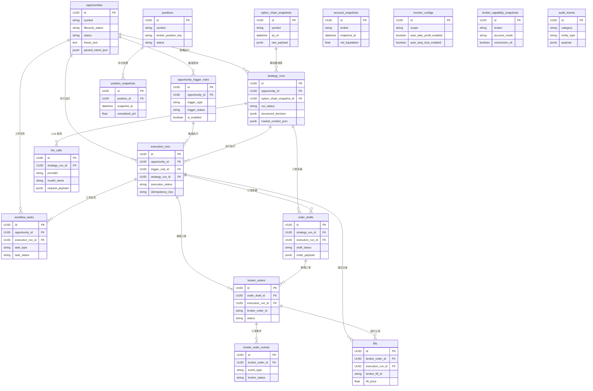

<!-- PAGE_ID: options_06_database -->
<details>
<summary>📚 Relevant source files</summary>

The following files were used as context for generating this wiki page:

- [models.py:1-328](https://github.com/ChunmiaoYu/options_ai_trader/blob/f5f3ac84e9c5d963fc1450f12306ea264183dfad/src/options_event_trader/db/models.py#L1-L328)
- [base.py:1-20](https://github.com/ChunmiaoYu/options_ai_trader/blob/f5f3ac84e9c5d963fc1450f12306ea264183dfad/src/options_event_trader/db/base.py#L1-L20)
- [session.py:1-43](https://github.com/ChunmiaoYu/options_ai_trader/blob/f5f3ac84e9c5d963fc1450f12306ea264183dfad/src/options_event_trader/db/session.py#L1-L43)
- [20260320_0001_init_core_schema.py:1-228](https://github.com/ChunmiaoYu/options_ai_trader/blob/f5f3ac84e9c5d963fc1450f12306ea264183dfad/alembic/versions/20260320_0001_init_core_schema.py#L1-L228)
- [20260323_0002_execution_queue_and_fill_tracking.py:1-246](https://github.com/ChunmiaoYu/options_ai_trader/blob/f5f3ac84e9c5d963fc1450f12306ea264183dfad/alembic/versions/20260323_0002_execution_queue_and_fill_tracking.py#L1-L246)
- [20260409_0003_opportunity_lifecycle_fields.py:1-59](https://github.com/ChunmiaoYu/options_ai_trader/blob/f5f3ac84e9c5d963fc1450f12306ea264183dfad/alembic/versions/20260409_0003_opportunity_lifecycle_fields.py#L1-L59)
- [20260410_0004_strategy_run_pipeline_fields.py:1-28](https://github.com/ChunmiaoYu/options_ai_trader/blob/f5f3ac84e9c5d963fc1450f12306ea264183dfad/alembic/versions/20260410_0004_strategy_run_pipeline_fields.py#L1-L28)
- [settings.py:40-55](https://github.com/ChunmiaoYu/options_ai_trader/blob/f5f3ac84e9c5d963fc1450f12306ea264183dfad/src/options_event_trader/settings.py#L40-L55)

</details>

# 数据库与持久化

> **Related Pages**: [[执行层：下单与市场数据|05_execution.md]], [[API 接口与前端|07_api_frontend.md]]

---

<!-- BEGIN:AUTOGEN options_06_database_er -->
## ER 关系图

本系统使用 PostgreSQL 数据库，通过 SQLAlchemy ORM 定义了 17 张表。所有表共享 `TimestampedUUIDMixin` 混入基类，提供 `id`（UUID 主键）、`created_at`、`updated_at` 三个标准字段（[base.py:14-20](https://github.com/ChunmiaoYu/options_ai_trader/blob/f5f3ac84e9c5d963fc1450f12306ea264183dfad/src/options_event_trader/db/base.py#L14-L20)）。

表之间的关系遵循系统六层架构的层级结构：Opportunity（交易意图） -> TriggerRule（触发规则） -> StrategyRun（策略生成） -> ExecutionRun（执行运行） -> BrokerOrder（券商订单） -> Fill（成交记录）。此外还有市场数据快照、持仓跟踪、账户快照、任务队列等辅助表。



上图展示了 17 张表及其外键关系。核心链路从左上角的 `opportunities` 出发，沿着 `strategy_runs` -> `execution_runs` -> `broker_orders` -> `fills` 逐层展开。右侧的独立表（`positions`、`account_snapshots`、`monitor_configs`、`broker_capability_snapshots`、`audit_events`）用于辅助监控和审计。

Sources: [models.py:13-328](https://github.com/ChunmiaoYu/options_ai_trader/blob/f5f3ac84e9c5d963fc1450f12306ea264183dfad/src/options_event_trader/db/models.py#L13-L328), [base.py:14-20](https://github.com/ChunmiaoYu/options_ai_trader/blob/f5f3ac84e9c5d963fc1450f12306ea264183dfad/src/options_event_trader/db/base.py#L14-L20)
<!-- END:AUTOGEN options_06_database_er -->

---

<!-- BEGIN:AUTOGEN options_06_database_core-tables -->
## 核心表说明

以下按系统分层依次介绍每张表的用途、关键字段和索引设计。

### 第 1 层：交易意图

#### opportunities（交易机会）

存储用户的每条交易意图，是整个系统的起点。一条 Opportunity 包含标的、事件窗口、入场窗口、交易论题、策略偏好、风控约束等完整信息（[models.py:13-57](https://github.com/ChunmiaoYu/options_ai_trader/blob/f5f3ac84e9c5d963fc1450f12306ea264183dfad/src/options_event_trader/db/models.py#L13-L57)）。

| 字段分组 | 关键字段 | 类型 | 说明 |
|----------|---------|------|------|
| 核心 | `symbol` | String(32) | 标的代码，如 SPY（[models.py:17](https://github.com/ChunmiaoYu/options_ai_trader/blob/f5f3ac84e9c5d963fc1450f12306ea264183dfad/src/options_event_trader/db/models.py#L17)） |
| 核心 | `thesis_text` | Text | 用户的交易论题原文（[models.py:23](https://github.com/ChunmiaoYu/options_ai_trader/blob/f5f3ac84e9c5d963fc1450f12306ea264183dfad/src/options_event_trader/db/models.py#L23)） |
| 核心 | `status` | String(32) | 传统状态字段，默认 ACTIVE（[models.py:31](https://github.com/ChunmiaoYu/options_ai_trader/blob/f5f3ac84e9c5d963fc1450f12306ea264183dfad/src/options_event_trader/db/models.py#L31)） |
| 时间窗口 | `event_window_start/end` | DateTime(tz) | 事件窗口（背景信息）（[models.py:18-19](https://github.com/ChunmiaoYu/options_ai_trader/blob/f5f3ac84e9c5d963fc1450f12306ea264183dfad/src/options_event_trader/db/models.py#L18-L19)） |
| 时间窗口 | `entry_window_start/end` | DateTime(tz) | 入场窗口（触发条件）（[models.py:21-22](https://github.com/ChunmiaoYu/options_ai_trader/blob/f5f3ac84e9c5d963fc1450f12306ea264183dfad/src/options_event_trader/db/models.py#L21-L22)） |
| 策略偏好 | `preferred_strategies` | JSONB | 偏好策略列表（[models.py:24](https://github.com/ChunmiaoYu/options_ai_trader/blob/f5f3ac84e9c5d963fc1450f12306ea264183dfad/src/options_event_trader/db/models.py#L24)） |
| 策略偏好 | `max_risk_dollars` | Float | 最大风险金额（[models.py:26](https://github.com/ChunmiaoYu/options_ai_trader/blob/f5f3ac84e9c5d963fc1450f12306ea264183dfad/src/options_event_trader/db/models.py#L26)） |
| 策略偏好 | `max_legs` | Integer | 最大腿数（[models.py:27](https://github.com/ChunmiaoYu/options_ai_trader/blob/f5f3ac84e9c5d963fc1450f12306ea264183dfad/src/options_event_trader/db/models.py#L27)） |
| 生命周期 | `lifecycle_status` | String(32) | 生命周期状态：DRAFT -> SUBMITTED -> ...（[models.py:35](https://github.com/ChunmiaoYu/options_ai_trader/blob/f5f3ac84e9c5d963fc1450f12306ea264183dfad/src/options_event_trader/db/models.py#L35)） |
| 生命周期 | `raw_input_text` | Text | 用户原始自然语言输入（[models.py:36](https://github.com/ChunmiaoYu/options_ai_trader/blob/f5f3ac84e9c5d963fc1450f12306ea264183dfad/src/options_event_trader/db/models.py#L36)） |
| 生命周期 | `parsed_intent_json` | JSONB | Agent1 解析后的结构化意图（[models.py:41](https://github.com/ChunmiaoYu/options_ai_trader/blob/f5f3ac84e9c5d963fc1450f12306ea264183dfad/src/options_event_trader/db/models.py#L41)） |
| 生命周期 | `submit_blockers_zh` | JSONB | 提交阻断原因列表（中文）（[models.py:45](https://github.com/ChunmiaoYu/options_ai_trader/blob/f5f3ac84e9c5d963fc1450f12306ea264183dfad/src/options_event_trader/db/models.py#L45)） |
| 修订 | `root_opportunity_id` | UUID | 修订链根节点（[models.py:50](https://github.com/ChunmiaoYu/options_ai_trader/blob/f5f3ac84e9c5d963fc1450f12306ea264183dfad/src/options_event_trader/db/models.py#L50)） |
| 修订 | `revision_path` | String(64) | 修订路径编号，如 #5.1.1（[models.py:52](https://github.com/ChunmiaoYu/options_ai_trader/blob/f5f3ac84e9c5d963fc1450f12306ea264183dfad/src/options_event_trader/db/models.py#L52)） |

**索引**: `symbol`、`entry_target_at`、`entry_window_start`、`entry_window_end`、`status`、`lifecycle_status`

### 第 2 层：触发规则

#### opportunity_trigger_rules（触发规则）

定义何时触发策略生成的条件。每条 Opportunity 可以有多条触发规则（[models.py:59-77](https://github.com/ChunmiaoYu/options_ai_trader/blob/f5f3ac84e9c5d963fc1450f12306ea264183dfad/src/options_event_trader/db/models.py#L59-L77)）。

| 关键字段 | 类型 | 说明 |
|---------|------|------|
| `opportunity_id` | UUID FK | 关联的交易机会（[models.py:62](https://github.com/ChunmiaoYu/options_ai_trader/blob/f5f3ac84e9c5d963fc1450f12306ea264183dfad/src/options_event_trader/db/models.py#L62)） |
| `trigger_type` | String(32) | 触发类型，默认 ENTRY_WINDOW（[models.py:63](https://github.com/ChunmiaoYu/options_ai_trader/blob/f5f3ac84e9c5d963fc1450f12306ea264183dfad/src/options_event_trader/db/models.py#L63)） |
| `trigger_status` | String(32) | 触发状态，默认 ACTIVE（[models.py:66](https://github.com/ChunmiaoYu/options_ai_trader/blob/f5f3ac84e9c5d963fc1450f12306ea264183dfad/src/options_event_trader/db/models.py#L66)） |
| `window_start/end` | DateTime(tz) | 触发时间窗口（[models.py:67-68](https://github.com/ChunmiaoYu/options_ai_trader/blob/f5f3ac84e9c5d963fc1450f12306ea264183dfad/src/options_event_trader/db/models.py#L67-L68)） |
| `condition_payload` | JSONB | 触发条件的自定义载荷（[models.py:69](https://github.com/ChunmiaoYu/options_ai_trader/blob/f5f3ac84e9c5d963fc1450f12306ea264183dfad/src/options_event_trader/db/models.py#L69)） |
| `once_only` | Boolean | 是否仅触发一次（[models.py:65](https://github.com/ChunmiaoYu/options_ai_trader/blob/f5f3ac84e9c5d963fc1450f12306ea264183dfad/src/options_event_trader/db/models.py#L65)） |
| `cooldown_seconds` | Integer | 冷却间隔（秒）（[models.py:70](https://github.com/ChunmiaoYu/options_ai_trader/blob/f5f3ac84e9c5d963fc1450f12306ea264183dfad/src/options_event_trader/db/models.py#L70)） |
| `trigger_count` | Integer | 已触发次数（[models.py:72](https://github.com/ChunmiaoYu/options_ai_trader/blob/f5f3ac84e9c5d963fc1450f12306ea264183dfad/src/options_event_trader/db/models.py#L72)） |
| `priority` | Integer | 优先级，默认 100（[models.py:74](https://github.com/ChunmiaoYu/options_ai_trader/blob/f5f3ac84e9c5d963fc1450f12306ea264183dfad/src/options_event_trader/db/models.py#L74)） |

**索引**: `opportunity_id`、`trigger_type`、`trigger_status`、`window_start`、`window_end`

### 第 3 层：策略生成

#### strategy_runs（策略运行）

记录每次 AI 策略生成的完整过程，包括输入的市场上下文和输出的策略决策（[models.py:89-113](https://github.com/ChunmiaoYu/options_ai_trader/blob/f5f3ac84e9c5d963fc1450f12306ea264183dfad/src/options_event_trader/db/models.py#L89-L113)）。

| 关键字段 | 类型 | 说明 |
|---------|------|------|
| `opportunity_id` | UUID FK | 关联的交易机会（[models.py:92](https://github.com/ChunmiaoYu/options_ai_trader/blob/f5f3ac84e9c5d963fc1450f12306ea264183dfad/src/options_event_trader/db/models.py#L92)） |
| `option_chain_snapshot_id` | UUID FK | 使用的期权链快照（[models.py:93-95](https://github.com/ChunmiaoYu/options_ai_trader/blob/f5f3ac84e9c5d963fc1450f12306ea264183dfad/src/options_event_trader/db/models.py#L93-L95)） |
| `run_status` | String(32) | 运行状态：PENDING/COMPLETED/FAILED（[models.py:97](https://github.com/ChunmiaoYu/options_ai_trader/blob/f5f3ac84e9c5d963fc1450f12306ea264183dfad/src/options_event_trader/db/models.py#L97)） |
| `structured_decision` | JSONB | 最终策略决策（JSON）（[models.py:101](https://github.com/ChunmiaoYu/options_ai_trader/blob/f5f3ac84e9c5d963fc1450f12306ea264183dfad/src/options_event_trader/db/models.py#L101)） |
| `market_context_json` | JSONB | Pipeline v2: 市场上下文（[models.py:104](https://github.com/ChunmiaoYu/options_ai_trader/blob/f5f3ac84e9c5d963fc1450f12306ea264183dfad/src/options_event_trader/db/models.py#L104)） |
| `ai_proposals_json` | JSONB | Pipeline v2: AI 生成的策略提案（[models.py:105](https://github.com/ChunmiaoYu/options_ai_trader/blob/f5f3ac84e9c5d963fc1450f12306ea264183dfad/src/options_event_trader/db/models.py#L105)） |
| `selected_proposal_json` | JSONB | Pipeline v2: 选中的策略提案（[models.py:106](https://github.com/ChunmiaoYu/options_ai_trader/blob/f5f3ac84e9c5d963fc1450f12306ea264183dfad/src/options_event_trader/db/models.py#L106)） |
| `risk_gate_result_json` | JSONB | Pipeline v2: 风控检查结果（[models.py:107](https://github.com/ChunmiaoYu/options_ai_trader/blob/f5f3ac84e9c5d963fc1450f12306ea264183dfad/src/options_event_trader/db/models.py#L107)） |
| `llm_model` | String(64) | 使用的 LLM 模型名（[models.py:98](https://github.com/ChunmiaoYu/options_ai_trader/blob/f5f3ac84e9c5d963fc1450f12306ea264183dfad/src/options_event_trader/db/models.py#L98)） |

**索引**: `opportunity_id`、`run_status`

#### option_chain_snapshots（期权链快照）

缓存来自 IBKR 的期权链数据，作为策略生成的输入（[models.py:80-87](https://github.com/ChunmiaoYu/options_ai_trader/blob/f5f3ac84e9c5d963fc1450f12306ea264183dfad/src/options_event_trader/db/models.py#L80-L87)）。

| 关键字段 | 类型 | 说明 |
|---------|------|------|
| `symbol` | String(32) | 标的代码（[models.py:83](https://github.com/ChunmiaoYu/options_ai_trader/blob/f5f3ac84e9c5d963fc1450f12306ea264183dfad/src/options_event_trader/db/models.py#L83)） |
| `as_of` | DateTime(tz) | 快照时间（[models.py:84](https://github.com/ChunmiaoYu/options_ai_trader/blob/f5f3ac84e9c5d963fc1450f12306ea264183dfad/src/options_event_trader/db/models.py#L84)） |
| `source` | String(32) | 数据来源，默认 IBKR（[models.py:85](https://github.com/ChunmiaoYu/options_ai_trader/blob/f5f3ac84e9c5d963fc1450f12306ea264183dfad/src/options_event_trader/db/models.py#L85)） |
| `raw_payload` | JSONB | 完整的期权链原始数据（[models.py:86](https://github.com/ChunmiaoYu/options_ai_trader/blob/f5f3ac84e9c5d963fc1450f12306ea264183dfad/src/options_event_trader/db/models.py#L86)） |

**索引**: `symbol`、`as_of`

#### llm_calls（LLM 调用记录）

记录每次 OpenAI API 调用的完整请求/响应载荷，用于审计和调试（[models.py:148-160](https://github.com/ChunmiaoYu/options_ai_trader/blob/f5f3ac84e9c5d963fc1450f12306ea264183dfad/src/options_event_trader/db/models.py#L148-L160)）。

| 关键字段 | 类型 | 说明 |
|---------|------|------|
| `strategy_run_id` | UUID FK | 关联的策略运行（[models.py:151](https://github.com/ChunmiaoYu/options_ai_trader/blob/f5f3ac84e9c5d963fc1450f12306ea264183dfad/src/options_event_trader/db/models.py#L151)） |
| `provider` | String(32) | 提供商，默认 OPENAI（[models.py:152](https://github.com/ChunmiaoYu/options_ai_trader/blob/f5f3ac84e9c5d963fc1450f12306ea264183dfad/src/options_event_trader/db/models.py#L152)） |
| `model_name` | String(64) | 模型名称（[models.py:153](https://github.com/ChunmiaoYu/options_ai_trader/blob/f5f3ac84e9c5d963fc1450f12306ea264183dfad/src/options_event_trader/db/models.py#L153)） |
| `request_payload` | JSONB | 请求载荷（[models.py:154](https://github.com/ChunmiaoYu/options_ai_trader/blob/f5f3ac84e9c5d963fc1450f12306ea264183dfad/src/options_event_trader/db/models.py#L154)） |
| `response_payload` | JSONB | 原始响应载荷（[models.py:155](https://github.com/ChunmiaoYu/options_ai_trader/blob/f5f3ac84e9c5d963fc1450f12306ea264183dfad/src/options_event_trader/db/models.py#L155)） |
| `parsed_payload` | JSONB | 解析后的结构化结果（[models.py:156](https://github.com/ChunmiaoYu/options_ai_trader/blob/f5f3ac84e9c5d963fc1450f12306ea264183dfad/src/options_event_trader/db/models.py#L156)） |

**索引**: `strategy_run_id`

### 第 4 层：执行层

#### execution_runs（执行运行）

代表一次完整的下单执行过程，将策略生成与实际下单操作关联起来。通过 `idempotency_key` 保证幂等性（[models.py:115-146](https://github.com/ChunmiaoYu/options_ai_trader/blob/f5f3ac84e9c5d963fc1450f12306ea264183dfad/src/options_event_trader/db/models.py#L115-L146)）。

| 关键字段 | 类型 | 说明 |
|---------|------|------|
| `opportunity_id` | UUID FK | 关联的交易机会（[models.py:118](https://github.com/ChunmiaoYu/options_ai_trader/blob/f5f3ac84e9c5d963fc1450f12306ea264183dfad/src/options_event_trader/db/models.py#L118)） |
| `trigger_rule_id` | UUID FK | 触发此执行的规则（[models.py:119-121](https://github.com/ChunmiaoYu/options_ai_trader/blob/f5f3ac84e9c5d963fc1450f12306ea264183dfad/src/options_event_trader/db/models.py#L119-L121)） |
| `strategy_run_id` | UUID FK | 关联的策略运行（[models.py:122-124](https://github.com/ChunmiaoYu/options_ai_trader/blob/f5f3ac84e9c5d963fc1450f12306ea264183dfad/src/options_event_trader/db/models.py#L122-L124)） |
| `execution_status` | String(32) | 执行状态：PENDING/RUNNING/COMPLETED/FAILED（[models.py:126](https://github.com/ChunmiaoYu/options_ai_trader/blob/f5f3ac84e9c5d963fc1450f12306ea264183dfad/src/options_event_trader/db/models.py#L126)） |
| `idempotency_key` | String(128) | 幂等键，保证同一请求不重复执行（[models.py:131](https://github.com/ChunmiaoYu/options_ai_trader/blob/f5f3ac84e9c5d963fc1450f12306ea264183dfad/src/options_event_trader/db/models.py#L131)） |
| `requested_quantity` | Integer | 请求数量（[models.py:127](https://github.com/ChunmiaoYu/options_ai_trader/blob/f5f3ac84e9c5d963fc1450f12306ea264183dfad/src/options_event_trader/db/models.py#L127)） |
| `filled_quantity` | Integer | 已成交数量（[models.py:128](https://github.com/ChunmiaoYu/options_ai_trader/blob/f5f3ac84e9c5d963fc1450f12306ea264183dfad/src/options_event_trader/db/models.py#L128)） |
| `partial_fill_policy` | String(32) | 部分成交策略：CANCEL_REMAINDER（[models.py:130](https://github.com/ChunmiaoYu/options_ai_trader/blob/f5f3ac84e9c5d963fc1450f12306ea264183dfad/src/options_event_trader/db/models.py#L130)） |
| `context_payload` | JSONB | 执行上下文（[models.py:137](https://github.com/ChunmiaoYu/options_ai_trader/blob/f5f3ac84e9c5d963fc1450f12306ea264183dfad/src/options_event_trader/db/models.py#L137)） |

**索引**: `opportunity_id`、`trigger_rule_id`、`strategy_run_id`、`execution_status`
**唯一约束**: `idempotency_key`

#### order_drafts（订单草稿）

策略编译后产生的订单草稿，尚未提交到券商。一条 OrderDraft 可以生成多条 BrokerOrder（[models.py:162-176](https://github.com/ChunmiaoYu/options_ai_trader/blob/f5f3ac84e9c5d963fc1450f12306ea264183dfad/src/options_event_trader/db/models.py#L162-L176)）。

| 关键字段 | 类型 | 说明 |
|---------|------|------|
| `strategy_run_id` | UUID FK | 来源策略运行（[models.py:165](https://github.com/ChunmiaoYu/options_ai_trader/blob/f5f3ac84e9c5d963fc1450f12306ea264183dfad/src/options_event_trader/db/models.py#L165)） |
| `execution_run_id` | UUID FK | 关联的执行运行（[models.py:166-168](https://github.com/ChunmiaoYu/options_ai_trader/blob/f5f3ac84e9c5d963fc1450f12306ea264183dfad/src/options_event_trader/db/models.py#L166-L168)） |
| `broker` | String(32) | 目标券商，默认 IBKR（[models.py:169](https://github.com/ChunmiaoYu/options_ai_trader/blob/f5f3ac84e9c5d963fc1450f12306ea264183dfad/src/options_event_trader/db/models.py#L169)） |
| `draft_status` | String(32) | 草稿状态：NOT_SENT/SENT/...（[models.py:170](https://github.com/ChunmiaoYu/options_ai_trader/blob/f5f3ac84e9c5d963fc1450f12306ea264183dfad/src/options_event_trader/db/models.py#L170)） |
| `order_payload` | JSONB | 订单详情 JSON（[models.py:171](https://github.com/ChunmiaoYu/options_ai_trader/blob/f5f3ac84e9c5d963fc1450f12306ea264183dfad/src/options_event_trader/db/models.py#L171)） |

**索引**: `strategy_run_id`、`execution_run_id`

### 第 5 层：事实层（不可变）

#### broker_orders（券商订单）

实际提交到 IBKR 的订单记录，包含券商返回的订单 ID 和成交信息（[models.py:178-197](https://github.com/ChunmiaoYu/options_ai_trader/blob/f5f3ac84e9c5d963fc1450f12306ea264183dfad/src/options_event_trader/db/models.py#L178-L197)）。

| 关键字段 | 类型 | 说明 |
|---------|------|------|
| `order_draft_id` | UUID FK | 来源订单草稿（[models.py:181](https://github.com/ChunmiaoYu/options_ai_trader/blob/f5f3ac84e9c5d963fc1450f12306ea264183dfad/src/options_event_trader/db/models.py#L181)） |
| `execution_run_id` | UUID FK | 关联的执行运行（[models.py:182-184](https://github.com/ChunmiaoYu/options_ai_trader/blob/f5f3ac84e9c5d963fc1450f12306ea264183dfad/src/options_event_trader/db/models.py#L182-L184)） |
| `broker_order_id` | String(64) | IBKR 分配的订单 ID（[models.py:185](https://github.com/ChunmiaoYu/options_ai_trader/blob/f5f3ac84e9c5d963fc1450f12306ea264183dfad/src/options_event_trader/db/models.py#L185)） |
| `status` | String(32) | 订单状态：NEW/SUBMITTED/FILLED/CANCELLED（[models.py:186](https://github.com/ChunmiaoYu/options_ai_trader/blob/f5f3ac84e9c5d963fc1450f12306ea264183dfad/src/options_event_trader/db/models.py#L186)） |
| `avg_fill_price` | Float | 平均成交价（[models.py:190](https://github.com/ChunmiaoYu/options_ai_trader/blob/f5f3ac84e9c5d963fc1450f12306ea264183dfad/src/options_event_trader/db/models.py#L190)） |
| `raw_payload` | JSONB | 券商原始响应（[models.py:192](https://github.com/ChunmiaoYu/options_ai_trader/blob/f5f3ac84e9c5d963fc1450f12306ea264183dfad/src/options_event_trader/db/models.py#L192)） |

**索引**: `order_draft_id`、`execution_run_id`、`status`

#### broker_order_events（订单事件流）

记录每条券商订单的状态变化事件，形成不可变的事件流（[models.py:200-209](https://github.com/ChunmiaoYu/options_ai_trader/blob/f5f3ac84e9c5d963fc1450f12306ea264183dfad/src/options_event_trader/db/models.py#L200-L209)）。

| 关键字段 | 类型 | 说明 |
|---------|------|------|
| `broker_order_id` | UUID FK | 关联的券商订单（[models.py:203](https://github.com/ChunmiaoYu/options_ai_trader/blob/f5f3ac84e9c5d963fc1450f12306ea264183dfad/src/options_event_trader/db/models.py#L203)） |
| `event_type` | String(32) | 事件类型（[models.py:204](https://github.com/ChunmiaoYu/options_ai_trader/blob/f5f3ac84e9c5d963fc1450f12306ea264183dfad/src/options_event_trader/db/models.py#L204)） |
| `broker_status` | String(32) | 券商侧状态（[models.py:205](https://github.com/ChunmiaoYu/options_ai_trader/blob/f5f3ac84e9c5d963fc1450f12306ea264183dfad/src/options_event_trader/db/models.py#L205)） |
| `event_at` | DateTime(tz) | 事件发生时间（[models.py:206](https://github.com/ChunmiaoYu/options_ai_trader/blob/f5f3ac84e9c5d963fc1450f12306ea264183dfad/src/options_event_trader/db/models.py#L206)） |

**索引**: `broker_order_id`、`event_type`、`event_at`

#### fills（成交记录）

每笔实际成交的不可变记录，通过 `broker_fill_id` 唯一约束防止重复记录（[models.py:212-229](https://github.com/ChunmiaoYu/options_ai_trader/blob/f5f3ac84e9c5d963fc1450f12306ea264183dfad/src/options_event_trader/db/models.py#L212-L229)）。

| 关键字段 | 类型 | 说明 |
|---------|------|------|
| `broker_order_id` | UUID FK | 关联的券商订单（[models.py:216](https://github.com/ChunmiaoYu/options_ai_trader/blob/f5f3ac84e9c5d963fc1450f12306ea264183dfad/src/options_event_trader/db/models.py#L216)） |
| `execution_run_id` | UUID FK | 关联的执行运行（[models.py:217-219](https://github.com/ChunmiaoYu/options_ai_trader/blob/f5f3ac84e9c5d963fc1450f12306ea264183dfad/src/options_event_trader/db/models.py#L217-L219)） |
| `broker_fill_id` | String(128) | 券商成交 ID（唯一约束）（[models.py:220](https://github.com/ChunmiaoYu/options_ai_trader/blob/f5f3ac84e9c5d963fc1450f12306ea264183dfad/src/options_event_trader/db/models.py#L220)） |
| `filled_quantity` | Integer | 成交数量（[models.py:221](https://github.com/ChunmiaoYu/options_ai_trader/blob/f5f3ac84e9c5d963fc1450f12306ea264183dfad/src/options_event_trader/db/models.py#L221)） |
| `fill_price` | Float | 成交价格（[models.py:222](https://github.com/ChunmiaoYu/options_ai_trader/blob/f5f3ac84e9c5d963fc1450f12306ea264183dfad/src/options_event_trader/db/models.py#L222)） |
| `commission` | Float | 佣金（[models.py:223](https://github.com/ChunmiaoYu/options_ai_trader/blob/f5f3ac84e9c5d963fc1450f12306ea264183dfad/src/options_event_trader/db/models.py#L223)） |

**索引**: `broker_order_id`、`execution_run_id`、`event_at`
**唯一约束**: `broker_fill_id`

#### positions（持仓）

跟踪当前持仓状态，通过 `broker_position_key` 唯一标识每个持仓（[models.py:231-240](https://github.com/ChunmiaoYu/options_ai_trader/blob/f5f3ac84e9c5d963fc1450f12306ea264183dfad/src/options_event_trader/db/models.py#L231-L240)）。

| 关键字段 | 类型 | 说明 |
|---------|------|------|
| `symbol` | String(32) | 标的代码（[models.py:234](https://github.com/ChunmiaoYu/options_ai_trader/blob/f5f3ac84e9c5d963fc1450f12306ea264183dfad/src/options_event_trader/db/models.py#L234)） |
| `strategy_run_id` | UUID FK | 产生该持仓的策略运行（[models.py:235](https://github.com/ChunmiaoYu/options_ai_trader/blob/f5f3ac84e9c5d963fc1450f12306ea264183dfad/src/options_event_trader/db/models.py#L235)） |
| `broker_position_key` | String(128) | 券商持仓唯一标识（[models.py:236](https://github.com/ChunmiaoYu/options_ai_trader/blob/f5f3ac84e9c5d963fc1450f12306ea264183dfad/src/options_event_trader/db/models.py#L236)） |
| `status` | String(32) | 持仓状态：OPEN/CLOSED（[models.py:237](https://github.com/ChunmiaoYu/options_ai_trader/blob/f5f3ac84e9c5d963fc1450f12306ea264183dfad/src/options_event_trader/db/models.py#L237)） |
| `avg_cost` | Float | 平均成本（[models.py:238](https://github.com/ChunmiaoYu/options_ai_trader/blob/f5f3ac84e9c5d963fc1450f12306ea264183dfad/src/options_event_trader/db/models.py#L238)） |

**索引**: `symbol`、`status`
**唯一约束**: `broker_position_key`

#### position_snapshots（持仓快照）

定时采集的持仓估值快照，用于盈亏追踪和风控监控（[models.py:243-253](https://github.com/ChunmiaoYu/options_ai_trader/blob/f5f3ac84e9c5d963fc1450f12306ea264183dfad/src/options_event_trader/db/models.py#L243-L253)）。

| 关键字段 | 类型 | 说明 |
|---------|------|------|
| `position_id` | UUID FK | 关联的持仓（[models.py:246](https://github.com/ChunmiaoYu/options_ai_trader/blob/f5f3ac84e9c5d963fc1450f12306ea264183dfad/src/options_event_trader/db/models.py#L246)） |
| `snapshot_at` | DateTime(tz) | 快照时间（[models.py:247](https://github.com/ChunmiaoYu/options_ai_trader/blob/f5f3ac84e9c5d963fc1450f12306ea264183dfad/src/options_event_trader/db/models.py#L247)） |
| `unrealized_pnl` | Float | 未实现盈亏（[models.py:249](https://github.com/ChunmiaoYu/options_ai_trader/blob/f5f3ac84e9c5d963fc1450f12306ea264183dfad/src/options_event_trader/db/models.py#L249)） |
| `margin_ratio` | Float | 保证金比率（[models.py:252](https://github.com/ChunmiaoYu/options_ai_trader/blob/f5f3ac84e9c5d963fc1450f12306ea264183dfad/src/options_event_trader/db/models.py#L252)） |

**索引**: `position_id`、`snapshot_at`

#### account_snapshots（账户快照）

定时采集的账户级别财务快照，用于整体风控和资金监控（[models.py:256-267](https://github.com/ChunmiaoYu/options_ai_trader/blob/f5f3ac84e9c5d963fc1450f12306ea264183dfad/src/options_event_trader/db/models.py#L256-L267)）。

| 关键字段 | 类型 | 说明 |
|---------|------|------|
| `broker` | String(32) | 券商标识，默认 IBKR（[models.py:259](https://github.com/ChunmiaoYu/options_ai_trader/blob/f5f3ac84e9c5d963fc1450f12306ea264183dfad/src/options_event_trader/db/models.py#L259)） |
| `account_id` | String(64) | 账户 ID（[models.py:260](https://github.com/ChunmiaoYu/options_ai_trader/blob/f5f3ac84e9c5d963fc1450f12306ea264183dfad/src/options_event_trader/db/models.py#L260)） |
| `net_liquidation` | Float | 净清算价值（[models.py:262](https://github.com/ChunmiaoYu/options_ai_trader/blob/f5f3ac84e9c5d963fc1450f12306ea264183dfad/src/options_event_trader/db/models.py#L262)） |
| `excess_liquidity` | Float | 剩余流动性（[models.py:263](https://github.com/ChunmiaoYu/options_ai_trader/blob/f5f3ac84e9c5d963fc1450f12306ea264183dfad/src/options_event_trader/db/models.py#L263)） |

**索引**: `snapshot_at`

### 第 6 层：任务队列

#### workflow_tasks（工作流任务）

表驱动的后台任务调度系统。Worker 进程通过轮询该表获取待执行任务，使用 `locked_at` + `lock_token` 实现乐观锁（[models.py:270-292](https://github.com/ChunmiaoYu/options_ai_trader/blob/f5f3ac84e9c5d963fc1450f12306ea264183dfad/src/options_event_trader/db/models.py#L270-L292)）。

| 关键字段 | 类型 | 说明 |
|---------|------|------|
| `queue_name` | String(32) | 队列名，默认 default（[models.py:273](https://github.com/ChunmiaoYu/options_ai_trader/blob/f5f3ac84e9c5d963fc1450f12306ea264183dfad/src/options_event_trader/db/models.py#L273)） |
| `task_type` | String(32) | 任务类型（[models.py:274](https://github.com/ChunmiaoYu/options_ai_trader/blob/f5f3ac84e9c5d963fc1450f12306ea264183dfad/src/options_event_trader/db/models.py#L274)） |
| `task_status` | String(32) | 任务状态：PENDING/LOCKED/COMPLETED/FAILED（[models.py:275](https://github.com/ChunmiaoYu/options_ai_trader/blob/f5f3ac84e9c5d963fc1450f12306ea264183dfad/src/options_event_trader/db/models.py#L275)） |
| `not_before_at` | DateTime(tz) | 最早可执行时间（延迟调度）（[models.py:282](https://github.com/ChunmiaoYu/options_ai_trader/blob/f5f3ac84e9c5d963fc1450f12306ea264183dfad/src/options_event_trader/db/models.py#L282)） |
| `locked_at` | DateTime(tz) | 锁定时间（乐观锁）（[models.py:286](https://github.com/ChunmiaoYu/options_ai_trader/blob/f5f3ac84e9c5d963fc1450f12306ea264183dfad/src/options_event_trader/db/models.py#L286)） |
| `lock_token` | String(64) | 锁定令牌（[models.py:288](https://github.com/ChunmiaoYu/options_ai_trader/blob/f5f3ac84e9c5d963fc1450f12306ea264183dfad/src/options_event_trader/db/models.py#L288)） |
| `idempotency_key` | String(128) | 幂等键（[models.py:285](https://github.com/ChunmiaoYu/options_ai_trader/blob/f5f3ac84e9c5d963fc1450f12306ea264183dfad/src/options_event_trader/db/models.py#L285)） |
| `attempts` / `max_attempts` | Integer | 当前/最大重试次数（[models.py:283-284](https://github.com/ChunmiaoYu/options_ai_trader/blob/f5f3ac84e9c5d963fc1450f12306ea264183dfad/src/options_event_trader/db/models.py#L283-L284)） |

**索引**: `queue_name`、`task_type`、`task_status`、`opportunity_id`、`execution_run_id`、`not_before_at`、`idempotency_key`

### 辅助表

#### monitor_configs（监控配置）

全局监控规则配置，如自动止盈止损开关和阈值。通过 `scope` 字段唯一约束实现单例模式（[models.py:295-305](https://github.com/ChunmiaoYu/options_ai_trader/blob/f5f3ac84e9c5d963fc1450f12306ea264183dfad/src/options_event_trader/db/models.py#L295-L305)）。

| 关键字段 | 类型 | 说明 |
|---------|------|------|
| `scope` | String(32) | 配置范围，GLOBAL 唯一约束（[models.py:298](https://github.com/ChunmiaoYu/options_ai_trader/blob/f5f3ac84e9c5d963fc1450f12306ea264183dfad/src/options_event_trader/db/models.py#L298)） |
| `auto_take_profit_enabled` | Boolean | 自动止盈开关（[models.py:299](https://github.com/ChunmiaoYu/options_ai_trader/blob/f5f3ac84e9c5d963fc1450f12306ea264183dfad/src/options_event_trader/db/models.py#L299)） |
| `auto_stop_loss_enabled` | Boolean | 自动止损开关（[models.py:301](https://github.com/ChunmiaoYu/options_ai_trader/blob/f5f3ac84e9c5d963fc1450f12306ea264183dfad/src/options_event_trader/db/models.py#L301)） |
| `extra_rules` | JSONB | 额外规则扩展（[models.py:305](https://github.com/ChunmiaoYu/options_ai_trader/blob/f5f3ac84e9c5d963fc1450f12306ea264183dfad/src/options_event_trader/db/models.py#L305)） |

**唯一约束**: `scope`

#### broker_capability_snapshots（券商能力快照）

记录 IBKR 连接和功能测试结果，用于诊断和能力确认（[models.py:308-318](https://github.com/ChunmiaoYu/options_ai_trader/blob/f5f3ac84e9c5d963fc1450f12306ea264183dfad/src/options_event_trader/db/models.py#L308-L318)）。

| 关键字段 | 类型 | 说明 |
|---------|------|------|
| `account_mode` | String(32) | 账户模式：PAPER/LIVE（[models.py:311](https://github.com/ChunmiaoYu/options_ai_trader/blob/f5f3ac84e9c5d963fc1450f12306ea264183dfad/src/options_event_trader/db/models.py#L311)） |
| `connection_ok` | Boolean | 连接测试通过（[models.py:313](https://github.com/ChunmiaoYu/options_ai_trader/blob/f5f3ac84e9c5d963fc1450f12306ea264183dfad/src/options_event_trader/db/models.py#L313)） |
| `option_secdef_ok` | Boolean | 期权合约定义查询通过（[models.py:315](https://github.com/ChunmiaoYu/options_ai_trader/blob/f5f3ac84e9c5d963fc1450f12306ea264183dfad/src/options_event_trader/db/models.py#L315)） |
| `what_if_ok` | Boolean | What-If 模拟订单通过（[models.py:316](https://github.com/ChunmiaoYu/options_ai_trader/blob/f5f3ac84e9c5d963fc1450f12306ea264183dfad/src/options_event_trader/db/models.py#L316)） |

#### audit_events（审计事件）

通用的审计日志表，记录系统中各类实体的重要操作（[models.py:321-328](https://github.com/ChunmiaoYu/options_ai_trader/blob/f5f3ac84e9c5d963fc1450f12306ea264183dfad/src/options_event_trader/db/models.py#L321-L328)）。

| 关键字段 | 类型 | 说明 |
|---------|------|------|
| `category` | String(64) | 事件类别（[models.py:324](https://github.com/ChunmiaoYu/options_ai_trader/blob/f5f3ac84e9c5d963fc1450f12306ea264183dfad/src/options_event_trader/db/models.py#L324)） |
| `entity_type` | String(64) | 实体类型（[models.py:325](https://github.com/ChunmiaoYu/options_ai_trader/blob/f5f3ac84e9c5d963fc1450f12306ea264183dfad/src/options_event_trader/db/models.py#L325)） |
| `entity_id` | String(64) | 实体 ID（[models.py:326](https://github.com/ChunmiaoYu/options_ai_trader/blob/f5f3ac84e9c5d963fc1450f12306ea264183dfad/src/options_event_trader/db/models.py#L326)） |
| `payload` | JSONB | 事件详情（[models.py:327](https://github.com/ChunmiaoYu/options_ai_trader/blob/f5f3ac84e9c5d963fc1450f12306ea264183dfad/src/options_event_trader/db/models.py#L327)） |

**索引**: `category`、`entity_type`

### JSONB 字段使用总结

系统广泛使用 PostgreSQL 的 JSONB 类型存储半结构化数据，避免了频繁的 schema 变更：

| 表 | JSONB 字段 | 用途 |
|----|-----------|------|
| `opportunities` | `preferred_strategies`, `disallowed_strategies`, `preferred_expiry_days`, `source_payload`, `parsed_intent_json`, `submit_blockers_zh` | 策略偏好、AI 解析结果、阻断原因 |
| `strategy_runs` | `structured_decision`, `market_context_json`, `ai_proposals_json`, `selected_proposal_json`, `risk_gate_result_json` | 策略生成全流程 JSON 快照 |
| `llm_calls` | `request_payload`, `response_payload`, `parsed_payload` | LLM 请求/响应审计 |
| `order_drafts` | `order_payload` | 订单详情 |
| `broker_orders` | `raw_payload` | 券商原始响应 |
| `fills` | `raw_payload` | 成交原始数据 |
| `workflow_tasks` | `payload` | 任务参数 |

Sources: [models.py:13-328](https://github.com/ChunmiaoYu/options_ai_trader/blob/f5f3ac84e9c5d963fc1450f12306ea264183dfad/src/options_event_trader/db/models.py#L13-L328)
<!-- END:AUTOGEN options_06_database_core-tables -->

---

<!-- BEGIN:AUTOGEN options_06_database_migrations -->
## Alembic 迁移历史

系统使用 Alembic 管理数据库 schema 变更，迁移文件位于 `alembic/versions/`。以下是 4 次迁移的详细内容。

### 0001: 初始核心 schema（2026-03-20）

首次迁移，建立系统基础表结构（[20260320_0001_init_core_schema.py:13-198](https://github.com/ChunmiaoYu/options_ai_trader/blob/f5f3ac84e9c5d963fc1450f12306ea264183dfad/alembic/versions/20260320_0001_init_core_schema.py#L13-L198)）。

**创建 12 张表**:
- `opportunities` -- 交易机会（含 symbol、entry_target_at、thesis_text 等核心字段）
- `option_chain_snapshots` -- 期权链快照
- `strategy_runs` -- 策略运行（关联 opportunity + option_chain_snapshot）
- `llm_calls` -- LLM 调用审计
- `order_drafts` -- 订单草稿
- `broker_orders` -- 券商订单（初始版本仅含基础字段）
- `positions` -- 持仓
- `position_snapshots` -- 持仓快照
- `monitor_configs` -- 监控配置
- `broker_capability_snapshots` -- 券商能力快照
- `audit_events` -- 审计事件

### 0002: 执行队列与成交跟踪（2026-03-23）

引入完整的执行层，支持从策略到实际下单的全流程（[20260323_0002_execution_queue_and_fill_tracking.py:13-187](https://github.com/ChunmiaoYu/options_ai_trader/blob/f5f3ac84e9c5d963fc1450f12306ea264183dfad/alembic/versions/20260323_0002_execution_queue_and_fill_tracking.py#L13-L187)）。

**新建 5 张表**:
- `opportunity_trigger_rules` -- 触发规则
- `execution_runs` -- 执行运行（含幂等键和重试机制）
- `broker_order_events` -- 订单事件流
- `fills` -- 成交记录（含 broker_fill_id 唯一约束）
- `account_snapshots` -- 账户快照
- `workflow_tasks` -- 工作流任务（表驱动调度）

**修改已有表**:
- `opportunities`: `entry_target_at` 改为可空；新增 `entry_window_start`、`entry_window_end`、`target_quantity`、`partial_fill_policy`（[20260323_0002_execution_queue_and_fill_tracking.py:14-23](https://github.com/ChunmiaoYu/options_ai_trader/blob/f5f3ac84e9c5d963fc1450f12306ea264183dfad/alembic/versions/20260323_0002_execution_queue_and_fill_tracking.py#L14-L23)）
- `order_drafts`: 新增 `execution_run_id` 外键（[20260323_0002_execution_queue_and_fill_tracking.py:84-88](https://github.com/ChunmiaoYu/options_ai_trader/blob/f5f3ac84e9c5d963fc1450f12306ea264183dfad/alembic/versions/20260323_0002_execution_queue_and_fill_tracking.py#L84-L88)）
- `broker_orders`: 新增 `execution_run_id`、`submitted_quantity`、`filled_quantity`、`remaining_quantity`、`avg_fill_price`、`last_broker_status_at`（[20260323_0002_execution_queue_and_fill_tracking.py:90-99](https://github.com/ChunmiaoYu/options_ai_trader/blob/f5f3ac84e9c5d963fc1450f12306ea264183dfad/alembic/versions/20260323_0002_execution_queue_and_fill_tracking.py#L90-L99)）

### 0003: Opportunity 生命周期字段（2026-04-09）

为 Opportunity 添加生命周期管理、自然语言解析结果和修订链字段，支持 DRAFT -> SUBMITTED 工作流（[20260409_0003_opportunity_lifecycle_fields.py:17-38](https://github.com/ChunmiaoYu/options_ai_trader/blob/f5f3ac84e9c5d963fc1450f12306ea264183dfad/alembic/versions/20260409_0003_opportunity_lifecycle_fields.py#L17-L38)）。

**新增 16 个字段到 `opportunities`**:
- 生命周期: `lifecycle_status`（默认 DRAFT）
- 解析结果: `raw_input_text`、`input_mode`、`client_label`、`direction`、`requested_mode`、`parsed_intent_json`
- 用户展示: `human_summary_zh`、`trigger_summary_zh`
- 提交检查: `support_level`、`submit_blockers_zh`、`submitted_at`、`next_action_at`
- 修订链: `root_opportunity_id`、`parent_opportunity_id`、`revision_path`

**数据回填**: 已有行的 `lifecycle_status` 从 DRAFT 回填为 SUBMITTED（[20260409_0003_opportunity_lifecycle_fields.py:38](https://github.com/ChunmiaoYu/options_ai_trader/blob/f5f3ac84e9c5d963fc1450f12306ea264183dfad/alembic/versions/20260409_0003_opportunity_lifecycle_fields.py#L38)）。

### 0004: 策略运行 Pipeline 字段（2026-04-10）

为 `strategy_runs` 表添加 Pipeline v2 所需的 4 个 JSONB 字段，存储策略生成 6 步流水线的中间结果（[20260410_0004_strategy_run_pipeline_fields.py:17-21](https://github.com/ChunmiaoYu/options_ai_trader/blob/f5f3ac84e9c5d963fc1450f12306ea264183dfad/alembic/versions/20260410_0004_strategy_run_pipeline_fields.py#L17-L21)）。

**新增 4 个 JSONB 字段**:
- `market_context_json` -- 市场上下文（股价、期权链、Greeks）
- `ai_proposals_json` -- AI 生成的策略提案列表
- `selected_proposal_json` -- 经编译确认的选中策略
- `risk_gate_result_json` -- 风控门检查结果

### 迁移链总览

```
20260320_0001 (初始 12 张表)
    ↓
20260323_0002 (执行层 +5 张表，修改 3 张表)
    ↓
20260409_0003 (Opportunity 生命周期 +16 字段)
    ↓
20260410_0004 (StrategyRun Pipeline +4 字段)
```

### 会话管理

数据库连接通过 `session.py` 统一管理（[session.py:1-43](https://github.com/ChunmiaoYu/options_ai_trader/blob/f5f3ac84e9c5d963fc1450f12306ea264183dfad/src/options_event_trader/db/session.py#L1-L43)）。

- **连接池**: 使用 `pool_pre_ping=True` 启用连接健康检查（[session.py:13](https://github.com/ChunmiaoYu/options_ai_trader/blob/f5f3ac84e9c5d963fc1450f12306ea264183dfad/src/options_event_trader/db/session.py#L13)）
- **SessionLocal**: `autoflush=False, autocommit=False, expire_on_commit=False`（[session.py:17](https://github.com/ChunmiaoYu/options_ai_trader/blob/f5f3ac84e9c5d963fc1450f12306ea264183dfad/src/options_event_trader/db/session.py#L17)）
- **session_scope()**: 上下文管理器，Worker 进程使用，自动 commit/rollback（[session.py:21-30](https://github.com/ChunmiaoYu/options_ai_trader/blob/f5f3ac84e9c5d963fc1450f12306ea264183dfad/src/options_event_trader/db/session.py#L21-L30)）
- **get_db()**: FastAPI 依赖注入生成器，API 请求使用（[session.py:33-42](https://github.com/ChunmiaoYu/options_ai_trader/blob/f5f3ac84e9c5d963fc1450f12306ea264183dfad/src/options_event_trader/db/session.py#L33-L42)）
- **数据库 URL**: 通过 `settings.resolved_database_url` 构造 PostgreSQL 连接串，格式为 `postgresql+psycopg://`（[settings.py:44-50](https://github.com/ChunmiaoYu/options_ai_trader/blob/f5f3ac84e9c5d963fc1450f12306ea264183dfad/src/options_event_trader/settings.py#L44-L50)）

Sources: [20260320_0001_init_core_schema.py:1-228](https://github.com/ChunmiaoYu/options_ai_trader/blob/f5f3ac84e9c5d963fc1450f12306ea264183dfad/alembic/versions/20260320_0001_init_core_schema.py#L1-L228), [20260323_0002_execution_queue_and_fill_tracking.py:1-246](https://github.com/ChunmiaoYu/options_ai_trader/blob/f5f3ac84e9c5d963fc1450f12306ea264183dfad/alembic/versions/20260323_0002_execution_queue_and_fill_tracking.py#L1-L246), [20260409_0003_opportunity_lifecycle_fields.py:1-59](https://github.com/ChunmiaoYu/options_ai_trader/blob/f5f3ac84e9c5d963fc1450f12306ea264183dfad/alembic/versions/20260409_0003_opportunity_lifecycle_fields.py#L1-L59), [20260410_0004_strategy_run_pipeline_fields.py:1-28](https://github.com/ChunmiaoYu/options_ai_trader/blob/f5f3ac84e9c5d963fc1450f12306ea264183dfad/alembic/versions/20260410_0004_strategy_run_pipeline_fields.py#L1-L28), [session.py:1-43](https://github.com/ChunmiaoYu/options_ai_trader/blob/f5f3ac84e9c5d963fc1450f12306ea264183dfad/src/options_event_trader/db/session.py#L1-L43)
<!-- END:AUTOGEN options_06_database_migrations -->

---
