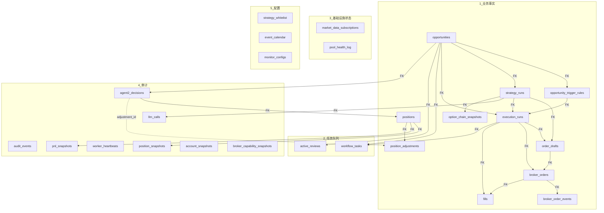

<!-- PAGE_ID: options_06_database -->
<details>
<summary>📚 Relevant source files</summary>

The following files were used as context for generating this wiki page:

- [models.py:1-623](https://github.com/ChunmiaoYu/options_ai_trader/blob/6b3d159/src/options_event_trader/db/models.py#L1-L623)
- [base.py](https://github.com/ChunmiaoYu/options_ai_trader/blob/6b3d159/src/options_event_trader/db/base.py)
- [session.py](https://github.com/ChunmiaoYu/options_ai_trader/blob/6b3d159/src/options_event_trader/db/session.py)
- [20260320_0001_init_core_schema.py](https://github.com/ChunmiaoYu/options_ai_trader/blob/6b3d159/alembic/versions/20260320_0001_init_core_schema.py)
- [20260323_0002_execution_queue_and_fill_tracking.py](https://github.com/ChunmiaoYu/options_ai_trader/blob/6b3d159/alembic/versions/20260323_0002_execution_queue_and_fill_tracking.py)
- [20260409_0003_opportunity_lifecycle_fields.py](https://github.com/ChunmiaoYu/options_ai_trader/blob/6b3d159/alembic/versions/20260409_0003_opportunity_lifecycle_fields.py)
- [20260423_0008_agent2_decisions.py](https://github.com/ChunmiaoYu/options_ai_trader/blob/6b3d159/alembic/versions/20260423_0008_agent2_decisions.py)
- [20260429_0015_pnl_snapshots.py](https://github.com/ChunmiaoYu/options_ai_trader/blob/6b3d159/alembic/versions/20260429_0015_pnl_snapshots.py)
- [20260430_0017_opportunity_effective_until_and_cancel_reason.py](https://github.com/ChunmiaoYu/options_ai_trader/blob/6b3d159/alembic/versions/20260430_0017_opportunity_effective_until_and_cancel_reason.py)
- [20260502_0021_agent2_decisions_thesis_summary.py](https://github.com/ChunmiaoYu/options_ai_trader/blob/6b3d159/alembic/versions/20260502_0021_agent2_decisions_thesis_summary.py)
- [20260503_0022_drop_b_plan_deprecated_columns.py](https://github.com/ChunmiaoYu/options_ai_trader/blob/6b3d159/alembic/versions/20260503_0022_drop_b_plan_deprecated_columns.py)
- [20260504_0023_worker_visualization_state_machine_v2.py](https://github.com/ChunmiaoYu/options_ai_trader/blob/6b3d159/alembic/versions/20260504_0023_worker_visualization_state_machine_v2.py)
- [20260507_0024_add_active_reviews.py](https://github.com/ChunmiaoYu/options_ai_trader/blob/6b3d159/alembic/versions/20260507_0024_add_active_reviews.py)
- [20260507_0025_add_market_data_subscriptions.py](https://github.com/ChunmiaoYu/options_ai_trader/blob/6b3d159/alembic/versions/20260507_0025_add_market_data_subscriptions.py)
- [20260507_0026_add_pool_health_log.py](https://github.com/ChunmiaoYu/options_ai_trader/blob/6b3d159/alembic/versions/20260507_0026_add_pool_health_log.py)
- [20260507_0027_add_event_calendar.py](https://github.com/ChunmiaoYu/options_ai_trader/blob/6b3d159/alembic/versions/20260507_0027_add_event_calendar.py)
- [20260507_0028_add_strategy_whitelist_seed.py](https://github.com/ChunmiaoYu/options_ai_trader/blob/6b3d159/alembic/versions/20260507_0028_add_strategy_whitelist_seed.py)
- [20260507_0029_brokerorder_algo_split_batch_and_workflow_check.py](https://github.com/ChunmiaoYu/options_ai_trader/blob/6b3d159/alembic/versions/20260507_0029_brokerorder_algo_split_batch_and_workflow_check.py)

</details>

# 数据库与持久化

> **Related Pages**: [[执行层：下单与市场数据|05_execution.md]], [[API 接口与前端|07_api_frontend.md]], [[系统架构|02_architecture.md]]

---

<!-- BEGIN:AUTOGEN options_06_database_overview -->
## 数据库总览

系统使用 **PostgreSQL**（B-plus 方案变体，不退回 SQLite），通过 SQLAlchemy 2.x ORM 定义模型，Alembic 管理 schema 变更。当前 commit `6b3d159` 共 **24+ 张表**，按职责分为 **5 类**（依据 [⭐ 北极星 §9](https://chunmiaoyu.github.io/Projects-Wiki/options-trader/specs/north-star-v1-target/) + [架构通俗讲解 §9](specs/architecture-walkthrough.md)）：

| # | 分类 | 用途 | 代表表 |
|---|---|---|---|
| 1 | **业务事实表** | 不可变事实流水：意图 → 订单 → 成交 → 持仓 | `opportunities` / `orders` (broker_orders) / `fills` / `positions` |
| 2 | **任务队列表** | APScheduler + 8 event_type handler 取任务驱动 | `workflow_tasks` / `active_reviews` |
| 3 | **基础设施层状态表** | 4 Pool/Client 连接状态 + 订阅去重 ref_count | `market_data_subscriptions` / `pool_health_log` |
| 4 | **审计 / Trace 表** | LLM 调用 + 决策审计 + 心跳 + PnL 快照 | `agent2_decisions` / `audit_events` / `worker_heartbeats` / `pnl_snapshots` / `llm_calls` |
| 5 | **配置 / Catalog 表** | 查表数据，跟代码解耦（改阈值不需要重启） | `strategy_whitelist` / `event_calendar` / `monitor_configs` |

所有表共享 [`TimestampedUUIDMixin`](https://github.com/ChunmiaoYu/options_ai_trader/blob/6b3d159/src/options_event_trader/db/base.py) 混入基类，提供 `id`（UUID 主键）、`created_at`、`updated_at` 三个标准字段。



**核心链路**：左下 `opportunities` 出发，沿 `trigger_rules` → `strategy_runs` → `execution_runs` → `broker_orders` → `fills` 逐层展开。`positions` 是持仓快照（不直接挂在 opp 子树上，因 IBKR 持仓键 `broker_position_key` 跨多 opp 共享时唯一）。任务队列 `workflow_tasks` + `active_reviews` 通过 `opportunity_id` 关联回 opp 但不进事实链。

Sources: [models.py:1-623](https://github.com/ChunmiaoYu/options_ai_trader/blob/6b3d159/src/options_event_trader/db/models.py), [base.py](https://github.com/ChunmiaoYu/options_ai_trader/blob/6b3d159/src/options_event_trader/db/base.py), [architecture-walkthrough.md §9](specs/architecture-walkthrough.md)
<!-- END:AUTOGEN options_06_database_overview -->

---

<!-- BEGIN:AUTOGEN options_06_database_business_facts -->
## 第 1 类：业务事实表

### opportunities（交易机会）

存储客户每条交易意图，是整个系统的起点。一条 Opportunity 的完整生命周期：DRAFT → SUBMITTED（创建 trigger_rules）→ ACTIVE_MONITORING（等条件触发）→ HOLDING（持仓中）→ COMPLETED / FAILED。

| 字段分组 | 关键字段 | 类型 | 说明 |
|---|---|---|---|
| 核心 | `symbol` | String(32) | 标的代码（[models.py:20](https://github.com/ChunmiaoYu/options_ai_trader/blob/6b3d159/src/options_event_trader/db/models.py#L20)） |
| 核心 | `thesis_text` / `raw_input_text` | Text | 客户原话 + Agent 1 解析后的论题 |
| 时间窗口 | `event_window_start/end` | TIMESTAMP TZ | 事件背景窗口（财报/CPI 等，仅展示用） |
| 时间窗口 | `entry_window_start/end` | TIMESTAMP TZ | 入场窗口（触发条件） |
| 生命周期 | `lifecycle_status` | String(32) | DRAFT → SUBMITTED → ... |
| 生命周期 | `parsed_intent_json` | JSONB | Agent 1 解析后结构化意图 |
| 生命周期 | `submit_blockers_zh` | JSONB | 提交阻断原因列表（中文，invariant 3） |
| 生命周期 | `effective_until` | TIMESTAMP TZ | 机会单失效时刻（默认创建后 30 天，alembic 0017+0020） |
| 生命周期 | `cancel_reason_code` / `cancel_reason_args` | String(40) / JSONB | 取消原因（窗口期过 / 用户撤销 / 系统熔断等） |
| 修订 | `root_opportunity_id` / `parent_opportunity_id` / `revision_path` | UUID / UUID / String(64) | 嵌套修订链 #5 → #5.1 → #5.1.1（invariant 13） |
| 来源 | `origin_type` | String(20) | USER_SUBMITTED / AUTO_FROM_NEWS / AUTO_FROM_DISCOVERY |
| 失败终态 | `failure_reason` | String(40) | NO_VIABLE_STRATEGY / RISK_BLOCKED / ORDER_FAILED / ... |

**索引**: `symbol` / `entry_target_at` / `entry_window_start/end` / `status` / `lifecycle_status`

**重要**：2026-05-03 invariant 5 v3 极致瘦身**已物理删除**以下旧字段（alembic 0022）：`preferred_strategies` / `disallowed_strategies` / `target_quantity` / `partial_fill_policy` / `direction` / `take_profit_spec` / `stop_loss_spec` / `position_spec`。这些都已交 Agent 2 据 `raw_input_text` 自决。详见 [`feedback_intake_required_fields`](https://chunmiaoyu.github.io/Projects-Wiki/options-trader/) memory + [Agent 1 文档](03_intake.md)。

### opportunity_trigger_rules（触发规则）

定义何时触发策略生成。一条 Opportunity 可有多条触发规则（本期主用 1 条 ENTRY_WINDOW）。

| 字段 | 类型 | 说明 |
|---|---|---|
| `opportunity_id` | UUID FK | 关联 opp |
| `trigger_type` | String(32) | ENTRY_WINDOW / PRICE_BREACH / MA_CROSSOVER（见 [Agent 1 § 触发条件](03_intake.md)） |
| `is_enabled` / `once_only` / `priority` | Boolean / Boolean / Integer | 启用标记 / 是否仅触发一次 / 优先级 |
| `trigger_status` | String(32) | ACTIVE / TRIGGERED / EXPIRED / CANCELLED |
| `window_start/end` | TIMESTAMP TZ | 触发时间窗口 |
| `condition_payload` | JSONB | 触发条件载荷（PRICE_BREACH 阈值 / MA_CROSSOVER MA 周期等） |
| `cooldown_seconds` / `max_trigger_count` / `trigger_count` | Integer | 冷却 / 最大触发次数 / 当前触发计数 |
| `monitor_window_start/end` | TIMESTAMP TZ | windowed_condition 监控窗口（alembic 0018） |
| `precomputed_price_level` | Numeric(20,6) | 预算阈值（PRICE_BREACH 用） |

### option_chain_snapshots（期权链快照）

缓存 IBKR 期权链数据作为策略生成输入。一条 strategy_run 关联一条 snapshot（不可变）。

### strategy_runs（策略运行）

记录每次 Agent 2 入场决策的完整过程。Pipeline v2 字段（alembic 0004）保存 6 步流水线中间结果：

| 字段 | 类型 | 说明 |
|---|---|---|
| `opportunity_id` | UUID FK | 关联 opp |
| `option_chain_snapshot_id` | UUID FK NULL | 使用的期权链 snapshot |
| `run_status` | String(32) | PENDING / COMPLETED / FAILED |
| `llm_model` / `prompt_version` | String(64) / String(32) | LLM 元数据（DeepSeek V4-Flash / OpenAI gpt-5 历史） |
| `structured_decision` | JSONB | 最终策略决策（兼容字段） |
| `market_context_json` | JSONB | Pipeline v2 Step A：MarketContext 输入 |
| `ai_proposals_json` | JSONB | Pipeline v2 Step B：AI 生成的 proposals |
| `selected_proposal_json` | JSONB | Pipeline v2 Step D：选中的 proposal |
| `risk_gate_result_json` | JSONB | Pipeline v2 Step E：风控检查结果 |

### execution_runs（执行运行）

代表一次完整的下单执行过程，关联 opportunity + trigger_rule + strategy_run，通过 `idempotency_key` 唯一约束保证幂等性。`run_type` 区分 ENTRY / EXIT。

| 字段 | 类型 | 说明 |
|---|---|---|
| `idempotency_key` | String(128) UNIQUE | 幂等键 |
| `requested_quantity` / `filled_quantity` / `remaining_quantity` | Integer | 请求 / 已成交 / 剩余 |
| `parent_entry_run_id` | UUID FK NULL | 自引用（exit run 关联 entry run） |
| `exit_trigger` | String NULL | TP / SL / TIME_STOP / AGENT2_DECISION（仅 EXIT 用） |

### order_drafts（订单草稿）

策略编译后产生但尚未提交券商的订单草稿。一条 OrderDraft 可生成多条 BrokerOrder（拆批下单时）。

### broker_orders（券商订单）

实际提交到 IBKR 的订单记录。**alembic 0029 加 3 字段**支持 Phase C 拆批下单：

| 新增字段 (0029) | 类型 | 说明 |
|---|---|---|
| `algo_strategy` | String(32) | Adaptive / COMBO_PATIENT / COMBO_NORMAL / COMBO_URGENT（CHECK constraint） |
| `split_order_batch_id` | UUID | 拆批批次唯一 ID（同批次订单共享，索引 `bo_split_batch_id_idx`） |
| `batch_intent_json` | JSONB | 批次意图载荷（total_qty / batch_size / interval_sec / spread_ratio） |

| 状态字段 | 类型 | 说明 |
|---|---|---|
| `broker_order_id` | String(64) | IBKR 分配的 order ID |
| `status` | String(32) | NEW / SUBMITTED / FILLED / CANCELLED |
| `submitted_quantity` / `filled_quantity` / `remaining_quantity` | Integer | 数量进度 |
| `avg_fill_price` | Float | 平均成交价 |
| `last_broker_status_at` | TIMESTAMP TZ | 最后 IBKR 状态更新时间 |
| `raw_payload` | JSONB | 券商原始响应 |

### broker_order_events（订单事件流）

记录每条 broker_order 的状态变化事件，形成不可变的事件流。每次 IBKR `orderStatus` 推送写一行。

### fills（成交记录）

每笔实际成交的不可变记录。`broker_fill_id` UNIQUE 防重复记录。

| 字段 | 类型 | 说明 |
|---|---|---|
| `broker_fill_id` | String(128) UNIQUE | 券商成交 ID |
| `filled_quantity` / `fill_price` / `commission` | Integer / Float / Float | 数量 / 价格 / 佣金 |
| `event_at` | TIMESTAMP TZ | 成交时间 |

### positions（持仓）

跟踪当前持仓状态，`broker_position_key` UNIQUE 唯一标识。**注意**: 1 个 opp 全程会有 N 个 order，但通常**一个 strategy_run 对应一个 position**（多腿组合也算一个 position，`broker_position_key` 把多腿聚合）。

| 字段 | 类型 | 说明 |
|---|---|---|
| `broker_position_key` | String(128) UNIQUE | 券商持仓唯一标识（symbol + expiry + strike + right 组合） |
| `status` | String(32) | OPEN / CLOSING / CLOSED |
| `avg_cost` | Float | 平均成本（per-share，`F-2026-04-30 avg_cost 每股语义 bug` 已修） |
| `quantity` | Float | 当前持仓量 |
| `paper_smoke_passed_at` | TIMESTAMP TZ | Paper smoke 验证通过时刻（alembic 0011，paper→live 硬门） |
| `exit_take_profit_pct` / `exit_stop_loss_pct` / `exit_time_stop` | Float / Float / String | 退出条件（参考值，Agent 2 自决覆盖） |
| `realized_pnl` | Float | 已实现盈亏（CLOSED 时填） |

### position_adjustments（持仓调整审计）

Agent 2 的 ADJUST_STOP 决策每次都写一行（alembic 0010 + 0013），形成完整调整历史。`superseded_at` 非 NULL 表示此条已被后续调整覆盖。

| 字段 | 类型 | 说明 |
|---|---|---|
| `position_id` | UUID FK | 关联持仓 |
| `agent2_decision_id` | UUID FK | 触发此调整的 Agent 2 决策 |
| `adjustment_type` | String(32) CHECK | STOP_LOSS_PCT / TRAILING_STOP_PCT |
| `old_value` / `new_value` | Float | 旧值 / 新值 |
| `reasoning` | Text | LLM 调整理由原话 |

Sources: [models.py:16-322](https://github.com/ChunmiaoYu/options_ai_trader/blob/6b3d159/src/options_event_trader/db/models.py#L16-L322), [alembic 0001 / 0002 / 0003 / 0004 / 0005 / 0010 / 0011 / 0017 / 0018 / 0022 / 0029](https://github.com/ChunmiaoYu/options_ai_trader/blob/6b3d159/alembic/versions/), [Agent 2 文档](04_strategy.md), [执行层文档](05_execution.md)
<!-- END:AUTOGEN options_06_database_business_facts -->

---

<!-- BEGIN:AUTOGEN options_06_database_task_queue -->
## 第 2 类：任务队列表（核心新增 Phase B）

任务队列驱动 8 event_type handler 是北极星新范式架构的核心。详见 [系统架构 § 8 种 event_type](02_architecture.md#options_02_architecture_event_types) 和 [架构通俗讲解 §1 / §8](specs/architecture-walkthrough.md)。

### workflow_tasks（任务总队列）

8 种 event_type 任务的总队列。Worker 通过轮询该表获取待执行任务，使用 `locked_at` + `lock_token` 实现乐观锁。

**alembic 0029 加了 task_type CHECK 约束**，含 8 个新 event_type + 3 个 legacy（`CONDITION_CHECK` / `POSITION_REVIEW` / `GENERATE_STRATEGY`）：

```sql
ALTER TABLE workflow_tasks ADD CONSTRAINT workflow_tasks_task_type_check
CHECK (task_type IN (
  'SYSTEM_WAKE_UP', 'SYSTEM_SLEEP', 'CONDITION_MET', 'AGENT2_REVIEW_TICK',
  'EXECUTE_DECISION', 'ENTRY_FILLED', 'EXIT_FILLED', 'EXPIRE_OPPORTUNITY',
  'CONDITION_CHECK', 'POSITION_REVIEW', 'GENERATE_STRATEGY'  -- legacy
)) NOT VALID
```

`NOT VALID` 防全表扫确认现有行（PG 14+），后台 `VALIDATE` 不抢锁。完成 P0 worker handler 真实施后，legacy 三种会清理（finding `F-2026-05-07-LEGACY-TASK-TYPE-CLEANUP-PATH`）。

| 关键字段 | 类型 | 说明 |
|---|---|---|
| `queue_name` | String(32) | 队列名（默认 default，未来支持多队列分流） |
| `task_type` | String(32) CHECK | 8 event_type + 3 legacy（见上） |
| `task_status` | String(32) | PENDING → LOCKED → COMPLETED / FAILED |
| `opportunity_id` | UUID FK NULL | 关联 opp（4/6/7/8 型必填） |
| `execution_run_id` | UUID FK NULL | 关联执行（5/6/7 型必填） |
| `not_before_at` | TIMESTAMP TZ | 最早可执行时间（延迟调度） |
| `attempts` / `max_attempts` | Integer | 当前 / 最大重试次数 |
| `idempotency_key` | String(128) | 幂等键 |
| `locked_at` / `lock_token` | TIMESTAMP TZ / String(64) | 乐观锁 |
| `payload` | JSONB | 任务参数（`opp_id` / `trigger_price` / `decision` 等） |
| `last_check_at` / `last_check_result_zh` | TIMESTAMP TZ / String(500) | P0-B Worker 显化字段（前端心跳显示） |
| `expected_interval_seconds` | Integer | review 间隔（用于 PositionMaintenanceWorker.review_once 写） |

**崩溃恢复**：扫 `WHERE task_status = 'LOCKED' AND locked_at < now() - 60s`，重置为 PENDING 重做。Handler 必 idempotent。

### active_reviews（5 min review 排程持续化）

**alembic 0024（Phase B D1）** 加。一行 = 一个持仓 opp 的下次 review 时刻。APScheduler 每 ~10s 扫表 due 行，塞 `AGENT2_REVIEW_TICK` 任务。

| 字段 | 类型 | 说明 |
|---|---|---|
| `opportunity_id` | UUID FK UNIQUE | 关联持仓 opp（CASCADE on opp delete） |
| `next_review_due_at` | TIMESTAMP TZ | 下次 review 时刻 |
| `review_interval_sec` | Integer | review 间隔（默认 300，事件熔断窗口缩到 30） |
| `last_review_at` | TIMESTAMP TZ NULL | 最后 review 时刻 |
| `claimed_by` / `claimed_at` | String(64) / TIMESTAMP TZ | Worker 认领（防多 worker 重复跑同 opp review） |

**Partial index**: `CREATE INDEX active_reviews_due_idx ON active_reviews (next_review_due_at) WHERE claimed_at IS NULL`（仅未认领行，scan 高效）。

**写入时机**：

| 时机 | 改 |
|---|---|
| `ENTRY_FILLED` handler | INSERT 一行 `next_review_due_at = now() + 5 min` |
| `EXIT_FILLED` handler 全平 | DELETE |
| 事件熔断窗口进入 | UPDATE `review_interval_sec = 30` |
| 事件熔断窗口退出 | UPDATE `review_interval_sec = 300` |
| Agent 2 review 跑完 | UPDATE `next_review_due_at = now() + review_interval_sec`（持续 loop） |

Sources: [models.py:351-376 (WorkflowTask)](https://github.com/ChunmiaoYu/options_ai_trader/blob/6b3d159/src/options_event_trader/db/models.py#L351-L376), [models.py:507-528 (ActiveReview)](https://github.com/ChunmiaoYu/options_ai_trader/blob/6b3d159/src/options_event_trader/db/models.py#L507-L528), [alembic 0024](https://github.com/ChunmiaoYu/options_ai_trader/blob/6b3d159/alembic/versions/20260507_0024_add_active_reviews.py), [alembic 0029](https://github.com/ChunmiaoYu/options_ai_trader/blob/6b3d159/alembic/versions/20260507_0029_brokerorder_algo_split_batch_and_workflow_check.py), [architecture-walkthrough.md §6](specs/architecture-walkthrough.md)
<!-- END:AUTOGEN options_06_database_task_queue -->

---

<!-- BEGIN:AUTOGEN options_06_database_infra_state -->
## 第 3 类：基础设施层状态表（Phase B 新增）

跟 [系统架构 § 4 个 Pool/Client](02_architecture.md#options_02_architecture_pool_client) 抽象配套。

### market_data_subscriptions（MarketDataPool 引用计数持久化）

**alembic 0025（Phase B D2）** 加。一行 = `(con_id, subscriber_id)` 一个唯一活跃订阅。`ref_count = COUNT(*) WHERE unsubscribed_at IS NULL`。Pool 重启 `SYSTEM_WAKE_UP` handler 遍历表对每个 distinct `con_id` 重发 `reqMktData` 用新 reqId。

| 字段 | 类型 | 说明 |
|---|---|---|
| `con_id` | BigInteger | IBKR contract ID（标的 + 期权合约） |
| `symbol` | String(32) | 标的代码（冗余便于 query） |
| `contract_descriptor` | JSONB | 合约描述符（symbol/expiry/strike/right） |
| `subscriber_id` | String(64) | 订阅者 ID（opp_id / dashboard / agent1_intake） |
| `subscriber_kind` | String(32) CHECK | OPP_MONITOR / OPP_HOLDING / CONDITION_TRIGGER / AGENT1_INTAKE / DASHBOARD / BUNDLE_REVIEW |
| `first_subscribed_at` / `last_active_at` | TIMESTAMP TZ | 首次订阅 / 最后活跃 |
| `unsubscribed_at` | TIMESTAMP TZ NULL | NULL 表示活跃 |

**Partial UNIQUE**: `(con_id, subscriber_id) WHERE unsubscribed_at IS NULL` — 同一订阅者对同一合约只能有一条活跃订阅。

### pool_health_log（4 Pool/Client 状态切换历史）

**alembic 0026（Phase B D3）** 加。仅记**状态切换**（不记心跳，防爆表）。仅 4 常驻 Pool（client_id 10/20/30/40）写，ad-hoc 90+ 段位（2FA probe 等）不归此表。

| 字段 | 类型 | 说明 |
|---|---|---|
| `pool_name` | String(32) CHECK | MarketDataPool / QueryClient / OrderClient / AccountSnapshotClient |
| `from_state` / `to_state` | String(16) CHECK | DISCONNECTED / DEGRADED / READY |
| `changed_at` | TIMESTAMP TZ | 状态切换时刻 |
| `error_msg` | Text NULL | 错误信息 |
| `ibkr_error_code` / `ibkr_req_id` | Integer NULL | IBKR 错误码 / req ID（partial index `WHERE ibkr_error_code IS NOT NULL`） |
| `active_stream_count` | Integer NULL | 切换时活跃 stream 数（监控用） |
| `recovery_seconds` | Integer NULL | 从 DISCONNECTED 到 READY 的恢复时长 |

前端 banner（invariant 18 用户可见性 hard gate）读最近行决定是否显示"心跳挂"。

Sources: [models.py:530-577](https://github.com/ChunmiaoYu/options_ai_trader/blob/6b3d159/src/options_event_trader/db/models.py#L530-L577), [alembic 0025-0026](https://github.com/ChunmiaoYu/options_ai_trader/blob/6b3d159/alembic/versions/), [系统架构 § Pool 健康屏蔽](02_architecture.md#options_02_architecture_pool_client)
<!-- END:AUTOGEN options_06_database_infra_state -->

---

<!-- BEGIN:AUTOGEN options_06_database_audit_trace -->
## 第 4 类：审计 / Trace 表

### agent2_decisions（Agent 2 决策审计）

**alembic 0008** 建，**0009 / 0012 / 0014 / 0021** 增字段。每次 Agent 2 决策（entry + 每次 review）都写一行。

| 字段分组 | 关键字段 | 类型 | 说明 |
|---|---|---|---|
| FK | `opportunity_id` / `position_id` | UUID FK | 关联 opp + 持仓 |
| Bundle | `bundle_id` / `bundle_json` | String(64) UNIQUE / JSONB | 10 维 bundle 输入 snapshot |
| 模型元数据 | `model_name` / `temperature` / `input_tokens` / `cached_input_tokens` / `output_tokens` / `cost_usd` | String(64) / Float / Integer / Numeric | LLM 调用元数据 |
| LLM 输出 | `raw_response_json` / `parsed_decision_json` / `action` / `confidence` | JSONB / JSONB / String(32) / Float | 原始 + 解析输出 + 决策类型 + 置信度 |
| 执行 | `risk_gate_result` / `executed` / `executed_at_utc` / `order_ids` / `error` | String(64) / Boolean / TIMESTAMP TZ / JSONB / Text | 风险门结果 + 是否执行 + 时刻 + 订单 ID + 错误 |
| Trace | `trace_path` | String(256) | 落盘 trace 文件路径（本地 7 天 rotate / 云端 30 天 + gzip） |
| 链 | `adjustment_id` | UUID FK NULL | 关联 position_adjustments（ADJUST_STOP 时填） |
| 决策链 | `tier_used` | String(16) NULL | 模型层级（entry / review / review_event_window） |
| Rolling thesis | `thesis_summary_zh` | Text NULL | ≤600 字 rolling summary（alembic 0021，2026-05-02 议题 1） |

`thesis_summary_zh` 是 Agent 2 review 链关键字段：每次 review 输出 ≤600 字 rolling summary 写到此字段，下次 review 拉 summary 喂 LLM 作 dim 10 上次决策依据，形成 thesis chain（不是单点决策，是连续叙事）。

### llm_calls（LLM 调用审计 — 历史）

旧 strategy_run pipeline 期间用。每次 OpenAI / DeepSeek API 调用写一行 `request_payload` + `response_payload` + `parsed_payload`。新路径 Agent 2 走 `agent2_decisions`，本表保留兼容。

### audit_events（通用审计日志）

记录系统中各类实体的重要操作。`category` + `entity_type` 索引，`payload` JSONB 灵活载荷。

**alembic 0019** 加 idempotency idx（防同一事件重复写多次）。

### worker_heartbeats（Worker 进程心跳）

**alembic 0018**（spec §4.4 catch-up sweeper）。Worker 周期性 TICK + 启停事件（STARTUP / SHUTDOWN / OUTAGE_RECOVERY）。重启后 sweeper 用最近 TICK 时间判断是否有 outage 需 catch-up 扫窗口。

| 字段 | 类型 | 说明 |
|---|---|---|
| `worker_id` | String(64) | Worker 实例 ID（默认 hostname） |
| `env` | String(20) | dev / uat / prod |
| `commit_sha` | String(40) | 跑此心跳的 git HEAD（部署版本审计） |
| `event_type` | String(20) | TICK / STARTUP / SHUTDOWN / OUTAGE_RECOVERY |
| `recorded_at` | TIMESTAMP TZ | 心跳时刻 |

5-min throttle 内只写一次 TICK 防爆表；STARTUP/SHUTDOWN/OUTAGE_RECOVERY 必写。

### pnl_snapshots（PnL 高频快照）

**alembic 0015**。Worker 每 1s 写一行（cross-process 给 API 读）。API 读最近 N 给前端实时刷新。

| 字段 | 类型 | 说明 |
|---|---|---|
| `position_id` | UUID FK | 关联持仓（CASCADE） |
| `ts` | TIMESTAMP TZ | 快照时刻（server_default NOW()） |
| `unrealized_pnl` | Float | 未实现 PnL |
| `daily_pnl` | Float NULL | 当日 PnL |
| `position_value` | Float NULL | 持仓市值 |

### position_snapshots（持仓估值快照 — 较低频）

定时采集（5-15 min）的持仓快照，含 margin_ratio / excess_liquidity 等账户级数据。比 pnl_snapshots 低频但维度更广。

### account_snapshots（账户级快照）

定时采集账户级财务快照（NetLiquidation / ExcessLiquidity / MaintenanceMargin / InitialMargin / AvailableFunds）。整体风控用。

### broker_capability_snapshots（券商能力快照）

记录 IBKR 连接 + 功能测试结果（connection_ok / option_secdef_ok / what_if_ok / account_summary_ok）。诊断用。

Sources: [models.py:404-501 (Audit/Decisions/PnL/Heartbeat)](https://github.com/ChunmiaoYu/options_ai_trader/blob/6b3d159/src/options_event_trader/db/models.py#L404-L501), [alembic 0008-0021](https://github.com/ChunmiaoYu/options_ai_trader/blob/6b3d159/alembic/versions/), [Agent 2 文档](04_strategy.md)
<!-- END:AUTOGEN options_06_database_audit_trace -->

---

<!-- BEGIN:AUTOGEN options_06_database_config_catalog -->
## 第 5 类：配置 / Catalog 表（查表数据，跟代码解耦）

### strategy_whitelist（12 策略白名单 + direction mapping）

**alembic 0028（Phase B D5）** 建表 + seed 12 行。跟 risk_gate Layer 1（LLM Structured Outputs schema enum）+ Layer 2（策略 → 方向 mapping）配套。

```python
SEED_STRATEGIES = [
    ("LONG_CALL",        "BULLISH",    1, False, True, "看涨, 买 call, 亏损上限=权利金"),
    ("BULL_CALL_SPREAD", "BULLISH",    2, False, True, "看涨价差, 净 debit, 有限亏"),
    ("BULL_PUT_SPREAD",  "BULLISH",    2, False, True, "看涨, 卖 put 收权利金, 价差宽度有限亏"),
    ("LONG_PUT",         "BEARISH",    1, False, True, "看跌, 买 put"),
    ("BEAR_PUT_SPREAD",  "BEARISH",    2, False, True, "看跌价差, 净 debit"),
    ("BEAR_CALL_SPREAD", "BEARISH",    2, False, True, "看跌, 卖 call 收权利金"),
    ("LONG_STRADDLE",    "VOLATILITY", 2, False, True, "买波动, 同 strike call+put"),
    ("LONG_STRANGLE",    "VOLATILITY", 2, False, True, "买波动, OTM call + OTM put"),
    ("IRON_CONDOR",      "VOLATILITY", 4, False, True, "卖波动有保护"),
    ("IRON_BUTTERFLY",   "VOLATILITY", 4, False, True, "同上, 中心 strike"),
    ("CALENDAR_SPREAD",  "VOLATILITY", 2, False, True, "赚时间价值, 卖近月买远月"),
    ("DIAGONAL_SPREAD",  "VOLATILITY", 2, False, True, "不同 strike + expiry"),
]
```

| 字段 | 类型 | 说明 |
|---|---|---|
| `strategy_name` | String(32) PK | 策略名 |
| `direction_class` | String(16) CHECK | BULLISH / BEARISH / VOLATILITY |
| `legs_count` | SmallInteger CHECK > 0 | 腿数 |
| `is_naked_short` | Boolean | 是否裸卖空（永远 false，seed 全 12 都 false；如人工 INSERT 裸卖空策略 risk_gate 拒绝） |
| `enabled` | Boolean | 启用标记（seed 全 true；客户/管理员可在 PROD UI 关某策略） |
| `description_zh` | Text | 中文描述（前端展示用） |

**Seed 用 `ON CONFLICT (strategy_name) DO NOTHING`** — 防客户改 enabled=false 后重跑 alembic 把它覆盖回 true。

**Test sync gate**: `tests/test_strategy_whitelist_north_star_sync.py` CI gate 防 12 策略跟北极星 §1 漂移。改一处必同改三处（北极星 + alembic 0028 + wiki 04_strategy）。

**PROD downgrade 永禁跨 0028**: 文档明示 "立即破坏 risk_gate Layer 1+2"，dev/UAT only 才能 downgrade（alembic 0028 注释明示）。

### event_calendar（事件熔断窗口数据源）

**alembic 0027（Phase B D4）** 加。一行 = 一个已知事件。本期 source 全 MANUAL（用户/Claude 手录），远景 §4 #3 EventCalendarCollector ship 时加 AUTO_THIRD_PARTY。

| 字段 | 类型 | 说明 |
|---|---|---|
| `symbol` | String(32) NULL | 标的（NULL 表示宏观事件如 CPI / FOMC） |
| `event_type` | String(32) CHECK | EARNINGS / CPI / FOMC / DIVIDEND / SPLIT / NEWS_BREAKING / OPEX / OTHER |
| `event_at` | TIMESTAMP TZ | 事件时刻 |
| `pre_window_min` / `post_window_min` | Integer CHECK ≥ 0 | 前/后熔断窗口（默认财报 ±15 min） |
| `source` | String(32) CHECK | MANUAL / AUTO_IBKR_NEWS / AUTO_THIRD_PARTY / AUTO_DISCOVERY |
| `description_zh` | Text | 事件描述 |
| `created_by` | String(64) | 创建者（前端用户名 / Claude / Agent） |

**双 partial UNIQUE**:
- `(symbol, event_at, event_type) WHERE symbol IS NOT NULL` — 标的事件
- `(event_type, event_at) WHERE symbol IS NULL` — 宏观事件

PG 把多个 NULL 视为不同行，所以单 UNIQUE 不够，需双 partial UNIQUE 锁两类。

**Agent 2 本期不感知事件** — 系统层在 active_reviews 上加快 review 频率反应当前数据；Agent 2 看 dim 4 期权链 + dim 8 OI 自决是否调整。

### monitor_configs（监控规则配置）

全局监控规则（自动止盈止损开关 + 阈值）。`scope` UNIQUE 实现单例。

```
scope='GLOBAL', auto_take_profit_enabled=true, take_profit_pct=50.0, ...
```

`extra_rules` JSONB 留扩展。Agent 2 review 决策可参考但不强约束（invariant 16 客户期权不强制止损）。

Sources: [models.py:599-624 (StrategyWhitelist)](https://github.com/ChunmiaoYu/options_ai_trader/blob/6b3d159/src/options_event_trader/db/models.py#L599-L624), [models.py:579-597 (EventCalendar)](https://github.com/ChunmiaoYu/options_ai_trader/blob/6b3d159/src/options_event_trader/db/models.py#L579-L597), [models.py:379-389 (MonitorConfig)](https://github.com/ChunmiaoYu/options_ai_trader/blob/6b3d159/src/options_event_trader/db/models.py#L379-L389), [alembic 0027 / 0028](https://github.com/ChunmiaoYu/options_ai_trader/blob/6b3d159/alembic/versions/), [Agent 2 风险门 2 层](04_strategy.md)
<!-- END:AUTOGEN options_06_database_config_catalog -->

---

<!-- BEGIN:AUTOGEN options_06_database_migrations -->
## Alembic 迁移历史（0001 → 0029）

29 个迁移，按时间顺序：

| # | 文件 | 日期 | 说明 |
|---|---|---|---|
| 0001 | `init_core_schema` | 2026-03-20 | 创建 12 张基础表（opportunities / option_chain_snapshots / strategy_runs / llm_calls / order_drafts / broker_orders / positions / position_snapshots / monitor_configs / broker_capability_snapshots / audit_events 等） |
| 0002 | `execution_queue_and_fill_tracking` | 2026-03-23 | 新建 5 张执行层表（opportunity_trigger_rules / execution_runs / broker_order_events / fills / account_snapshots / workflow_tasks）+ 修改 3 张已有表 |
| 0003 | `opportunity_lifecycle_fields` | 2026-04-09 | Opportunity 加 16 字段（lifecycle_status / raw_input_text / parsed_intent_json / submit_blockers_zh / 修订链等） |
| 0004 | `strategy_run_pipeline_fields` | 2026-04-10 | StrategyRun 加 4 JSONB 字段（market_context_json / ai_proposals_json / selected_proposal_json / risk_gate_result_json） |
| 0005 | `position_exit_fields` | 2026-04-15 | Position 加退出字段（exit_take_profit_pct / exit_stop_loss_pct / exit_time_stop / opened_at / closed_at / close_reason / realized_pnl） |
| 0006 | `f1_feedback_tables` | 2026-04-18 | 旧 F1 反馈学习系统表（**alembic 0016 已 drop**） |
| 0007 | `intake_specs` | 2026-04-19 | Opportunity 加 take_profit_spec / stop_loss_spec / position_spec（**alembic 0022 已 drop**） |
| 0008 | `agent2_decisions` | 2026-04-23 | Agent 2 决策审计表 |
| 0009 | `agent2_decisions_unique_bundle_id` | 2026-04-25 | bundle_id UNIQUE 索引 |
| 0010 | `position_adjustments_table` | 2026-04-25 | Agent 2 ADJUST_STOP 审计 |
| 0011 | `positions_paper_smoke_passed_at` | 2026-04-25 | Position 加 paper_smoke_passed_at（paper→live 硬门） |
| 0012 | `agent2_decisions_execution_fields` | 2026-04-25 | Agent 2 决策加 execution 字段（executed_at_utc / order_ids / error / tier_used） |
| 0013 | `position_adjustments_updated_at` | 2026-04-25 | TimestampedUUIDMixin 补 updated_at |
| 0014 | `agent2_decisions_updated_at` | 2026-04-29 | 同上 |
| 0015 | `pnl_snapshots` | 2026-04-29 | PnL 高频快照表（worker 每 1s 写） |
| 0016 | `drop_feedback_tables` | 2026-04-29 | Drop 0006 反馈学习系统表（feedback 整体废） |
| 0017 | `opportunity_effective_until_and_cancel_reason` | 2026-04-30 | Opportunity 加 effective_until / cancel_reason_code / origin_type / failure_reason |
| 0018 | `trigger_rules_monitor_window_and_heartbeats` | 2026-04-30 | TriggerRule 加 monitor_window_start/end / precomputed_price_level + 创建 worker_heartbeats 表 |
| 0019 | `audit_event_idempotency_idx` | 2026-04-30 | audit_events idempotency 索引 |
| 0020 | `effective_until_server_default` | 2026-04-30 | effective_until 加 server_default `NOW() + 30 days` |
| 0021 | `agent2_decisions_thesis_summary` | 2026-05-02 | Agent 2 决策加 thesis_summary_zh（议题 1 rolling chain） |
| 0022 | `drop_b_plan_deprecated_columns` | 2026-05-03 | invariant 5 v3 极致瘦身 — Drop preferred_strategies / disallowed_strategies / target_quantity / partial_fill_policy / direction / take_profit_spec / stop_loss_spec / position_spec |
| 0023 | `worker_visualization_state_machine_v2` | 2026-05-04 | P0-B Worker 显化 — task_type 状态机 v2，加 last_check_at / last_check_result_zh / expected_interval_seconds |
| **0024** | **`add_active_reviews`** | **2026-05-07** | **Phase B D1 — 5 min review 持续化排程** |
| **0025** | **`add_market_data_subscriptions`** | **2026-05-07** | **Phase B D2 — MarketDataPool ref_count 持久化** |
| **0026** | **`add_pool_health_log`** | **2026-05-07** | **Phase B D3 — 4 Pool/Client 状态切换历史** |
| **0027** | **`add_event_calendar`** | **2026-05-07** | **Phase B D4 — 事件熔断窗口数据源** |
| **0028** | **`add_strategy_whitelist_seed`** | **2026-05-07** | **Phase B D5 — 12 策略白名单 + direction mapping** |
| **0029** | **`brokerorder_algo_split_batch_and_workflow_check`** | **2026-05-07** | **Phase B D6/D7 — broker_orders 加 algo_strategy / split_order_batch_id / batch_intent_json + workflow_tasks task_type CHECK** |

```mermaid
graph LR
    subgraph 创世
        A[0001 init_core 12 表]
    end
    subgraph 执行层
        B[0002 +execution_queue 5 表]
    end
    subgraph 生命周期
        C[0003 opp +16 字段]
        D[0004 strategy_runs +4 JSONB]
    end
    subgraph "Phase 9 退出"
        E[0005 position 退出字段]
    end
    subgraph "Agent 2"
        F[0008 agent2_decisions]
        G[0010 position_adjustments]
        H[0012/0013/0014 字段补]
        I[0015 pnl_snapshots]
        J[0021 thesis_summary_zh]
    end
    subgraph 演进
        K[0016 drop feedback]
        L[0017 effective_until]
        M[0018 worker_heartbeats]
        N[0022 v3 极致瘦身 drop 8 字段]
        O[0023 P0-B Worker 显化]
    end
    subgraph "Phase B"
        P[0024 active_reviews]
        Q[0025 market_data_subscriptions]
        R[0026 pool_health_log]
        S[0027 event_calendar]
        T[0028 strategy_whitelist seed 12]
        U[0029 broker_orders algo_split + workflow CHECK]
    end

    A --> B --> C --> D --> E --> F --> G --> H --> I --> J
    J --> K --> L --> M --> N --> O
    O --> P --> Q --> R --> S --> T --> U
```



### Phase B（0024-0029）实施状态

| 项 | 状态 |
|---|---|
| 本地 alembic upgrade head | ✅ ship 2026-05-07 (commits `9413ebd → b49aafe`) |
| 5 ORM 模型添加（ActiveReview / MarketDataSubscription / PoolHealthLog / EventCalendar / StrategyWhitelist） | ✅ ship |
| 8 event_type enum 添加（workflow_tasks task_type CHECK） | ✅ ship |
| 44 单测 PASS | ✅ |
| 三环境 alembic upgrade head（cloud-dev / UAT / PROD） | ⏳ 等周日 IBKR 维护窗口 + 用户 SSH（finding `F-2026-05-07-PHASE-B-DEPLOY-PENDING`） |
| Paper 完整生命场景 e2e | ⏳ 需美股开盘 + Docker（finding `F-2026-05-07-PHASE-B-PAPER-E2E-PENDING`） |
| 大表迁移 review（PROD 数据规模评估） | ⏳ P2 finding `F-2026-05-07-PROD-LARGE-TABLE-MIGRATE-REVIEW` |

Sources: [alembic/versions/](https://github.com/ChunmiaoYu/options_ai_trader/blob/6b3d159/alembic/versions/), [task_plan.md], [findings.md]
<!-- END:AUTOGEN options_06_database_migrations -->

---

<!-- BEGIN:AUTOGEN options_06_database_jsonb_session -->
## JSONB 字段索引

PostgreSQL JSONB 类型用于半结构化数据，避免频繁 schema 变更。当前广泛使用于：

| 表 | JSONB 字段 | 用途 |
|---|---|---|
| `opportunities` | `parsed_intent_json` / `submit_blockers_zh` / `source_payload` / `cancel_reason_args` / `origin_metadata` / `preferred_expiry_days` | Agent 1 解析 + 阻断原因 + 来源元数据 |
| `opportunity_trigger_rules` | `condition_payload` | PRICE_BREACH 阈值 / MA_CROSSOVER MA 周期 |
| `strategy_runs` | `structured_decision` / `market_context_json` / `ai_proposals_json` / `selected_proposal_json` / `risk_gate_result_json` | 策略生成全流程 snapshot |
| `llm_calls` | `request_payload` / `response_payload` / `parsed_payload` | LLM 历史审计 |
| `order_drafts` | `order_payload` | 订单详情 |
| `broker_orders` | `raw_payload` / `batch_intent_json` | 券商响应 + 拆批意图 |
| `broker_order_events` | `raw_payload` | 订单事件原始数据 |
| `fills` | `raw_payload` | 成交原始数据 |
| `workflow_tasks` | `payload` | 任务参数 |
| `agent2_decisions` | `bundle_json` / `raw_response_json` / `parsed_decision_json` / `order_ids` | Agent 2 决策完整 trace |
| `market_data_subscriptions` | `contract_descriptor` | 合约描述符 |
| `monitor_configs` | `extra_rules` | 扩展规则 |
| `position_snapshots` / `account_snapshots` / `broker_capability_snapshots` / `audit_events` | `raw_payload` / `payload` | 各类审计原始 payload |

## 会话管理

数据库会话通过 [`session.py`](https://github.com/ChunmiaoYu/options_ai_trader/blob/6b3d159/src/options_event_trader/db/session.py) 统一管理：

- **连接池**：`pool_pre_ping=True` 启用连接健康检查（防 stale connection）
- **SessionLocal 配置**：`autoflush=False` / `autocommit=False` / `expire_on_commit=False`（确保 ORM 对象在 session 关闭后仍可访问）
- **`session_scope()`** — Worker 使用的 context manager，自动 commit/rollback/close
- **`get_db()`** — API Server FastAPI 依赖注入生成器
- **数据库 URL**：通过 `settings.resolved_database_url` 计算属性自动组装，优先 `DATABASE_URL` env，否则从各 `POSTGRES_*` 字段拼接，格式 `postgresql+psycopg://`（psycopg3 driver）

### Per-cycle session 模式

Worker 每 cycle 用一个 session（`with session_scope() as db: ...`）。**不**跨 cycle 共享 session（避免长事务锁）。Agent 2 review 跑完立即 commit + close。

Sources: [session.py](https://github.com/ChunmiaoYu/options_ai_trader/blob/6b3d159/src/options_event_trader/db/session.py), [worker/loop.py:178+](https://github.com/ChunmiaoYu/options_ai_trader/blob/6b3d159/src/options_event_trader/worker/loop.py#L178)
<!-- END:AUTOGEN options_06_database_jsonb_session -->

---

<!-- BEGIN:AUTOGEN options_06_database_design_notes -->
## 数据库设计要点

1. **不可变事实流水** — `fills` / `broker_order_events` 不修改，每次写新行；status 变化由 `broker_orders.status` 字段 UPDATE 但同时写 `broker_order_events` 一行
2. **幂等键设计** — `execution_runs.idempotency_key` UNIQUE / `fills.broker_fill_id` UNIQUE / `workflow_tasks.idempotency_key`（防同事件重做时重复执行）
3. **CASCADE 设计** — `pnl_snapshots` / `position_adjustments` / `active_reviews` 都 CASCADE on parent delete（清理孤儿）；`broker_orders` / `fills` 不 CASCADE（事实表不删）
4. **Partial index** — `active_reviews_due_idx` / `mds_active_uniq` / `phl_ibkr_error_code_idx` / `ec_event_uniq` / `ec_macro_event_uniq`（仅活跃行索引，节省空间 + scan 高效）
5. **CHECK 约束严格** — `pool_health_log` 双 CHECK（pool_name + state）/ `event_calendar` 三 CHECK（event_type + source + window 非负） / `strategy_whitelist` 双 CHECK（direction + legs > 0） / `workflow_tasks` task_type whitelist (alembic 0029, NOT VALID 后台 VALIDATE)
6. **Seed 用 ON CONFLICT DO NOTHING** — 防客户改 enabled 后重跑覆盖（alembic 0028）
7. **PROD downgrade 限制** — alembic 0028 显式注释 "PROD downgrade 跨此 migration = 立即破坏 risk_gate Layer 1+2; dev/UAT only"。其他 P2 finding `F-2026-05-07-PROD-LARGE-TABLE-MIGRATE-REVIEW` 评估 PROD 大表 (broker_orders / fills / pnl_snapshots) 直接 alembic upgrade 是否安全 vs 需 zero-downtime 双写迁移

### 三环境 init_db vs alembic 双轨修复

**finding `F-2026-04-28-INIT-DB-VS-ALEMBIC-DUAL-TRACK` 已修**（commit `4b33fb0`）：`init_db` 加 `alembic stamp head` 双步，避免 fresh DB 跑 init_db 后 alembic 状态空导致后续 upgrade 失败。

**P3 残留**：cloud-dev / UAT / PROD 上若已跑过旧 init_db 留下 stale 状态，需各做一次 `DROP + CREATE + alembic upgrade head` 重置或手动 `alembic stamp head`。留 P0-B / 部署窗口顺手做。

Sources: [alembic 0028 docstring](https://github.com/ChunmiaoYu/options_ai_trader/blob/6b3d159/alembic/versions/20260507_0028_add_strategy_whitelist_seed.py), [findings.md F-2026-05-07-PROD-LARGE-TABLE-MIGRATE-REVIEW + F-2026-04-28-INIT-DB-VS-ALEMBIC-DUAL-TRACK]
<!-- END:AUTOGEN options_06_database_design_notes -->

---

<!-- BEGIN:AUTOGEN options_06_database_future -->
## 待加表 + 远景

### 短期待加（P0 worker handler 真实施时）

按 [⭐ 北极星 §9](https://chunmiaoyu.github.io/Projects-Wiki/options-trader/specs/north-star-v1-target/) 配置 / Catalog 表清单：

- **`risk_gate_mapping`** — "策略 → 方向" mapping 查表（Layer 2 验证用）。当前在代码硬编码或 `strategy_whitelist.direction_class` 兼用；P0 worker handler ship 时独立成表，与 strategy_whitelist 解耦（一个策略可能在不同 direction 上有不同 mapping，例如 BULL_PUT_SPREAD 显式锁 BULLISH 防 LLM 误推 BEARISH）
- **`exchange_routing`** — per-symbol 路由（已 ship 但在 `config/symbol_routes.yml`，非 DB 表）。invariant 23 锁定 4 字段格式。Discovery Agent 真接入后可能升级到 DB 表（动态 add symbol）

### 中期 Phase C 待加

- **拆批下单 metadata** 已通过 alembic 0029 添加到 `broker_orders` 表（`split_order_batch_id` / `algo_strategy` / `batch_intent_json`），不另立表

### 远景待加（北极星 §4 中间路径）

| 表 | 加的时机 | 说明 |
|---|---|---|
| `news_events` | news_collector 真接入 (Phase 12+) | newsTicker 来源 + 加塞 review 触发 |
| `discovery_agent_findings` | Discovery Agent 接入 (北极星 §4 #6) | 替代 SMART/USD fallback，自动发现新标的的市场 |
| `multi_account_routing` | 多客户多账户 (远景) | 每客户独立 IBKR account + 独立 risk budget + 共享系统 |

### 不加的表（in-memory 即可）

- MarketDataPool callback list（重启时从 `market_data_subscriptions` 重建）
- AccountSnapshotClient cache（TTL 5s，重启清空自然 refresh）
- OrderClient pending order state（重启时 `reqOpenOrders` 跟 IBKR 对齐）

> **本文档维护规则（[⭐ 北极星 §9](https://chunmiaoyu.github.io/Projects-Wiki/options-trader/specs/north-star-v1-target/) 决策门禁）**：
> - 改 ORM 模型 + alembic migration → 同时回到本文档更新 5 类表分组 + ER 图 + 迁移历史表
> - 改 strategy_whitelist seed → 同改三处（北极星 §1 + alembic 0028 + wiki [04_strategy](04_strategy.md)），CI gate `tests/test_strategy_whitelist_north_star_sync.py` 自动检测漂移

Sources: [⭐ 北极星 §1 / §4 / §9](https://chunmiaoyu.github.io/Projects-Wiki/options-trader/specs/north-star-v1-target/), [架构通俗讲解 §9](specs/architecture-walkthrough.md), [findings.md]
<!-- END:AUTOGEN options_06_database_future -->

---
