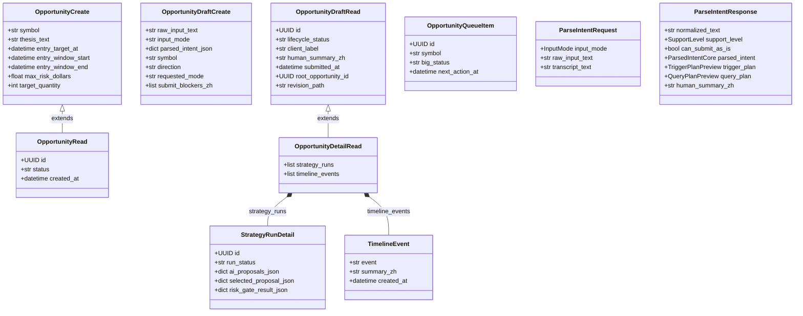
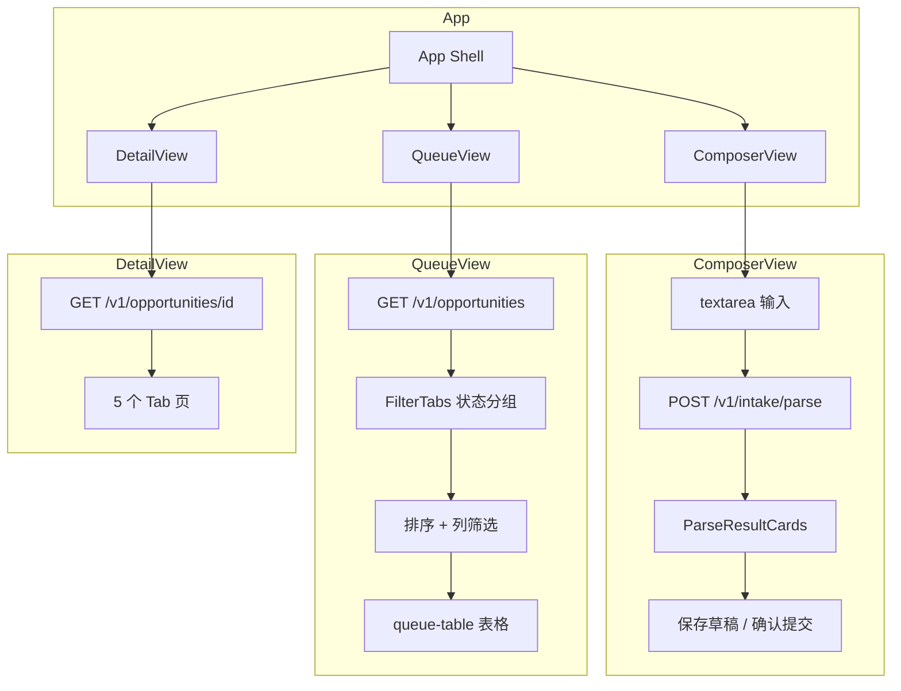

<!-- PAGE_ID: options_07_api -->

Relevant source files

The following files were used as context for generating this wiki page:

- [app.py:1-57](https://github.com/ChunmiaoYu/options_ai_trader/blob/f5f3ac84e9c5d963fc1450f12306ea264183dfad/src/options_event_trader/api/app.py#L1-L57)
- [opportunities.py:1-135](https://github.com/ChunmiaoYu/options_ai_trader/blob/f5f3ac84e9c5d963fc1450f12306ea264183dfad/src/options_event_trader/api/routers/opportunities.py#L1-L135)
- [intake.py:1-22](https://github.com/ChunmiaoYu/options_ai_trader/blob/f5f3ac84e9c5d963fc1450f12306ea264183dfad/src/options_event_trader/api/routers/intake.py#L1-L22)
- [health.py:1-27](https://github.com/ChunmiaoYu/options_ai_trader/blob/f5f3ac84e9c5d963fc1450f12306ea264183dfad/src/options_event_trader/api/routers/health.py#L1-L27)
- [strategy.py:1-21](https://github.com/ChunmiaoYu/options_ai_trader/blob/f5f3ac84e9c5d963fc1450f12306ea264183dfad/src/options_event_trader/api/routers/strategy.py#L1-L21)
- [executions.py:1-19](https://github.com/ChunmiaoYu/options_ai_trader/blob/f5f3ac84e9c5d963fc1450f12306ea264183dfad/src/options_event_trader/api/routers/executions.py#L1-L19)
- [monitoring.py:1-21](https://github.com/ChunmiaoYu/options_ai_trader/blob/f5f3ac84e9c5d963fc1450f12306ea264183dfad/src/options_event_trader/api/routers/monitoring.py#L1-L21)
- [schemas.py:1-253](https://github.com/ChunmiaoYu/options_ai_trader/blob/f5f3ac84e9c5d963fc1450f12306ea264183dfad/src/options_event_trader/domain/schemas.py#L1-L253)
- [intake_models.py:1-245](https://github.com/ChunmiaoYu/options_ai_trader/blob/f5f3ac84e9c5d963fc1450f12306ea264183dfad/src/options_event_trader/domain/intake_models.py#L1-L245)
- [index.html:1-1549](https://github.com/ChunmiaoYu/options_ai_trader/blob/f5f3ac84e9c5d963fc1450f12306ea264183dfad/frontend/index.html#L1-L1549)

# API 接口与前端

> **Related Pages**: [[数据库与持久化|06_database.md]]

---

<!-- BEGIN:AUTOGEN options_07_api_endpoints -->
## API 端点清单

FastAPI 应用由 `create_app()` 工厂函数创建，注册了 6 个路由模块（[app.py:42-47](https://github.com/ChunmiaoYu/options_ai_trader/blob/f5f3ac84e9c5d963fc1450f12306ea264183dfad/src/options_event_trader/api/app.py#L42-L47)）。前端静态文件通过 `StaticFiles` 挂载在根路径 `/` 上（[app.py:49-51](https://github.com/ChunmiaoYu/options_ai_trader/blob/f5f3ac84e9c5d963fc1450f12306ea264183dfad/src/options_event_trader/api/app.py#L49-L51)）。

### 健康检查

| 方法 | 路径 | 说明 | 请求体 | 响应体 |
|------|------|------|--------|--------|
| GET | `/health` | 健康检查，验证数据库连通性 | 无 | `{app, env, db, openai_enabled, ibkr_host, ibkr_port}` |

健康检查端点执行 `SELECT 1` 查询验证数据库连接，并返回当前环境配置信息（[health.py:14-26](https://github.com/ChunmiaoYu/options_ai_trader/blob/f5f3ac84e9c5d963fc1450f12306ea264183dfad/src/options_event_trader/api/routers/health.py#L14-L26)）。

### Intake 解析（`/v1/intake`）

| 方法 | 路径 | 说明 | 请求体 | 响应体 |
|------|------|------|--------|--------|
| POST | `/v1/intake/parse` | 解析自然语言交易意图 | `ParseIntentRequest` | `ParseIntentResponse` |

该端点接收用户的自然语言输入，通过 Agent1（LangGraph 工作流）解析为结构化的交易意图（[intake.py:12-21](https://github.com/ChunmiaoYu/options_ai_trader/blob/f5f3ac84e9c5d963fc1450f12306ea264183dfad/src/options_event_trader/api/routers/intake.py#L12-L21)）。支持 429/500/502/503/504 错误码，返回 `IntakeErrorResponse`（含 `error_code` 和 `message_zh`）。

### 机会单管理（`/v1/opportunities`）

| 方法 | 路径 | 说明 | 请求体 | 响应体 |
|------|------|------|--------|--------|
| POST | `/v1/opportunities` | 保存草稿（DRAFT） | `OpportunityDraftCreate` | `OpportunityDraftRead` |
| POST | `/v1/opportunities/{id}/submit` | 提交草稿，创建触发规则 | 无 | `OpportunityDraftRead` |
| GET | `/v1/opportunities/{id}` | 获取机会单详情（含策略运行和时间线） | 无 | `OpportunityDetailRead` |
| GET | `/v1/opportunities` | 客户队列列表 | 无 | `list[OpportunityQueueItem]` |
| POST | `/v1/opportunities/legacy` | 旧版创建（向后兼容） | `OpportunityCreate` | `OpportunityRead` |

草稿保存端点从解析结果创建 DRAFT 状态的机会单，不创建触发规则（[opportunities.py:46-51](https://github.com/ChunmiaoYu/options_ai_trader/blob/f5f3ac84e9c5d963fc1450f12306ea264183dfad/src/options_event_trader/api/routers/opportunities.py#L46-L51)）。提交端点将 DRAFT 转为 SUBMITTED，并创建对应的 TriggerRule（[opportunities.py:54-62](https://github.com/ChunmiaoYu/options_ai_trader/blob/f5f3ac84e9c5d963fc1450f12306ea264183dfad/src/options_event_trader/api/routers/opportunities.py#L54-L62)）。

详情端点会额外查询最近 5 条 StrategyRun 和最新一次运行的 AuditEvent 时间线事件（[opportunities.py:65-111](https://github.com/ChunmiaoYu/options_ai_trader/blob/f5f3ac84e9c5d963fc1450f12306ea264183dfad/src/options_event_trader/api/routers/opportunities.py#L65-L111)）。

队列端点将内部 `lifecycle_status` 映射为前端展示用的 `big_status`，映射规则为 `SUBMITTED→NEW`、`SCHEDULED→SCHEDULED`、`IN_PROGRESS→IN_PROGRESS`（[opportunities.py:119](https://github.com/ChunmiaoYu/options_ai_trader/blob/f5f3ac84e9c5d963fc1450f12306ea264183dfad/src/options_event_trader/api/routers/opportunities.py#L119)）。

### 策略运行（`/v1/strategy-runs`）

| 方法 | 路径 | 说明 | 请求体 | 响应体 |
|------|------|------|--------|--------|
| POST | `/v1/strategy-runs` | 手动触发策略生成 | `StrategyRunCreateRequest` | `StrategyRunRead` |

接收 `opportunity_id`、`market_context`、`option_chain_snapshot` 和 `trigger_source`，调用策略服务生成策略运行记录（[strategy.py:14-20](https://github.com/ChunmiaoYu/options_ai_trader/blob/f5f3ac84e9c5d963fc1450f12306ea264183dfad/src/options_event_trader/api/routers/strategy.py#L14-L20)）。

### 执行记录（`/v1/executions`）

| 方法 | 路径 | 说明 | 请求体 | 响应体 |
|------|------|------|--------|--------|
| GET | `/v1/executions` | 查询执行运行记录列表 | 无（`limit` 查询参数，默认 100） | `list[ExecutionRunRead]` |

支持 `limit` 查询参数控制返回数量，范围 1-500（[executions.py:13-18](https://github.com/ChunmiaoYu/options_ai_trader/blob/f5f3ac84e9c5d963fc1450f12306ea264183dfad/src/options_event_trader/api/routers/executions.py#L13-L18)）。

### 监控配置（`/v1/monitoring`）

| 方法 | 路径 | 说明 | 请求体 | 响应体 |
|------|------|------|--------|--------|
| GET | `/v1/monitoring/config` | 获取监控配置 | 无 | `MonitorConfigRead` |
| PUT | `/v1/monitoring/config` | 更新监控配置 | `MonitorConfigUpdate` | `MonitorConfigRead` |

监控配置包括止盈/止损开关和阈值、保证金维护等（[monitoring.py:14-20](https://github.com/ChunmiaoYu/options_ai_trader/blob/f5f3ac84e9c5d963fc1450f12306ea264183dfad/src/options_event_trader/api/routers/monitoring.py#L14-L20)）。

Sources: [app.py:20-53](https://github.com/ChunmiaoYu/options_ai_trader/blob/f5f3ac84e9c5d963fc1450f12306ea264183dfad/src/options_event_trader/api/app.py#L20-L53), [opportunities.py:32-135](https://github.com/ChunmiaoYu/options_ai_trader/blob/f5f3ac84e9c5d963fc1450f12306ea264183dfad/src/options_event_trader/api/routers/opportunities.py#L32-L135), [intake.py:9-21](https://github.com/ChunmiaoYu/options_ai_trader/blob/f5f3ac84e9c5d963fc1450f12306ea264183dfad/src/options_event_trader/api/routers/intake.py#L9-L21)
<!-- END:AUTOGEN options_07_api_endpoints -->

---

<!-- BEGIN:AUTOGEN options_07_api_schemas -->
## Pydantic Schema

系统使用两组 Pydantic Schema：`domain/schemas.py` 定义 API 层面的请求/响应模型，`domain/intake_models.py` 定义 Intake 解析专用的数据结构。

### Schema 类关系图

### 核心 Schema 说明

**OpportunityDraftCreate** -- 从解析结果创建草稿的请求体。包含原始输入文本 `raw_input_text`、完整的解析结果 JSON `parsed_intent_json`，以及从解析结果中提取的便捷字段如 `symbol`、`direction`、`client_label` 等（[schemas.py:166-181](https://github.com/ChunmiaoYu/options_ai_trader/blob/f5f3ac84e9c5d963fc1450f12306ea264183dfad/src/options_event_trader/domain/schemas.py#L166-L181)）。

**OpportunityDraftRead** -- 草稿和已提交机会单的统一响应体。包含 16 个生命周期字段，其中 `root_opportunity_id`、`parent_opportunity_id`、`revision_path` 支持修改链追溯（[schemas.py:183-204](https://github.com/ChunmiaoYu/options_ai_trader/blob/f5f3ac84e9c5d963fc1450f12306ea264183dfad/src/options_event_trader/domain/schemas.py#L183-L204)）。

**OpportunityDetailRead** -- 继承 `OpportunityDraftRead`，额外携带 `strategy_runs`（最近 5 条策略运行详情）和 `timeline_events`（最新运行的时间线事件）（[schemas.py:249-253](https://github.com/ChunmiaoYu/options_ai_trader/blob/f5f3ac84e9c5d963fc1450f12306ea264183dfad/src/options_event_trader/domain/schemas.py#L249-L253)）。

**StrategyRunDetail** -- 策略运行详情，包含 4 个 JSONB 字段：`ai_proposals_json`（AI 生成的 2-3 个方案）、`selected_proposal_json`（自动选中的方案）、`risk_gate_result_json`（风控结果）、`market_context_json`（市场上下文）（[schemas.py:226-239](https://github.com/ChunmiaoYu/options_ai_trader/blob/f5f3ac84e9c5d963fc1450f12306ea264183dfad/src/options_event_trader/domain/schemas.py#L226-L239)）。

**ParseIntentResponse** -- Intake 解析的完整响应，包含 13 个子结构：`parsed_intent`（核心意图）、`trigger_plan`（触发方案）、`activation_plan`（激活方案）、`query_plan`（数据查询计划）、`risk_constraints`（风险约束）、`strategy_preferences`（策略偏好）等（[intake_models.py:221-242](https://github.com/ChunmiaoYu/options_ai_trader/blob/f5f3ac84e9c5d963fc1450f12306ea264183dfad/src/options_event_trader/domain/intake_models.py#L221-L242)）。

**OpportunityCreate** -- 旧版创建请求体，包含 `entry_target_at` 和 `entry_window_start/end` 的互斥校验（不能同时提供点时间和窗口时间）（[schemas.py:27-42](https://github.com/ChunmiaoYu/options_ai_trader/blob/f5f3ac84e9c5d963fc1450f12306ea264183dfad/src/options_event_trader/domain/schemas.py#L27-L42)）。

Sources: [schemas.py:1-253](https://github.com/ChunmiaoYu/options_ai_trader/blob/f5f3ac84e9c5d963fc1450f12306ea264183dfad/src/options_event_trader/domain/schemas.py#L1-L253), [intake_models.py:1-245](https://github.com/ChunmiaoYu/options_ai_trader/blob/f5f3ac84e9c5d963fc1450f12306ea264183dfad/src/options_event_trader/domain/intake_models.py#L1-L245)
<!-- END:AUTOGEN options_07_api_schemas -->

---

<!-- BEGIN:AUTOGEN options_07_api_frontend -->
## 前端界面

前端是一个基于 React 18 的单页应用（SPA），以 CDN 方式加载 React + Babel，全部代码集中在 `frontend/index.html` 一个文件中（[index.html:7-9](https://github.com/ChunmiaoYu/options_ai_trader/blob/f5f3ac84e9c5d963fc1450f12306ea264183dfad/frontend/index.html#L7-L9)）。面向中国客户，所有界面内容为中文。

### 应用架构

应用使用 `useReducer` + `createContext` 管理全局状态，无需外部状态管理库（[index.html:432-462](https://github.com/ChunmiaoYu/options_ai_trader/blob/f5f3ac84e9c5d963fc1450f12306ea264183dfad/frontend/index.html#L432-L462)）。

### 三大视图

**1. 新建机会（ComposerView）** -- 用户在文本框中用中文描述交易意图，点击"解析意图"调用 `/v1/intake/parse`。解析结果通过 `ParseResultCards` 组件以卡片网格形式展示，包括基本信息、触发条件、事件背景、风险约束、策略偏好、数据计划六个卡片（[index.html:482-531](https://github.com/ChunmiaoYu/options_ai_trader/blob/f5f3ac84e9c5d963fc1450f12306ea264183dfad/frontend/index.html#L482-L531)）。内置 6 个测试场景供快速验证（[index.html:377-384](https://github.com/ChunmiaoYu/options_ai_trader/blob/f5f3ac84e9c5d963fc1450f12306ea264183dfad/frontend/index.html#L377-L384)）。

**2. 客户队列（QueueView）** -- 展示所有机会单的表格视图。支持 6 个状态分组 Tab（全部/草稿/活跃/待处理/已完成/历史）和 Excel 风格的列筛选（[index.html:327-332](https://github.com/ChunmiaoYu/options_ai_trader/blob/f5f3ac84e9c5d963fc1450f12306ea264183dfad/frontend/index.html#L327-L332)）。表格列包括名称、标的、触发摘要、模式、状态、更新时间，均支持排序和交叉筛选（[index.html:650-657](https://github.com/ChunmiaoYu/options_ai_trader/blob/f5f3ac84e9c5d963fc1450f12306ea264183dfad/frontend/index.html#L650-L657)）。日期列支持年/月/日树形层级筛选（[index.html:693-717](https://github.com/ChunmiaoYu/options_ai_trader/blob/f5f3ac84e9c5d963fc1450f12306ea264183dfad/frontend/index.html#L693-L717)）。

**3. 机会详情（DetailView）** -- 包含 5 个 Tab 页（[index.html:1096-1100](https://github.com/ChunmiaoYu/options_ai_trader/blob/f5f3ac84e9c5d963fc1450f12306ea264183dfad/frontend/index.html#L1096-L1100)）：

| Tab | 内容 |
|-----|------|
| 概览 | 解析结果卡片网格 + 客户摘要 |
| 原始请求 | 用户原始输入文本 + 系统理解摘要 |
| 解析意图与触发 | 触发条件 + 事件背景 + 策略偏好 + 数据计划 |
| 策略 | Pipeline 状态条 + 已选中策略（展开）+ 其他方案（折叠）+ 风控结果 + 执行时间线 |
| 执行与时间线 | 执行状态概览 + 订单明细（策略头部 + 指标网格 + 合约腿表格）+ 修改来源链接 + 执行时间线 + 历史运行记录 |

### 状态管理

全局状态由 `appReducer` 管理，支持以下 action：

| Action | 说明 |
|--------|------|
| `NAVIGATE` | 页面导航（composer / queue / detail） |
| `EDIT_DRAFT` | 进入草稿编辑模式 |
| `SET_OPPORTUNITIES` | 从 API 加载队列数据 |
| `UPSERT_OPPORTUNITY` | 创建或更新单条机会单 |
| `SET_QUEUE_TAB` | 切换队列状态分组 Tab |
| `SET_QUEUE_SORT` | 设置排序列和方向 |
| `SET_QUEUE_FILTER` | 设置列筛选条件 |

队列状态（Tab 选择、排序方向、筛选条件）在 Tab 切换时持久化不丢失（[index.html:459-461](https://github.com/ChunmiaoYu/options_ai_trader/blob/f5f3ac84e9c5d963fc1450f12306ea264183dfad/frontend/index.html#L459-L461)）。

### 中文本地化

前端定义了完整的中文枚举映射表，覆盖方向、模式、状态、触发类型、运行方式、风格、数据源等维度（[index.html:310-346](https://github.com/ChunmiaoYu/options_ai_trader/blob/f5f3ac84e9c5d963fc1450f12306ea264183dfad/frontend/index.html#L310-L346)）。状态 Badge 使用颜色编码区分 12 种大状态（[index.html:246-258](https://github.com/ChunmiaoYu/options_ai_trader/blob/f5f3ac84e9c5d963fc1450f12306ea264183dfad/frontend/index.html#L246-L258)）。

Sources: [index.html:1-1549](https://github.com/ChunmiaoYu/options_ai_trader/blob/f5f3ac84e9c5d963fc1450f12306ea264183dfad/frontend/index.html#L1-L1549)
<!-- END:AUTOGEN options_07_api_frontend -->

---
