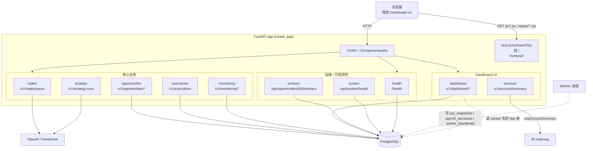
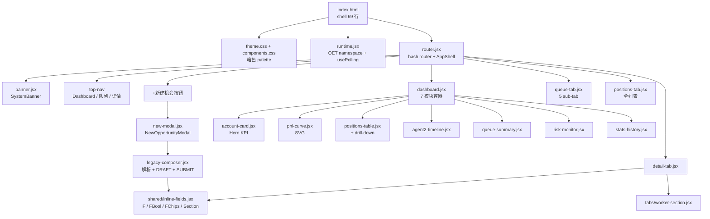
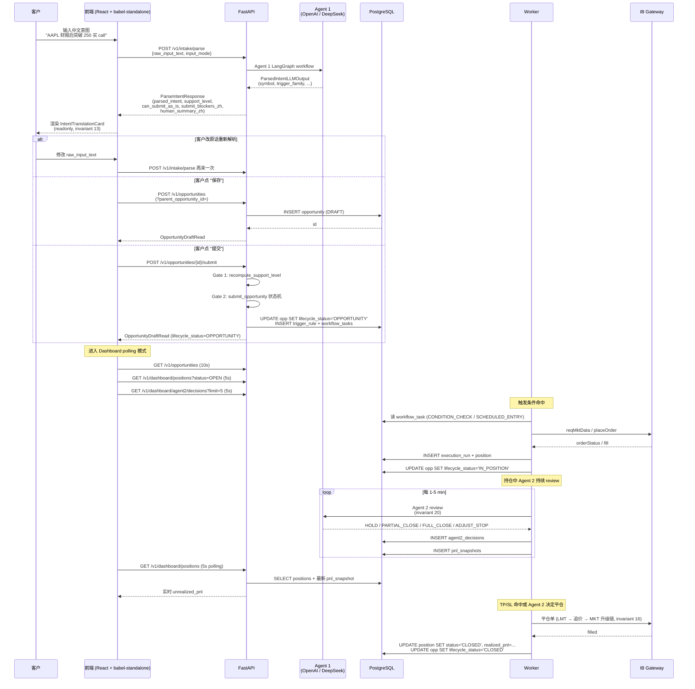

<!-- PAGE_ID: options_07_api -->
<details>
<summary>📚 Relevant source files</summary>

The following files were used as context for generating this wiki page (commit `6b3d159`):

- [src/options_event_trader/api/app.py](https://github.com/ChunmiaoYu/options_ai_trader/blob/6b3d159/src/options_event_trader/api/app.py)
- [src/options_event_trader/api/routers/account.py](https://github.com/ChunmiaoYu/options_ai_trader/blob/6b3d159/src/options_event_trader/api/routers/account.py)
- [src/options_event_trader/api/routers/dashboard.py](https://github.com/ChunmiaoYu/options_ai_trader/blob/6b3d159/src/options_event_trader/api/routers/dashboard.py)
- [src/options_event_trader/api/routers/executions.py](https://github.com/ChunmiaoYu/options_ai_trader/blob/6b3d159/src/options_event_trader/api/routers/executions.py)
- [src/options_event_trader/api/routers/health.py](https://github.com/ChunmiaoYu/options_ai_trader/blob/6b3d159/src/options_event_trader/api/routers/health.py)
- [src/options_event_trader/api/routers/intake.py](https://github.com/ChunmiaoYu/options_ai_trader/blob/6b3d159/src/options_event_trader/api/routers/intake.py)
- [src/options_event_trader/api/routers/monitoring.py](https://github.com/ChunmiaoYu/options_ai_trader/blob/6b3d159/src/options_event_trader/api/routers/monitoring.py)
- [src/options_event_trader/api/routers/opportunities.py](https://github.com/ChunmiaoYu/options_ai_trader/blob/6b3d159/src/options_event_trader/api/routers/opportunities.py)
- [src/options_event_trader/api/routers/strategy.py](https://github.com/ChunmiaoYu/options_ai_trader/blob/6b3d159/src/options_event_trader/api/routers/strategy.py)
- [src/options_event_trader/api/routers/system.py](https://github.com/ChunmiaoYu/options_ai_trader/blob/6b3d159/src/options_event_trader/api/routers/system.py)
- [src/options_event_trader/api/routers/workers.py](https://github.com/ChunmiaoYu/options_ai_trader/blob/6b3d159/src/options_event_trader/api/routers/workers.py)
- [src/options_event_trader/domain/schemas.py](https://github.com/ChunmiaoYu/options_ai_trader/blob/6b3d159/src/options_event_trader/domain/schemas.py)
- [src/options_event_trader/domain/intake_models.py](https://github.com/ChunmiaoYu/options_ai_trader/blob/6b3d159/src/options_event_trader/domain/intake_models.py)
- [frontend/index.html](https://github.com/ChunmiaoYu/options_ai_trader/blob/6b3d159/frontend/index.html)
- [frontend/js/runtime.jsx](https://github.com/ChunmiaoYu/options_ai_trader/blob/6b3d159/frontend/js/runtime.jsx)
- [frontend/js/router.jsx](https://github.com/ChunmiaoYu/options_ai_trader/blob/6b3d159/frontend/js/router.jsx)
- [frontend/js/dashboard.jsx](https://github.com/ChunmiaoYu/options_ai_trader/blob/6b3d159/frontend/js/dashboard.jsx)
- [frontend/js/modules/account-card.jsx](https://github.com/ChunmiaoYu/options_ai_trader/blob/6b3d159/frontend/js/modules/account-card.jsx)
- [frontend/js/modules/positions-table.jsx](https://github.com/ChunmiaoYu/options_ai_trader/blob/6b3d159/frontend/js/modules/positions-table.jsx)
- [frontend/js/modules/queue-summary.jsx](https://github.com/ChunmiaoYu/options_ai_trader/blob/6b3d159/frontend/js/modules/queue-summary.jsx)
- [frontend/js/modules/agent2-timeline.jsx](https://github.com/ChunmiaoYu/options_ai_trader/blob/6b3d159/frontend/js/modules/agent2-timeline.jsx)
- [frontend/js/modules/risk-monitor.jsx](https://github.com/ChunmiaoYu/options_ai_trader/blob/6b3d159/frontend/js/modules/risk-monitor.jsx)
- [frontend/js/modules/pnl-curve.jsx](https://github.com/ChunmiaoYu/options_ai_trader/blob/6b3d159/frontend/js/modules/pnl-curve.jsx)
- [frontend/js/modules/stats-history.jsx](https://github.com/ChunmiaoYu/options_ai_trader/blob/6b3d159/frontend/js/modules/stats-history.jsx)
- [frontend/js/components/banner.jsx](https://github.com/ChunmiaoYu/options_ai_trader/blob/6b3d159/frontend/js/components/banner.jsx)
- [frontend/js/tabs/queue-tab.jsx](https://github.com/ChunmiaoYu/options_ai_trader/blob/6b3d159/frontend/js/tabs/queue-tab.jsx)
- [frontend/js/tabs/positions-tab.jsx](https://github.com/ChunmiaoYu/options_ai_trader/blob/6b3d159/frontend/js/tabs/positions-tab.jsx)
- [frontend/js/tabs/detail-tab.jsx](https://github.com/ChunmiaoYu/options_ai_trader/blob/6b3d159/frontend/js/tabs/detail-tab.jsx)
- [frontend/js/tabs/worker-section.jsx](https://github.com/ChunmiaoYu/options_ai_trader/blob/6b3d159/frontend/js/tabs/worker-section.jsx)
- [frontend/js/shared/inline-fields.jsx](https://github.com/ChunmiaoYu/options_ai_trader/blob/6b3d159/frontend/js/shared/inline-fields.jsx)
- [frontend/js/new-modal.jsx](https://github.com/ChunmiaoYu/options_ai_trader/blob/6b3d159/frontend/js/new-modal.jsx)
- [frontend/styles/theme.css](https://github.com/ChunmiaoYu/options_ai_trader/blob/6b3d159/frontend/styles/theme.css)
- [frontend/styles/components.css](https://github.com/ChunmiaoYu/options_ai_trader/blob/6b3d159/frontend/styles/components.css)
- [docs/superpowers/specs/2026-04-29-ui-redesign-design.md](https://github.com/ChunmiaoYu/options_ai_trader/blob/6b3d159/docs/superpowers/specs/2026-04-29-ui-redesign-design.md)
- [docs/superpowers/specs/2026-05-04-worker-visualization-state-machine-design.md](https://github.com/ChunmiaoYu/options_ai_trader/blob/6b3d159/docs/superpowers/specs/2026-05-04-worker-visualization-state-machine-design.md)
- [docs/superpowers/specs/2026-05-03-intent-translation-card-readonly-design.md](https://github.com/ChunmiaoYu/options_ai_trader/blob/6b3d159/docs/superpowers/specs/2026-05-03-intent-translation-card-readonly-design.md)
- [docs/superpowers/specs/2026-05-03-agent1-position-schema-radical-simplify-design.md](https://github.com/ChunmiaoYu/options_ai_trader/blob/6b3d159/docs/superpowers/specs/2026-05-03-agent1-position-schema-radical-simplify-design.md)

</details>

# API 接口与前端

> **Related Pages**: [[数据库与持久化|06_database.md]], [[依赖项与配置|08_dependencies.md]]

---

本页拆解 Options Event Trader 的 HTTP 边界与浏览器侧渲染层：FastAPI 工厂如何拼装应用、10 个 router 各自暴露什么端点、Plan 2 暗色 Dashboard v2 在 React 18 + babel-standalone 体系下怎么组织、客户从输入中文到 Worker 自动执行的全数据流、以及为什么前端必须中文+面向桌面优先+不走窄 max-width 的产品约束。

旧版本 wiki（commit `f5f3ac8` 时代）写的是 6 个 router + 1549 行单文件 SPA 三 tab 布局，本次按 commit `6b3d159` 完整重写：现在是 **10 个 router**、**Plan 2 暗色 Dashboard 入口 + 7 模块 + 详情多 tab**、**`NoCacheStaticFiles` 防 babel-standalone 浏览器 cache**。

---

<!-- BEGIN:AUTOGEN options_07_api_app_factory -->
## 1. FastAPI 应用初始化

整个 HTTP 边界由 [src/options_event_trader/api/app.py](https://github.com/ChunmiaoYu/options_ai_trader/blob/6b3d159/src/options_event_trader/api/app.py) 一个文件描述清楚。`create_app()` 工厂函数依次完成五件事：

1. 读 `Settings` 拿应用名 + 版本号 (`0.3.1`)
2. 注册 CORS 中间件（允许全部 origin / method / header）
3. 注册 `IntakeServiceError` 自定义异常处理器
4. 顺序 include 10 个 router
5. 把 `frontend/` 整目录通过 `NoCacheStaticFiles` 挂在根路径 `/` 上

```python
def create_app() -> FastAPI:
    settings = get_settings()
    app = FastAPI(title=settings.app_name, version="0.3.1")

    app.add_middleware(
        CORSMiddleware,
        allow_origins=["*"],
        allow_credentials=True,
        allow_methods=["*"],
        allow_headers=["*"],
    )

    @app.exception_handler(IntakeServiceError)
    async def handle_intake_service_error(_: Request, exc: IntakeServiceError) -> JSONResponse:
        return JSONResponse(
            status_code=exc.status_code,
            content={
                "error_code": exc.error_code,
                "message_zh": exc.message_zh,
            },
        )

    app.include_router(health_router)
    app.include_router(intake_router)
    app.include_router(opportunities_router)
    app.include_router(executions_router)
    app.include_router(strategy_router)
    app.include_router(monitoring_router)
    app.include_router(account_router)
    app.include_router(dashboard_router)
    app.include_router(workers_router)
    app.include_router(system_router)

    frontend_dir = Path(__file__).resolve().parents[3] / "frontend"
    if frontend_dir.exists():
        app.mount("/", NoCacheStaticFiles(directory=str(frontend_dir), html=True), name="frontend")

    return app
```

### 1.1 CORS

`allow_origins=["*"]` 是「FastAPI 进程同时承担前端静态文件 host」这一架构选择的副产物。前端 `runtime.jsx` 用 `apiBase = ""` 同源调用，浏览器层面其实不会跨域；通配 origin 主要给本地开发 + 调试时直接 `curl` 命中各 endpoint。

### 1.2 IntakeServiceError 异常处理器

只有 Intake 路径（`/v1/intake/parse`）会 raise `IntakeServiceError`，其携带：

- `status_code`：HTTP 状态码（429 / 500 / 502 / 503 / 504）
- `error_code`：业务级错误码（如 `LLM_TIMEOUT`、`UPSTREAM_RATE_LIMIT`）
- `message_zh`：中文用户可见提示

异常处理器把这三项打包成 `IntakeErrorResponse`（见 [intake_models.py](https://github.com/ChunmiaoYu/options_ai_trader/blob/6b3d159/src/options_event_trader/domain/intake_models.py)）：

```json
{
  "error_code": "LLM_TIMEOUT",
  "message_zh": "AI 分析超时，请稍后重试"
}
```

这跟 [[系统架构概览|01_overview.md]] 里说的 invariant 12（前端面向中国客户，所有客户可见内容必须中文）保持一致——前端 `ErrorBanner` 直接展示 `message_zh`，不需要做任何二次翻译。

### 1.3 NoCacheStaticFiles

这是 `app.py` 文件最特殊的一段代码，专门解决 P0-2 production bug（fix 日期 2026-05-01）：

```python
class NoCacheStaticFiles(StaticFiles):
    """前端 .jsx / .html 返 no-cache header, 让 dev 改动立即可见.

    P0-2 fix 2026-05-01: chromium 默认 disk cache jsx + babel-standalone
    transpile cache 让 detail-tab.jsx 改动后浏览器仍渲染老版本. 给所有
    .jsx / .html 返 Cache-Control: no-cache 让 browser 每次 revalidate.
    """
    async def get_response(self, path: str, scope: Scope):
        response = await super().get_response(path, scope)
        if path.endswith((".jsx", ".html", ".js", ".css")):
            response.headers["Cache-Control"] = "no-cache, no-store, must-revalidate"
            response.headers["Pragma"] = "no-cache"
            response.headers["Expires"] = "0"
        return response
```

**为什么必须存在**：项目前端不走 webpack/Vite 构建链，而是把 `.jsx` 原文件直接交给浏览器，由 `babel-standalone` 在客户端 transpile 成 ES 浏览器可执行的代码（见 §5）。Chromium 默认对 `.js` / `.html` 走 disk cache，而 `babel-standalone` 又会缓存 transpile 结果，两层叠加导致：

1. 服务端 deploy 了新 `detail-tab.jsx`
2. 客户访问，浏览器从 disk cache 读旧的 `.jsx`（200 OK from disk cache，没 hit 网络）
3. babel-standalone 又对旧文件命中 transpile cache
4. 客户看到的 UI 永远是上一版

`NoCacheStaticFiles` 给所有 `.jsx` / `.html` / `.js` / `.css` 强制返：

- `Cache-Control: no-cache, no-store, must-revalidate`
- `Pragma: no-cache`
- `Expires: 0`

让浏览器每次都对 server revalidate。即便如此，babel-standalone 内部 transpile cache 还是激进的，所以演示前依然推荐客户硬刷 (Ctrl+Shift+R) 一次（详见 finding `F-2026-04-30-FRONTEND-BABEL-CACHE-AFTER-DEPLOY`）。

### 1.4 路由注册顺序

`include_router` 的顺序在 FastAPI 里没有功能性影响（路由 trie 里都是平级的），但本项目按「业务优先级」排：health → intake → opportunities → executions → strategy → monitoring → account → dashboard → workers → system。这个顺序也是本页 §2 的展开顺序。

<!-- END:AUTOGEN options_07_api_app_factory -->

---

<!-- BEGIN:AUTOGEN options_07_api_router_diagram -->
## 2. 10 个 Router 全景图



下面逐个 router 拆开看。每个 endpoint 都标注了实际请求 / 响应 schema 的入口（来自 `domain/schemas.py` 或 `domain/intake_models.py`）。

<!-- END:AUTOGEN options_07_api_router_diagram -->

<!-- BEGIN:AUTOGEN options_07_api_router_health -->
### 2.1 health — `/health`

[src/options_event_trader/api/routers/health.py](https://github.com/ChunmiaoYu/options_ai_trader/blob/6b3d159/src/options_event_trader/api/routers/health.py)

| 方法 | 路径 | 说明 |
|------|------|------|
| GET | `/health` | 应用健康检查 + commit_sha + DB 连通性 |

健康检查执行 `SELECT 1` 探活 PostgreSQL，并返回应用配置摘要：

```json
{
  "app": "Options Event Trader",
  "env": "dev",
  "db": "ok",
  "openai_enabled": true,
  "ibkr_host": "127.0.0.1",
  "ibkr_port": 4002,
  "commit_sha": "6b3d159..."
}
```

`commit_sha` 是 deployment 链路里的关键字段：

- `_get_commit_sha()` 用 `git rev-parse HEAD` 取当前进程启动时所在的 commit，并用 `@lru_cache` 在进程级别缓存一次（不会每次请求都 fork git 子进程）。
- `subprocess` 失败（git 不在 PATH / 不是 git 仓库 / 超时 2s）则返回 `"unknown"`。
- CI/CD 部署脚本会在 deploy 完先 curl `/health` 比对 `commit_sha == 期望提交`，确认 systemd 已经把新二进制起来了才往下走 (见 [[依赖项与配置|08_dependencies.md]] 部署章节)。

为什么 `commit_sha` 在 health 里而不是 system router：health 是「最低公分母」端点，运维拨号工具（uptime monitoring、HAProxy health check、Oracle Cloud Load Balancer）通常只 ping 一个固定路径；`/health` 同时承担了「活着没」和「跑的是哪个版本」两件事。

<!-- END:AUTOGEN options_07_api_router_health -->

<!-- BEGIN:AUTOGEN options_07_api_router_intake -->
### 2.2 intake — `/v1/intake/parse`

[src/options_event_trader/api/routers/intake.py](https://github.com/ChunmiaoYu/options_ai_trader/blob/6b3d159/src/options_event_trader/api/routers/intake.py)

| 方法 | 路径 | 说明 |
|------|------|------|
| POST | `/v1/intake/parse` | Agent 1（LangGraph 工作流）把自然语言意图解析为结构化 JSON |

**请求体** `ParseIntentRequest`（[intake_models.py:14-38](https://github.com/ChunmiaoYu/options_ai_trader/blob/6b3d159/src/options_event_trader/domain/intake_models.py#L14-L38)）：

```python
class ParseIntentRequest(BaseModel):
    input_mode: InputMode = InputMode.TEXT       # TEXT | VOICE
    raw_input_text: str | None = None
    transcript_text: str | None = None           # VOICE 模式用
```

`@model_validator` 强制语义：TEXT 模式需 `raw_input_text` 非空；VOICE 模式需 `transcript_text` 或 `raw_input_text` 至少一个非空。`resolved_text` 属性按 input_mode 选具体哪段文本送下游。

**响应体** `ParseIntentResponse`（[intake_models.py:199-221](https://github.com/ChunmiaoYu/options_ai_trader/blob/6b3d159/src/options_event_trader/domain/intake_models.py#L199-L221)）含 16+ 字段，关键的有：

| 字段 | 含义 |
|------|------|
| `parsed_intent` | `ParsedIntentCore` — 标的 / mode / 事件窗口 |
| `trigger_plan` | 触发规则预览（家族 + 中文摘要 + spec） |
| `activation_plan` | 入场窗口规划（point_time / window） |
| `subscription_plan` | 该机会单要订阅哪些行情流（list） |
| `compute_plan` | 运行时要计算哪些指标（MA / 突破检测） |
| `query_plan` | 启动 / 触发 / pre-order / post-fill 各阶段要查的字段 |
| `risk_constraints` | `max_risk_dollars` |
| `support_level` | 是否能落地（SUPPORTED / NEEDS_CONTEXT / UNSUPPORTED） |
| `can_submit_as_is` | 能否直接 submit |
| `submit_blockers_zh` | 阻断原因数组（中文） |
| `human_summary_zh` | 系统对解析结果的中文一句话总结 |
| `validation_errors_zh` | LLM 识别到的客户原话内部矛盾（金额 vs % 同时表达等） |

**错误码**：429 / 500 / 502 / 503 / 504 都返回 `IntakeErrorResponse`（`error_code` + `message_zh`）。前端 `legacy-composer.jsx` / `new-modal.jsx` 直接透传 `message_zh` 到 banner。

**和业务规则的关联**：

- invariant 2（parse ≠ submit）：`/v1/intake/parse` **不创建任何 trigger 或 task**，只产 JSON。创建必走 `POST /v1/opportunities`。
- invariant 5（必填字段只有 symbol）：2026-05-03 v3 极致瘦身后，Agent 1 不再产 `direction` / `target_quantity` / `take_profit_spec` / `stop_loss_spec` / `position_spec` / `max_legs`等 13+ 字段，全部交给 Agent 2 看 `raw_input_text` 自决（见 [[Agent 2 策略生成|03_strategy.md]]）。
- invariant 3（submit_blockers_zh 是硬阻断）：`can_submit_as_is=False` 时 `submit_blockers_zh` 必非空，前端用这个字段渲染 IntentTranslationCard 上的红色阻断条。

<!-- END:AUTOGEN options_07_api_router_intake -->

<!-- BEGIN:AUTOGEN options_07_api_router_opportunities -->
### 2.3 opportunities — `/v1/opportunities/*`

[src/options_event_trader/api/routers/opportunities.py](https://github.com/ChunmiaoYu/options_ai_trader/blob/6b3d159/src/options_event_trader/api/routers/opportunities.py)

整个生命周期里最重的 router，承担机会单从 DRAFT → SUBMIT → IN_POSITION → CLOSED 的所有 CRUD。

| 方法 | 路径 | Pydantic 输入 | 输出 |
|------|------|----------------|------|
| POST | `/v1/opportunities/legacy` | `OpportunityCreate` | `OpportunityRead` |
| POST | `/v1/opportunities` | `OpportunityDraftCreate` (+ `parent_opportunity_id` query 可选) | `OpportunityDraftRead` |
| POST | `/v1/opportunities/{id}/submit` | — | `OpportunityDraftRead` |
| GET | `/v1/opportunities/{id}` | — | `OpportunityDetailRead` |
| GET | `/v1/opportunities` | — | `list[OpportunityQueueItem]` |

#### 2.3.1 POST `/v1/opportunities/legacy` — 老入口

`OpportunityCreate` 是「直接给一坨结构化 JSON 创建机会」的旧契约，保留给老脚本和测试用。响应是 `OpportunityRead`，前端不再走这个路径。

#### 2.3.2 POST `/v1/opportunities` — 保存草稿（DRAFT）

把一次 Agent 1 的 parse 结果落库为 DRAFT，**不会**创建 trigger 或 task。这条路径是 invariant 2 的物理实现。

请求体 `OpportunityDraftCreate`（[schemas.py:165-194](https://github.com/ChunmiaoYu/options_ai_trader/blob/6b3d159/src/options_event_trader/domain/schemas.py#L165-L194)）：

```python
class OpportunityDraftCreate(BaseModel):
    raw_input_text: str
    input_mode: str = "TEXT"
    parsed_intent_json: dict[str, Any]
    human_summary_zh: str | None = None

    symbol: str
    requested_mode: str | None = Field(default=None, deprecated=...)
    client_label: str | None = None
    trigger_summary_zh: str | None = None
    support_level: SupportLevel | None = None
    submit_blockers_zh: list[str] | None = None

    max_risk_dollars: float | None = None
    max_legs: int | None = None
```

2026-05-03 B 方案 spec radical simplify 后，原本的 `direction` / `preferred_strategies` / `disallowed_strategies` / `target_quantity` / `partial_fill_policy` / `take_profit_spec` / `stop_loss_spec` / `position_spec` 8 个字段已全删（详见 [docs/superpowers/specs/2026-05-03-agent1-position-schema-radical-simplify-design.md](https://github.com/ChunmiaoYu/options_ai_trader/blob/6b3d159/docs/superpowers/specs/2026-05-03-agent1-position-schema-radical-simplify-design.md)）。

**Query 参数 `parent_opportunity_id`**：实现 invariant 13（修改 = 取消原单 + 创建复制单）的物理通道。客户在详情页改回输入框重新解析后，前端 POST 时带上原 opp id：

- `revision_path` 自动递增（`#5` → `#5.1` → `#5.1.1`）
- 时间戳沿用 lineage root（不重置 created_at）
- `parent_opportunity_id` 字段记录直接父
- `root_opportunity_id` 记录链根，用于 timeline 还原全链
- submit 这条 DRAFT 时会自动取消原单（`save_draft` 结束后 `db.commit()` 触发 ON COMMIT trigger）

#### 2.3.3 POST `/v1/opportunities/{id}/submit` — 草稿转机会单

把 DRAFT 转成 SUBMITTED 状态，创建 trigger rule，进客户队列。两道闸门：

**Gate 1 — 重算 support_level**：
```python
recomputed = recompute_support_level(opp_for_check)
if recomputed.support_level == SupportLevel.UNSUPPORTED:
    raise HTTPException(status_code=422, detail={
        "error_code": "OPPORTUNITY_UNSUPPORTED",
        "message_zh": "当前机会单暂不可执行，请按提示补充或改为保存草稿",
        "submit_blockers_zh": recomputed.submit_blockers_zh,
    })
```

**关键**：不信 DB 老值，每次 submit 时基于当前 schema 版本重算。这避免「DB 里 support_level=SUPPORTED 但 trigger_family 已被删除」这类时间错位 bug。

**Gate 2 — `submit_opportunity` 的 ValueError**：
状态机非法转换（如 CLOSED 状态调 submit）会抛 `ValueError`，路由把它翻译成 400。

调用 `submit_opportunity` 后会：
1. 创建 TriggerRule
2. 创建 ENTRY_GATE / CONDITION_CHECK / SCHEDULED_ENTRY 等 WorkflowTask
3. opportunity 状态机：`DRAFT` → `OPPORTUNITY`
4. （Phase 1 已落地）触发 feedback agent 消费层（若有 edit_signals / feedback_records 但失败不阻塞 submit）

#### 2.3.4 GET `/v1/opportunities/{id}` — 单条详情

返回 `OpportunityDetailRead`，继承自 `OpportunityDraftRead` 并扩展两个数组字段：

- `strategy_runs: list[StrategyRunDetail]` — 该机会单最近 5 条策略生成
- `timeline_events: list[TimelineEvent]` — 最新一次策略 run 关联的 PIPELINE category audit_event

**SQL 优化**：strategy_runs 按 `created_at desc` 取 top 5；timeline_events 仅查最新一次 strategy run 关联的事件，避免 N+1 全量加载。

**Pydantic 组装技巧**：因为 `OpportunityDetailRead` 比 `OpportunityDraftRead` 多两个字段，路由内手工拆装：

```python
base = OpportunityDraftRead.model_validate(opp)
return OpportunityDetailRead(
    **base.model_dump(),
    strategy_runs=strategy_runs,
    timeline_events=timeline_events,
)
```

#### 2.3.5 GET `/v1/opportunities` — 客户队列

列表端点，支撑前端「队列 tab」的 5 个 sub-tab（DRAFT / OPPORTUNITY / IN_POSITION / CLOSED / FAILED）。返 `list[OpportunityQueueItem]`。

最关键的特性是 `has_dead_worker` 字段，通过纯 SQL 高效计算（不进 ORM）：

```sql
EXISTS (
    SELECT 1 FROM workflow_tasks wt
    WHERE wt.opportunity_id = o.id
      AND wt.task_status = 'PENDING'
      AND (
          wt.last_check_at IS NULL OR
          NOW() - wt.last_check_at >
              MAKE_INTERVAL(secs => wt.expected_interval_seconds * 3)
      )
) AS has_dead_worker
```

**算法语义**：该机会单存在 PENDING workflow_task，且 `last_check_at` 离现在超过预期间隔的 3 倍 → 大概率 worker 挂了。前端 queue-tab 据此把行变红 + 加 `data-has-dead-worker="true"` attribute（见 §6.4）。

`STATUS_MAP` 把 `lifecycle_status` 映射成前端用的 `big_status`，本版是恒等映射（`DRAFT → DRAFT`...），保留是因为 invariant 11 收敛 4 状态过程中会有迁移期。

**注释标记**：`# 注: spec §5.2 示例 filter lifecycle_status IN ('OPPORTUNITY', 'IN_POSITION') 这里全量返回...` 表示当前实现走「全量返 + 前端按 big_status 过滤分组」而不是「后端 filter」。利弊：

- ✓ 一次 fetch 满足所有 sub-tab 切换，前端不需要重新 polling
- ✗ 客户量大后 payload 会膨胀（暂不是问题，单个客户机会单 < 100 条数量级）

<!-- END:AUTOGEN options_07_api_router_opportunities -->

<!-- BEGIN:AUTOGEN options_07_api_router_executions -->
### 2.4 executions — `/v1/executions`

[src/options_event_trader/api/routers/executions.py](https://github.com/ChunmiaoYu/options_ai_trader/blob/6b3d159/src/options_event_trader/api/routers/executions.py)

| 方法 | 路径 | 说明 |
|------|------|------|
| GET | `/v1/executions?limit=N` | 列出执行记录（最新优先） |

`limit` 由 `Query(default=100, ge=1, le=500)` 校验，最大 500 条防止意外巨型查询。返回 `list[ExecutionRunRead]` 含：

- `run_type` — 入场 / 出场 / 平仓
- `execution_status` — PLACED / FILLED / PARTIAL / FAILED 等
- `requested_quantity` / `filled_quantity` / `remaining_quantity`
- `idempotency_key` — 防重发关键字段
- `retry_count` / `max_retries` — 升级链当前进度
- `last_error` — 失败原因（透传给前端）

注意 2026-05-03 spec §3.5 删除了 `partial_fill_policy` 字段（Agent 2 自决，不再做静态策略）。

`ExecutionRunRead` 的 `started_at` / `finished_at` 有可能为 None（任务还没 pickup 或被取消）。前端展示需考虑这个边界。

<!-- END:AUTOGEN options_07_api_router_executions -->

<!-- BEGIN:AUTOGEN options_07_api_router_strategy -->
### 2.5 strategy — `/v1/strategy-runs`

[src/options_event_trader/api/routers/strategy.py](https://github.com/ChunmiaoYu/options_ai_trader/blob/6b3d159/src/options_event_trader/api/routers/strategy.py)

| 方法 | 路径 | 说明 |
|------|------|------|
| POST | `/v1/strategy-runs` | 触发 Agent 2 生成一次策略（手动 / 调试入口） |

请求 `StrategyRunCreateRequest`：

```python
class StrategyRunCreateRequest(BaseModel):
    opportunity_id: UUID
    market_context: dict[str, Any]
    option_chain_snapshot: dict[str, Any]
    trigger_source: str = "MANUAL"
```

业务上这个 endpoint 是给「人工触发一次策略生成」用的，比如：

1. QA 想验 Agent 2 在某 MarketContext 下的输出
2. 调试时 hand-craft 一份 `option_chain_snapshot` 看 selected_proposal

生产链路里 Agent 2 是由 Worker 在 trigger 命中时自己调度的（见 [[Worker 与任务队列|04_worker.md]]），不走 HTTP。

响应 `StrategyRunRead` 含：

- `run_status` — PENDING / SUCCESS / FAILED
- `llm_model` — 实际 hit 的模型（DeepSeek V4-Flash entry / Claude Haiku review，invariant 20）
- `prompt_version` — prompt 版本号
- `human_summary` — 中文一句话给前端展示
- `structured_decision` — 完整结构化决策 dict

<!-- END:AUTOGEN options_07_api_router_strategy -->

<!-- BEGIN:AUTOGEN options_07_api_router_monitoring -->
### 2.6 monitoring — `/v1/monitoring/*`

[src/options_event_trader/api/routers/monitoring.py](https://github.com/ChunmiaoYu/options_ai_trader/blob/6b3d159/src/options_event_trader/api/routers/monitoring.py)

| 方法 | 路径 | 说明 |
|------|------|------|
| GET | `/v1/monitoring/config` | 获取持仓监控全局配置 |
| PUT | `/v1/monitoring/config` | 更新持仓监控全局配置 |
| GET | `/v1/monitoring/live-pnl` | 实时持仓 P&L（进程内 state） |

#### 2.6.1 config 端点

`MonitorConfigRead` / `MonitorConfigUpdate`（[schemas.py:137-159](https://github.com/ChunmiaoYu/options_ai_trader/blob/6b3d159/src/options_event_trader/domain/schemas.py#L137-L159)）：

```python
class MonitorConfigRead(BaseModel):
    id: UUID | None = None
    scope: str = "GLOBAL"
    auto_take_profit_enabled: bool = False
    take_profit_pct: float | None = None
    auto_stop_loss_enabled: bool = False
    stop_loss_pct: float | None = None
    auto_margin_maintenance_enabled: bool = False
    min_excess_liquidity: float | None = None
    extra_rules: dict[str, Any] | None = None
```

跟 invariant 16（止盈止损全自动不甩给用户）配对：监控配置允许调阈值、不允许「让用户决定」的开关。

#### 2.6.2 `/live-pnl` — 进程内共享 state

```python
_monitor_state: dict[int, PositionPnLState] = {}

def set_monitor_state(state: dict[int, PositionPnLState]) -> None:
    """Called by worker to share monitor state with API."""
    global _monitor_state
    _monitor_state = state
```

设计说明：

- **同进程**情况下（dev 单进程跑 API + worker），worker 直接调用 `set_monitor_state()` 把内存里的 `PositionPnLState` 字典共享给 router。
- **多进程**情况下（生产 UAT/PROD，API 和 worker 是独立 systemd unit），这个 endpoint 只反映 **API 进程内**的 state，会一直是空。生产模式下前端不该依赖此 endpoint，应改用 `/v1/dashboard/positions`（基于 `pnl_snapshots` 表跨进程读，§2.8）。
- 这是「跨进程通信坑」的典型例子，全局 CLAUDE.md §13 「数字 / 配置 / 阈值」分层禁令的反面：进程内变量不能成为唯一真相。

<!-- END:AUTOGEN options_07_api_router_monitoring -->

<!-- BEGIN:AUTOGEN options_07_api_router_account -->
### 2.7 account — `/v1/account/summary`

[src/options_event_trader/api/routers/account.py](https://github.com/ChunmiaoYu/options_ai_trader/blob/6b3d159/src/options_event_trader/api/routers/account.py)

| 方法 | 路径 | 说明 |
|------|------|------|
| GET | `/v1/account/summary` | API 进程直连 IB Gateway 拿账户摘要 |

**响应** `AccountSummaryResponse`：

```python
class AccountSummaryResponse(BaseModel):
    available: bool
    account_id: str | None = None
    net_liquidation: float | None = None
    total_cash: float | None = None
    buying_power: float | None = None
    available_funds: float | None = None
    currency: str | None = None
    reason_zh: str | None = None
```

**关键设计**：

1. **3 秒进程级短缓存**避免连击风暴：

   ```python
   _CACHE: dict[str, Any] = {"data": None, "ts": 0.0}
   _CACHE_TTL_SEC = 3.0
   ```

   前端 `account-card.jsx` polling 30s，但还有别的客户端会调（监控 / 调试），3s 缓存让多个调用者只触发一次 IBKR connect。

2. **永不抛异常**，失败也返 `available=False + reason_zh`：

   ```python
   except TimeoutError:
       return AccountSummaryResponse(available=False, reason_zh="IB Gateway 未连接或响应超时，账户信息暂不可用")
   except Exception as exc:
       logger.exception("account.query.failed")
       return AccountSummaryResponse(available=False, reason_zh=f"查询账户失败：{type(exc).__name__}")
   ```

   Dashboard 永远不会因为 IBKR 暂时挂掉而整页爆 500，前端读到 `available=false` 显示降级提示。

3. **专用 client_id=99**：

   ```python
   account_settings = settings.model_copy(update={"ibkr_client_id": 99, "ibkr_connect_timeout_sec": 5})
   ```

   跟 worker / executor 用的 client_id 隔离，避免 IBKR 同 client_id 互踢（CLAUDE.md §4 IBKR 运维 checklist 第 4 条）。每次调完都 `client.shutdown()`，不持有长连接。

4. **跟 dashboard.py /account 的区别**：

   `account.py` 的 `/v1/account/summary`（**API 进程内**直连 IBKR）用真实数据；`dashboard.py` 的 `/v1/dashboard/account`（spec §6.3 polling 30s）目前是 v2 stub 返 0 + `_warning`，要等加了 `account_snapshots` 表 + worker 写跨进程数据后才能从 DB 读。前端 `account-card.jsx` 已切到 `/v1/account/summary`（P0 fix 2026-05-01，见组件代码注释）。

<!-- END:AUTOGEN options_07_api_router_account -->

<!-- BEGIN:AUTOGEN options_07_api_router_dashboard -->
### 2.8 dashboard — `/v1/dashboard/*`

[src/options_event_trader/api/routers/dashboard.py](https://github.com/ChunmiaoYu/options_ai_trader/blob/6b3d159/src/options_event_trader/api/routers/dashboard.py)

UI 重设计 Phase 1 的产物（spec [2026-04-29-ui-redesign-design.md](https://github.com/ChunmiaoYu/options_ai_trader/blob/6b3d159/docs/superpowers/specs/2026-04-29-ui-redesign-design.md)），7 个端点支撑 Plan 2 暗色 Dashboard 的 7 个模块。

| 方法 | 路径 | 用途 | 前端 polling |
|------|------|------|------|
| GET | `/v1/dashboard/pnl` | 单 position 最近 N 秒 PnL snapshots | 1s |
| GET | `/v1/dashboard/account` | 账户摘要 stub（v2 待接） | 30s |
| GET | `/v1/dashboard/pnl-curve?range=today\|7d\|30d` | PnL 曲线点序列 | 5s |
| GET | `/v1/dashboard/stats` | 胜率 / 平均盈亏比 / 最大回撤 / 本月 PnL | 60s |
| GET | `/v1/dashboard/risk` | 账户级 Greeks / 临近到期 stub | 30s |
| GET | `/v1/dashboard/positions?status=OPEN\|CLOSED\|ALL` | 持仓 + 最新 unrealized_pnl 聚合 | 5s |
| GET | `/v1/dashboard/agent2/decisions?limit=N` | 最近 N 条 Agent 2 决策 | 5s |

#### 2.8.1 `/pnl` — 单 position 高频曲线

```python
@router.get("/pnl")
def get_pnl(
    position_id: UUID,
    since_sec: int = Query(60, ge=1, le=3600),
    db: Session = Depends(get_db_dep),
) -> dict[str, Any]:
```

- `since_sec` 限 1-3600 秒，避免一次拉太多
- 数据源 `pnl_snapshots` 表（worker 写 1/s，API 读最近 N 条），跨进程通信靠 DB
- 解决了 `monitoring.py /live-pnl` 的进程内共享 state 不能跨进程问题

#### 2.8.2 `/account` — v2 stub

当前实现返 0 + `_warning`。架构设计假设是「后续加 `account_snapshots` 表 worker 写，API 这里读」。前端 `account-card.jsx` 实测后切到了 `/v1/account/summary`（API 进程内直连），所以这个 endpoint 实质上目前没人用。

#### 2.8.3 `/pnl-curve` — 全账户 PnL 曲线

按 `range` 选起点：`today` 取当日 0:00；`7d` 倒推 7 天；`30d` 倒推 30 天。返回 `{"points": [{ts, unrealized_pnl}]}`。

注释明示 v2 待加：realized PnL（CLOSED 的 `Position.realized_pnl` 一次性写入，按 `closed_at` 时间点离散加）。

#### 2.8.4 `/stats` — 胜率 / 盈亏比

只看 `Position.status == "CLOSED"`：

```python
wins = [p for p in closed if (p.realized_pnl or 0.0) > 0]
losses = [p for p in closed if (p.realized_pnl or 0.0) < 0]
win_rate = len(wins) / len(closed) if closed else 0.0
```

**避免 ZeroDivisionError 的 idiom**：

```python
if losses:
    avg_loss = abs(sum(p.realized_pnl or 0.0 for p in losses) / len(losses))
    avg_pnl_ratio = round(avg_win / avg_loss, 2) if avg_loss > 0 else None
else:
    avg_pnl_ratio = None  # 无亏损样本, 盈亏比未定义
```

`avg_pnl_ratio = None` 时同时返一个 `_note_avg_pnl_ratio` 字段告诉前端为什么没值，前端 `stats-history.jsx` 渲染 "—" 而不是 `0.00`（这个数学上完全错位）。

`max_drawdown` 暂时是 0（占位，v2 加 rolling drawdown from `pnl_snapshots`）。

#### 2.8.5 `/risk` — Greeks 聚合 v2 stub

设计预期错位的典型例子：

> Position.raw_payload 顶层无 delta/gamma/theta/vega. Greeks 在 BundleSnapshot.greeks (Agent 2 transient), 不持久化到 Position.

所以本版返 0 + `_warning`：

```json
{
  "net_delta": 0.0,
  "net_gamma": 0.0,
  "net_theta": 0.0,
  "net_vega": 0.0,
  "near_expiry_alerts": [],
  "open_count": 1,
  "_warning": "Greeks 聚合 v2 待接入 (需 position_greeks_snapshots 表), 当前返默认 0"
}
```

前端 `risk-monitor.jsx` 检查 `_warning` 后渲染 "v2 待接入" 而不是假装显示有效数据 —— "假数据比无数据更危险" 是这个 stub 设计的核心理念。

#### 2.8.6 `/positions` — Dashboard 持仓表的核心 endpoint

最复杂的 endpoint，做了 3 件事：

1. **按 status 过滤** Position：OPEN / CLOSED / ALL
2. **一次性 join 最新 pnl_snapshot**（避 N+1）：

   ```sql
   SELECT position_id, MAX(ts) AS max_ts
   FROM pnl_snapshots
   WHERE position_id IN (...)
   GROUP BY position_id
   ```

   再 join 回 `PnlSnapshot` 拿这些 `(position_id, max_ts)` 对应的 `unrealized_pnl`。

3. **派生 `contract_label`**：从 `raw_payload` 的 `right + strike + expiry` 拼成 `"AAPL 250C 0430"` 风格。strike 能整数化就整数化（避免 `250.0C` 难看）。

返回字段对前端 `positions-table.jsx` / `positions-tab.jsx` 都够用：`id`, `symbol`, `contract_label`, `quantity`, `avg_cost`, `status`, `opened_at`, `closed_at`, `realized_pnl`, `unrealized_pnl`, `take_profit_summary`, `stop_loss_summary`, `raw_payload`（含 Greeks，给 drill-down 用）。

#### 2.8.7 `/agent2/decisions` — Agent 2 决策流

```python
@router.get("/agent2/decisions")
def get_agent2_decisions(
    limit: int = Query(5, ge=1, le=100),
    db: Session = Depends(get_db_dep),
) -> dict[str, Any]:
```

返回最近 N 条 Agent 2 决策（按 created_at desc）。前端 `agent2-timeline.jsx` 默认 limit=5 polling 5s。

`Agent2Decision.action` 取值（[invariant 10](https://github.com/ChunmiaoYu/options_ai_trader/blob/6b3d159/CLAUDE.md)）：HOLD / PARTIAL_CLOSE / FULL_CLOSE / ADJUST_STOP，前端按 action 上色（`agent2-timeline.jsx` 的 `ACTION_COLORS` 映射）。

`executed` 字段区分「Agent 2 决定要做」和「真的发送到 broker 了」——决策后还有 risk gate / 下单失败等环节。

<!-- END:AUTOGEN options_07_api_router_dashboard -->

<!-- BEGIN:AUTOGEN options_07_api_router_workers -->
### 2.9 workers — `/api/opportunities/{id}/workers`

[src/options_event_trader/api/routers/workers.py](https://github.com/ChunmiaoYu/options_ai_trader/blob/6b3d159/src/options_event_trader/api/routers/workers.py)

| 方法 | 路径 | 说明 |
|------|------|------|
| GET | `/api/opportunities/{id}/workers` | 单机会单的「后台工人」视图（详情页用） |

P0-B Worker Visualization 补丁的产物（spec [2026-05-04-worker-visualization-state-machine-design.md](https://github.com/ChunmiaoYu/options_ai_trader/blob/6b3d159/docs/superpowers/specs/2026-05-04-worker-visualization-state-machine-design.md)）。返回 `OpportunityWorkersView` 含 3 个子视图：

```python
class OpportunityWorkersView(BaseModel):
    opportunity_id: str
    origin_type: str
    origin_metadata: dict
    shared_time_worker: SharedTimeWorkerView | None
    condition_worker: ConditionWorkerView | None
    position_maintenance_worker: PositionMaintenanceWorkerView | None
    effective_until: datetime
```

#### 2.9.1 SharedTimeWorker — 跨机会单单点心跳

`shared_time_worker` 状态由 `worker_heartbeats` 表的 `MAX(recorded_at) WHERE worker_id='shared_time_worker' AND event_type='TICK'` 决定：

- `MAINTENANCE` — IBKR 周日维护窗口（`is_in_ibkr_maintenance_window(now)` 命中）
- `DEAD` — `last_tick_at == None` 或离现在 > 90 秒（30 秒间隔 × 3 容忍倍数）
- `ALIVE` — 否则

阈值：`SHARED_TIME_HEARTBEAT_INTERVAL_SECONDS = 30`、`SHARED_TIME_STALE_MULTIPLIER = 3`，即 90 秒不动判死。

#### 2.9.2 ConditionWorker — 条件 worker 视图

只对 `task_type == 'CONDITION_CHECK'` 的 PENDING workflow_task 渲染。返回最近一条 + opp 的 trigger 摘要。`compute_worker_status(task_obj, now)` 统一判逻辑（见 [services/worker_status.py](https://github.com/ChunmiaoYu/options_ai_trader/blob/6b3d159/src/options_event_trader/services/worker_status.py)）。

#### 2.9.3 PositionMaintenanceWorker — 持仓维护 worker 视图

只对 `lifecycle_status == "IN_POSITION"` 的 opportunity 渲染。返回：

- 最近一条 `task_type == 'POSITION_REVIEW'` task 状态
- 关联的 `agent2_decisions` 历史（仅 `action != 'HOLD' AND executed = true`）

历史决策按 `executed_at_utc desc` 排，前端 `worker-section.jsx` 按时间线渲染。

**SQL 直查的取舍**：路由里多次用 `db.execute(text("..."))` 而不是 ORM。原因是这些查询带聚合 / 复合条件，ORM 写法不如裸 SQL 直观，且 worker 视图只读不写，N+1 风险小。

<!-- END:AUTOGEN options_07_api_router_workers -->

<!-- BEGIN:AUTOGEN options_07_api_router_system -->
### 2.10 system — `/api/system/health`

[src/options_event_trader/api/routers/system.py](https://github.com/ChunmiaoYu/options_ai_trader/blob/6b3d159/src/options_event_trader/api/routers/system.py)

| 方法 | 路径 | 说明 |
|------|------|------|
| GET | `/api/system/health` | shared_time_worker 心跳健康（前端 banner 用） |

```python
@router.get("/health")
def system_health(db: Session = Depends(get_db_dep)):
    """Returns shared_time_worker health for banner display."""
    last_tick_row = db.execute(text("""
        SELECT MAX(recorded_at) FROM worker_heartbeats
        WHERE worker_id = 'shared_time_worker' AND event_type = 'TICK'
    """)).fetchone()
    last_tick = last_tick_row[0] if last_tick_row else None
    now = now_utc()
    is_dead = last_tick is None or (now - last_tick).total_seconds() > SHARED_TIME_DEAD_THRESHOLD_SECONDS
    return {
        "shared_time_worker_dead": is_dead,
        "last_tick_at": last_tick.isoformat() if last_tick else None,
    }
```

跟 `workers.py` 的 SharedTime 心跳同一阈值（90s = 30s × 3）。区别：

- `workers.py` 在 OpportunityWorkersView 里嵌入 SharedTime status，**单机会单**视图用
- `system.py` 是**全局** banner 用，每 30s polling 一次（前端 `banner.jsx`）

为什么独立 router：banner 前端无条件 polling，不依赖具体 opportunity_id；放系统级路径 `/api/system/*` 语义更清。

`SHARED_TIME_DEAD_THRESHOLD_SECONDS = 90` 在两处独立常量，本来应该合并到一个 config 里（findings 提了，未跟进），但目前两处常量值一致没出问题。

<!-- END:AUTOGEN options_07_api_router_system -->

---

<!-- BEGIN:AUTOGEN options_07_frontend_overview -->
## 3. 前端架构总览（Plan 2 暗色 Dashboard v2）

`frontend/index.html` 现在仅 69 行，是一个 React 18 应用的 shell。所有 UI 逻辑分布在 14 个 `.jsx` 文件 + 2 个 `.css` 文件里：

| 文件 | 行数 | 角色 |
|------|------|------|
| `frontend/index.html` | 69 | Shell + script include 顺序 |
| `frontend/styles/theme.css` | 227 | 配色 / 字体 / `.btn` `.top-nav` 全局 |
| `frontend/styles/components.css` | 1254 | Card / Table / Modal / Worker Section / Detail page 等 |
| `frontend/js/runtime.jsx` | 157 | OET namespace + apiGet/apiPost + usePolling + utility |
| `frontend/js/router.jsx` | 97 | Hash router + AppShell + 顶部 tab nav |
| `frontend/js/dashboard.jsx` | 68 | DashboardView 7 模块容器 + DashboardCard |
| `frontend/js/legacy-composer.jsx` | 507 | 「+新建机会」表单（解析 → DRAFT → SUBMIT） |
| `frontend/js/new-modal.jsx` | 48 | Modal 包装 LegacyComposer |
| `frontend/js/components/banner.jsx` | 35 | 全局 SystemBanner（worker dead 警告） |
| `frontend/js/modules/account-card.jsx` | 71 | Hero KPI 净值 + 今日 PnL + 副字段 |
| `frontend/js/modules/positions-table.jsx` | 107 | Dashboard 持仓表 + drill-down + Greeks 普通话 |
| `frontend/js/modules/queue-summary.jsx` | 61 | Dashboard 队列摘要（5 状态计数 + 最近 3 条） |
| `frontend/js/modules/agent2-timeline.jsx` | 78 | Agent 2 决策流（最近 5 条 + trace modal） |
| `frontend/js/modules/risk-monitor.jsx` | 57 | 账户级风险（Greeks v2 stub） |
| `frontend/js/modules/pnl-curve.jsx` | 177 | SVG line chart（无外部 chart 库） |
| `frontend/js/modules/stats-history.jsx` | 45 | 胜率 / 盈亏比 / 最大回撤 / 本月 PnL |
| `frontend/js/shared/inline-fields.jsx` | 77 | F / FBool / FChips / Section 共享字段组件 |
| `frontend/js/tabs/queue-tab.jsx` | 148 | 队列 tab（5 sub-tab：DRAFT / OPPORTUNITY / IN_POSITION / CLOSED / FAILED） |
| `frontend/js/tabs/positions-tab.jsx` | 95 | 持仓全列表 tab（OPEN + CLOSED） |
| `frontend/js/tabs/detail-tab.jsx` | 149 | 单条机会详情（基础 / 触发 / 风险 / Worker / JSON） |
| `frontend/js/tabs/worker-section.jsx` | 118 | 详情页内嵌 worker 视图 |

总行数约 2150 行 jsx + 1481 行 css，比上一代 1549 行单文件 SPA 拆得更细。

### 3.1 Mermaid: 前端组件层级



### 3.2 OET namespace 模式

每个 `.jsx` 文件第一行都是：

```js
window.OET = window.OET || {};
```

然后把组件挂上去：`window.OET.AccountCard = AccountCard`、`window.OET.usePolling = usePolling` 等。这是 babel-standalone 体系下没有 ES module 时的 namespace 共享方式，避免污染全局。`runtime.jsx` 必须先加载（提供 `OET.api` 和 `OET.usePolling` 的 base infrastructure），其他文件按需引用。

`dashboard.jsx` 里有个 fallback 模式 ——任何 `OET.AccountCard` 之类未注册时返一个 PlaceholderCard，让模块在 ship 期间可以增量部署：

```js
const Account = React.useMemo(() => OET.AccountCard || PlaceholderCard("card-account", "账户"), []);
```

`React.useMemo` 锁组件引用，避免每次 render 都生成新 PlaceholderCard 函数引发 React 把真组件 unmount/remount。

<!-- END:AUTOGEN options_07_frontend_overview -->

---

<!-- BEGIN:AUTOGEN options_07_frontend_react18 -->
## 4. React 18 + babel-standalone（无构建链）

为什么不用 webpack / Vite：

- 项目核心是 trading 业务，前端是「让客户能下单 + 看持仓」的薄壳。前端工程化收益不抵复杂度成本。
- Plan 2 重设计前的单文件 SPA（1549 行 index.html）就是这个理念的极端版本，重设计后拆出 14 个 `.jsx` 但仍保留无构建链的核心。
- 对 deploy 的影响：CI/CD 不需要跑 `npm install + build`，只 sync 静态文件到 VM。

### 4.1 工作机制

`index.html` head 里 import 三个 CDN script：

```html
<script crossorigin src="https://unpkg.com/react@18/umd/react.production.min.js"></script>
<script crossorigin src="https://unpkg.com/react-dom@18/umd/react-dom.production.min.js"></script>
<script src="https://unpkg.com/@babel/standalone/babel.min.js"></script>
```

然后所有业务文件都用 `<script type="text/babel">`：

```html
<script type="text/babel" src="/js/runtime.jsx"></script>
<script type="text/babel" src="/js/router.jsx"></script>
<script type="text/babel" src="/js/dashboard.jsx"></script>
...
```

浏览器收到 `text/babel` MIME（其实 server 返 application/javascript，babel-standalone 用 `type` attribute 识别）后：

1. fetch `.jsx` 文件原文（含 JSX 语法）
2. 在浏览器里调 `Babel.transform()` 把 JSX 编译成 `React.createElement` 调用
3. eval 编译结果

**严重副作用 1：cache 激进**。babel-standalone 内部的 transpile cache + 浏览器 disk cache 双层叠加，client deploy 后看不到新 UI。`NoCacheStaticFiles`（§1.3）只能缓解 disk cache，babel cache 还是要客户硬刷一次。

**严重副作用 2：体积**。babel-standalone 本身 ~3MB，加上 React UMD ~130KB，首屏 cold cache 慢。生产用 minified production build + 全部 CDN。

**严重副作用 3：runtime 错误信号弱**。语法错或 ReferenceError 在 babel transform 阶段才暴露，不像 webpack 在构建时就抓住。

### 4.2 Script 加载顺序的硬依赖

`index.html` 里的 `<script>` 顺序就是模块依赖顺序：

```
runtime.jsx          (OET.api / OET.usePolling)
shared/inline-fields.jsx (OET.shared.F / FBool / FChips / Section)
router.jsx           (OET.useRoute / OET.AppShell)
legacy-composer.jsx  (OET.LegacyComposer)
dashboard.jsx        (OET.DashboardView + DashboardCard)
modules/*.jsx        (OET.AccountCard / PositionsTable / ...)
new-modal.jsx        (OET.NewOpportunityModal)
components/banner.jsx (OET.SystemBanner)
tabs/*.jsx           (OET.PositionsTab / QueueTab / WorkerSection / DetailTab)
inline 启动 script
```

最后 inline 的启动脚本：

```html
<script type="text/babel">
  /* babel-standalone 串行同步执行, runtime/router/legacy-composer 均已就绪 */
  ReactDOM.createRoot(document.getElementById("root")).render(
    React.createElement(window.OET.AppShell)
  );
</script>
```

注释明示「串行同步执行」是 babel-standalone 的关键性质——不像原生 ES module 是 async load，babel-standalone 把 `<script type="text/babel">` 按顺序编译执行。这让 namespace 模式（`window.OET.X = X`）能可靠工作。

<!-- END:AUTOGEN options_07_frontend_react18 -->

---

<!-- BEGIN:AUTOGEN options_07_frontend_dashboard -->
## 5. Dashboard 入口 + 7 模块布局

UI 重设计 v2 的核心决策（spec §3）：

| 决策 | 选择 |
|------|------|
| 客户画像 | A 私募 + B 散户（双类共用） |
| 调和策略 | 分层展开 drill-down（默认简洁，每行右"展开 ▾"） |
| 入口 | Dashboard 入口（默认重定向） |
| Dashboard 模块 | 7 个：账户 / 持仓 / 队列 / Agent2 timeline / 风险监控 / PnL 曲线 / 历史统计 |
| 布局 | 上窄下宽 3 row（1:1 / 1 / 2:1:1:1） |
| 视觉风格 | 暗色专业（cyberpunk trading terminal） |
| Tab 结构 | Dashboard / 队列 / 详情 + 顶部右"+新建"弹窗 |

### 5.1 三行 grid 布局（`dashboard.jsx`）

```jsx
return (
  <div className="dashboard-grid">
    <div className="dashboard-row dashboard-row-1">
      <Account />
      <PnlCurve />
    </div>
    <div className="dashboard-row dashboard-row-2">
      <Positions />
    </div>
    <div className="dashboard-row dashboard-row-3">
      <Agent2 />
      <Queue />
      <Risk />
      <Stats />
    </div>
  </div>
);
```

- **Row 1**：账户 hero KPI + 大 PnL chart（视觉主秀）
- **Row 2**：持仓全宽（最关心数据）
- **Row 3**：4 个二级模块（Agent 2 / 队列摘要 / 风险 / 历史统计）

行高比例由 `components.css` 里的 `grid-template-rows` 控制，Row 1 高度大约 240-280px、Row 2 自适应、Row 3 ~ 200px。

### 5.2 DashboardCard 容器

所有 7 模块都通过 `DashboardCard` 渲染，提供：

- `title` 卡片标题
- `lastUpdate`（usePolling 返回的 timestamp）配合 `staleDotClass()` 渲染右上角小绿点 / 黄点 / 灰点
- `error` 自动显示警告 icon + tooltip
- `freshSec` 各模块自定义新鲜度阈值（fresh < freshSec / warn < 2*freshSec / stale 否则）
- `headerExtra` 给 PnlCurve 之类需要 today / 7d / 30d 切换 button 用
- `testId` 给 Playwright e2e 抓元素用

### 5.3 Polling 频率（spec §6.3）

每模块自己定 polling 间隔：

| 模块 | 端点 | 间隔 |
|------|------|------|
| AccountCard | `/v1/account/summary` | 30s |
| PositionsTable | `/v1/dashboard/positions?status=OPEN` | 5s |
| QueueSummary | `/v1/opportunities` | 10s |
| Agent2Timeline | `/v1/dashboard/agent2/decisions?limit=5` | 5s |
| RiskMonitor | `/v1/dashboard/risk` | 30s |
| PnlCurve | `/v1/dashboard/pnl-curve?range=...` | 5s |
| StatsHistory | `/v1/dashboard/stats` | 60s |

为什么没用 WebSocket / SSE：spec §10 列入 v3 待做，本版本先用短 polling，UAT/PROD 实测再决定要不要升级。短 polling 简单、可观测、断网恢复零成本。

`runtime.jsx` 的 `usePolling(fetchFn, intervalMs, deps = [])` 自带：

- 立即第一次 fetch（不等 interval）
- success 后清错（一次成功擦掉过去的 error 信息）
- `useRef` 跟踪 `fetchFn`，避免 deps 改变时旧 closure 持续被调用
- unmount 自动 `clearInterval`

### 5.4 视觉风格 — cyberpunk trading terminal

`theme.css` 定义的配色（深 navy + 金 hairline + cyan glow）：

- `--bg-page: #060a14` 深 navy 让金 accent 跳出
- `--gold: #d4af37` 高端 trading 标志色
- `--accent: #06b6d4` cyan 数据 / 链接 / active tab
- `--profit: #10b981` / `--loss: #f43f5e` 红绿盈亏带 text-shadow glow

字体选用：

- `--font-display: "Tektur"` — hero 数字大字
- `--font-mono: "IBM Plex Mono"` — 表格数字 / 等宽对齐
- `--font-body: "Noto Sans SC"` — 中文 + 西文混排

特别处理：

- `body::before` 加 SVG noise texture overlay（fintech 高端感）
- 多层 background：60px 间距金色点 grid + 右上 cyan glow + 左上金色 glow
- top-nav title 用 gold + cyan 双层 linear-gradient + clip-text 实现品牌字效

<!-- END:AUTOGEN options_07_frontend_dashboard -->

---

<!-- BEGIN:AUTOGEN options_07_frontend_data_density -->
## 6. 数据密集型 UI（CLAUDE.md §17）

> 数据密集型应用的容器，**不能**用固定窄 max-width（如 1100px / 1440px）+ `margin: 0 auto`。这种居中模式适合博客 / 文章，不适合数据展示（1920px 屏上只占 57-75%，大量空白）。

历史教训：finding `F-2026-04-25-FRONTEND-ENTRY-BOTTOM-UNDERFILL` —— 1920×1080 屏上底部 65% 留白，客户反馈「界面像写文章不像 trading terminal」。

修复（commit `6b3d159` 当前实现）：

```css
.container {
  width: calc(100% - 32px);
  max-width: 1920px;
  margin: 0 auto;
  padding: 12px 16px;
}
```

- `max-width: 1920px` 兜底超宽屏不无限拉伸
- `padding: 12px 16px` 让数据有呼吸空间但不靠居中留白
- 1920×1080 视口实测占用 ≥ 95%（SC-D12 e2e 测试硬验）

跟全局 CLAUDE.md §17 完全对齐：「修 underfill bug 必须在目标视口（1920px）验证修复后占比 ≥ 95%」。

### 6.1 表格密度

数据表格也按密集型处理：

- `font-size: 13px`（屏宽 ≥ 1900px 时升 14px，`@media (min-width: 1900px)` 在 theme.css 第 90 行）
- `font-variant-numeric: tabular-nums` + `letter-spacing: -0.2px` 让数字等宽对齐 + 紧凑
- `.num-lg` (20px / 600) / `.num-xl` (28px / 700) 类辅助 hero 数字

### 6.2 桌面优先

UI 重设计 v2 spec §10「v2 待做」明确列出「移动端适配 < 1280px」放下个版本。当前所有布局假设 ≥ 1440px 屏。

**限制**：客户在外面只有手机时无法用这个 dashboard（finding `F-2026-04-30-FRONTEND-MOBILE-NOT-ADAPTED`，标 P1，实盘 1 周内必交付）。该 finding 涉及：

- 查持仓（最关键，盘中突变要立刻看）
- 接 push（Agent 2 决策推送）
- 简单平仓（极端情况手动 kill switch）

P1 实现思路（暂未做）：单独的 `/m/` 路径 mobile shell，不复用 dashboard，只做关键查 + 平仓。

<!-- END:AUTOGEN options_07_frontend_data_density -->

---

<!-- BEGIN:AUTOGEN options_07_frontend_dataflow -->
## 7. 数据流：客户输入 → Worker 自动执行



### 7.1 关键里程碑

1. **客户提交意图**：POST `/v1/intake/parse` 是纯 LLM 操作，**不写 DB**（invariant 2）。Agent 1 只负责派活，不替客户决定（feedback `feedback_agent1_role_dispatch_not_validate.md`）。
2. **IntentTranslationCard 是 readonly**：客户不能直接点字段改，只能改回输入框 `raw_input_text` 重新解析（spec [2026-05-03-intent-translation-card-readonly-design.md](https://github.com/ChunmiaoYu/2026-05-03-intent-translation-card-readonly-design.md)，invariant 13）。这跟 detail-tab 的 readonly 设计对齐——前端只展示 LLM 解析的结果，不允许"猜补"。
3. **DRAFT 阶段不影响交易**：客户随便保存草稿，Worker 不会 pickup（没创建 trigger）。
4. **SUBMIT 是关键动作**：才创建 TriggerRule + WorkflowTask，进客户队列。
5. **Worker 是真正干活的人**：API 进程不直接 placeOrder（只有 `account.py` 直连 IBKR 拿账户摘要这一例外）。所有交易动作走 Worker → IBKR。
6. **持仓后 Agent 2 持续 review**：invariant 10 的范式 —— 入场后每 bar 持续自主决策（HOLD / PARTIAL_CLOSE / FULL_CLOSE / ADJUST_STOP），不再是「一次生成交用户确认」。
7. **平仓全自动**：止盈止损升级链 LMT → 追价 → MKT 必须走到底（invariant 16），不允许「挂单失败 → 通知用户手动处理」的降级分支。

### 7.2 跨进程通信

API 和 Worker 是独立进程（生产是独立 systemd unit），唯一通信通道：

- **DB 写表，对方读表**：
  - Worker 写 `pnl_snapshots` / `agent2_decisions` / `worker_heartbeats` / `execution_runs` / `positions`
  - API 读上述表 + `opportunities` / `workflow_tasks` 给前端
- **不允许进程内共享变量做真相**：`monitoring.py` 的 `_monitor_state` 只在单进程 dev 下能用，生产无效（§2.6.2）

跟全局 CLAUDE.md §13 「config / 数字 / 阈值唯一真相」原则保持一致——跨进程数据靠 DB 表。

<!-- END:AUTOGEN options_07_frontend_dataflow -->

---

<!-- BEGIN:AUTOGEN options_07_client_dashboard_v21 -->
## 8. 客户协作 Dashboard 系统（v2.1）

注意区分：本项目 **frontend Dashboard**（FastAPI host 的暗色 UI）和 **客户协作 Dashboard 系统**（docs-hub 公开 wiki 的双轨）是**两个完全不同的产物**。

memory `project_client_dashboard.md` 描述的是后者：

| 系统 | 受众 | 用途 |
|------|------|------|
| **FastAPI 前端 Dashboard**（本页主题） | 客户内部使用 | 实时交易 / 持仓 / 队列 |
| **docs-hub 公开 Dashboard** | 客户对外展示 / 销售 | 项目状态 / 进度 / 决策记录 |
| **Agent 1/2 详细测试结果页面**（私有 docs-hub） | 客户内部 + 工程 | LLM 历次输出 / regression 结果 |

2026-05-02 用户 Tier 1 信号：「dashboard ≠ 详细测试结果, 别搞错」。

本 wiki 页只描述 FastAPI 前端 Dashboard。docs-hub 双轨见 [客户协作 Dashboard 系统专门文档](#)（暂未在本 wiki 涵盖，wiki 路径 TBD）。

<!-- END:AUTOGEN options_07_client_dashboard_v21 -->

---

<!-- BEGIN:AUTOGEN options_07_frontend_chinese -->
## 9. 前端中文（invariant 12）

> 前端面向中国客户，所有客户可见内容必须中文。

实现层面：

### 9.1 错误码本地化

每个错误源都有 `message_zh`：

- API 路由的 `IntakeServiceError` 直接带 `message_zh`，`app.py` 异常处理器透传给前端
- `submit_blockers_zh` 是数组（一次解析可能多个阻断原因）
- `validation_errors_zh` 同上（LLM 识别到的客户原话内部矛盾）
- `failure_reason` 在 `queue-tab.jsx` 通过 `FAILURE_REASON_ZH` map 翻译：

  ```js
  const FAILURE_REASON_ZH = {
    "CONDITION_NOT_MET":  "条件未满足",
    "EXPIRED":            "超时",
    "AGENT2_REJECTED":    "Agent 2 拒绝",
    "USER_CANCELLED":     "用户撤销",
    "EXECUTION_REVERSE":  "执行异常",
  };
  ```

### 9.2 status badge 本地化

`queue-tab.jsx` 的 `STATUS_MAP_ZH`：

```js
const STATUS_MAP_ZH = {
  "DRAFT":       "草稿",
  "OPPORTUNITY": "机会单",
  "IN_POSITION": "持仓中",
  "CLOSED":      "已平仓",
  "FAILED":      "失败",
};
```

`worker-section.jsx` 的 `WORKER_STATUS_CFG`：

```js
const WORKER_STATUS_CFG = {
  alive:       { bg: '#1c4a2c', fg: '#7ee98e', label: '运行中' },
  pending:     { bg: '#3a3a3a', fg: '#a0a0a0', label: '等待启动' },
  maintenance: { bg: '#5c3a1c', fg: '#ffba70', label: 'IBKR 周日维护窗口' },
  dead:        { bg: '#5c1c1c', fg: '#ff7070', label: '异常' },
};
```

### 9.3 枚举值本地化

`shared/inline-fields.jsx` 的 `ENUM_LABELS`：

```js
const ENUM_LABELS = {
  trigger_family: { ENTRY_TIME: "立即/时间点", ENTRY_WINDOW: "时间窗", MA_CROSSOVER: "均线交叉", PRICE_BREACH: "价位条件" },
  breach_direction: { ABOVE: "突破/上穿", BELOW: "跌破/下穿" },
  crossover_direction: { GOLDEN_CROSS: "金叉", DEATH_CROSS: "死叉" },
  price_field: { close: "收盘", open: "开盘", high: "最高", low: "最低" },
};
```

`F` 组件接收 `enumKey` 自动查 `ENUM_LABELS[enumKey][value]`，不在 map 里则原样展示。

### 9.4 Greeks 普通话翻译（P0-OPT-1）

`runtime.jsx` 的 `translateGreeks(greeks)` 把 `{delta, gamma, theta, vega}` 转成中文一句话：

```js
items.push({
  symbol: "Δ",
  value: fmtSign(d.toFixed(2)),
  plain: `价格敏感度: underlying 涨 $1, 期权涨 $${Math.abs(d).toFixed(2)}${d < 0 ? " (看跌方向)" : ""}`,
});
```

理念：散户客户看不懂 Δ Γ Θ Vega 数字，给一句中文说人话。私募客户看数字，散户看一句话——分层展开 drill-down 解决双类客户调和。

`positions-table.jsx` 的 `PositionDrillDown` 和 `risk-monitor.jsx` 都调 `translateGreeks`。

### 9.5 时间相对化

`runtime.jsx` 的 `fmtRelTime(ts)`：

```js
function fmtRelTime(ts) {
  if (!ts) return "—";
  const sec = Math.round((Date.now() - new Date(ts).getTime()) / 1000);
  if (sec < 60) return `${sec}s 前`;
  if (sec < 3600) return `${Math.round(sec / 60)}m 前`;
  return `${Math.round(sec / 3600)}h 前`;
}
```

中文 + 数字混排，比绝对时间戳「2026-05-08 10:23:45」对客户更直观。

### 9.6 货币 / 百分比

`fmtMoney(n, opts)` / `fmtPct(n, digits)` 集中实现，避免各组件自己拼字符串：

- 0 vs `null` 区分：`null` 返 `"—"`，0 返 `"$0.00"`
- 负数加负号：`"-$1,234.56"`
- 可选 `sign: true` 加 `+`（PnL 用）

<!-- END:AUTOGEN options_07_frontend_chinese -->

---

<!-- BEGIN:AUTOGEN options_07_frontend_revision_chain -->
## 10. 修改 = 取消原单 + 复制单（invariant 13）

> 修改 = 取消原单 + 创建复制单，嵌套编号 #5 → #5.1 → #5.1.1。
>
> **仅 Agent 1 机会单阶段适用**。Agent 2 的 PARTIAL_CLOSE / ADJUST_STOP 不进修改链，作为 execution_run 事实记录。

### 10.1 物理实现

**前端**（`detail-tab.jsx` + `legacy-composer.jsx`）：

1. 客户在详情页看到的所有字段都是 readonly（`F` / `FBool` / `FChips` / `Section` 共享组件）
2. 想改 → 必须回输入框（`legacy-composer.jsx` 的 textarea）改 `raw_input_text`
3. 重新点 "解析" → POST `/v1/intake/parse` 拿新 ParseIntentResponse
4. 点 "保存草稿"：POST `/v1/opportunities?parent_opportunity_id=<原 opp id>`

**后端**（`opportunities.py` 的 `save_draft`）：

- `parent_opportunity_id` query 参数收到原 opp id
- 内部计算 `revision_path`：parent 是 root（`#5`）→ 新单 `#5.1`；parent 是 `#5.1` → 新单 `#5.1.1`
- 设 `root_opportunity_id` 沿用 parent 的（lineage root，不重置）
- 时间戳 `created_at` 是新的，但 lineage 关联让前端能还原全链
- submit 这条 DRAFT 时自动取消原单的活跃 trigger（防止双重命中）

### 10.2 主队列只显大状态

invariant 11（2026-05-04 P0-B Worker 显化补丁后）：

> 大状态收敛 4 状态（草稿 / 机会单 / 持仓中 / 已平仓 + 失败终态）；
> 失败 5 原因；
> 中间态 EXECUTING / SCHEDULED / IN_PROGRESS / NO_TRADE / CANCELLED 物理删；
> 小状态仅详情页；Timeline 只显示业务事件。

前端实现：

- `queue-tab.jsx` 渲染 5 个 sub-tab：DRAFT / OPPORTUNITY / IN_POSITION / CLOSED / FAILED
- 每行只显 `big_status` + symbol + summary + relative time
- 失败的话加 `failure_reason` chip（`CONDITION_NOT_MET` 等）
- 点行进 `detail-tab.jsx` 才显 strategy_runs / timeline_events / Worker section

### 10.3 Timeline 只显业务事件

`detail-tab.jsx` fetch `OpportunityDetailRead.timeline_events`，由 `opportunities.py` 后端从 `audit_events` 表过滤：

```python
events = db.scalars(
    select(AuditEvent)
    .where(
        AuditEvent.category == "PIPELINE",
        AuditEvent.entity_id == str(latest_run.id),
    )
    .order_by(AuditEvent.created_at.asc())
).all()
```

只取 `category='PIPELINE'` 的事件——这些是「业务里程碑」事件（机会单创建 / 触发命中 / 入场成功 / Agent 2 决策 / 平仓），不包含 worker tick / system audit 之类的内部事件。

<!-- END:AUTOGEN options_07_frontend_revision_chain -->

---

<!-- BEGIN:AUTOGEN options_07_frontend_state_machine -->
## 11. 状态机 v2 与 4 大状态收敛

invariant 11（**2026-05-04 P0-B Worker 显化补丁，预期已 ship，待 finding `F-2026-05-04-INVARIANT-11-STATE-MACHINE-V2-MIGRATION` paper 1 周校准 close**）：

| 大状态 | lifecycle_status 值 | 中文 | UI 展示 |
|--------|--------------------|------|---------|
| 草稿 | `DRAFT` | 草稿 | 灰 |
| 机会单 | `OPPORTUNITY` | 机会单 | 默认 |
| 持仓中 | `IN_POSITION` | 持仓中 | profit 绿 |
| 已平仓 | `CLOSED` | 已平仓 | muted |
| 失败 | `FAILED` | 失败 | loss 红 |

被删除的中间态（不再出现在前端）：

- `EXECUTING` — 执行中（执行器内部，不暴露给客户）
- `SCHEDULED` — 已调度（worker 内部）
- `IN_PROGRESS` — 进行中（同上）
- `NO_TRADE` — Agent 2 决定不交易（合并入 FAILED + reason `AGENT2_REJECTED`）
- `CANCELLED` — 已取消（合并入 FAILED + reason `USER_CANCELLED`）

### 11.1 失败 5 原因

`queue-tab.jsx` 的 `FAILURE_REASON_ZH`：

| failure_reason | 中文 | 触发场景 |
|----------------|------|---------|
| `CONDITION_NOT_MET` | 条件未满足 | trigger window 关了但条件没命中（PRICE_BREACH 没穿越 / MA 没交叉） |
| `EXPIRED` | 超时 | effective_until 到了仍未入场 |
| `AGENT2_REJECTED` | Agent 2 拒绝 | Agent 2 评估完决定 NO_TRADE（信心 < 阈值或 risk gate 拒） |
| `USER_CANCELLED` | 用户撤销 | 用户主动取消（手动 / 修改链取消原单） |
| `EXECUTION_REVERSE` | 执行异常 | placeOrder 失败 / 升级链全失败（极少，需告警） |

`queue-tab.jsx` 在 FAILED 状态行右边加一个 chip 显示原因（`failure-reason-chip` data-testid）。

### 11.2 spec 引用

完整状态机 v2 设计见 [docs/superpowers/specs/2026-05-04-worker-visualization-state-machine-design.md](https://github.com/ChunmiaoYu/options_ai_trader/blob/6b3d159/docs/superpowers/specs/2026-05-04-worker-visualization-state-machine-design.md) §3.2 + §4.3。

<!-- END:AUTOGEN options_07_frontend_state_machine -->

---

<!-- BEGIN:AUTOGEN options_07_frontend_worker_visualization -->
## 12. Worker Visualization + 全局 banner（invariant 18）

invariant 18（**2026-05-04 P0-B 可观测性补丁，预期已 ship，待 finding `F-2026-05-04-INVARIANT-18-OBSERVABILITY-PATCH` paper 1 周告警准确性 close**）：

> 心跳挂 → 前端 banner + 死状态卡片可见（全环境）；用户可见性是 hard gate。

### 12.1 全局 banner（`banner.jsx`）

`SystemBanner` 组件：

- 启用条件：`window.WORKER_DEAD_BANNER_ENABLED` 为 `true`（在 `index.html` head 里通过 inline `<script>` 设置，TODO: backend env injection 见 findings）
- polling 30s GET `/api/system/health`
- `data.shared_time_worker_dead === true` → 渲染红色 banner
- 网络错也显示 banner（防御性，宁误报不漏报）
- banner 文字「⚠ 调度系统异常, 工程已介入」

```jsx
return React.createElement(
  'div',
  { className: 'system-banner-error', 'data-testid': 'system-banner' },
  '⚠ 调度系统异常, 工程已介入'
);
```

注意 `banner.jsx` 用 `React.createElement` 而不是 JSX 语法，因为它在 `runtime.jsx` 之后但 `router.jsx` 之前加载，是 dependency-free（只依赖 `OET.api` 和 React）。

### 12.2 队列死 worker 标记（`queue-tab.jsx`）

`OpportunityQueueItem` 带 `has_dead_worker: bool`（§2.3.5 SQL 计算），前端：

```jsx
<tr
  className={`expandable queue-card${o.has_dead_worker ? ' queue-card-dead' : ''}`}
  data-has-dead-worker={o.has_dead_worker ? 'true' : 'false'}
>
```

`queue-card-dead` CSS class（在 `components.css`）让行变红 / 加 ⚠ icon。

### 12.3 详情页 Worker section（`worker-section.jsx`）

`OpportunityWorkersView`（§2.9）拉到的 3 个子视图，分卡片展示：

- **条件 worker** — 启动 / 超时 / 触发条件中文 / 最近计算结果
- **仓位维护 worker** — 启动 / 最近 review summary / 历史决策列表

`WorkerStatusBadge` 4 状态彩色徽章：

- alive 绿底（`#1c4a2c`）
- pending 灰底（`#3a3a3a`）
- maintenance 棕底（`#5c3a1c`）— IBKR 周日维护窗口
- dead 红底（`#5c1c1c`）

历史决策列表展示 `agent2_decisions` 里 action != HOLD AND executed = true 的记录，每行：时间 + action chip + 中文 summary。

### 12.4 「用户可见性是 hard gate」

跟 invariant 18 配对的 frontend testing gate（invariant 22）：改前端必跑 e2e + Read snapshot PNG + MCP 真 env 验证（详见 [[依赖项与配置|08_dependencies.md]] §测试 gate）。

<!-- END:AUTOGEN options_07_frontend_worker_visualization -->

---

<!-- BEGIN:AUTOGEN options_07_legacy_composer -->
## 13. LegacyComposer + 新建机会 modal

`legacy-composer.jsx`（507 行）是「+新建机会」表单的主体，被 `new-modal.jsx` 包装在 modal 里展示。结构：

1. textarea 接收 `raw_input_text`
2. 「解析」按钮 POST `/v1/intake/parse`
3. 渲染 `IntentTranslationCard`（用 `shared/inline-fields.jsx` 的 F/Section 组件渲染 readonly 字段）
4. 显示 `submit_blockers_zh` / `validation_errors_zh`（如果有）
5. 「保存草稿」按钮 POST `/v1/opportunities`
6. 「提交」按钮（draft 创建后）POST `/v1/opportunities/{id}/submit`

跟 `detail-tab.jsx` 共享 `inline-fields.jsx` 是 spec [2026-05-03-intent-translation-card-readonly-design.md](https://github.com/ChunmiaoYu/options_ai_trader/blob/6b3d159/docs/superpowers/specs/2026-05-03-intent-translation-card-readonly-design.md) 的核心：让解析卡和详情页用同一套字段组件，视觉语言一致，客户体验统一。

`new-modal.jsx` 处理 modal lifecycle：

- ESC 关闭
- 100ms 后自动聚焦第一个 textarea（SC-D08 e2e 要求）
- backdrop click 关闭
- modal 内强制 100% 宽度 + `color: var(--text-primary)` 让 LegacyComposer 在暗色 theme 下渲染（老 ComposerView 自带 max-width 1100 + light theme 残留）

注释明示「Task 10+ 后再彻底重写为新 spec 风格」——LegacyComposer 是过渡产物。

<!-- END:AUTOGEN options_07_legacy_composer -->

---

<!-- BEGIN:AUTOGEN options_07_frontend_testing_gate -->
## 14. 前端测试 gate（invariant 22）

> 任何前端相关改动 commit 前必须跑 `pytest tests/e2e/ -v` 全绿 + 把命令输出贴进 commit msg。

详见 [[依赖项与配置|08_dependencies.md]] 测试章节。本页只列触发条件供检索：

**触发条件**（命中任一就要跑）：

- 改 `frontend/*`
- 改 API 响应 schema 或状态码**且有前端消费者**
- 新增 DB 表**且前端展示**
- 前端可见的 `status` 字段语义变化

**不触发**：

- 纯后端重构 / 纯单测改动 / 纯文档 / 未被前端消费的内部 API

**逃生口**：用户显式说 "skip e2e" → commit msg 加 `[skip-e2e: 理由]` + `findings.md` 追一条带期限的跟进项。

**新行为必须加 scenario**：不允许只改代码不补 `tests/e2e/test_smoke_frontend.py`（或同目录新文件）的对应测试。

**前置要求**：本地 postgres（`docker-compose up -d postgres`）+ `pip install -r requirements-dev.txt && playwright install chromium`。首次跑自动创建 `ai_trader_e2e` DB，绝不触碰 `ai_trader_dev`。

CLAUDE.md §4.1 还规定了 frontend testing 3 步硬门：

1. CLI 跑断言 `pytest tests/e2e/ -v` 全绿
2. Read snapshot 视觉审视（至少 1 张本次改动涉及的 snapshot PNG，按 `frontend-testing` skill §Screenshot Strategy 5 条异常清单过一遍）
3. MCP 真 env 验证（仅命中子表必走 —— 新增 UI 组件 / 新 API route 有前端消费 / enum 新值 + 前端 switch 消费）

<!-- END:AUTOGEN options_07_frontend_testing_gate -->

---

<!-- BEGIN:AUTOGEN options_07_pending_work -->
## 15. 已知缺陷 / 待办

| 项 | 状态 | 影响 |
|---|---|---|
| `F-2026-04-30-FRONTEND-MOBILE-NOT-ADAPTED` | P1，实盘 1 周内必交付 | 客户外出场景看不了 dashboard |
| `F-2026-04-30-FRONTEND-BABEL-CACHE-AFTER-DEPLOY` | 已识别，硬刷绕过 | deploy 后客户首次访问需 Ctrl+Shift+R 才看新 UI |
| `F-2026-05-04-INVARIANT-11-STATE-MACHINE-V2-MIGRATION` | paper 1 周校准 close | 状态机收敛 4 状态预期 ship，需校准 |
| `F-2026-05-04-INVARIANT-18-OBSERVABILITY-PATCH` | paper 1 周告警准确性 close | banner + 死状态卡片预期 ship，需校准 |
| `dashboard.py /account` v2 stub | 设计错位 | 跨进程 IBKR 数据未接，前端切到 `/v1/account/summary` 绕过 |
| `dashboard.py /risk` v2 stub | 需 `position_greeks_snapshots` 表 | Greeks 聚合返 0 + `_warning`，前端识别 stub |
| `dashboard.py /stats` `max_drawdown=0` | 占位 | v2 加 rolling drawdown from `pnl_snapshots` |
| `dashboard.py /pnl-curve` 不含 realized PnL | 占位 | v2 加按 closed_at 离散加 |
| `WORKER_DEAD_BANNER_ENABLED` 硬编 false | 临时 | TODO backend env injection |
| WebSocket / SSE | 未做 | 当前用短 polling，spec §10 列入 v3 待做 |

待办（spec §10 「v2 待做」）：

- 临近事件 calendar（财报 / FOMC，P1 OPT）
- Agent 2 timeline 24h drill-down
- 多账户切换（公司托管场景）
- 「+新建」tab 模式（private power 用户）
- 移动端适配 < 1280px
- /risk 真聚合（需 `position_greeks_snapshots` 表）
- /account 真接（需 `account_snapshots` 表）
- 个人偏好记忆（drill-down 永久折叠 / 展开）

<!-- END:AUTOGEN options_07_pending_work -->

---

<!-- BEGIN:AUTOGEN options_07_summary -->
## 16. 一句话总结

FastAPI 应用由 `create_app()` 工厂注册 10 个 router（health / intake / opportunities / executions / strategy / monitoring / account / dashboard / workers / system），用 `NoCacheStaticFiles` 把前端整目录挂在根路径 `/`，给 `.jsx` / `.html` / `.js` / `.css` 强制 no-cache header 解决 babel-standalone 浏览器 cache 问题；前端是 Plan 2 暗色 Dashboard v2（cyberpunk trading terminal 风格），React 18 + babel-standalone 浏览器 transpile `.jsx`、Dashboard 入口 + 7 模块（账户 / 持仓 / 队列 / Agent2 timeline / 风险监控 / PnL 曲线 / 历史统计）+ 详情多 tab，所有客户可见内容中文（invariant 12），数据密集型不用窄 max-width（CLAUDE.md §17），修改走「取消原单 + 复制单」嵌套编号链（invariant 13），大状态收敛 4 + 失败终态（invariant 11），心跳挂自动 banner 全环境可见（invariant 18），改前端必走 frontend-testing skill 3 步硬门（invariant 22）。

<!-- END:AUTOGEN options_07_summary -->
