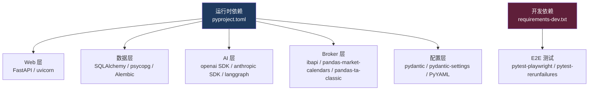
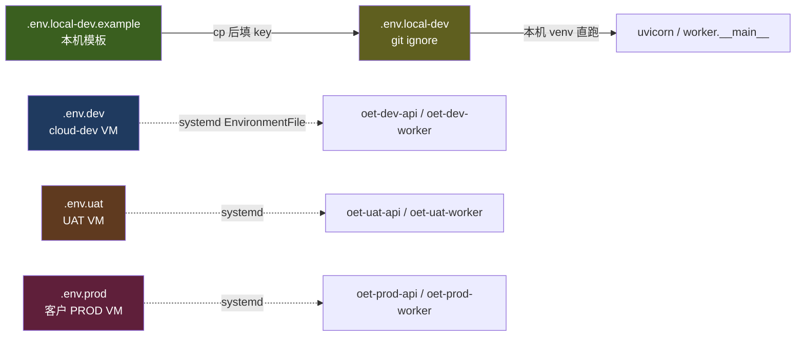
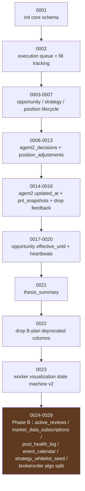

<!-- PAGE_ID: options_08_dependencies -->
<details>
<summary>📚 Relevant source files</summary>

The following files were used as context for generating this wiki page (commit `6b3d159`):

- [pyproject.toml](https://github.com/ChunmiaoYu/options_ai_trader/blob/6b3d159/pyproject.toml)
- [requirements-dev.txt](https://github.com/ChunmiaoYu/options_ai_trader/blob/6b3d159/requirements-dev.txt)
- [src/options_event_trader/settings.py](https://github.com/ChunmiaoYu/options_ai_trader/blob/6b3d159/src/options_event_trader/settings.py)
- [.env.dev](https://github.com/ChunmiaoYu/options_ai_trader/blob/6b3d159/.env.dev) / [.env.uat](https://github.com/ChunmiaoYu/options_ai_trader/blob/6b3d159/.env.uat) / [.env.prod](https://github.com/ChunmiaoYu/options_ai_trader/blob/6b3d159/.env.prod) / [.env.local-dev.example](https://github.com/ChunmiaoYu/options_ai_trader/blob/6b3d159/.env.local-dev.example)
- [config/symbol_routes.yml](https://github.com/ChunmiaoYu/options_ai_trader/blob/6b3d159/config/symbol_routes.yml)
- [config/execution.yml](https://github.com/ChunmiaoYu/options_ai_trader/blob/6b3d159/config/execution.yml)
- [config/risk_limits.yml](https://github.com/ChunmiaoYu/options_ai_trader/blob/6b3d159/config/risk_limits.yml)
- [config/symbol_liquidity.yml](https://github.com/ChunmiaoYu/options_ai_trader/blob/6b3d159/config/symbol_liquidity.yml)
- [src/options_event_trader/services/exchange_routing.py](https://github.com/ChunmiaoYu/options_ai_trader/blob/6b3d159/src/options_event_trader/services/exchange_routing.py)
- [alembic/versions/](https://github.com/ChunmiaoYu/options_ai_trader/blob/6b3d159/alembic/versions/) (29 个迁移)
- [.github/workflows/](https://github.com/ChunmiaoYu/options_ai_trader/blob/6b3d159/.github/workflows/) (deploy-dev / deploy-uat / deploy-prod / check-spec-consistency)
- [docs/INSTALL_LOCAL_WINDOWS.md](https://github.com/ChunmiaoYu/options_ai_trader/blob/6b3d159/docs/INSTALL_LOCAL_WINDOWS.md)

</details>

# 依赖项与配置

> **Related Pages**: [[系统架构|02_architecture.md]], [[API 接口与前端|07_api_frontend.md]], [[数据库与持久化|06_database.md]]

---

## 概览

本项目是 Python 3.11+ 单仓库结构，使用 `pyproject.toml` 声明运行时依赖，`requirements-dev.txt` 声明仅本地/CI 用的开发依赖。所有运行配置统一通过 **pydantic-settings** 从 `.env.{env}` 文件 + 环境变量加载，三环境（cloud-dev / UAT / PROD）共用同一份代码、同一份 schema、不同的 `.env`。

依赖从用途上可以分为四层：



**关键变更（相对早期 wiki 版本）**：
- LLM 入场默认 **DeepSeek V4-Flash**，不再以 OpenAI gpt-5 为唯一选项（成本驱动，2026-04-30 起）
- Agent 2 持续 review 仍用 **Claude Haiku 4.5**（Anthropic SDK 直连，未来 A/B 对比保留）
- 数据库已演进到 **29 个 Alembic 迁移**（`0001` → `0029`），不再是历史 wiki 写的"4 次"
- 业务实体仍是 6 层（Opportunity / Trigger Rule / Strategy Run / Execution Run / Fact Layer / Task Queue），底层基础设施转向 **APScheduler + 8 event_type + 4 Pool/Client**（北极星 §1）
- Phase B 的 **APScheduler / pandas-market-calendars** 一部分已落 `pyproject.toml`，handler 真实施时会再补 spec 锁定的剩余依赖
- **2026-05-15 round 4 D5/D6/D4 新增依赖方向**：BundleV2 dim 11 长线指标自算（pandas_ta + scipy.stats）/ BundleV2 dim 12 事件影响走新 Agent 3 worker（复用 Anthropic SDK + web search tool）/ chaos test 套件（toxiproxy + docker tool 留 D4 spec ship 时定）。详见 §11 + §13

---

<!-- BEGIN:AUTOGEN options_08_dependencies_python -->
## Python 依赖清单

项目要求 Python ≥ 3.11，使用 setuptools (`build-system requires = ["setuptools>=68", "wheel"]`) 构建。源码采用 `src/` 布局（`tool.setuptools.package-dir = {"" = "src"}`），打包时同时包含 `config/*.yml` 和 `prompts/*.md` 资源（`tool.setuptools.package-data`）。

### 核心运行时依赖（`[project] dependencies`）

| 包名 | 版本约束 | 用途 |
|------|----------|------|
| `fastapi` | `>= 0.115.0` | Web API 框架，对外暴露 `/opportunities`、`/health`、`/intake`、`/orders` 等 REST 端点 |
| `uvicorn[standard]` | `>= 0.30.0` | ASGI 服务器，本地 dev 单进程跑 / 云端 systemd 拉起 |
| `sqlalchemy` | `>= 2.0.30` | ORM 框架，2.x async/sync 双 API；当前业务表 24+ 张 |
| `psycopg[binary]` | `>= 3.2.0` | PostgreSQL 驱动（psycopg3）；二进制版本免编译 |
| `alembic` | `>= 1.13.2` | 数据库迁移工具，当前迁移链 `0001` → `0029`（详见 §8） |
| `pydantic` | `>= 2.7.0` | Pydantic v2 数据验证 + 序列化，定义所有 API schema 与 Agent JSON schema |
| `pydantic-settings` | `>= 2.3.0` | 从 `.env` 文件 + 环境变量加载配置（替代历史 `pydantic.BaseSettings`） |
| `openai` | `>= 1.40.0` | OpenAI SDK；当前作为 **DeepSeek 的 OpenAI-compat 客户端** 复用（Agent 1 + Agent 2 entry） |
| `anthropic` | `>= 0.34.0` | Anthropic SDK；Agent 2 持续 review（`claude-haiku-4-5-20251001`）。同时支持以 `base_url=https://api.deepseek.com/anthropic` 切到 DeepSeek 不改代码（详见 §3） |
| `python-dotenv` | `>= 1.0.1` | `.env` 文件加载（pydantic-settings 内部使用） |
| `httpx` | `>= 0.27.0` | 异步 HTTP 客户端；OpenAI/Anthropic SDK 底层依赖 |
| `orjson` | `>= 3.10.0` | 高性能 JSON 序列化（FastAPI 响应、trace 落盘） |
| `tenacity` | `>= 8.4.0` | 重试机制（LLM 调用、IBKR 网络重连等） |
| `langgraph` | `>= 0.4.0` | LangChain 图工作流；**仅 Agent 1** 6 节点 StateGraph，不扩展（见 memory `project_langgraph_decision`） |
| `langchain-core` | `>= 0.3.0` | LangChain 核心抽象层（`BaseMessage` / `Runnable` 等） |
| `PyYAML` | `>= 6.0.2` | YAML 配置解析（`config/*.yml`：execution / risk_limits / symbol_routes / symbol_liquidity） |
| `pandas-ta-classic` | `>= 0.4.47` | 技术指标库；`pandas-ta` upstream 0.4.x 仅支持 Py 3.12+，VM 是 Py 3.11 ARM64 → 用兼容 fork（API 一致：`import pandas_ta_classic as ta`）。**2026-05-15 round 4 D5 复用**：BundleV2 dim 11 长线指标 21 项（RSI / MACD / ATR / Bollinger 等）一行调用 |
| `pandas-market-calendars` | `>= 4.4.0` | 美股交易日历，APScheduler 调度器在 `xnys` / `xnas` calendar 上对齐入场窗口 |
| `scipy` | `>= 1.13.0` | **2026-05-15 round 4 D5 新增**：BundleV2 dim 11 用 `scipy.stats.linregress` 算 β / outperform 回归（symbol 对 SPY 60/120/250 trading days），~10-50 ms |

### 测试依赖（`[project.optional-dependencies] test`）

| 包名 | 版本约束 | 用途 |
|------|----------|------|
| `pytest` | `>= 8.2.0` | 测试框架；`asyncio_mode = "auto"` |
| `pytest-asyncio` | `>= 0.23.0` | 异步测试支持（worker / agent2_orchestrator） |
| `pytest-timeout` | `>= 2.3.0` | 单测硬超时，防 LLM 调用挂死 |
| `hypothesis` | `>= 6.100.0` | 属性测试，用于 Risk Gate / Spread sanity 验证 |

### 开发依赖（`requirements-dev.txt`，仅本地/CI 不上 VM）

| 包名 | 版本约束 | 用途 |
|------|----------|------|
| `pytest-playwright` | `>= 0.7.0` | E2E 浏览器测试；`pip install -r requirements-dev.txt && playwright install chromium` |
| `pytest-rerunfailures` | `>= 16.0` | E2E flakiness 兜底（C2 五专家评审）；**仅 `e2e` mark 测试 retry**，单元测不 retry。用法：`pytest tests/e2e/ -v --reruns 2 --reruns-delay 1` |

### 未在 `pyproject.toml` 中声明的运行时依赖

- **ibapi**（IBKR TWS API）：通过 IBKR 官方安装包 `IBJts/source/pythonclient` 手动安装，**不在 PyPI 分发**。云端 VM Docker `oet-dev-ibgw` 容器自带（`ghcr.io/gnzsnz/ib-gateway:stable`），本机开发需另装 IB Gateway 后从其 `IBJts` 目录拷贝
- **Docker**（仅本地 dev）：跑 PostgreSQL 容器，云端 PROD 用宿主机原生 PostgreSQL

### pyright + pytest 配置一致性

为避免 IDE 与测试 runner 看不到同一份 import 路径，`pyproject.toml` 同时声明：

- `[tool.pyright].extraPaths = ["src", "."]`
- `[tool.pytest.ini_options].pythonpath = ["src", "."]`

测试目录 `testpaths = ["tests"]`，markers 为 `e2e` / `flaky` / `asx_smoke`（详见 [[测试与 CI|09_testing_ci.md]] 如存在）。

Sources: `pyproject.toml`, `requirements-dev.txt`
<!-- END:AUTOGEN options_08_dependencies_python -->

---

<!-- BEGIN:AUTOGEN options_08_dependencies_settings_layer -->
## 设置加载层级（Settings）

`src/options_event_trader/settings.py` 的 `Settings` 类继承 `pydantic_settings.BaseSettings`，是整个项目唯一的配置入口。

### 加载机制

```python
class Settings(BaseSettings):
    model_config = SettingsConfigDict(
        env_file=".env",
        env_file_encoding="utf-8",
        extra="ignore",   # 未知字段安静忽略，向后兼容
    )
```

- 加载顺序：**环境变量 > `.env` 文件 > 字段默认值**（pydantic-settings 标准行为）
- 多环境切换：API/Worker 启动时用 `--env-file .env.{env}` 显式指定（systemd 单元文件中 `EnvironmentFile=/opt/oet/{env}/.env.{env}`）
- 单例化：`@lru_cache(maxsize=1)` 装饰的 `get_settings()` 是全局唯一访问点；测试中 monkeypatch 后需 `get_settings.cache_clear()`

### 字段分组

#### 应用基础

| 字段 | 类型 | 默认 | 说明 |
|------|------|------|------|
| `app_name` | `str` | `options-event-trader` | 应用名（log / 心跳） |
| `app_env` | `Literal["local-dev","dev","uat","prod"]` | `dev` | 运行环境标识 |
| `api_host` | `str` | `0.0.0.0` | FastAPI 监听地址 |
| `api_port` | `int` | `8080` | FastAPI 监听端口（具体值见 `.env.{env}`） |
| `log_level` | `str` | `INFO` | logging level |

派生属性：

- `is_local_dev` → `app_env == "local-dev"`
- `is_cloud_dev` → `app_env == "dev"`（CI workflow 历史命名 `dev`，语义等同 cloud-dev）

#### 数据库

| 字段 | 默认 | 说明 |
|------|------|------|
| `postgres_host` | `localhost` | PostgreSQL 主机（具体值见 `.env.{env}`） |
| `postgres_port` | `5432` | 端口 |
| `postgres_db` | `options_event_trader` | 数据库名 |
| `postgres_user` | `postgres` | 用户名 |
| `postgres_password` | `postgres` | 密码（PROD 注入服务端 `.env.prod`，不入 git） |
| `database_url` | `None` | 完整连接串（提供则覆盖上述五项） |

派生 `resolved_database_url`：当 `database_url` 为空时拼成 `postgresql+psycopg://{user}:{password}@{host}:{port}/{db}`。

#### LLM — OpenAI 兼容（含 DeepSeek 复用）

| 字段 | 默认 | 说明 |
|------|------|------|
| `openai_api_key` | `None` | 原 OpenAI key；2026-04-30 起逐步退役（Agent 1/2 切 DeepSeek） |
| `openai_model` | `gpt-5` | 历史值，仅作为兜底 reference；**实际运行时由 `llm_provider` 决定** |

派生 `openai_enabled` → `bool(openai_api_key.strip())`。

#### LLM — DeepSeek（2026-04-30 起主力）

| 字段 | 默认 | 说明 |
|------|------|------|
| `deepseek_api_key` | `None` | DeepSeek API key（注入到 VM `/opt/oet/.env.{env}`，不入 repo） |
| `deepseek_base_url` | `https://api.deepseek.com` | OpenAI-compat 端点（Anthropic-compat 是 `+/anthropic`） |
| `deepseek_model` | `deepseek-v4-flash` | 2026-04-24 V4 发布；flash = 非思考、快价廉；pro = $1.74/$3.48；`deepseek-chat` 别名 2026-07-24 弃 |
| `llm_provider` | `openai` | `"openai"` 或 `"deepseek"`，gates Agent 1/2 wrapper 选哪个 client（`.env.{env}` 中已设为 `deepseek`） |

#### LLM — Anthropic（Agent 2 持续 review）

| 字段 | 默认 | 说明 |
|------|------|------|
| `anthropic_api_key` | `None` | Anthropic key（注入到 VM `/opt/oet/.env.{env}`） |
| `anthropic_model_entry` | `claude-sonnet-4-6` | Agent 2 工作点 A：首次入场决策（**北极星已切 DeepSeek，本字段保留兜底**） |
| `anthropic_model_review` | `claude-haiku-4-5-20251001` | Agent 2 工作点 B：入场后持续决策（固定 Haiku 不升 Sonnet 省成本） |

派生 `anthropic_enabled` → `bool(anthropic_api_key.strip())`。

#### IBKR

| 字段 | 默认 | 说明 |
|------|------|------|
| `ibkr_host` | `127.0.0.1` | IB Gateway 主机；云端 VM 上是 host networking 下的 localhost |
| `ibkr_port` | `7497` | TWS 默认；本项目实际用 IB Gateway，具体见 `.env.{env}` |
| `ibkr_client_id` | `27` | API client id（每环境必须不同，避免 IBKR `Already connected` 互踢） |
| `ibkr_client_id_l3_runner` | `29` | L3 live replay 独立 client id（A1.14 scenarios） |
| `ibkr_account_mode` | `paper` | `paper` / `live`；账户号 paper "DU" 起头、live "U" 起头 |
| `ibkr_request_timeout_sec` | `15` | reqContractDetails / reqMktData 等单次请求超时 |
| `ibkr_connect_timeout_sec` | `10` | 建连超时 |
| `ibkr_market_data_type` | `3` | `1`=real-time / `2`=frozen / `3`=delayed / `4`=delayed-frozen |
| `ibkr_dry_run` | `False` | 不发真实订单，only log（**安全开关**，DEV 默认 `false`，**初次盘中前用户可手动翻 `true`**） |
| `ibkr_mock` | `False` | 不连 IBKR，pure mock（CI / 单测用） |
| `entry_order_wait_sec` | `60` | 单腿 LMT 入场等 fill 超时；UAT/PROD 改 `90` 给云端→VM 多一跳延迟 |
| `entry_cancel_wait_sec` | `2` | `cancelOrder` 后等 IBKR 处理 + 吸收竞态 |

#### Worker / Phase 11+ feature flags

| 字段 | 默认 | 说明 |
|------|------|------|
| `worker_poll_seconds` | `15` | Worker 主循环周期 |
| `monitor_poll_seconds` | `10` | Position monitor 周期 |
| `prompt_version` | `v1` | Prompt 模板版本号（trace 用） |
| `enable_agent2_autonomous` | `True` | 开启 Agent 2 新范式（orchestrator + 持续决策）；紧急停机走此开关 |
| `enable_agent2_dispatch` | `False` | Agent 2 dispatcher 真下单（A1.11 硬门，PROD 必须显式打开） |
| `enable_agent2_thesis` | `True` | thesis chain feature kill-switch（spec 2026-05-02） |
| `agent2_stop_check_interval_sec` | `60` | Adjustments overshoot 窗口 ≤ 60s |
| `trace_dir` | `./traces` | trace_archiver 落盘根目录；UAT/PROD 改 `/opt/oet/{env}/traces` |
| `trace_retention_days` | `30` | trace 文件保留天数（cleanup systemd.timer 用） |
| `dry_run_orders` | `False` | 执行层 log only，不发 IBKR 订单（区别于 `ibkr_dry_run`，更细粒度） |
| `enable_mid_based_pricing` | `False` | EI-1：mid-based 4 档（`False` = 老 bid+$0.02 buffer） |
| `worker_dead_banner_enabled` | `False` | P0-B Task 11：全局 banner；DEV=false 不打扰，UAT/PROD=true |
| `time_fast_forward_factor` | `1.0` | 时间快进倍率：`1.0`=生产实时，`>1.0`=dev/uat 加速测试 lifecycle（`services.now_provider.now_utc()` 消费） |
| `opportunity_max_lifetime_days` | `30` | 无 monitor_window 时机会单最长存活 |
| `outage_threshold_pct` | `50` | heartbeat gap 占 monitor_window 百分比 > 阈值 → MISSED_OUTAGE |

> **删除字段**：`settings.test_market_override` 已于 2026-05-02 commit `6b8190f` 移除，路由改走 `config/symbol_routes.yml`（详见 §5）。

Sources: `src/options_event_trader/settings.py`
<!-- END:AUTOGEN options_08_dependencies_settings_layer -->

---

<!-- BEGIN:AUTOGEN options_08_dependencies_deepseek_dual -->
## DeepSeek 双兼容端点（OpenAI + Anthropic 复用 SDK）

> 来源：memory `reference_deepseek_compat_endpoints.md`（2026-04-30 用户对照官方文档确认）

DeepSeek 同时提供 OpenAI-compat 与 Anthropic-compat 两套端点，对接代码层面**只改 3 项就能在三家厂商之间互切**：

| 兼容目标 | base_url | SDK | 切换工作量 |
|---|---|---|---|
| OpenAI | `https://api.deepseek.com` | `from openai import OpenAI` | 改 3 项：`base_url + api_key + model` |
| **Anthropic** | `https://api.deepseek.com/anthropic` | `from anthropic import Anthropic` | 改 3 项：`base_url + api_key + model` |

含义：原本以为 Claude → DeepSeek 切换需要重写 client（不同 SDK），实际不需要——Anthropic SDK 直接复用，把 `base_url` 改 `/anthropic` 就行。

### 官方模型 ID（2026-04-24 V4 发布起）

| 模型 ID | 价格（input / output per 1M tokens） | 用途 |
|---|---|---|
| `deepseek-v4-flash` | $0.14 / $0.28 | **当前默认**，轻量、快、便宜 |
| `deepseek-v4-pro` | $1.74 / $3.48 | 高能力，复杂指令降级路由 |
| `deepseek-chat` / `deepseek-reasoner` | — | **2026-07-24 弃用**，当前指向 V4-Flash 非思考/思考模式 |

### 关键迁移注意点（从 Claude / OpenAI 切 DeepSeek）

1. **Thinking 模式参数**：`{"thinking": {"type": "enabled"}, "reasoning_effort": "high"}`（与 Anthropic native `extended thinking` 对齐）
2. **缓存字段**：`response.usage.prompt_cache_hit_tokens`（命中按 1/10 计价） + `prompt_cache_miss_tokens`
3. **Prompt 可能需调**：DeepSeek 中文/代码强，但复杂指令遵循略弱于 Claude/GPT-5。解法：加明确格式要求 + 用例说明；退化场景路由到 V4-Pro
4. **Tool calling 嵌套/并发场景稳定性略差**，重度依赖需回归测试
5. **错误码大体兼容**但生产前做异常路径回归

### 项目当前状态（commit `6b3d159`）

| Agent 工作点 | 当前 LLM | 端点 |
|---|---|---|
| Agent 1 intake | DeepSeek V4-Flash | OpenAI-compat |
| Agent 2 entry（首次入场决策） | DeepSeek V4-Flash | OpenAI-compat（worker log 实证：`agents/strategy_agent.py | Agent2: calling DeepSeek model=deepseek-v4-flash`） |
| Agent 2 review（持续决策） | **Claude Haiku 4.5**（保留） | Anthropic native |

> 注：北极星 §6 决策"OpenAI gpt-5 → DeepSeek 切换"涵盖 Agent 1 + Agent 2 entry。Review 仍保 Claude 是用户决策（成本可接受 + 未来 A/B 对比基线）。CLAUDE.md invariant 20 已同步。

Sources: memory `reference_deepseek_compat_endpoints.md`, `src/options_event_trader/settings.py`, CLAUDE.md §5 invariant 20
<!-- END:AUTOGEN options_08_dependencies_deepseek_dual -->

---

<!-- BEGIN:AUTOGEN options_08_dependencies_three_envs -->
## 三环境 .env 文件

项目维护 4 份 `.env` 文件（外加 1 份 `.example`），都在 repo 根目录。**真实 secret（API key / DB 密码）只入服务端**，repo 中是空值占位。



### 各环境差异（结构性，非 secret）

| 环节 | `.env.local-dev` | `.env.dev`（cloud-dev） | `.env.uat` | `.env.prod` |
|---|---|---|---|---|
| `APP_ENV` | `local-dev` | `dev` | `uat` | `prod` |
| `LOG_LEVEL` | `DEBUG` | `INFO` | `INFO` | `INFO` |
| `POSTGRES_DB` | `ai_trader_local_dev` | `ai_trader_dev` | `ai_trader_uat` | `ai_trader_prod` |
| `LLM_PROVIDER` | `openai`（默认） | `deepseek` | `deepseek` | `deepseek` |
| `IBKR_ACCOUNT_MODE` | `paper` | `paper` | `paper`（待 oatworker live ship） | `paper` → `live`（客户上线时切） |
| `IBKR_CLIENT_ID` | `38` | `27` | `28` | `37` |
| `IBKR_CLIENT_ID_L3_RUNNER` | — | `29` | `39` | `49` |
| `ENTRY_ORDER_WAIT_SEC` | `60` | `60` | `90`（VM→Gateway 多一跳） | `90` |
| `ENTRY_CANCEL_WAIT_SEC` | `2` | `2` | `3` | `3` |
| `TRACE_DIR` | `./traces` | `./traces` | `/opt/oet/uat/traces` | `/opt/oet/prod/traces` |
| `TRACE_RETENTION_DAYS` | `30` | `7` | `30` | `30` |
| `WORKER_DEAD_BANNER_ENABLED` | — | `false` | `true` | `true` |
| `ENABLE_AGENT2_DISPATCH` | — | `true` | `true` | **`false`**（PROD 显式 gate，确认前不下真单） |
| `ENABLE_AGENT2_THESIS` | — | `true` | `true` | `true` |

### `.env` 字段是真相，CLAUDE.md / memory 不写数字

CLAUDE.md §13 信息分层硬规：
- **数字 / 配置 / 阈值 / 端口 / 账号**类事实，唯一真相在 `.env.{env}` / `config/*.yml` / 代码
- memory 与 CLAUDE.md 仅写指针（"见 `.env.{env}` 的 X"），不写具体值
- 例外：当某数字在整个项目里**没有 config 来源**（如 IBKR 周日维护窗口时间），且只在**一个** memory 留档

### secret 的注入路径

| 类别 | 来源 | 落点 |
|---|---|---|
| 本机 dev 用 LLM key | 用户手填 | `.env.local-dev`（gitignore） |
| 云端 LLM key | GitHub Secret `DEEPSEEK_API_KEY` 等 | `/opt/oet/{env}/.env.{env}`（部署脚本注入） |
| PostgreSQL 密码 | GitHub Secret 或 VM 上手填 | `/opt/oet/{env}/.env.{env}` |
| Anthropic key | GitHub Secret `ANTHROPIC_API_KEY` | 同上 |
| IBKR 凭证（TWS_USERID/PASSWORD） | 1Password | `/opt/oet/{env}/ibgw/env`（容器 env_file，`chmod 600`） |
| Oracle SSH key | 用户本机 `~/.ssh/oracle-options-trader.key` | 不上 VM、不进 GitHub |

> 详见 memory `project_oracle_cloud.md`。

Sources: `.env.dev` / `.env.uat` / `.env.prod` / `.env.local-dev.example`, CLAUDE.md §13
<!-- END:AUTOGEN options_08_dependencies_three_envs -->

---

<!-- BEGIN:AUTOGEN options_08_dependencies_exchange_routing -->
## Exchange routing 模块（invariant 23）

**Spec 锁定**（2026-05-01 五专家通过 + invariant 23）：所有 IBKR contract 路由统一从 `services/exchange_routing.py` + `config/symbol_routes.yml` 双层数据驱动得出，**业务代码不允许任何 `if symbol in {...}` 这种分支**。

### 模块结构

```
src/options_event_trader/services/exchange_routing.py
  ├── EXCHANGE_ROUTING_MAP: dict[str, dict[str, str]]
  │     # 6 行：NASDAQ / NYSE / ARCA / BATS / SEHK / ASX
  │     # 4 字段：exchange / currency / primary_exchange / option_exchange
  └── market_route_kwargs_for_symbol(symbol, sec_type="STK"|"OPT", override_primary_exchange=None)
        # 唯一公共 API
config/symbol_routes.yml
  ├── BHP    → primary_exchange: ASX,   trading_class: BHP
  ├── "700"  → primary_exchange: SEHK,  trading_class: TCH
  └── "9988" → primary_exchange: SEHK,  trading_class: ALI
```

### 不可变约束（invariant 23）

1. `EXCHANGE_ROUTING_MAP` **字段恒为 4 个**（exchange / currency / primary_exchange / option_exchange），不可加 multiplier / lot / trading_class
2. 函数体禁用 `if symbol in {...}` 这种逻辑分支（AST 检测在 `tests/test_routing_spec_invariants.py`）
3. 加新交易所 = `EXCHANGE_ROUTING_MAP` 加一行 + 可能 yaml 加 symbol；**不改业务代码**
4. 改测试 in-scope 项（4 个 ASX smoke functions）= 改 `tests/spec_invariants.yml` + 必须 commit msg 含 `[spec-amend: 五专家通过 + 用户审批]` tag（pre-commit hook `check_spec_invariants_change.py` 强制）
5. 修改 `services/exchange_routing.py` / yaml schema / spec invariants 必须先 amend `docs/superpowers/specs/2026-05-01-flexible-exchange-routing-design.md` + 五专家评审 + 用户审批

### Fallback 行为

- **未注册 symbol = SMART/USD**（美股 fallback）—— 这是 spec **契约**，不是 bug
- 测试期可设 `ROUTE_STRICT_UNKNOWN=1` 让函数 raise 而不 fallback
- **Discovery Agent ship 前必须改为显式 raise**（北极星 §4 #6）—— 见 spec §3.2 v2 path 伪代码

### HK 期权特例

- HK 股票 `exchange = SEHK`，但 **HK 期权 `exchange = HKFE`**（IB-TWS 实测必需）
- yaml `trading_class` 字段是 OPT disambiguator only（如 700→TCH 防 BHP.E 类型半奇数 strike）

### 实施 commit 链（2026-05-02）

| Task | Commit | 内容 |
|---|---|---|
| 1 | `c85bb19` | exchange_routing 模块 + yaml + drift detector + tests |
| 2 | `7238b96` | market_data_collector + native_client:358 historical 迁 |
| 3 | `6b8190f` | order_placer 5 OPT 处迁 + probe sanity 3/3 PASS |
| 4 | `6050301` | exit_order_placer single + BAG combo 迁 |
| 5 | `a3f8889` | native_client get_underlying_quote + get_bars 迁 |
| 6a | `00635a8` | scripts/_smoke_hk_*.py + migration regression test |
| 6b | `dc7ad14` | **删 `services/market_route.py` + settings 字段 + invariant 23 锁定** |

Sources: memory `project_exchange_routing.md`, CLAUDE.md §5 invariant 23, `services/exchange_routing.py`, `config/symbol_routes.yml`, `docs/superpowers/specs/2026-05-01-flexible-exchange-routing-design.md`
<!-- END:AUTOGEN options_08_dependencies_exchange_routing -->

---

<!-- BEGIN:AUTOGEN options_08_dependencies_ibkr_gateway -->
## IBKR Gateway 配置

> 来源：memory `project_ibkr_ops.md`，CLAUDE.md §4

### 决策：统一用 IB Gateway，不用 TWS

| 项 | IB Gateway | TWS |
|---|---|---|
| 内存 | ~200MB | 1-2GB |
| GUI | 最小 | 完整桌面端 |
| 服务定位 | 专为 API 设计 | 人工交易主用 |
| 适合云端无人值守 | ✓ | ✗（弹窗会打断） |
| 端口段（仅供调试识别） | `40xx` | `74xx` / `75xx` |

理由：
1. **同账户互斥** —— IBKR 规则同账户同时只允许一个 API client。本地 TWS + 云端 IB Gateway 会互踢
2. **云端资源** —— Oracle VM 2 OCPU / 12GB ARM，TWS GUI 弹窗会打断无人值守
3. **API 协议一致** —— 同一个 ibapi，代码零改动

### IB Gateway 必勾选项

- ✓ 启用 ActiveX 和套接字客户端
- ✗ 只读 API（**必须关掉**，不然下不了单）
- ✓ 跳过委托单预防设置（避免 TWS-style 弹窗）

### 下单关键参数（代码层）

每个订单对象都需设置：

```python
order.eTradeOnly = False
order.firmQuoteOnly = False
```

不设这两项部分组合策略会被 IBKR 拒。

### 4-deployment user 架构（2026-05-07 用户最终澄清）

真实账户 `U24396793`（一个）+ 客户账户（待）跨 4 个部署位置，每位置一个 IB Gateway，**每位置 user 不同**（IBKR 同 user 单 session 限制）：

| 部署位置 | IB Gateway User（脱敏前缀） | 模式 | 用途 / 阶段 |
|---|---|---|---|
| 本机 laptop | `vmq****` | paper | 本地开发 / Tier 1 paper smoke |
| 云端 VM DEV | 长期 `vmq****` paper / 临时 `wa****` live | paper / live | 测连接稳定性 / daily 2FA 验证 |
| 云端 VM UAT | `oat****`（review 通过后部署） | live | UAT 阶段，客户上线前最后一站 |
| 云端 VM PROD | 客户的账户 | live | 生产真客户钱 |

> **脱敏规则**：docs-hub 公开 repo 写脱敏前缀（`wa****` / `oat****` / `vmq****`）；项目 repo（memory / findings.md / discussions / 任意 .py / .md）写全名（项目 repo 是 private 别人看不到）。

### OPRA 订阅 per-username 计费

IBKR market data 是 **per-username** 计费，不是 per-account。即使 `wa****` + `oat****` 同属 `U24396793`，也各订各付。

- `vmq****`（paper）：共享 `wa****` 订阅（Portal Market Data Sharing 设置，不单独付）
- `wa****`（云端 VM DEV live 当前）：OPRA 已订
- `oat****`（准备 VM UAT live）：OPRA 已订，Non-Pro under review
- 客户账户（PROD）：客户自己订阅自己付费

### 周日强制重启窗口

**硬规则**：IBKR 每周日晚间执行服务端维护，强制重启所有客户端连接。窗口：**ET 周六 23:00 → 周日 03:00**（≈ NZ 周日下午 16:00-21:00，DST 取决）。

应对（2026-05-02 用户简化策略）：

1. **Worker 侧**：`_ensure_connected()` 已有重连逻辑，最多 3 次重试；`resubscribe_all` 在重启后恢复 PnL 订阅
2. **IB Gateway 侧**：云端 VM 容器 `--restart=unless-stopped` + IBC `AUTO_RESTART_TIME=11:59 PM` 自动重启
3. **2FA 时机天然对齐**：ET 周六 23:00-周日 03:00 = NZ 周日下午 → 用户清醒，IBKR Mobile push 直接点确认
4. **不上复杂告警**（用户决策）：每周一次，自然介入即可

### NZ live 账户 2FA 兜底

NZ 使用 IBKR live 账户时 2FA 频繁弹框（paper 不触发）。应对：

- **UAT live 切换前必做**：申请 secondary username 专用于 API（`oat****` 角色）
- 主账户走人工登录（`wa****`），secondary 走 API
- 兜底：IBKR Mobile 推送 2FA 或 IBKR Key / Secure Device

### 周维护 + 部署窗口（CLAUDE.md §4 checklist）

切换 paper/live、重启 Worker、重启 Gateway 前必走：
1. 撤销所有当日挂单（`scripts/_cancel_all_open_orders.py` 或 `reqGlobalCancel`）
2. 确认没有 pending `WorkflowTask`（否则重启后会重复下单）
3. 确认 `.env` 的 `IBKR_PORT` 和 `IBKR_ACCOUNT_MODE` 匹配目标环境
4. `IBKR_CLIENT_ID` 不与其他运行中的 client 冲突（API/Worker/独立脚本各不同）
5. 同账户不能同时开 TWS + IB Gateway（互踢）

Sources: memory `project_ibkr_ops.md`, CLAUDE.md §4
<!-- END:AUTOGEN options_08_dependencies_ibkr_gateway -->

---

<!-- BEGIN:AUTOGEN options_08_dependencies_oracle_cloud -->
## Oracle Cloud 三环境部署

> 来源：memory `project_oracle_cloud.md`

### VM 形态

| 项 | 值 |
|---|---|
| Cloud | Oracle Cloud Infrastructure（OCI） |
| Region | Australia Southeast (Melbourne)，`ap-melbourne-1` |
| Shape | `VM.Standard.A1.Flex`，2 OCPU / 12GB，**ARM64** |
| OS | Ubuntu 22.04 Minimal aarch64 |
| 账户类型 | Pay As You Go（2026-04-14 从 Free Trial 升级） |
| User | `ubuntu`（VM 上**没有** `deploy` 用户；项目目录 + systemd 全部以 `ubuntu` 运行） |
| IP / SSH key 路径 | 见 GitHub Secret `ORACLE_VM_IP` / 用户本机 `~/.ssh/oracle-options-trader.key`（CLAUDE.md §13 零数字原则） |

### 三环境同 VM 共存

```
/opt/oet/
├── shared/
│   └── deploy.sh              # 全环境共用部署脚本
├── dev/
│   ├── venv/                  # 各自独立 venv（不是 .venv）
│   ├── .env.dev
│   ├── traces/
│   ├── log/{api,worker,gateway}.log
│   └── ibgw/env               # IB Gateway 容器凭证
├── uat/
│   └── ...同结构
└── prod/
    └── ...同结构
```

- API 端口、DB 名、IBKR 端口与账户模式一律以 `.env.{env}` 为唯一真相（CLAUDE.md §13）
- venv 路径以 `sudo systemctl cat oet-{env}-{svc}` 的 `ExecStart` 为真相
- DEV 常开、UAT/PROD 按需启停（PAYG 成本约束）

### IB Gateway 容器化（VM DEV，2026-04-24 ship）

```bash
sudo docker run -d \
  --name oet-dev-ibgw \
  --restart=unless-stopped \
  --network=host \
  --env-file /opt/oet/dev/ibgw/env \
  ghcr.io/gnzsnz/ib-gateway:stable
```

- ARM64 multi-arch image，内置 IBC（auto-login）+ socat port bridge
- **必须 `--network=host`**：bridge 模式下 docker-proxy 把 source IP 改成 `172.17.0.1`，IBGW `jts.ini TrustedIPs=127.0.0.1` 拒绝
- 凭证文件 `/opt/oet/dev/ibgw/env`（`chmod 600` `root:root`）含 `TWS_USERID / TWS_PASSWORD / TRADING_MODE=paper / AUTO_RESTART_TIME=11:59 PM`

### Worker 配套

- 入口：`src/options_event_trader/worker/__main__.py`（systemd `ExecStart=python -m options_event_trader.worker`）
- `.env.dev` 中 `IBKR_MOCK=false` + `IBKR_DRY_RUN=true` —— **安全开关**：盘中前用户需手动翻 `IBKR_DRY_RUN=false` 才真正下 paper 订单

### 部署流程（`/opt/oet/shared/deploy.sh`）

```
git pull (origin/{dev,uat,main})
  → systemctl stop oet-{env}-api oet-{env}-worker
  → /opt/oet/{env}/venv/bin/pip install -e .
  → alembic upgrade head（连 .env.{env} 的 DATABASE_URL）
  → systemctl start oet-{env}-api oet-{env}-worker
  → curl http://localhost:$API_PORT/health 验证
```

- DEV 自动重启
- UAT/PROD **只部署不启动**（PAYG 节流），用户手动 `systemctl start`

### 启动后验证 checklist（任何环境 start 后必走）

1. **API 健康**：`curl http://localhost:$API_PORT/health` 返回 `{"db":"ok",...}`
2. **IB Gateway 连接**：health 响应里 `ibkr_port` 等于 `.env.{env}` 的 `IBKR_PORT`
3. **账户模式正确**：`IBKR_ACCOUNT_MODE=paper` 时账户号以 "DU" 开头，`=live` 时以 "U" 开头（用 `scripts/_check_ibkr_state.py` 确认）
4. **数据库连接**：同 #1 health 检查里 `"db":"ok"`
5. **Worker 已订阅**：日志看到 `Startup: subscribed N open positions`

> **任一项失败立即停止，不进一步操作**。

### 网络

- VCN: `vcn-main` (10.0.0.0/16)
- Subnet: `subnet-public` (10.0.0.0/24)
- IGW: `igw-main` / Route: `0.0.0.0/0 → igw-main`
- Security List 开放：SSH(22) + API 三环境端口（具体见 `.env.{env}`）
- VM iptables 与 Security List 保持同步；改 `.env.{env}` 的 `API_PORT` 后必须**两处都改**

### PAYG 账单约束

Oracle Cloud 账户已升级 PAYG，"反正免费"思维必须改：

- 临时 VM 用完**立即 Terminate**（Stop 也扣 Boot volume 费）
- "加 UAT VM"前必先报预计月费
- 默认**先在项目内找能复用的资源**，不新建
- UAT/PROD "按需启停"原则源此约束（一台 VM 跑三环境）

Sources: memory `project_oracle_cloud.md`
<!-- END:AUTOGEN options_08_dependencies_oracle_cloud -->

---

<!-- BEGIN:AUTOGEN options_08_dependencies_alembic_migrations -->
## Alembic 迁移管理

迁移链当前 `0001` → `0029`（共 29 个版本，`alembic/versions/` 目录），覆盖业务从 v0.1 雏形到 Phase B 工人显化的全部 schema 演进。



### 迁移列表（核心节点）

| 版本 | 日期 | 简述 |
|---|---|---|
| `0001` | 2026-03-20 | 核心 schema 初始化（opportunities / trigger_rules / strategy_runs 等） |
| `0002` | 2026-03-23 | execution_queue + fill_tracking |
| `0003` | 2026-04-09 | opportunity lifecycle 字段 |
| `0004` | 2026-04-10 | strategy_run pipeline 字段 |
| `0005` | 2026-04-15 | position exit 字段 |
| `0006` | 2026-04-18 | F1 feedback 表（后被 0016 删除） |
| `0007` | 2026-04-19 | intake_specs |
| `0008` | 2026-04-23 | agent2_decisions（Agent 2 范式落库） |
| `0009-0013` | 2026-04-25 | agent2 unique constraints / position_adjustments / paper smoke 标记 |
| `0014-0016` | 2026-04-29 | agent2 updated_at / pnl_snapshots / **drop feedback tables** |
| `0017-0020` | 2026-04-30 | opportunity `effective_until` + cancel_reason / trigger_rules monitor_window + heartbeats / audit_event idempotency idx |
| `0021` | 2026-05-02 | agent2_decisions thesis_summary |
| `0022` | 2026-05-03 | **drop B-plan deprecated columns**（v3 极致瘦身） |
| `0023` | 2026-05-04 | worker visualization state machine v2（CLAUDE.md invariant 11） |
| `0024` | 2026-05-07 | active_reviews（Phase B） |
| `0025` | 2026-05-07 | market_data_subscriptions |
| `0026` | 2026-05-07 | pool_health_log |
| `0027` | 2026-05-07 | event_calendar |
| `0028` | 2026-05-07 | strategy_whitelist_seed |
| `0029` | 2026-05-07 | brokerorder algo split + batch + workflow_check |

### 部署节奏

- 每次 `git pull` 之后部署脚本必跑 `alembic upgrade head`
- Phase B 0024-0029 已 ship 本地，三环境部署等周日 IBKR 维护窗口 + 用户 SSH（finding `F-2026-05-07-PHASE-B-DEPLOY-PENDING`）
- 详细 schema 关系见 [[数据库与持久化|06_database.md]]

### 单测与本地 DB 隔离

- 单测 DB：`ai_trader_e2e`（conftest 创建）
- Dev DB：`ai_trader_dev`（pytest CI fresh DB OK，但本地累积 OPEN positions 致 4 个 test fail，已记 finding `F-2026-04-30-AGENT2-SCHEDULER-LOCAL-DB-POLLUTION`）

Sources: `alembic/versions/` (29 files)
<!-- END:AUTOGEN options_08_dependencies_alembic_migrations -->

---

<!-- BEGIN:AUTOGEN options_08_dependencies_cicd -->
## CI/CD（GitHub Actions）

`.github/workflows/` 下当前 4 个 workflow：

| 文件 | 触发 | 行为 |
|---|---|---|
| `deploy-dev.yml` | push 到 `dev` 分支 | 跑 pytest → ssh 到 VM 跑 `/opt/oet/shared/deploy.sh dev` → DEV 自动重启 |
| `deploy-uat.yml` | 手动 `Run workflow` | 跑 pytest → ssh 跑 deploy 但**不**自动启动（PAYG 节流） |
| `deploy-prod.yml` | 手动 `Run workflow` | 同 UAT，目标 PROD |
| `check-spec-consistency.yml` | PR | AST 检测 `services/exchange_routing.py` 函数体是否含 `if symbol in {...}` 等违规分支（invariant 23 守门） |

### 分支策略

```
dev   ─── push 自动部署 cloud-dev
uat   ─── push 跑测试，部署需手动
main  ─── push 跑测试，部署需手动（生产）
```

`prod` 分支已删除，`main` 即生产分支。

### Secrets

| Secret | 用途 |
|---|---|
| `ORACLE_VM_IP` | VM 公网 IP（不入 memory，不入 CLAUDE.md） |
| `ORACLE_SSH_KEY` | VM SSH 私钥 |
| `DEEPSEEK_API_KEY` | DeepSeek API key |
| `ANTHROPIC_API_KEY` | Anthropic API key |
| `OPENAI_API_KEY` | OpenAI API key（兜底，当前 `LLM_PROVIDER=deepseek` 不读取） |
| `POSTGRES_PASSWORD_{ENV}` | 各环境 DB 密码 |
| `IBKR_TWS_USERID` / `IBKR_TWS_PASSWORD` | IB Gateway 凭证（VM 上落 `/opt/oet/{env}/ibgw/env`） |

### Deploy Key

VM 的 `~/.ssh/github_deploy` 已添加到 repo 作为 deploy key，`git pull` 不需要每次输 token。

### CI 已知问题

- `pytest` CI fresh DB 可过，本地 `ai_trader_dev` 累积 OPEN positions 致 4 个 test fail —— finding `F-2026-04-30-AGENT2-SCHEDULER-LOCAL-DB-POLLUTION`
- E2E 测试 `MemoryError` 偶发 —— finding `F-2026-05-03-E2E-MEMORY-ERROR`，已开 `--reruns 2` 兜底

Sources: `.github/workflows/`, memory `project_oracle_cloud.md`
<!-- END:AUTOGEN options_08_dependencies_cicd -->

---

<!-- BEGIN:AUTOGEN options_08_dependencies_testing_layer -->
## 测试依赖与 frontend testing gate

### 测试目录结构

```
tests/
├── unit/                       # 纯单测，CI 必跑
├── integration/
│   └── test_asx_paper_smoke.py # ASX paper smoke (4 in-scope functions, invariant 23 spec lock)
├── e2e/
│   ├── conftest.py             # auto-flaky mark + DB fixture（创 ai_trader_e2e）
│   ├── test_smoke_frontend.py  # invariant 22 主入口
│   ├── test_dashboard.py
│   ├── test_worker_visualization.py
│   └── __snapshots__/          # 视觉回归 PNG
├── spec_invariants.yml         # 数据驱动的 spec 锁（exchange_routing 等）
├── test_routing_spec_invariants.py  # AST + yaml 守门
└── ...
```

### Pytest markers（`pyproject.toml`）

```ini
markers = [
    "e2e: browser-driven frontend smoke tests (opt-in, local-only for now)",
    "flaky: auto-applied by tests/e2e/conftest.py for rerun-on-failure",
    "asx_smoke: ASX paper smoke (env IBKR_ASX_SMOKE=1, local-only)",
]
```

E2E flakiness guard（pytest-rerunfailures，C2 五专家评审）：仅 `e2e` mark 通过 `pytest tests/e2e/ -v` 触发 retry，其他 unit 测试**不**retry。

### Frontend Testing Gate（CLAUDE.md invariant 22，2026-04-24 起）

**任何前端相关改动 commit 前必须跑 `pytest tests/e2e/ -v` 全绿** + 把命令输出贴进 commit msg。本期仅本地，CI 留 Step H 后。

#### 触发条件（命中任一就要跑）

- 改 `frontend/*`
- 改 API 响应 schema 或状态码**且有前端消费者**
- 新增 DB 表**且前端展示**
- 前端可见的 `status` 字段语义变化

#### 不触发

- 纯后端重构 / 纯单测改动 / 纯文档 / 未被前端消费的内部 API

#### 逃生口

用户显式说 `skip e2e` → commit msg 加 `[skip-e2e: 理由]` + `findings.md` 追一条带期限的跟进项。

#### 新行为必须加 scenario

不允许只改代码不补 `tests/e2e/test_smoke_frontend.py`（或同目录新文件）的对应测试。

### 前置要求

```bash
# 本地 postgres
docker-compose up -d postgres

# dev 依赖 + Playwright Chromium
pip install -r requirements-dev.txt
playwright install chromium
```

首次跑 e2e 自动创建 `ai_trader_e2e` DB（**绝不触碰** `ai_trader_dev`，conftest 隔离）。

### 3 步硬门（CLAUDE.md §4.1，五专家评审 P0 addressed）

任一步缺即不得 push：

1. **CLI 跑断言**：`pytest tests/e2e/ -v` 全绿
2. **Read snapshot 视觉审视**：至少 Read 1 张本次改动涉及的 snapshot PNG（`tests/e2e/__snapshots__/`），按 `frontend-testing` skill §Screenshot Strategy 5 条异常清单逐条打勾。回复或 commit msg 必须显式列 PNG 文件名 + 5 条标注
3. **MCP 真 env 验证**（仅命中子表必走）：新增 UI 组件 / 新 API route 有前端消费 / enum 新值 + 前端 switch 消费

Sources: `tests/`, `pyproject.toml`, CLAUDE.md §4.1 + §5 invariant 22, memory `feedback_frontend_testing.md`
<!-- END:AUTOGEN options_08_dependencies_testing_layer -->

---

<!-- BEGIN:AUTOGEN options_08_dependencies_yaml_configs -->
## YAML 配置文件（`config/*.yml`）

`pyproject.toml` 把 `config/*.yml` 打包进 `options_event_trader` package，所以 wheel 安装到任何 venv 都能 `importlib.resources.files("options_event_trader.config")` 拿到。

### `config/execution.yml` —— 执行层调参

调参改本文件、代码不改（spec §5）：

- **pricing.spread_ratio**：4 档 mid-based limit `limit = mid + ratio × (ask - mid)`
  - `patient: 0.2` / `normal: 0.3`（默认） / `urgent: 0.7` / market 档直发市价（风控层额外许可）
- **pricing.bid_ask_validation**：`max_spread_pct_of_mid: 50.0` / `max_quote_age_seconds: 10`（fake quote 过滤，P0-IB-3）
- **pricing.tick_rounding**：BUY floor / SELL ceil，方向保守（P0-IB-4）
  - `threshold_usd: 3.0` 分小/大 tick；penny pilot 白名单（SPY/QQQ/IWM/AAPL/TSLA/NVDA/MSFT/AMZN/GOOGL/META）
- **cancel_retry**：`fill_timeout_seconds: 120` / `ratio_increment_per_retry: 0.1` / `max_retries: 3`
- **rate_limit**：`max_concurrent_orders: 30`（asyncio.Semaphore） / `max_queue_length: 100`
- **model_tier 硬顶**（spec §10.2 ESCALATE_TO_SONNET 路径上限）

### `config/risk_limits.yml` —— 风控边界

风控阈值散落代码位置清单见 memory `project_risk_thresholds_index.md`。本文件统一 max_legs / TP / SL / time_stop / max_risk 等硬边界。

### `config/symbol_routes.yml` —— per-symbol 路由（详见 §5）

```yaml
BHP:
  primary_exchange: ASX
  trading_class: BHP
"700":
  primary_exchange: SEHK
  trading_class: TCH
"9988":
  primary_exchange: SEHK
  trading_class: ALI
```

### `config/symbol_liquidity.yml` —— 流动性 metadata

per-symbol 平均 spread / volume / liquidity tier 等，Risk Gate 用。

### invariant：仅 IBKR contract symbology 公开字段，不放 secret

`symbol_routes.yml` 头部注释明示：
> 仅 IBKR contract symbology 公开字段，不放任何 secret/账户。
> git tracked, three envs (DEV/UAT/PROD) share this single file.

Sources: `config/execution.yml`, `config/symbol_routes.yml`, `config/risk_limits.yml`
<!-- END:AUTOGEN options_08_dependencies_yaml_configs -->

---

<!-- BEGIN:AUTOGEN options_08_dependencies_local_install -->
## 本机开发环境安装

### 必装外部组件（一次性手动）

| 组件 | 原因 |
|---|---|
| Docker Desktop | 跑 PostgreSQL 容器（云端 PROD 用宿主原生 PostgreSQL，本机用 Docker 简化） |
| Python 3.11+ | 项目 `requires-python = ">=3.11"` |
| IB Gateway | 当前阶段不必先连通，但 capability probe 用到 |
| OpenAI / DeepSeek / Anthropic API key | 商业授权，不能脚本代领 |

### 一键脚本（Windows）

`scripts\bootstrap_local.bat` 自动做：

1. 检查 Docker / Python
2. 创建 `.venv`
3. `pip install -e ".[test]"` + 必要时 `pip install -r requirements-dev.txt`
4. 起 PostgreSQL 容器
5. 创建 Dev / UAT 数据库
6. 分别对 Dev / UAT 跑 `alembic upgrade head`
7. 恢复默认 `.env`

### 启动服务

```text
scripts\start_dev_api.bat       # API: http://127.0.0.1:8080
scripts\start_dev_worker.bat    # Worker
scripts\start_uat_api.bat       # UAT API: http://127.0.0.1:8081
scripts\start_uat_worker.bat
```

健康检查：`curl http://127.0.0.1:8080/health`。

### 验证脚本

```powershell
powershell -ExecutionPolicy Bypass -File scripts\verify_prereqs.ps1
```

检查：docker / docker compose / Python / `127.0.0.1:7497`（TWS）或 `4002`（IB Gateway）/ `.env.dev` 是否填了 LLM key。

### 客户装机的两层

层 1（人工一次）：Docker Desktop + IB Gateway + 客户自己的 `.env.prod`
层 2（双击项目脚本）：初始化数据库 + migration + 启 API/worker

Sources: `docs/INSTALL_LOCAL_WINDOWS.md`
<!-- END:AUTOGEN options_08_dependencies_local_install -->

---

<!-- BEGIN:AUTOGEN options_08_dependencies_future_deps -->
## 未来依赖（Phase B 主线、北极星 forward compat）

下面这些依赖**已经在 `pyproject.toml` 锁定**或**spec 已锁定但 handler 真实施时再 import**，不是 deferred TODO，而是版本管理的正常推进：

### 已落 `pyproject.toml`（commit `6b3d159`）

- `pandas-market-calendars >= 4.4.0` —— APScheduler 调度对齐 `xnys` / `xnas` 交易日历
- `pandas-ta-classic >= 0.4.47` —— 技术指标（RSI / MA / Bollinger）

### Spec 锁定，handler 实施时引入

- **APScheduler**（spec `2026-05-04-worker-visualization-state-machine-design.md` §3.2）：8 event_type 调度核心。当前 worker 主循环用 `asyncio.sleep` 轮询，Phase B 真实施时切 APScheduler `AsyncIOScheduler`。**未在 `pyproject.toml`，等真实施时 commit 同时 add**

### LangGraph 限 Agent 1 不扩展

memory `project_langgraph_decision`：
- 当前项目限 **Agent 1（6 节点 StateGraph）** 不扩展
- 5% 利用率不值 LangChain 升级税
- 复杂 agent 平台（multi-agent / HITL / checkpointing）留用户未来新项目用

### 已删除 / 弃用

- `src/options_event_trader/services/market_route.py`（2026-05-02 commit `dc7ad14` 删除，invariant 23 替代）
- `settings.test_market_override` 字段（同 commit 删除）
- F1 feedback 表（migration `0016` drop）
- B-plan deprecated columns（migration `0022` drop）—— invariant 5 v3 极致瘦身配套

Sources: memory `project_langgraph_decision`, `docs/superpowers/specs/2026-05-04-worker-visualization-state-machine-design.md`, `pyproject.toml`
<!-- END:AUTOGEN options_08_dependencies_future_deps -->

---

## 11. BundleV2 dim 11 长线指标依赖（2026-05-15 round 4 D5 sync, PR1+PR2 ship 真数据）

> **2026-05-17 D5 PR3 真数据 sync**: PR1 (3800450) + PR2 (9102b4f) 已 ship — alembic 0036 + LongHorizonIndicators 21 项 Pydantic 模型 + bars collector + cache repo + bundle_packager.build_bundle_v2 + SYSTEM_WAKE_UP refresh. 本节字段名/SQL/函数名跟真代码一对一. 详细 21 指标表 + HV/IV ratio 见 [[Agent 2 决策核心|04_strategy.md]] §3.1.1.

BundleV2 dim 11（长线指标，21 项 6 family）数据来源 IBKR `reqHistoricalData(durationStr='2 Y', barSizeSetting='1 day', whatToShow='TRADES', useRTH=True)` 拉**标的 + SPY 各 ~500 根 raw 日 bar**，然后由 worker 自己用 **pandas + numpy + pandas_ta_classic + scipy.stats.linregress** 算出 21 个指标 ~10-50 ms / symbol。

**为什么把 raw bar 压成 21 指标**: 500 根 raw bar JSON dump ~10K tokens, 21 derived 指标 ~600-700 tokens, 节省 ~95% LLM prompt token (实战意义见 [[Agent 2 决策核心|04_strategy.md]] §3.1.1 客户痛点本质段).

### 计算栈

| 依赖 | 版本约束 | 用途 | 状态 |
|---|---|---|---|
| `pandas` | 已传递依赖 | DataFrame 容器 (`_bars_to_df`: list[Bar] → pd.DataFrame index=datetime); rolling window (MA20/50/100/200), pct_change (returns), cummax (MDD) | 已有 |
| `numpy` | 已传递依赖 | sqrt(252) 年化, sign (连续涨跌), 数组运算 | 已有 |
| `pandas-ta-classic` | `>= 0.4.47` | RSI(14) / MACD(12,26,9) / ATR(14) 一行调用; `import pandas_ta_classic as ta` (`ta.rsi(close, length=14)` / `ta.macd(close, fast=12, slow=26, signal=9)` / `ta.atr(high, low, close, length=14)`) | 已在 `pyproject.toml` |
| `scipy.stats.linregress` | `>= 1.13.0` | (a) Family B MA200 斜率 (`linregress(range(20), MA200_last_20d).slope`); (b) Family F β 2y (`linregress(spy_returns, sym_returns).slope` on aligned ≥30 common days) | **D5 PR1 新增**, 已 ship 进 `pyproject.toml` |

**为什么不用 ta-lib**：ta-lib 是 C 库，ARM64 Oracle VM 装编译麻烦；`pandas-ta-classic` 纯 Python fork 同等覆盖、API 一致（`import pandas_ta_classic as ta`），无 wheel 编译压力。

**为什么不用 IBKR 算好的指标**：IBKR `reqHistoricalData` 只返 raw OHLCV bar，不返指标。自算 21 项可控、可解释、可单测、可回测。

### 真 ship 文件 (D5 PR1+PR2)

| 文件 | 角色 | 关键 API |
|---|---|---|
| `src/options_event_trader/services/long_term_indicators.py` | 21 指标计算 + Pydantic 模型 (6 family) | `compute_long_horizon_indicators(symbol, symbol_bars, spy_bars, current_atm_iv) -> LongHorizonIndicators` (raises `LongTermIndicatorsComputeError` on bad input); `_classify_hv_iv_ratio(ratio) -> str` (中文 5 档 interpretation); 6 family 子计算函数 `_compute_period_high_low / _compute_current_vs_levels / _compute_family_b_ma / _compute_family_c_volatility / _compute_family_d_volume / _compute_family_e_momentum / _compute_family_f_drawdown` |
| `src/options_event_trader/services/long_term_stats_cache.py` | Cache repo + top-level helper + HV/IV 实时重算 | `LongTermStatsCacheRepository(db).{get_by_symbol, is_fresh, upsert, force_invalidate}`; `get_or_compute_long_term_indicators(symbol, db, ibkr_client, current_atm_iv, sleep_sec=0.5) -> LongHorizonIndicators \| None` (graceful None on `IBKRRateLimitError` / `CollectorError` / `LongTermIndicatorsComputeError`); `_recompute_hv_iv_ratio(indicators, current_atm_iv)` (cache 存 RV30, bundle build 用实时 atm_iv 重算 ratio); `cleanup_stale(db, retention_days=30)` (>30 天未触 symbol 清理) |
| `src/options_event_trader/services/data_collection/collectors/bars.py` | IBKR `reqHistoricalData` 2y daily bar 拉取 | `fetch_long_term_bars(ibkr_client, symbol, sleep_sec=0.5) -> list[Bar]` (async, 调 `ibkr_client.req_historical_bars(duration_str='2 Y', bar_size='1 day', what_to_show='TRADES', use_rth=True)`); `IBKRRateLimitError` (caller catch fallback); heuristic 把 "pacing violation" / "rate limit" / error 162/366 转 `IBKRRateLimitError` |
| `src/options_event_trader/services/data_collection/bundle_packager.py` | `build_bundle_v2` 集成 dim 11 + dim 12 | `async def build_bundle_v2(opportunity_id, strategy_run_id, db_reader, ibkr_client, subscription_manager, db_session, ...) -> Agent2DataBundleV2`: 调 V1 `pack_bundle` 拿 dim 1-10 → 从 greeks.implied_vol 取 live atm_iv → await `get_or_compute_long_term_indicators` 拿 dim 11 → read dim 12 from Agent 3 snapshots → compose `Agent2DataBundleV2(bundle_version="v2", ...)` |
| `src/options_event_trader/handlers/system_wake_up.py` | 每日开盘前后台 refresh active symbols cache | active opps + holdings symbol 集合 fan-out, 0.5 s sleep 串行 (IBKR 60 req/10 min quota safety: ~35 symbol × ~3-5s/req ≈ 100-175s 完全在预算内) |

### Cache 表 schema (alembic 0036, ship 2026-05-15)

```python
# alembic/versions/20260515_0036_long_term_stats_cache.py
# revision = "20260515_0036"  /  down_revision = "20260515_0035"
op.create_table(
    "long_term_stats_cache",
    sa.Column("id", UUID(as_uuid=True), primary_key=True,
              server_default=sa.text("gen_random_uuid()")),
    sa.Column("symbol", sa.String(16), nullable=False),
    sa.Column("as_of", sa.DateTime(timezone=True), nullable=False),
    sa.Column("bars_used", sa.Integer, nullable=False),
    sa.Column("spy_bars_used", sa.Integer, nullable=False),
    sa.Column("indicators_json", JSONB, nullable=False),         # 完整 LongHorizonIndicators dump
    sa.Column("hv_iv_ratio_atm_iv", sa.Float, nullable=True),   # 写入时 dim 7 atm_iv 快照 (audit only)
    sa.Column("created_at", sa.DateTime(timezone=True), nullable=False, server_default=sa.func.now()),
    sa.Column("updated_at", sa.DateTime(timezone=True), nullable=False, server_default=sa.func.now()),
    sa.UniqueConstraint("symbol", name="uq_long_term_stats_cache_symbol"),
)
op.create_index("ix_long_term_stats_cache_as_of", "long_term_stats_cache", ["as_of"])
```

**Cache TTL 策略** (`LongTermStatsCacheRepository.is_fresh`): `as_of` 转 ET 时区 date == today ET → fresh (同一美股交易日内有效). 防止服务器 UTC midnight 跨日导致美股交易日内 cache 误判 stale.

**Storage 估**: 每 symbol JSON dump ~700 tokens ≈ 3-4 KB; 30 active symbols ≈ 100 KB. 完全可忽略 (vs raw bar 500 行 × 30 symbol ≈ 数 MB).

**Cleanup**: `cleanup_stale(db, retention_days=30)` 删 >30 天未 touch 的行 (针对已不再 monitor 的 symbol). active symbol 每日 SYSTEM_WAKE_UP refresh 触 `updated_at` 永不过期.

### IBKR quota 安全

| 项 | 数 | 预算 |
|---|---|---|
| IBKR `reqHistoricalData` quota | 60 unique req / 10 min | — |
| 入场前 cache miss (单 symbol + SPY) | 2 req | ~6-10 s 阻塞 |
| 每日 SYSTEM_WAKE_UP refresh (active opps + holdings ~35 unique symbol) | ~35 req | ~100-175 s 异步, 0.5 s sleep × 35 = 17.5 s 跨 10 min quota 极远 |
| `fetch_long_term_bars` heuristic | "pacing violation" / "rate limit" / err 162/366 → `IBKRRateLimitError` raise | caller `get_or_compute_long_term_indicators` graceful 返 None |

### Graceful degradation (dim 11 = None 路径)

任一失败 path:
- `IBKRRateLimitError` (rate limit) → `get_or_compute_long_term_indicators` 返 None
- `CollectorError` (其他 IBKR 错) → 返 None
- `LongTermIndicatorsComputeError` (empty bars / bad data) → 返 None
- IPO < 2y symbol → 部分字段 None (MAValues.ma200 / `returns.12m_pct` / `beta_2y` / `MAAlignment=UNAVAILABLE` / `MASlope=UNAVAILABLE`), bundle 字段仍齐
- Cache write 失败 (DB transient) → 仍返 indicators (best-effort), 下次 build 再 retry

`build_bundle_v2` 见 dim 11=None 时 `Agent2DataBundleV2.long_horizon_indicators=None`, Agent 2 prompt 按"数据不足"分支处理 (跟 dim 8 NullNewsCollector 同模式). **不阻塞主决策**.

### 跟 Agent 3 dim 12 区分

| 维度 | dim 11 长线指标 | dim 12 事件影响 |
|---|---|---|
| **来源** | IBKR `reqHistoricalData` 2y 日 bar + 自算 21 指标 | Anthropic SDK `web_search_20250305` tool 实时搜事件 |
| **运行者** | bundle_packager 同 worker 进程 (cache hit ~10ms / miss 阻塞 ~6-10s) | **独立 Agent 3 worker** (避免 web search 慢调阻塞主决策) |
| **数据性质** | derived 量化指标 (RV, MA, β, MDD 等数字) | LLM 解读事件 (earnings/FDA/Fed/政策 structured JSON) |
| **更新频率** | daily SYSTEM_WAKE_UP (~17 s 后台异步) + 入场前 cache miss 时阻塞算 | 09:30 ET 开盘瞬间 fan-out + 09:45-15:45 ET 每 15 min + 入场前阻塞刷 (>5 min stale) |
| **cache 表** | `long_term_stats_cache` (per-symbol, 24h TTL by trading day ET) | `event_impact_snapshots` (per-symbol + macro singleton) |
| **失败降级** | dim11=None, Agent 2 prompt "数据不足" 分支 | dim12=None / stale_fallback, Agent 2 见 `search_quality_signal` 字段判断 |

### requirements.txt 影响 (实际 ship)

```diff
# pyproject.toml [project] dependencies — D5 PR1 实际 ship
+ "scipy >= 1.13.0",
```

`pandas` / `numpy` 不需显式声明（`pandas-ta-classic` + `sqlalchemy` 等已传递依赖）。`pandas-ta-classic >= 0.4.47` 已在 D5 前就装 (技术指标库复用, 详见 §Python 依赖清单).

Sources: spec `docs/superpowers/specs/2026-05-15-long-term-stats-dim11-design.md`, ship commits 3800450 (PR1) + 9102b4f (PR2), alembic `20260515_0036_long_term_stats_cache.py`, memory `project_vision_and_north_star.md`

---

## 12. Agent 3 worker — 事件影响 dim 12（2026-05-15 round 4 D6 sync）

> 来源：北极星 §16 D6 round 4 final ack，spec `docs/options-trader/specs/north-star-v1-target.md` §16

BundleV2 dim 12（事件影响）由**新加的 Agent 3** 在专门 worker 跑，**Anthropic SDK web search tool** 实时搜事件。

### Agent 3 worker 定位

| 项 | 内容 |
|---|---|
| **角色** | 第 3 个 AI agent（前两个是 Agent 1 intake + Agent 2 strategy） |
| **职责** | 接 symbol + review 时间窗 → web search 拿宏观/公司事件 → 输出"事件影响" structured JSON 入 BundleV2 dim 12 |
| **LLM 模型** | 待 D6 spec 锁定（候选 Claude Sonnet 4.6 with web search tool，cost 可接受） |
| **SDK 复用** | **Anthropic SDK**（已在 `pyproject.toml`，`anthropic >= 0.34.0`），**不新增 SDK 依赖** |
| **Worker 形态** | 独立 systemd unit `oet-{env}-agent3-worker`，跟 `oet-{env}-worker` 解耦（避免 web search 慢调用阻塞主决策循环） |
| **触发节奏** | Agent 2 review 触发时按需调（cache 命中跳过）；P0 review trigger 强制刷新 |

### 跟 Agent 1/2 共享 SDK 但独立 instance

- 同一份 `anthropic.AsyncAnthropic` SDK 安装
- **不同 client instance**（不同 `api_key` 配额池可选 / 不同 `base_url` 路由可选 / 不同 prompt 模板）
- 配置走 `.env.{env}`：
  - `ANTHROPIC_AGENT3_API_KEY`（可与 review 共享，也可独立计费追踪）
  - `ANTHROPIC_AGENT3_MODEL`（默认 `claude-sonnet-4-6`，D6 spec ship 时锁定）
  - `AGENT3_WEB_SEARCH_MAX_QUERIES_PER_REVIEW`（防 cost 失控）

### Web search tool 用法（Anthropic SDK 内建）

Anthropic SDK 2026 起原生支持 `tools=[{"type": "web_search_20250101", "name": "web_search"}]`，**不需新依赖**。Agent 3 prompt 指导 LLM 何时触发 search、search 几次、提取哪些事件维度（earnings / FDA / Fed / 行业 catalyst etc.）。

### requirements.txt 影响

**无新增**（`anthropic >= 0.34.0` 已有），仅 settings.py 新增 4 字段：

```diff
# settings.py
+ anthropic_agent3_api_key: str | None = None
+ anthropic_agent3_model: str = "claude-sonnet-4-6"
+ agent3_web_search_max_queries_per_review: int = 3
+ enable_agent3_event_impact: bool = False   # feature flag, D6 ship 后 default True
```

### 远景：替代为真 NewsCollector

D6 当前方案（Anthropic web search）是**第一版**。远景 §4 #2（北极星 §4）切换到：
- IBKR Reuters / DJN 真新闻源（API 订阅）
- 第三方 Polygon / Finnhub / Benzinga news API
- Agent 3 角色不变，data source 从 LLM web search 换成 structured news feed → 成本更低 + latency 更稳

D6 ship 时 Agent 3 worker config + prompt 设计为可替换 data source（`NewsCollector` 接口），切真新闻源时不动 Agent 3 prompt。

Sources: spec north-star §16 D6, memory `project_vision_and_north_star.md` §4 远景 #2

---

## 13. Chaos test 依赖（2026-05-15 round 4 D4 sync，待 D4 spec ship 时定具体工具）

> 来源：北极星 §16 D4 round 4 final ack

D4 议题 = **chaos test 套件 + 月度 drill**：模拟 IBKR 断连 / DB 网络抖 / LLM API 429 / 容器 OOM 等故障，验证系统恢复韧性。

### 候选工具（D4 spec ship 时锁定）

| 故障类型 | 候选工具 | 用途 |
|---|---|---|
| **网络抖动 / latency 注入** | `toxiproxy` + `pytest-toxiproxy` | IBKR Gateway ↔ Worker 之间塞代理，注入 packet drop / latency / bandwidth limit |
| **容器 kill / restart** | docker CLI（`docker kill` / `docker restart`）或 `testcontainers-python` | 模拟 IB Gateway 容器异常退出 → Worker 重连逻辑验证 |
| **API rate limit / 429** | `responses` / `pytest-httpx` mock LLM 端点 | LLM 厂商限流降级路径验证 |
| **DB connection drop** | `pg_terminate_backend` SQL + `psycopg` retry 测试 | PostgreSQL 长连接断开恢复 |
| **Clock skew** | `freezegun` + `time_fast_forward_factor`（已有） | 时间窗口对齐 / 调度漂移 |

### 实施节奏（D4 spec ship 后）

1. **Phase 1**：toxiproxy + IBKR 断连场景（最高价值，最常见生产故障）
2. **Phase 2**：docker kill + 容器恢复
3. **Phase 3**：LLM 429 降级 + 切 fallback model
4. **Phase 4**：月度 drill cron 跑全套 + 报告归档 docs-hub

### requirements-dev.txt 影响（预测，D4 spec ship 时定）

```diff
# requirements-dev.txt
+ pytest-toxiproxy >= 0.x   # 待 D4 spec 锁定具体版本
+ testcontainers >= 4.x     # docker 容器编排测试
+ freezegun >= 1.5          # 时间冻结（部分场景已用）
```

**当前状态**：D4 spec 尚未 ship，工具选型可能调整；本节列候选只为 forward compat 说明，不是已锁定决策。

Sources: 北极星 §16 D4 round 4 ack（D4 spec ship 时本节会重写为锁定版本）

---

## 引用与脱敏说明

- 所有 secret（API key / 账户号 / SSH 私钥 / VM IP / DB 密码）均**不入** docs-hub 公开 wiki，仅在 GitHub Secrets / `.env.{env}` 服务端落地，符合 CLAUDE.md §13（信息分层零数字原则）+ §18（docs-hub 脱敏红线）
- IBKR 用户名在本页采用脱敏前缀 `wa****` / `oat****` / `vmq****`；项目 repo（private）中写全名
- 客户金额具体值不出现，写"$10k 量级"或不写
- 所有数字真相在 `.env.{env}` / `config/*.yml` / 代码，本页只描述结构与字段含义

> **Related Pages**: [[系统架构|02_architecture.md]], [[API 接口与前端|07_api_frontend.md]], [[数据库与持久化|06_database.md]]
