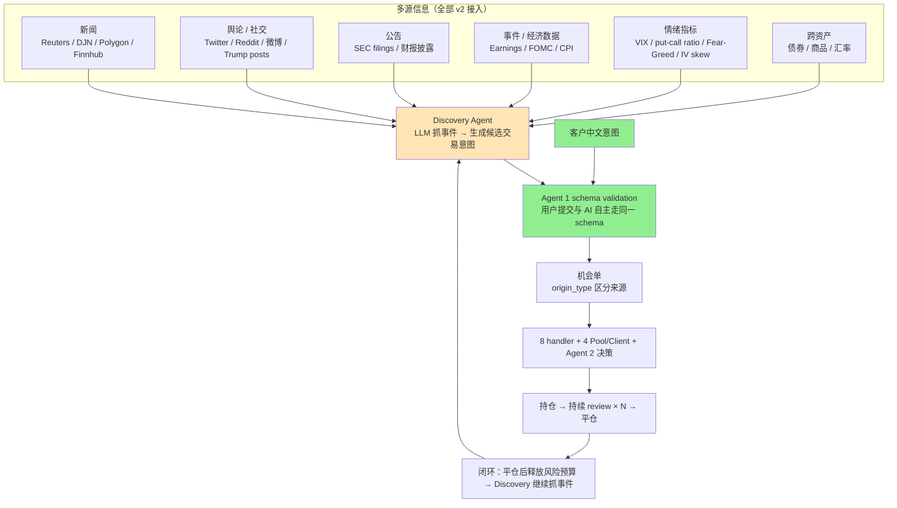
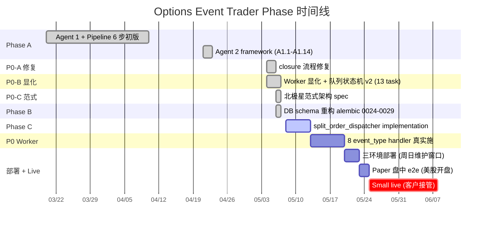
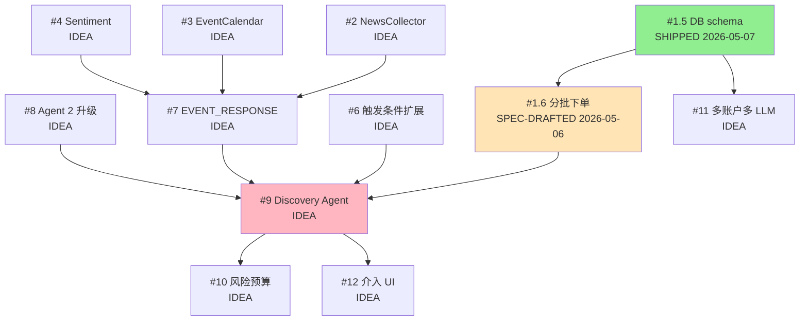

<!-- PAGE_ID: options_09_roadmap -->
<details>
<summary>Relevant source files</summary>

The following files were used as context for generating this wiki page (commit `6b3d159`):

- [task_plan.md](https://github.com/ChunmiaoYu/options_ai_trader/blob/6b3d159/task_plan.md)
- [findings.md](https://github.com/ChunmiaoYu/options_ai_trader/blob/6b3d159/findings.md)
- [paper_market_test_plan.md](https://github.com/ChunmiaoYu/options_ai_trader/blob/6b3d159/paper_market_test_plan.md)
- [CLAUDE.md](https://github.com/ChunmiaoYu/options_ai_trader/blob/6b3d159/CLAUDE.md)
- [docs/CHANGELOG.md](https://github.com/ChunmiaoYu/options_ai_trader/blob/6b3d159/docs/CHANGELOG.md)
- [docs/superpowers/specs/2026-05-06-db-schema-task-queue-design.md](https://github.com/ChunmiaoYu/options_ai_trader/blob/6b3d159/docs/superpowers/specs/2026-05-06-db-schema-task-queue-design.md)
- [docs/superpowers/specs/2026-05-06-split-order-adaptive-design.md](https://github.com/ChunmiaoYu/options_ai_trader/blob/6b3d159/docs/superpowers/specs/2026-05-06-split-order-adaptive-design.md)
- [docs/superpowers/specs/2026-05-04-worker-visualization-state-machine-design.md](https://github.com/ChunmiaoYu/options_ai_trader/blob/6b3d159/docs/superpowers/specs/2026-05-04-worker-visualization-state-machine-design.md)
- [docs/superpowers/specs/2026-05-03-agent1-position-schema-radical-simplify-design.md](https://github.com/ChunmiaoYu/options_ai_trader/blob/6b3d159/docs/superpowers/specs/2026-05-03-agent1-position-schema-radical-simplify-design.md)
- [docs/superpowers/specs/2026-05-01-flexible-exchange-routing-design.md](https://github.com/ChunmiaoYu/options_ai_trader/blob/6b3d159/docs/superpowers/specs/2026-05-01-flexible-exchange-routing-design.md)
- [docs/superpowers/specs/2026-04-30-windowed-condition-and-expire-design.md](https://github.com/ChunmiaoYu/options_ai_trader/blob/6b3d159/docs/superpowers/specs/2026-04-30-windowed-condition-and-expire-design.md)
- [docs/superpowers/specs/2026-04-21-agentic-trading-redesign-design.md](https://github.com/ChunmiaoYu/options_ai_trader/blob/6b3d159/docs/superpowers/specs/2026-04-21-agentic-trading-redesign-design.md)
- [memory project_vision_and_north_star.md (北极星)](内部 memory，外部不可访问，本文档提炼对外可读版本)

</details>

# 未来方向与设计决策

> **Related Pages**: [[项目概述|01_overview.md]], [[系统架构|02_architecture.md]], [[执行层|05_execution.md]], [[数据库|06_database.md]]

---

## 文档说明

本页是 Options Event Trader 项目的**路线图 + 设计决策记录**，回答三个问题：

1. **当前正在做什么** — M3 UAT live 主线、Phase 进度、剩余任务清单
2. **最终要做成什么** — 北极星 §2 远景：完整 AI 自主交易 + 多客户多账户
3. **为什么这样设计** — 关键决策回放（每条含日期 + 理由 + 替代方案为何被否决）

> **本页是"决策门禁"产物的对外可读版本**。完整内部决策档案见项目 memory `project_vision_and_north_star.md`（5 问 cross-check 清单 + forward compat hooks 全表）。
>
> **更新节奏**：每次 ship 一个 spec / 修改 invariant / 加新 P0/P1 finding 时，对应小节同步本页（参见 §11 维护规则）。

---

<!-- BEGIN:AUTOGEN options_09_roadmap_current_milestone -->

## 1. 当前里程碑：M3 UAT live（2026-05-XX）

### 1.1 M3 定义

**M3 = 客户接管 small live**：客户用真实小金额（$100-500/单测试规模）通过本系统下美股期权单，系统全自动决策（含入场 / 持仓监控 / 平仓），客户监督但不每步确认。

**M3 ≠ "全 PROD 部署"**。"PROD 部署" 是 M2.5（中间步，把代码推上 PROD 环境且服务可用）；M3 进一步要求**真实客户用真钱信任系统执行**。

### 1.2 M3 主线阶段（按依赖顺序）

```mermaid
flowchart LR
    A[Phase A<br>Agent 2 framework] -->|✅ ship| B[Phase B<br>DB schema 重构]
    B -->|✅ ship 2026-05-07<br>alembic 0024-0029| C[Phase C<br>split_order_dispatcher]
    C -.->|spec ship<br>待 implementation| D[P0 Worker handler<br>真实施]
    D --> E[三环境部署<br>cloud-dev → UAT → PROD]
    E --> F[Paper 盘中 e2e<br>美股开盘验证]
    F --> G[Small live<br>客户接管]

    style A fill:#90EE90
    style B fill:#90EE90
    style C fill:#FFE4B5
    style D fill:#FFB6C1
    style E fill:#FFB6C1
    style F fill:#FFB6C1
    style G fill:#FFB6C1
```



| 阶段 | 状态 | 关键产出 |
|---|---|---|
| **Phase A** Agent 2 framework | ✅ ship 2026-04-23 | A1.1-A1.14 共 14 sub-task，commits `c8d5e6e` → `6b8e154`；orchestrator + decision_repository + trace_archiver + R7 emergency close + entry escalation 4 档 |
| **Phase B** DB schema 重构 | ✅ ship 2026-05-07 | alembic 0024-0029（5 张新表 + BrokerOrder 加 3 列 + workflow_tasks task_type CHECK）+ 5 ORM models + WorkflowEventType enum + EVENT_HANDLERS dispatch + 44 tests PASS。22 commits `9413ebd` → `b49aafe` |
| **Phase C** split_order_dispatcher | spec ship 2026-05-06，待 implementation | 100 手以上拆单 + IBKR Adaptive 算法（单腿）+ 自实现拆腿挂单（多腿 BAG combo）+ 4 档 spread_ratio 调价循环 |
| **P0 Worker handler 真实施** | 等 Phase C 后启动 | 8 event_type handler 真实施 + 4 Pool/Client 抽象层落地（~1-2 天工程） |
| **三环境部署** | 等 P0 worker handler ship | cloud-dev → UAT → PROD（PROD 走周日维护窗口，等用户 SSH） |
| **Paper 盘中 e2e** | 等部署 + 美股开盘 | AAPL 突破 280 完整生命场景（入场 → review × N → 部分平仓 → 全平 → 取消订阅） |
| **Small live** | 等 paper 全绿 + 客户认可 | $100-500/单测试规模，Paper vs Live 校正因子量化（2-3 个交易日） |

> **当前推进点（2026-05-08 NZ 周五）**：Phase B 已 ship，Phase C spec 已写好等 implementation；同时发现 P0 ship blocker `F-2026-05-08-IBKR-SUBSCRIPTIONS-TWS-ONLY-NOT-API`（IBKR-PRO free feed 只覆盖 5 个小众交易所，不含 NYSE/Nasdaq/Arca），用户已通过 IBKR Portal 订阅 NASDAQ Network C/UTP + NYSE Network A/CTA + Network B + CBOE Streaming Indexes，等 5-15 min propagate 后 paper realtime 验证。

<!-- END:AUTOGEN options_09_roadmap_current_milestone -->

---

<!-- BEGIN:AUTOGEN options_09_roadmap_v1_target -->

## 2. 北极星 §1：第一版目标（2026-05-06 起 ~ M3 UAT live）

### 2.1 核心闭环

```
客户中文意图
    → Agent 1 派活（解析 3 必填字段）
    → 任务队列驱动（workflow_tasks 表 + 8 event_type）
    → Agent 2 决策（首次入场 + 5 min/次仓位管理）
    → IBKR 下单（4 Pool/Client 抽象 + Adaptive 算法）
    → 平仓（LMT → 追价 → MKT 升级链全自动）
```

详细架构见 [[系统架构|02_architecture.md]]，完整生命场景跑通见 [架构 walk-through](specs/architecture-walkthrough.md)。

### 2.2 主用户 / 主入口 / 生产市场

- **主用户 = 客户**：中文交互，美股期权实盘，~$2M RMB 量级
- **主入口 = 客户用自然语言中文提交意图**（前端 / API）
- **生产市场 = 美股期权**（NYSE / NASDAQ / ARCA）；ASX 仅开发测试；**HK 不用**（跟美股市场差别太大）

### 2.3 系统真实只有 3 类东西（2026-05-06 范式升级）

> 旧版 "3 工人 actor" 视角作废 → APScheduler + 8 handler + 4 Pool/Client + 任务队列驱动。

1. **APScheduler**（时间排程，唯一会主动产生任务的）
   - + `pandas_market_calendars`（NYSE 节假日 / 早收市）
   - + `ZoneInfo("America/New_York")`（DST 正确）
2. **8 个 handler 函数**（取任务 → 处理 → 可能塞新任务）
3. **4 个基础设施抽象（Pool / Client）**（屏蔽 IBKR 细节，业务代码**禁止**直接调 IBKR API）

### 2.4 4 个 Pool/Client + client_id 段位

| 抽象 | client_id 段 | 用途 | 模式 |
|---|---|---|---|
| **MarketDataPool** | 10-19 | 持续订阅市场数据 + 引用计数去重 + 持仓阶段保留订阅 | push（tick callback）/ pull（get_latest cache） |
| **QueryClient** | 20 | 一次性 query（历史 bar / 期权链 / contract details） | pull |
| **OrderClient** | 30 | 下单 / 撤单 / 修改 | 独占（防订单状态混乱） |
| **AccountSnapshotClient** | 40 | 账户余额 / 持仓 / 订单状态，cache TTL 5 秒 | Agent 1 + Dashboard + Agent 2 review 共享 |
| (临时 ad-hoc) | 90+ | 调试 / 一次性脚本 | — |

**禁止 hardcode client_id**。业务代码必走 Pool/Client 抽象，散落直接调 `ibkr.reqMktData / placeOrder` 视为偏离北极星 §5 forward compat hook。

### 2.5 Agent 1 解析 3 必填字段（2026-05-03 v3 极致瘦身后）

- **symbol** — LLM 中文公司名映射代码（特斯拉 → TSLA），真无法解析才阻塞
- **触发条件** — 4 类：立即 / 时间 / 条件 / 时间+条件
  - 条件类**只**支持 `PRICE_BREACH`（常数）+ `MA_CROSSOVER`（单 MA，含上下穿方向）
  - 其他（隐含波动率 / 成交量 / 双 MA / and-or）阻塞，留 v2 见 §9
- **direction** — 可 null；4 值 `BULLISH` / `BEARISH` / `VOLATILITY` / `null`
  - null 时 Agent 2 自由发挥
  - **非 null 时 Agent 2 强约束遵守**

> 客户原话**完整**整段保存 (`raw_input_text`)，Agent 2 决策时自己看；Agent 1 不解析 TP/SL/手数/腿数等其他字段（Agent 2 自决）。详见 [[Intake 层|03_intake.md]]。

### 2.6 Agent 2 输入 / 输出

- **输入** = 永远 10 维 Bundle（entry 时维度 5 持仓盈亏 + 维度 10 上次 summary 为 null；review 时齐全）
- **入场决策**：拒绝 → 失败单 / 通过 → 风险门验证（Layer 1 schema enum + Layer 2 mapping）→ 通过下单，失败重跑 1 次仍违 → 失败单
- **正常时段仓位管理 = 5 min/次（self-loop）**，输出本次 summary（≤600 字 rolling）+ 三选一（仓位不变 / 加仓 / 平仓部分或全平）
- **事件熔断窗口（earnings / CPI / FOMC ±15 min）**：review 改连续 loop（前次完成 → 立即下一次，间隔由 LLM 决策延迟主导 ~15-30s/轮）；单次 review 全管道 timeout = 25s 超时跳过该轮；窗口持续上限 60 min
- 事件公布瞬间（newsTicker 收到）立即塞一次 review 任务（跳过等待）
- **客户期权不用机械止损**（买方亏损上限 = 权利金 / 卖方 spread 亏损 = 价差宽度 - 净收，均接受最大亏损）；LLM 综合决定平仓时机，**不让客户定死止损价位**

详见 [[策略层|04_strategy.md]]。

### 2.7 风险门（risk_gate）二层防护

- **Layer 1**：LLM Structured Outputs schema enum 限制策略只能在白名单内（LLM 物理无法输出禁止策略，从 `strategy_whitelist` 表查表生成）
- **Layer 2**："策略 → 方向" mapping 表（`strategy_whitelist.direction_class` 列查表）对照 `opp.direction`，不匹配重跑一次（prompt 提醒上次违反点），仍违 → 失败单
- `BULL_PUT_SPREAD` / `BEAR_CALL_SPREAD` 等反直觉策略由 mapping 表显式锁定，不留 LLM 推断

### 2.8 策略白名单（共 12 种，无裸卖空）

| 方向类 | 策略 |
|---|---|
| **BULLISH (3)** | LONG_CALL / BULL_CALL_SPREAD / BULL_PUT_SPREAD |
| **BEARISH (3)** | LONG_PUT / BEAR_PUT_SPREAD / BEAR_CALL_SPREAD |
| **VOLATILITY (6)** | LONG_STRADDLE / LONG_STRANGLE / IRON_CONDOR / IRON_BUTTERFLY / **CALENDAR_SPREAD** / **DIAGONAL_SPREAD** |

> 后两者（CALENDAR / DIAGONAL）2026-05-06 加入，中文客户讲"赚时间价值" / "earnings play 不押方向"用；都是净 debit 有限亏，非裸卖空。

**裸卖空（SHORT_CALL / SHORT_PUT / SHORT_STRADDLE / SHORT_STRANGLE）永久禁止** — 亏损无底线。

### 2.9 4 腿策略流动性指引（soft hint）

- IRON_CONDOR / IRON_BUTTERFLY 4 腿在 100+ 手量级 BAG combo 撮合需全腿同时 fill；大单经常部分成交 → 暴露裸腿
- **Agent 2 看 10 维 bundle（dim 4 期权链 + dim 8 OI/volume）自决** — 不在 schema 写硬约束（hard gate）
- prompt 文件 `prompts/agent2_shared/risk_guidelines.md` 给指引："100 手以上 4 腿策略，必先看 dim 8 各腿 **OI ≥ 1000 + 当日 volume ≥ 100 + bid-ask spread ≤ 5% mid**；不达标主动降级 SPREAD（2 腿）或拒绝"
- **理由**：流动性不够 = 滑点 5-10% 不是无限亏损，跟"裸卖空永久禁止" hard gate 等级不同；信任 LLM 看充分信息自决跟北极星整体哲学一致（同"客户期权不用机械止损"也是 LLM 自决）
- **改阈值改 prompt 文件即可，不需 alembic 不需重启**（LLM 每次 review 重读 prompt）

### 2.10 LLM 选型

- 全用 **DeepSeek V4-Flash**（Anthropic-compat 端点）
- 通过 env 切：`ANTHROPIC_BASE_URL` + `ANTHROPIC_API_KEY` + model 名，**代码不动**（`from anthropic import Anthropic` 不变）
- 未来开新 user 切回 Anthropic Haiku 也只改 env

### 2.11 8 种 event_type（任务队列里所有任务类型）

| event_type | 谁触发 | 谁消费 |
|---|---|---|
| `SYSTEM_WAKE_UP` | APScheduler（09:00 ET 盘前 30 min） | 全局（Pool 重连 + 重订阅） |
| `SYSTEM_SLEEP` | APScheduler（16:00 ET 盘后） | 全局（停 active_reviews） |
| `CONDITION_MET(opp_id)` | MarketDataPool tick callback | 业务逻辑 → Agent 2 入场决策 |
| `AGENT2_REVIEW_TICK(opp_id)` | APScheduler（5 min 周期 / 事件窗口连续 / newsTicker 加塞） | 信息工人逻辑 → Agent 2 LLM |
| `EXECUTE_DECISION(decision)` | CONDITION_MET / AGENT2_REVIEW_TICK handler（Agent 2 输出 + 风险门通过后） | OrderClient |
| `ENTRY_FILLED(opp_id, order_id)` | OrderClient orderStatus callback（累计 FILLED） | 业务逻辑 → 写持仓 + 启动 review |
| `EXIT_FILLED(opp_id, order_id)` | 同上 | 业务逻辑 → 减持仓 / 全平归档 + 取消订阅 |
| `EXPIRE_OPPORTUNITY(opp_id)` | APScheduler（effective_until 到点） | 业务逻辑 → 标 FAILED |

**任务队列必持久化**（`workflow_tasks` 表）— 崩溃恢复扫 PENDING/RUNNING > 60s 重做；handler 必 idempotent。

### 2.12 分批下单 + Adaptive 算法（本期 ship）

2026-05-06 从远景拆出，因为大单滑点是先决条件不是优化：

- 单仓位 ≥ 50 手必拆；< 50 手整单
- 单腿策略（LONG_CALL/PUT）→ IBKR Adaptive Algorithm（`order.algoStrategy="Adaptive"`）
- 多腿策略（BULL_CALL_SPREAD / IRON_CONDOR 等 BAG combo）→ 自实现拆腿挂单 + invariant 21 4 档 spread_ratio（patient / normal / urgent / market）调价循环（IBKR Adaptive **不支持** combo）
- 默认 batch_size=10 / interval_sec=8 / 起步 patient

详见 spec [`2026-05-06-split-order-adaptive-design.md`](specs/2026-05-06-split-order-adaptive-design.md)。

### 2.13 并发上限

- **持仓数量 = 3-5 个**（吃资金，~$280k USD 账户保 30% buffer 防 margin call）
- **机会单总数 = 20-30 个**（含监控中未触发的，不吃资金，只吃 IBKR 100 stream 配额，MarketDataPool 引用计数自动去重）
- IBKR client_id 上限 32 完全用不完（仅用 5 个长连）

<!-- END:AUTOGEN options_09_roadmap_v1_target -->

---

<!-- BEGIN:AUTOGEN options_09_roadmap_vision -->

## 3. 北极星 §2：最终远景（Phase 12+，持续演进）

> **核心理念**：从 "辅助客户决策" 演进到 "AI 自主从多源信息触发交易，客户监督"。
> **客户输入是触发交易的来源之一，不是唯一**。

### 3.1 远景架构图



### 3.2 origin_type 区分 5 类来源

```
USER_SUBMITTED       — 客户提交（v1 唯一来源）
AUTO_FROM_NEWS       — 新闻触发
AUTO_FROM_EVENT      — 事件日历触发
AUTO_FROM_SENTIMENT  — 情绪指标触发
AUTO_FROM_DISCOVERY  — LLM 综合抓
```

> **forward compat hook 已嵌入**（北极星 §5）：`opportunities.origin_type` enum + `origin_metadata` jsonb 已在 schema 层落地，v1 阶段固定 `USER_SUBMITTED`，Discovery Agent ship 时仅扩 enum + 接入触发路径，不动消费端。

### 3.3 远景 5 项子能力（按重要性，不分版本顺序）

#### (1) 触发条件无穷扩展

客户能用自然语言描述的任何条件都应支持。具体方向举例：

- 隐含波动率条件（IV > 50%）
- 成交量条件（量能放大 N 倍）
- 双 MA 交叉（MA5 上穿 MA20）
- 多条件 and-or 组合
- 跨标的相对强度（AAPL 跑赢 SPY 5%）
- 前高 / 前低突破
- 布林带突破
- 财报 / 事件锚定（anchor-relative window）
- 资金流 / 大单异动
- 期权希腊字母异动（Δ / Γ / IV crush）
- **等等，无穷扩展**（跟 LLM 自然语言理解能力同步演进，无固定上限）

#### (2) Agent 2 决策升级

- **bundle + tool-use** — LLM 主动调 tool 查超出固定 bundle 的指标
- **分批下单 + Adaptive 算法**（本期已 ship，见 §2.12）
- **期权专家 3 维入 bundle** — Implied Move / Realized Vol vs IV / Skew Sentiment
- **1 min real-time bar** — `marketDataType=1` 实时模式优化

#### (3) 多账户 / 多 LLM 并行

- 多 user 共存（不同客户 / 不同账户），每 user env 切不同 LLM
- 多 LLM（V4-Flash / Anthropic Haiku / 未来其他模型）
- paper + live 并存调度

#### (4) 风险预算管理 + 用户介入审批 UI

- 闭环调度：风险预算 / 仓位上限 / Discovery 频率
- 用户介入：审批 Discovery 候选 / 调整 sizing / 撤销 / 偶尔人工输入意图

#### (5) 数据基础设施完整化

- 真新闻接入（替代当前 stub）— IBKR Reuters/DJN 或第三方
- 真事件日历接入（替代当前 stub）
- 真 VIX（CBOE Index，替代当前 VIXY ETF 代理；2026-05-08 已修代码 + 用户已订 CBOE Streaming Indexes，等订阅 propagate）
- **Level 2 / 深度行情** — 看 N 档挂单簿（NASDAQ TotalView 看 10 档买卖盘等）；期权跨多交易所聚合 depth 当前 IBKR 不提供，看 v2 能否接单交易所 depth

### 3.4 远景反偏离 — 永久不做

- **HK 市场支持** — 跟美股市场差别太大，不是目标
- **ADJUST_STOP / 机械止损** — 期权买方天然亏损上限 = 权利金，客户接受亏光；平仓由 Agent 2 LLM 综合判断，不让客户定死止损价位
- **裸卖空**（SHORT_CALL / SHORT_PUT / SHORT_STRADDLE / SHORT_STRANGLE）— 亏损无底线，永久禁止

### 3.5 一句话总结

**客户输入只是触发交易的来源之一。AI 主动从新闻 / 舆论 / 公告 / 事件 / 情绪等多源信息抓机会，跟客户提交走同一 schema 同一基础设施，闭环演进。**

<!-- END:AUTOGEN options_09_roadmap_vision -->

---

<!-- BEGIN:AUTOGEN options_09_roadmap_phases -->

## 4. Phase 进度表



### 4.1 各 Phase 关键产出

| Phase | 时间 | 状态 | 关键产出 | commit 链 |
|---|---|---|---|---|
| **Phase A** Agent 1 + Pipeline | 2026-03-20 → 2026-04-10 | ✅ ship | 7 节点 LangGraph intake + OpenAI Structured Outputs（22 字段 → 后被 v3 瘦身到 3 必填）+ 17 张 DB 表 + Worker 骨架 + S0A 盘中验证 | 早期 commits（详见 [docs/CHANGELOG.md](https://github.com/ChunmiaoYu/options_ai_trader/blob/6b3d159/docs/CHANGELOG.md)） |
| **Phase A2** Agent 2 framework | 2026-04-21 → 2026-04-23 | ✅ ship | A1.1-A1.14 共 14 sub-task；orchestrator + decision_repository + trace_archiver + R7 emergency close + entry escalation 4 档 | `c8d5e6e` → `6b8e154` |
| **P0-A** closure 流程修复 | 2026-05-04 | ✅ ship | session 收尾流程加固 + finding ↔ task_plan 双向同步 hook | `ed33efe` + `7274f27` |
| **P0-B** Worker 显化 + 状态机 v2 | 2026-05-04 | ✅ ship | 14 commits；spec [`2026-05-04-worker-visualization-state-machine-design.md`](specs/2026-05-04-worker-visualization-state-machine-design.md)；invariant 11 v3（4 大状态收敛）+ invariant 18 可观测性补丁 + invariant 20 模型锁 Haiku | `0a4b560` → `64487a9` |
| **P0-C** 北极星范式架构 spec | 2026-05-06 | ✅ ship | DB schema spec + 分批下单 spec + 4 Pool/Client + 8 event_type + 12 策略白名单（加 CALENDAR/DIAGONAL）+ wiki [架构 walk-through](specs/architecture-walkthrough.md) ship | spec PRs |
| **Phase B** DB schema 重构 | 2026-05-06 → 2026-05-07 | ✅ ship | alembic 0024-0029 = 5 张新表（`active_reviews` / `market_data_subscriptions` / `pool_health_log` / `event_calendar` / `strategy_whitelist` seed）+ BrokerOrder 加 3 列 + workflow_tasks task_type CHECK；5 ORM models + WorkflowEventType enum + EVENT_HANDLERS dispatch；44 tests PASS | 22 commits `9413ebd` → `b49aafe` |
| **Phase C** split_order_dispatcher | 2026-05-08 → ? | spec ship 待 implementation | 拆单阈值 + Adaptive 单腿 + BAG combo 拆腿 + partial leg 90s 硬 timeout R7 应急；估 4-5 hr 工程 | spec [`2026-05-06-split-order-adaptive-design.md`](specs/2026-05-06-split-order-adaptive-design.md) |
| **P0 Worker handler 真实施** | 等 Phase C 后 | 待启动 | 8 event_type handler 真实施 + 4 Pool/Client 抽象层落地；估 1-2 天工程 | finding F-2026-05-07-WORKER-HANDLER-IMPLEMENTATION |
| **三环境部署** | 等 P0 worker handler 后 | 等 SSH + 周日维护窗口 | cloud-dev → UAT → PROD `alembic upgrade head` + 服务重启 | finding F-2026-05-07-PHASE-B-DEPLOY-PENDING |
| **Paper 盘中 e2e** | 等部署 + 美股开盘 | 等盘中 | AAPL 突破 280 完整生命场景（入场 → review × N → 部分平仓 → 全平 → 取消订阅）；详见 [paper_market_test_plan.md](https://github.com/ChunmiaoYu/options_ai_trader/blob/6b3d159/paper_market_test_plan.md) §3 Tier 1 | finding F-2026-05-07-PHASE-B-PAPER-E2E-PENDING |
| **Small live 客户接管** | 等 paper 全绿 + 客户认可 | M3 终点 | $100-500/单测试；Paper vs Live 校正因子量化；2-3 个交易日观察 | finding F-2026-04-21-PAPER-TO-LIVE-DELTA-UNKNOWN |

<!-- END:AUTOGEN options_09_roadmap_phases -->

---

<!-- BEGIN:AUTOGEN options_09_roadmap_remaining_tasks -->

## 5. 当前剩余任务清单（按优先级 + 时机标注）

> 标注规则（项目 CLAUDE.md §9）：
> - `[离线]` = 现在能干，不依赖任何外部条件
> - `[盘中]` = 必须美股开盘才能干（NZ 02:00-08:30 = ET 09:30-16:00 DST 时段）
> - `[周日维护窗口]` = 必须 IBKR 周日维护窗口（ET 周六 23:45 - 周日 23:45）
> - `[等用户 X]` = 等用户具体动作
> - 复合可叠加：例如 `[盘中] [等用户 oat**** 激活]`

### 5.1 P0 主线（M3 唯一阻塞链）

| ID | 描述 | 时机标注 | 工程估 |
|---|---|---|---|
| **wiki 9 文档重写** | 旧 docs 2026-04-14 静态架构描述与现实严重脱节，需按 4 Pool/Client + APScheduler + Phase B alembic + DeepSeek + UI v2 重写 | `[离线]` | ~2-3 hr |
| **F-2026-05-07-WORKER-HANDLER-IMPLEMENTATION** | 8 event_type handler 真实施（依赖 4 Pool/Client 抽象层） | `[离线]` | 1-2 天 |
| **F-2026-05-08-IBKR-SUBSCRIPTIONS-TWS-ONLY-NOT-API** | 用户 2026-05-08 NZ 09:43 已 IBKR Portal 订 NASDAQ Network C/UTP + NYSE Network A/CTA + Network B + CBOE Streaming Market Indexes，等 propagate 后 paper realtime 验证 | `[盘中]` `[等用户订阅 propagate]` | 测试 30-60 min |
| **F-2026-05-07-PHASE-B-DEPLOY-PENDING** | Phase B alembic 0024-0029 三环境部署（cloud-dev → UAT → PROD） | `[周日维护窗口]` `[等用户 SSH]` | 1-2 hr |
| **F-2026-05-07-PHASE-B-PAPER-E2E-PENDING** | Phase B 完整生命场景 paper e2e | `[盘中]` `[等部署]` | 30-60 min |

### 5.2 P0-E Phase C dispatcher + paper（依赖 Phase B PROD ship）

> spec [`2026-05-06-split-order-adaptive-design.md`](specs/2026-05-06-split-order-adaptive-design.md)，工程估 4-5 hr。

- `split_order_dispatcher.py` 实现 `[离线]`
- `order_placer.py` + `exit_order_placer.py` 集成入口 `[离线]`
- BrokerOrder 字段填值（`algo_strategy` / `split_order_batch_id` / `batch_intent_json`）`[离线]`
- paper 真测（100 手 LONG_CALL Adaptive + IRON_CONDOR 拆腿）`[盘中]` `[等 Phase C ship]`

### 5.3 P1 Phase B 仍 open

- **F-2026-05-06-NEWSTICKER-REQID-ISOLATION** — spec 自身明示本期不实施（spec line 247-250），远景 §4 #4 ship 才动 `[离线]` `[等远景 §4 #4]`
- **F-2026-05-06-DEPLOY-HEALTH-GATE** — `deploy.sh` 加 alembic revision check `[离线]`

### 5.4 P1 历史积压（阻塞 live，等 oat**** 激活 + 美股开盘）

- **F-2026-04-21-PAPER-TO-LIVE-DELTA-UNKNOWN** — Paper vs Live 校正因子量化 `[盘中]` `[等用户 oat**** 激活]`（估 2-3 日 small live）
- **F-2026-04-25-SCENARIOS-L3-PAPER-LIVE-DELTA** — L3 ≥1 条 live small smoke（< $100 risk，同组依赖）`[盘中]` `[等用户 oat**** 激活]`

### 5.5 P1 客户接管前必修（实盘 1 周内必交付）

- **F-2026-04-30-FRONTEND-MOBILE-NOT-ADAPTED** — 手机适配（viewport meta + 768px breakpoint + bottom nav + 表格改 card list）`[离线]`（估 1.5-2 day）
- **F-2026-04-30-FRONTEND-RESPONSIVE-DESKTOP-OVERFLOW** — Dashboard 3 列窄屏 (≤ 1900px) overflow 修复 `[离线]`
- **F-2026-05-04-WORKER-VIZ-PAPER-SMOKE-PENDING** — P0-B Worker 显化 4 placeholder 测试改真测试 `[盘中]` `[等部署]`
- **F-2026-05-04-LEGACY-COMPOSER-STALE-ENUM** — legacy-composer.jsx 老 enum mapping 跟 invariant 11 v3 不一致 `[离线]`

### 5.6 Phase C 真实施后续 5 项

`F-2026-05-06-SPLIT-ORDER-PAPER-VALIDATION` (P1) `[盘中]` / `F-2026-05-06-PARTIAL-LEG-TIMEOUT-PAPER-VALIDATION` (P1) `[盘中]` / `F-2026-05-06-COMPUTE-SPLIT-THRESHOLD-TUNE` (P1) `[盘中]` / `F-2026-05-06-INTERVAL-JITTER-TUNE` (P2) `[盘中]` / `F-2026-05-06-SYMBOL-ROUTES-EXEC-OVERRIDE` (P2) `[离线]`

### 5.7 P2/P3 不阻塞 ship

`F-2026-05-07-PROD-LARGE-TABLE-MIGRATE-REVIEW` / `F-2026-05-07-PHASE-B-PROD-VALIDATE-PERFORMANCE` / `F-2026-05-07-LEGACY-TASK-TYPE-CLEANUP-PATH` 等。完整列表见 [findings.md](https://github.com/ChunmiaoYu/options_ai_trader/blob/6b3d159/findings.md)。

<!-- END:AUTOGEN options_09_roadmap_remaining_tasks -->

---

<!-- BEGIN:AUTOGEN options_09_roadmap_completed -->

## 6. 已完成里程碑（压缩段）

> 按时间倒序，一行摘要不展开。详细回放见 [docs/CHANGELOG.md](https://github.com/ChunmiaoYu/options_ai_trader/blob/6b3d159/docs/CHANGELOG.md) + [task_plan.md](https://github.com/ChunmiaoYu/options_ai_trader/blob/6b3d159/task_plan.md) "已完成归档" 段。

| 时间 | 里程碑 | 摘要 |
|---|---|---|
| **2026-05-07** | **Phase B Implementation ship** | 通宵 subagent-driven，22 commits `9413ebd` → `b49aafe`；alembic 0024-0029（5 新表 + BrokerOrder 加 3 列 + workflow_tasks task_type CHECK）+ 5 ORM models + WorkflowEventType enum + EVENT_HANDLERS dispatch + 44 tests PASS。Subagent 10 calls 全 APPROVED |
| **2026-05-06** | **北极星范式架构 spec ship (P0-C)** | DB schema spec 二轮 5 专家 review 4 PASS + 1 P0 修；分批下单 spec 二轮 5 专家全 PASS（4 P0 + 8 P1 修）；4 Pool/Client + 8 event_type + 12 策略白名单（加 CALENDAR/DIAGONAL）+ wiki [架构 walk-through](specs/architecture-walkthrough.md) ship（601 行） |
| **2026-05-04** | **Worker 显化 + 队列状态机 v2 ship (P0-B)** | spec [`2026-05-04-worker-visualization-state-machine-design.md`](specs/2026-05-04-worker-visualization-state-machine-design.md)；14 commits `0a4b560` → `64487a9`；invariant 11 v3 4 大状态收敛 + 失败 5 原因 + invariant 18 可观测性补丁 + invariant 20 模型锁 Haiku |
| **2026-05-04** | **closure 流程修复 ship (P0-A)** | session 收尾流程加固 + finding ↔ task_plan 双向同步 hook + meta-level closure 漏洞修复（4 处）；commits `ed33efe` + `7274f27` |
| **2026-05-03** | **invariant 5 v3 极致瘦身 ship** | Agent 1 必填字段从 22 → 3（symbol + 触发条件 + direction）；废弃 14 字段（position_spec / take_profit_spec / stop_loss_spec / max_position_pct / direction / target_quantity / preferred_strategies / disallowed_strategies / instrument_scope / risk_style / suitability_gate / user_thesis_zh / partial_fill_policy / intent_type）；Agent 2 看 raw_input_text 自决 |
| **2026-05-02** | **per-symbol exchange routing ship** | `services/exchange_routing.py` + `config/symbol_routes.yml` 双层数据驱动模块；删 `settings.test_market_override` 全局 toggle 反模式；CLAUDE.md invariant 23 锁定；commit chain `c85bb19` → `05bda37` 7 commits + 23/23 routing tests PASS |
| **2026-04-30** | **windowed_condition + expire spec ship** | spec [`2026-04-30-windowed-condition-and-expire-design.md`](specs/2026-04-30-windowed-condition-and-expire-design.md)；effective_until / catch-up / fast-forward / Agent 2 两阶段 / 时区按 symbol；选 A 字段扩展非新建 family（catalog 设计哲学正交） |
| **2026-04-23** | **Phase A2 Agent 2 framework ship** | A1.1-A1.14 共 14 sub-task；orchestrator + decision_repository + trace_archiver + R7 emergency close + entry escalation 4 档；111+8 DB 新测试 |
| **2026-04-23** | **Step A-E ship（agentic redesign）** | 数据采集 9 类 + 订阅池 + bundle_packager + LLM 决策层 + Risk Gate v2 + 执行层升级；commits `268d873` → `a909062`；spec [`2026-04-21-agentic-trading-redesign-design.md`](specs/2026-04-21-agentic-trading-redesign-design.md) |
| **2026-04-19** | **execution-status refactor Release N ship** | 废弃 `ADVICE_ONLY` 模式 → 二分 `SUPPORTED` / `UNSUPPORTED`；direction 可 null；`max_risk_dollars` 必填（注：2026-05-04 用户撤销路径 B，max_risk_dollars 字段 2026-05-03 v3 又被废）；五专家评审 + 11 阶段实施；spec [`2026-04-19-execution-status-refactor-design.md`](specs/2026-04-19-execution-status-refactor-design.md) |
| **2026-04-10 ~ 2026-04-18** | **Phase 1-9B 基础链路 ship** | Intake + Hardening + S0A 执行 + S0B 安全护栏 + API/前端 + Agent2 + Market Data + Broker Adapter + Pipeline DB + 前端 Strategy/Execution Tab + 止盈止损自动平仓；累计 266+ tests |

<!-- END:AUTOGEN options_09_roadmap_completed -->

---

<!-- BEGIN:AUTOGEN options_09_roadmap_decisions -->

## 7. 历史决策回放

> 按时间倒序，每条含**决策 + 日期 + 理由 + 备选方案为何被否决**。完整内部档案见项目 memory `project_vision_and_north_star.md` §6。

### 7.1 2026-05-07 — Phase B Implementation ship

**决策**：alembic 0024-0029 + 5 ORM + 8 event_type enum + EVENT_HANDLERS dispatch + 44 tests 一夜 ship；out-of-scope 留 P0 worker handler + P1 部署 + P1 paper e2e。

**理由**：北极星范式架构 spec 2026-05-06 ship 后等用户审核 1 天就 implementation，避免 spec ↔ code 漂移；通过 subagent-driven 让 Claude 同时跑 6+ task 并行。

**备选**：分多个 session 渐进 implementation。**否决**：跨 session 易引入 closure 漂移（P0-A 教训）；subagent-driven 已证明可控（10 calls 全 APPROVED）。

### 7.2 2026-05-06 — 北极星范式级架构梳理（"3 工人 actor" → APScheduler + 4 Pool/Client + 8 handler）

**决策**：旧 §1 系统构成图整体作废，升级为 APScheduler + 8 handler + 4 Pool/Client + 任务队列驱动；同时 ship architecture-walkthrough wiki 文档承载详细。

**理由**：用户深入提问梳理（订阅去重 / cache TTL / 重连屏蔽 / 长连本质 / 5 min review 控制 / 持仓上限）暴露旧 "3 工人 actor" 视角整体 stale —— "工人" 实际是 handler 逻辑分组，独立 actor 视角等于重复造任务队列轮子。

**备选**：保留 "工人 actor" 视角，每个工人独立进程 / 独立类。**否决**：偏离 §1 范式；散落 retry / 订阅状态 / cache 在各 actor 内部 = 把所有 forward compat hook 全踩坏。

### 7.3 2026-05-06 — 4 腿流动性约束从 hard gate 反转为 soft hint

**决策**：删 `strategy_whitelist.liquidity_constraint_symbols` / `min_oi_per_leg` 字段；改在 prompt 文件 `prompts/agent2_shared/risk_guidelines.md` 给指引（OI ≥ 1000 + volume ≥ 100 + spread ≤ 5% mid）。

**理由**：LLM 看 10 维 bundle（dim 4 期权链 + dim 8 OI/volume）能判断流动性；4 腿白名单 hard gate 反而违反 "信任 LLM" 原则（跟 "客户期权不强制止损" 同哲学）；流动性不够 = 滑点 5-10% 不是无限亏损，跟裸卖空 hard gate 等级不同。

**备选**：保留 hard gate（symbol 白名单 + OI 阈值代码层强制）。**否决**：信息不全（白名单不可能枚举所有合格标的）+ 流动性不是 binary（dim 8 实时数据更准）。

### 7.4 2026-05-06 — 策略白名单从 10 → 12（加 CALENDAR/DIAGONAL）

**决策**：VOLATILITY 类加 `CALENDAR_SPREAD` + `DIAGONAL_SPREAD` 共 6 种。

**理由**：中文客户讲 "赚时间价值" / "earnings play 不押方向" 用；都是净 debit 有限亏，非裸卖空。

### 7.5 2026-05-06 — 分批下单 + Adaptive 算法本期 ship（从远景 →  v1 必备）

**决策**：单仓位 ≥ 50 手必拆；单腿走 IBKR Adaptive；多腿走自实现拆腿挂单 + 4 档 spread_ratio 调价循环。

**理由**：客户实盘 ~$2M 量级，单仓位常 100+ 手；不拆 = 大单滑点 5-10% 直接吃掉策略 alpha；这是先决条件不是优化。

**备选**：v1 全部走整单，等 v2 再加拆单。**否决**：v1 客户实盘从第一天就遭遇大单滑点，不可接受。

### 7.6 2026-05-04 — invariant 7（entry_at_zh 原文一致性）废止

**决策**：删 `runtime_planner.py:520-530` 时间表达原文 substring 检查 + 删测试 + 删阻断文案；CLAUDE.md invariant 7 标 deprecated。

**理由**：用户 demo 实测 `QQQ 周三早上 10 点押波动` 因 LLM 输出 `周三早上10点`（无空格）触发阻断；用户 Tier 1 纠正 "Agent 1 是给 worker 派活，不是防 LLM 改原话；raw_input_text 整段传 Agent 2 入场决策时它自己看原话"。

### 7.7 2026-05-04 — 路径 B（max_risk_dollars 反推手数）撤销

**决策**：客户讲 "最多亏 X" 不再硬反推手数；broker_adapter 用 50% 临时红线兜底持续。

**理由**：路径 B 加新字段 + Agent 1 多解析一项 = 偏离 invariant 5 v3 极致瘦身（必填只有 symbol）+ 偏离 "Agent 2 看原话自决" 哲学。

**备选**：保留 risk_helpers 集成 broker_adapter。**否决**：50% 兜底已够本期；未来若需要再单独 spec。

### 7.8 2026-05-04 — invariant 17（max_legs hard gate）废止

**决策**：允许 IRON_CONDOR 4 腿等；`max_legs` 仅作 soft hint 不作 hard gate。

**理由**：跟 4 腿流动性反转同哲学；策略白名单已限制不会出现 5+ 腿无意义组合。

### 7.9 2026-05-04 — suitability_gate 废止

**决策**：删 invariant 6；客户原话 "如果适合的话" 不再卡解析，Agent 2 看原话自决。

**理由**：Agent 1 是派活不是验，suitability 是 Agent 2 决策维度。

### 7.10 2026-05-03 — invariant 5 v3 极致瘦身（22 → 3 必填字段）

**决策**：Agent 1 必填只剩 `symbol`；废弃 14 字段（position_spec / take_profit_spec / stop_loss_spec / max_position_pct / direction / target_quantity / preferred_strategies / disallowed_strategies / instrument_scope / risk_style / suitability_gate / user_thesis_zh / partial_fill_policy / intent_type；2026-05-04 加 max_legs）；客户原话整段传 Agent 2 自决。

**理由**：22 字段必填 = 客户必须按系统格式填表，违反 "客户用自然语言中文表达" 主入口；Agent 2 看 raw_input_text 整段决策最准确（2 LLM 串联损失最小）。

**备选**：保留必填字段做 schema 校验。**否决**：北极星 5 问 #4 偏离信号 — "把未来要靠数据驱动的字段硬编码成用户必填"。

**实测验证**：Agent 1 解析 COMPLEX case 30s → 15.4s（减 49%），input_tok 2860 → 1738（-39%）。详见 spec [`2026-05-03-agent1-position-schema-radical-simplify-design.md`](specs/2026-05-03-agent1-position-schema-radical-simplify-design.md)。

### 7.11 2026-05-02 — exchange routing 数据驱动（删 test_market_override 全局 toggle）

**决策**：建 `services/exchange_routing.py` + `config/symbol_routes.yml` 双层数据驱动模块；删 `settings.test_market_override`；CLAUDE.md invariant 23 锁定（函数体禁 if/else 关于 symbol 内容判断；4 字段恒定）。

**理由**：旧 toggle 是反模式（全局 flag 影响所有 symbol，不能 per-symbol 路由）；ASX 测试时 SMART/USD fallback 拿到错的 farm。

**备选**：保留 toggle 加更多 if/else 分支。**否决**：分支爆炸；Discovery Agent ship 时换数据源（IBKR API 反查路由）需要重写所有消费端。

### 7.12 2026-04-30 — LLM 切 DeepSeek V4-Flash（Agent 1 + Agent 2 entry）

**决策**：从 OpenAI gpt-5 切 DeepSeek V4-Flash；通过 env 切 `ANTHROPIC_BASE_URL` + `ANTHROPIC_API_KEY` + model 名，代码不动；Agent 2 review 路径保 Anthropic Haiku。

**理由**：成本降 ~4000x，验证 4/4 PASS；review 路径决策更复杂保 Claude（2026-05-04 后改为 Haiku 模型锁，省成本）。

**备选**：全 Claude / 全 GPT-5。**否决**：成本不可接受（GPT-5 对 ~$2M 量级实盘的 review cadence 算下来 $1k+/月）。

### 7.13 2026-04-21 — Agent 2 双工作点范式（首次入场 + 5 min review self-loop）

**决策**：Agent 2 不再是"一次生成交用户确认"；改为首次入场决策 + 入场后每 bar 持续自主决策（HOLD / PARTIAL_CLOSE / FULL_CLOSE / ADJUST_STOP，2026-05-04 后 ADJUST_STOP 也废）。

**理由**：北极星 §2 远景 "AI 自主交易，客户监督"；要 ship 完整闭环 AI 自主，必须 review self-loop。

**备选**：保留"用户每步确认"。**否决**：跟北极星 §1 + invariant 16（止盈止损全自动不甩给用户）冲突。

### 7.14 2026-04-19 — direction 允许 null（用户表达波动率/跨式时）

**决策**：`direction` 4 值 BULLISH/BEARISH/VOLATILITY/null；null 时 Agent 2 自由发挥；非 null 时 Agent 2 强约束遵守。

**理由**：用户讲 "AAPL 来个 straddle" 没方向预期；硬逼用户选 BULLISH/BEARISH 是把 LLM 不确定输出推回客户。

<!-- END:AUTOGEN options_09_roadmap_decisions -->

---

<!-- BEGIN:AUTOGEN options_09_roadmap_anti_drift -->

## 8. 反偏离警示（北极星 §7）

> 任何下面这些念头出现时，**先停下回看本文档 + memory `project_vision_and_north_star.md` 的 5 问 cross-check**。

### 8.1 不做 — 客户每步确认设计

**红旗**：想给状态机加 `WAIT_FOR_USER_CONFIRMATION` 中间态 / 想让客户在 intake 时就指定 strike + quantity / 想让 Agent 2 输出 "建议 → 等用户点按钮"。

**为什么不做**：跟 invariant 16（止盈止损全自动不甩给用户）+ Agent 2 双工作点范式冲突；客户 ~$2M 量级实盘，每步确认 = 客户 24 小时盯屏，不可持续。

### 8.2 不做 — webhook / 实时 push

**红旗**：想给前端加 WebSocket / SSE / Server-Sent Events 推送实时仓位变化。

**为什么不做**：短 polling 够用（10s / 60s 间隔）；WebSocket 增加运维成本（连接保活 / 重连 / 跨 LB stickiness）；前端面向中国客户、网络环境波动大，short polling 更稳。

### 8.3 不做 — mobile-first 重写

**红旗**：想为手机用户重新设计 UI（mobile-first → desktop adapt）。

**为什么不做**：客户主使用场景是桌面（盘前规划 / 盘中监控）；手机仅作 P1 适配（外出场景查持仓 / 接 push / 简单平仓，见 finding F-2026-04-30-FRONTEND-MOBILE-NOT-ADAPTED）；mobile-first 重写 = 推翻 Plan 2 暗色 dashboard 整套 ship 工作。

### 8.4 不做 — multi-region 部署

**红旗**：想给 PROD 部 NZ + AU + Singapore 多个 region 减少 IBKR 连接 latency。

**为什么不做**：单 Oracle Cloud VM 三环境（DEV/UAT/PROD）足够 ~$2M 量级；Agent 2 review 5 min/次容忍 100ms IBKR latency 变化；multi-region 增 CI/CD + secrets + 数据一致性复杂度，回报不成比例。

### 8.5 不做 — dashboard 自助 LLM

**红旗**：想让客户在前端直接调 LLM API（"问 AI 这只 symbol 现在怎么样"）。

**为什么不做**：客户用预设 prompt（北极星 §1 主入口 = 中文意图提交）；前端直接调 LLM = 引入 LLM API key 管理 + rate limit + 成本失控（一个客户每天问 100 次 = 月成本翻倍）；客户协作 Dashboard 系统 v2.1 设计已锁定 docs-hub 双轨（dashboard ≠ 详细测试结果，见客户协作系统）。

### 8.6 不做 — 给 Agent 1 加更多必填字段

**红旗**：想给 Agent 1 加 "客户必填止损价" / "客户必填行权价" / "客户必填到期日"。

**为什么不做**：北极星 5 问 #4 偏离信号 — "把未来要靠数据驱动的字段硬编码成用户必填"；invariant 5 v3 已极致瘦身到 3 必填，反向加字段 = 推翻 2026-05-03 决策。

### 8.7 不做 — 散落直接调 IBKR API

**红旗**：想在某个 service 里直接 `ibkr.reqMktData(symbol)` 或 `ibkr.placeOrder(...)`，不走 4 Pool/Client。

**为什么不做**：北极星 §5 forward compat hook；引用计数去重 + cache TTL + 重连屏蔽全在 Pool 层，散落调 = 把所有 forward compat 全踩坏；同 client_id 互踢 worker 全断的真实风险。

<!-- END:AUTOGEN options_09_roadmap_anti_drift -->

---

<!-- BEGIN:AUTOGEN options_09_roadmap_future_directions -->

## 9. 未来方向（北极星 §4 中间路径）

> 状态枚举：**SHIPPED-COMMIT-XXX**（已落地带 commit sha）/ **SPEC-DRAFTED**（spec 写完未实施）/ **IDEA**（待 spec）

| # | Spec | 状态 | 对应北极星 §2 子能力 |
|---|---|---|---|
| 0 | windowed_condition + expire（含 effective_until / catch-up / fast-forward / Agent 2 两阶段 / 时区按 symbol） | SHIPPED 2026-04-30 | (1) 触发条件 |
| 1 | 完整生命线 timeline + 6 处事件埋点 + Agent 1 LLM trace 持久化 | IDEA | 基础设施 |
| **1.5** | **DB schema 重构 — 任务队列驱动新架构**（5 张新表 + BrokerOrder 加 3 列 + workflow_tasks task_type CHECK） | **SHIPPED 2026-05-07**（Phase B alembic 0024-0029） | 基础设施 |
| **1.6** | **分批下单 + Adaptive 算法本期 ship** | **SPEC-DRAFTED 2026-05-06**（待 implementation = Phase C） | (2) Agent 2 升级 |
| 2 | NewsCollector 真接入（IBKR reqNewsHeadlines + 第三方 API + 限流 + 成本）| IDEA（finding F-2026-04-25） | (5) 数据 |
| 3 | EventCalendarCollector（财报 / FOMC / CPI / 经济数据；驱动事件熔断窗口） | IDEA | (5) 数据 + (1) 触发 |
| 4 | SentimentCollector（社交媒体 / 特朗普 social posts / VIX put-call ratio / Fear-Greed） | IDEA | (5) 数据 |
| 5 | 真 VIX（CBOE Index 实时，替代 VIXY ETF 代理）+ Level 2 / 深度行情 | IDEA（2026-05-06 加；代码侧 2026-05-08 已修，等订阅 propagate） | (5) 数据 |
| 6 | 触发条件类型扩展（IV / 成交量 / 双 MA / and-or / 跨标的 / 期权希腊） | IDEA（2026-05-06 加） | (1) 触发条件 |
| 7 | EVENT_RESPONSE family + anchor-relative window | IDEA，依赖 #2-#4（finding F6） | (1) 触发条件 |
| 8 | Agent 2 升级剩余（bundle + tool-use / 期权专家 3 维 / 1 min real-time bar） | IDEA | (2) Agent 2 升级 |
| 9 | **Discovery Agent**（闭环大脑） | IDEA，依赖 #1-#8 | AI 自主流入口 |
| 10 | 风险预算 + 闭环调度（risk budget / 仓位上限 / Discovery 频率） | IDEA，依赖 #9 | (4) 风险预算 |
| 11 | 多账户 / 多 LLM 并行（env 切 / paper+live 共存调度），schema 加 user_id/account_id 维度 | IDEA，依赖 #1.5（基础设施层独立，不依赖 #9） | (3) 多账户多 LLM |
| 12 | 用户介入审批 UI（候选审批 / 调整 sizing / 撤销 / 偶尔人工输入） | IDEA，依赖 #9 | (4) 用户介入 |

### 9.1 关键中间路径里程碑（按依赖图）



<!-- END:AUTOGEN options_09_roadmap_future_directions -->

---

<!-- BEGIN:AUTOGEN options_09_roadmap_forward_compat_hooks -->

## 10. Forward Compat Hooks（北极星 §5 已嵌入当前架构）

> 这些 hook 是 v1 → v2 演进的**保护带**，任何 PR 不能踩坏。改动涉及任一 hook 时必须显式说"此改动如何保留 forward compat"。

### 10.1 已嵌入

| Hook 位置 | 防的偏离 | ship 时间 |
|---|---|---|
| `opportunities.origin_type` enum + `origin_metadata` jsonb | 防硬编码 USER_SUBMITTED；Discovery Agent ship 时仅扩 enum | 早期 |
| `cancel_reason_zh` 模板 `{origin_summary}` 占位 | 防文案只为人写 | 早期 |
| `effective_until` `DEFAULT_LIFETIME_BY_ORIGIN` 查表 | 防 30 天写死（Discovery 抓事件可能 30 min 就过期） | 2026-04-30 |
| `MonitorWindow` 字段层 `anchor_event_id / start_offset / end_offset` | 防窗口必须绝对时间（事件锚定要相对偏移） | 2026-04-30 |
| Agent 2 两阶段（提交骨架 / 触发实化 legs） | 防 legs 在 intake 时定死 | 2026-04-21 |
| 时区源按 symbol primaryExchange | 防 ET 硬编码 | 2026-04-30 |
| Worker / API / scheduler 用 `now_utc()` 单一时间入口 | 防回测 / fast-forward / 模拟时间不可控 | 早期 |
| `services/exchange_routing.py` + `config/symbol_routes.yml` per-symbol 路由 | 防 SMART/USD 硬编码；Discovery Agent ship 时数据源换不动消费端 | 2026-05-02 |
| **LLM 通过 env 切**（`ANTHROPIC_BASE_URL` + `ANTHROPIC_API_KEY` + model 名），代码 `from anthropic import Anthropic` 不变 | 防写死 LLM 厂商；多账户多 LLM ship 只改 env | 2026-05-06 |
| **MarketDataPool 引用计数 + ref_count 持久化**（`market_data_subscriptions` 表） | 防重启后订阅状态丢失；防重复订阅占 IBKR 100 stream 配额 | Phase B 0025（2026-05-07） |
| **任务队列必持久化**（`workflow_tasks` 表 + status PENDING/RUNNING/DONE/FAILED），handler 必 idempotent | 防崩溃丢任务；重启扫 PENDING/RUNNING > 60s 重做 | Phase B 0029（2026-05-07） |
| **5 min review 持久化**（`active_reviews` 表 next_review_due_at + review_interval_sec），APScheduler 每 ~10s 扫 | 防 in-memory dict 重启丢；事件窗口 UPDATE interval 300→30 走表 | Phase B 0024（2026-05-07） |
| **策略白名单查表**（`strategy_whitelist` 表），risk_gate Layer 1 schema enum 从查表生成 | 防 12 种策略写死代码各处；新策略加入只改表 | Phase B 0028（2026-05-07） |
| **风险门 Layer 2 mapping 查表**（合并到 `strategy_whitelist.direction_class` 同表列，不另建 risk_gate_mapping 单独表） | 防新策略加入只能改代码；BULL_PUT_SPREAD 等反直觉策略 mapping 显式 | Phase B 0028（2026-05-07） |
| **工人事件 schema 8 种 enum 集中**（单一定义点 + handler dispatch 表） | 防新 event_type 加入散落 if/elif；漏一处 silent fail | Phase B WorkflowEventType（2026-05-07，commit `ffd04e3`） |

### 10.2 待嵌入（随 P0 worker handler 真实施一起做）

| Hook 位置 | 防的偏离 | 何时嵌入 |
|---|---|---|
| **业务代码必走 4 个 Pool/Client 抽象**，禁止直接调 `ibkr.reqMktData / reqPositions / reqAccountSummary / placeOrder` | 防散落 IBKR 调用；引用计数去重 + cache TTL 失效 + 重连屏蔽全在 Pool 层 | P0 worker handler 真实施 |
| **client_id 必走 config 段位**（10/20/30/40/90+），代码禁止 hardcode | 防同 client_id 互踢 worker 全断 | 同上 |
| **AccountSnapshotClient cache TTL 5s**（Agent 1 + Dashboard + Agent 2 review 共享） | 防 Dashboard 每秒刷打爆 IBKR；cache 失效统一在 invalidate_cache() | 同上 |
| **Agent 2 review 间隔可配**（默认 5 min，事件窗口 30s，env / config 覆盖） | 防写死 5 min；远景 1 min real-time bar 升级只改 config | 同上 |
| **Agent 2 bundle Pydantic versioned**（BundleV1 = 10 维，BundleV2 加期权专家 3 维等），prompt 模板从 schema 反射 | 防 hardcode 维度数；加维度走 schema 升级不改散落代码 | 随北极星 §4 #8 Agent 2 升级一起做 |
| **APScheduler + pandas_market_calendars + ZoneInfo("America/New_York")** 锁定调度机制，禁用裸 cron / systemd timer | 防 DST / 节假日 / 早收市 cron 写死必漏 | P0 worker handler 真实施 |
| **Pool 自治重连屏蔽业务层**（Pool 内部 retry + resubscribe + READY/DEGRADED 状态），业务层仅看 Pool 状态不看连接事件 | 防业务层散落 retry 逻辑；早上忘 2FA 自动恢复 | 同上 |

<!-- END:AUTOGEN options_09_roadmap_forward_compat_hooks -->

---

<!-- BEGIN:AUTOGEN options_09_roadmap_unresolved_debt -->

## 11. 未解决技术债索引

> 完整列表见 [findings.md](https://github.com/ChunmiaoYu/options_ai_trader/blob/6b3d159/findings.md)（单一真相，修复一条删一条）。本节仅列 P0/P1 头条。

### 11.1 P0 (ship blocker)

| ID | 描述 | 时机 |
|---|---|---|
| **F-2026-05-08-IBKR-SUBSCRIPTIONS-TWS-ONLY-NOT-API** | IBKR-PRO free feed 只覆盖 5 小众交易所（BATS/BYX/EDGX/EDGE-A/IEX），不含 NYSE/Nasdaq/Arca → 主流股票永远拿不到 realtime；用户已 IBKR Portal 订 NASDAQ Network C/UTP + NYSE Network A/CTA + Network B + CBOE Streaming Indexes，等 5-15 min propagate | `[盘中]` `[等订阅 propagate]` |
| **F-2026-05-07-WORKER-HANDLER-IMPLEMENTATION** | 8 event_type handler 真实施 + 4 Pool/Client 抽象层落地 | `[离线]`（~1-2 天工程） |

### 11.2 P1（实盘 1 周内必交付 / 阻塞 live）

| ID | 描述 | 时机 |
|---|---|---|
| **F-2026-05-07-PHASE-B-DEPLOY-PENDING** | Phase B 三环境部署 | `[周日维护窗口]` `[等用户 SSH]` |
| **F-2026-05-07-PHASE-B-PAPER-E2E-PENDING** | Phase B 完整生命场景 paper e2e | `[盘中]` `[等部署]` |
| **F-2026-04-30-FRONTEND-MOBILE-NOT-ADAPTED** | 手机适配（客户外出场景必用） | `[离线]`（~1.5-2 day） |
| **F-2026-04-30-FRONTEND-RESPONSIVE-DESKTOP-OVERFLOW** | Dashboard 3 列窄屏 (≤ 1900px) overflow | `[离线]` |
| **F-2026-05-04-WORKER-VIZ-PAPER-SMOKE-PENDING** | P0-B Worker 显化 4 placeholder 测试改真测试 | `[盘中]` `[等部署]` |
| **F-2026-05-04-LEGACY-COMPOSER-STALE-ENUM** | legacy-composer.jsx 老 enum 跟 invariant 11 v3 不一致 | `[离线]` |
| **F-2026-04-21-PAPER-TO-LIVE-DELTA-UNKNOWN** | Paper vs Live 校正因子量化 | `[盘中]` `[等用户 oat**** 激活]`（估 2-3 日 small live） |

> 历史积压 P1（如 F-2026-04-25-SCENARIOS-L3-PAPER-LIVE-DELTA）+ Phase C 5 项 P1 见 [findings.md](https://github.com/ChunmiaoYu/options_ai_trader/blob/6b3d159/findings.md)。

<!-- END:AUTOGEN options_09_roadmap_unresolved_debt -->

---

<!-- BEGIN:AUTOGEN options_09_roadmap_pre_handover_checklist -->

## 12. 客户接管前必修清单（M3 唯一阻塞链）

> 这是 M3 = "客户接管 small live" 的全集。任一项缺即不可进 small live；客户接管后修复成本 5-10x。

| # | 项 | 时机 | 工程估 |
|---|---|---|---|
| 1 | **手机适配 P1**（实盘 1 周内必交付）| `[离线]` | 1.5-2 day |
| 2 | **paper smoke 完整 e2e**（AAPL 突破 280 入场 → review × N → 部分平 → 全平 → 取消订阅）| `[盘中]` `[等部署]` | 30-60 min |
| 3 | **三环境 PROD 部署**（cloud-dev → UAT → PROD `alembic upgrade head`）| `[周日维护窗口]` `[等用户 SSH]` | 1-2 hr |
| 4 | **Phase C dispatcher 真实施**（split_order_dispatcher.py + 集成入口 + paper 真测）| `[离线]` + `[盘中]` 验证 | 4-5 hr 工程 + 1-2 hr 验证 |
| 5 | **IBKR 订阅 propagate 验证**（用户已订 4 项 2026-05-08 NZ 09:43，等 5-15 min 后 paper realtime 拿到 tick types {1,2,4,5,8} 不再只 {66-88} delayed）| `[盘中]` `[等 propagate]` | 30-60 min |
| 6 | **Worker visualization 4 placeholder 测试改真测试**（心跳告警准确性 1 周 paper 验证 + review 状态持久化 + MarketDataBus 共享订阅 + adaptive review 间隔实战命中率）| `[盘中]` 1 周累积 | 持续 1 周 |
| 7 | **finding F-2026-05-04-LEGACY-COMPOSER-STALE-ENUM 修复**（v2 老 enum mapping → v3 4 状态 + 失败 5 原因）| `[离线]` | 1-2 hr |

### 12.1 客户接管定义（DoD）

- 上述 7 项全部 PASS
- Paper vs Live 校正因子 < 10% 偏差（finding F-2026-04-21-PAPER-TO-LIVE-DELTA-UNKNOWN）
- 客户在前端用真实小金额下 ≥ 3 单（不同 symbol / 不同策略 / 含至少 1 单平仓自动触发）
- 心跳告警 1 周连跑无误报
- 客户书面确认认可系统行为

<!-- END:AUTOGEN options_09_roadmap_pre_handover_checklist -->

---

## 维护规则

> 本文档不是自动生成 — 是**手工维护对外可读的路线图 + 决策记录**。维护节奏与项目 memory `project_vision_and_north_star.md` 同步。

每次以下事件发生时同步本页对应小节：

- **ship 一个 spec** → §7 历史决策回放加一行 + §4 Phase 进度表更新
- **加新 P0/P1 finding** → §11 未解决技术债索引同步 + 触发 §5 剩余任务清单更新
- **修改 invariant**（CLAUDE.md §5）→ §7 历史决策回放加一行（含废止 / 反转的 why）
- **架构范式调整**（如 2026-05-06 "3 工人 actor" → 4 Pool/Client）→ §2 / §3 整段重写 + §10 forward compat hooks 表加新 hook

详细维护逻辑（含 Stop hook 兜底）见全局 §18 重大决策的 docs-hub 留痕。

---

**END OF ROADMAP**
