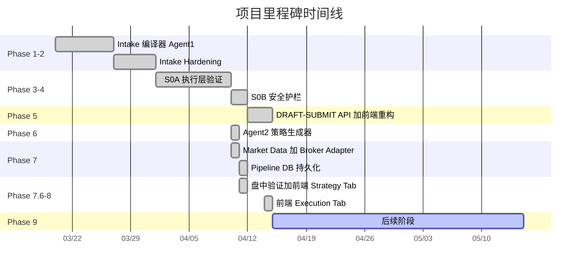

<!-- PAGE_ID: options_09_roadmap -->

Relevant source files

The following files were used as context for generating this wiki page:

- [task_plan.md:1-183](https://github.com/ChunmiaoYu/options_ai_trader/blob/f5f3ac84e9c5d963fc1450f12306ea264183dfad/task_plan.md#L1-L183)
- [CLAUDE.md:1-100](https://github.com/ChunmiaoYu/options_ai_trader/blob/f5f3ac84e9c5d963fc1450f12306ea264183dfad/CLAUDE.md#L1-L100)
- [2026-04-10-agent2-strategy-generator-design.md:1-80](https://github.com/ChunmiaoYu/options_ai_trader/blob/f5f3ac84e9c5d963fc1450f12306ea264183dfad/docs/superpowers/specs/2026-04-10-agent2-strategy-generator-design.md#L1-L80)
- [2026-04-10-market-data-collector-broker-adapter-design.md:1-80](https://github.com/ChunmiaoYu/options_ai_trader/blob/f5f3ac84e9c5d963fc1450f12306ea264183dfad/docs/superpowers/specs/2026-04-10-market-data-collector-broker-adapter-design.md#L1-L80)
- [2026-04-10-pipeline-db-persistence-design.md:1-80](https://github.com/ChunmiaoYu/options_ai_trader/blob/f5f3ac84e9c5d963fc1450f12306ea264183dfad/docs/superpowers/specs/2026-04-10-pipeline-db-persistence-design.md#L1-L80)
- [2026-04-11-strategy-tab-timeline-design.md:1-80](https://github.com/ChunmiaoYu/options_ai_trader/blob/f5f3ac84e9c5d963fc1450f12306ea264183dfad/docs/superpowers/specs/2026-04-11-strategy-tab-timeline-design.md#L1-L80)

# 未来方向与设计决策

> **Related Pages**: [[项目概述|01_overview.md]]

---

<!-- BEGIN:AUTOGEN options_09_roadmap_milestones -->
## 已完成里程碑

项目从 Phase 1 到 Phase 8 均已完成，覆盖了从自然语言解析到前端执行展示的完整链路。全量测试 171+ 通过（[task_plan.md:1-171](https://github.com/ChunmiaoYu/options_ai_trader/blob/f5f3ac84e9c5d963fc1450f12306ea264183dfad/task_plan.md#L1-L171)）。

### 各阶段关键成果

| 阶段 | 核心产出 | 测试数 |
|------|----------|--------|
| Phase 1: Intake 编译器 | 7 节点 LangGraph 工作流 + OpenAI Structured Outputs（22 字段） + 17 张 DB 表 + Worker 骨架 ([task_plan.md:8-18](https://github.com/ChunmiaoYu/options_ai_trader/blob/f5f3ac84e9c5d963fc1450f12306ea264183dfad/task_plan.md#L8-L18)) | 29 |
| Phase 2: Intake Hardening | 歧义规则化 + submit_blockers contract + 时间改写检测 + 4 个 OpenAI E2E 验证 ([task_plan.md:22-33](https://github.com/ChunmiaoYu/options_ai_trader/blob/f5f3ac84e9c5d963fc1450f12306ea264183dfad/task_plan.md#L22-L33)) | 29 |
| Phase 3: S0A 执行层验证 | IBKR 股价/期权链/Greeks 探测 + Paper 下单验证 + streaming 模式修复 ([task_plan.md:36-48](https://github.com/ChunmiaoYu/options_ai_trader/blob/f5f3ac84e9c5d963fc1450f12306ea264183dfad/task_plan.md#L36-L48)) | 23 |
| Phase 4: S0B 安全护栏 | dry_run/mock 开关 + MockIBKRClient + KillSwitch CLI ([task_plan.md:51-56](https://github.com/ChunmiaoYu/options_ai_trader/blob/f5f3ac84e9c5d963fc1450f12306ea264183dfad/task_plan.md#L51-L56)) | 71 |
| Phase 5: DRAFT/SUBMIT API + 前端 | 16 个生命周期字段 + DRAFT/SUBMIT 分离 + 专业金融风格前端 + Excel-like 筛选排序 ([task_plan.md:58-73](https://github.com/ChunmiaoYu/options_ai_trader/blob/f5f3ac84e9c5d963fc1450f12306ea264183dfad/task_plan.md#L58-L73)) | -- |
| Phase 6: Agent2 策略生成器 | 领域模型 + Strategy Resolver + Risk Gate + 10 种策略 system prompt ([task_plan.md:76-114](https://github.com/ChunmiaoYu/options_ai_trader/blob/f5f3ac84e9c5d963fc1450f12306ea264183dfad/task_plan.md#L76-L114)) | 125 |
| Phase 7: Market Data + Broker | 并行批量采集 + 6 步 Pipeline 编排 + BAG 组合订单 ([task_plan.md:116-127](https://github.com/ChunmiaoYu/options_ai_trader/blob/f5f3ac84e9c5d963fc1450f12306ea264183dfad/task_plan.md#L116-L127)) | 163 |
| Phase 7.5: Pipeline DB 持久化 | StrategyRun 4 个 JSONB 字段 + AuditEvent 时间线 + Opportunity 状态联动 ([task_plan.md:128-137](https://github.com/ChunmiaoYu/options_ai_trader/blob/f5f3ac84e9c5d963fc1450f12306ea264183dfad/task_plan.md#L128-L137)) | 170 |
| Phase 7.6: 盘中验证 + 前端 | 单腿/多腿 Paper 下单验证 + Strategy Tab + Pipeline Timeline ([task_plan.md:139-162](https://github.com/ChunmiaoYu/options_ai_trader/blob/f5f3ac84e9c5d963fc1450f12306ea264183dfad/task_plan.md#L139-L162)) | 171 |
| Phase 8: 前端 Execution Tab | 执行状态概览 + 订单明细 + 修改来源链接 + 执行时间线 + 历史运行 ([task_plan.md:164-171](https://github.com/ChunmiaoYu/options_ai_trader/blob/f5f3ac84e9c5d963fc1450f12306ea264183dfad/task_plan.md#L164-L171)) | 158 |

Sources: [task_plan.md:1-183](https://github.com/ChunmiaoYu/options_ai_trader/blob/f5f3ac84e9c5d963fc1450f12306ea264183dfad/task_plan.md#L1-L183)
<!-- END:AUTOGEN options_09_roadmap_milestones -->

---

<!-- BEGIN:AUTOGEN options_09_roadmap_todo -->
## 待办事项

以下功能在 Phase 9 中列出但尚未启动（[task_plan.md:173-183](https://github.com/ChunmiaoYu/options_ai_trader/blob/f5f3ac84e9c5d963fc1450f12306ea264183dfad/task_plan.md#L173-L183)）：

### 交易执行增强

| 待办项 | 优先级 | 说明 |
|--------|--------|------|
| 止盈/止损执行联动 | 高 | MonitorConfig 已有 schema 定义，但尚未与实际交易执行联动 |
| 手动平仓同步 | 高 | Worker 需轮询 IBKR 持仓变化，同步手动在 TWS 中进行的平仓操作 |
| 复杂部分成交重试/重新定价 | 中 | 当前仅支持 `CANCEL_REMAINDER` 策略，复杂情况（如多腿部分成交）需重新定价 |
| 请求限流 | 中 | IBKR API 限制约 50 msg/s，当前未实现客户端限流 |

### 数据与分析

| 待办项 | 优先级 | 说明 |
|--------|--------|------|
| `iv_percentile_30d` 计算 | 中 | 需要本地 IV 历史缓存（30 天），当前 MarketContext 中该字段为 `None` |
| Option chain 监控与重放 | 低 | 记录期权链快照用于回测分析 |
| 外部数据源 | 低 | 财报日期、VIX 指数、新闻等外部数据接入 |

### 基础设施

| 待办项 | 优先级 | 说明 |
|--------|--------|------|
| 云端部署 | 高 | Azure VM + systemd 部署方案 |

### 已知缺陷

以下为 CLAUDE.md 中记录的已知问题（[CLAUDE.md:78-82](https://github.com/ChunmiaoYu/options_ai_trader/blob/f5f3ac84e9c5d963fc1450f12306ea264183dfad/CLAUDE.md#L78-L82)）：

1. **LLM 输出不稳定** -- Agent1 的 planner 层持续兜底处理 LLM 产生的异常输出
2. **business_lexicon 仅 4 条词条** -- 歧义短语词典覆盖面有限
3. **runtime_planner 对时间是字符串匹配** -- 不做自然语言理解（NLU），依赖模式匹配

Sources: [task_plan.md:173-183](https://github.com/ChunmiaoYu/options_ai_trader/blob/f5f3ac84e9c5d963fc1450f12306ea264183dfad/task_plan.md#L173-L183), [CLAUDE.md:78-82](https://github.com/ChunmiaoYu/options_ai_trader/blob/f5f3ac84e9c5d963fc1450f12306ea264183dfad/CLAUDE.md#L78-L82)
<!-- END:AUTOGEN options_09_roadmap_todo -->

---

<!-- BEGIN:AUTOGEN options_09_roadmap_decisions -->
## 关键设计决策

以下设计决策在项目演进中做出并记录在设计文档中。

### 1. 只保留两个 AI Agent

系统仅使用 Agent1（Intake）和 Agent2（Strategy）两个 AI Agent，Risk Gate、数据采集、订单执行均为确定性代码。AI 是"策略顾问"，不是"计算器"——AI 决定策略类型和理由，具体的 strike 选择、数量计算、盈亏计算由服务器编译器完成（[2026-04-10-agent2-strategy-generator-design.md:13-17](https://github.com/ChunmiaoYu/options_ai_trader/blob/f5f3ac84e9c5d963fc1450f12306ea264183dfad/docs/superpowers/specs/2026-04-10-agent2-strategy-generator-design.md#L13-L17)）。

### 2. AI 不直接看原始期权链数据

Agent2 接收的是服务器编译器预处理后的 MarketContext（约 600-800 tokens 的汇总指标），不直接处理原始的期权链数据。这确保了响应速度（2-3 秒）并防止 AI 幻觉价格（[2026-04-10-agent2-strategy-generator-design.md:15](https://github.com/ChunmiaoYu/options_ai_trader/blob/f5f3ac84e9c5d963fc1450f12306ea264183dfad/docs/superpowers/specs/2026-04-10-agent2-strategy-generator-design.md#L15)）。

### 3. parse 不等于 submit（DRAFT/SUBMIT 分离）

解析不创建 trigger/task，必须经过明确的 DRAFT 和 SUBMIT 两个步骤。用户可以在解析后审查结果、编辑草稿，确认无误后再提交（[CLAUDE.md:52](https://github.com/ChunmiaoYu/options_ai_trader/blob/f5f3ac84e9c5d963fc1450f12306ea264183dfad/CLAUDE.md#L52)）。

### 4. BAG 组合订单替代逐腿下单

多腿期权策略使用 IBKR 的 BAG（Combo）订单类型原子提交，替代早期的逐腿下单方案。逐腿下单存在部分腿成交后市场变动的风险，BAG 订单确保所有腿同时执行（[task_plan.md:154](https://github.com/ChunmiaoYu/options_ai_trader/blob/f5f3ac84e9c5d963fc1450f12306ea264183dfad/task_plan.md#L154)）。

### 5. 自动选择 rank=1 方案，不等待用户确认

由于期权交易时间敏感，系统在 AI 生成 2-3 个方案后自动选择 rank=1 的方案执行，不等待用户手动选择。价格在下单时会重新刷新。其他方案仍保留在 `ai_proposals_json` 中供事后审计（[2026-04-10-market-data-collector-broker-adapter-design.md:24](https://github.com/ChunmiaoYu/options_ai_trader/blob/f5f3ac84e9c5d963fc1450f12306ea264183dfad/docs/superpowers/specs/2026-04-10-market-data-collector-broker-adapter-design.md#L24)）。

### 6. 同步 Pipeline，不用消息队列

系统采用同步 Pipeline 架构（在 Worker 进程内顺序执行），不引入 Kafka/Redis/Celery 等消息队列。原因是系统频率低（约 50 次/天），不需要消息队列的复杂性（[2026-04-10-market-data-collector-broker-adapter-design.md:28](https://github.com/ChunmiaoYu/options_ai_trader/blob/f5f3ac84e9c5d963fc1450f12306ea264183dfad/docs/superpowers/specs/2026-04-10-market-data-collector-broker-adapter-design.md#L28)）。

### 7. StrategyRun 复用 + JSONB 扩展

Pipeline 的每步结果存储在 StrategyRun 表的 4 个 JSONB 字段中（`market_context_json`、`ai_proposals_json`、`selected_proposal_json`、`risk_gate_result_json`），复用已有的 `run_status` 字符串字段扩展状态值，避免新建表。时间线事件复用 AuditEvent 表（[2026-04-10-pipeline-db-persistence-design.md:23-48](https://github.com/ChunmiaoYu/options_ai_trader/blob/f5f3ac84e9c5d963fc1450f12306ea264183dfad/docs/superpowers/specs/2026-04-10-pipeline-db-persistence-design.md#L23-L48)）。

### 8. 前端 Strategy Tab 采用列表式布局

选中方案展开显示完整详情（腿明细 + 指标网格 + AI 理由），其他方案折叠显示一行摘要。这种布局兼顾层次清晰和节省空间（[2026-04-11-strategy-tab-timeline-design.md:15](https://github.com/ChunmiaoYu/options_ai_trader/blob/f5f3ac84e9c5d963fc1450f12306ea264183dfad/docs/superpowers/specs/2026-04-11-strategy-tab-timeline-design.md#L15)）。

### 9. 修改等于取消加复制

机会单修改采用"取消原单 + 创建复制单"模式，嵌套编号追溯修改链（如 #5 -> #5.1 -> #5.1.1）。通过 `root_opportunity_id`、`parent_opportunity_id`、`revision_path` 三个字段支持完整的修改历史追溯。

### 10. 方案变体 B-plus

保留 PostgreSQL 作为唯一数据库，不退回 SQLite。这保证了 JSONB 字段、并发安全、以及与云端部署方案的一致性。

Sources: [2026-04-10-agent2-strategy-generator-design.md:10-18](https://github.com/ChunmiaoYu/options_ai_trader/blob/f5f3ac84e9c5d963fc1450f12306ea264183dfad/docs/superpowers/specs/2026-04-10-agent2-strategy-generator-design.md#L10-L18), [2026-04-10-market-data-collector-broker-adapter-design.md:18-28](https://github.com/ChunmiaoYu/options_ai_trader/blob/f5f3ac84e9c5d963fc1450f12306ea264183dfad/docs/superpowers/specs/2026-04-10-market-data-collector-broker-adapter-design.md#L18-L28), [2026-04-10-pipeline-db-persistence-design.md:17-48](https://github.com/ChunmiaoYu/options_ai_trader/blob/f5f3ac84e9c5d963fc1450f12306ea264183dfad/docs/superpowers/specs/2026-04-10-pipeline-db-persistence-design.md#L17-L48)
<!-- END:AUTOGEN options_09_roadmap_decisions -->

---

<!-- BEGIN:AUTOGEN options_09_roadmap_business-rules -->
## 业务规则不变量

以下 15 条 invariant 约定定义了系统的核心业务规则，任何修改都不得违反（[CLAUDE.md:49-69](https://github.com/ChunmiaoYu/options_ai_trader/blob/f5f3ac84e9c5d963fc1450f12306ea264183dfad/CLAUDE.md#L49-L69)）。

| # | 规则 | 说明 |
|---|------|------|
| 1 | **Agent1 输出是声明式可编译 JSON** | 不是运行时状态，不混入命令式逻辑 |
| 2 | **parse 不等于 submit** | 解析不创建 trigger/task，必须 DRAFT/SUBMIT 分离 |
| 3 | **submit_blockers_zh 是硬阻断** | `can_submit_as_is=False` 时 `submit_blockers_zh` 必不为空 |
| 4 | **direction 只允许 BULLISH/BEARISH** | 其他值在 enrich_draft 中标准化 |
| 5 | **effective_mode 忠实保留用户请求** | 基础设施未就绪给 warning 不降级 |
| 6 | **suitability_gate 仅在用户表达前提条件时触发** | 风格偏好不触发 |
| 7 | **时间表达不可静默改写** | LLM 输出非原文子串时产生 submit_blocker |
| 8 | **REQUIRE_CLARIFICATION 词典 trigger_defaults 优先于 LLM** | 只清空混淆值 |
| 9 | **event_window 不等于 entry_window** | 事件窗口是背景，入场窗口是触发条件 |
| 10 | **只保留两个 AI Agent** | Agent1=Intake，Agent2=Strategy。Risk Gate 是确定性代码 |
| 11 | **主队列只显示大状态** | 小状态仅详情页。Timeline 只显示业务事件 |
| 12 | **前端面向中国客户** | 所有客户可见内容必须中文 |
| 13 | **修改等于取消加复制** | 嵌套编号（#5 -> #5.1 -> #5.1.1） |
| 14 | **执行层必须支持 dry-run 和 mock 模式** | 通过 `IBKR_DRY_RUN` 和 `IBKR_MOCK` 开关控制 |
| 15 | **时间默认美东（ET）** | 所有时间表达以美国东部时间为准 |

### 规则间的关系

这些规则构成三个核心约束群：

**数据完整性（规则 1, 2, 3, 7, 8）** -- 确保从用户输入到系统存储的数据不会被静默修改或遗漏。Agent1 输出是声明式数据结构，解析与提交严格分离，阻断项不可为空，时间表达不可改写。

**架构边界（规则 4, 5, 6, 9, 10）** -- 限定各组件的职责边界。方向只允许两个值，用户模式不降级，适用性检查有明确触发条件，事件窗口和入场窗口概念不混淆，AI Agent 数量固定为两个。

**用户体验（规则 11, 12, 13, 14, 15）** -- 定义面向用户的行为规范。队列简化展示，前端全中文，修改可追溯，执行安全可控，时间表达统一。

Sources: [CLAUDE.md:49-69](https://github.com/ChunmiaoYu/options_ai_trader/blob/f5f3ac84e9c5d963fc1450f12306ea264183dfad/CLAUDE.md#L49-L69)
<!-- END:AUTOGEN options_09_roadmap_business-rules -->

---
