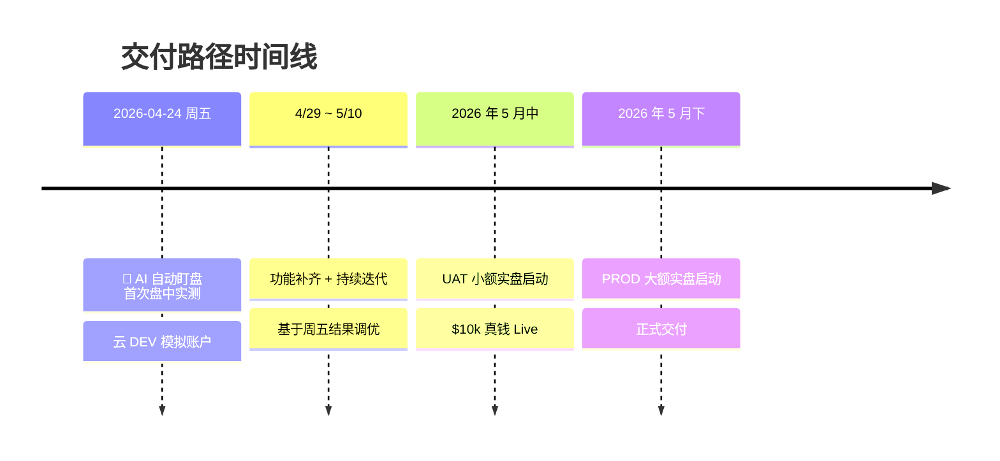

# :material-archive: 看板快照 · 2026-04-22

> 这是项目看板在 **2026-04-22** 的状态归档。最新版请看 [:material-arrow-right: 客户看板](../dashboard/)。

---

## :material-target: 当前状态

  

  整体进度 · 90%

:material-rocket-launch:

下一节点 · 2026-04-24 (周五, 美股交易日)

AI 自动盯盘首次盘中实测

环境: [云 DEV]{.badge .badge-dev} [模拟账户 Paper]{.badge .badge-paper}

系统核心功能已建完。本周完成最后一个大方向的设计,周五上模拟账户首次实盘验证 **AI 自动盯盘** 这个核心能力。

---

## :material-alert-circle: 本周待处理

!!! warning "IBKR API 专用账号 · 审核中"
    已发起申请, 预计 **4/25 - 4/29** 下来。这是切 UAT 真钱实盘的前置条件, 到账后会立即通知。

---

## :material-calendar-check: 最近 1.5 周进展 (4/11 - 4/22)

-   :material-star-circle: &nbsp; __AI 下单后自己盯盘__ · [本期重点]{.badge .badge-star}

    ---

    **以前**: AI 选策略 → 人工确认 → 下单 → 结束

    **今后**: AI 下单后每 5 分钟自主看盘, 决定:

    - 继续持有
    - 部分平仓
    - 全部平仓
    - 调整止损位

    *不用手动盯盘, 关键时点 AI 主动出手, 止损也能自动走完不漏*

-   :material-speedometer: &nbsp; __系统反馈逻辑更清晰__

    ---

    **以前**: 三档 "完全支持 / 仅建议 / 部分支持" 容易混淆

    **现在**: 两档 [能做]{.badge .badge-done} [暂时做不了]{.badge .badge-wait}

    *一眼看懂*

-   :material-message-text-outline: &nbsp; __复杂中文指令识别更稳__

    ---

    像 *"NVDA 财报那天涨破 \$900 就买 call, 涨一倍平仓, 跌到 \$850 止损"* 这种复合指令

    现在能稳定识别 **每一个细节**:

    - 入场条件
    - 止盈
    - 止损

-   :material-check-decagram: &nbsp; __盘中实盘已通过测试__

    ---

    4 月 17 日在 [模拟账户]{.badge .badge-paper} 完成真实下单全流程测试

    发现并修复了 **10 多个边界问题**, 为上 UAT 实盘铺好路

---

## :material-map-marker-path: 未来计划

| 时间 | 动作 | 环境 |
|------|------|------|
| **2026-04-24** (周五) | AI 自动盯盘首次盘中实测 | [云 DEV Paper]{.badge .badge-dev} |
| **4/29 - 5/10** | 功能补齐 + 持续迭代 | [云 DEV Paper]{.badge .badge-dev} |
| **2026 年 5 月中** | UAT 小额实盘启动 | [UAT Live]{.badge .badge-uat} |
| **2026 年 5 月下** | PROD 大额实盘启动 | [PROD Live]{.badge .badge-prod} |

---

## :material-note-text: 本次更新说明

**v1.0 → v2.0 架构升级**: 客户协作系统从"周报 + 6 Sheet 表格"模式切换到"单文档 Dashboard + Material 深度美化"模式。原 6 Sheet 架构废弃,客户不再看技术表格,只看一份漂亮看板。
