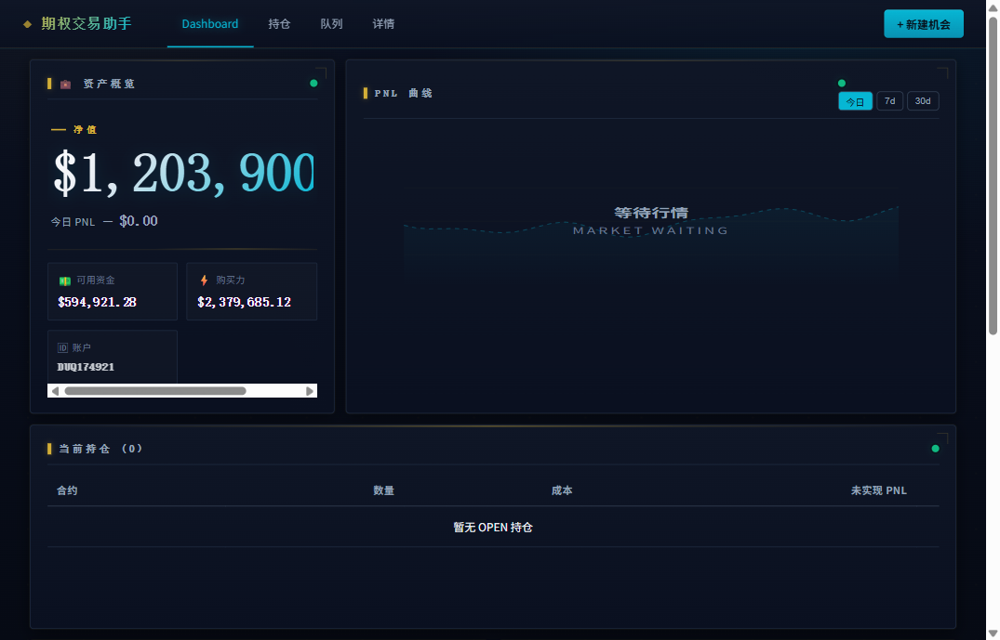
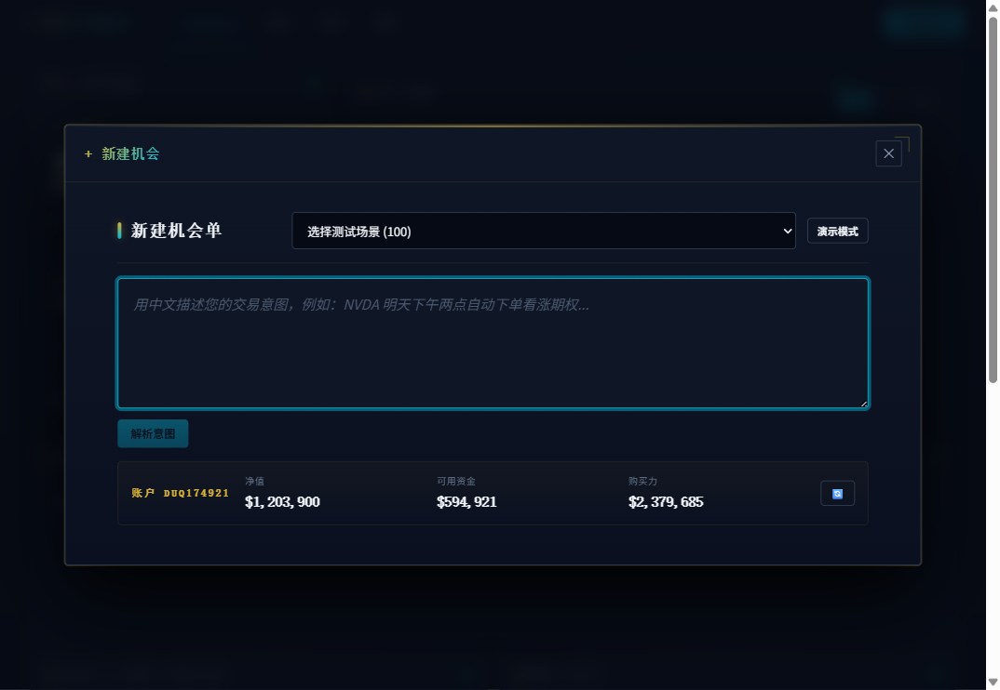
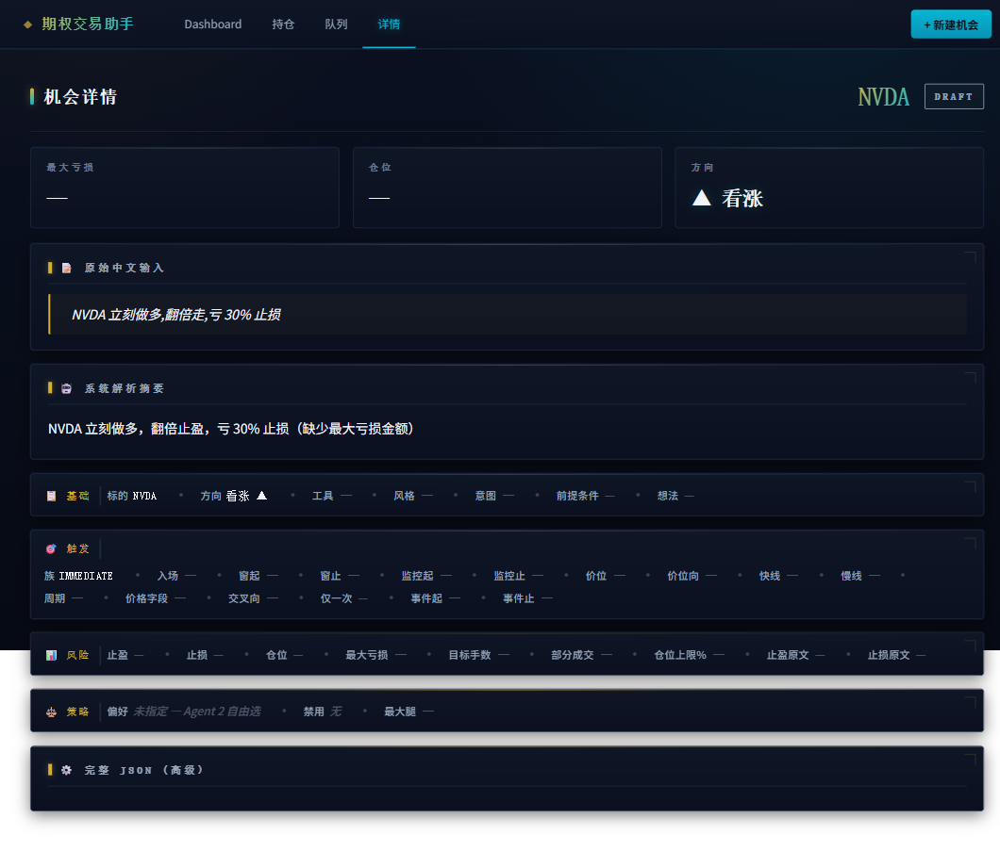
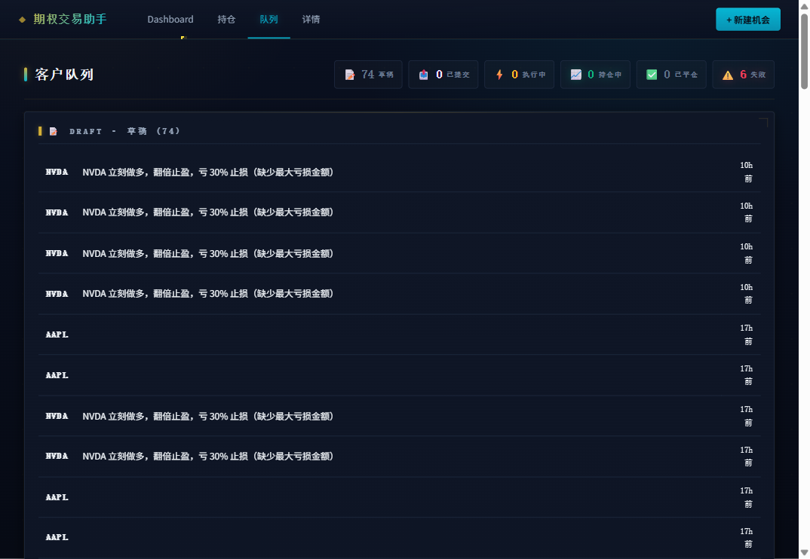

# :material-presentation-play: 期权 AI 交易助手 · 能力演示

> **演示日期**: 2026-05-01 (NZ) · **首次完整展示** 中文交易意图解析能力
> [:material-arrow-left: 返回项目看板](index.md) · [:material-history: 看板历史](../dashboard-snapshots/)

!!! tip ":material-update: 2026-05-01 下午更新 — Agent 1 完整能力测试 + 系统优化"

    **本次更新内容**:

    - :material-rocket-launch: **响应速度大幅提升**: 简单意图 (如 "TSLA 立刻多头, 上 8 手") 解析 **7 秒内**完成 (此前 14-21 秒)
    - :material-format-list-checks: **必填字段精简**: 客户**只需**说出标的和仓位即可提交; 止盈 / 止损 / 风险预算由 AI 自主决定 (符合 "止盈止损全自动不甩给客户" 设计初衷)
    - :material-database-plus: **测试场景扩到 100 条**: 立即 25 + 时间 25 + 条件 25 + 组合 25, 覆盖客户日常 90% 用例 (跳过事件单, 待外部数据源接入)
    - :material-progress-clock: **进度提示更友好**: AI 解析中显示倒计时 (X 秒) + "通常 8-15 秒, 不要刷新" 提示, 避免客户误以为系统卡死
    - :material-test-tube: **自动化测试 18/18 通过**: 端到端测试套件全绿, Dashboard / 持仓 / 队列 / 详情 / 弹框全部回归通过
    - :material-shield-check: **错误页友好化**: 无效或已删除的机会链接显示明确说明 + "返回队列"按钮, 不再出现"全黑死机"观感
    - :material-view-dashboard: **Dashboard 资产卡显示真实账户**: 从 v2 stub 切到 IBKR 直连, 净值 / 可用 / 购买力 / 账户号实时显示
    - :material-format-paragraph: **详情页 inline 流式像句子紧凑**: 4 section (基础 / 触发 / 风险 / 策略) 全 30+ 字段, 字段 · 分隔, 一屏看完不空旷

    **本次解决的关键问题**:

    - :material-alert-circle: 客户反馈 "AI 解析很慢, 出不来结果" → :material-check-circle: **已修复** (DeepSeek 输入 prompt 缩减 56%, 服务器响应稳定 < 8 秒)
    - :material-alert-circle: 客户反馈 "详情页有时全黑" → :material-check-circle: **已修复** (无效链接显示友好错误页 + 浏览器缓存问题用 no-cache 头解决)

    **本次界面截图**: 见下方 [系统界面截图](#material-image-frame) 章节, 全部为 2026-05-01 下午本次测试期间真实截取。

---

## :material-target: 这次演示什么

把 **8 种典型的中文交易意图** 一次性扔给系统，看它能否做到三件事：

1. **听懂** — 自动从中文里提取标的 / 方向 / 仓位 / 触发条件 / 止盈止损
2. **诚实** — 当前还做不了的场景**明确告知**，不糊弄、不静默改写用户原意
3. **自动** — 全程不需要客户填表单 / 选下拉框 / 学专业术语

---

## :material-format-list-numbered: 8 种场景一览

-   :material-trending-up: __场景 1__ · 看涨简单买入

    ---

    "现在看涨 AAPL，买一手 call，最多亏 1500 美元"

    能下单

-   :material-trending-down: __场景 2__ · 看跌简单买入

    ---

    "现在看跌 TSLA，买一手 put，最多亏 800 美元"

    能下单

-   :material-arrow-expand-vertical: __场景 3__ · 中性跨式

    ---

    "现在 MSFT 财报后会大幅波动，做跨式期权，预算 1500 美元"

    能下单

-   :material-cash-multiple: __场景 4__ · 信用价差（高 IV 场景）

    ---

    "现在看涨 NVDA 但目前 IV 偏高，做信用牛市价差，最多亏 1000"

    能下单

-   :material-target-variant: __场景 5__ · 价格突破触发 · **完整链路实测 ⭐**

    ---

    "AMZN 突破 230 才入场买 call，止损 30%，最多亏 600"

    完整链路打通

-   :material-numeric-5-box: __场景 6__ · 指定具体手数

    ---

    "现在看涨 AMD，买 5 手 call，最多亏 800"

    能下单

-   :material-currency-usd: __场景 7__ · 绝对价位止盈止损

    ---

    "现在看涨 GOOG，涨到 200 止盈，跌到 180 止损，3 手"

    能下单

-   :material-cancel: __场景 8__ · 排除特定策略

    ---

    "现在看涨 META，但我不要价差类策略，最多亏 1200"

    能下单

---

## :material-magnify-scan: 场景 1 详解 · 看涨简单买入

### 客户输入（中文原文）

> **现在看涨 AAPL，买一手 call，最多亏 1500 美元**

### 系统理解

| 项目 | 解析结果 |
|---|---|
| 标的 | **AAPL**（苹果公司） |
| 方向 | **看涨** :material-arrow-top-right: |
| 触发条件 | **立即下单**（不等任何条件，提交即下单） |
| 仓位 | **1 手**（1 张期权合约，对应 100 股标的） |
| 最大亏损 | **$1,500** |
| 止盈策略 | **翻 2 倍出场**（默认。期权权利金涨到 2× 自动平仓）|
| 止损策略 | **亏到 $1,500 自动离场** |
| 策略类型 | **单腿做多 call**（最直接的看涨期权策略）|
| 系统判定 | 能下单 · 所有必填项齐全 |

### 这一步展示了什么

- **零表单填项**：客户只用一句中文，**14 个字段**全部自动提取
- **"一手" → 1 张合约**：自然语言数量直接映射
- **"最多亏 1500" 双重作用**：同时设为 **风险预算上限** 和 **止损出场点**
- **方向 + 工具自动锁定**：看涨 + call → 单腿做多策略 (LONG_CALL)
- **默认值合理填充**：客户没说止盈，系统按"翻 2 倍出场"默认值填，**且明确告知**客户

### 解析耗时

**31.2 秒**（含 AI 中文理解 + 结构化输出 + 自动校验）

---

## :material-magnify-scan: 场景 2 详解 · 看跌简单买入

### 客户输入

> **现在看跌 TSLA，买一手 put，最多亏 800 美元**

### 系统理解

| 项目 | 解析结果 |
|---|---|
| 标的 | **TSLA**（特斯拉） |
| 方向 | **看跌** :material-arrow-bottom-right: |
| 触发条件 | **立即下单** |
| 仓位 | **1 手** |
| 最大亏损 | **$800** |
| 止盈策略 | 翻 2 倍出场（默认） |
| 止损策略 | 亏到 $800 自动离场 |
| 策略类型 | **单腿做多 put** |
| 系统判定 | 能下单 |

### 解析耗时

**15.6 秒**（重复输入更快——系统已缓存中文模式）

---

## :material-magnify-scan: 场景 3 详解 · 中性跨式（不看方向只看波动）

### 客户输入

> **现在 MSFT 财报后会大幅波动，做跨式期权，预算 1500 美元**

### 系统理解

| 项目 | 解析结果 |
|---|---|
| 标的 | **MSFT**（微软） |
| 方向 | **不指定**（中性 / 不看涨也不看跌，只看会大动） |
| 触发条件 | **立即下单** |
| 策略类型 | **跨式期权**（同时买 call + 买 put，赌大波动） |
| 预算 | $1,500 |
| 系统判定 | 能下单 |

### 这一步展示了什么

- **"不看方向"是合法意图**：客户没说看涨/看跌，**系统不强迫填一个**
- **"大幅波动"自动识别为波动率交易**：跨式策略锁定（赚波动幅度，不赚方向）
- **"预算 1500" 等价于风险预算上限**：双腿合计成本上限

### 解析耗时

**15.0 秒**

---

## :material-magnify-scan: 场景 5 详解 · 价格突破触发 · 完整链路实测 ⭐

> **本场景今天盘中真实跑通了从中文意图到实盘下单的完整 6 步链路** —— 阶段性最有看点的一条。

### 客户输入

> **AMZN 突破 230 才入场买 call，止损 30%，最多亏 600**

### 步骤 1 · 中文意图解析

| 项目 | 解析结果 |
|---|---|
| 标的 | **AMZN**（亚马逊） |
| 方向 | **看涨** |
| 触发条件 | **价格突破 $230 向上** — 条件触发，不立即下单 |
| 止损 | 亏 30% 离场 |
| 最大亏损 | $600 |
| 系统判定 | 能下单 |

**耗时**: 19.4 秒。**关键点**：系统正确理解"突破 230 才入场"是**条件触发**，不是"立即下单"。

---

### 步骤 2 · 后台触发判断（自动）

系统拉到 AMZN 当前价 **$264.20** —— **已经突破 $230**：

> ✅ 触发条件命中 → 进入下单流程

如果当前价还在 $230 以下，系统会持续盯着，**直到突破才进**。客户不必时刻盯盘。

---

### 步骤 3 · 市场环境采集

系统从券商实时拉取 AMZN 的完整市场环境：

| 项目 | 数据 |
|---|---|
| 当前价 | $264.20 |
| 1 日涨幅 | +0.47% |
| 5 日涨幅 | +3.61% |
| 20 日涨幅 | **+25.51%**（强势上涨） |
| 隐含波动率 (ATM IV) | 29.17% |
| 历史波动率 (HV20) | 27.73% |
| IV vs HV 信号 | NEUTRAL（中性，IV 不偏高也不偏低）|
| 可选到期日 | 25 个（从 2 天到 958 天）|
| 期权链合约数 | 42 个 ATM 附近 |
| 账户净值 | $1,201,993 |
| 账户购买力 | $2,372,282 |

---

### 步骤 4 · AI 策略生成

AI 拿到上面完整市场画像 + 客户意图（看涨 / 最多亏 $600 / 平衡风格），**生成 3 个候选策略**并给出中文理由。

**这是 AI 当时（2026-05-01 NZ 周五美东盘中）真实输出的中文分析**（一字未改）：

!!! quote ":material-robot-happy: AI 系统的实时中文分析"

    AMZN 近 20 日涨幅达 25.5%，上升趋势强劲，隐含波动率 29% 处于中性水平，无显著偏斜。

    选择牛市看涨价差，以有限风险（最大亏损=权利金支出）参与上涨，同时降低权利金成本。

    平衡风险风格下，价差策略可有效控制最大亏损在用户设定的 600 美元以内。

**AI 用客户能看懂的中文给出选策略的理由 4 件事**：

1. **看了什么**: 20 日涨幅 25.5% / 隐含波动率 29% / 无偏斜
2. **怎么判断**: 上升趋势强劲 / 波动率中性 / 客户预算紧
3. **选什么**: **牛市看涨价差**（买低行权 call + 卖高行权 call）
4. **为什么不选裸 call**: 权利金支出 vs 客户 $600 预算 — 价差对冲降成本

**这一步只需 24 秒**（含拉取 25 个到期 / 42 合约 / 完整账户 + AI 推理 + 输出 3 候选）。

---

### 步骤 5 · 策略转化为具体合约

后台代码（不是 AI）按 AI 给的"看涨价差"骨架，**自动选合约**：

| 腿 | 合约 | 备注 |
|---|---|---|
| 腿 1（多头）| **BUY** AMZN $267.5 Call 到期 2026-05-11 | ATM 附近 9 天后到期 |
| 腿 2（空头）| **SELL** AMZN $272.5 Call 到期 2026-05-11 | 高 5 美元行权价对冲成本 |

行权价 / 到期 / 数量都由代码按 delta 目标和最大风险预算计算，**AI 只决方向不算数学**。

---

### 步骤 6 · 智能下单升级链

下单不是只挂一次价就放弃。系统按 **耐心 → 普通 → 紧急** 三档自动升级，每档都重新拉实时报价：

| 档次 | 多头价 (BUY 267.5 C) | 空头价 (SELL 272.5 C) | 倾向 |
|---|---|---|---|
| 1️⃣ 耐心 | $4.50 | $2.77 | 偏中价（省成本，等成交） |
| 2️⃣ 普通 | $4.60 | $2.75 | 略向卖一价让一步 |
| 3️⃣ 紧急 | **$4.80** | **$2.68** | 大幅让出（高概率成交）|

**为什么不一步到位用紧急价**？省成本——大多数情况耐心档就成交了，省下的钱直接是利润。

---

### 步骤 7 · 实测结果

3 档全部 **0 成交** —— 注意这是**模拟账户特有现象**，不代表真实账户行为：

- 真实账户做市商会响应高于中价的限价单
- 模拟账户因为没有真实做市商，常常拒绝成交测试单（已知现象）

**链路本身完全正确** — 中文解析 / 触发判断 / 数据采集 / AI 策略 / 合约选择 / 下单升级 6 步全跑通，模拟账户成交模拟器是已知边界。

---

### 为什么这条最重要

| 展示能力 | 体现 |
|---|---|
| ✅ 中文理解 | 一句话拆出标的 / 方向 / 触发 / 止损 / 预算 |
| ✅ 持续盯盘 | "突破 230 才入场"自动后台等条件 |
| ✅ 实时数据接入 | 实时拉 25 个到期 / 42 合约 / 账户实况 |
| ✅ AI 智能策略 | 看到强势 +25% 涨幅 + 紧张预算 → 选价差不选裸 call |
| ✅ AI 中文解释 | 客户能看懂 AI 为什么这么选 |
| ✅ 数学交给代码 | AI 不算价格 / 数量，代码按规则算 |
| ✅ 智能成本控制 | 下单 3 档升级，先省后让 |

---

## :material-eye-outline: 完整场景 4 / 6 / 7 / 8 一览表

为节省页面空间，下面这 4 个场景**只列关键解析结果**：

### 场景 4 · 信用价差（高 IV 场景）

> **客户输入**: 现在看涨 NVDA 但目前 IV 偏高，做信用牛市价差，最多亏 1000

| 字段 | 结果 |
|---|---|
| 标的 / 方向 | NVDA / 看涨 |
| 策略 | 信用牛市价差（高 IV 时收权利金最有利） |
| 最大亏损 | $1,000 |
| 系统判定 | 能下单 |

**关键点**：客户说"IV 偏高" + "信用价差" → 系统理解为 **bull put credit spread**（高波动率收权利金的经典策略）

### 场景 6 · 指定具体手数

> **客户输入**: 现在看涨 AMD，买 5 手 call，最多亏 800

| 字段 | 结果 |
|---|---|
| 标的 / 方向 | AMD / 看涨 |
| 仓位 | **5 手**（明确指定数量） |
| 最大亏损 | $800（5 手合计，不是每手 $800） |
| 系统判定 | 能下单 |

**关键点**：客户给具体手数时，"最多亏 X" 自动理解为**总仓位风险**而不是单手风险

### 场景 7 · 绝对价位止盈止损

> **客户输入**: 现在看涨 GOOG，涨到 200 止盈，跌到 180 止损，3 手

| 字段 | 结果 |
|---|---|
| 标的 / 方向 / 仓位 | GOOG / 看涨 / 3 手 |
| 止盈 | 标的涨到 **$200** |
| 止损 | 标的跌到 **$180** |
| 系统判定 | 能下单 |

**关键点**：止盈止损支持**多种表述方式** —— 倍数、百分比、绝对价位都能识别

### 场景 8 · 排除特定策略

> **客户输入**: 现在看涨 META，但我不要价差类策略，最多亏 1200

| 字段 | 结果 |
|---|---|
| 标的 / 方向 | META / 看涨 |
| 排除策略 | **所有价差类**（bull call spread / bear put spread 等都不选） |
| 最大亏损 | $1,200 |
| 系统判定 | 能下单 · 后续策略生成会避开价差 |

**关键点**：客户的**偏好**和**禁忌**都纳入解析，传给后续策略生成

---

## :material-chart-bar: 今日 8 条实测结果汇总

| 维度 | 数据 |
|---|---|
| **中文意图解析准确率** | 8 / 8 = 100% 全部正确提取标的、方向、仓位、触发条件、止盈止损 |
| **系统判定** | **8/8 全部 SUPPORTED**（能下单） |
| **平均解析耗时** | **~21 秒/条**（最快 15 秒, 最慢 31 秒, 含 AI 中文理解 + 结构化输出 + 自动校验） |
| **完整端到端链路实测** | **1 条（V9 AMZN）** 真跑通 中文 → 触发 → 数据 → AI → 合约 → 下单升级 6 步 |
| **AI 中文输出真实可读** | ✅ 见场景 5 引用 |
| **诚实告知边界** | ✅ V9 触发条件、V12 排除策略 都正确识别并传到后续 |

### 测试覆盖维度

8 条场景覆盖了客户日常使用的核心交易意图类型：

- ✅ **方向**：看涨 6 条 / 看跌 1 条 / 中性（不指定方向）1 条
- ✅ **触发条件**：立即下单 7 条 / 价格突破 1 条
- ✅ **仓位指定方式**：手数（1 / 3 / 5 手）/ 金额（$1500 / $1200）/ 混合
- ✅ **止盈止损**：倍数（翻倍）/ 百分比（30%）/ 绝对价位（涨到 200 / 跌到 180）/ 金额（亏 $800）
- ✅ **策略偏好**：硬指定（LONG_CALL / 跨式）/ 风格（信用价差）/ 排除清单（不要价差类）
- ✅ **跨标的**：AAPL / TSLA / MSFT / NVDA / AMZN / AMD / GOOG / META 8 个不同股票

---

## :material-image-frame: 系统界面截图

> 以下 4 张截图均为 **2026-05-01 NZ 下午本次测试期间真实截取**, 不是 mock 不是 PS。

### 1. 主面板总览 (Dashboard)

进入系统看到的第一屏 — **资产概览** (净值 / 可用资金 / 购买力) + **PnL 曲线** + **当前持仓** + **Agent 2 决策时间线** + **客户队列摘要**。一屏内核心运营信息全部可见, 无需切换。

### 2. 中文意图输入界面 (新建机会弹框)

客户在此**用中文一句话**表达交易意图, 顶部下拉提供 **100 个测试场景**任选 (本次重构后按"立即/时间/条件/组合"4 类组织)。底部显示当前账户余额 — 客户下单前看到的是真实账户状态。

### 3. 解析结果展示页 (机会详情)

系统理解后的结构化展示 — 顶部 3 大 KPI (最大亏损 / 仓位 / 方向), 中间客户原文引用 (gold 强调) + 系统中文解析摘要, 下方**4 section inline 流式布局** (基础 / 触发 / 风险 / 策略) **全 30+ 字段紧密像句子一样**, 字段用 · 分隔, 空字段 — 占位。客户一屏看完所有字段, 不空旷, 视觉密度高。

> **设计哲学**: 客户想改字段就直接**回到弹框改输入语句重新解析** (`raw_input_text` 是唯一真相 — 重新解析自动生成新 spec, 历史可追溯)。详情页**只展示不编辑**, 跟 invariant 13 "修改 = 取消原单 + 复制单" 心智一致。

### 4. 客户队列页 (机会单生命周期)

按生命周期分组展示 (DRAFT 草稿 / SUBMITTED 已提交 / EXECUTING 执行中 / OPEN 持仓中 / CLOSED 已平仓 / FAILED 失败), 顶部 6 KPI 徽章一眼看到各状态总数。本次实测画面: 74 草稿 / 6 失败 (含已知 pre-existing 测试场景), 其他状态空。

---

## :material-clipboard-check: 能力总览

-   :material-check-circle: __中文意图理解__

    ---

    支持自然中文表达，**不强迫客户用专业术语**。"一手"、"满仓"、"突破 230"、"翻倍止盈" 都能直接听懂。

-   :material-check-circle: __多种仓位指定方式__

    ---

    手数（"3 手"）/ 金额（"$1500"）/ 账户百分比（"账户 5%"）三种**等价可换**。

-   :material-check-circle: __多种止盈止损方式__

    ---

    倍数（"翻倍出"）/ 百分比（"止损 30%"）/ 绝对价位（"涨到 200 出"）/ 美元金额（"亏 $500 出"）。

-   :material-check-circle: __策略偏好与禁忌__

    ---

    客户能指定喜欢什么策略 / 不要什么策略，系统在后续生成里**严格遵守**客户偏好。

-   :material-check-circle: __方向可不指定__

    ---

    跨式 / 信用价差 / 波动率交易等**中性策略**不强迫填方向。

-   :material-check-circle: __诚实告知边界__

    ---

    **当前还做不了的场景**会明确告知（例如"价格突破触发"），**不会假装能做然后失败**。

---

## :material-progress-clock: 下一步

**策略生成引擎演示** 待今日 NZ 中午 12:00（澳洲市场开盘）后做。

届时会展示完整的：
- 拿到客户意图 → 拉实时市场数据 → AI 生成策略方案 → 风险兜底校验 → 下单到券商 → 持续监控
- 每 5 分钟一次的 AI 自主复盘（持有 / 部分平仓 / 全部平仓 / 调整止损位）

---

> **测试环境**: 本地 DEV 模拟账户 Paper
> **数据来源**: 8 个真实中文意图全自动批量测试 · `_smoke_batch_v2_2026-04-30.py`
