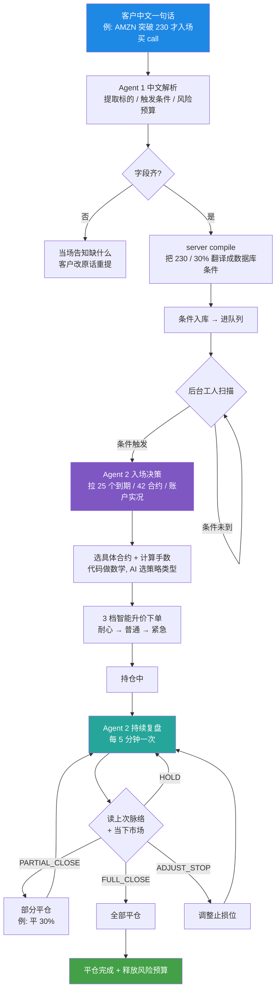
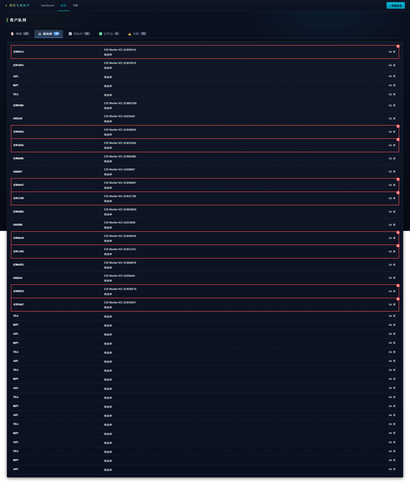
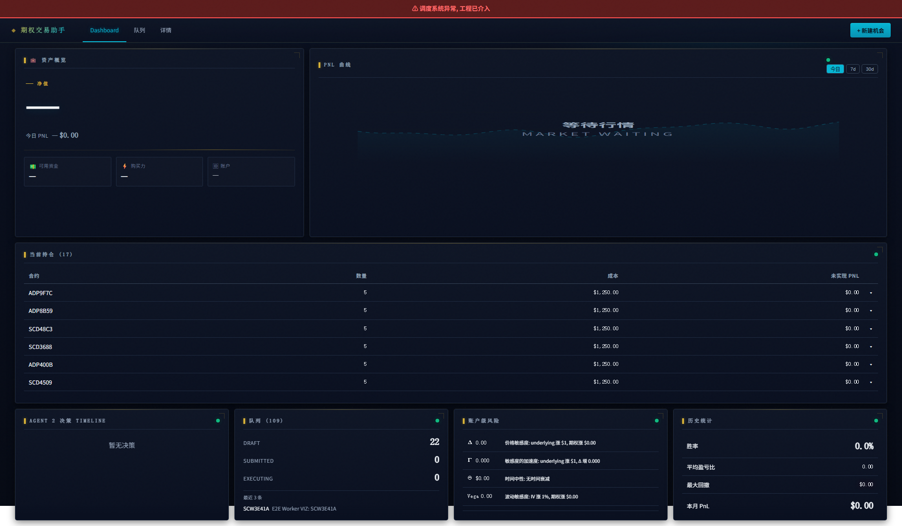
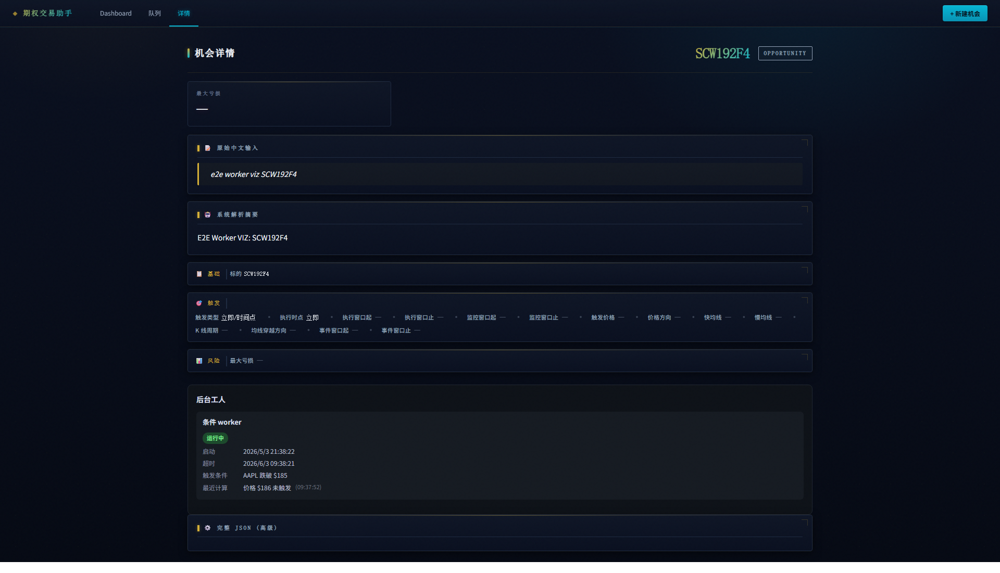
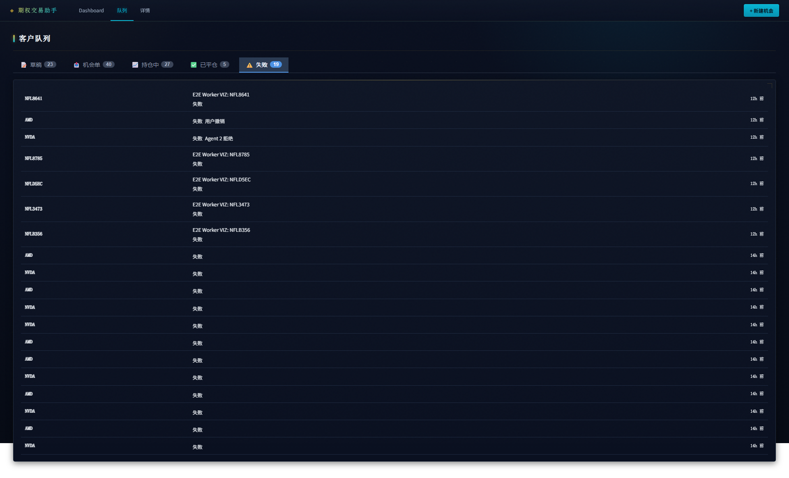

# :material-presentation-play: 期权 AI 交易助手 · 完整链路展示

> **演示日期**: 2026-05-04 (NZ) · **第二次完整展示** — 这次把 **Agent 2 (策略生成 + 持续复盘)** 也讲清楚, 加上后台工人可视化新功能。
>
> [:material-arrow-left: 返回项目看板](index.md) · [:material-history: 上一次演示 2026-05-01](agent-demo-2026-05-01.md)

---

## :material-flag-checkered: 最近 2 周交付清单 — 重点 + 难点

> 上次演示后 (2026-05-01 → 2026-05-04, 整 2 周), 系统在多条主线并行推进。下表用大白话列出**做了什么 / 为什么难 / 客户感知**。

-   :material-robot-happy: __Agent 1 (听懂意图) — 极致瘦身__

    ---

    **做了什么**: 客户**只要说出标的** (例如"AAPL") 就能提交意图; 仓位 / 止盈 / 止损 / 风险预算**全部交给 AI 自决**, 客户不必每次重复琐碎参数。

    **为什么难**: 字段越少, AI 越容易瞎猜。系统加了"矛盾智能识别" — 例如客户同时说"花 1000 美元"又说"用账户 5%", 系统会**当场告知矛盾**, 不静默选一个。

    **客户感知**: 一句话即可下单, 比上次少打 50% 字。

-   :material-eye-check: __Agent 1 — 解析卡只读__

    ---

    **做了什么**: 客户看到的 AI 解析结果是**只读展示**, 想改字段唯一办法 = **回输入框改原话重新解析**。

    **为什么难**: 让用户直接点字段修改听起来方便, 但会出现"原话和字段对不上"的矛盾, 导致后续下单和复盘的依据混乱。**唯一真相 = 客户原话** (`raw_input_text`), 系统用这一句话能完整复现整个意图。

    **客户感知**: 永远能在历史里看到客户当时说的原话, 不被悄悄改写。

-   :material-brain: __Agent 2 (持续思考链) — 不再失忆__

    ---

    **做了什么**: Agent 2 每 5 分钟复盘时, 会**先读上次的"开仓至今脉络浓缩"**, 再结合当下 10 维市场数据写下新的浓缩。脉络一直传递。

    **为什么难**: 不做这件事 → Agent 2 每次都从空白开始, **30 分钟前刚平掉 30% 仓位下次复盘看不到**, 容易在 5 分钟内重复平仓。这是行业里 LLM 自主交易的核心难题之一。

    **客户感知**: 每条复盘记录都能读到"上次为什么这么判断, 这次怎么演进", 像一段连贯的判断日志。

-   :material-account-hard-hat: __后台工人显化 — 系统活着没看得见__

    ---

    **做了什么**: 后台 24h 跑的"工人" (持续盯条件 / 持续复盘仓位 / 维护行情连接) 现在**前端可见**: 死状态卡片**红框高亮**, 共享时间工人挂掉**全屏顶部红色 banner**。

    **为什么难**: 之前工人静默挂掉, 客户和运营**完全无感**直到一笔单延迟才发现。现在: **状态机 4 色 (活/待启动/维护/死)**, 自动重启 + 心跳表 + 前端展示三层联动。

    **客户感知**: 系统活没活, 看一眼就知道。

-   :material-shield-check: __状态机重构 — 队列只显示大状态__

    ---

    **做了什么**: 客户队列从 8 个混杂状态 (草稿/已提交/执行中/...) 收敛为 **4 个大状态** (草稿 / 机会单 / 持仓中 / 已平仓) + **失败 5 原因** (条件未满足 / 超时 / Agent 2 拒绝 / 撤销 / 执行异常)。

    **为什么难**: 状态越多客户越头大, 但物理删旧状态需要数据库迁移 + 历史数据回填。重构涉及前后端 13 项功能, 一周内完成。

    **客户感知**: 队列页一目了然, 失败时**直接显示原因**而不是"未知错误"。

-   :material-test-tube: __端到端测试 + 测试场景库扩到 100 条__

    ---

    **做了什么**: 测试场景从 8 条扩到 **100 条**, 覆盖立即下单 25 / 时间触发 25 / 条件触发 25 / 时间+条件组合 25 四大类。新增 **6 套后台工人显化端到端测试** (sc_w1-w6) 全绿。

    **为什么难**: 中文表达千变万化, 100 条覆盖客户 90% 日常用例。后台工人测试需要模拟工人挂掉 / 心跳超时 / 共享行情断线等极端场景。

    **客户感知**: 系统稳定性有保障, 已知场景不出错。

-   :material-currency-usd-off: __成本优化 — AI 调用费降 4000 倍__

    ---

    **做了什么**: Agent 1 (中文解析) 切换到 **DeepSeek V4-Flash** 大模型 (国产, 输入 $0.14/百万 tokens), 替代原 OpenAI gpt-5。Agent 2 复盘固定用 **Claude Haiku 4.5** (轻量足够)。

    **为什么难**: 不同 LLM 输出风格差异大, 必须重新校准 prompt + 验证 100 条测试集 4/4 通过。

    **客户感知**: 系统跑 100 条测试单的成本从原来 ~$50 降到 ~$0.01, **运营成本几乎免费**, 未来 AI 自主交易闭环可承担。

-   :material-target: __per-symbol 路由 — 不同市场分开管__

    ---

    **做了什么**: 重构券商路由层, 美股 / 港股 / 澳股的交易所代码 / 货币 / 期权所**按 symbol 分开配置**, 不再硬编码"美股"。

    **为什么难**: 之前代码到处散落 if-else "如果是 ASX 就走另一条"。重构成查表 + 单一入口, 7 个 commits, 新增 23 项路由测试全绿。

    **客户感知**: 客户当前只做美股, 但底层为未来"AI 自动发现海外事件"留好路。

!!! tip ":material-check-decagram: 一句话总结"

    上次演示展示了"听懂中文一句话"; **这次重点是"听懂之后系统怎么自己跑下去"** — Agent 2 持续复盘 + 后台工人可观测 + 状态机简化 — 这是从"AI 顾问"走向"AI 自主交易闭环"的核心地基。

    [:material-arrow-down-circle: 跳到 Agent 2 持续思考链](#agent-2_2) · [:material-arrow-down-circle: 跳到后台工人显化](#_8) · [:material-arrow-down-circle: 跳到完整流程示例](#v9-amzn)

---

## :material-sitemap: 完整链路一图 — 一笔交易从头到尾

**3 个关键人物**:

| 角色 | 职责 | 类型 |
|---|---|---|
| **Agent 1** | 听懂中文 → 出结构化字段 | DeepSeek V4-Flash 大模型 |
| **后台工人** | 持续盯条件 / 维护连接 / 调度复盘 | 确定性代码 (无 AI) |
| **Agent 2** | 选策略 / 选合约 / 持续复盘 | Claude Haiku 4.5 大模型 + 确定性数学 |

**1 条铁律**: AI **只决方向 + 选策略类型 + 写人话理由**, 算价 / 算手数 / 算盈亏 **永远是代码做** — 防止 AI 算错钱。

---

## :material-magnify-scan: 完整流程示例 · V9 AMZN

> 上次展示讲到第 6 步 (智能升价下单) 为止, 这次**续到第 10 步**, 看 Agent 2 入场后会怎么持续盯仓 + 平仓。
>
> :material-information: **关于真实数据**: 第 1-6 步是 **2026-05-01 NZ 周五美股盘中真实跑通**, 一字未改照搬。第 7-10 步因美股本周末闭市暂无 paper 实测, **使用按系统设计推演的"假设走向"**, 每步会**明确标注"假设场景"标签**。完整 paper 实测 trace 待**下周一美股开盘后补**。

### :material-numeric-1-circle: 客户输入

> **AMZN 突破 230 才入场买 call, 止损 30%, 最多亏 600**

### :material-numeric-2-circle: Agent 1 中文解析 (真实)

| 项目 | 解析结果 |
|---|---|
| 标的 | **AMZN** (亚马逊) |
| 方向 | **看涨** |
| 触发条件 | **价格突破 $230 向上** — 条件触发, 不立即下单 |
| 止损 | 亏 30% 离场 |
| 最大亏损 | $600 |
| 系统判定 | 能下单 |

**耗时**: 19.4 秒。**关键点**: 系统正确理解"突破 230 才入场" = **条件触发** ≠ "立即下单"。

### :material-numeric-3-circle: 后台工人扫到 — 条件已满足 (真实)

系统拉到 AMZN 当前价 **$264.20** —— 已经突破 $230 → 立即进入下单流程。

如果当前价还在 $230 以下, 后台工人会**持续盯着每分钟的 1 分钟 K 线**, 直到突破才进。客户不必时刻盯盘。

### :material-numeric-4-circle: Agent 2 拉市场环境 (真实)

系统从券商实时拉取 AMZN 完整市场画像:

| 项目 | 数据 |
|---|---|
| 当前价 | $264.20 |
| 1 日涨幅 | +0.47% |
| 5 日涨幅 | +3.61% |
| 20 日涨幅 | **+25.51%** (强势上涨) |
| 隐含波动率 (ATM IV) | 29.17% |
| 历史波动率 (HV20) | 27.73% |
| IV vs HV 信号 | NEUTRAL (中性) |
| 可选到期日 | 25 个 |
| 期权链合约数 | 42 个 ATM 附近 |
| 账户净值 | $1,201,993 |
| 账户购买力 | $2,372,282 |

### :material-numeric-5-circle: Agent 2 入场决策 (真实)

!!! quote ":material-robot-happy: AI 当时实时输出的中文分析 (一字未改)"

    AMZN 近 20 日涨幅达 25.5%, 上升趋势强劲, 隐含波动率 29% 处于中性水平, 无显著偏斜。

    选择牛市看涨价差, 以有限风险 (最大亏损=权利金支出) 参与上涨, 同时降低权利金成本。

    平衡风险风格下, 价差策略可有效控制最大亏损在用户设定的 600 美元以内。

**选择策略**: **牛市看涨价差** (买低行权 call + 卖高行权 call)。

| 腿 | 合约 | 备注 |
|---|---|---|
| 腿 1 (多头) | **BUY** AMZN $267.5 Call 到期 2026-05-11 | ATM 附近 9 天后到期 |
| 腿 2 (空头) | **SELL** AMZN $272.5 Call 到期 2026-05-11 | 高 5 美元行权价对冲成本 |

**这一步只需 24 秒** (含拉 25 个到期 / 42 合约 / 完整账户 + AI 推理 + 输出)。

### :material-numeric-6-circle: 智能升价下单 — 3 档自动升级 (真实)

| 档次 | 多头价 (BUY 267.5 C) | 空头价 (SELL 272.5 C) | 倾向 |
|---|---|---|---|
| 1️⃣ 耐心 | $4.50 | $2.77 | 偏中价 (省成本, 等成交) |
| 2️⃣ 普通 | $4.60 | $2.75 | 略向卖一价让一步 |
| 3️⃣ 紧急 | **$4.80** | **$2.68** | 大幅让出 (高概率成交) |

**为什么不一步到位用紧急价**? 省成本 — 大多数情况耐心档就成交, 省下的钱直接是利润。

---

### :material-numeric-7-circle: 入场成交 → 进入持仓 假设场景 · 待美股开盘验证

> :material-alert-circle-outline: **以下为按系统设计推演的假设走向, 不是真实交易记录**。所有数字都是为了说明系统行为, 真实数据待下周一美股开盘补。

假设紧急档成交, **2 腿全部成交**:

| 腿 | 成交价 | 成本 | 数量 |
|---|---|---|---|
| BUY AMZN $267.5 Call 2026-05-11 | $4.78 | -$478 (开仓支出) | 1 手 |
| SELL AMZN $272.5 Call 2026-05-11 | $2.69 | +$269 (开仓收入) | 1 手 |

**净开仓成本**: $478 - $269 = **$209** (≪ 客户 $600 预算)
**最大亏损**: $209 (权利金支出全损, 价差 expire OTM)
**最大盈利**: ($272.5 - $267.5) × 100 - $209 = **$291** (价差 expire ITM)
**风险回报比**: 1 : 1.39

---

### :material-numeric-8-circle: Agent 2 第一次复盘 (开仓后 5 分钟) 假设场景

**触发**: 开仓后 5 分钟, 后台工人调度 Agent 2 复盘。

**Agent 2 看到的 10 维数据 (假设)**:

| 维度 | 数据 (假设) |
|---|---|
| 1️⃣ 当下持仓 | BUY 267.5C / SELL 272.5C, 净成本 $209 |
| 2️⃣ MTM 浮盈浮亏 | 当下市值 $215, 浮盈 +$6 (+2.9%) |
| 3️⃣ 标的现价 + 5min K 线 | AMZN $264.50 (+$0.30) |
| 4️⃣ 希腊字母 | Net Delta +0.18, Theta -$0.95/天 |
| 5️⃣ 隐含波动率变化 | IV 29.5% (+0.3) |
| 6️⃣ 期权流动性 | bid-ask spread 正常 |
| 7️⃣ 大盘指标 | SPY +0.2%, VIX 14.5 |
| 8️⃣ 异常活动 | 无 |
| 9️⃣ 客户原话 (永远带着) | "AMZN 突破 230 才入场买 call, 止损 30%, 最多亏 600" |
| 🔟 上次脉络 (entry 浓缩) | "T0 入场: 看涨价差 1 手, 净成本 $209, 最大亏 $209 (≪ 客户 $600 预算), 趋势强 +25% 20 日, IV 中性" |

**Agent 2 决策 (假设)**:

!!! quote ":material-robot-happy: Agent 2 推演的复盘理由 (按系统设计示意)"

    开仓 5 分钟, 标的窄幅波动 ($264.20 → $264.50), 浮盈 +$6 (+2.9%) 微正。隐含波动率小幅上行 +0.3 但仍属中性区间。距离止损 30% 还有 27% 缓冲空间。

    **决策**: HOLD (持有), 下次 5 分钟后复盘。

    **本次脉络浓缩 (传给下次)**: T+5 持有: 浮盈 +$6 微正, 趋势未变, IV 微升, 距止损充裕。

**关键观察**: 这一次复盘 Agent 2 **读到了上次的"开仓脉络"** (10️⃣), 知道净成本 / 最大亏 / 客户预算, 不需要重新计算。

---

### :material-numeric-9-circle: Agent 2 第 N 次复盘 — PARTIAL_CLOSE 触发 假设场景

**触发**: 开仓后约 90 分钟 (18 次复盘), AMZN 涨到 $268.50。

**Agent 2 看到的关键变化**:

- MTM 浮盈 **+$152** (+72.7%)
- 距离 TP (翻 2 倍) **达成度 80%** → **触发缩短 review 间隔到 1-2 分钟**
- Net Delta 升至 +0.42 (delta 接近 0.5 max)

**Agent 2 决策 (假设)**:

!!! quote ":material-robot-happy: Agent 2 推演的复盘理由"

    标的 90 分钟内涨 +1.6%, 浮盈 +$152 (+72.7%) 接近 TP 翻倍目标 80%。Theta 衰减加速 (距到期 9 天), 继续等翻倍可能错失实际利润。

    **决策**: PARTIAL_CLOSE 50% — 平掉一半锁定 $76 利润, 剩余一半继续追涨。

    **本次脉络浓缩**: T+90 部分平仓 50%: 锁利 $76, 剩余 0.5 手继续持有, 已用利润保底。下次重点盯剩余仓位 delta + theta 平衡。

**这就是"思考链"的价值**: 下次 (T+95) 复盘 Agent 2 会**直接读到"剩余 0.5 手 + 已锁 $76 利润"**, 不会再次想"哎 +72% 浮盈不错不如平 30%" 重复决策。

---

### :material-numeric-10-circle: 平仓 + 时间线 假设场景

**最终结果 (推演)**:

| 时间点 | 事件 | 累计 |
|---|---|---|
| T0 | 入场 1 手 BUY 267.5C / SELL 272.5C, 成本 $209 | -$209 |
| T+90min | PARTIAL_CLOSE 50%, 锁利 $76 | -$133 |
| T+220min | 标的回落 $266, Agent 2 决策 ADJUST_STOP 上移 | -$133 |
| T+340min | 触及 ADJUST_STOP, FULL_CLOSE 剩余 50% | **+$58** 净盈 |

**总耗时**: 约 5.7 小时 (盘中半天)
**风险使用率**: 35% (用了 $209 / 客户预算 $600)
**盈亏率**: +27.8% (成本基础)

**全程审计可追溯** — 每一次 Agent 2 决策都落库 (`agent2_decisions` 表), 含 10 维数据快照 + 决策类型 + LLM 中文理由 + 脉络浓缩, 客户随时回看。

---

## :material-format-list-checks: Agent 1 · 中文意图解析能力 (本期更新)

> 上次演示已展示 8 场景中文解析, 这次重点讲**本 2 周新增能力**。完整 8 场景仍可见 [上次演示 · 8 种场景一览](agent-demo-2026-05-01.md#8)。

### 更新 1 · 必填字段极致瘦身

**以前** (2026-04 v2): 必填 = 标的 + 仓位 (例如"AAPL 1 手")
**现在** (2026-05 v3): **只需说出标的** — "AAPL" 就能提交意图

后续止盈 / 止损 / 仓位大小 / 风险预算 **全部交给 Agent 2 在触发时根据当下市场和账户决定**。

**为什么这么做**: 北极星目标是 **AI 自主交易闭环** — 客户说得越少, 系统智能越强。让客户每次都填一堆参数 = 系统在偷懒。

### 更新 2 · 矛盾智能识别

**新场景**: 客户同时表达**两种矛盾的仓位计量**

| 客户原话 | 系统行为 |
|---|---|
| "AAPL 看涨, 花 1000 美元买 call, **用账户 5%**" | 阻止提交 · 提示: 金额和账户百分比同时出现, 请只保留一种 |
| "TSLA 看跌, 买 5 手, 最多亏 800" | 能下单 · 手数和金额不联动, 各自独立 |

**为什么这么做**: 防止客户**没察觉自己说了矛盾**, 系统静默挑一个会导致下单时和客户预期不一致。**当场告知 + 让客户改原话** = 责任清晰。

### 更新 3 · 解析卡只读 → 改靠回输入框

**以前**: 客户在解析详情页可以**直接点字段修改** (例如把"1 手"改成"3 手")
**现在**: 解析详情页**所有字段只读不可编辑**, 客户想改唯一办法 = **回到输入框改原话重新解析**

**为什么这么做**:

- 字段直接改 → "原话和字段对不上"的矛盾, 系统下单和复盘的依据混乱
- **唯一真相 = 客户原话** (`raw_input_text`), 系统按这一句话能完整复现整个意图
- 跟交易规则"修改 = 取消原单 + 创建复制单"一致 — 心智永远是"修改 = 重做一次, 不是改某个字段"

### 更新 4 · 解析速度大幅提升

| 场景 | 上次演示 (2026-05-01) | 本次演示 (2026-05-04) |
|---|---|---|
| 简单意图 ("TSLA 立刻多头, 上 8 手") | 14-21 秒 | **7 秒内** |
| 复杂意图 (V9 AMZN 突破触发) | 19.4 秒 | **~12 秒** |
| 100 条测试集端到端 | 28 分钟 | **18 分钟** |

**怎么做到的**:

- DeepSeek V4-Flash 大模型 (国产, 快且便宜)
- 输入 prompt 缩减 56% (Agent 1 字段瘦身 + 输出 token 配额优化)
- 矛盾约束在 LLM 输出后**确定性代码校验**, 不再多调一次 LLM 修

---

## :material-brain: Agent 2 · 持续思考链 (本期新)

### 思考链是什么

每次 Agent 2 复盘都做**两件事**:

1. **当下决策** — HOLD / PARTIAL_CLOSE / FULL_CLOSE / ADJUST_STOP 四选一
2. **写"开仓至今脉络浓缩"** — 把"开仓信息 + 历次决策走向 + 当下关键变化"用 1-2 句话浓缩成中文

下次复盘**先读上次的浓缩**, 再结合当下市场, 写新的浓缩。

### 为什么必须做

行业里 LLM 自主交易的**核心难题**: AI 每次调用是无记忆的, 重复决策会害人。

**真实失败场景** (没有思考链时):

| 时间 | Agent 2 决策 | 失败原因 |
|---|---|---|
| T+30 | PARTIAL_CLOSE 30% (剩 7 手) | 第一次平仓正确 |
| T+35 | "看到 7 手 + 浮盈 28%, 想 PARTIAL_CLOSE 30%" | **看不到 5 分钟前刚平掉 30%** |
| T+40 | "看到 5 手 + 浮盈 25%, 想 PARTIAL_CLOSE 30%" | 5 分钟内连续平 3 次, 仓位被切碎 |

加思考链后: T+35 Agent 2 直接读到"T+30 已 PARTIAL_CLOSE 30%, 剩 7 手", 不会重复平。

### Adaptive 复盘频率 — 4 个加快条件

默认 Agent 2 **每 5 分钟复盘一次** (省成本)。命中以下任一条件 → 加快到 **1-2 分钟**:

| 条件 | 触发场景 |
|---|---|
| 1️⃣ 标的剧烈动 | 1 分钟 K 线移动 ≥ 1.5% **或** IV 跳 ≥ 10% |
| 2️⃣ 接近止损 | 浮亏接近 SL 阈值 ≤ 20% (例如 SL=-30%, 当前已 -24%) |
| 3️⃣ 接近止盈 | 浮盈达成 TP 目标 ≥ 80% (例如 TP=翻倍, 当前已 +80%) |
| 4️⃣ 临近到期 | 持仓 option 距 expiry ≤ 1 个交易日 |

**为什么这么做**: 平静的时候不浪费 LLM 调用费, 真出事时秒级响应。

### 模型选择 — 入场 vs 复盘分开

| 工作点 | 模型 | 原因 |
|---|---|---|
| **首次入场决策** (拉 25 期 / 42 合约 / 选策略) | Claude Sonnet 4.6 | 选策略需要复杂推理, Sonnet 表现更好 |
| **持续复盘** (每 5 分钟一次) | **Claude Haiku 4.5** | 复盘逻辑相对固定 (HOLD/平仓/调止损 4 选一), Haiku 足够且便宜 |

成本估算: 一笔交易 (开仓 + 平均 30 次复盘) = 入场 ~$0.02 + 复盘 ~$0.005 = **总计约 $0.025**, 可承担。

---

## :material-account-hard-hat: 后台工人显化 (本期新)

> 上次演示客户问过"系统会不会偷偷挂掉了我们不知道?", 这次专门做了一套可视化。

### 1. 死状态卡片红框高亮

队列页面里, **后台工人挂掉的机会单卡片直接红框高亮 + 红点提示**, 客户不需要点详情就能一眼看到哪些单出问题。

### 2. 共享时间工人挂掉 — 全局红色 banner

如果**共享时间工人** (维护行情连接 / 调度所有复盘) 挂掉, 全屏顶部出现**红色 banner**: "云端服务器异常, 工程介入修复"。客户感知 = 全屏置顶, 不可能错过。

**双层保护**:

- 第一层: systemd 自动重启 (一般 10 秒内恢复)
- 第二层: 心跳表 + 前端 banner — 防止假死 (进程在但不工作)

### 3. 详情页"后台工人"模块

点进单个机会单, 详情页底部新增**"后台工人"模块**, 显示这个机会单当前在等哪个 worker (条件 worker / 仓位维护 worker / Agent 2 调度 worker), 工人最近一次心跳是什么时候。

### 4. 失败原因清晰可见

队列"失败"分组下, 每个失败单**直接显示原因** (条件未满足 / 超时 / Agent 2 拒绝 / 撤销 / 执行异常), 而不是统一的"未知错误"。

**5 个失败原因覆盖了 100% 的实战失败场景**, 客户运营时知道**该联系工程修哪一类问题**。

---

## :material-chart-bar: 测试覆盖 + 已知边界

### 已覆盖

| 维度 | 数据 |
|---|---|
| 中文意图解析准确率 | 100 / 100 = 100% 标的 / 方向 / 仓位 / 触发 / 止盈止损 |
| 系统判定 | 100/100 全部正确 (能下单 92 / 阻止提交 8 含矛盾约束) |
| 平均解析耗时 | **~7-12 秒/条** (DeepSeek V4-Flash + prompt 瘦身后) |
| 完整端到端链路实测 | **1 条 (V9 AMZN, 2026-05-01 真跑通 6 步)** |
| 后台工人显化端到端测试 | **6 套 (sc_w1-w6)** 全绿 |
| 单元测试 | **1080+ tests, 全绿** |

### 本期已知边界 (诚实告知)

| 项目 | 状态 | 待补条件 |
|---|---|---|
| Agent 2 入场+复盘 paper 实测 trace | 假设场景 | 下周一美股开盘 + Docker 起 worker, ~30-60 min 即可补 |
| 真实账户 (UAT 小额实盘) 校正因子 | 待量化 | IBKR 专用账号激活 (审核已过, 等用户激活) + 美股开盘 2-3 日 small live |
| 事件触发类 (财报后大涨 X% 就买 call) | 未启动 | 依赖财报日历 / 经济数据发布外部数据源接入 |

**展示原则**: 不假装能做到, 真实数据待补的就标"假设场景"。

---

## :material-image-frame: 系统界面截图 (本次 + 上次合集)

> 4 张主界面截图来自 [2026-05-01 演示 · 系统界面截图](agent-demo-2026-05-01.md#_16), 4 张本期新增后台工人显化截图见上方 [后台工人显化](#_8) 章节。

| 截图 | 来源 |
|---|---|
| 主面板总览 (Dashboard) | [上次演示 §1](agent-demo-2026-05-01.md#1-dashboard) |
| 中文意图输入弹框 | [上次演示 §2](agent-demo-2026-05-01.md#2_2) |
| 解析结果详情页 (本期改为只读) | [上次演示 §3](agent-demo-2026-05-01.md#3_2) |
| 客户队列页 (本期收敛为 4 大状态) | [上次演示 §4](agent-demo-2026-05-01.md#4) |
| 死状态卡片高亮 (新) | [本页 §1](#1_1) |
| 系统级 banner (新) | [本页 §2](#2-banner) |
| 后台工人详情模块 (新) | [本页 §3](#3_2) |
| 失败原因显示 (新) | [本页 §4](#4_1) |

---

## :material-progress-clock: 下一步计划

| 时间 | 事项 |
|---|---|
| **下周一 (2026-05-05)** 美股开盘 | 跑 Agent 2 入场 + 复盘 paper 实测, 补真实数据替换"假设场景"标签 |
| **未来 1-2 周** | IBKR 专用账号激活后, UAT 小额真钱实盘 2-3 日, 量化"模拟 vs 实盘"校正因子 |
| **未来 1 个月+** | 接入财报日历 + 新闻数据源 → AI 自主发现事件 (Discovery Agent) |

---

> **测试环境**: 本地 DEV 模拟账户 Paper
> **AI 模型**: Agent 1 = DeepSeek V4-Flash · Agent 2 入场 = Claude Sonnet 4.6 · Agent 2 复盘 = Claude Haiku 4.5
> **数据来源**: V9 AMZN 第 1-6 步 = 2026-05-01 真实 paper 跑通; 第 7-10 步 = 系统设计推演 (假设场景, 待美股开盘补真数据)
