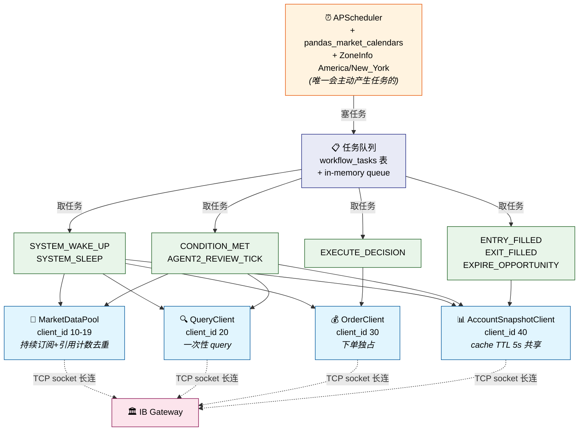
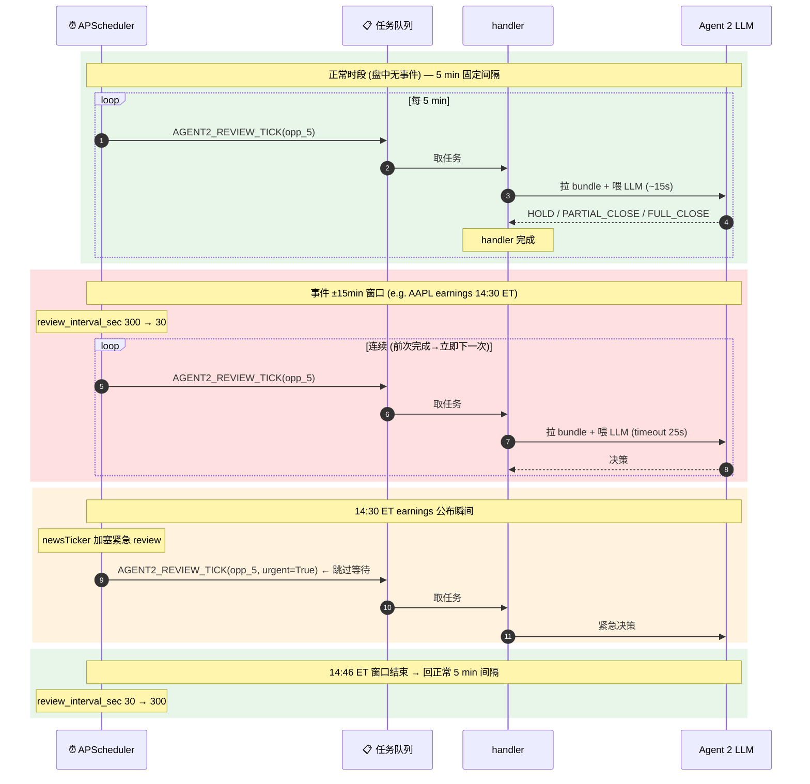
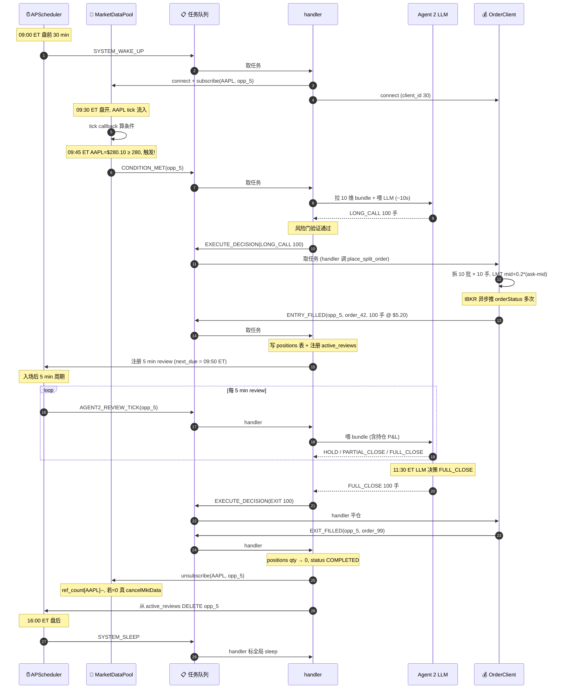

# ⭐ 北极星 §1 — 项目第一版目标

> **决策门禁**: 任何 spec / 功能规划 / "是否在 scope" 决策前先读此文档。任何字段、流程、维度变更回到此文档同步。
>
> 时间锚: 2026-05-06 (M3 UAT live 起, **2026-05-06 范式级架构梳理**)
>
> **架构怎么真实运转 (任务队列 / 4 Pool/Client / DB 5 类表 / 完整场景)** → ⭐ [架构通俗讲解 — 一个场景跑通整个系统](architecture-walkthrough.md)
>
> 数据样本: 来自 2026-05-06 真 <span class="term-service">IBKR</span> paper 账户实测 (AAPL, 美股盘中)。

---

## <span class="h-num">1.</span> 主用户 / 主入口 / 生产市场

| 项 | 内容 |
|---|---|
| 主用户 | 客户 (中文交互, 美股期权实盘, ~$2M RMB 量级) |
| 主入口 | 客户用自然语言中文提交交易意图 (前端 / API) |
| 生产市场 | 美股期权 (NYSE / NASDAQ / ARCA); ASX 仅开发测试; HK 不用 (跟美股市场差别太大) |

---

## <span class="h-num">2.</span> 系统构成 (2026-05-06 范式升级)

> 完整架构细节 → [架构通俗讲解](architecture-walkthrough.md)。本节只列高层骨架。

**系统真实只有 3 类东西** (取代旧"3 工人 actor" 视角):

1. **APScheduler** + pandas_market_calendars + ZoneInfo("America/New_York") — 时间排程, 唯一会主动产生任务的
2. **8 个 handler 函数** — 取任务 → 处理 → 可能塞新任务 (见 §11 event_type 表)
3. **4 个基础设施抽象 (Pool/Client)** — 屏蔽 <span class="term-service">IBKR</span> 细节, 业务代码**禁止**直接调 IBKR API (见 §12)

**"工人" 是 handler 逻辑分组, 不是独立 actor 进程**:

| "工人" 别名 | 实际是什么 |
|---|---|
| <span class="term-worker">时间工人</span> | APScheduler 排程逻辑 |
| <span class="term-worker">条件工人</span> | MarketDataPool 的 tick callback 里的条件计算逻辑 |
| <span class="term-worker">信息工人</span> | `CONDITION_MET` / `AGENT2_REVIEW_TICK` handler 里拉 bundle + 喂 LLM 的代码 |



> **完整一天典型流程示例** (AAPL 突破 280 买 100 手 call → 监控 → 入场 → 5 min review × N → 部分平仓 → 全平 → 取消订阅): 见 [⭐ 架构通俗讲解 §4 Step 0-9](architecture-walkthrough.md#h-num4-完整场景--aapl-突破-280-买-100-手-call) — 每一步在上图哪个组件发生的, 那里都标了。

**所有外部数据 / 操作都过 <span class="term-service">IB Gateway</span>**, 必走 4 个 Pool/Client 之一:

| 调用者 | 走哪个 Pool/Client |
|---|---|
| <span class="term-agent">Agent 1</span> 仓位↔金额转换 | AccountSnapshotClient |
| Dashboard 实时显示 | AccountSnapshotClient (cache TTL 5s 共享) |
| 条件工人 (tick callback 算条件) | MarketDataPool (push 模式) |
| 信息工人 (拉 10 维 bundle) | MarketDataPool + QueryClient + AccountSnapshotClient |
| <span class="term-agent">Agent 2</span> 下单 / 平仓 / 撤单 | OrderClient |

---

## <span class="h-num">3.</span> 调度时段 + 时间锚

系统不是永远在线, 工作时段 = 美股 (ASX 测试时是 ASX) **开盘前 30 min 至收盘**, 盘后睡眠。

**时间锚 (固定值)**:
- **09:00 ET** (regular session 开盘前 30 min) — APScheduler 触发 `SYSTEM_WAKE_UP` 任务
- **16:00 ET** (regular session 收盘) — APScheduler 触发 `SYSTEM_SLEEP` 任务

**调度机制锁定** (禁用裸 cron / systemd timer, 防 DST/节假日/早收市必漏):
- **APScheduler** (Python 应用内排程库)
- **pandas_market_calendars** (NYSE 准确日历, 含节假日 + 早收市 e.g. 圣诞前一天 13:00 ET)
- **ZoneInfo("America/New_York")** (Python 标准库时区, 自动处理 DST 切换)

**`SYSTEM_WAKE_UP` handler 干什么**:

1. 4 个 Pool/Client 全部 connect (建 long-lived TCP 连接到 IB Gateway, client_id 10/20/30/40)
2. 检查所有活跃<span class="term-state">机会单</span>的时间窗口, 已过截止日期 → `EXPIRE_OPPORTUNITY` 任务 → 转 <span class="term-state">失败单</span>
3. **重建数据获取** — 分两类:
    - **持续订阅** (MarketDataPool 遍历 ref_count > 0 的 symbol 全部 reqMktData resubscribe): 活跃<span class="term-state">机会单</span>涉及的标的 Level 1 quote / <span class="term-state">持仓单</span>的合约 quote + Greeks / 宏观 VIXY + SPY
    - **一次性 query 但每天重拉** (QueryClient): 历史 bar (MA20 需要前 19 天日 bar) / 期权链 metadata / 标的近期 N 根 bar
4. (handler 们自动开始消费任务, **不需要单独"唤醒条件/信息工人"** — 它们是 callback / handler 不是独立进程)

**Pool 自治重连**: 网络断 / IB Gateway 异常重启 / 周日维护后恢复 — Pool 内部 retry (指数退避 30s→1min→2min→5min→...) + 重连成功后自动遍历 ref_count > 0 全部 resubscribe + 通知业务层 "POOL_READY"。**业务层完全不感知连接事件**。

> **Pool 自治重连场景例**: 早上 09:30 ET 你忘了按手机 IBKey, IB Gateway 没启动。时间工人 09:00 ET 已塞 SYSTEM_WAKE_UP, MarketDataPool connect 失败 → 进 retry 循环。10:15 ET 你看到手机推送按确认, IB Gateway 上线。10:17 ET MarketDataPool 下次 retry 成功 → 自动 resubscribe 所有 ref_count > 0 的 symbol → 业务层正常恢复。**时间工人不需要重发 SYSTEM_WAKE_UP**。详见 [架构通俗讲解 §7 三类掉线 + 应对](architecture-walkthrough.md#h-num7-掉线了怎么办--3-类异常--应对)。

### 一日时间线

```mermaid
timeline
    title 一日工作时段 (NYSE regular session, ET 时区)
    08:00 ET (盘前 90 min) : APScheduler 进入待命
                            : (盘前到点前不主动调 IBKR)
    09:00 ET (盘前 30 min) : SYSTEM_WAKE_UP
                            : 4 Pool 全部 connect
                            : ref_count > 0 symbol 全部 resubscribe
                            : QueryClient 拉每日 MA20 等历史 bar
    09:30 ET (盘开)         : MarketDataPool 收 tick 流
                            : 条件工人 callback 自动算条件
                            : 满足条件 → CONDITION_MET → Agent 2 入场
    盘中持续                 : 每 5 min review 持仓 (正常时段)
                            : 事件 ±15 min 窗口 → 连续 loop (15-30s/轮)
                            : newsTicker 加塞紧急 review
    16:00 ET (盘后)         : SYSTEM_SLEEP
                            : 业务停 (active_reviews 表保留)
                            : 4 socket 等 IBGW 自动断
    05:30 ET 次日           : IB Gateway auto-restart
                            : oatworker daily 2FA 行为待实测
    周日 ET                  : IBKR 强制维护窗口
                            : 全部断, 必须手动 2FA
    周一 09:00 ET           : SYSTEM_WAKE_UP 循环开始
```

---

## <span class="h-num">4.</span> <span class="term-agent">Agent 1</span> — 解析 + validate

### 4.1 作用一: 解析 3 个关键信息

| 字段 | 必填? | 说明 |
|---|---|---|
| **symbol** (标的) | 必填 | LLM 能从中文公司名映射到代码 (如"特斯拉"→TSLA, "苹果"→AAPL); 真无法解析才阻塞 |
| **触发条件** | 必填 | 触发的就是 <span class="term-agent">Agent 2</span> 下单 |
| **direction** (方向) | 可 null | **看涨 / 看跌 / 看波动**; null 时 <span class="term-agent">Agent 2</span> 自由发挥, 非 null 时 <span class="term-agent">Agent 2</span> 必须严格遵守 (用户指定看波动 → LLM 自决用买波动还是卖波动策略) |

**触发条件 4 种** (本版本):

| 类型 | 说明 | 例子 |
|---|---|---|
| 立即单 | <span class="term-state">机会单</span>立即转下单 | "现在 AAPL 来个看涨价差 10 手" |
| 时间单 | 在某时间窗口内下单 | "明天下午盘 AAPL 来个 call" |
| 条件单 | 满足条件才下单。本版本仅 2 子类: ① **PRICE_BREACH** 价格突破固定值 ② **MA_CROSSOVER** 价格 vs 单条均线交叉 (含上穿/下穿方向) | "AAPL 突破 200 / 向上突破 MA20 / 跌破 MA20" |
| 时间+条件单 | 时间窗口起点后 + 条件满足 | "5 月 10 号后, AAPL 突破 200 下单" |

> 本版本不支持 (留 v2): 隐含波动率条件 / 成交量条件 / 双均线交叉 / 多条件组合 (and-or)
>
> 客户原话不止这 3 个信息 (可能含手数 / 止盈 / 止损暗示 / 策略偏好), **其他 <span class="term-agent">Agent 1</span> 不解析**。客户**完整原话**整段保存, <span class="term-agent">Agent 2</span> 决策时自己看原话。

### 4.2 作用二: validate 输入 + 阻塞

| 情况 | 行为 |
|---|---|
| symbol 无法解析 | 阻塞 |
| 触发条件缺失 | 阻塞 |
| **触发条件不在本版本范围** (如客户说"隐含波动率超 50%") | 阻塞 (本版本仅支持 PRICE_BREACH 常数 / MA_CROSSOVER 单 MA, 其他类型留 v2) |
| 仓位 (%) 和金额 ($) 同时指定 | 阻塞 (互链冲突, 一个推算另一个) |
| 仓位/金额都没指定 + 手数有指定 | 接受 |
| 仓位/金额/手数三者都没指定 | 默认 1 手, 通过 |

阻塞 → <span class="term-state">机会单</span>只能保存为 <span class="term-state">草稿</span>; **阻塞原因要展示给客户** (<span class="term-agent">Agent 1</span> 给出中文阻塞原因)。

---

## <span class="h-num">5.</span> <span class="term-agent">Agent 2</span> — 入场决策 + 仓位管理

<span class="term-agent">Agent 2</span> 是**无状态 LLM 调用**, 由 <span class="term-worker">信息工人</span>召唤。

### 5.1 入场决策 (<span class="term-worker">信息工人</span>第一次发 bundle)

LLM 输入 = **10 维 Bundle** (维度 1-9 都有值; 维度 10 "上次 summary" 在入场时为 null, 因为还没历史)

输出二选一:

- **不能下单** → <span class="term-state">机会单</span>转 <span class="term-state">失败单</span>, 失败原因 = "Agent-2 拒绝"
- **可以下单** → 给出策略 (含策略类型 / 腿 / 数量) → <span class="term-service">风险门</span> (risk_gate) 三验证 (symbol / direction / 仓位)
    - **三验证全过** → 下单 → 成功后转 <span class="term-state">持仓单</span>
    - **任一验证失败** (如 LLM 给的策略方向不符 opp.direction) → **要求 LLM 重跑一次** (给一次机会, prompt 提醒 LLM 上次违反了什么)
        - 重跑通过 → 下单 → <span class="term-state">持仓单</span>
        - **重跑仍违 → 转 <span class="term-state">失败单</span>**, 失败原因 = "Agent-2 风控不通过"

### 5.2 仓位管理 (<span class="term-state">持仓单</span>, 5 min/次 + 事件窗口连续 loop)

LLM 输入 = **10 维 Bundle** (此时维度 5 持仓盈亏已有值, 维度 10 上次 summary 也填了 — rolling summary 模式累积持仓上下文)

**Review 节奏分两档**:

| 时段 | review 间隔 | 实现 |
|---|---|---|
| **正常时段** | 5 min/次 (固定) | `active_reviews` 表 review_interval_sec = 300; APScheduler 每 ~10s 扫表 due 的 opp 塞 `AGENT2_REVIEW_TICK` 任务 |
| **事件熔断窗口** (earnings / CPI / FOMC ±15 min) | **连续 loop** (前次完成→立即下一次, 间隔由 LLM 决策延迟决定 ~15-30s/轮) | `active_reviews` 表 review_interval_sec = 30; 单次 review 全管道 timeout = 25s 超时跳过该轮; 窗口持续上限 60 min |
| **事件公布瞬间** | 立即加塞 | newsTicker callback 收到 earnings news → 立即塞一次 `AGENT2_REVIEW_TICK(opp_id, urgent=True)` 跳过等待 |

**为什么连续 loop 不写死间隔**: LLM 决策延迟 ~15-30s, 写死 30s 间隔 = 上一轮没出结果下一轮又开始, 重叠堆栈反而不稳。连续 loop = "前一次完成立即下一次", 节奏由实测延迟决定。

#### Review 节奏对比图



> **为什么 IV crush 5 min 才反应已亏 50%**: AAPL earnings 公布 1 min 内, IV 可能从 80% 掉到 30%, 持有的 LONG_STRADDLE 即使股价猜对方向也亏 50%+。**事件熔断窗口 = 期权买方在事件冲击时唯一的实时反应能力**。详见 [架构通俗讲解 §6](architecture-walkthrough.md#h-num6-5-min-review-循环-agent2_review_tick-handler)。

输出 = **本次 summary** (≤600 字, 含历史决策关键点 + 当前决策原因 + 用数据说话) + 三选一:

- **仓位不变** (不做任何操作)
- **加仓** (具体多少手 + 用什么策略买)
- **平仓** (平部分多少手 / 一次全平)

全部平仓完成 → <span class="term-state">持仓单</span>转 <span class="term-state">已完成单</span>。EXIT_FILLED handler 自动 unsubscribe 所有跟该 opp 相关的 MarketDataPool 订阅 (引用计数自动去重)。

### 5.3 客户不要止损 — LLM 自主决定平仓时机

期权买方 (买 call / 买 put / 买跨式 / 买勒式) **天然有亏损上限** = 入场时付的权利金, 不会爆仓。所以本系统**不设固定止损线**:

- 不像股票那样"跌破 $X 自动平仓"
- 不像期货那样"亏 N% 强制止损"
- 平仓时机完全由 <span class="term-agent">Agent 2</span> LLM 综合判断 (达到客户目标 / 市场反转明显 / 临近到期等), **不让客户在入场时定死止损价位**

客户认可最坏情况 = 权利金亏光, 这是期权买方的天然风险界限。

---

## <span class="h-num">6.</span> 4 种触发流程串联

```
1. 立即单:    Agent 1 → 时间工人 (now 立即) → 信息工人 → Agent 2 → IBKR 下单
2. 时间单:    Agent 1 → 时间工人 (到起点) → 信息工人 → Agent 2 → IBKR 下单
3. 条件单:    Agent 1 → 条件工人 → (满足) → 信息工人 → Agent 2 → IBKR 下单
4. 时间+条件: Agent 1 → 时间工人 (到起点) → 条件工人 → (满足) → 信息工人 → Agent 2 → IBKR 下单
```

---

## <span class="h-num">7.</span> <span class="term-state">机会单</span>状态机

```
[草稿]  ──客户确认──→  [机会单]  ──注册工人──┐
                                                  ↓
                                ┌─Agent 2 拒绝──→ [失败单]
                                ├─风控重试仍违──→ [失败单]
                                ├─时间窗口过期──→ [失败单]
                                └─下单成功─────→ [持仓单]
                                                  ↓
                                          信息工人每 5 min
                                       Agent 2 平仓/加仓决策
                                                  ↓
                                              全部平仓
                                                  ↓
                                              [已完成单]
```

---

## <span class="h-num">8.</span> 10 维 Bundle 详表

**入场和持仓 review 都用 10 维**, schema 永远 10 维。区别只在某些维度 entry phase 时为 null (因为还没发生):

- **入场**: 维度 5 (持仓盈亏) 为 null (还没持仓); 维度 10 (上次 summary) 为 null (还没历史)
- **持仓 review**: 10 维都有值

数据样本来自 2026-05-06 真 <span class="term-service">IBKR</span> paper 实测 (AAPL, 美股盘中, 真下 100 手 ATM LONG_CALL + 自动平仓)。

| # | 维度 | 入场拉法 | 持仓 review 拉法 | JSON 格式和解释 | 实际样本和解释 | 业务解释 + 为什么对仓位管理重要 |
|---|---|---|---|---|---|---|
| 1 | **客户原话** | DB 静态读 | DB 静态读 | `string` (一段中文文本, 客户原文) | `"AAPL 突破 285 就买 call, 100 手, 赚 60% 出"` — 客户的真实意图原话 | 客户的真实意图 + <span class="term-agent">Agent 1</span> 没解析的偏好 (如止盈暗示 "赚 60% 出" / 策略偏好); LLM 仓位管理时也看, 决定按客户原意是否平仓 |
| 2 | **标的 Level 1 quote** | `reqMktData(snapshot=True)` 一次 | 持续订阅 streaming, 取 latest | `{bid, ask, last, bid_size, ask_size, last_size, volume}` 全 float/int<br>**mid = (bid+ask)/2** 是常用估值 | `bid=283.94 ask=283.96 last=283.95 volume=691373` — 价差 2 分流动性好, mid≈$283.95 | 实时市场报价; 算未实现盈亏 / 距 TP 多远 / 当前流动性是否健康 |
| 3 | **标的近期 bar** | `reqHistoricalData` 一次 (1 min × 1 D + 5 min × 5 D + 1 day × 20 D) | 增量拉新 bar | `{1m_1D: [bar...], 5m_5D: [bar...], 1d_20D: [bar...]}`<br>每根 bar = `{date, open, high, low, close, volume}`<br>**OHLCV** = 开/高/低/收/成交量 | `1 min × 1 D = 307 根, 1 day × 20 D = 20 根; 第 1 根: {open:276.92, high:277.87, low:276.5, close:277.13, volume:19227}` | 各时间尺度的价格趋势; 趋势是否符合入场预期, 决定持仓 / 加仓 / 平仓 |
| 4 | **期权链 metadata** | `reqSecDefOptParams` 一次 | 跨日重拉 (新合约上市/老到期) | `{expiries_count, strikes_count, expiries: [YYYYMMDD,...], strikes: [float,...], target_in_chain: bool}`<br>**expiries** = 到期日列表; **strikes** = 行权价列表 | `25 expiries (20260506→20260918) × 116 strikes; AAPL 285 strike 在链中 ✓` | 该 symbol 当前所有可交易合约清单; review 时调仓 (加仓不同 strike/expiry) 从此清单选 |
| 5 | **持仓盈亏快照** (派生) | entry 没持仓 → null | `reqPositions` + `reqMktData` 算 mid → 派生 | `{raw_avg_cost_per_contract, quantity_contracts, total_cost_basis_usd, current_mid_per_share, total_current_value_usd, unrealized_pnl_usd, unrealized_pnl_pct}`<br>**avg_cost** = <span class="term-service">IBKR</span> 每张合约平均成本 (含 multiplier 100); **cost_basis** = 入场总成本; **value** = 当前总市值; **pnl** = 差值 | `cost=$95,544.90 / value=$94,750 / pnl=-$794.90 (-0.83%)` — 入场即 -0.83% 是 bid-ask spread 必然 | 持仓真实财务状态; LLM 直接看到亏损/盈利%, 决定该不该止盈 / 调仓 |
| 6 | **持仓 Greeks** | 候选 ATM ± k strike snapshot | 持续订阅 (跟 quote 一起推) | `{iv, delta, gamma, theta, vega, opt_price}` 全 float<br>**IV** = 隐含波动率 (0.243=24.3%); **Δ** = 标的涨1美元期权变多少; **Γ** = Δ自身变化速度; **Θ** = 时间价值/天 流失 (负数); **V** = IV 涨1% 期权变多少 | `IV=24.3% Δ=0.52 Γ=0.017 Θ=-$0.125 V=0.393 opt_price=$9.55` — 合理 ATM 水平 | 期权对标的价/时间/IV 敏感度; Θ 大 → 临到期前考虑平; V 大 → IV 涨跌敏感; Δ 反映方向暴露 |
| 7 | **IV 曲面** | 派生自 4+6 (一次性) | 几分钟更新 | `{atm_strike, iv_by_strike_call: {strike: iv}, iv_by_strike_put: {strike: iv}, skew_summary, term_structure_summary}`<br>**skew** = 横向 (不同 strike 的 IV 形状); **term** = 纵向 (不同 expiry 的 IV 形状) | `ATM=$285, ±10 档 5 strikes 各 C/P = 10 合约; OTM put 略高 ATM 1.5 vol pts (常态)` | 当前 IV 高估/低估; skew 大 = 恐慌可能反转 → 决定是否离场 |
| 8 | **Order flow** | 派生自合约链 (一次性) | 几分钟更新 | `{call_volume_total, put_volume_total, call_put_volume_ratio, call_oi_total, put_oi_total, call_put_oi_ratio, interpretation}`<br>**OI** = 持仓量 open interest; **ratio** = call/put | `call_vol=14761 / put_vol=1768 / ratio=8.35` — 强看涨情绪 (跟当日涨势一致) | 期权市场情绪指标; ratio 极端 (>5 或 <0.2) 常预示反转 → 决定是否减仓避险 |
| 9 | **市场宏观** | snapshot 一次 | 持续订阅 | `{VIXY: {bid, ask, last, volume, interpretation}, SPY: {...}}`<br>**VIXY** = ProShares VIX Short-Term Futures ETF (paper 没 CBOE Index 用 ETF 替代); **SPY** = S&P 500 ETF (大盘) | `VIXY $27.29 (低位 = 市场情绪平稳)` + `SPY $724.39 (大盘强势)` | 整体市场恐慌 + 大盘走势; 单标的决策应否被宏观风险压倒 (VIX 飙升时主动减仓) |
| 10 | **上次 summary** | entry 没历史 → null | DB 取上次 LLM 输出 | `string ≤600 字 或 null` (一段文本) | 文本含上次决策关键点 + 当前决策原因 + 用数据说话 | 历史决策上下文; 防 review 之间剧烈摇摆 (上次 HOLD 这次突然 FULL_CLOSE 没理由), 决策连贯 |

### 完整 Bundle JSON 样本 (<span class="term-state">持仓单</span> review phase, 10 维齐全)

```json
{
  "dim_1_customer_raw_text": "AAPL 突破 285 就买 call, 100 手, 赚 60% 出",

  "dim_2_underlying_quote": {
    "symbol": "AAPL",
    "bid": 283.94, "bid_size": 1,
    "ask": 283.96, "ask_size": 4,
    "last": 283.95, "last_size": 13,
    "volume": 691373,
    "as_of": "2026-05-06T18:52:00Z"
  },

  "dim_3_underlying_bars": {
    "1m_1D": [
      {"date": "20260506 01:30:00", "open": 276.92, "high": 277.87, "low": 276.50, "close": 277.13, "volume": 19227},
      "... 305 more bars ..."
    ],
    "5m_5D": "... 369 bars ...",
    "1d_20D": [
      {"date": "20260408", "open": 258.40, "high": 259.75, "low": 256.53, "close": 258.90, "volume": 502278},
      "... 19 more bars ..."
    ]
  },

  "dim_4_option_chain_metadata": {
    "expiries_count": 25,
    "strikes_count": 116,
    "expiries_sample": ["20260506", "20260508", "20260511", "20260513", "20260515", "20260618"],
    "target_expiry_in_chain": true
  },

  "dim_5_position_pnl_snapshot": {
    "raw_avg_cost_per_contract": 955.45,
    "quantity_contracts": 100,
    "total_cost_basis_usd": 95544.90,
    "current_mid_per_share": 9.475,
    "current_value_per_contract_usd": 947.50,
    "total_current_value_usd": 94750.00,
    "unrealized_pnl_usd": -794.90,
    "unrealized_pnl_pct": -0.83
  },

  "dim_6_position_greeks": {
    "atm_strike": 285,
    "expiry": "20260618",
    "iv": 0.243,
    "delta": 0.517,
    "gamma": 0.0167,
    "theta": -0.125,
    "vega": 0.393,
    "opt_price": 9.55
  },

  "dim_7_iv_surface": {
    "atm_strike": 285,
    "strikes_tested": [275, 280, 285, 290, 295],
    "iv_by_strike_call": {"275": 0.215, "280": 0.227, "285": 0.243, "290": 0.250, "295": 0.260},
    "iv_by_strike_put": {"275": 0.231, "280": 0.234, "285": 0.241, "290": 0.244, "295": 0.237},
    "skew_summary": "OTM put 略高于 ATM 约 1.5 vol pts (常态)",
    "term_structure_summary": "前端 IV 略高于后端 (无明显 contango)"
  },

  "dim_8_order_flow": {
    "call_volume_total": 14761,
    "put_volume_total": 1768,
    "call_put_volume_ratio": 8.35,
    "call_oi_total": 234567,
    "put_oi_total": 89012,
    "call_put_oi_ratio": 2.63,
    "interpretation": "强看涨情绪 (CV/PV 8.35), 跟当日涨势一致"
  },

  "dim_9_macro": {
    "VIXY": {"bid": 27.28, "ask": 27.29, "last": 27.29, "volume": 9793, "interpretation": "低位, 市场情绪平稳"},
    "SPY": {"bid": 724.38, "ask": 724.40, "last": 724.39, "volume": 518886, "interpretation": "大盘强势"}
  },

  "dim_10_last_summary": "上次 review (5 min 前) 决策 HOLD。理由: 持仓 AAPL 285C × 100 手, mid 跌 0.83% 主因开仓 spread 已被消化。当前 underlying $283.95 距 ATM $1 内, Δ 0.52 暴露看涨意图; Θ -$0.125/天 时间价值流失温和。客户原话明确'赚 60% 出', 当前 -0.83% 远未到目标。VIXY 低位 + CP ratio 8.35 强看涨情绪, 维持原计划。"
}
```

### 一个完整端到端示例

**客户输入** (前端): `"AAPL 突破 285 就买 call, 100 手, 赚 60% 出"`

**1. <span class="term-agent">Agent 1</span> 派活**:

- symbol: AAPL ✓
- 触发条件: PRICE_BREACH (level=285, direction=ABOVE) ✓ (在本版本支持范围内)
- direction: BULLISH ✓
- 仓位/金额/手数: 客户指定 100 手, 通过
- validate: 通过, 进 <span class="term-state">机会单</span>

**2. server compile** 入库, 注册 <span class="term-worker">时间工人</span> 立即激活

**3. <span class="term-worker">条件工人</span>**:

- <span class="term-service">MarketDataBus</span> 订阅 AAPL Level 1
- 每 tick 检查 `latest_price > 285`
- 假设 09:42 (ET) AAPL 涨到 $285.15 → 触发
- 唤醒 <span class="term-worker">信息工人</span>, 传 metadata: `{event:"PRICE_BREACH", price:285.15, at:"...09:42:13Z"}`
- 自己结束 (一次性触发)

**4. <span class="term-worker">信息工人</span> (entry phase)**:

- 拉 10 维 bundle (维度 5 持仓盈亏 + 维度 10 上次 summary 此时为 null)
- 调 <span class="term-agent">Agent 2</span> LLM

**5. <span class="term-agent">Agent 2</span> entry 决策**:

- 看 10 维信息, 遵守标的、仓位和方向门禁下单
- LLM 输出: `{strategy: "LONG_CALL", legs: [{symbol:"AAPL", expiry:"20260618", strike:285, right:"C", quantity:100, action:"BUY"}], thesis_summary: "客户突破 285 入场, IV 24% 合理, CP ratio 8.35 强看涨, 选 ATM call 一致看涨意图"}`
- <span class="term-service">风险门</span>三验证: symbol=AAPL ✓ / direction LONG_CALL→BULLISH ✓ / 仓位 100 手 ≤ 客户指定 ✓ → 通过
- 下单 LMT @ ask = $9.55

**6. 下单成功 → 转 <span class="term-state">持仓单</span>**, 注册 5 min review self-loop

**7. 5 min 后, <span class="term-worker">信息工人</span> review phase**:

- 拉完整 10 维 bundle (此时维度 5 持仓盈亏 + 维度 10 上次 summary 都填了)
- 调 <span class="term-agent">Agent 2</span> LLM
- LLM 输出: `{decision: "HOLD", new_summary: "...", reason: "未实现 -0.83% 远未到 60% 目标, 趋势没反转, 维持持仓"}`
- 持仓不动, 下次 review 用本次 summary

**8. 反复 review**, 直到 LLM 决策"平仓" → SELL 100 LMT → <span class="term-state">持仓单</span>转 <span class="term-state">已完成单</span>

---

## <span class="h-num">9.</span> 方向策略白名单 (无裸卖空, 共 12 种, 2026-05-06 加 CALENDAR/DIAGONAL)

| 方向 | 允许策略 | 备注 |
|---|---|---|
| BULLISH (看涨) | LONG_CALL / BULL_CALL_SPREAD / BULL_PUT_SPREAD (有保护) | 共 3 种 |
| BEARISH (看跌) | LONG_PUT / BEAR_PUT_SPREAD / BEAR_CALL_SPREAD (有保护) | 共 3 种 |
| VOLATILITY (看波动 / 时间价值) | LONG_STRADDLE / LONG_STRANGLE / IRON_CONDOR / IRON_BUTTERFLY / **CALENDAR_SPREAD** / **DIAGONAL_SPREAD** | 共 6 种; LONG_* 买波动, IRON_* 卖波动有保护, CALENDAR/DIAGONAL 赚时间价值 (中文客户讲"earnings play 不押方向"用) |
| null (用户未指定) | 上面 12 种全可 | LLM 完全自由发挥 |

> **裸卖空** (SHORT_CALL / SHORT_PUT / SHORT_STRADDLE / SHORT_STRANGLE 等亏损无底线策略) **永久禁止**。LLM 输出 schema 物理上无法生成 (Structured Outputs enum 限制), 不依赖 LLM 自律。

> CALENDAR_SPREAD = 同 strike 不同 expiry, 卖近月买远月; DIAGONAL_SPREAD = 不同 strike + 不同 expiry。**都是净 debit 有限亏, 非裸卖空**。

> **4 腿策略流动性约束** (IRON_CONDOR / IRON_BUTTERFLY): 100+ 手量级 BAG combo 撮合需全腿同时 fill, 大单经常部分成交→暴露裸腿。**仅限 SPY / QQQ / IWM 等 top 10 高流动性标的 + 单腿 OI ≥ 500 contracts**; 其他标的 Agent 2 自动降级 SPREAD (2 腿)。

> 总计 **12 种**白名单策略。

---

## <span class="h-num">10.</span> 4 个基础设施抽象 (Pool/Client) + client_id 段位

完整工作机制 → [架构通俗讲解 §3 + §4](architecture-walkthrough.md)。本节列高层骨架。

| Pool/Client | client_id 段位 | 职责 | 模式 |
|---|---|---|---|
| **MarketDataPool** | 10-19 | 持续订阅市场数据, **引用计数去重** + cache 最新值 | Push (tick callback) + Pull (get_latest cache) |
| **QueryClient** | 20 | 一次性 query (历史 bar / 期权链 / contract details) | Pull |
| **OrderClient** | 30 | 下单 / 撤单 / 修改, **独占防订单状态混乱** | Push (orderStatus stream) + Pull (placeOrder) |
| **AccountSnapshotClient** | 40 | 账户余额 / 持仓 / 订单状态, **cache TTL 5 秒共享** | Pull |
| (临时 ad-hoc 脚本) | 90+ | cancel_all / 调试 | 短连 |

**典型使用场景** (具体细节 → [架构通俗讲解 §3](architecture-walkthrough.md#h-num3-4-个基础设施抽象-poolclient)):

- **MarketDataPool 例**: opp #5 (AAPL 看涨) 和 opp #6 (AAPL 看跌) 都要订阅 AAPL spot 价 → Pool 内部 `ref_count[AAPL] = 2`, 但 IBKR 只发一次 `reqMktData(AAPL)`, 两个 callback 共享同一 stream。opp #5 平仓 → ref_count → 1, 仍订阅; opp #6 也平仓 → ref_count → 0 → 真 cancelMktData。
- **QueryClient 例**: 时间工人盘前 30 min 触发 `SYSTEM_WAKE_UP` 时, 调 `req_historical_bars(AAPL, '1d', 19)` 拉 MA20 计算用; Agent 1 解析时调 `req_contract_details(AAPL)` 验证 symbol 存在。**一问一答, 不持续推**。
- **OrderClient 例**: Agent 2 输出 `LONG_CALL 100 手` → handler 调 `place_split_order(...)` → OrderClient 内部拆 10×10 batch + LMT mid 定价 + 间隔 8s; 期间 IBKR 推 `orderStatus` 多次 (SUBMITTED → PARTIAL_FILLED → FILLED), Order Client 累计塞 ENTRY_FILLED 任务到队列。**所有下单走它独占, 防全局订单状态混乱**。
- **AccountSnapshotClient 例**: Dashboard 每秒刷一次持仓 + Agent 2 review 每 5 min 拉持仓 + Agent 1 校验仓位金额 — **3 个消费者 5 秒内共享 1 次 IBKR 调用** (cache TTL 5s)。下单成交后 handler 调 `invalidate_cache()` 强制下次重拉, 防 stale。

**铁律**: 业务代码**禁止**直接调 `ibkr.reqMktData / reqPositions / placeOrder` 等 IBKR API。所有 IBKR 操作必走 4 个抽象之一。**理由**: 引用计数去重 + cache TTL + 重连屏蔽 + 限流配额 全在 Pool 层, 散落调 = 把 forward compat hook 全踩坏。

---

## <span class="h-num">11.</span> 8 种 event_type (任务队列里所有任务类型)

| event_type | 谁触发 | 谁消费 |
|---|---|---|
| `SYSTEM_WAKE_UP` | APScheduler (09:00 ET 盘前 30 min) | 全局 (Pool 重连 + 重订阅) |
| `SYSTEM_SLEEP` | APScheduler (16:00 ET 盘后) | 全局 (停 active_reviews) |
| `CONDITION_MET(opp_id)` | MarketDataPool tick callback | 业务逻辑 → Agent 2 入场决策 |
| `AGENT2_REVIEW_TICK(opp_id)` | APScheduler (5 min 周期 / 事件窗口连续 / newsTicker 加塞) | 信息工人逻辑 → Agent 2 LLM |
| `EXECUTE_DECISION(decision)` | CONDITION_MET / AGENT2_REVIEW_TICK handler (Agent 2 输出+风险门通过后) | OrderClient |
| `ENTRY_FILLED(opp_id, order_id)` | OrderClient orderStatus callback (累计 FILLED) | 业务逻辑 → 写持仓 + 启动 review |
| `EXIT_FILLED(opp_id, order_id)` | 同上 | 业务逻辑 → 减持仓 / 全平归档 + 取消订阅 |
| `EXPIRE_OPPORTUNITY(opp_id)` | APScheduler (`effective_until` 到点) | 业务逻辑 → 标 FAILED |

**任务队列必持久化** (`workflow_tasks` 表) — 崩溃恢复扫 PENDING/RUNNING > 60s 重做; handler 必 idempotent。

### 完整事件流转例: AAPL 突破 280 买 100 手 call



> 完整文字版步骤 (含 4 Pool/Client 具体调用 + DB 表读写) → [架构通俗讲解 §4 Step 0-9](architecture-walkthrough.md#h-num4-完整场景--aapl-突破-280-买-100-手-call)。

---

## <span class="h-num">12.</span> 3 IBKR username 架构

| username | 账户 | 用途 | 部署在 |
|---|---|---|---|
| **USER_A** | paper | 开发 / 测试 / CI | cloud-dev + UAT |
| **USER_B** (= oatworker) | live | **程序独占 IB Gateway**, 跑 4 个 Pool/Client + 8 handler + 下单 | PROD |
| **USER_C** | live | **客户用 TWS / 手机 app 自己监控**, 不下单 | 客户本地 |

**约束**:
- USER_B 和 USER_C 共享同一个 live 账户的资金 / 持仓 (IBKR 多 username 机制), 同时连不互踢
- **paper+live 永远是切 username (A↔B), 不是单 username 内切模式** — 同 username 同时连 paper+live 必互踢
- USER_B (oatworker) 在 IB Gateway daily 05:30-06:00 ET auto-restart 是否需要 2FA **待实测** (周日维护窗口必需 2FA 已知)

---

## <span class="h-num">13.</span> 并发上限 + 数据成本

| 指标 | 上限 | 备注 |
|---|---|---|
| **持仓数量** | **3-5 个** | 吃资金 (~$2M RMB 账户保 30% buffer 防 margin call) |
| **机会单总数** | **20-30 个** | 含监控中未触发, 不吃资金, 只吃 IBKR 100 stream 配额, MarketDataPool 引用计数自动去重 |
| **IBKR client_id** | 32 (上限) | 我们仅用 5 个长连, 完全用不完 |

**数据订阅成本** = 走 IBKR packet 包 (客户已签 ~$35/月覆盖 OPRA + Level 1 + Reuters Basic), **达交易量豁免**。**北极星不写绝对数字**, 实际成本以客户当前订阅为准。不另接第三方除非 IBKR 不覆盖。

---

## <span class="h-num">14.</span> 分批下单 + Adaptive 算法 (本期 ship)

大单滑点是先决条件, 不是后期优化:

- 单仓位 ≥ 50 手必拆 (< 50 手整单)
- 单腿策略 (LONG_CALL / LONG_PUT) → IBKR Adaptive Algorithm (`order.algoStrategy="Adaptive"`)
- 多腿策略 (BULL_CALL_SPREAD / IRON_CONDOR 等 BAG combo) → 自实现拆腿挂单 + 4 档 spread_ratio (patient 0.2 / normal 0.3 / urgent 0.7 / market) 调价循环 (IBKR Adaptive **不支持** combo)
- 默认 batch_size = 10 / interval_sec = 8 / 起步 patient

---

## <span class="h-num">15.</span> 维护规则

- 任何 invariant / 字段 / 流程 / 维度变更 → 同步本文档
- 数据样本季度 refresh 一次 (跑 phase1 probe 脚本即可)
- 关联文档:
    - **⭐ [架构通俗讲解](architecture-walkthrough.md)** — 任务队列 / Pool/Client / DB 5 类表 / 完整场景 (新读者必看)
    - 项目内 brainstorming 归档: `docs/superpowers/discussions/2026-05-05-north-star-section1-brainstorming.md`
    - 北极星 §2-§7 (远景 / 5 问 / 中间路径 / forward compat / 历史决策 / 反偏离): memory `project_vision_and_north_star.md`

---

**END OF NORTH STAR §1**
